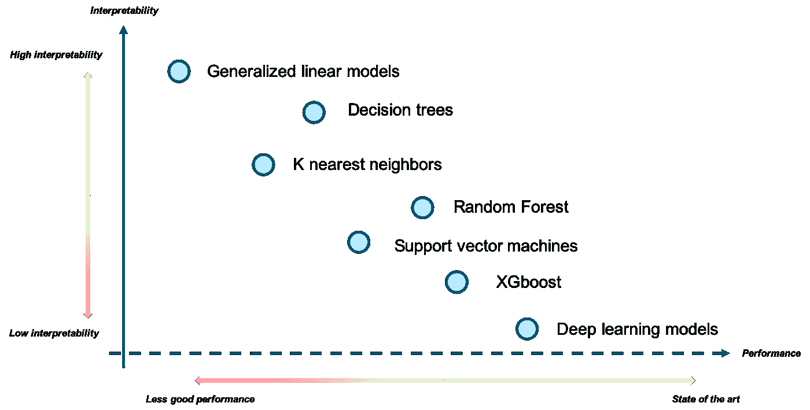
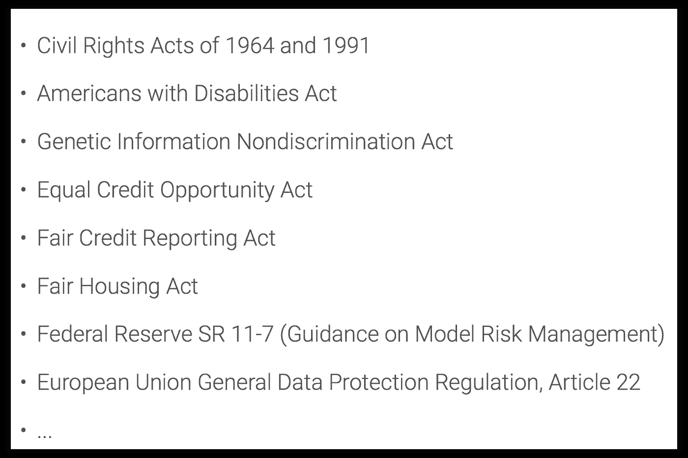
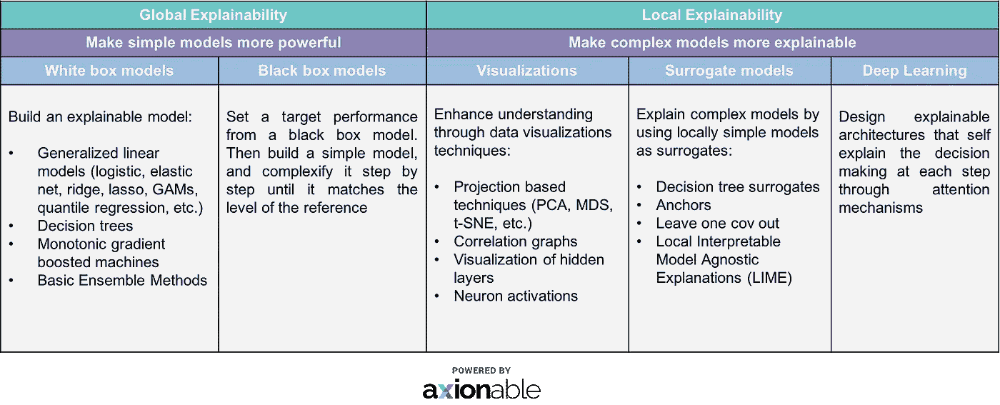

# 可解释人工智能:数据科学家的新挑战

> 原文：<https://towardsdatascience.com/explainable-ai-the-data-scientists-new-challenge-f7cac935a5b4?source=collection_archive---------3----------------------->

**作者:** [拉明·迪奥普](https://medium.com/@lamine.diop)和[让·库佩](https://medium.com/@jean.cupe)

在我们开始之前，让我提一下，在这篇文章中，我将使用可解释性和可解释性这两个词来描述同一个概念。

也就是说，让我们想象一下这样一种情况，有人要求银行贷款，而由信贷风险评估中专门的*机器学习*算法驱动的计算机拒绝了这一要求。雇员无法解释这样一个明确的答案的原因，肯定会被留在一个非常尴尬的位置。

在机器学习的进步正在到达医学、刑事司法系统和金融市场等关键领域的背景下，这种情况肯定会更加频繁。事实上，人们越来越担心人工智能代理的可接受性和信任问题，因为它们缺乏可解释性。多年来，性能优先于可解释性，导致了包括计算机视觉、自然语言处理和序列建模在内的几个领域的巨大进步。然而，由不愿接受基于人工智能的决策所驱动的关键问题可能会导致一种全新的动态，其中可解释性可能是评估模型的关键措施之一。在本文中，我将讨论一些具体的原因，为什么它会是一个主要的区别。还将提出一些方法来开发强大的算法，同时保持良好的可解释性。

> "有一个精确的模型是好的，但是解释导致更好的产品. "

数据科学的进步一直是由寻找解决任何问题的最佳性能模型推动的。从数学的角度来看，模型的搜索集中于成本函数的最小化或似然函数的最大化。因此，模型的性能几乎完全是根据我们根据一些正确选择的度量标准得到的结果来衡量的。这种趋势导致了越来越复杂的算法，以牺牲可解释性为代价。事实上，一些数据科学家甚至可能断言 ***“让机器学习算法难以理解的东西也是让它们成为优秀预测者的东西”*** 。它们很复杂，这就是为什么对大多数领域从业者来说，它们看起来像***【黑盒】*** 。

Interpretability vs performance seen through machine learning techniques **(non exhaustive)**

上图描绘了机器学习算法的两个可解释性级别:

*   **高解释性:**这一层包括传统的*回归算法(例如线性模型)、决策树以及分类规则*。基本上它们近似*单调线性函数。*
*   **可解释性低:**这个级别包括高级机器学习技术，如*支持向量机、高级集成方法和深度学习*。他们复杂的谎言

在这两者之间，你可以找到一些方法，根据学习过程中应用的约束，这些方法可以被归入任何一类(单调性约束可以应用于集成方法，并且一些实现已经可用)。

可解释性是对人类观察者理解模型所做预测背后的原因的程度的衡量，在准确性之间找到正确的平衡变得越来越有必要。这可能是让算法对日常用户尽可能透明的关键。这种对 ***【以用户为中心】*** 的关注点的改变，可能会对该技术在各种领域的应用和接受产生影响，使他们能够更舒适地适应以更现实的方式执行任务。

尽管应用机器学习的许多核心方面在不同领域都是相同的，但它们不能应用于每个行业。机器学习方法非常不同，特别是在银行、保险公司、医疗保健提供商和其他受监管的行业。原因主要是他们倾向于**法律甚至伦理要求**，这些要求倾向于越来越多地限制黑盒模型的使用。作为一个例子，我可以列举公平信用报告法案第 609(f)(1)条

> 应向消费者提供在所用模型中对消费者信用评分产生不利影响的所有关键因素，其总数不得超过 4 个

最重要的是，这显然意味着人们应该提供关于如何获得模型响应的见解。直接后果是将可能方法的范围缩小到最简单的方法，因为它们易于解释，除非我们找到方法将上下文添加到最先进算法的预测中。

更不用说，这种趋势更多的是加强监管约束，而不是减缓监管约束。

An ever growing list of legal and ethical considerations surrounding businesses

所有这些因素都在很大程度上导致了行业普遍不愿意采用和部署由机器学习系统驱动的高级数据产品。面对这样的限制，研究越来越多地集中于确定处理模型可解释性的方法。

据我所知，实现模型可解释性的途径主要有两种:***和** ***局部可解释*** 。前者旨在使整个决策过程完全透明和全面，而后者侧重于为每个决策提供解释。*

> *“当我们开始一个数据科学项目时，现在的最佳做法可能是首先确定我们希望达到的可解释性程度。”*

*事实上，首先决定可解释性的程度将指导我们选择可能实现的算法和技术。具体来说，这意味着是选择一个简单的模型并使其更加强大(以实现*全局可解释性*)，还是使用一个我们可以使其更加可解释的复杂模型(以至少实现*局部可解释性*)。下表呈现了一个**-****的详尽列表*** 的技巧处理模型的可解释性。**

****

**也许你已经注意到局部可解释性比全局可解释性有更多的细节。这主要是由于在解释复杂模型方面所做的巨大努力，但是采用了局部边界方法。**

**最后，当我们用正确的方法实现我们的算法时，最后的问题在于如何评估模型的可解释性。有两种方法可以更好地表示最终模型所赋予的理解程度:**

*   ****模拟具有已知特征和内在含义的数据**，以对抗模型对我们在该上下文中已有先验知识的解释。**
*   ****测试数据扰动下的稳定性**在显式变量中加入少量噪声。可信的解释可能不会因为微小的变化而发生剧烈的变化。**

**希望您在这个非常重要的*“最近”*关注点的旅途中过得愉快。如果您有任何问题或意见，我将很高兴欢迎进一步讨论。在我的下一篇文章中，我将通过一个真实世界的用例来直接解决这个问题，以便更好地理解上面的所有含义。**

**如果需要进一步的阅读资料，请不要犹豫参考下面的链接。**

**我还要感谢对本文做出贡献的同事们[何塞·桑切斯](https://medium.com/@jose_sanchez)、[纳尔逊·费尔南德斯](https://medium.com/@nelson.fernandez)、[西蒙·帕尔马](https://medium.com/@simon.palma)。**

> **[https://www . oreilly . com/ideas/predictive-modeling-striking-a balance-in-accuracy-and-interpretative-ability](https://www.oreilly.com/ideas/predictive-modeling-striking-a-balance-between-accuracy-and-interpretability)**
> 
> **https://arxiv.org/pdf/1606.03490.pdf**
> 
> **【https://distill.pub/2018/building-blocks/ **
> 
> **Navdeep Gill 和 Patrick Hall 的《机器学习可解释性简介》**