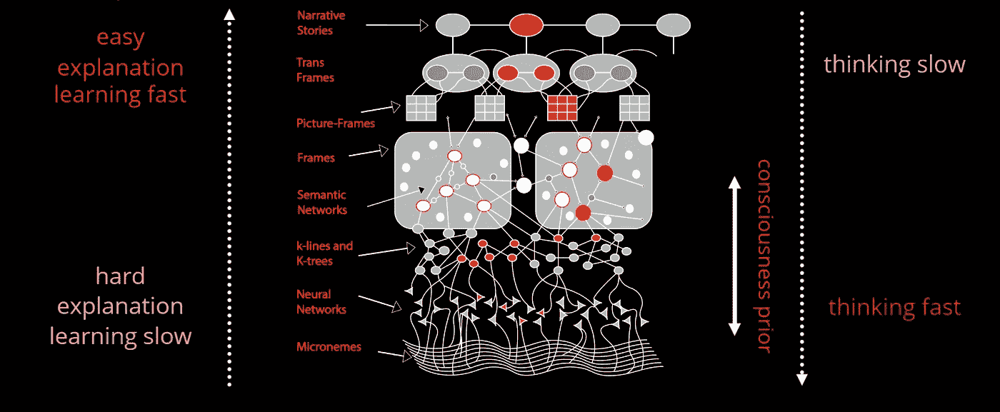
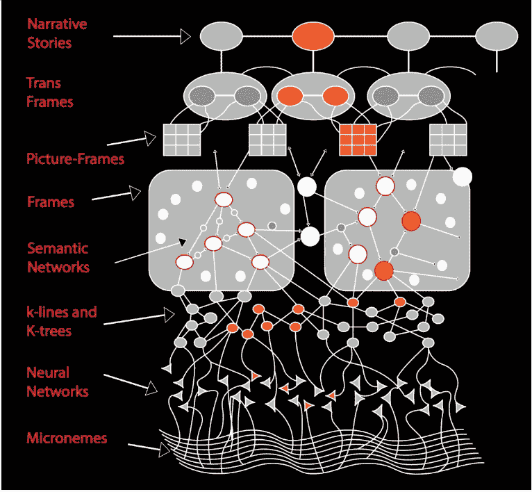

# 可解释的人工智能与解释人工智能——第一部分

> 原文：<https://towardsdatascience.com/explainable-ai-vs-explaining-ai-part-1-d39ea5053347?source=collection_archive---------13----------------------->

## 深度学习够深吗？

Framework of Explainable Deep Learning, source Society of Mind (Marvin Minskey)

尽管最近深度学习(DL)取得了显著的成果，但由于欠拟合、过拟合或不完整的训练数据等几个原因，它总是存在产生妄想和不切实际的结果的风险。例如，职业围棋选手 Lee Sedol 的著名棋步 78 导致了 Alpha Go 的妄想行为、对抗性攻击以及 DeepXplore 在 Nvidia DAVE-2 自动驾驶汽车平台中发现的错误行为，其中系统决定对同一输入图像做出两种不同的决定，唯一的区别是亮度级别。这些例子推动人工智能研究人员更加专注于打开深度学习的黑匣子，避免只依赖模型的准确性。

前一段时间，我在为非人工智能职业准备一个关于人工智能状态的研讨会。由于人工智能目前是一个流行词，并且流行词通常有很多定义，我不得不选择一个。人工的定义很清楚，但是智能呢？我搜索并找到了马文·明斯基对人工智能最合理和相关的定义:

> 我们的**模型**包含**过程**，使我们能够解决我们认为**困难**的问题。
> 
> “黑盒”是那些我们还不了解的过程的名称。

实际上，这是这个定义的修改版本，我用“黑盒”代替了“智能”，用“模型”代替了“头脑”虽然我已经改变了它，但定义仍然成立。

这些论点告诉我们这些事情:a)黑盒和智能是一样的，b)复杂的问题需要复杂的解决方案，c)简单、可理解的过程很可能不适合复杂的问题，如自动驾驶汽车和机器翻译，以及 d)盒子越暗，它就越智能。

> 因此，当我们要求深度学习科学家打开黑盒时，这可能意味着限制模型能力。

但是真的吗？

人类大脑中的大多数过程都是模糊的，我们不理解它们，这是正确的，但我们仍然可以解释我们的决定和想法。我们的解释通常由陈述和理由组成。我们的讲解不涉及统计推断分析(除非和题目有关)。

> 所以问题是:我们如何解释或决定？

人类的大脑由两个不同的系统组成，大脑用这两个系统来形成思想。这两个系统是:

**系统 1:** 是一种快速、直观、无意识和情绪化的、刻板的、自动的，并利用与过去经验的相似性来做出决定

系统 2: 是一个缓慢的、有意识的、有逻辑的、努力的系统，使用高级推理来做出决策

Two systems of thinking

**系统 1** 做出不需要太多注意力和常识的自动决定，比如走路、拿着物体、理解简单的句子或者在高速公路上开车。**系统 2** 进行高级推理，这需要常识，比如理解法律条款或在拥挤的城市中驾驶汽车，这不仅需要车道间驾驶的知识，还需要城市内交通规则和人为因素的知识。

> 那么接下来的问题是:系统 1 和系统 2 在 AI 中代表什么？

1988 年，马文·明斯基出版了他的书《心智的社会》。这本书最有趣的部分之一是在人脑中表现知识的框架。

Framework for representing knowledge, source Society of Mind (Marvin Minskey)

大脑中的知识由七层组成(忽略小词，输入层)。考虑到最近的人工智能技术，我将对它们的功能解释如下:

1.  **神经网络:**代表 ANN/DL。这一层的主要目标是避免维数灾难，并构建一个高层次的分布式/非纠缠表示。这一层代表大脑最直观的部分(系统 1)。这是刻板和自动的。学习缓慢而艰难，解释困难
2.  **K 线和 k 线树:**马文·明斯基把 k 线看做记忆线。但我提出 k 线层代表的是所谓的归纳编程。为解决某些问题而学习的一系列程序。这一层是系统 1 和系统 2 之间的第一个桥梁。它比 NN 层更有逻辑性，使用的推理更多。更容易学习和解释。
3.  **语义网络:**表示知识图、语义网或本体。它再次更接近系统 2 的方向。通过断开或连接两个事实(节点),一次性学习变得更加容易。
4.  **框架**:框架是一种数据结构，具有关于特定对象或概念的典型知识。它和第三层一样，但是有更多的解释和更容易学习
5.  **常识台词**:这里我把最后三层都合并成了一层。这些层的目标是将不同的领域连接在一起，形成常识和常识，例如，在城市中驾驶汽车。它和第四层一样，但是有更多的解释和更容易学习

考虑到以上几点，我们得出以下结论:

Framework of Explanation Deep Learning, source Society of Mind (Marvin Minskey)

1.  我们所谓的深度学习实际上还没有深到可以解释的程度
2.  我们所说的深度学习实际上还不足以执行一次性学习
3.  实现可解释人工智能的关键是缩小四层知识之间的差距
4.  通过弥合这些差距，我们实现了一个可以使用系统 2 解释自己的人工智能，同时它在直观的系统 1 中保持复杂的解决方案
5.  通过弥合这些差距，我们实现了一个可以使用系统 1 解决直观体验问题，并可以使用系统 2 概括和解决推理问题的人工智能
6.  解释人工智能的目标不仅是建立信任，而且是提高性能和实现人工智能的一般智能

在本系列文章的下一部分中，我将深入研究旨在弥补上述框架缺陷的最新技术。从使用[时间](https://arxiv.org/abs/1602.04938)或[形状](http://papers.nips.cc/paper/7062-a-unified-approach-to-interpreting-model-predictions)来解释系统 1 的决策开始，通过最近的神经符号研究和[归纳逻辑编程](https://www.doc.ic.ac.uk/~shm/ilp.html)，由 Yoshua Bengio 解决[意识先验](https://arxiv.org/abs/1709.08568)，最后如何建立一个解释 AI 模型而不是解释 AI 模型。

敬请期待！