# 动手机器学习模型解释

> 原文：<https://towardsdatascience.com/explainable-artificial-intelligence-part-3-hands-on-machine-learning-model-interpretation-e8ebe5afc608?source=collection_archive---------2----------------------->

## 可解释的人工智能(第三部分)

## 解释机器学习模型的综合指南


# 介绍

鉴于人工智能在行业中的快速采用，解释机器学习模型不再是一种奢侈品，而是一种必需品。本文是我针对 ***【可解释人工智能(XAI)***系列文章的延续。这里的想法是通过炒作，使您拥有开始解释任何黑盒机器学习模型所需的工具和技术。如果您想快速浏览一下，下面是本系列的前几篇文章(但不是本文的强制要求)。

*   [***第 1 部分——人类可解释机器学习的重要性’***](/human-interpretable-machine-learning-part-1-the-need-and-importance-of-model-interpretation-2ed758f5f476)***:***涵盖了人类可解释机器学习的内容和原因，以及模型解释的需求和重要性及其范围和标准
*   [***第二部分——模型解释策略’***](/explainable-artificial-intelligence-part-2-model-interpretation-strategies-75d4afa6b739)*它涵盖了人类可解释的机器学习的方式，我们在其中查看了与模型解释的主要策略相关的基本概念。*

*在本文中，我们将为您提供实践指南，展示以模型不可知的方式解释潜在黑盒机器学习模型的各种方法。我们将致力于一个真实世界的人口普查收入数据集，也称为*成人数据集*，可在 *UCI ML 知识库*中获得，在那里我们将预测人们的潜在收入是否超过 5 万美元/年。*

*这篇文章的目的是多方面的。第一个主要目标是让我们自己熟悉主要的最新模型解释框架(它们中的许多都是 LIME 的扩展——我们已经在本系列的 [*第 2 部分*](/explainable-artificial-intelligence-part-2-model-interpretation-strategies-75d4afa6b739) 中详细介绍的为模型解释提出的原始框架和方法)。*

*我们将在教程中介绍以下模型解释框架的使用。*

*   *[**ELI5**](https://github.com/TeamHG-Memex/eli5)*
*   *[**滑手**](https://github.com/datascienceinc/Skater)*
*   *[**SHAP**](https://github.com/slundberg/shap)*

*我们将在本教程中讨论的主要模型解释技术包括以下内容。*

*   ***特征重要性***
*   ***部分相关图***
*   ***模型预测解释结合局部解释***
*   ***用基于代理树的模型构建可解释模型***
*   ***用 SHAP 值进行模型预测解释***
*   ***依赖&与 SHAP 的互动剧情***

*事不宜迟，让我们开始吧！*

# *正在加载必要的依赖项*

*鉴于这是一个模型解释的实践指南，我们将在本文中使用大量的框架和工具。我们建议您加载以下依赖项，以充分利用本指南！*

*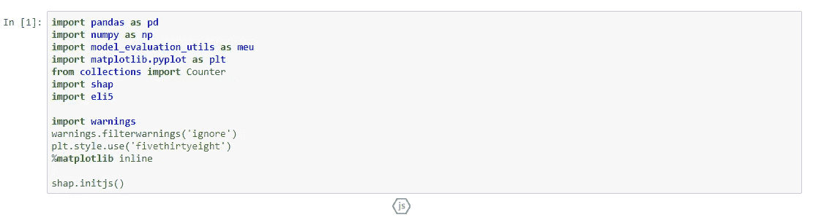*

*记住调用`**shap.initjs()**`函数，因为`**shap**`中的很多图都需要 JavaScript。*

# *加载并查看人口普查收入数据集*

*你其实可以从 [*UCI ML 资源库*](https://archive.ics.uci.edu/ml/datasets/adult) 中获取 ***人口普查收入*** 数据集(俗称 ***成人数据集*** )。幸运的是`**shap**`为我们提供了这个数据集的一个已经清理过的版本，我们将在这里使用它，因为这篇文章的目的是模型解释。*

## *查看数据属性*

*让我们看看数据集的主要特征或属性。*

```
***((32561, 12), (32561,))***
```

*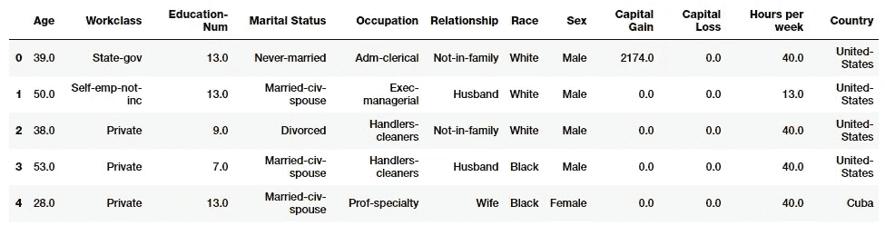*

*Census Dataset Features*

*我们将很快解释这些特性。*

## *查看类别标签*

*让我们来看一下 **< = $50K** ( `**False**`)和**>【50K】**(`**True**`)收入的人的分布，这是我们要预测的阶级标签。*

```
***In [6]: Counter(labels)****Out[6]: Counter({0: 24720, 1: 7841})***
```

*鉴于我们应该让更少的人拥有更高的收入，肯定会出现一些阶级失衡。*

## *了解人口普查收入数据集*

*现在让我们来看看我们的数据集属性，并理解它们的含义和重要性。*

*我们总共有 12 个特征，我们的目标是预测一个人的收入是**超过 5 万美元** ( `**True**`)还是**低于 5 万美元** ( `**False**`)。因此，我们将建立和解释一个分类模型。*

# *基础特征工程*

*这里，我们将带有字符串值的分类列转换为数字表示。通常，XGBoost 模型本身是一个基于树的模型，可以处理分类数据，所以我们在这里不对这些特性进行一次性编码。*

*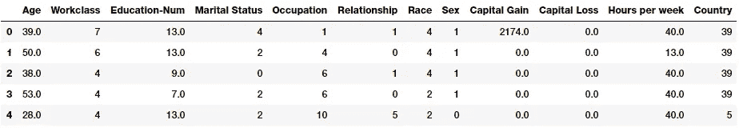*

*在我们建立分类模型之前，是时候建立我们训练和测试数据集了。*

# *构建训练和测试数据集*

*对于任何机器学习模型，我们总是需要*训练*和*测试*数据集。我们将在*训练数据集*上构建模型，并在*测试数据集*上测试性能。我们维护两个数据集(一个具有编码的分类值，一个具有原始值),因此我们可以使用编码的数据集进行训练，但在以后需要时使用原始数据集进行模型解释。*

```
***((22792, 12), (9769, 12))***
```

*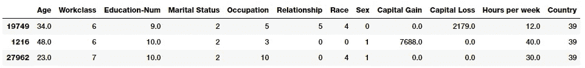*

*Our encoded dataset*

*我们还在一个单独的数据帧中用实际(未编码的)值维护我们的基本数据集(对以后的模型解释有用)。*

```
***((22792, 12), (9769, 12))***
```

*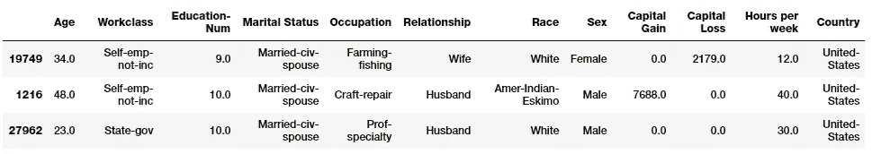*

*Our actual dataset*

# *训练分类模型*

*现在，我们将使用流行的 [XGBoost](https://xgboost.readthedocs.io/en/latest/) 框架在我们的训练数据上训练和构建基本的 boosting 分类模型，这是一个优化的分布式梯度 boosting 库，旨在实现高效、灵活和可移植性。*

```
***Wall time: 8.16 s***
```

# *根据测试数据进行预测*

*在这里，我们像往常一样，使用训练好的模型对测试数据集进行预测。*

```
***array([0, 0, 1, 0, 0, 1, 1, 0, 0, 1])***
```

# *模型性能评估*

*是时候对模型进行测试了！让我们评估一下我们的模型在测试数据上的预测表现如何。为此，我们使用我的漂亮的`**model_evaluation_utils**`模块，它在内部利用`**scikit-learn**`为我们提供标准的分类模型评估指标。*

*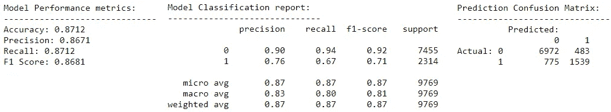*

# *默认模型解释方法*

*默认情况下，很难评估开箱即用的机器学习模型的特定模型解释方法。逻辑回归等参数模型更容易解释，因为模型的参数总数是固定的，与数据量无关，并且可以利用参数系数对模型的预测决策进行一些解释。*

*非参数模型更难解释，因为参数总数保持无界，并且随着数据量的增加而增加。一些非参数模型，如基于树的模型，确实有一些现成的模型解释方法，如特征重要性，这有助于我们了解哪些特征可能对模型做出预测决策有影响。*

## *来自 XGBoost 的经典特性重要性*

*在这里，我们尝试 XGBoost 附带的全局特性重要性计算。该模型使我们能够根据以下内容来查看特性的重要性。*

*   ***特征权重:**这是基于一个特征在所有树中出现的次数*
*   ***增益:**这是基于使用该功能的拆分的平均增益*
*   ***覆盖率:**这是基于使用该特性的分割的平均覆盖率(受影响的样本数)*

*请注意，它们都是相互矛盾的，这激发了模型解释框架的使用，如 SHAP，它使用了被称为 SHAP 值的东西，声称具有一致性保证(意味着它们通常会正确地排列特性)。*

*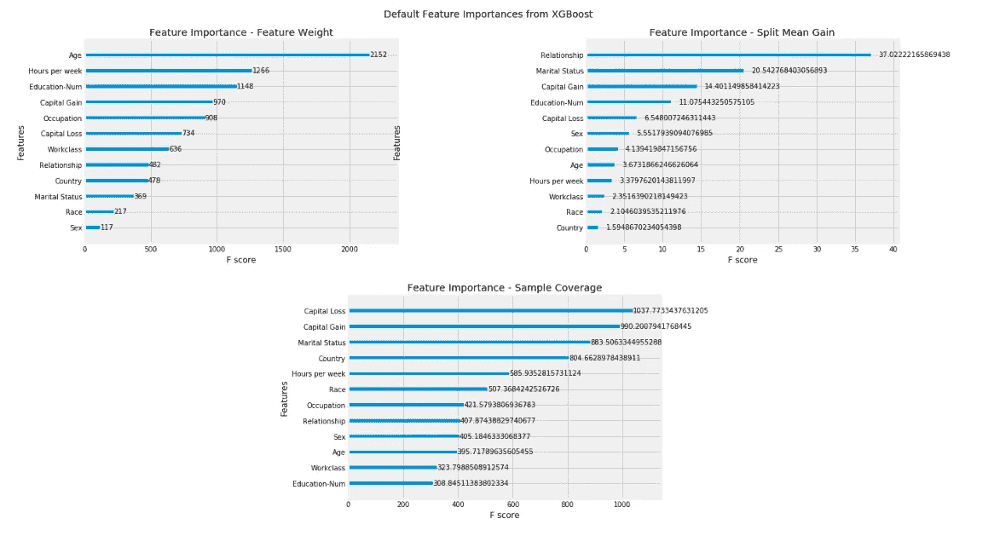*

*Feature Importance Plots from XGBoost*

# *使用 ELI5 进行模型解释*

*[**ELI5**](https://github.com/TeamHG-Memex/eli5) 是一个 Python 包，帮助调试机器学习分类器，并以一种易于理解的直观方式解释它们的预测。这可能是三个机器学习框架中最容易开始的，因为它只需要阅读最少的文档！然而，它不支持真正的模型不可知的解释，对模型的支持大多局限于基于树的和其他参数\线性模型。让我们看看在我们的分类模型上使用 ELI5 进行模型解释的一些直观方式。*

## *安装说明*

*我们建议使用`**pip install eli5**`安装这个框架，因为`**conda**`版本似乎有点过时。也可以根据需要随意查看 [**文档**](https://eli5.readthedocs.io/en/latest/overview.html) 。*

## *ELI5 的特性重要性*

*通常，对于基于树的模型，ELI5 不做任何特殊处理，而是使用我们在上一节中讨论的现成的特性重要性计算方法。默认情况下，使用**‘gain’**，这是该特性在树中使用时的平均增益。*

```
***eli5.show_weights(xgc.get_booster())***
```

*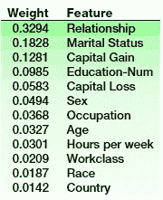*

## *用 ELI5 解释模型预测决策*

*向技术人员或更面向业务的人员解释模型预测决策的最佳方式之一是检查各个数据点的预测。通常，ELI5 通过显示每个特征的权重来实现这一点，这些权重描述了该特征对所有树的最终预测决策的影响程度。这里的 描述了 [**计算重量的思路；ELI5 为 XGBoost 和大多数 scikit-learn 树集成提供了该算法的独立实现，这无疑是朝着模型不可知解释的方向发展，但不像 LIME 那样纯粹是模型不可知的。**](http://blog.datadive.net/interpreting-random-forests/)*

*通常，预测可以被定义为特征贡献的总和+偏差(即，由覆盖整个训练集的最顶端区域给出的平均值)*

## *预测一个人什么时候的收入<= $50K*

*Here we can see the most influential features being the 【 **、**、`**Hours per week**`、、`**Marital Status**`、**、**、`**Occupation**`、**、**、`**Relationship**`*

*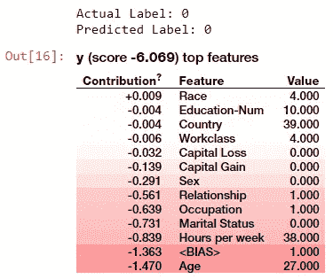*

## *预测一个人的收入何时超过 5 万美元*

*这里我们可以看到最有影响力的特征是`**Education**` **、** `**Relationship**` **、** `**Occupation**` **、** `**Hours per week**` **&** `**Marital Status**`*

**

*看到相似的特征如何在解释这两个类的模型预测决策中发挥有影响的作用，肯定是有趣的！*

# *用溜冰者解释模型*

*Skater 是一个统一的框架，能够对所有形式的模型进行模型解释，以帮助人们使用模型不可知的方法构建现实世界用例经常需要的可解释的机器学习系统。它是一个开源的 python 库，旨在从全局(基于完整数据集的推理)和局部(关于单个预测的推理)两个方面揭开黑盒模型的已知结构。*

*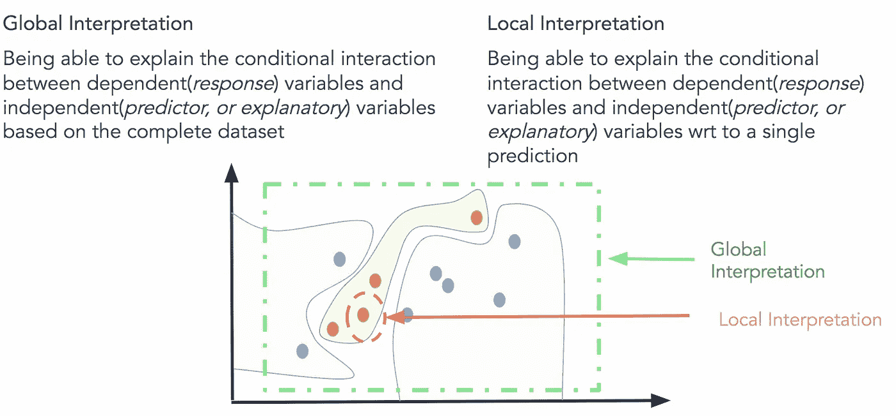*

*Skater 最初以一个酸橙叉开始，但后来发展成为一个独立框架，具有各种各样的特性和能力，可以对任何黑盒模型进行模型不可知的解释。该项目最初是一个研究想法，旨在为研究人员和实践者找到更好的可解释性(最好是人类的可解释性)来预测*【黑盒】*。*

## *安装滑冰者*

*你通常可以使用一个简单的`**pip install skater**`来安装 Skater。有关依赖关系和安装说明的详细信息，请查看[安装滑板](https://oracle.github.io/Skater/install.html)。*

## *📖证明文件*

*我们建议你去查阅溜冰者的详细资料。*

## *算法*

*溜冰者有一套模型解释技术，其中一些在下面提到。*

*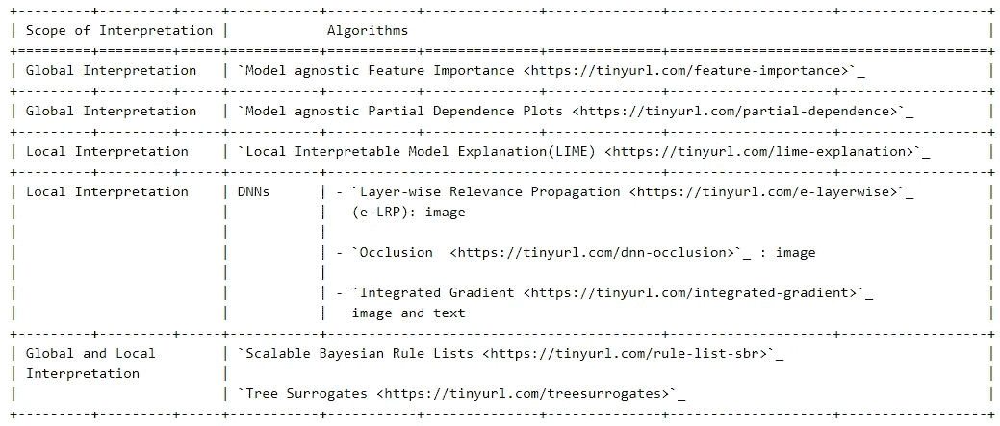*

## *用法和示例*

*由于该项目正在积极开发中，了解用法的最佳方式是遵循交互式笔记本的[图库中提到的示例。但是我们将使用在我们的人口普查数据集上训练的模型来展示它的主要能力。](https://oracle.github.io/Skater/gallery.html)*

# *溜冰者的全球诠释*

*预测模型是从输入空间到输出空间的映射。解释算法分为提供领域区域统计数据和度量标准的算法，如要素的边缘分布或整个训练集的联合分布。在一个理想的世界中，将存在一些允许人类在任意数量的维度中解释决策函数的表示。鉴于我们通常一次只能直观地看到几个维度的可视化，全局解释算法要么聚集特征空间，要么划分特征空间的子集。*

*目前，skater 支持的模型不可知的全局解释算法包括部分依赖和特征重要性，以及一个非常新的树代理版本。我们将在这里讨论特性重要性和部分依赖图。*

## *创建解释对象*

*skater 包中的一般工作流是创建解释、创建模型和运行解释算法。通常情况下，`**Interpretation**`会消耗一个数据集，以及可选的一些元数据，比如特性名称和行 id。在内部，`**Interpretation**`将生成一个`**DataManager**`来处理数据请求和采样。*

*   ***局部模型(** `**InMemoryModel**` **):** 要创建一个基于局部函数或方法的溜冰者模型，将预测函数传递给一个`**InMemoryModel**`。用户可以选择将数据样本传递给 examples 关键字参数。这仅用于推断输出类型和格式。开箱即用，skater 允许模型返回`**numpy**`数组和`**pandas**`数据帧。*
*   ***可操作模型(** `**DeployedModel**` **):** 如果您的模型可以通过 API 访问，那么使用一个`**DeployedModel**`，它包装了请求库。`**DeployedModels**`需要两个函数，一个输入格式化程序和一个输出格式化程序，它们对请求库进行发布和解析。输入格式化程序接受一个`**pandas**` DataFrame 或一个`**numpy**` ndarray，并返回一个可以转换成 JSON 的对象(比如 dict)来发布。输出格式化程序将 requests.response 作为输入，并返回一个`**numpy**` ndarray 或`**pandas**` DataFrame。*

*我们将使用以下工作流程:*

*   *构建一个解释对象*
*   *构建内存模型*
*   *执行解释*

## *对溜冰者的重要性*

*特征重要性是预测模型依赖特定特征的程度的通用术语。给定给定特征的扰动，溜冰者特征重要性实现基于信息理论标准，测量预测变化的熵。直觉告诉我们，一个模型的决策标准越依赖于一个特征，我们就越会看到预测随着对一个特征的扰动而变化。使用的默认方法是`**prediction-variance**`，它是给定数据扰动时预测变化的平均绝对值。*

*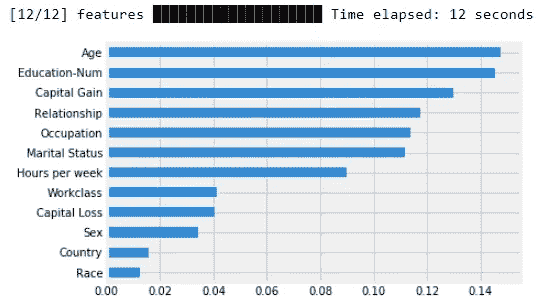*

*Feature Importances from Skater*

# *部分依赖*

*部分相关性描述了某个功能对模型预测的边际影响，使模型中的其他功能保持不变。部分相关的导数描述了特征的影响(类似于回归模型中的特征系数)。本文改编自 T. Hastie、R. Tibshirani 和 J. Friedman 的《统计学习要素》。2、斯普林格。2009.*

*部分相关性图(PDP 或 PD 图)显示了某个特性对先前拟合模型的预测结果的边际影响。PDP 可以显示目标和特征之间的关系是线性的、单调的还是更复杂的。滑冰者可以显示一维和二维等离子体显示器*

## *影响模型预测的“年龄”的 PDP*

*让我们看看`**Age**`特性是如何影响模型预测的。*

*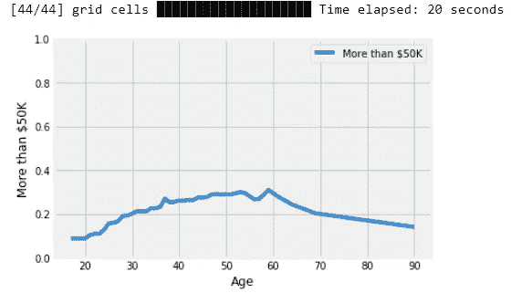*

*PDP for the Age feature*

*看起来，与年轻人或老年人相比，中年人赚更多钱的机会稍高一些。*

## *“教育程度”的 PDP 影响模型预测*

*让我们看看`**Education-Num**`特性是如何影响模型预测的。*

*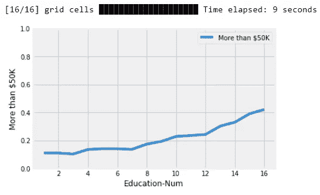*

*PDP for the Education-Num feature*

*看起来受教育程度越高，赚更多钱的机会就越大。不奇怪！*

## *影响模型预测的“资本收益”的 PDP*

*让我们看看`**Capital Gain**`特性是如何影响模型预测的。*

*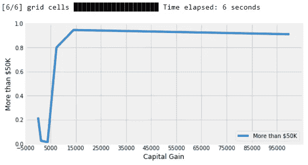*

*PDP for the Capital Gain feature*

*不出所料，资本收益越高，赚钱的机会就越多，大约在 **$5K 到$8K 之间急剧上升。***

## *影响模型预测的“关系”的 PDP*

*记住，关系是用数字表示的分类变量编码的。我们先来看看它是如何表示的。*

*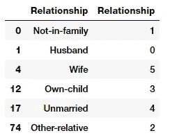*

*Label Encoding for Relationship*

*现在让我们看看`**Relationship**`特性是如何影响模型预测的。*

*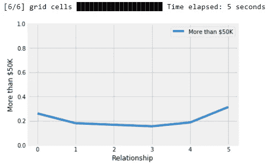*

*PDP for the Relationship feature*

*有趣的是，已婚人士(夫妻)比其他人更有可能赚更多的钱！*

## *双向 PDP 显示特征“年龄”和“教育程度”之间的相互作用，以及它们对超过 50K 美元收入的影响*

*我们在这里对所有数据样本进行了更深入的模型解释，试图在双向部分依赖图的帮助下，看到`**Age**`和`**Education-Num**`之间的相互作用，以及它们对模型预测此人是否会赚更多钱的概率的影响。*

*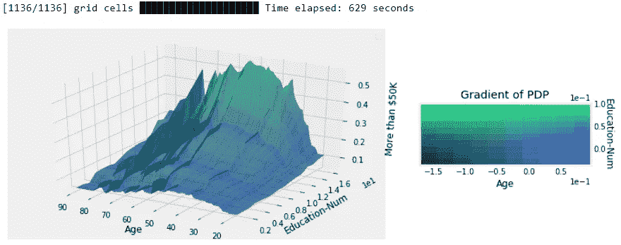*

*Two-way PDP showing effects of the Age and Education-Num features*

*有趣的是，教育水平越高，中年人(30-50 岁)赚更多钱的机会越大！*

## *双向 PDP 显示了“教育-数字”和“资本收益”功能之间的相互作用，以及它们对获得超过 50K 美元收入的影响*

*我们在这里对所有数据样本进行了更深入的模型解释，试图在双向部分依赖图的帮助下，看到`**Education-Num**`和`**Capital Gain**`之间的相互作用，以及它们对模型预测此人是否会赚更多钱的概率的影响。*

*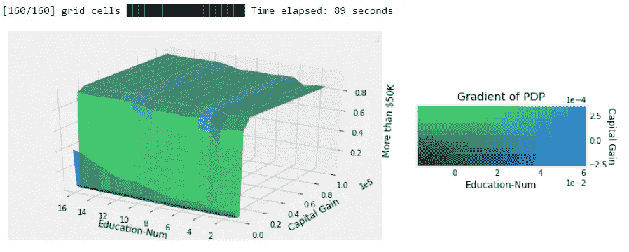*

*Two-way PDP showing effects of the Education-Num and Capital Gain features*

*基本上，更好的教育和更多的资本收益会让你赚更多的钱！*

# *滑冰者的地方诠释*

*有可能通过两种方式实现本地解释。首先，可以使用简单的可解释辅助或替代模型(如线性回归器)在单个输入附近近似复杂预测模型的行为。第二，可以使用基本估计量来理解单个预测的行为，使用基于输入和输出的直观近似函数。*

## *局部可解释的模型不可知解释(LIME)*

*LIME 是由 Riberio Marco、Singh Sameer 和 Guestrin Carlos 设计的一种新算法，用于使用可解释的替代模型(如线性分类器/回归器)来评估任何基础估计量(模型)的行为。这种形式的综合评估有助于产生局部忠实的解释，但可能不符合全局行为。基本上，石灰解释是基于本地代理模型。这些替代模型是可解释的模型(如线性模型或决策树),是根据原始黑盒模型的预测学习的。但是，LIME 没有试图拟合一个全球代理模型，而是专注于拟合局部代理模型，以解释为什么会做出单一预测。*

*这个想法非常直观。首先，试着忘掉你已经做过的事情！忘记训练数据，忘记你的模型是如何工作的！认为你的模型是一个黑盒模型，里面有一些神奇的事情发生，你可以输入数据点，并得到模型预测的结果。你可以随时探测这个神奇的黑箱，得到输入和输出预测。*

*现在，你的主要目标是理解为什么你作为一个神奇的黑盒子对待的机器学习模型，给出了它产生的结果。LIME 试着为你做这件事！它测试当你把数据集的变化或扰动输入黑盒模型时，黑盒模型的预测会发生什么。通常，LIME 会生成一个由扰动样本和相关黑盒模型预测组成的新数据集。在这个数据集上，LIME 然后训练可解释的模型，该模型通过采样实例与感兴趣实例的接近度来加权。以下是标准的高级工作流程。*

*   *选择您感兴趣的实例，您希望对其黑盒模型的预测进行解释。*
*   *扰动数据集，获得这些新点的黑盒预测。*
*   *根据与感兴趣的实例的接近程度对新样本进行加权。*
*   *将加权的、可解释的(替代)模型拟合到有变化的数据集上。*
*   *通过解释本地模型来解释预测。*

*我们推荐你阅读 Christoph Molnar 关于模型解释的优秀著作中的第[章](https://christophm.github.io/interpretable-ml-book/lime.html),其中详细讨论了这一点。*

## *用石灰解释溜冰者的模型预测*

*溜冰者可以利用石灰来解释模型预测。通常，它的`**LimeTabularExplainer**`类有助于解释对表格(即矩阵)数据的预测。对于数值特征，它会根据训练数据中的平均值和标准差，通过从正态(0，1)采样并执行平均值居中和缩放的逆操作来扰动它们。对于分类特征，它通过根据训练分布进行采样来进行扰动，并在值与被解释的实例相同时生成为 1 的二元特征。`**explain_instance()**`函数为预测生成解释。首先，我们通过随机扰动实例中的特征来生成邻域数据。然后，我们学习这个邻域数据上的局部加权线性(代理)模型，以可解释的方式解释每个类。*

*由于 XGBoost 在使用数据帧构建模型时在特性名称排序方面有一些问题，我们将使用`**numpy**`数组构建相同的模型，以使 LIME 工作起来，而没有特性重新排序的额外麻烦。请记住，正在建立的模型与我们视为黑盒机器学习模型的集合模型是相同的。*

```
***XGBClassifier(base_score=0.5, booster='gbtree', colsample_bylevel=1,
              colsample_bytree=1, gamma=0, learning_rate=0.1,          
              max_delta_step=0, max_depth=5, min_child_weight=1,  
              missing=None, n_estimators=500, n_jobs=1,  
              nthread=None, objective='binary:logistic',
              random_state=42, reg_alpha=0, reg_lambda=1,    
              scale_pos_weight=1, seed=None, silent=True,  
              subsample=1)***
```

## *预测一个人的收入<= $50K*

*Skater gives a nice reasoning below showing which features were the most influential in the model taking the correct decision of predicting the person’s income as ***何时低于 5 万美元。****

**

*Local interpretations with LIME in Skater*

## *预测一个人的收入何时超过 5 万美元*

*Skater 在下面给出了一个很好的推理，显示了在模型中哪些特征是最有影响力的，并做出了正确的决定，预测此人的收入为 ***超过 5 万美元。****

*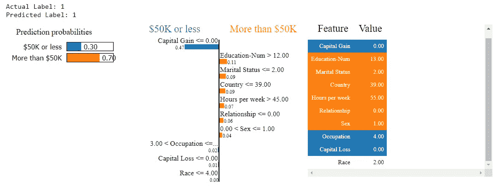*

*Local interpretations with LIME in Skater*

## *使用 Skater 通过树代理获得更多可解释模型的途径*

*我们已经看到了用特征、依赖图甚至时间来解释机器学习模型的各种方法。但是，我们能从一个真正复杂的黑盒模型中建立一个更容易解释的近似模型或代理模型吗？比如我们的 XGBoost 模型，它有数百个决策树。*

*在这里，我们介绍了使用`**TreeSurrogates**`作为解释模型的学习决策策略(用于归纳学习任务)的手段的新想法，这是受 Mark W. Craven 的工作(称为特雷潘算法)的启发。*

*我们推荐查看以下关于 TREPAN 算法构建代理树的优秀论文。*

*   *[*马克·w·克雷文(1996)从训练好的神经网络中提取可理解的模型*](http://ftp.cs.wisc.edu/machine-learning/shavlik-group/craven.thesis.pdf)*
*   *[*马克·w·克雷文和裘德·w·沙夫利克(NIPS，96)。提取 Thained 网络的三维结构表示*T3](https://papers.nips.cc/paper/1152-extracting-tree-structured-representations-of-trained-networks.pdf)*

*简而言之，Trepan 以最佳优先的方式构建决策树。它维护一个树叶队列，当从队列中移除树叶时，树叶被扩展成子树。对于队列中的每个节点，Trepan 存储，*

*   *训练示例的子集，*
*   *另一组实例(查询实例)，*
*   *一组约束。*

*存储的训练样本子集仅由到达该节点的那些样本组成。如果节点是内部节点，则使用查询实例和训练示例来选择分裂测试，如果节点是叶节点，则确定类标签。约束集描述了实例为了到达节点而必须满足的条件；在为新创建的节点绘制一组查询实例时，会用到这些信息。Trepan 中扩展节点的过程与传统的决策树算法非常相似:为节点选择一个分裂测试，并为测试的每个结果创建一个子节点。每个孩子要么成为树的一片叶子，要么被放入队列中等待将来的扩展。*

*对于 Skater 的实现，为了构建可解释的代理模型，基本估计器(Oracle)可以是任何形式的监督学习预测模型——我们的黑盒模型。通过学习类似于 Oracle 所学习的决策边界(来自基础模型的预测用于学习决策树表示)，使用决策树(用于分类/回归)来近似解释。该实现还生成保真度分数，以量化基于树的代理模型对 Oracle 的近似。理想情况下，全球和局部的真实解释得分应为 0。让我们来看看实际情况吧！*

> ***注:**该实现目前处于试验阶段，将来可能会有所改变。*

## *使用解释器实例调用 TreeSurrogate*

*我们可以使用前面实例化的解释对象来调用 TreeSurrogate 功能。*

## *使用代理模型来学习由基本估计器学习的决策边界*

*现在，我们可以在数据集上拟合这个代理模型，以了解我们的基本估计量的决策边界。*

*   *报告与基本估计值相比的保真度值(越接近 0 越好)*
*   *学员使用 F1 分数作为分类的默认选择指标。*

```
***0.009***
```

## *查看每个特征的位置*

*我们这样做是因为代理树中的特征名称不显示(但存在于模型中)*

*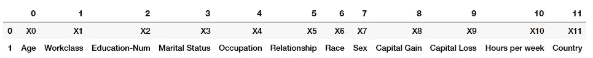*

## *可视化代理树*

*我们现在可以使用下面的代码来可视化我们的代理树模型。*

*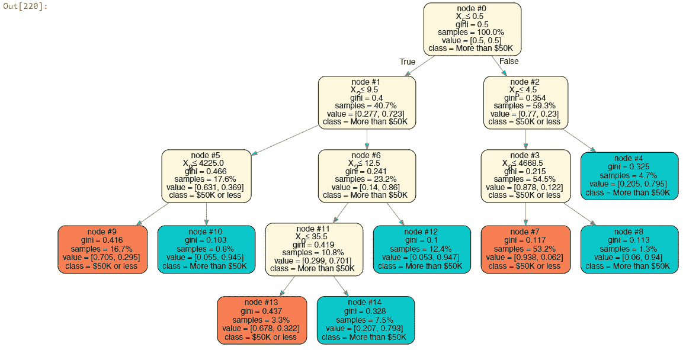*

*Our surrogate tree model*

## *来自代理树的有趣规则*

*从上面的树中你可以观察到一些有趣的规则。*

*   *如果`**Relationship**` < 0.5(表示 0)`**Education-num**`<= 9.5 并且`**Capital Gain**`<= 4225**→*****70%的机会使人< = $50K****
*   *如果`**Relationship**` < 0.5(表示 0)`**Education-num**`<= 9.5 并且`**Capital Gain**`>= 4225**→*****94.5%的几率中人>【50K】****
*   *如果`**Relationship**` < 0.5(表示 0)`**Education-num**`>= 9.5 并且`**Education-num**`也是>= 12.5**→*****94.7%的几率人做成> $50K****

*请随意从中导出更多有趣的规则以及您自己的模型！现在让我们看看代理模型在测试数据集上的表现。*

## *代理模型性能评估*

*现在让我们根据测试数据来检查代理模型的性能。*

**

*正如预期的那样，该模型的性能下降了不少，但我们仍然获得了总的 ***F1 分*****83%**，相比之下，我们的提升模型的分数 **87%** 相当不错！*

# *SHAP 的模型解释*

***SHAP(SHapley Additive exPlanations)**是解释任何机器学习模型输出的统一方法。SHAP 将博弈论与局部解释相结合，结合了以前的几种方法，并基于他们所声称的，代表了唯一可能一致且局部精确的附加特征归因方法！(请务必检查 [SHAP 夹纸](http://papers.nips.cc/paper/7062-a-unified-approach-to-interpreting-model-predictions)了解详情)。我们在本系列的第二部分 中也详细介绍了这一点。*

## *装置*

*SHAP 可以从 [PyPI](https://pypi.org/project/shap) 安装*

```
***pip install shap***
```

*或者[康达锻造](https://anaconda.org/conda-forge/shap)*

```
***conda install -c conda-forge shap***
```

*这个框架真正令人敬畏的方面是，虽然 SHAP 值可以解释任何机器学习模型的输出，但对于真正复杂的集成模型来说，它可能会很慢。但是他们开发了一种用于树集成方法的高速精确算法([树 SHAP arXiv 论文](https://arxiv.org/abs/1802.03888))。快速 C++实现支持 *XGBoost* 、 *LightGBM* 、 *CatBoost* 和 *scikit-learn* 树模型！*

*SHAP (SHapley 附加解释)为每个特征分配一个特定预测的重要性值。其新颖的组成部分包括:识别一类新的加性特征重要性度量，理论结果表明在这一类中有一个唯一的解决方案，具有一组理想的性质。通常，SHAP 值试图将模型(函数)的输出解释为引入条件期望的每个特征的效果的总和。重要的是，对于非线性函数，引入特征的顺序很重要。SHAP 值由所有可能的排序的平均值产生。博弈论的证据表明这是唯一可能的一致方法。*

*理解 Shapley 值的直观方式如下:特征值以随机顺序进入一个房间。房间里的所有特征值都参与了游戏。沙普利值 ***ϕᵢⱼ*** 是特征值 ***xᵢⱼ*** 通过加入之前已经进入房间的任何特征的平均边际贡献，即*

*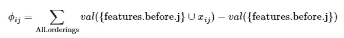*

*下面的图来自 KDD 18 号论文， [*一致个性化特征归属为树系综*](https://arxiv.org/pdf/1802.03888.pdf) 很好地概括了这一点！*

**

*现在让我们深入 SHAP，并利用它来解释我们的模型！*

## *用 SHAP 解释预测*

*这里我们使用集成到 XGBoost 中的树 SHAP 实现来解释测试数据集！请记住，基于您正在构建的模型类型，有多种解释器方法。我们估计一组样本(测试数据)的 SHAP 值*

```
***Expected Value: -1.3625857***
```

*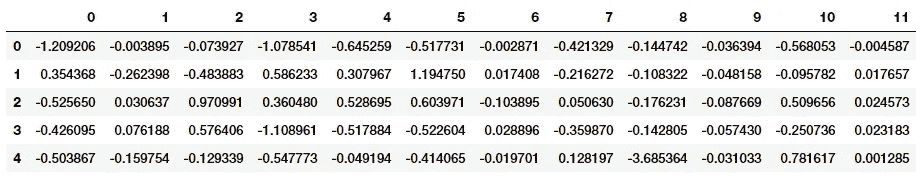*

*这将返回 SHAP 值的矩阵(`**# samples**`，`**# features**`)。每一行加起来就是该样本的模型输出和模型输出的期望值之间的差值(该值存储为解释器的`**expected_value**`属性)。通常，这种差异有助于我们解释为什么模型倾向于预测特定的班级结果。*

## *预测一个人的收入何时< = 5 万美元*

*SHAP 在下面给出了一个很好的推理，显示了哪些特征在模型中最有影响力，正确的决定是预测个人的收入为 ***低于 5 万美元*** 。以下说明显示了将模型输出从基础值(我们传递的训练数据集的平均模型输出)推至实际模型输出的各种功能。将预测值推高的要素显示为红色，将预测值推低的要素显示为蓝色。*

*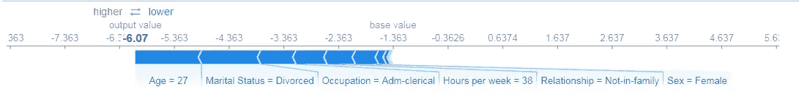*

## *预测一个人的收入何时超过 5 万美元*

*同样，SHAP 在下面给出了一个很好的推理，显示了在模型中哪些特征是最有影响力的，正确的决定是预测这个人的收入 ***大于 50K*** 。*

*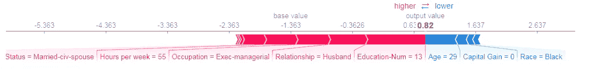*

## *可视化和解释多重预测*

*SHAP 的一个关键优势是它可以构建美丽的互动情节，可以同时可视化和解释多种预测。在这里，我们将前 1000 个测试数据样本的模型预测决策可视化。*

*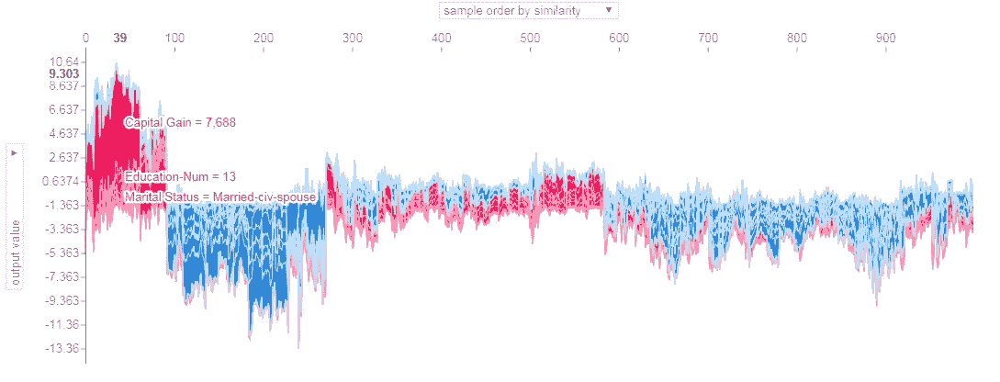*

*上述可视化可以以多种方式进行交互。默认的可视化显示了一些有趣的模型预测模式决策。*

*   *前 100 个测试样本都可能**收入超过 5 万美元**并且他们**已婚**或\有**良好的资本收益**或\并且有**更高的教育水平**！*
*   *接下来的 170 多个测试样本可能都**收入少于或等于 5 万美元**而且他们**大多未婚**和\或**年龄很小或离婚**！*
*   *接下来的 310 多个测试样本大多倾向于收入超过 5 万美元的人，他们有不同的背景，包括已婚人士、不同年龄、教育水平和职业的人。推动模型预测更高收入的最主要特征是结婚的人，即**关系:丈夫还是妻子**！*
*   *剩余的 400 多个测试样本大多倾向于**收入少于 5 万美元**，他们的情况各不相同，但主要模式包括**关系:未婚或离婚**和**年龄非常小**！*

*非常有趣的是，我们如何找出导致模型做出特定决策的模式，并能够为这些决策提供解释。*

## *SHAP 的重要特征*

*这基本上是取整个数据集的 SHAP 值的平均值，并将其绘制成一个简单的条形图。*

*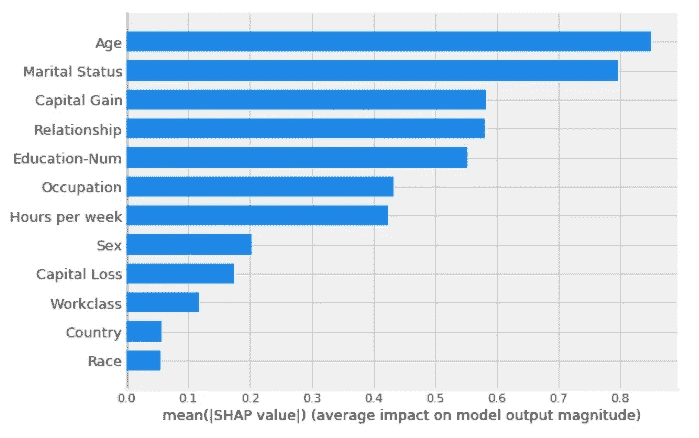*

*SHAP feature importance plot*

## *SHAP 汇总图*

*除了典型的要素重要性条形图，SHAP 还使我们能够使用每个要素的 SHAP 值的密度散点图来确定每个要素对验证数据集中个体的模型输出的影响程度。要素按所有样本的 SHAP 量值总和排序。请注意，当散点不在一条线上时，它们会堆积起来以显示密度，每个点的颜色代表该个体的特征值。*

*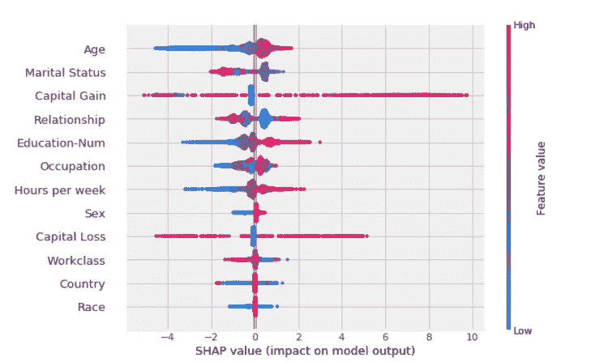*

*SHAP summary plot*

*有趣的是， ***年龄*** 和 ***婚姻状况*** 特征比 ***资本收益*** 特征具有更大的总模型影响，但是对于那些 ***资本收益*** 重要的样本，它具有比 ***年龄*** 或 ***婚姻状况*** 更大的影响。换句话说， ***资本收益*** 对少数预测影响较大，而 ***年龄*** 或 ***婚姻状况*** 对所有预测影响较小。*

## *SHAP 依赖图*

*SHAP 相关图显示了单个(或两个)要素对整个数据集的影响。他们绘制了许多样本中某个特性的值与该特性的 SHAP 值。SHAP 相关图类似于部分相关图，但是考虑了特征中存在的交互作用，并且仅在由数据支持的输入空间的区域中定义。单个特征值处 SHAP 值的垂直离差由交互作用影响决定，可以选择另一个要素进行着色，以突出显示可能的交互作用。*

*你也会注意到它和溜冰者的部分依赖情节的相似性！*

## *影响模型预测的“年龄”的 PDP*

*让我们看看`**Age**`特性是如何影响模型预测的。*

**

*PDP for the Age feature*

*就像我们之前观察到的一样。中年人的 shap 值略高，这推动了模型的预测决策，即与年轻人或老年人相比，这些人赚的钱更多*

## *“教育人数”影响模型预测的 PDP*

*让我们看看`**Education-Num**`特性是如何影响模型预测的。*

*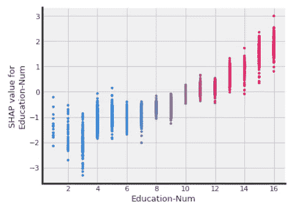*

*PDP for the Education-Num feature*

*教育程度越高，shap 值越高，推动模型的预测决策说，与教育程度较低的人相比，这些人赚的钱更多。*

## *影响模型预测的“关系”的 PDP*

*让我们看看`**Relationship**`特性是如何影响模型预测的。*

*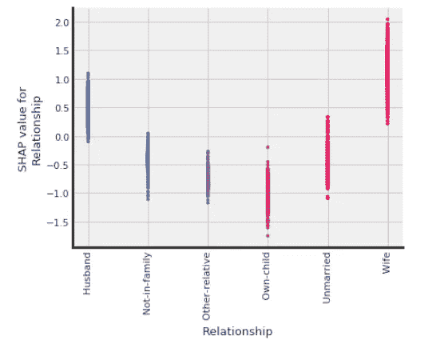*

*PDP for the Relationship feature*

*正如我们在模型预测解释中观察到的，已婚人士(丈夫或妻子)的 shap 值略高，推动模型的预测决策，认为这些人比其他人赚得更多！*

## *影响模型预测的“资本收益”的 PDP*

*让我们看看`**Capital Gain**`特性是如何影响模型预测的。*

*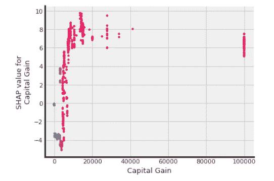*

*PDP for the Capital Gain feature*

## *双向 PDP 显示了特征“年龄”和“资本收益”之间的相互作用，以及它们对获得超过 50K 美元收入的影响*

*单个特征值处 SHAP 值的垂直离差由交互作用影响决定，选择另一个特征进行着色以突出可能的交互作用。在这里，我们试图看到`Age`和`Capital Gain`之间的相互作用，以及它们对 SHAP 值的影响，这导致模型在双向部分依赖图的帮助下预测这个人是否会赚更多的钱。*

*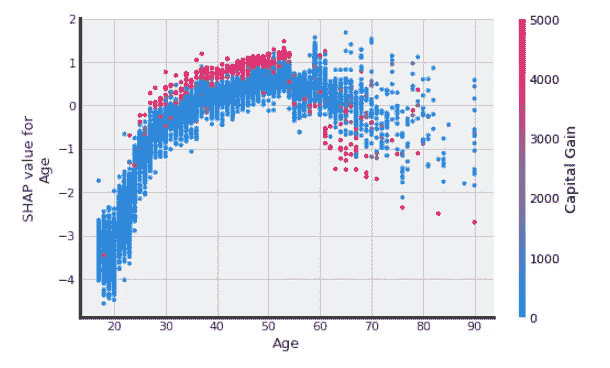*

*Two-way PDP showing effects of the Age and Capital Gain features*

*有趣的是，资本收益越高，中年人(30-50 岁)赚更多钱的机会越大！*

## *双向 PDP 显示了“教育-数量”和“关系”特征之间的相互作用，以及它们对创造超过 50K 美元收入的影响*

*在这里，我们试图看到`**Education-Num**`和`**Relationship**`之间的相互作用，以及它们对 SHAP 值的影响，这导致模型在双向部分依赖图的帮助下预测这个人是否会赚更多的钱。*

**

*Two-way PDP showing effects of the Education-Num and Relationship features*

*这很有趣，因为在某些情况下两者的特征是相似的，我们可以看到典型的已婚人士，无论是丈夫还是妻子，都有最高的机会赚更多的钱！*

## *双向 PDP 显示了特征“婚姻状况”和“关系”之间的相互作用，以及它们对获得超过 5 万美元收入的影响*

*在这里，我们试图看到`**Marital Status**`和`**Relationship**`之间的相互作用，以及它们对 SHAP 值的影响，这导致模型在双向部分依赖图的帮助下预测这个人是否会赚更多的钱。*

*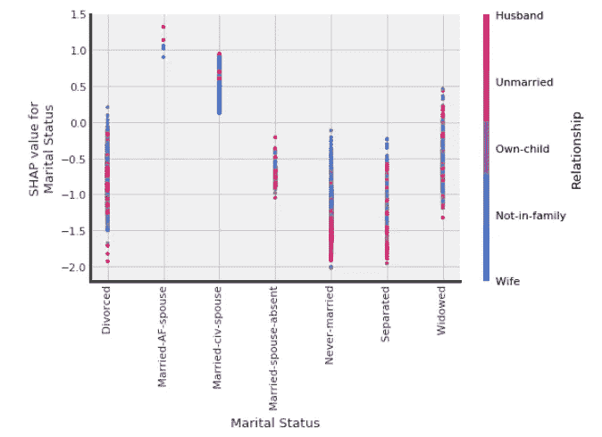*

*Two-way PDP showing effects of the Marital Status and Relationship features*

*有趣的是，受教育程度越高，丈夫或妻子(已婚)挣更多钱的机会越大！*

## *双向 PDP 显示特征“年龄”和“每周小时数”之间的相互作用，以及它们对创造超过 50K 美元收入的影响*

*在这里，我们试图看到`**Age**`和`**Hours per week**`之间的相互作用，以及它们对 SHAP 值的影响，这导致模型在双向部分依赖图的帮助下预测这个人是否会赚更多的钱。*

*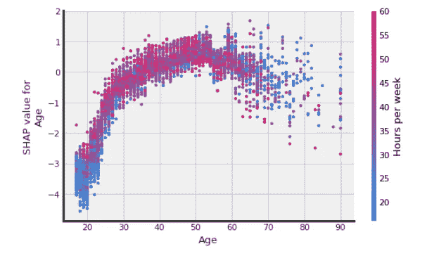*

*Two-way PDP showing effects of the Age and Hours per week features*

*这里没什么特别的，工作最多的中年人赚的钱最多！*

# *结论*

*如果你正在阅读这篇文章，我真的想称赞你在阅读这本关于机器学习模型解释的庞大而全面的教程上所做的努力。这篇文章应该帮助你利用最先进的工具和技术，这将有助于你在通往可解释的人工智能(XAI)的道路上。基于我们在 [*第二部分*](/explainable-artificial-intelligence-part-2-model-interpretation-strategies-75d4afa6b739) 中学到的概念和技术，在本文中，我们实际上在一个在真实世界数据集上训练的复杂机器学习集成模型上实现了它们。我鼓励您用自己的模型和数据集来尝试这些框架，探索模型解释的世界！*

# *下一步是什么？*

*在本系列的第 4 部分中，我们将会看到一个在非结构化数据(如文本，甚至深度学习模型)上构建解释模型的综合指南！*

*   *非结构化数据集上的动手模型解释*
*   *深度学习模型的高级模型解释*

*敬请关注一些有趣的内容！*

> ***注意:**随着时间的推移，这一领域出现了许多快速发展，包括许多新工具和框架的发布。如果您希望我介绍任何其他流行的框架，请随时联系我。我对此非常感兴趣，并将在未来的某个时候开始研究 H2O 的模型解释能力。*

*本文使用的代码可以在 [**my GitHub**](https://github.com/dipanjanS/data_science_for_all/tree/master/tds_model_interpretation_xai) 上获得，也可以作为交互式 [***Jupyter 笔记本***](http://nbviewer.jupyter.org/github/dipanjanS/data_science_for_all/blob/master/tds_model_interpretation_xai/Human-interpretable%20Machine%20Learning%20-%20DS.ipynb#) 。*

*请查看 [***“第一部分——人类可解释机器学习的重要性”***](/human-interpretable-machine-learning-part-1-the-need-and-importance-of-model-interpretation-2ed758f5f476) ，其中涵盖了人类可解释机器学习的内容和原因，以及模型解释的必要性和重要性及其范围和标准(如果您还没有了解的话)!*

*还有 [***第 2 部分——模型解释策略’***](/explainable-artificial-intelligence-part-2-model-interpretation-strategies-75d4afa6b739)*，它涵盖了人类可解释的机器学习的方式，我们在其中看到了与模型解释的主要策略相关的基本概念。**

**有反馈给我吗？或者有兴趣与我一起从事研究、数据科学、人工智能甚至发表一篇关于[***TDS***](https://towardsdatascience.com/)的文章？可以在[**LinkedIn**](https://www.linkedin.com/in/dipanzan/)**上联系我。****

**[](https://www.linkedin.com/in/dipanzan) [## 人工智能顾问&数据科学导师-跳板| LinkedIn

### 查看 Dipanjan Sarkar 在世界最大的职业社区 LinkedIn 上的个人资料。Dipanjan 有 2 份工作列在…

www.linkedin.com](https://www.linkedin.com/in/dipanzan)**