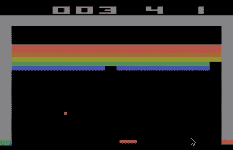
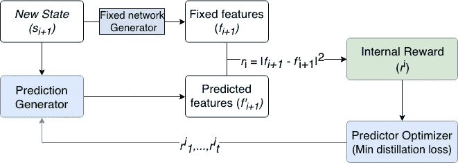
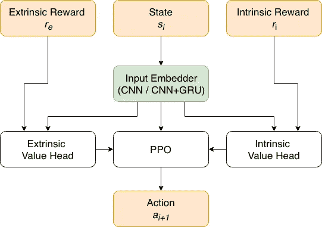
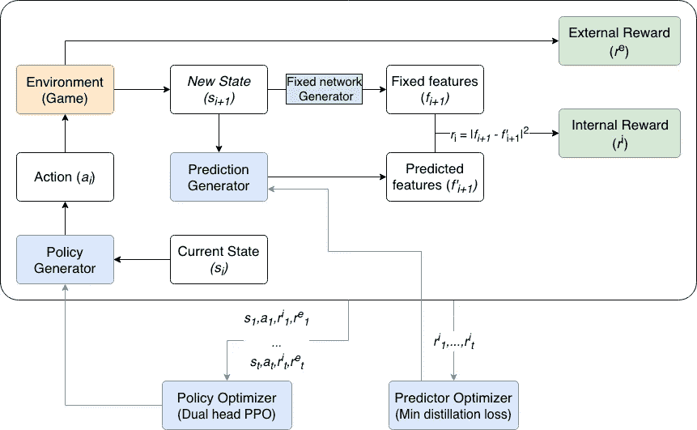
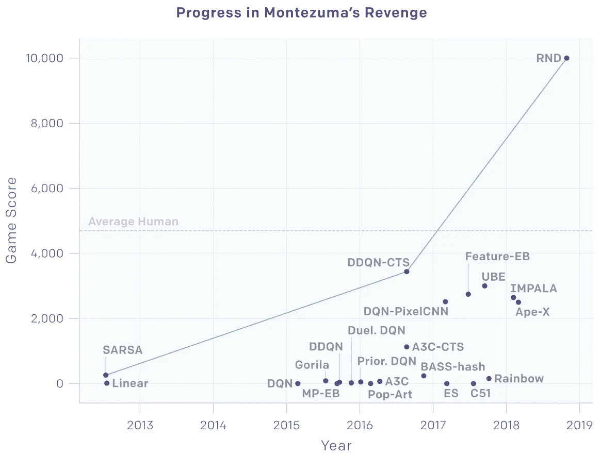

# 解释:RL 中的好奇心驱动学习

> 原文：<https://towardsdatascience.com/explained-curiosity-driven-learning-in-rl-exploration-by-random-network-distillation-72b18e69eb1b?source=collection_archive---------10----------------------->

## 随机网络蒸馏探索

近年来，强化学习已经被证明是一种强大的技术，可以解决有持续回报的封闭任务，最常见的是游戏。该领域的一个主要挑战仍然是在行动的外部反馈(奖励)稀少或不存在的情况下训练模型。最近的模型试图通过创建一种内在的奖励机制来克服这一挑战，这种机制主要被称为好奇心，奖励发现新领土和州的模型。

OpenAI 的一篇新的[论文](https://arxiv.org/pdf/1810.12894)通过随机网络蒸馏探索(RND)提出了一种内在奖励的新方法。该模型试图预测一个给定的状态以前是否被见过，并对不熟悉的状态给予更大的奖励。

该模型显示了几个雅达利游戏的最先进的结果，包括蒙特祖马的复仇，这是众所周知的 RL 算法很难。它也相对简单，并且已经证明在包括分散注意力的背景噪声的环境中是有效的。

# 背景

强化学习(RL)是一组以奖励为导向的算法，这意味着它们通过最大化从环境中获得的奖励来学习如何在不同状态下采取行动。对他们来说，一个具有挑战性的测试平台是 30 多年前开发的 Atari 游戏，因为它们提供了丰富的视觉输入(每帧 210X160X3)和一系列对人类来说很难的任务。

这些游戏在复杂性和外部奖励的频率上有所不同。在《越狱》中，每次击中砖块都会有奖励，而在《蒙特祖马的复仇》和《其他》中，一个关卡只有少量奖励。例如，蒙特祖马的复仇是众所周知的挑战，因为它需要长时间(数百步)和复杂的动作组合来通过致命的障碍并找到奖励。下面的动画说明了游戏之间的区别。

Breakout — The agent receives external rewards frequently, one for each brick

Montezuma’s Revenge — The only external reward is received when picking up the key

为了在没有频繁外部奖励的游戏中取得成功，代理人必须探索环境，希望发现稀疏的奖励。这些场景在现实生活中很常见，从在房子里找到丢失的钥匙到发现新的癌症药物。在这种情况下，代理人被要求使用内在奖励，同时主要独立于外在奖励。有两种常见的带内在奖励的 RL 方法:

1.  基于计数的方法，对以前访问过的州进行计数，并对新的州给予更大的奖励。这种方法的缺点是，随着可能状态数量的增加，它往往变得不那么有效。
2.  另一种方法是“下一状态预测”，在这种方法中，模型试图预测下一状态，采取行动转移到下一状态，然后将与预测状态相比的误差降至最低。通过探索，更多的状态变得已知，误差下降。

这些方法比只基于外在奖励的模型(如著名的 DQN 和 A3C 模型)表现得更好，但仍然比普通人差。

一般来说，当使用内在奖励时，对未来状态的评估有三个可能的错误来源:

1.  不熟悉的状态错误-模型无法从以前访问过的状态归纳到新的状态，导致未来状态预测中的高错误。通过反复发现新的状态并从中学习，模型逐渐减少了这种错误。
2.  随机噪声——这也称为电视噪声问题，其中环境的一部分会产生随机噪声(就像房间里有一台呈现白噪声的电视)。这导致许多状态对于代理来说是新的，下一个状态通常是不可预测的，并且与代理的动作无关。
3.  模型约束—模型的架构是有限的，不能足够准确地概括环境以预测下一个状态。例如，预测下一个状态所需的神经网络的层数和大小是未知的。

# RND 是如何工作的？

具有内在奖励的 RL 系统使用不熟悉状态误差(误差#1)进行探索，并且旨在消除随机噪声(误差#2)和模型约束(误差#3)的影响。为此，该模型需要 3 个神经网络:一个为给定状态**生成恒定输出的**固定目标网络**，**，一个试图预测目标网络输出的**预测网络**，以及一个决定代理下一步行动的**策略网络**。

## 目标和预测网络

通过计算两个网络输出之间的差异，目标和预测网络被用来为不熟悉的状态产生更大的内在奖励。网络具有相同的大小和架构——卷积编码器(CNN ),后面是全连接层，用于将状态嵌入特征向量 *f* 。然而，它们之间有一个重要的区别:

1.  **目标网络**是一个具有固定随机权重的神经网络，从未被训练过。因此，对于给定状态(输入),其输出是恒定的，但在不同状态之间是可变的:对于任何时间步长 I，fi(x)=fj(x ),对于任何两个不同的输入，fi(x)fi(y)。
2.  **预测网络**被训练来预测目标网络的输出。每个状态被输入到两个网络中，预测网络被训练以最小化它们的输出(ri)之间的差异(MSE)。

The target and prediction networks

随着越来越多的状态被输入到系统中，当预测网络接收到已知状态时，它在预测目标网络输出方面变得更好。当到达以前访问过的州时，代理会收到一点奖励(因为目标输出是可预测的),并且代理没有动力再次到达这些州。换句话说，与普通模型不同，智能体不是试图根据当前状态和动作来预测下一个状态，而是试图预测未来状态的新颖性。

目标预测架构有几个好处:

1.  在用随机噪声(来自固定的稳定分布)对状态进行足够的训练之后，预测网络能够更好地预测目标网络的输出。随着预测误差的减小，智能体对噪声状态的吸引力会比其他未探测的状态小。这减少了电视噪音错误(#2)。
2.  在下一步预测模型中，事先不知道需要哪种体系结构(层数、层大小等)来模拟动作的结果。然而，预测器网络只需要预测目标网络的结果。通过具有与目标网络相同的架构，它应该能够正确地学习熟悉状态的输出。这“解决”了模型约束错误(#3)。
3.  它让代理人倾向于在游戏中存活，因为死亡迫使它回到熟悉的状态。其他“基于好奇心”的 RL 方法也有这种优势。

该模型的一个挑战是，随着更多的状态变得熟悉，内在奖励会减少，并且可能在不同的环境中变化，这使得选择超参数变得困难。为了克服这一点，内在奖励在每个更新周期中被标准化。

## 政策网络

策略网络的作用是根据当前状态及其内部模型决定下一步行动，该模型是根据以前的状态训练的。为了做出这个决定，它使用了一个输入嵌入器和一个策略优化器:

**输入嵌入器**

输入嵌入器将环境状态编码成特征。本文比较了两种体系结构——CNN 或 CNN 与循环层(GRU 细胞)的混合。重现层被认为有助于通过捕捉游戏的更长上下文来预测下一个动作，例如，在当前状态之前发生的事件，并且在大多数情况下确实被发现比只有 CNN 的层表现得更好。

**PPO**

训练策略模型的一个主要问题是收敛性，因为策略往往会因为奖励的一次更新而发生剧烈变化。例如，在一些架构中，一个糟糕的插曲(游戏)可以完全改变你的策略。因此，在嵌入层之上，网络有一个**邻近策略优化器** ( [PPO](https://arxiv.org/pdf/1707.06347) )，它根据嵌入状态预测下一个动作。PPO 的主要贡献是通过限制连续策略更新之间的差异，在没有激进更新的情况下安全地优化策略。

为了更新政策，PPO 首先需要估计给定状态的未来内在和外在报酬(“价值头”)。单独处理每种类型的奖励可以更灵活地确定每种类型对政策的影响以及每种类型的计算方式:

*   内在奖励是在固定的一批时间步长上计算的，例如 128 个时间步长，而不管代理是否已经在游戏中“死亡”。研究发现，这种独特的方法(非情节性的)能够实现更好的探索，因为它鼓励代理采取可能揭示新状态的冒险行动。如果内在奖励是偶发的，这些行为可能会结束游戏，从而结束奖励。
*   外在奖励会在整个剧集中计算，直到特工死亡。使用非偶发性奖励可能会导致代理“黑”游戏。比如通过寻找轻松快捷的奖励，然后自杀。

下图显示了策略网络和整个架构:

The policy network

The RND architecture

注意事项:

*   本文中的 PPO 是使用行动者-批评家模型(A3C)实现的。然而，它可以与任何优势功能一起使用。
*   PPO 的另一个好处是，它允许多个时期的训练，每个时期都有小批量的输入，从而提高了训练效率。限制策略更新可以确保即使有多个时期，总的变化也不会太大。

# 结果

本文将 RND 模型与最先进的(SOTA)算法进行了比较，并将两个相似的模型作为消融试验:

1.  没有内在探索奖励的标准 PPO。
2.  基于前向动力学误差的内含报酬 PPO 模型。这种模型根据当前状态和动作预测下一个状态，并使预测误差最小化，这就是内在报酬。

这位 RND 特工在 6 场比赛中的 3 场比赛中取得了最先进的成绩，并在蒙特祖马的《复仇》中取得了比“普通人”更好的成绩。然而，与其他 SOTA 算法相比，它在另外两个游戏中的性能明显较低。这篇论文没有解释这种技术不太有用的游戏的本质。

Scores comparison of various RL algorithms (source: OpenAI’s [blog](https://blog.openai.com/reinforcement-learning-with-prediction-based-rewards/))

# 结论

RND 模式体现了近年来在艰苦探索游戏中取得的进步。该模型的创新部分，即固定和目标网络，由于其简单性(实现和计算)及其与各种策略算法一起工作的能力，是有前途的。

另一方面，还有很长的路要走——没有一个模型可以统治所有人，不同游戏之间的表现也各不相同。此外，虽然 RNN 可能有助于保持更长的背景，但全球勘探仍然是一个挑战。需要长期关系的场景，例如使用在第一个房间找到的钥匙打开最后一扇门，仍然无法实现。

*要了解最新的机器学习研究，请订阅我在* [*LyrnAI*](https://www.lyrn.ai) 上的简讯