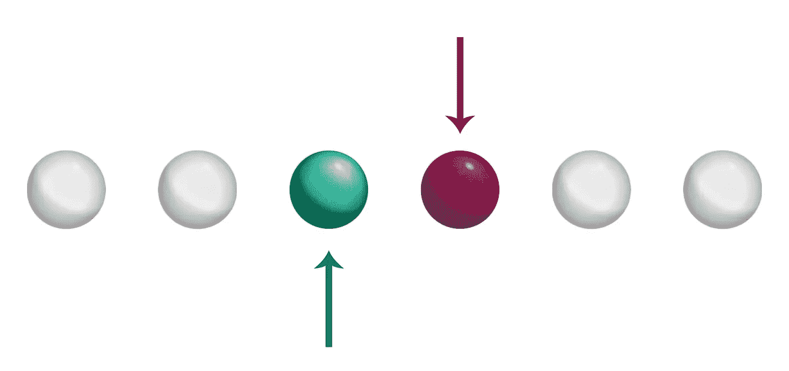
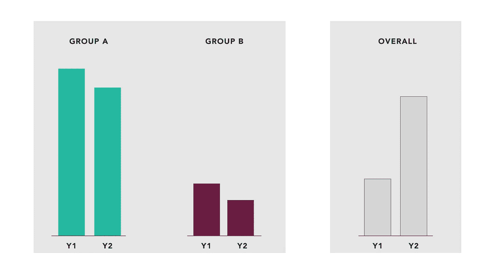
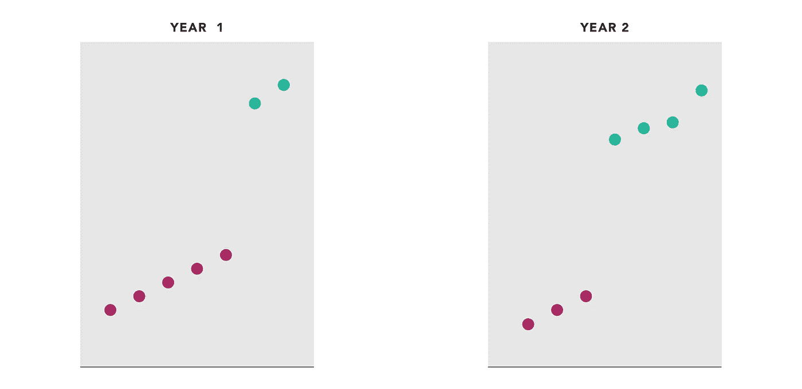
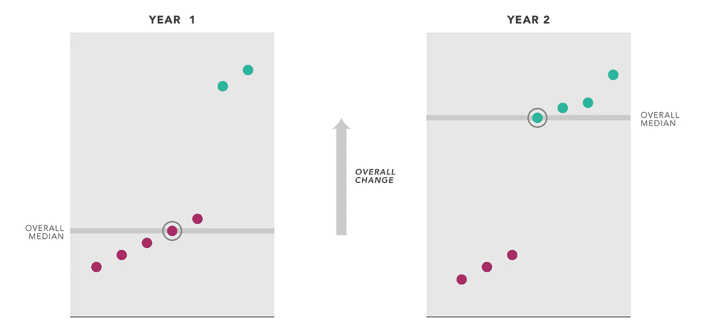
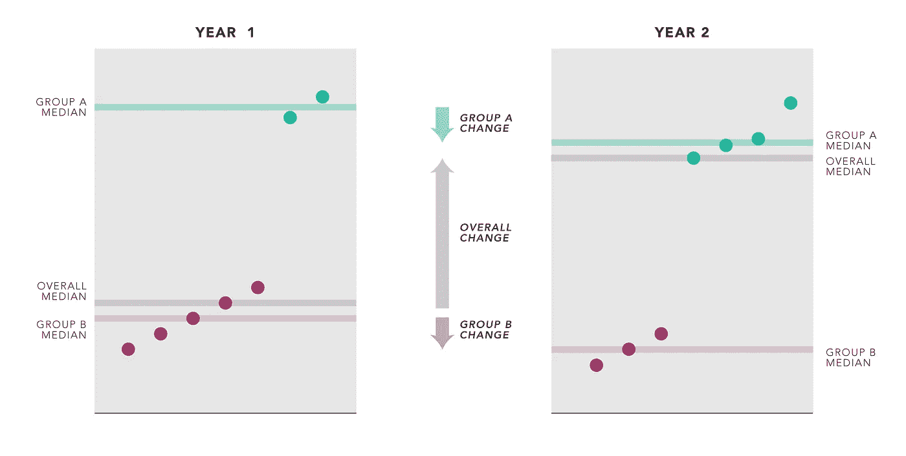

# 解释数据中的矛盾趋势

> 原文：<https://towardsdatascience.com/explaining-paradoxical-trends-in-data-25ce4b6eec40?source=collection_archive---------6----------------------->



在我的工作中，我帮助普通人理解复杂的数据。偶尔有人会完全不知所措:他们会观察一段时间的变化，看到总值**下降了**。但是当他们仔细观察时，他们发现他们使用的每个类别**都增加了**。*他们问，他们的数据有什么问题？*

实际上没什么不对。

他们刚刚无意中发现了一个极其普遍的统计悖论；但它可能会一直令人困惑。以下是我如何试图解释正在发生的事情，这样他们就可以继续他们的生活(并向他们的老板汇报结果)。

**从一个例子开始:**



Median values in two different years, for two groups, and overall.

我们可以清楚地看到这个悖论:

*   A 组**下降**
*   B 组**拒绝**
*   总的来说，整个系统**增加**

这个例子很普通，这些数据可以在任何地方出现:公司的薪水，网络流量，病人对治疗的反应。你可能会问，我们怎么能同时看到这两种趋势呢？

## 这是怎么回事？

首先让我们看一下数据集(我已经把它保持得很小了):



The data, split by years, with groups shown by color.

这很容易地证实了柱状图中的汇总趋势:绿色组下降，红色组也下降。但是其他的事情也在发生。

**各组的大小不同**

在第 1 年，数据以红色数据为主(B 组)，但这在第 2 年发生了变化，因此绿色数据更常见。中间数据点是红色的，然后变成绿色。我们可以看到绿色比红色高。这意味着整体中位数必须上移(这同样适用于平均值或其他集中趋势的衡量标准)。



**悖论就这样解决了。**两种变化同时发生:

1.  **个别测量的实际值**增加。由于通货膨胀，工资上涨了。交通速度加快。病人会好起来。
2.  我们没有仔细控制我们测量的内容，并且样品的**成分发生了变化**。

在一个理想的、科学严谨的世界里，我们不会让第二种情况发生。相反，我们会设计一个实验，在所有类别中有相同数量的受试者(“控制”这些差异)。但是在观察研究中，以及在混乱的现实世界中，我们经常做不到这一点。即使在科学领域，你也可以在事实发生后意识到，主题并不像你想象的那样相似。所以我们使用现有的数据——但是我们在解释这些数据时必须更加老练。

所以看似矛盾的模式实际上是两种变化同时出现:



群体平均水平确实下降了，全球平均水平确实上升了。“悖论”是我们天真的假设，即这些必须以同样的方式进行。

**解决办法？**

您可以通过在未来更多地控制您的组来避免这种情况，确保您每次都有相同的数量。

在报告您的结果时，您可能希望坚持总体平均值或组平均值，这取决于您试图从数据中了解什么。如果问题是，“这些病人治疗有效吗？”答案是肯定的，因为两组都有进步。如果问题是，“我所有的病人有多健康？”你要说“更差”是因为整体平均水平。

当向他人报告这些结果时，你可以试图隐藏一种效果，而强调另一种效果。但是你可能也需要变得更复杂一点——给出一个和这个很像的解释。

*(这种效应有时被称为逆转悖论或辛普森悖论。)*

*下面的样本数据集:*

```
year     group    value
1        A        7
1        A        8.5
1        A        10
1        A        11.5
1        A        13
1        B        32
1        B        34
2        A        5.5
2        A        7
2        A        8.5
2        B        27
2        B        28.5
2        B        29.5
2        B        33
```