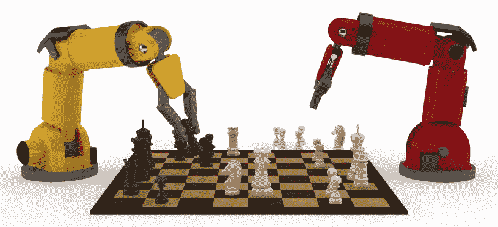
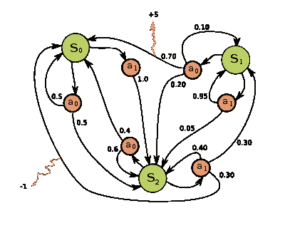
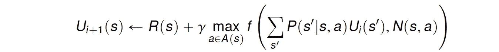
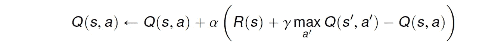
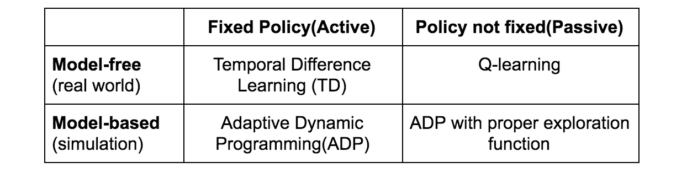

# 解释强化学习:主动还是被动

> 原文：<https://towardsdatascience.com/explaining-reinforcement-learning-active-vs-passive-a389f41e7195?source=collection_archive---------1----------------------->

这篇文章假设你熟悉强化学习(RL)和马尔可夫决策过程的基础知识，如果没有，请先参考[这篇](https://medium.com/@shweta_bhatt/reinforcement-learning-101-e24b50e1d292)前一篇文章。

在这篇文章中，我们将探究，

1.  ***解决一个 RL 问题需要哪些要素？***
2.  什么是被动和主动强化学习，我们如何比较这两者？
3.  ***常见的主动和被动 RL 技术有哪些，适用的场景有哪些？***

# 解决 RL 问题需要哪些要素？

让我们考虑一个问题，代理可以处于各种状态，并且可以从一组动作中选择一个动作。这类问题称为 ***序贯决策问题*** 。一个****的数学框架就是捕捉这样一个**完全可观测的、非确定性的环境**，具有**马尔科夫转移模型和加性报酬**的主体在其中行动。MDP 的解是一个 ***最优策略*** ，它指的是**最大化总累积报酬**的每个状态的行动选择。因此，代表代理环境的 ***转换模型*** (当环境已知时)和决定代理在每个状态下需要执行什么动作的 ***最优策略*** 是训练代理学习特定行为的必需元素。****

********

****Fig 1: Markov Decision Process (source: wikipedia)****

# ****什么是被动和主动强化学习，我们如何比较这两者？****

****主动强化学习和被动强化学习都是强化学习的类型。在被动 RL 的情况下，代理的策略是固定的，这意味着它被 ***告知做什么*** 。与此相反，在主动 RL 中，代理 ***需要决定做什么*** ，因为没有固定的策略可供其操作。因此，被动 RL 代理的目标是执行固定的策略(动作序列)并对其进行评估，而主动 RL 代理的目标是采取行动并学习最优策略。****

# ****有哪些常见的主动和被动 RL 技术？****

# ******被动学习******

****由于代理的目标是评估最优策略有多好，代理需要学习每个状态 *s* 的期望效用 *Uπ(s)* 。这可以通过三种方式实现。****

## *******直接效用估算*******

****在这个方法中，代理执行一个**试验序列或运行**(状态-动作转换序列，一直持续到代理到达终端状态)。每个试验给出一个样本值，代理根据样本值估计效用。可以计算为样本值的**移动平均值。*主要缺点是这种方法错误地假设* ***状态效用是独立的*** *，而实际上它们是* [***马尔科夫***](https://en.wikipedia.org/wiki/Markov_property) *。*还有，收敛慢。******

**假设我们有一个 4x3 的网格作为环境，代理可以在其中向左、向右、向上或向下移动(一组可用的操作)。跑步的例子**

****

**总奖励从 *(1，1)* = 0.72 开始**

## *****2。*自适应动态规划****

**ADP 是一种比直接效用估计更智能的方法，因为它通过将状态的效用估计为处于该状态的奖励和处于下一状态的预期折扣奖励之和来运行试验以学习环境模型。**

****

**其中 *R(s)* =处于状态的报酬 *s* ， *P(s'|s，π(s))* =过渡模型， *γ* =贴现因子， *Uπ(s)* =处于状态的效用 *s'* 。**

**可以使用**值迭代算法**来解决。该算法收敛很快，但是对于大的状态空间来说，计算可能变得相当昂贵。ADP 是一种基于模型的方法，需要环境的转换模型。无模型方法是时间差异学习。**

**Fig 2: AI playing Super Mario using Deep RL**

## *****3。*时间差分学习(TD)****

**TD 学习不要求代理学习过渡模型。更新发生在连续的状态之间，代理仅更新直接受影响的状态。**

****

**其中 *α* =学习率，它决定了向真实效用的收敛。**

*****ADP 用所有后继状态来调整 s 的效用，而 TD learning 用单个后继状态 s’的效用来调整。TD 的收敛速度较慢，但在计算方面要简单得多。*****

# ****主动学习****

## *****具有探测功能的 ADP*****

**由于主动代理的目标是学习最优策略，代理需要学习每个状态的期望效用并更新其策略。可以使用被动 ADP 代理完成，然后使用值或策略迭代，它可以学习最佳操作。但是这种方法导致了一个贪婪的代理。 ***因此，我们使用一种方法，对未探索的动作给予较高的权重，对具有较低效用的动作给予较低的权重。*****

****

**其中 *f(u，n)* 是随着期望值 *u* 增加并且随着尝试次数 *n* 减少的探索函数**

****

**R+ 是一个乐观的奖励，Ne 是我们希望代理在每个状态下被迫选择一个动作的次数。 ***探索功能将被动代理转化为主动代理。*****

## ****②*。问学*****

**Q-learning 是一种 TD 学习方法，它不需要代理学习过渡模型，而是学习 Q 值函数 *Q(s，a)* 。**

****

**q 值可以使用下面的等式来更新，**

****

**可以使用以下策略选择下一个操作，**

****

**同样，这比 ADP 计算简单，但速度较慢。**

****

**Table 1: Comparison of active and passive RL methods**

**我推荐以下资源来更深入地理解这些概念，**

1.  **[**【强化学习——简介**](http://incompleteideas.net/book/the-book-2nd.html)**——理查德·萨顿和安德鲁·巴尔托著****
2.  ****人工智能:一种现代方法****
3.  ****[**教材**](http://www0.cs.ucl.ac.uk/staff/d.silver/web/Teaching.html) —作者大卫·西尔弗****