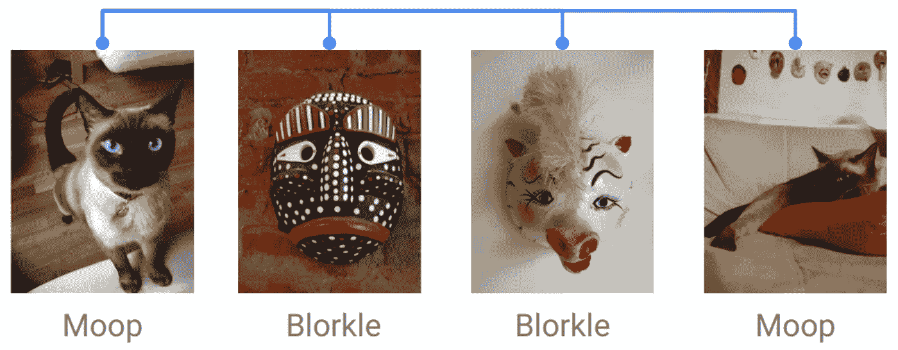
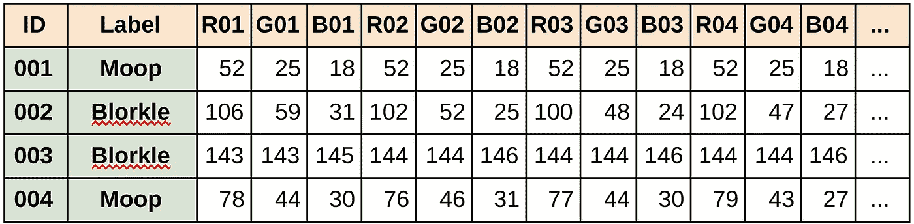
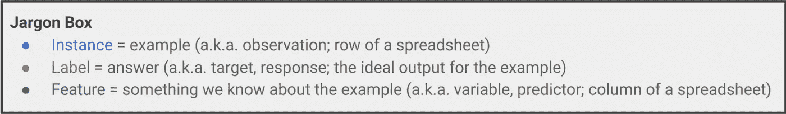

# 向孩子(或你的老板)解释监督学习

> 原文：<https://towardsdatascience.com/explaining-supervised-learning-to-a-kid-c2236f423e0f?source=collection_archive---------6----------------------->

既然知道了[机器学习](http://bit.ly/quaesita_simplest)是什么，那就来认识一下最简单的那种。我在这里的目标是让所有人和(几乎)所有年龄的人都熟悉它的基本术语:*实例、标签、特征、模型、算法和监督学习。*

# 例子

请看:四个实例！

实例也被称为“实例”或“数据点”或“[观察值](http://bit.ly/quaesita_vocab)”

# 数据表

当我们把这些例子放到表格中时，它们看起来像什么？遵循惯例(因为礼貌是好的)，每一行都是一个实例。

[数据](http://bit.ly/quaesita_hist)不好看吗？但是我们到底在看什么？让我们从两个特殊的列开始:一个惟一的 ID 和一个每个实例的标签，因为这次我们很幸运。

# 标签

标签是正确答案。当我们向计算机展示这样一张照片时，我们希望它能学会输出什么，这就是为什么有些人更喜欢用“目标”、“输出”或“反应”这样的术语。

# 特征

其他栏里有什么？像素颜色。不像你，电脑把图像看成数字，而不是漂亮的灯光。你看到的是像素的红-绿-蓝值，从图像的左上角开始向下。不相信我？尝试将我的数据表中的值输入到这个 [RGB 色轮](https://www.colorspire.com/rgb-color-wheel/)中，看看它会给出什么颜色。想知道如何从照片中获取像素值？回头看看我的代码[这里](https://github.com/kozyrkov/deep-learning-walkthrough/blob/master/Demo04.pdf)。

你知道什么很酷吗？每次你看一张数码照片，你都在分析数据，理解以一串数字形式存储的东西。不管你是谁，你已经是一名数据分析师了。你这个摇滚明星，你！

> 你已经是数据分析师了！

这些像素值是计算机将要学习的输入。我不太喜欢机器学习的名称(“特征”)，因为这个词意味着各种学科中的各种事物。你可能会看到人们用其他词来代替:“输入”、“变量”或“预测”。

# 模型和算法

我们的特征将形成模型的基础(这是食谱的一个花哨的词)，计算机将使用它从像素颜色到标签。

> 模型只是“配方”的一个花哨的词

但是怎么做呢？这是机器学习算法的工作。你可以在我的另一篇[文章](http://bit.ly/quaesita_emperor)中看到它是如何在幕后工作的，但现在，让我们使用一个现有的令人敬畏的算法:你的大脑！

# 监督学习

我希望你成为我的机器学习系统。再次浏览实例并做一些学习！这是什么？

Classify this image using what you’ve learned from the examples above.

"布洛克尔"吗？没错。你能行的！你刚才做的是监督学习，牛逼！你现在已经体验到了最简单的学习方式。如果你能把你的问题框定为监督学习，那是个好主意。其他的更难…所以让我们来认识一个:[无监督学习](http://bit.ly/quaesita_unsupervised)(本系列文章的第 2 部分)。

**总结:**如果算法对每个实例都有正确的标签，你就在处理监督学习。稍后，它将使用模型或配方来标记新的实例，就像您所做的那样。

In [this video](http://bit.ly/quaesita_ytsupervised), your author gives you a quick refresher on how supervised learning (the topic of this article) differs from unsupervised learning.

# 感谢阅读！YouTube 课程怎么样？

如果你在这里玩得开心，并且你正在寻找一个为初学者和专家设计的有趣的应用人工智能课程，这里有一个我为你制作的娱乐课程:

Enjoy the entire course playlist here: [bit.ly/machinefriend](http://bit.ly/machinefriend)

# 与凯西·科兹尔科夫联系

让我们做朋友吧！你可以在 [Twitter](https://twitter.com/quaesita) 、 [YouTube](https://www.youtube.com/channel/UCbOX--VOebPe-MMRkatFRxw) 和 [LinkedIn](https://www.linkedin.com/in/kozyrkov/) 上找到我。有兴趣让我在你的活动上发言吗？使用[表格](http://bit.ly/makecassietalk)取得联系。