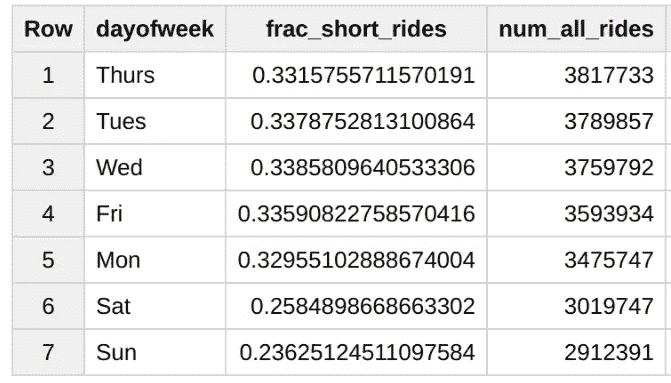
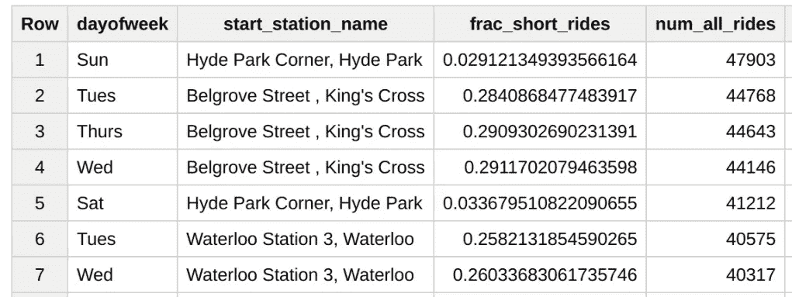
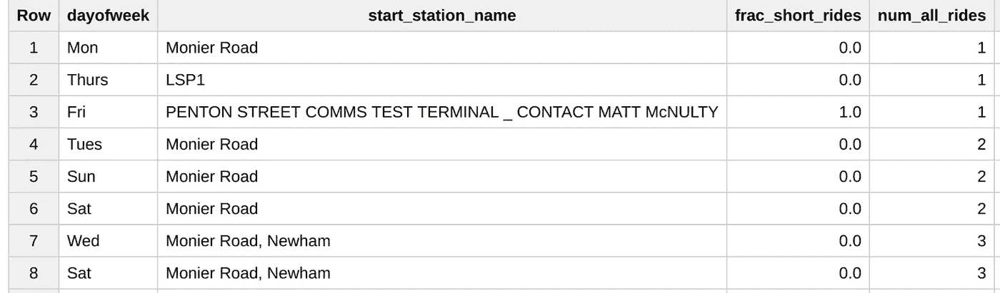

# 解释这个笑话:“当公司说他们需要‘人工智能’的时候，他们真正需要的是一个带有 GROUP BY 的 SELECT 子句。”

> 原文：<https://towardsdatascience.com/explaining-the-joke-half-the-time-when-companies-say-they-need-ai-what-they-really-need-is-a-3ca244beff10?source=collection_archive---------6----------------------->

Mat Vellosso [最近发推文](https://twitter.com/matvelloso/status/1001899539484192768):


它像病毒一样传播开来。嗯，就像一个无聊的笑话一样，奥巴马的[不痛不痒的母亲节推特](https://twitter.com/BarackObama/status/995673081531248642)被十倍于奥巴马的人喜欢。尽管如此，将近一半喜欢 Mat Velloso 的推文的人也转发了它。

像所有好的笑话一样，这里有几个层次和一个巨大的真理内核。所以，让我成为*那个*家伙，那个解释笑话并从中获取所有乐趣的家伙。

长话短说:如果你只有几个独立的输入特征，SELECT + GROUP BY 可能和一个奇特的机器学习模型一样好。只有当特征数量增加，因素变得依赖时，你才需要机器学习。

# 大数据分析

假设您想预测在伦敦租了一辆自行车的人是否会在 10 分钟内归还自行车。你认为人们会在周末进行更长时间的骑行，所以在工作日进行短距离快速骑行的概率更高。你可以用一个 [SELECT GROUP BY](https://bigquery.cloud.google.com/savedquery/611527277052:10576bf5b79d42b5a832f73341934800) 来完成:

```
#standardsql
CREATE TEMPORARY FUNCTION dayOfWeek(ts TIMESTAMP) AS
(
  ['Sun', 'Mon', 'Tues', 'Wed', 'Thurs', 'Fri', 'Sat'][ORDINAL(EXTRACT(DAYOFWEEK FROM ts))]
);WITH bikeshare AS (
  SELECT
    IF(duration < 600, 1, 0) AS short_ride,
    dayOfWeek(start_date) AS dayofweek
  FROM `bigquery-public-data.london_bicycles.cycle_hire`
)SELECT 
  dayofweek,
  SUM(short_ride)/COUNT(1) AS frac_short_rides,
  COUNT(1) AS num_all_rides
FROM
  bikeshare
GROUP BY
  dayofweek
ORDER BY num_all_rides DESC
```

运行这个，我们对< 10 min rides will be 33% on weekdays and 24% on weekends:



We wanted to find the likelihood that bicycles are returned in less than 10 minutes and we just computed it in brute force over the entire historical dataset. The reason this works is that there were 2.9 million rentals on Sunday and 23.6% of them were returned. Once you have Big Data, it is super-easy to make statistically significant inferences.

# Sparse input features

What if you add one more factor though? In addition to day of the week, we would like to use the station that the bicycle is being rented from as an input feature. Perhaps rentals in the city center are likely to be short. We can simply [的预测通过](https://bigquery.cloud.google.com/savedquery/611527277052:2170daa17d4d457aaf81d28874bac1a7)在我们的组中添加第二个字段:

```
SELECT 
  dayofweek, start_station_name,
  SUM(short_ride)/COUNT(1) AS frac_short_rides,
  COUNT(1) AS num_all_rides
FROM
  bikeshare
GROUP BY
  dayofweek, start_station_name
ORDER BY num_all_rides DESC
```

桌面很好:



你需要考虑到在海德公园租自行车的人会长期保管它们。但是最底层…你在莫尼耶路有严重的问题:



你愿意根据 1、2 个历史数据点来做预测吗？这就是机器学习的用武之地——以智能的方式处理像车站这样的稀疏输入。一个好的 ML 算法不是使用由 GROUP BY 指定的硬阈值，而是“借用”其他站的可能性，并在 Monier Road 使用它们。也许您会添加一个指示车站附近人口密度的要素，然后 ML 模型将借用具有相似人口密度的车站的可能性。

我还没毁了这个笑话吗？

.

.

.

.

.

.

.

好吧，那么，让我来为你毁了它——就像所有好笑话一样，这个笑话在仔细检查后会崩溃。Mat 到底在说什么？一半关注人工智能的公司有如此多的数据行，他们可以简单地进行分组？这样的公司也没有足够的列，他们需要一个 ML 模型？