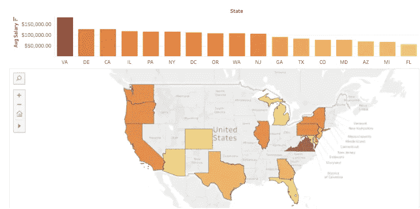
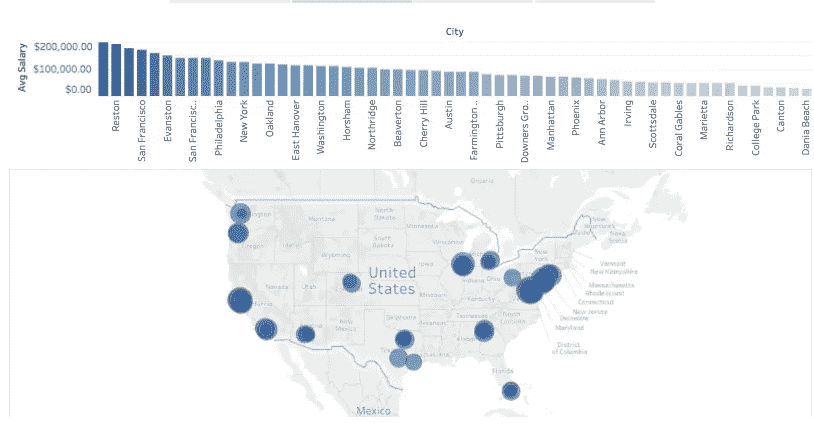
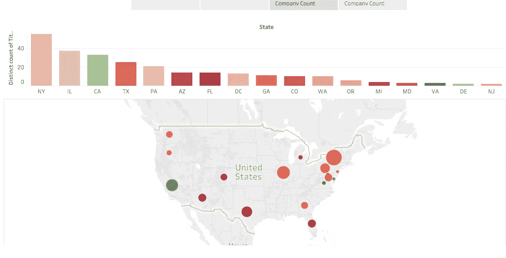

# 探索性分析:美国数据科学家的薪水

> 原文：<https://towardsdatascience.com/exploration-analysis-data-scientist-salaries-across-the-usa-9e38aeb1e71a?source=collection_archive---------5----------------------->

在我之前的[帖子](https://medium.com/@valeria.rozenbaum/data-scientist-salaries-across-the-usa-4d089f09522d)中，我谈到了在全美国征集 Indeed.com 的数据科学家职位。虽然我能找到 10，500 多份清单，但其中很少包含工资数据，许多工资是按小时、月或周计算的。在对数据进行大规模清理后，我只剩下 493 份工资用于建模。薪酬中位数为 10 万美元，其中 236 家高于中位数，257 家低于中位数。我很兴奋能去做模特。然而，在进入大结局之前，我想看看我还能从这些数据中获得什么样的见解。这个任务要求我从我的数据科学家工具箱中拿出我最喜欢的数据探索工具之一——Tableau！

当我将数据加载到 Tableau 时，我最感兴趣的是了解数据科学家的工资如何因地点而异，以及哪些地点的独特工作列表数量最多。

这里我们有一张各州平均工资的热图，深色代表高工资，浅色代表低工资。正如我们从地图上看到的，弗吉尼亚州的数据科学家工资似乎最高，平均为 182，000 美元。最差的是佛罗里达州，平均工资为 57253 美元。

通过观察各个城市的平均工资情况，我可以进一步细分这些数字。在收入最高的弗吉尼亚州，麦克林、莱斯顿和安布勒的平均工资最高，分别为 19.6 万美元、19 万美元和 17.5 万美元。在西海岸，旧金山以 171，245 美元的平均工资紧随其后。从较低的范围来看，佛罗里达州的 Dania Beach 以 30k 美元排名垫底。然而，来自佛罗里达州的其他人成功地将他们的数字拉高了一点，珊瑚墙和迈阿密分别为 51，311 美元和 91，000 美元。

在如此大的工资范围内，我想看看我实际上是在做什么样的工作。毕竟，弗吉尼亚在顶端，但是我的样本实际上处理了多少独特的工作列表。当你考虑到其他地方有更多的空缺职位需要填补时，少量的列表并不算多。

上图中，我们有一张地图，按照各州独特工作列表的数量来划分大小，并按照平均工资来着色。颜色从暗红色到暗绿色不等，最暗的绿色代表最高工资，最暗的红色代表最低工资。在这里，我们对之前的数据进行了分析。虽然弗吉尼亚的工资可能是最高的，但我们只看了 3 个独特的工作列表，这实际上将弗吉尼亚排在了机会的最后。加州似乎保持了它以前的记录，有来自 24 家不同公司的 33 个不同的职位，平均工资为 12.5 万美元。此外，虽然纽约州和伊利诺伊州可能不是薪酬最高的州(11.5 万英镑不是我抱怨的数字)，但它们的机会数量确实最多，分别有 55 个和 37 个独特的职位空缺。