# 探索性分析和回归模型帮助抗击寨卡

> 原文：<https://towardsdatascience.com/exploratory-analysis-and-regression-model-helping-fight-zika-bc6c6b111d83?source=collection_archive---------3----------------------->

Alerta Zika！是一项合作活动，旨在探索数据和技术改善寨卡病毒应对措施的潜力。美洲开发银行在包括里约热内卢市政厅和该市一些主要大学在内的几个合作伙伴的支持下组织了这次活动。从 2016 年 12 月 2 日到 3 日，大约 10 个注册团队探索了流行病学、环境和社会因素，以了解和解释这种疾病的进展。总结里约热内卢抗击寨卡疾病的努力，是一天半的辛苦工作。我们获得了里约热内卢市 2015 年和 2016 年期间登记的所有寨卡、登革热和基孔肯雅病病例的数据集。为了了解数据，我们的团队开始“玩”数据集并检查变量。在这样做的过程中，我们对寨卡的进化模式及其在 2016 年前几个月爆发期间的作用产生了幻想。

我们的假设是，疾病传播模式及其在时间、城市地区和天气方面的相关性可以用作一个指标，以显示疾病在何时何地传播，并帮助城市官员决定分配资源的最佳方式。我们当时设定的目标是，绘制一幅里约热内卢地图，展示寨卡病毒在不同时间和温度下的历史演变。在与市卫生秘书代表的几次交谈中，我们想知道一个社会发展指标是否可以提供关于传播模式的见解。我们决定将人类发展指数(HDI)——在巴西被称为 IDH——作为一个社会参数。

然后，我们将坐标(纬度和经度)、案件发生的日期、四季温度以及里约关于收入、教育水平和寿命的社会发展指标确定为目标变量。我们的初步任务是创建一个由里约热内卢城市地图和数据框组成的网格，以聚集来自不同数据集的变量子集。我们执行探索性分析的第一个目标是探索分布的形状。网格帮助我们检查箱子的位置；探索约 400 米的区域，这是蚊子的活动范围，并在更广阔的区域聚集患者病例。这也使我们能够检查疾病在整个城市的传播范围，并确定大多数病例发生的地区。

通过进行时间序列分析，我们能够确定温度和病例数之间的相关性。在这一点上，了解蚊子的生命周期是有价值的。埃及伊蚊在从 23 摄氏度到 28 摄氏度(大约 73 到 82 华氏度)的温度变化中茁壮成长。低于或高于这一阈值几度并不一定会杀死蚊子，但会使环境对其发展更不舒适，从而延缓其进化。从卵中的病毒接种到一个个体中，有 20 到 25 天的时间，所以前一个月的蚊子负责本月的病人。从下面的曲线图可以看出，通过逐月比较全市的疾病病例和前一个月每天的温度变化，3 月和 4 月期间的疫情(曲线图 3 和 4)遵循了整个 2 月和 3 月观察到的最佳条件，在这两个月的大部分时间里观察到了 23 至 28 摄氏度的阈值。红圈对应的是病例最多的地区。

*剧情一*

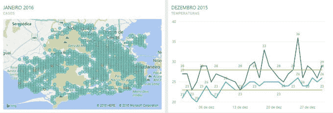

*剧情二*

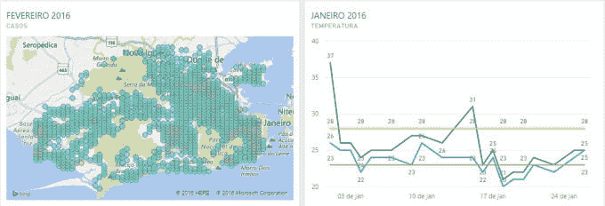

*剧情三*

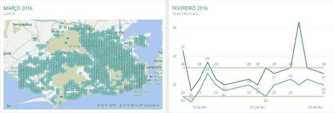

*剧情四*

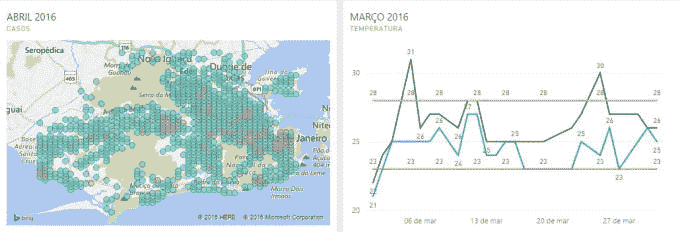

*剧情五*

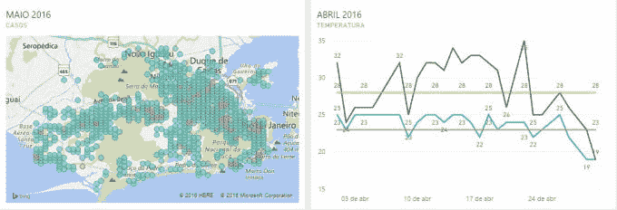

*剧情 6*

*剧情 7*

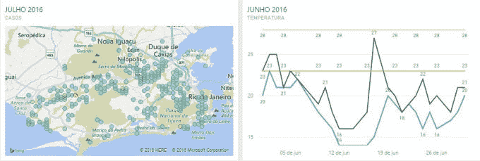

这让我们获得了第一个有意义的发现:*上个月的气温似乎会影响本月的病例数量*。

当我们将注意力转移到手头的社会指标数据时，我们能够识别出一种奇怪的行为。暴发期间的一些关键地区具有低 IDH 系数的相似性。下面的情节提供了直观的支持。橙色圆圈的大小与 IDH、较小的圆圈/下 IDH 的等级相关，反之亦然。

*剧情 8*

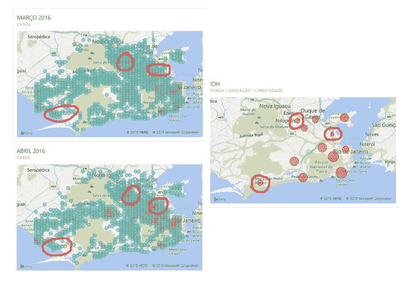

上图中突出显示的区域对应马雷(一个社区)，城市的远北区和远西区。与该市其他地区相比，这些地区的社会指标水平较低。

尽管收入似乎不是影响疫情爆发的社会影响因素——从下面的图表中可以看出——但将该市最富裕的南区行为与 3 月和 4 月的情况进行比较，可以看出一个特点。在这个特殊的领域，存在着巨大的经济差异。最高档的地址位于一些*贫民窟*的步行距离内(贫民窟通常位于该地区周围的山上)，那里的 IDH 与之前地块上的相似)。

*剧情 9*

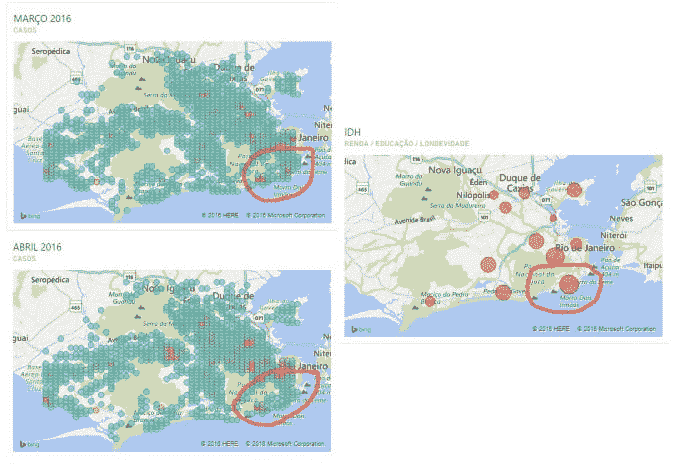

从这一观察中，我们得出了第二个有意义的见解:*在疫情爆发期间，社会指标(IDH)似乎在病例数量最多的地区起到了影响作用*。

随着我们进一步分析，其他奇怪的行为引起了我们的注意。即使气温从 23 至 28 摄氏度的阈值下降，一些地区仍然出现在最高得分病例中(从下面 5 月至 7 月的比较中可以看出)。

*剧情 10*

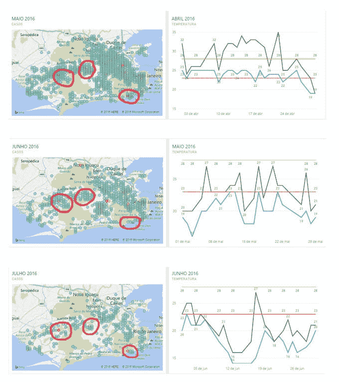

这些地区的共同点是都被树林和森林包围着。这一共同因素提供了我们提供的第三个有意义的见解:*一些复发疾病的病灶区似乎生长在树林和森林地区的周围或附近*。

探索性分析通常是预测建模的良好开端，因为它有助于进一步理解数据集并总结其主要特征。探索数据和制定可能导致新的数据收集和实验的假设是从数据中提取有用信息的主要组成部分；提出假设；并支持选择适当的统计工具和技术。我们在数据考察中的主要目标是设定有助于理解过去行为的第一步，以便为未来的“作物”准备“种子”。我们的第三名是我们的骄傲，似乎表明这个目标已经实现。

**数据远征后**

我们继续探索数据，并汇总其他变量。我们的目标是获得一些可以添加到初始探索性分析中的预测模型。这些新的变量是每个街区的人口和降雨量。我们还添加了更多关于 2016 年最后几个月和 2017 年 1 月初的温度数据。

第一种选择是简单的线性回归，使用每个邻域的可变人口来预测基于人口的病例。下面是 R 和统计读数中的一些代码块(我们打算在 markdown 文件中显示更多信息，这是一种可以一起显示文本、代码和图表的文件)。

型号:

数据集的快速视图:

“bairro”代表邻里；针对寨卡病例的“casos _ Zika”；“populacao”代表人口。

来自 Rstudio 控制台的一些统计数据:

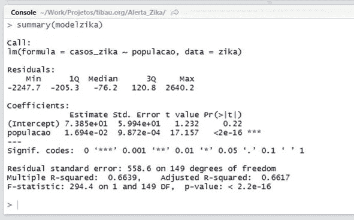

**诊断图**

在图 1(残差与拟合值)中，在某一点上，残差沿水平线均匀分布，但也有异常值。在图 2(正态 Q-Q)中，残差似乎正态分布，至少在某种程度上是这样。

*情节 1*

*剧情二*

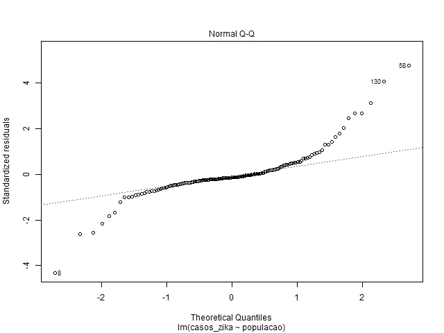

在补充图 1 的图 3(标度-位置)中，一些残差沿预测值范围平均分布，显示出一些同质性。图 4(残差对杠杆)将有影响的观察结果确定为#120 和#23。

*剧情三*

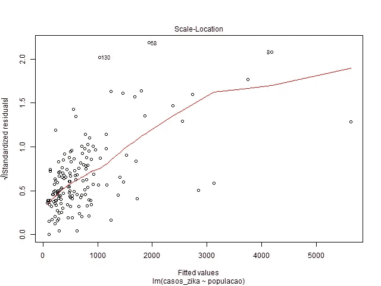

*剧情四*

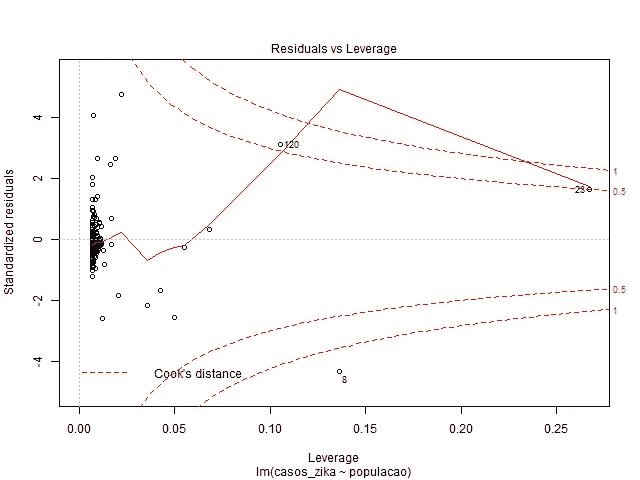

基于当温度阈值在 23 到 28 摄氏度之间时，蚊子的周期更快的理论，我们试图检查降雨是否也有助于繁殖。然后，我们试图确定这两个变量与寨卡病例数量之间的关系。我们的第二个选择是使用多元回归模型来达到这个目标。这种分析是在 Phython 进行的。

下图显示了温度阈值发生率最高的月份是 2015 年 12 月至 2016 年 4 月之间的月份。我们还可以注意到，这一趋势在 2016 年 12 月和 2017 年 1 月初再次出现。

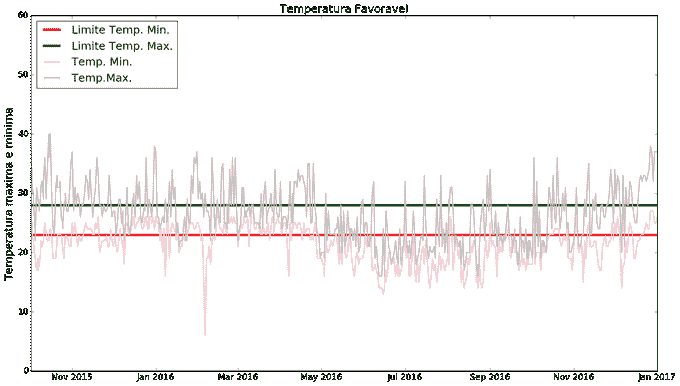

**绿线和红线:**温度阈值

**粉色和灰色线条:**最低和最高温度

接下来的一系列图显示，在显示每周病例数、温度和降雨量的曲线之间存在类似的正趋势。该分析是基于 2016 年疫情爆发期间受到严重影响的 Campo Grande (1)、Santa Cruz (2)和 Guaratiba(3)社区进行的。

**蓝线:**每周病例数

**红线:**温度低于阈值

**黄线:**降雨量

(1)

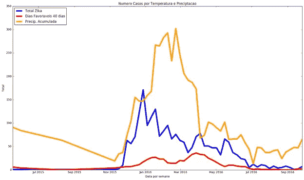

(2)

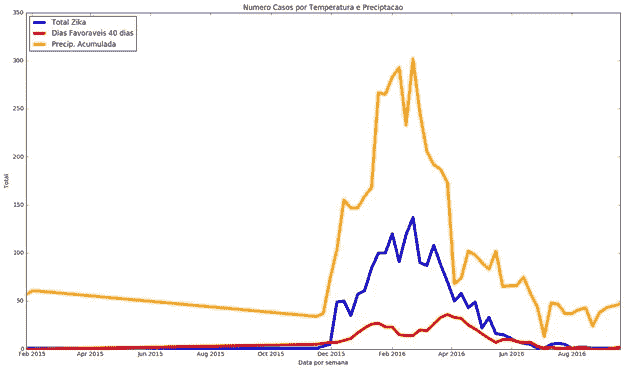

(3)

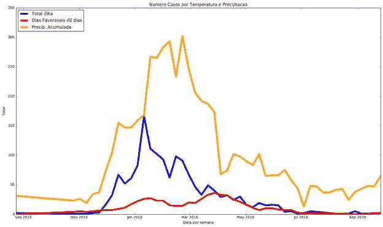

我们决定使用多元回归模型来构建一个预测应用程序。我们通过将实际数据与用于拟合模型的测试数据集中应用的预测数据进行比较的一系列图来测试该模型。

**里约热内卢的测试值与预测值**

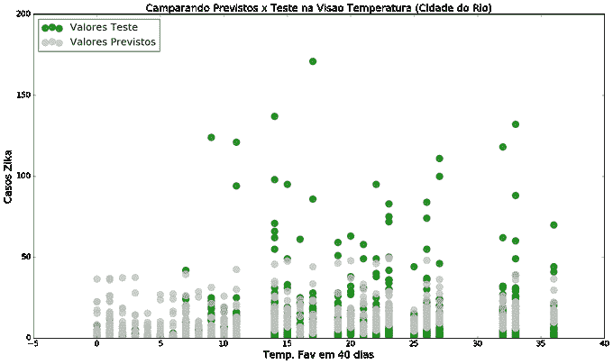

绿点:测试值

灰点:预测值

**里约热内卢的真实案例与预测案例**

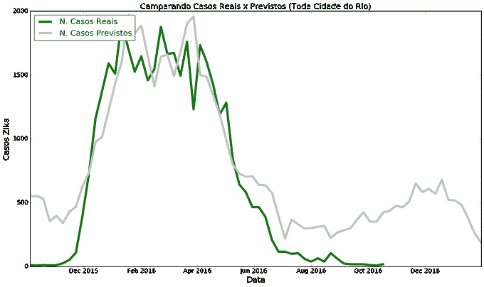

绿线:真实案例

灰色线条:预测案例

**里约热内卢真实案例与预测案例对比**2015 年 12 月& 2016 年

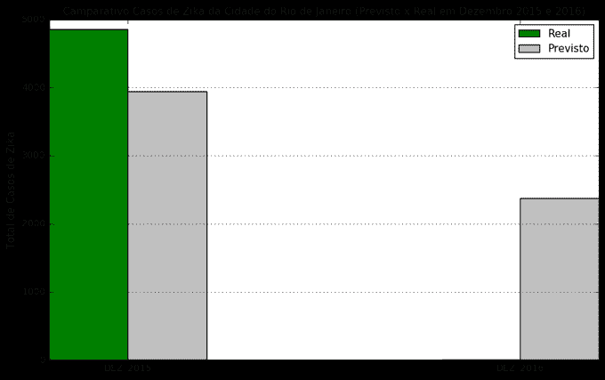

格林:真实案例

灰色:预测病例

在这个特殊的案例中(上图),我们没有 2016 年 12 月实际寨卡病例的数量，所以我们只预测了病例的数量。

**每个街区的分析** : Campo Grande。

Jupyter 笔记本电脑控制台的统计读数:

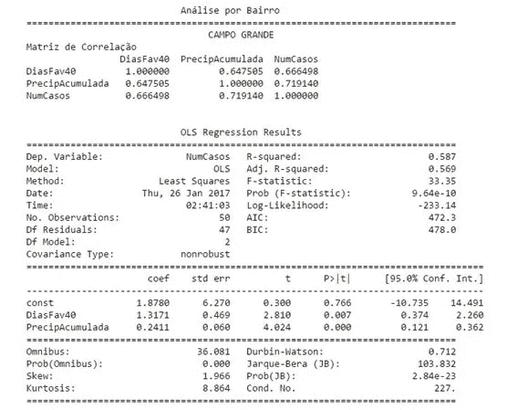

绿线:真实案例

灰色线:预测病例

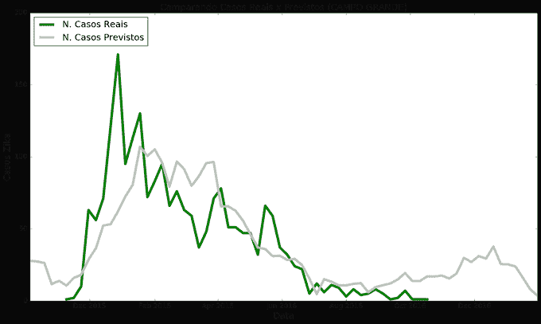

**每个街区的分析**:圣克鲁斯。

统计读数

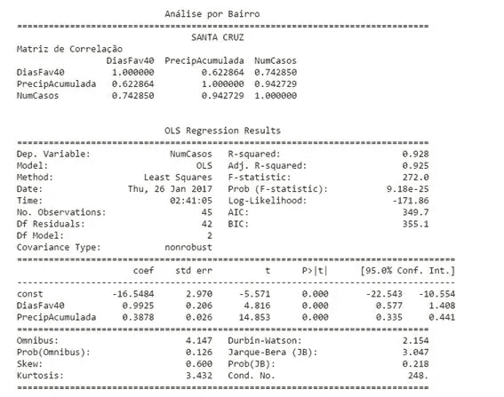

绿线:真实案例

灰色线:预测病例

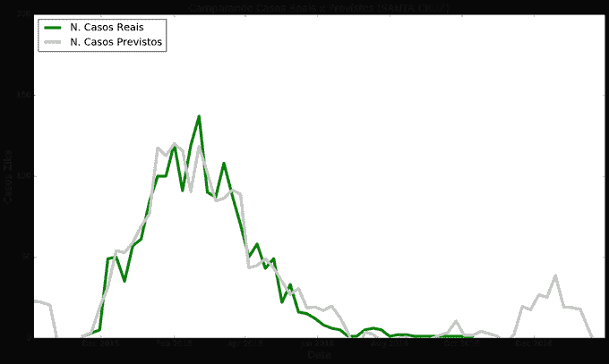

**每街坊分析**:瓜拉蒂巴。

统计读数

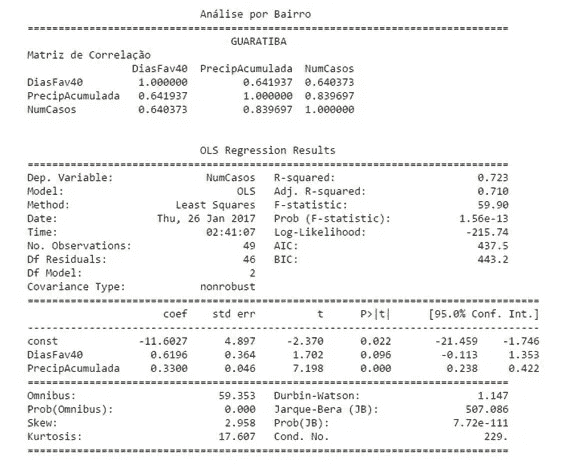

绿线:测试值

灰色线:预测值

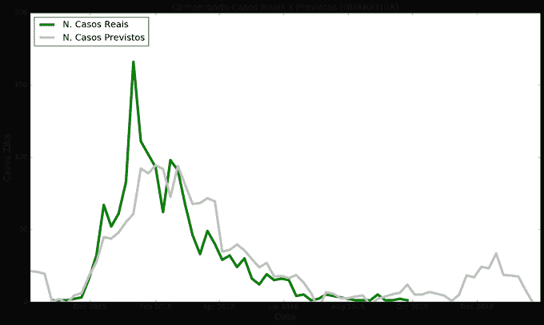

我们创建了一个原型来应用这个模型。这是一个网站，上面有每月寨卡病例数量的信息，以及显示每个社区实际病例和预测病例的图表。

对于那些想了解它的人来说，这里有[和](https://marcelo-tibau.github.io/app-zika/)。