# 利用 R 对 FIFA 18 数据集的探索性分析

> 原文：<https://towardsdatascience.com/exploratory-analysis-of-fifa-18-dataset-using-r-ba09aa4a2d3c?source=collection_archive---------2----------------------->


[Image [1] (Image courtesy: [https://www.easports.com/fifa](https://www.easports.com/fifa))]

随着 2018 年 FIFA 世界杯的临近，我结合了我对足球和数据科学的热爱，使用 r 对 FIFA 18 数据集进行了一次简短的探索性分析。我使用了非身体球员属性，如`Name, Age, Nationality, Overall, Club, Value, Wage, Preferred.Positions.`

我使用了在 [Kaggle](https://www.kaggle.com/thec03u5/fifa-18-demo-player-dataset) 上可用的数据集，其中包含 17，000 多名 FIFA18 中的球员，每个人都有超过 70 个属性。是从网站 [SoFiFa](https://sofifa.com/) 上刮下来的。

如果你对数据可视化感兴趣，你可以看看我的另一篇文章[gg plot ' Em All | Pokemon on R](/exploratory-analysis-of-pokemons-using-r-8600229346fb)。如果你对大数据感兴趣，可以看看我的文章[开始使用 Hive](/getting-started-with-hive-ad8a93862f1a) 。

在开始分析之前，让我们导入库并读入数据集。

```
library(ggplot2)
library(dplyr)
library(gridExtra)df = read.csv(file = "CompleteDataset.csv", stringsAsFactors = FALSE)df = tbl_df(df)df <- select(df, ID, X, Name, Age, Nationality, Overall, Club, Value, Wage, Preferred.Positions)

head(df, 10)
```

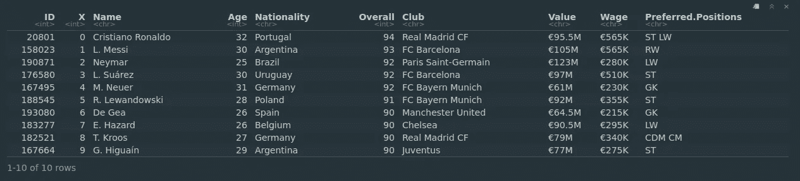

First 10 rows of the dataset [Image [2]]

读取数据后，我做的第一件事是将`Value`和`Wage`列转换为实际的货币值。我编写了一个函数，将一个向量作为输入，并从列中删除“€”符号，然后乘以适当的数字，将其转换为千(K)和百万(M)。

```
toNumberCurrency <- function(vector) {
    vector <- as.character(vector)
    vector <- gsub("(€|,)","", vector)
    result <- as.numeric(vector)

    k_positions <- grep("K", vector)
    result[k_positions] <- as.numeric(gsub("K","",        vector[k_positions])) * 1000

    m_positions <- grep("M", vector)
    result[m_positions] <- as.numeric(gsub("M","", 
    vector[m_positions])) * 1000000

    return(result)
}df$Wage <- toNumberCurrency(df$Wage) 
df$Value <- toNumberCurrency(df$Value)
```

然后，我从`Preferred.Positions`列的空格分隔值中选取第一个位置值。数据集中的不同位置是:`CAM CB CDM CF CM GK LB LM LW LWB RB RM RW RWB ST`。

```
df$Preferred.Positions <- gsub(" ", "", substr(df$Preferred.Positions, 1, 3))
```

基于上面的`Preferred.Positions`，我创建了另一个专栏，将这些`Preferred.Positions`分类为更一般的职位，即`GK DEF MID FWD`。清理后的数据集如下所示:

```
x <- as.factor(df$Preferred.Positions)levels(x) <- list(GK  = c("GK"), 
                  DEF = c("LWB", "LB", "CB", "RB", "RWB"), 
                  MID = c("LW","LM","CDM","CM","CAM","RM","RW"), 
                  FWD = c("CF", "ST"))df <- mutate(df, Position = x)head(df)
```

选择`Preferred.Position`栏中的第一个职位，并创建一个表格，将这些职位分类为更一般的职位，即`GK DEF MID FWD`。

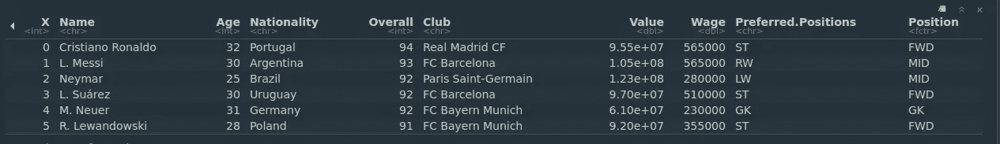

Cleaned data set [Image [3]]

首先，球员的年龄分布。我们看到有很多 25 岁左右的球员。

```
g_age <- ggplot(data = df, aes(Age))g_age + 
geom_histogram(col="orange", aes(fill = ..count..)) + ggtitle("Distribution based on Age")
```

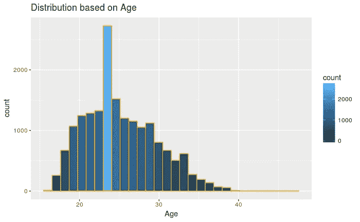

Distribution of players based on their age [Image [4]]

下面的图表显示了运动员的年龄和他们的一般比赛位置之间的关系。

```
g_age + 
geom_density(col="orange", aes(fill = Position), alpha=0.5) + facet_grid(.~Position) + 
ggtitle("Distribution based on Age and Position")
```

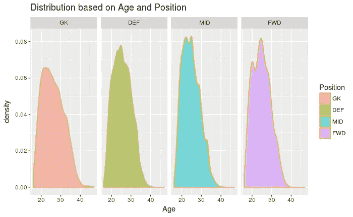

Distribution based on Age and Position [Image [5]]

根据玩家的总体评分来分配玩家。我们看到大多数玩家的总体评分在 65 分左右。

```
g_overall <- ggplot(data = df, aes(Overall))g_overall + 
geom_histogram(col="orange", aes(fill = ..count..)) + ggtitle("Distribution based on Overall Rating")
```

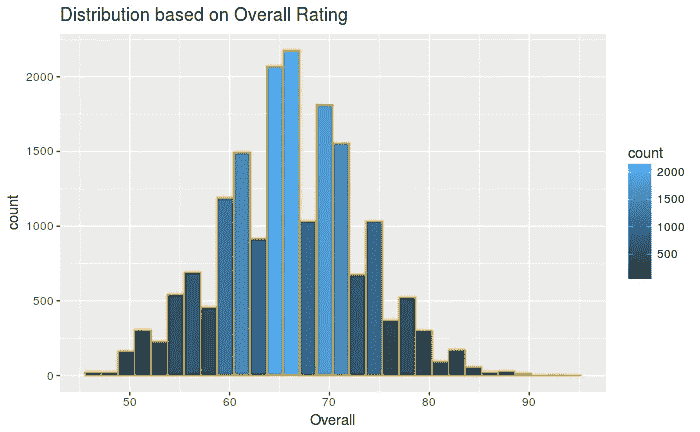

`Distribution based on overall rating [Image [6]]`

来自不同(前 10 名)国家的玩家数量。

```
countries_count <- count(df, Nationality)top_10_countries <- top_n(countries_count, 10, n)top_10_country_names <- top_10_countries$Nationality

country <- filter(df, Nationality == top_10_country_names)ggplot(country, aes(x = Nationality)) + 
geom_bar(col = "orange", aes(fill = ..count..)) + ggtitle("Distribution based on Nationality of Players (Top 10 Countries)")
```

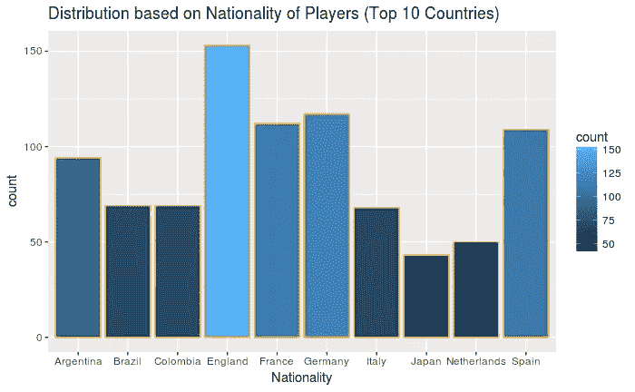

Number of players from different countries [Image[7]]

我使用 R 中的分位数函数来获得玩家`Value`和`Wage`的前 1 %的计数。许多球员的周薪为 10 万€。

```
top_1_percent_wage   <- quantile(df$Wage, probs=0.99)filtered_wage <- filter(df, Wage > top_1_percent_wage)

g_value <- ggplot(filtered_wage, aes(Wage))g_value + 
geom_histogram(aes(fill=..count..)) + 
ggtitle("Distribution of top 1% value")
```

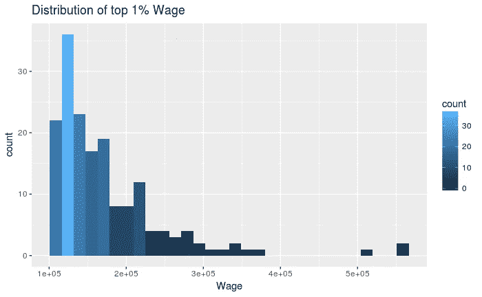

Top 1% wage [Image [8]]

大量的球员价值 2500 万€，随着价格的上涨，人数急剧减少。

```
top_1_percent_value   <- quantile(df$Value, probs=0.99)filtered_value <- filter(df, Value > top_1_percent_value)

g_wage <- ggplot(filtered_value, aes(Value))g_wage + 
geom_histogram(aes(fill=..count..)) + 
ggtitle("Distribution of top 1% Value")
```

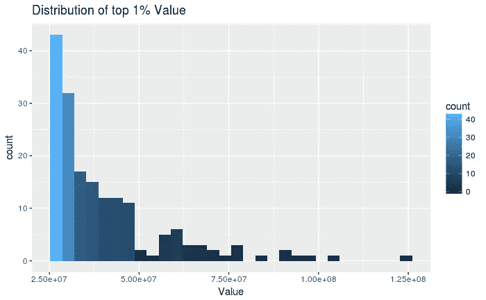

Top 1% player valuation [Image [9]]

为了进一步分析`wage`和`value`，我创建了`wage_brackets`和`value_brackets`。

`wage_brackets`是:`0–100k 100k-200k 200k-300k 300k-400k 400k-500k 500k+`。`value_brackets`是:`0–10M 10–20M 20–30M 30–40M 40–50M 50–60M 60–70M 70–80M 80–90M 90–100M 100M+`。

```
# Create wage bracketswage_breaks <- c(0, 100000, 200000, 300000, 400000, 500000, Inf)wage_labels <- c("0-100k", "100k-200k", "200k-300k", "300k-400k", "400k-500k", "500k+")wage_brackets <- cut(x=df$Wage, breaks=wage_breaks, 
labels=wage_labels, include.lowest = TRUE)df <- mutate(df, wage_brackets)# Create value brackets

value_breaks <- c(0, 10000000, 20000000, 30000000, 40000000, 50000000, 60000000, 70000000, 80000000, 90000000, 100000000, Inf)
value_labels <- c("0-10M", "10-20M", "20-30M", "30-40M", "40-50M","50-60M", "60-70M", "70-80M", "80-90M","90-100M","100M+")value_brackets <- cut(x=df$Value, breaks=value_breaks, labels=value_labels, include.lowest = TRUE)df <-mutate(df, value_brackets)head(df)
```

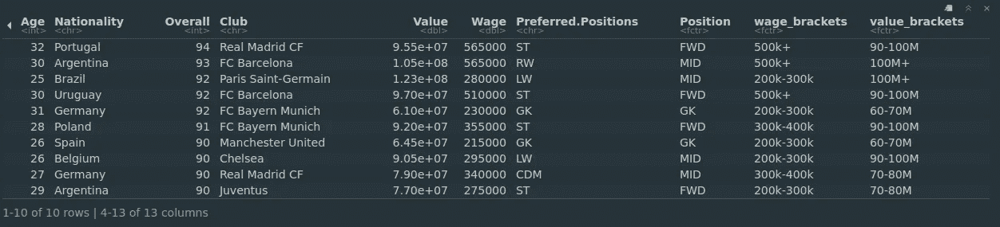

Dataset [Image [10]]

很多球员的工资在 0-10 万英镑之间，估值在 0-5000 万英镑之间。绘制这些值会使图形发生很大的倾斜，因为与其他值相比，它们的幅度很大，因此我没有在这里展示它们。

```
not0To100K <- filter(df, wage_brackets != "0-100k") ggplot(not0To100K, aes(x = wage_brackets)) + 
geom_bar(aes(fill = ..count..)) + 
ggtitle("Distribution of top Wage between 100K-500K+")
```

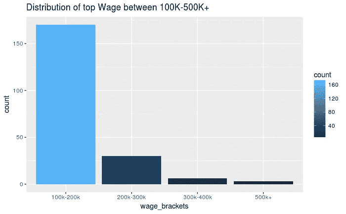

Wage between 100k and 500k+ [Image [11]]

```
moreThan50M <- filter(df, Value>50000000)ggplot(moreThan50M, aes(x = value_brackets)) + 
geom_bar(aes(fill = ..count..)) + 
ggtitle("Distribution of value between 50M-100M+")
```

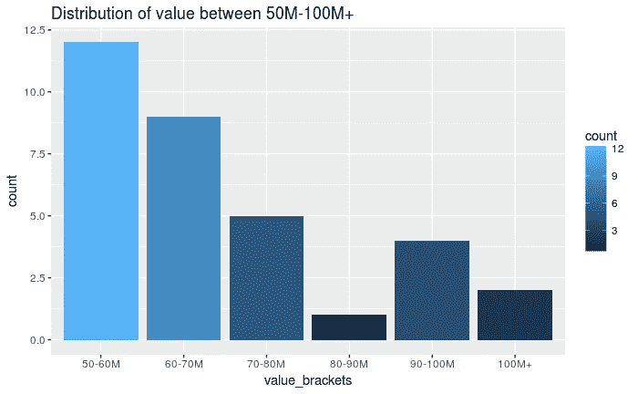

Player valuation between 50M-100M+ [Image [12]]

不同工资等级的球员的年龄和总体情况。工资最高的是年龄在 30 岁左右的 85 岁以上的球员。克里斯蒂亚诺罗纳尔多是上面三个紫色点之一。*在下面的评论区猜另外两个。:P*

```
g_age_overall <- ggplot(df, aes(Age, Overall))g_age_overall + 
geom_point(aes(color=wage_brackets)) + geom_smooth(color="darkblue") + 
ggtitle("Distribution between Age and Overall of players based  on Wage bracket")
```

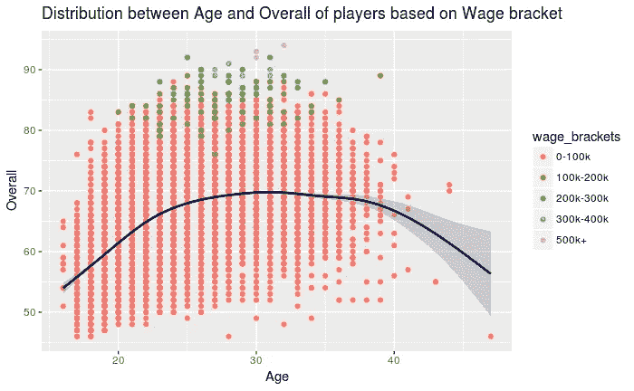

Overall vs Age (Wage) [Image [13]]

玩家的年龄与整体价值的关系图与上面的趋势非常相似。

```
g_age_overall <- ggplot(df, aes(Age, Overall))g_age_overall + geom_point(aes(color=value_brackets)) + geom_smooth(color="darkblue") + 
ggtitle("Distribution between Age and Overall of players based on Value bracket")
```

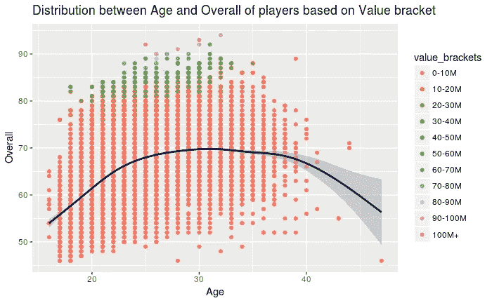

Age vs Overall (Value) [Image [14]]

根据运动员的一般比赛位置确定运动员人数。中场人数最多，其次是后卫，前锋，最后是守门员。

```
ggplot(df, aes(Position)) + 
geom_bar(aes(fill = ..count..)) + 
ggtitle("Distribution based on General Playing Position")
```

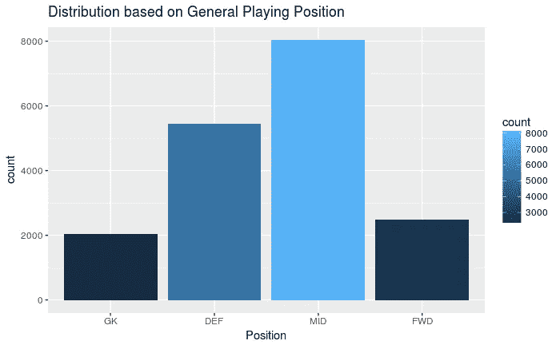

Number of players per playing position [Image [15]]

根据玩家偏好的游戏位置确定玩家数量。基于上面的图表，我们期望一些特定的中场位置有最高的数量，但是这里中后卫的数量是最高的，其次是前锋的数量。

```
ggplot(df, aes(Preferred.Positions)) + geom_bar(aes(fill=..count..)) + 
ggtitle("Distribution of players based on preferred position")
```

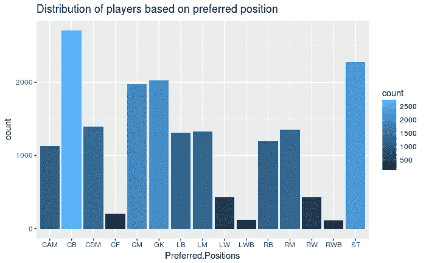

Number of players per Preferred Position [Image [16]]

让我们看看球员的工资是多少，以及他们基于首选位置的估值。

```
gf1 <- filter(df, Value<30000000)g1 <- ggplot(gf1, aes(Preferred.Positions)) + geom_bar(aes(fill=value_brackets)) + 
ggtitle("Position based on Value (0-50M)")gf2 <- filter(df,Value>30000000)g2 <- ggplot(gf2, aes(Preferred.Positions)) + geom_bar(aes(fill=value_brackets)) + 
ggtitle("Position based on Value (50M +)")grid.arrange(g1, g2, ncol=1)
```

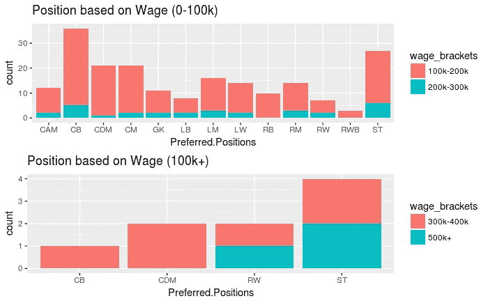

Wage based on Preferred position [Image [17]]

```
gw1 <- filter(df, Wage > 100000, Wage<300000)g1 <- ggplot(gw1, aes(Preferred.Positions)) + geom_bar(aes(fill=wage_brackets)) + 
ggtitle("Position based on Wage (0-100k)") gw2 <- filter(df,Wage>300000) g2 <- ggplot(gw2, aes(Preferred.Positions)) + geom_bar(aes(fill=wage_brackets)) + 
ggtitle("Position based on Wage (100k+)")
grid.arrange(g1, g2, ncol=1)
```

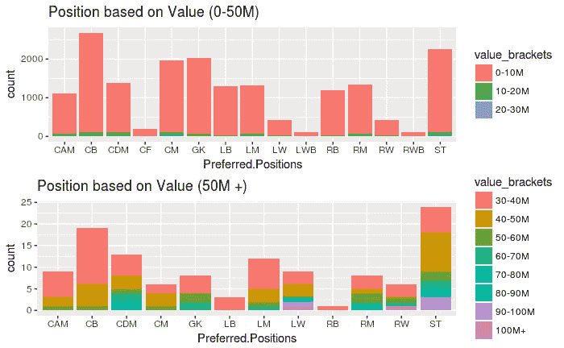

Valuation based on preferred position [Image [18]]

最后，

十大最有价值俱乐部。俱乐部价值通过合计每个俱乐部的球员估价来计算。

```
group_clubs <- group_by(df, Club)club_value <- summarise(group_clubs, total_val = sum(Value))top_10_valuable_clubs <- top_n(club_value, 10, total_val)

top_10_valuable_clubs$Club <-as.factor(top_10_valuable_clubs$Club)

ggplot(top_10_valuable_clubs, aes(x = Club, y = total_val)) + geom_bar(stat = "identity", aes(fill=total_val)) + coord_flip() + ggtitle("Top 10 valuable clubs")
```

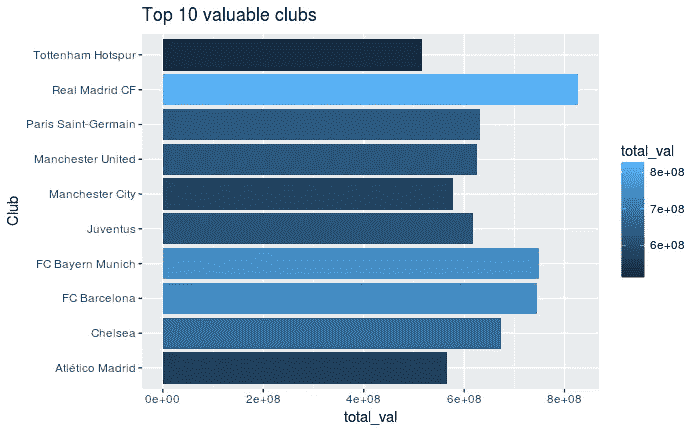

Top-10 valuable clubs [Image [19]]

感谢您的阅读。你可以在 RPubs 和 GitHub 找到源代码(R-notebook)。你可以在 [LinkedIn](https://www.linkedin.com/in/akshajverma7/) 和 [Twitter](https://twitter.com/theairbend3r) 上找到我。

点击查看我的其他博客[。](https://medium.com/@theairbend3r)

[](https://www.buymeacoffee.com/theairbend3r)