# gg plot ' All |口袋妖怪

> 原文：<https://towardsdatascience.com/exploratory-analysis-of-pokemons-using-r-8600229346fb?source=collection_archive---------9----------------------->


Pokemon [Image [0] Image courtesy: [https://bdfjade.com/pokemon-pictures.html](https://bdfjade.com/pokemon-pictures.html)]

这篇博文致力于使用口袋妖怪数据集的数据可视化进行分析。第一部分是探索性分析。[第二部分](https://medium.com/dsc-manipal/r-pokemon-legendary-5aac4af80b9c)有一个机器学习的方面——将口袋妖怪归类为传奇。两篇博文都在 r。

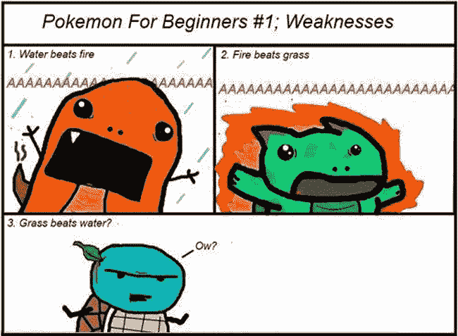

Pokemon [Image [1] [Image courtesy]](https://www.ranker.com/list/best-pokemon-memes/meme-dude)

让我们开始吃吧。:D

导入库。

```
library(dplyr)
library(ggplot2)
library(gridExtra)
library(tidyr)
library(reshape2)
library(RColorBrewer)
library(ggrepel)
```

请阅读。csv 文件。

```
df = read.csv(file="/home/akshaj/projects_R/Pokemon/pokemon.csv")
df = tbl_df(df)
colnames(df)[25] <- "classification"
df$capture_rate <- as.numeric(df$capture_rate)
head(df)
```

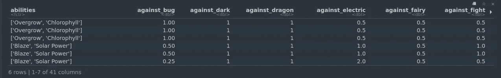

First 5 rows of the dataset [Image [2]]

现在，我们将从整个数据框中选择并使用一些列进行探索性分析。

```
df = select(df, name, classification, hp, weight_kg, 
            height_m, speed, attack, defense,
            sp_attack, sp_defense, type1, type2, 
            abilities, generation,is_legendary, 
            capture_rate)head(df)
```

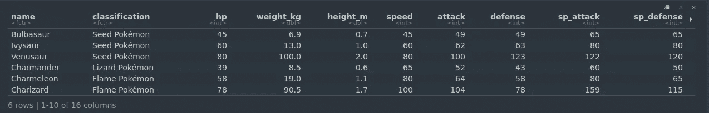

Subset of the original dataset [Image [3]]

# 密度图

各种口袋妖怪属性的密度图。密度图显示了连续时间间隔内的数据分布。这个图表是一个直方图的变体，它使用[内核平滑](https://en.wikipedia.org/wiki/Kernel_smoother)来绘制值，通过平滑噪声来实现更平滑的分布。密度图的峰值有助于显示值在间隔内的集中位置。

```
density_hp <- ggplot(data=df, aes(hp)) + geom_density(col="white",fill="pink", alpha=0.8) + ggtitle("Density Plot of HP")density_speed <- ggplot(data=df, aes(speed)) + geom_density(col="white", fill="darkorchid", alpha=0.8) + ggtitle("Density Plot of Speed Characterstics")density_attack <- ggplot(data=df, aes(attack)) + geom_density(col="white", fill="orange", alpha=0.7) + ggtitle("Density Plot of Attack Characterstics")density_defense <- ggplot(data=df, aes(defense)) + geom_density(col="white", fill="firebrick", alpha=0.7) + ggtitle("Density Plot of Defense Characterstics")density_height <- ggplot(data=df, aes(height_m)) + geom_density(col="white", fill="slateblue1", alpha=0.8) + ggtitle("Density Plot of Height (m) ")density_weight <- ggplot(data=df, aes(weight_kg)) + geom_density(col="white", fill="mediumturquoise", alpha=0.8) + ggtitle("Density Plot of Weight (kg)")grid.arrange(density_hp, density_speed, density_attack, density_defense, density_height, density_weight, ncol=2)
```

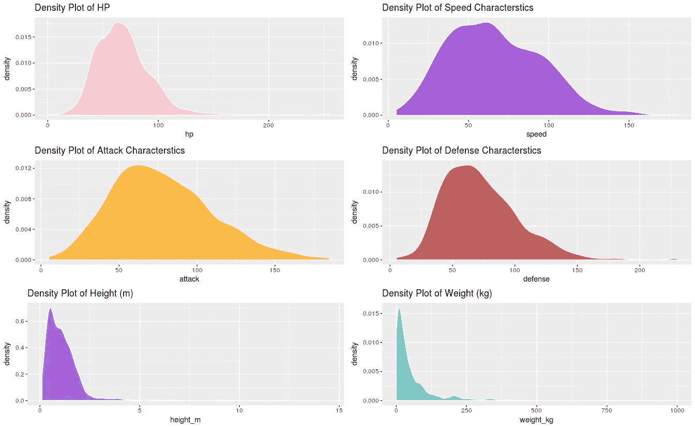

Density plot of various attributes [Image [4]]

# 条形图

条形图可能是媒体最常用的统计数据显示方式。条形图将分类数据(因子)按组细分，并用不同长度的条形表示这些数量。我们将绘制每组中的个体数量(也称为*频率*)。

## 基于主要和次要类型的口袋妖怪数量

我们观察到最常见的口袋妖怪类型有*水*、*普通*和 *Bug* 。而最常见的二次元口袋妖怪类型是*飞*。请注意，大量的口袋妖怪**没有第二类型。**

```
type_1_poke <- ggplot(data=df, aes(type1)) + geom_bar(aes(fill=..count..), alpha=0.8) + theme(axis.text.x = element_text(angle = 90, hjust = 0)) + ggtitle("Distribution Based on Type-1") + coord_flip()type_2_poke <- ggplot(data=df, aes(type2)) + geom_bar(aes(fill=..count..), alpha=0.8) + theme(axis.text.x = element_text(angle = 90, hjust = 0)) + ggtitle("Distribution Based on Type-2") + coord_flip()grid.arrange(type_1_poke, type_2_poke, ncol=2)
```

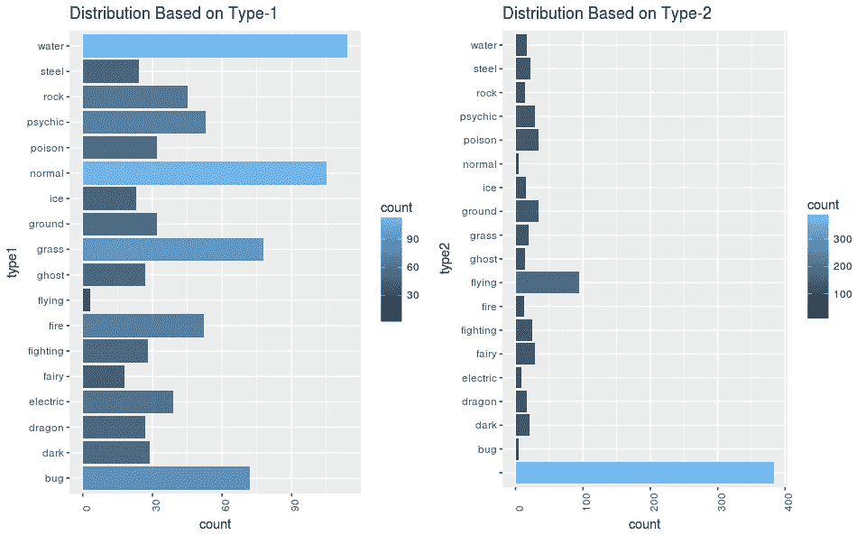

Distribution of Pokemon based on Primary and Secondary type [Image [5]]

## 基于主要类型的传奇口袋妖怪数量

我们观察到有超过 15 个 *Pyschic* 类型的传奇口袋妖怪。*仙*、*飞*、*鬼*类型的传说口袋妖怪数量最少。这可能是因为灵媒口袋妖怪很“神秘”。

```
df %>%
    filter(is_legendary==1) %>%
    ggplot(aes(type1)) + geom_bar(aes(fill= ..count..)) +       theme(axis.text.x = element_text(angle=90, hjust=0)) +     ggtitle("Number of Legendary Pokemon Based on Type-1")
```

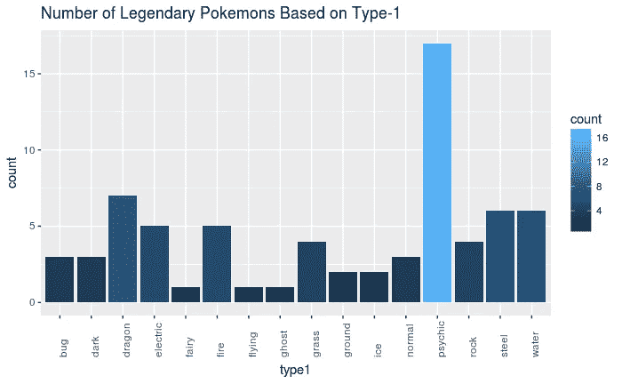

Distribution of Legendary Pokemon based on primary type [Image [6]]

## 每一代引入的初级口袋妖怪数量

该数据集中有 7 代。例如，在第 5 代中引入了大量 *Bug* 类型的口袋妖怪，而在第 7 代中引入了极少数*黑暗*类型的口袋妖怪。

这个图表的代码有点长，所以我在这里展示了这个图表。你可以查看完整的代码[在这里](https://rpubs.com/theairbend3r/ggplot-em-all-pokemon)。

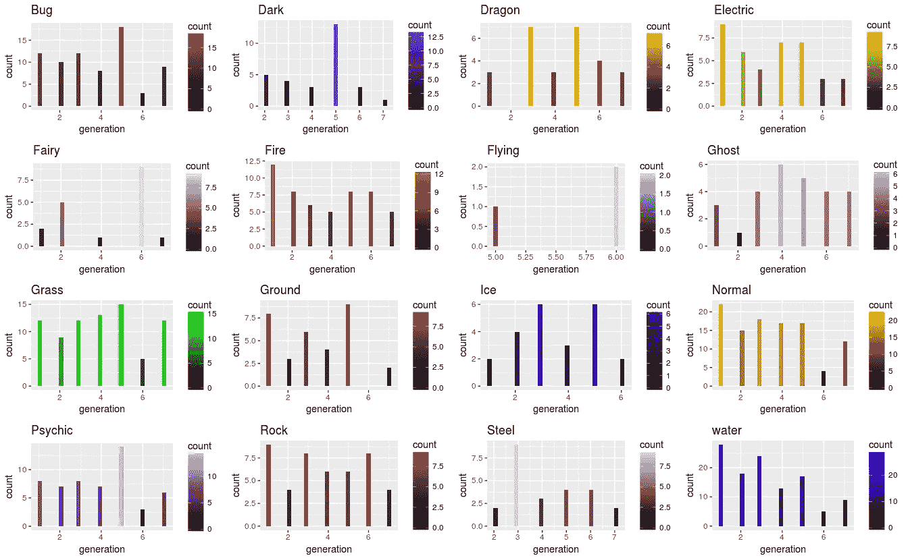

Distribution of primary type per generation [Image [7]]

# 散点图

散点图是一种二维数据可视化，使用点来表示两个不同变量的值，一个沿 x 轴绘制，另一个沿 y 轴绘制。散点图对于解释统计数据的趋势很有用，并且在您想要显示两个变量之间的关系时使用。散点图有时被称为相关图，因为它们显示了两个变量如何[相关](https://en.wikipedia.org/wiki/Correlation_and_dependence)

## *防御* vs *攻击*口袋妖怪的特点

这里，传说中的口袋妖怪是红色的，而非传说中的口袋妖怪是蓝色的。对于非传奇的口袋妖怪，攻击和防御属性之间似乎存在正线性关系。这意味着拥有更高攻击属性的口袋妖怪也倾向于拥有更高的防御属性。而传说中的口袋妖怪却没有这种关系。

虽然有一些异常，传说中的口袋妖怪，总的来说有更大的*防御*和*攻击*属性。像 Groudon 和 Gyarados(右上)这样的口袋妖怪似乎在*攻击*和*防御*方面都很平衡，而像鲤鱼王和凯西这样的口袋妖怪则具有低*防御*和*攻击*的特点。你可能会选择格鲁登而不是鲤鱼王来赢得决斗。

```
ggplot(data=df, aes(attack, defense))  + geom_point(aes(color=is_legendary), alpha=0.8) + scale_color_gradient(low="darkblue", high="red") + ggtitle("Defense vs Attack Characterstics") + 
geom_label_repel(data=subset(df,attack > 150 | defense >150 |              attack < 25), aes(label=name), 
              box.padding = 0.35, point.padding = 0.5,
              segment.color = 'grey50')
```

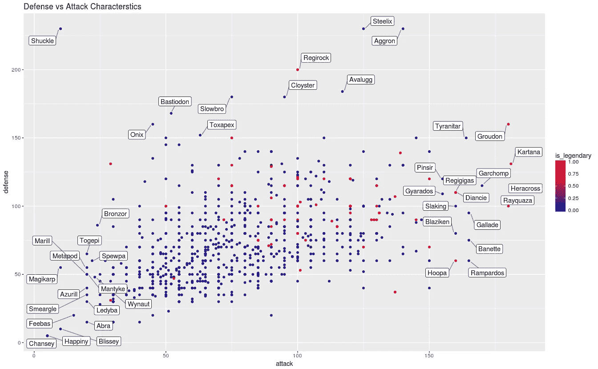

Defense vs Attack attributes [Image [8]]

## 速度、*身高*、*体重*、 *Hp* V.S .攻击属性

我们在所有 4 个图中观察到的一个共同趋势是，口袋妖怪的*速度*、*身高*、*体重*和 *Hp* 特性相对于攻击属性增加。

*速度*与*攻击*属性之间存在微弱的正相关关系，而*身高*、*体重*、*血量*与*攻击*属性之间存在较强的正线性关系。

我已经在散点图上标注了传说中的口袋妖怪。《宇宙》和《科斯莫姆》是传奇口袋妖怪的例外。与其他口袋妖怪相比，它们的速度*、*、*高度*和*血量*更低。然而，就重量而言，科斯莫姆是一个异数。与其他传奇口袋妖怪相比，它拥有异常高的*重量*和较少的*攻击*。

```
speed_attack_legendary <- ggplot(na.omit(df), aes(attack, speed)) + geom_point(aes(color=is_legendary)) + geom_label_repel(data=subset(df, (attack > 170 | attack < 50 & speed >150 | speed < 50) & is_legendary == 1 | speed > 145), aes(label=name), box.padding = 0.35, point.padding = 0.5, segment.color = 'grey50') + geom_smooth(method = "lm")weight_attack_legendary <- ggplot(na.omit(df), aes(attack, weight_kg)) + geom_point(aes(color=is_legendary)) + geom_label_repel(data=subset(df, (attack > 170 | attack < 50 | weight_kg > 650) & (is_legendary == 1)), aes(label=name), box.padding = 0.35, point.padding = 0.5, segment.color = 'grey50') + geom_smooth(method = "lm")height_attack_legendary <- ggplot(na.omit(df), aes(attack, height_m)) + geom_point(aes(color=is_legendary)) + geom_label_repel(data=subset(df, ((attack > 170 | attack < 50 | height_m > 7.5) & is_legendary == 1) | height_m > 5 & is_legendary == 0), aes(label=name), box.padding = 0.35, point.padding = 0.5, segment.color = 'grey50') + geom_smooth(method = "lm")hp_attack_legendary <- ggplot(na.omit(df), aes(attack, hp)) + geom_point(aes(color=is_legendary)) + geom_label_repel(data=subset(df, ((attack > 170 | hp > 190 | attack < 50) & is_legendary == 1) | hp >160), aes(label=name), box.padding = 0.35, point.padding = 0.5, segment.color = 'grey50')  + geom_smooth(method = "lm")grid.arrange(speed_attack_legendary, weight_attack_legendary, height_attack_legendary, hp_attack_legendary, ncol = 2)
```

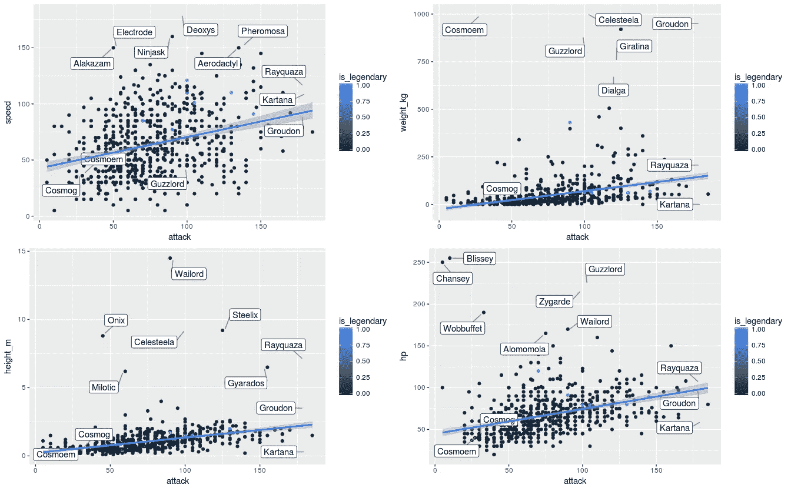

Height, Weight, Speed, Hp vs Attack [Image [9]]

## 速度、身高、体重和 Hp V.S .防御属性

我们绘制了与上面相同的图表，但这次是防御属性。我们在这里观察到趋势的不同。速度和防守有一种微弱的负线性关系。*速度*随着防御的增加而降低。这意味着防守型口袋妖怪通常比进攻型口袋妖怪要慢。

对于一个传奇的口袋妖怪来说，Cosmog 在拥有超级弱属性方面是非常一致的。为什么 Cosmog 这么没用？我在网上查了一下 Cosmog。这是我发现的。

> Cosmog 从 43 级开始进化成[科斯莫姆](https://bulbapedia.bulbagarden.net/wiki/Cosmoem_(Pok%C3%A9mon))，它从 53 级开始进化成 [Solgaleo](https://bulbapedia.bulbagarden.net/wiki/Solgaleo_(Pok%C3%A9mon)) 或 [Lunala](https://bulbapedia.bulbagarden.net/wiki/Lunala_(Pok%C3%A9mon)) 取决于它进化的游戏。

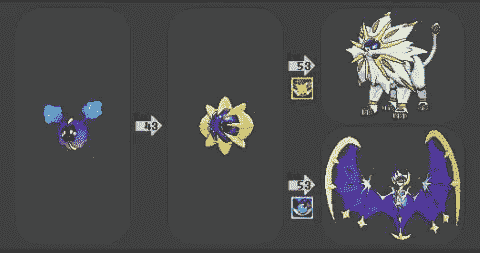

Evolution of Cosmog [Image [10]]

```
speed_defense_legendary <- ggplot(na.omit(df), aes(defense, speed)) + geom_point(aes(color=is_legendary)) + geom_label_repel(data=subset(df, (defense > 130 | defense < 50| speed > 140 | speed < 50) & is_legendary == 1), aes(label=name), box.padding = 0.35, point.padding = 0.5, segment.color = 'grey50') + geom_smooth(method = "lm")weight_defense_legendary <- ggplot(na.omit(df), aes(defense, weight_kg)) + geom_point(aes(color=is_legendary)) + geom_label_repel(data=subset(df, (defense > 160 | defense < 50 | weight_kg > 600) & is_legendary == 1), aes(label=name), box.padding = 0.35, point.padding = 0.5, segment.color = 'grey50') + geom_smooth(method = "lm")height_defense_legendary <- ggplot(na.omit(df), aes(defense, height_m)) + geom_point(aes(color=is_legendary)) + geom_label_repel(data=subset(df, (defense > 150 | defense < 50 | height_m > 6) & is_legendary == 1 | height_m >5 & is_legendary ==0), aes(label=name), box.padding = 0.35, point.padding = 0.5, segment.color = 'grey50') + geom_smooth(method = "lm")hp_defense_legendary <- ggplot(na.omit(df), aes(defense, hp)) + geom_point(aes(color=is_legendary)) + geom_label_repel(data=subset(df, (defense > 150 | defense < 50 | hp > 150) & is_legendary == 1 | hp > 200), aes(label=name), box.padding = 0.35, point.padding = 0.5, segment.color = 'grey50') + geom_smooth(method = "lm")grid.arrange(speed_defense_legendary, weight_defense_legendary, height_defense_legendary, hp_defense_legendary, ncol = 2)
```

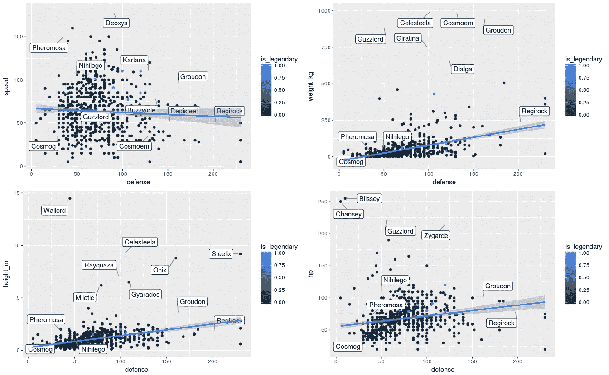

Height, Weight, Speed, Hp vs Attack [Image [11]]

# 箱线图

箱线图是显示数据集的分布和中心的一种方式。传播的测量包括数据组的四分位数范围和平均值。中心的度量包括平均值和中值(数据集的中间)。

黑线表示中间值。彩色框表示代表中间 50%数据的四分位数范围。胡须从盒子的两边延伸出来。晶须代表数据值的底部 25%和顶部 25%的范围，不包括异常值。

## 口袋妖怪属性的方框图

我们观察到，传奇口袋妖怪的所有特征的中位数都高于非传奇口袋妖怪。

与其他属性相比，非传奇口袋妖怪的 *Hp* 属性有更多的异常值。但是另一方面，相同的 *Hp* 属性与其他属性相比变化最小。

与传说中的口袋妖怪相比，非传说中的口袋妖怪有更多的离群值。

```
box_plot_attr <- select(df, type1, is_legendary, hp, defense, attack, sp_attack, sp_defense, speed)box_plot_attr_leg <- filter(box_plot_attr, is_legendary == 1)box_plot_attr_nor <- filter(box_plot_attr, is_legendary == 0)box_plot_attr_leg_long <- gather(box_plot_attr_leg, attribute, value, -c(type1, is_legendary))box_plot_attr_nor_long <- gather(box_plot_attr_nor, attribute, value, -c(type1, is_legendary))bp_leg <- ggplot(data = box_plot_attr_leg_long, aes(attribute, value)) + geom_boxplot(fill="green4") + ggtitle("Legendary Pokemon")bp_nor <- ggplot(data = box_plot_attr_nor_long, aes(attribute, value)) + geom_boxplot(fill = "yellow2") + ggtitle("Normal Pokemon")grid.arrange(bp_leg, bp_nor,ncol=2)
```

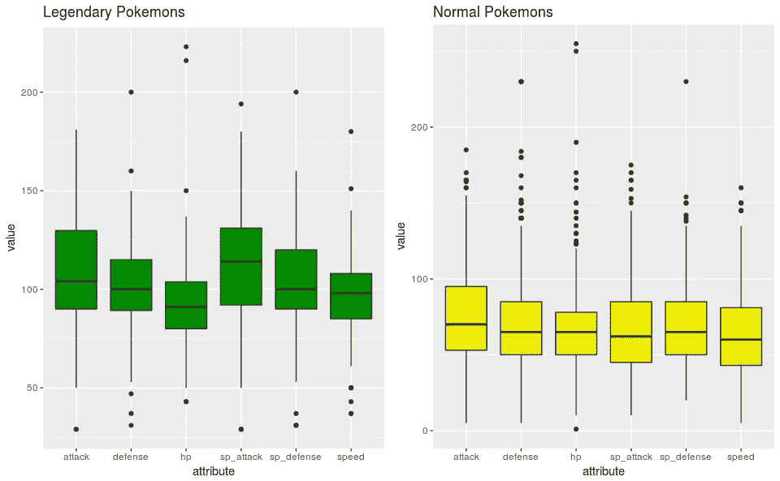

Boxplot of Pokemon attributes’ [Image [12]]

# 热图

热图基本上是用颜色代替数字的表格。热点图中的最低值设置为深蓝色，最高值设置为红色，中间值设置为白色，在这些极端值之间有相应的过渡(或渐变)。热图非常适合可视化大量多维数据，并可用于识别具有相似值的行的聚类，因为这些行显示为相似颜色的区域。

接下来，我们将看到各种类型的口袋妖怪的属性如何相互叠加。为此，我们将计算这些属性的中位数，并绘制传奇和非传奇口袋妖怪的热图。

## 初级类型 vs 属性热图|传奇口袋妖怪

*冰*型传奇口袋妖怪的 *sp_* 防御值很高，而*速度*值很低。*地*传奇口袋妖怪有非常高的*攻击*属性。 *Bug* 型传奇口袋妖怪 *sp_defense* 很低。

相反， *bug* 型和*黑暗*型口袋妖怪有着相似的*速度*属性。

```
hmap_attr <- select(df, type1, is_legendary, hp, defense, attack, sp_attack, sp_defense, speed)hmap_attr_leg <- filter(hmap_attr, is_legendary == 1)
hmap_attr_nor <- filter(hmap_attr, is_legendary == 0)hmap_attr_leg <- group_by(hmap_attr_leg, type1)
hmap_attr_nor <- group_by(hmap_attr_nor, type1)hmap_attr_leg <- summarise(hmap_attr_leg, hp=median(hp), attack=median(attack), defense=median(defense), sp_attack=median(sp_attack), sp_defense=median(sp_defense), speed=median(speed))hmap_attr_leg_m <- melt(hmap_attr_leg)hmap_attr_nor <- summarise(hmap_attr_nor, hp=median(hp), attack=median(attack), defense=median(defense), sp_attack=median(sp_attack), sp_defense=median(sp_defense), speed=median(speed))hmap_attr_nor_m <- melt(hmap_attr_nor)hm.palette <- colorRampPalette(rev(brewer.pal(5, 'RdYlBu')), space='Lab')ggplot(data=hmap_attr_leg_m, aes(type1, variable)) + geom_tile(aes(fill=value)) + ggtitle("Legendary Pokemon: Type1 - Attribute") + scale_fill_gradientn(colours = hm.palette(100)) + theme(axis.text.x = element_text(angle=90, hjust=0)) + coord_equal()
```

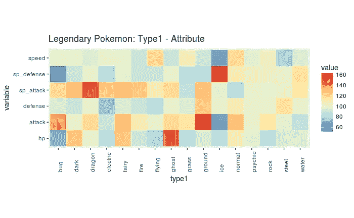

Heat map of legendary attributes vs primary type [Image [13]]

## 初级型 vs 属性热图|非传奇口袋妖怪

*钢铁*型口袋妖怪*防御*数值高但是*速度很低。战斗*型口袋妖怪*攻击*值很高而 *sp_attack* 值很低。*地、冰、普通*口袋妖怪都有类似的 *Hp* 水平，*毒药、*和*摇滚*型口袋妖怪也是如此。

```
hm.palette <- colorRampPalette(rev(brewer.pal(5, 'RdYlBu')), space='Lab')ggplot(data=hmap_attr_nor_m, aes(type1, variable)) + geom_tile(aes(fill=value)) + ggtitle("Non-Legendary Pokemon: Type1 - Attribute") + scale_fill_gradientn(colours = hm.palette(100)) + theme(axis.text.x = element_text(angle=90, hjust=0)) + coord_equal()
```

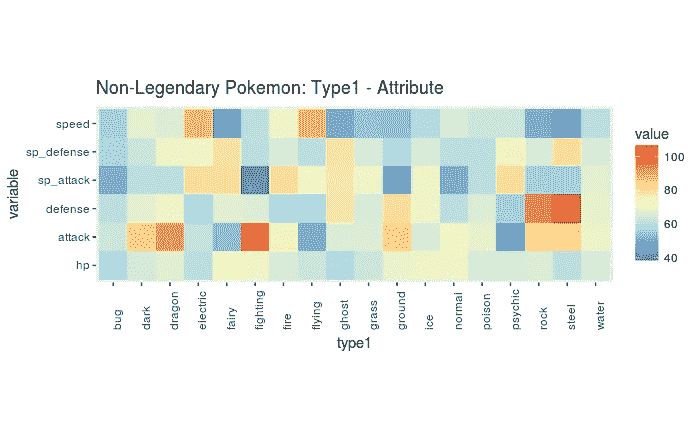

Heatmap of non-legendary attributes vs type1 [Image [14]]

# 相关矩阵

相关矩阵是一个显示变量集之间相关系数([皮尔逊系数](https://www.google.com/url?sa=t&rct=j&q=&esrc=s&source=web&cd=3&cad=rja&uact=8&ved=0ahUKEwihhLj0k-zbAhUQTI8KHRTHCC4QFggwMAI&url=https%3A%2F%2Fen.wikipedia.org%2Fwiki%2FPearson_correlation_coefficient&usg=AOvVaw0oS2sNVkApYvcS_BsC8s3p))的表格，它允许您查看哪些变量对具有最高的相关性。相关系数的取值范围为 1 至+1。系数的绝对值越大，变量之间的关系越强。

对于皮尔逊相关，绝对值为 1 表示完美的线性关系。

## 传奇口袋妖怪属性关联热图

我已经把相关矩阵转换成了热图。热点图中的最低值设置为深蓝色，最高值设置为白色，中间值设置为绿色，在这些极端值之间有相应的过渡(或渐变)。

*现在，在绘图之前，让我们制定一个假设，看看它是否是真的。人们会认为防御性口袋妖怪会有更高的 Hp(也许这样它可以承受很多攻击？)和攻击值高到 sp_defense 值高但防御值低的口袋妖怪。*

对角线上的元素都是白色的，因为属性与其自身具有线性关系。矩阵是其自身在白色对角线上的镜像。

基于以下传奇口袋妖怪的相关矩阵，在*攻击*和*防御*之间似乎存在某种线性关系，但在*攻击*和*sp _ 防御*之间并没有那么大的关系。此外，在*防御*和*生命*属性之间存在某种关联。

```
hmap_attr <- select(df, type1, is_legendary, hp, defense, attack, sp_attack, sp_defense, speed)hmap_attr_leg <- filter(hmap_attr, is_legendary == 1)
hmap_attr_nor <- filter(hmap_attr, is_legendary == 0)hmap_attr_leg <- group_by(hmap_attr_leg, type1)
hmap_attr_nor <- group_by(hmap_attr_nor, type1)hmap_attr_leg <- summarise(hmap_attr_leg, hp=median(hp), attack=median(attack), defense=median(defense), sp_attack=median(sp_attack), sp_defense=median(sp_defense), speed=median(speed))hmap_attr_nor <- summarise(hmap_attr_nor, hp=median(hp), attack=median(attack), defense=median(defense), sp_attack=median(sp_attack), sp_defense=median(sp_defense), speed=median(speed))row.names(hmap_attr_leg) <- hmap_attr_leg$type1
hmap_attr_leg$type1 <- NULL
hmap_attr_leg$is_legendary <- NULLrow.names(hmap_attr_nor) <- hmap_attr_nor$type1
hmap_attr_nor$type1 <- NULL
hmap_attr_nor$is_legendary <- NULLhmap_attr_leg_cor <- cor(hmap_attr_leg)
hmap_attr_leg_cor_m <- melt(hmap_attr_leg_cor)hm.palette <- colorRampPalette(rev(brewer.pal(5, 'GnBu')), space='Lab')ggplot(data=hmap_attr_leg_cor_m, aes(Var1, Var2)) + geom_tile(aes(fill=value)) + ggtitle("Attribute Correlation - Legendary") + scale_fill_gradientn(colours = hm.palette(100)) + coord_equal()
```

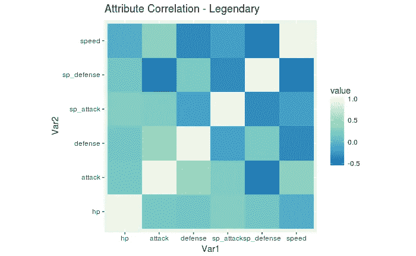

Correlation matrix of legendary Pokemon [Image [15]]

## 非传奇口袋妖怪属性的关联热图

对于非传说中的口袋妖怪来说， *sp_attack* 和 *sp_defense* 之间似乎有关联，而 *attack* 和 *sp_attack* 或 *defense* 和 *speed* 等等之间则没有这样的关系。

例如，具有高值 *sp_attack* 的口袋妖怪往往具有高值 *sp_defense。*

```
hmap_attr_nor_cor <- cor(hmap_attr_nor)
hmap_attr_nor_cor_m <- melt(hmap_attr_nor_cor)hm.palette <- colorRampPalette(rev(brewer.pal(5, 'GnBu')), space='Lab')ggplot(data=hmap_attr_nor_cor_m, aes(Var1, Var2)) + geom_tile(aes(fill=value)) + ggtitle("Attribute Correlation - Normal") + scale_fill_gradientn(colours = hm.palette(100)) + coord_equal()
```

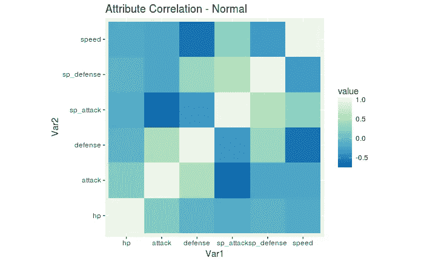

Correlation matrix of non-legendary Pokemon [Image [16]]

## 基于初级类型的口袋妖怪的有效性

为此图选择数据框的一部分。

```
df_fight_against <- select(df, type1, against_bug:against_water)
head(df_fight_against)
```

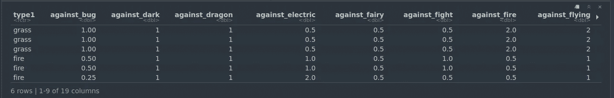

Fight_against data frame [Image [17]]

求所有*对 _type* 列的中值。

```
df_fight_against_g <- group_by(df_fight_against, type1)df_fight_against_summ <- summarise(df_fight_against_g, 
                      against_bug = median(against_bug), 
                      against_dark = median(against_dark), 
                      against_dragon = median(against_dragon),
                      against_electric = median(against_electric),
                      against_fairy = median(against_fairy),
                      against_fight = median(against_fight),
                      against_fire = median(against_fire),
                      against_flying = median(against_flying),
                      against_ghost = median(against_ghost),
                      against_grass = median(against_grass),
                      against_ground = median(against_ground),
                      against_ice = median(against_ice), 
                      against_normal = median(against_normal),
                      against_poison  = median(against_poison),
                      against_psychic = median(against_psychic),
                      against_rock = median(against_rock),
                      against_steel = median(against_steel),
                      against_water = median(against_water))
```

绘制热图。

```
df_fight_against_long <- melt(df_fight_against_summ)hm.palette <- colorRampPalette(rev(brewer.pal(9, 'RdYlBu')), space='Lab')ggplot(data=df_fight_against_long, aes(type1, variable)) + geom_tile(aes(fill=value)) + scale_fill_gradientn(colours = hm.palette(100)) + coord_equal() + theme(axis.text.x=element_text(angle=90, hjust=0)) + ggtitle("Effectiveness of different types of Pokemon")
```

热点图中的最低值设置为深蓝色，最高值设置为红色，中间值设置为白色，在这些极端值之间有相应的过渡(或渐变)。

热图显示*会飞的*型口袋妖怪对*冰*型口袋妖怪高效，而*火*型口袋妖怪则不然，等等。

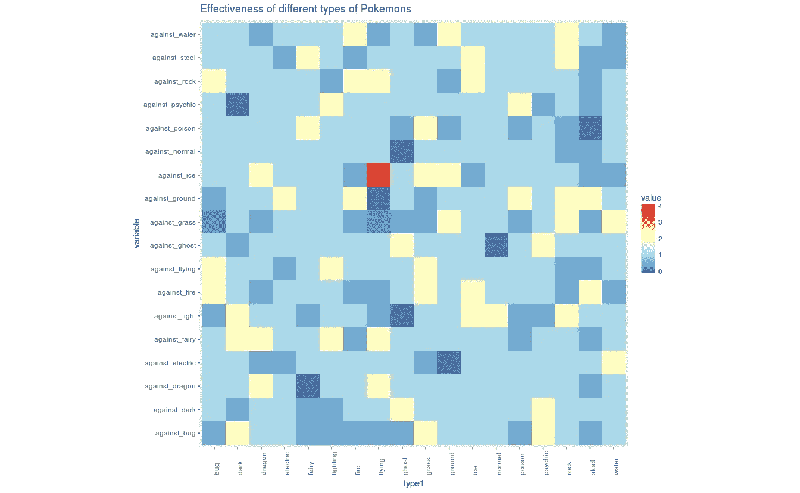

Effectiveness of Pokemon in a duel based on fight [Image [18]]

感谢您的阅读。欢迎提出建议和建设性的批评。:)你可以在 [LinkedIn](https://www.linkedin.com/in/akshajverma7/) 和 [Twitter](https://twitter.com/theairbend3r) 上找到我。你可以点击查看[的完整代码。](https://rpubs.com/theairbend3r/ggplot-em-all-pokemon)

你也可以在这里查看我的其他博客文章。

[](https://www.buymeacoffee.com/theairbend3r)