# 什么是探索性数据分析？

> 原文：<https://towardsdatascience.com/exploratory-data-analysis-8fc1cb20fd15?source=collection_archive---------1----------------------->

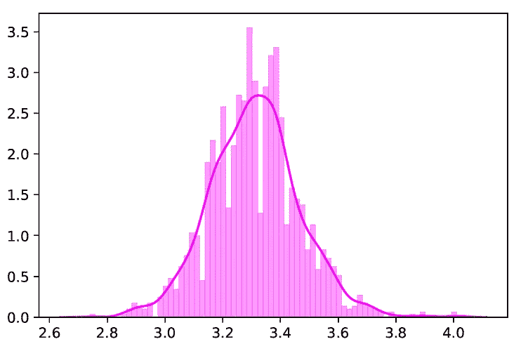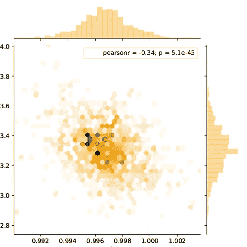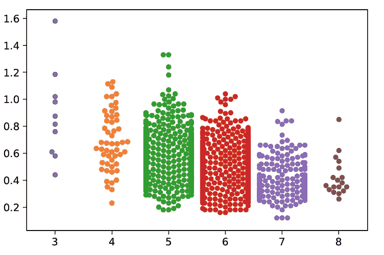

当我在考虑我应该开始写博客的第一个话题是什么时，EDA 立刻出现在我的脑海中。逻辑上很贴切，不是吗？！为什么？你很快就会知道了！

# 直觉

想象一下你的狼群决定去看一部你没听过的电影。这是绝对没有争议的，它会导致你发现自己被许多问题所困扰，而这些问题需要得到回答才能做出决定。做一个好酋长你会问的第一个问题是，这部电影的演员和工作人员是什么？作为惯例，你还会在 YouTube 上观看这部电影的预告片。此外，你还可以找到观众对这部电影的评价和评论。

无论你最终在影院为你的家族购买爆米花之前会采取什么样的调查措施，都只不过是数据科学家的行话所说的“探索性数据分析”。

> 探索性数据分析是指对数据进行初步调查的关键过程，以便发现模式，发现异常，测试假设，并借助汇总统计数据和图表检查假设。

首先理解数据并尝试从中收集尽可能多的见解是一个很好的做法。EDA 就是在数据被弄脏之前，理解手头的数据。

# **EDA 用样本数据集解释:**

为了分享我对我所知道的概念和技术的理解，我将以 UCI 机器学习知识库上的[葡萄酒质量数据集](https://archive.ics.uci.edu/ml/datasets/wine+quality)的白色变体为例，并尝试使用 EDA 从数据集中获取尽可能多的见解。

首先，我导入了必要的库(在本例中是 pandas、numpy、matplotlib 和 seaborn)并加载了数据集。

注意:无论我能得出什么样的推论，我都提到了要点。

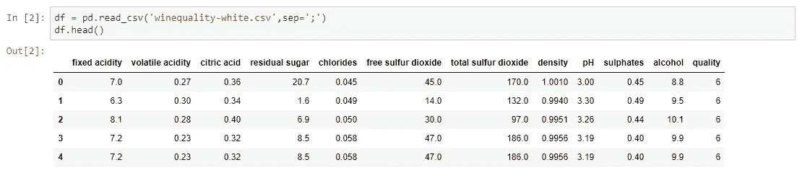

*   原始数据由分隔符“；”分隔在给定的数据集中。
*   为了仔细查看这些数据“帮了大忙了。head()" pandas 库的函数，它返回数据集的前五个观察值。同样”。tail()"返回数据集的最后五个观察值。

我用“.”找出了数据集中的行和列的总数。形”。

*   数据集由 4898 个观察值和 12 个特征组成。
*   其中一个是因变量，其余 11 个是自变量——物理化学特性。

了解列及其对应的数据类型，以及发现它们是否包含空值，也是一个很好的做法。

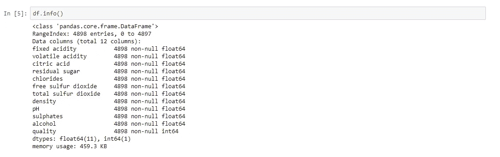

*   数据只有浮点值和整数值。
*   没有变量列具有空值/缺失值。

pandas 中的 describe()函数在获取各种汇总统计数据时非常方便。该函数返回数据的计数、平均值、标准差、最小值和最大值以及分位数。

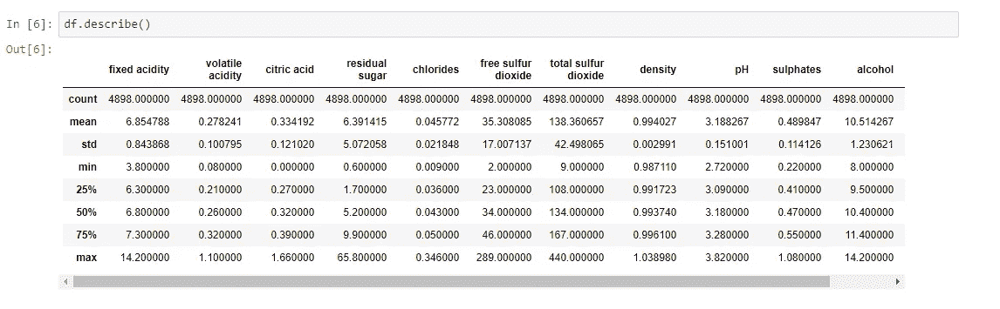

*   在这里，您可以注意到平均值小于每列的中间值，中间值由索引列中的 50%(第 50 个百分位)表示。
*   预测值“残余糖”、“游离二氧化硫”、“总二氧化硫”的最大值与 75%之间存在显著差异。
*   因此，观察 1 和 2 表明，在我们的数据集中存在极端值-异常值。

仅通过观察因变量得出的一些关键见解如下:

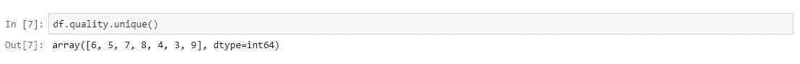

*   目标变量/因变量本质上是离散的和分类的。
*   “质量”评分范围为 1 至 10 分；其中 1 表示差，10 表示最好。
*   1、2 和 10 质量等级不是由任何观察给出的。只有获得的分数在 3 到 9 之间。

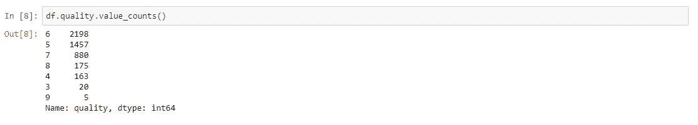

*   这告诉我们按降序排列的每个质量分数的投票数。
*   “质量”的大多数值集中在类别 5、6 和 7 中。
*   对于第 3 类和第 9 类，只做了一些观察。

我很好地浏览了一下数据。但这就是数据科学，你参与的越多，就越难停止探索。现在让我们用漂亮的图表来探索数据。Python 有一个可视化库， [Seaborn](https://seaborn.pydata.org/) ，它构建在 matplotlib 之上。它提供了非常有吸引力的统计图，以便执行[单变量](http://www.statisticshowto.com/univariate/)和[多变量分析](http://www.camo.com/multivariate_analysis.html)。

要使用线性回归建模，必须移除相关变量以改进模型。人们可以用熊猫来寻找相关性。corr()"函数，并可以使用 seaborn 中的热图来可视化相关矩阵。

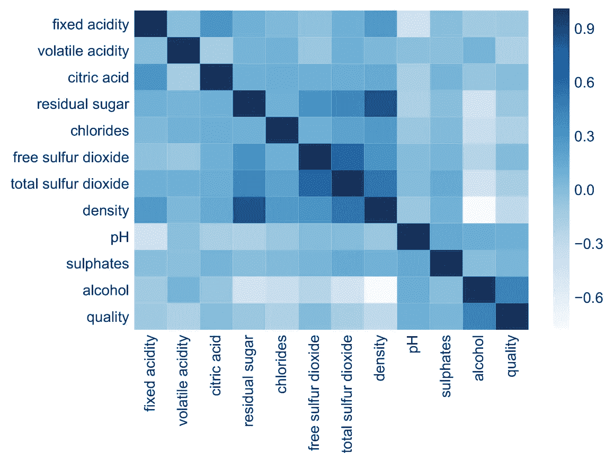

**Heatmap**

*   深色代表正相关，而浅色代表负相关。
*   如果设置 annot=True，您将获得格网单元中要素相互关联的值。

在特征选择过程中移除相关变量是一个很好的做法。

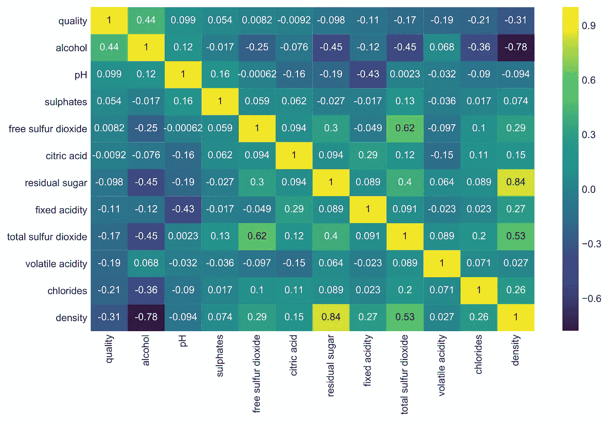

**Correlation Matrix**

*   这里我们可以推断“密度”与“残糖”有很强的正相关性，而与“酒精”有很强的负相关性。
*   “游离二氧化硫”和“柠檬酸”与“品质”几乎没有相关性。
*   由于相关性为零，我们可以推断这两个预测值之间没有线性关系。但是，在对数据集应用线性回归模型的情况下，删除这些要素是安全的。

箱线图(或盒须图)以一种便于变量间比较的方式显示定量数据的分布。该框显示数据集的四分位数，而触须延伸以显示分布的其余部分。

盒状图(也称为盒须图)是一种基于五个数字摘要显示数据分布的标准化方法:

*   最低限度
*   第一四分位数
*   中位数
*   第三个四分位数
*   最大值。

在最简单的箱线图中，中间的矩形跨越第一个四分位数到第三个四分位数(四分位数间距或 IQR)。

矩形内的一段显示了中间值，方框上下的“胡须”显示了最小值和最大值的位置。

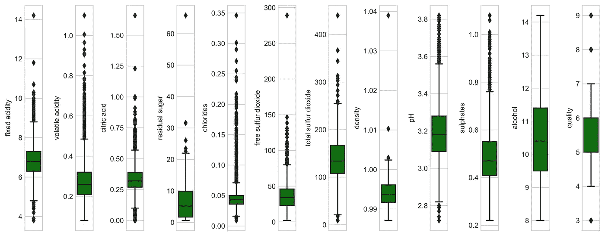

**Boxplot**

异常值要么高于第三个四分位数 1.5 倍 IQR，要么低于第一个四分位数 1.5 倍 IQR。

*   在我们的数据集中，除了“酒精”之外，所有其他特性列都显示异常值。

现在，要检查变量的线性度，绘制分布图并寻找特征的偏斜度是一个很好的做法。核密度估计(kde)是绘制分布形状的一个非常有用的工具。

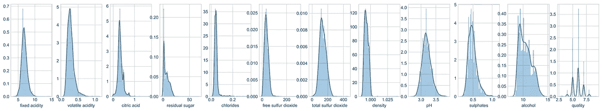

**Distribution Plot**

*   “pH”列似乎呈正态分布
*   剩余的所有独立变量都是右偏/正偏的。

> 最后，总结所有的探索性数据分析是一种哲学和艺术的方法来衡量早期接触的数据的每一个细微差别。

你可以浏览我的 jupyter 笔记本 [**这里**](http://nbviewer.jupyter.org/github/PBPatil/Exploratory_Data_Analysis-Wine_Quality_Dataset/blob/master/winequality_white.ipynb) 并且尝试用不同的方法进行测试，例如，尝试一个 pairplot 并且分享你可以从中获得的所有推论，或者如果我在我自己的方法中没有捕捉到任何有用的信息，也请在评论中分享。

**阅读我发表的其他文章**—

1.  [最后一分钟修订:第一部分——机器学习&统计](https://medium.com/@theprasadpatil/last-minute-revision-part-i-machine-learning-statistics-8de23a377987)
2.  [如何使用 Python 从 Excel 创建 PDF 报告](https://medium.com/@theprasadpatil/how-to-create-a-pdf-report-from-excel-using-python-b882c725fcf6)
3.  [如何使用 Python 从 pdf 中提取关键词并按权重排序](/how-to-extract-keywords-from-pdfs-and-arrange-in-order-of-their-weights-using-python-841556083341?source=follow_footer-----b882c725fcf6----0-------------------------------)