# Kaggle 竞赛初学者的探索性数据分析(EDA)技术

> 原文：<https://towardsdatascience.com/exploratory-data-analysis-eda-techniques-for-kaggle-competition-beginners-be4237c3c3a9?source=collection_archive---------7----------------------->

## EDA 和数据科学竞赛初学者实践指南


Photo by [Andrew Neel](https://unsplash.com/@andrewtneel?utm_source=unsplash&utm_medium=referral&utm_content=creditCopyText) on [Unsplash](/s/photos/explore?utm_source=unsplash&utm_medium=referral&utm_content=creditCopyText)

E **探索性数据分析** ( **EDA** )是一种分析数据集以总结其主要特征的方法，通常采用可视化方法。以下是 EDA 中涉及的不同步骤:

1.  数据收集
2.  数据清理
3.  数据预处理
4.  数据可视化

# 数据收集

**数据收集**是以一种既定的系统方式收集信息的过程，这种方式使人们能够轻松地检验假设和评估结果。

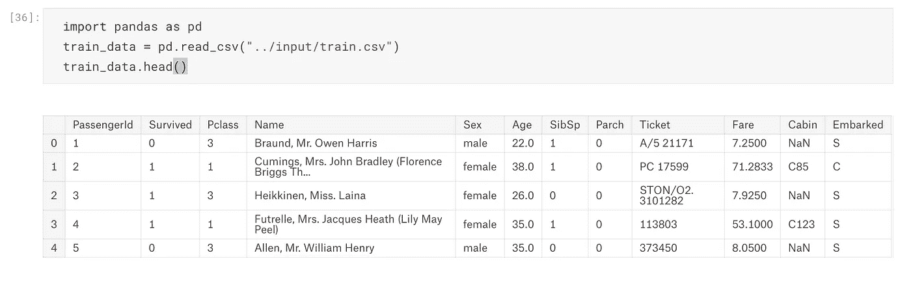

获得数据后，我们需要检查要素的数据类型。

有以下类型的功能:

*   数字的
*   绝对的
*   序数
*   日期时间
*   协调

为了了解数据的数据类型/特征，我们需要运行以下命令:

```
train_data.dtypes
```

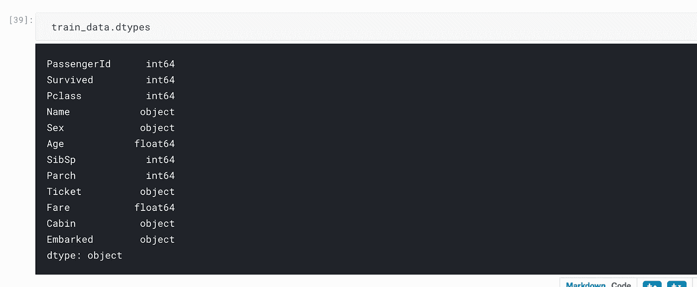

或者

```
train_data.info()
```

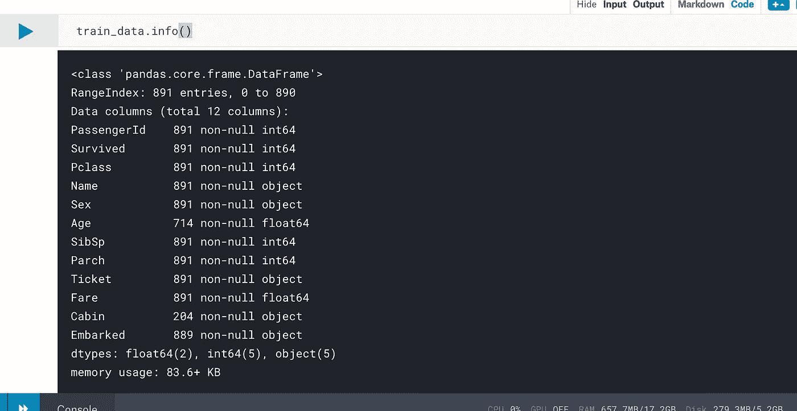

让我们看一下关于我们数据集的统计摘要。

```
train_data.describe()
```

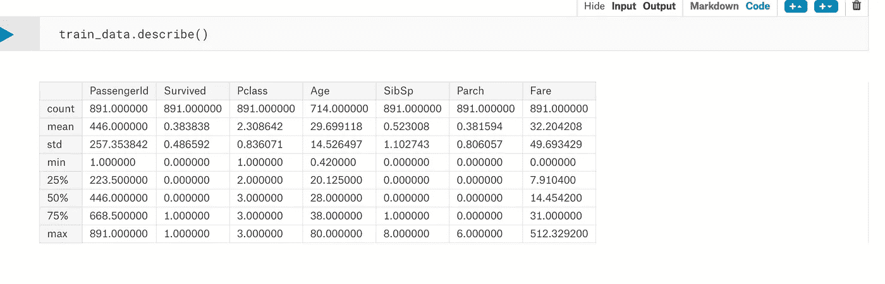

# 数据清理

**数据清理**是通过识别数据中的任何错误或通过更正或删除丢失的数据来确保您的数据正确可用的过程。参考[此链接进行数据清理。](https://confusedcoders.com/data-science/cleaning-data-for-data-visualisation)

一旦数据是干净的，我们可以进一步进行数据预处理。

# 数据预处理

**数据预处理**是一种数据挖掘技术，涉及将原始数据转换成可理解的格式。它包括标准化和规范化、变换、特征提取和选择等。数据预处理的产品是最终的训练数据集。

# 数据可视化

**数据可视化**是信息和数据的图形表示。它使用统计图、曲线图、信息图和其他工具清晰高效地传达信息。

在这里，我们将重点放在常用的 Seaborn 可视化。Seaborn 是一个基于 matplotlib 的 Python 数据可视化库。它提供了一个高层次的界面来绘制有吸引力的和信息丰富的统计图形。

以下是常用的 seaborn 可视化

1.  散点图
2.  箱形图
3.  柱状图
4.  猫图
5.  小提琴情节
6.  配对图
7.  联合地块
8.  热图

#导入 seaborn 库

```
import seaborn as sns
```

## 散点图

散点图是绘制在水平轴和垂直轴上的一组点。

下面的散点图显示了乘客年龄和乘客票价之间的关系，基于从泰坦尼克号数据集获取的数据的 pclass(客票等级)

```
sns.scatterplot(x="Age", y="Fare", hue = 'Pclass', data=train_data)
```

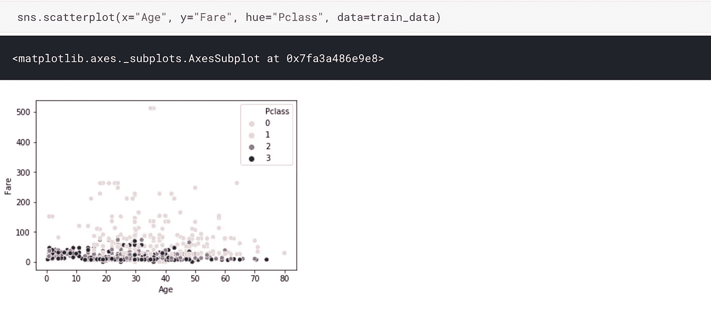

## 箱形图

箱形图是在图上表示统计数据的一种简单方法，在图上画一个矩形来表示第二个和第三个四分位数，通常用一条垂直线来表示中间值。上下四分位数显示为矩形两侧的水平线。

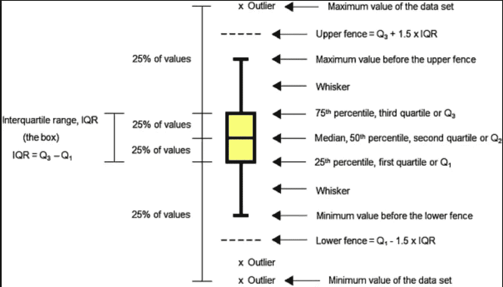

下图显示了乘客票价如何根据机票等级而变化。

```
sns.boxplot(x="Pclass", y="Fare",data= train_data)
```

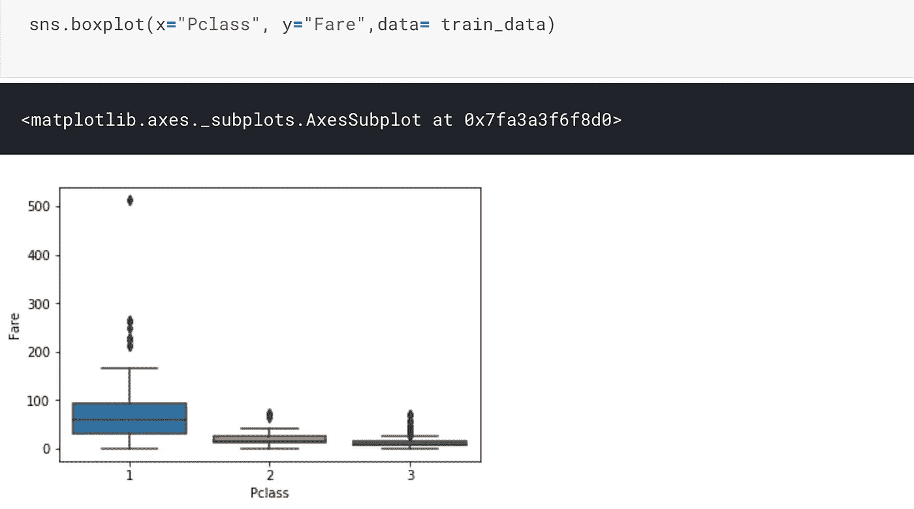

## 柱状图

直方图是数字数据分布的精确表示。它是对连续变量的概率分布的估计

```
sns.distplot( train_data['Pclass'], kde=False)
```

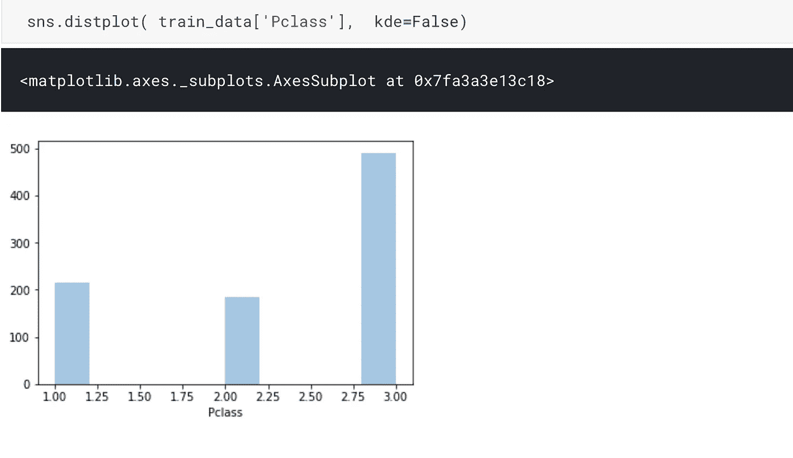

## 猫图

Cat plot 提供了对几个轴级函数的访问，这些函数使用几个可视化表示中的一个来显示数值变量与一个或多个分类变量之间的关系。我们可以使用不同种类的绘图来绘制(对应于分类绘图函数的名称)选项有:“点”、“条”、“带”、“群”、“框”或“小提琴”。更多关于猫情节的细节在[这里](https://seaborn.pydata.org/generated/seaborn.catplot.html)

下面我们用条形做一个猫图

```
sns.catplot(x="Embarked", y="Survived", hue="Sex",col="Pclass", kind = 'bar',data=train_data, palette = "rainbow")
```

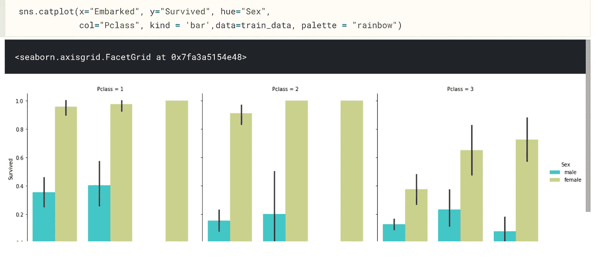

让我们看看同样的猫情节与小提琴类

```
sns.catplot(x="Embarked", y="Survived", hue="Sex",col="Pclass", kind = 'violin',data=train_data, palette = "rainbow")
```

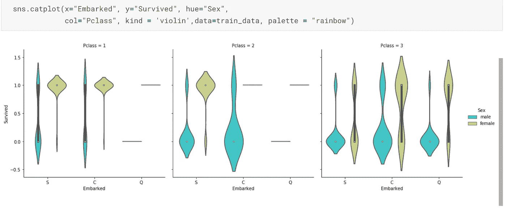

## 小提琴情节

小提琴图与盒须图的作用相似。它显示了数量数据在一个(或多个)分类变量的几个级别上的分布，以便对这些分布进行比较。关于小提琴剧情的更多细节是[这里](https://seaborn.pydata.org/generated/seaborn.violinplot.html)

```
sns.violinplot(x='Sex', y='Survived',data=train_data)
```

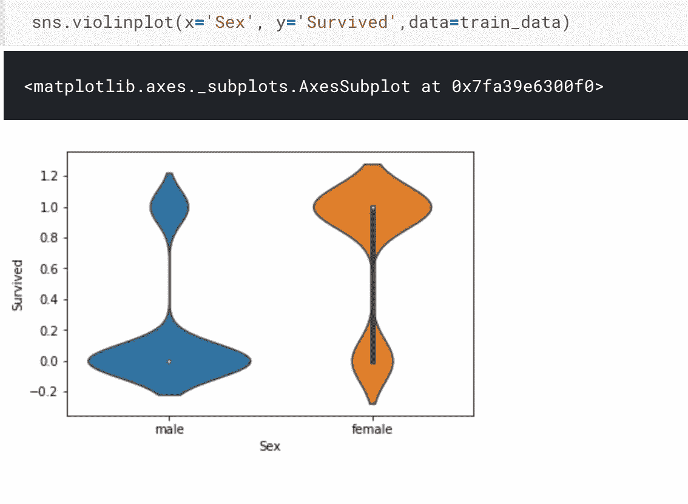

## 配对图

seaborn 中的 Pair plot 仅绘制数字列，尽管稍后我们将使用分类变量进行着色。更多关于双人剧情的是[这里](https://seaborn.pydata.org/generated/seaborn.pairplot.html)。

```
sns.pairplot(train_data, hue="Sex")
```

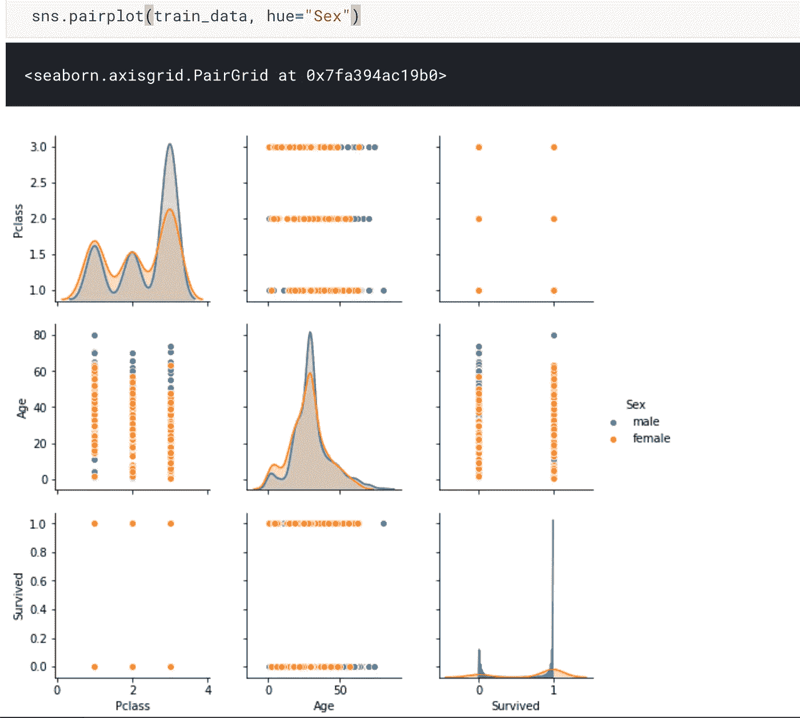

## 联合地块

Jointplot 是 seaborn 库特定的，可用于快速可视化和分析两个变量之间的关系，并描述它们在同一图上的单独分布。

更多关于联合剧情的是[这里。](https://seaborn.pydata.org/generated/seaborn.jointplot.html)

```
sns.jointplot(x="Age", y="Fare", data=train_data, color ='green')
```

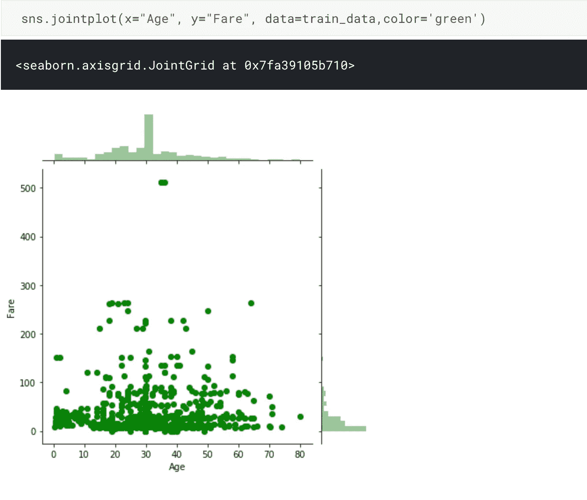

## 热图

热图是以地图或图表的形式表示数据，其中数据值用颜色表示。

```
sns.heatmap(train_data.corr(), fmt = ".2f")
```

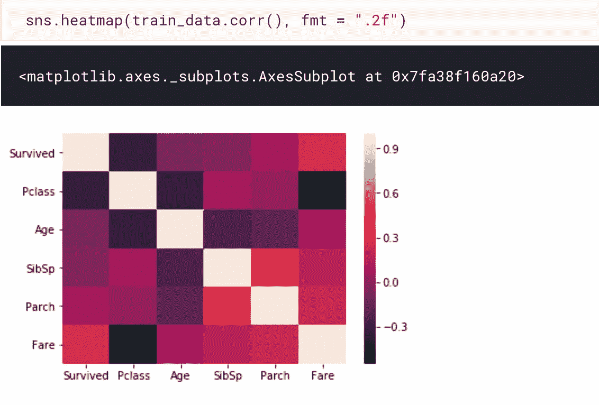

这篇文章到此为止，希望对你有所帮助。干杯！

*原载于 2018 年 11 月 25 日*[*confusedcoders.com*](https://confusedcoders.com/data-science/exploratory-data-analysis-eda-techniques-for-kaggle-competition-beginners)*。*