# 探索性数据分析、特征工程和使用超市销售数据的建模。第一部分。

> 原文：<https://towardsdatascience.com/exploratory-data-analysis-feature-engineering-and-modelling-using-supermarket-sales-data-part-1-228140f89298?source=collection_archive---------1----------------------->

## 通过处理真实世界的数据集，学习数据分析和见解生成的基础知识。

source: [pixabay](http://pixabay.com)

在这一系列的文章中，我们将深入并全面探索数据探索、特征工程和建模的神奇世界。如果您是机器学习和数据科学的初学者，并且需要对这些概念进行实用和直观的解释，那么本系列适合您。

这个系列分为三个部分，我将在接下来的几周内撰写。

第 1 部分:学习如何探索数据集并从中获得洞察力。

[**第二部分:通过数据探索**](https://link.medium.com/MQhb3Q5sUV) **学到特征工程的基础知识。**

**第三部分:** [**造型与特征重要性**](/creating-machine-learning-models-b48bb72a791f) **。**

在我们开始这个旅程之前，我们需要定义一些我们将在这篇文章和后续文章中使用的重要术语。

一、 **EDA** (探索性数据分析)什么是 **it** ？

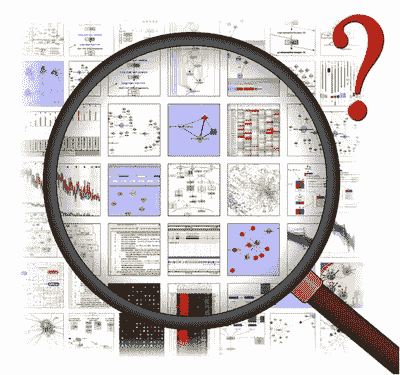

source: [**dsguide**](http://dsguide.biz/reader/tag/exploratory-data-analysis)

***探索性数据分析****(****EDA****)是一种对* [*数据集*](https://en.wikipedia.org/wiki/Data_analysis)***进行分析以总结其主要特征的方法，往往带有直观性。一个* [*统计模型*](https://en.wikipedia.org/wiki/Statistical_model) *可以用，也可以不用，但主要是 EDA 是为了看看数据能告诉我们什么，超越正式的建模或假设检验任务。(来源:* [*维基百科*](https://en.wikipedia.org/wiki/Exploratory_data_analysis) *)***

**总之， **EDA** 可以向我们展示数据中隐藏的关系和属性，甚至在我们将数据扔给机器学习模型之前。**

**接下来， **F.E** (特征工程)你是谁？**

****

**Source: [**Data Science Central**](https://www.google.com/url?sa=i&source=images&cd=&cad=rja&uact=8&ved=2ahUKEwixvPWNtp_fAhWnzYUKHfg1DqcQjB16BAgBEAQ&url=https%3A%2F%2Fwww.datasciencecentral.com%2Fprofiles%2Fblogs%2Ffeature-engineering-data-scientist-s-secret-sauce-1&psig=AOvVaw1F-Q1abxkb91jPwi8qqIEM&ust=1544880365274468)**

*****特征工程*** *是利用数据的领域知识来创建使机器学习算法工作的特征的过程。特征工程是机器学习应用的基础，既困难又昂贵。*(来源:[维基百科](https://en.wikipedia.org/wiki/Feature_engineering))**

**总之，FE 只是使用您现有的数据集知识来创建新的功能，这些功能可以帮助机器学习模型更好地执行。让我们看一个例子。假设我有一个不同汽车类型的数据集，如下所示；**

**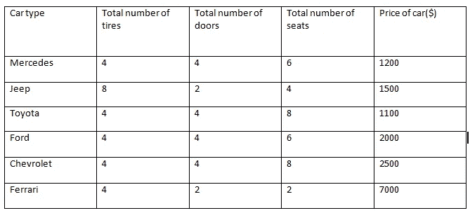**

****sample car dataset****

**现在，假设我想根据数据集中的信息预测汽车的价格，我可以使用我在汽车领域的知识来创建额外的功能，帮助机器学习模型更好地完成这项任务。像车速或引擎类型这样的特征。我甚至可以进一步添加布尔特性，比如:**

****

**[**Disney cars**](https://www.google.com/url?sa=i&source=images&cd=&cad=rja&uact=8&ved=2ahUKEwiAxfHLt5_fAhVLzBoKHX7KA-4QjB16BAgBEAQ&url=https%3A%2F%2Fcars.disney.com%2Fcars&psig=AOvVaw33dOZtdgsSMan6-rrtHnw8&ust=1544880792895863)**

**1.这辆车有信息娱乐系统吗？**

**2.车上有后座娱乐吗？**

**3.这辆车是四轮驱动还是四轮驱动？电子贸易公司**

**你掌握了窍门。**

**我也可以通过我们所谓的 [**特征交叉**](https://developers.google.com/machine-learning/crash-course/feature-crosses/video-lecture) **(下一篇文章**中会有更多关于这个的**)从现有的特征中创建特征。****

**现在我们已经熟悉了术语 EDA 和 FE，让我们获取数据并开始探索。**

**我们将使用由尼日利亚 [**数据科学**](https://www.datasciencenigeria.org/) 提供的超市销售数据集。这里有一个 [**链接**](https://drive.google.com/open?id=1OsTH2Bja_XtEzZs4hgARKupEi0G7mbcF) 到数据。**

**我们将使用流行的原型开发工具 *Jupyter Notebooks* 和抱歉" **R** "各位，我将使用 **Python** 进行这次探索。**

**下载数据后，将其放在与笔记本相同的文件夹中，以便可以访问。启动您的笔记本并导入以下库，如下所示。**

**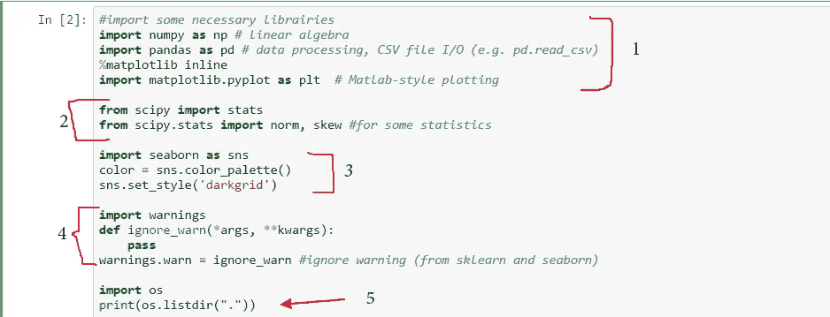**

1.  **这里，我们导入 NumPy、pandas 和 matplotlib，它们分别用于数组操作、CSV 文件处理和绘图可视化。**
2.  **这里，我们导入 stats 模块，它包含一些统计函数，比如 norm 和 skew，我们将使用它们来计算一些统计数据。**
3.  **我们进口**海博**。基于 **matplotlib** 构建的强大绘图库。我们将用它来创造一些有见地的情节。**
4.  **Python 可能会抛出一些烦人的警告，我们使用 **ignore_warns** 函数来阻止这种情况。**
5.  **我们导入了**操作系统**，一个可以轻松访问文件和文件夹的软件包。我们使用 **os.listdir** 来显示我们当前目录(当前工作目录)的内容**

**接下来，让我们读入数据。**

**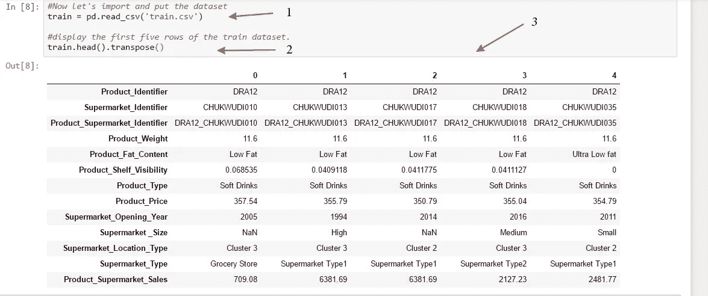**

**first five rows of our data**

1.  **我们使用 pandas **read_csv()** 命令读入数据**
2.  **我们打印出数据的前五行。**

****注意**:我调换了 **train.head()** 命令，因为我想在一个页面上看到所有的行和列，而不需要水平滚动。**

**现在我们可以看到我们的数据和它包含的特征。让我们言归正传。**

****

****source: pixabay.com****

**首先，我们需要知道我们的目标变量。**

**我们可以选择任何特征作为我们的目标，这反过来会告诉我们我们将构建什么样的模型。**

**例如，如果我们选择 **Product_Fat_Content** 作为我们的目标变量，那么我们将有一个*分类*问题，如果我们决定选择 P**Product _ Price**，那么它将变成一个*回归*问题。**

**但是因为我们在这篇文章中不关心构建模型，我们就假设我们正在尝试预测**产品 _ 超市 _ 销售额(超市的总销售额)。****

**接下来，我们来了解一下我们的特点。由于特征的数量很少，我们可以手动查看它们，并立即删除那些不值得研究或放入模型的特征。为此，我们将使用我们在超市领域的知识。**

**我通常拿出笔和纸，画出如下所示的五列，并手动填充所有功能:**

****特征==重要==介于==不重要= =原因****

**不过，你也可以用其他方式来做这件事。让我们来看看这些特征。**

1.  ****产品标识**:这是每个特定产品的唯一标识。**判决**:介于两者之间。
    **原因**:有时最好删除任何唯一的 ID 列，因为我们的模型可能会超出这个范围，但有时它可能会有所帮助。我们可以用这个做实验。**
2.  ****超市标识符:**这是每个超市的唯一 ID。
    **判决**:介于两者之间。
    **原因**:同上**
3.  ****产品超市标识符:**这是产品和超市标识符的串联。 **判断**:中间
    **原因**:该特性可以用来代替产品和超市标识符。这可能是两种特征的结合。这可能很重要，但在编码时可能会大大增加我们的维度空间。(稍后会有更多相关内容)**
4.  ****产品 _ 重量:**产品的重量。
    **判决**:重要
    **理由**:一件商品的重量可能会影响其价格，而价格又会影响超市的总销售额。**
5.  ****产品 _ 脂肪 _ 含量:产品中所含的脂肪量。
    判决**:重要
    **理由**:脂肪含量也会影响价格，进而对超市总销售额有贡献。**
6.  ****Product _ Shelf _ Visibility:**根据数据描述，这是分配给一组产品的百分比中的*总展示面积。
    **结论**:重要
    **原因**:产品的知名度很可能决定了该产品是否会被顾客看到。这会影响该产品的销售。***
7.  ****产品类型:**产品所属的类别。
    **结论**:重要
    **原因**:某种类型的产品一般会比其他产品卖得多。**
8.  ****产品 _ 价格:**产品的价格。
    **判决**:重要
    **原因**:这当然是一个重要的特征因为产品的价格肯定会影响我们的目标变量 ***产品 _ 超市 _ 销售*** 。**
9.  ****超市 _ 开业 _ 年份:**超市开业的年份。
    **判决**:重要
    **原因**:开业年份可能影响产品销量。**
10.  ****超市 _ 大小:**这是超市的大小。它被分为小型、中型和高级。
    **判决**:重要
    **理由**:超市的规模可以意味着超市的销售额更多。**
11.  ****超市 _ 位置 _ 类型:**该特征是对超市位置的描述。根据数据，有 3 个集群(集群 1、2 和 3)。我们不知道哪个更高，但是我们想保留这个特性**。
    结论**:重要
    **原因**:位置类型可能包含超市所在位置的信息，无论它们是在城市、农村、繁忙还是偏僻的地方。**
12.  ****超市 _ 类型:**超市的类型分为杂货店、超市类型 1、超市类型 2、超市类型 3。
    **结论**:重要
    **原因**:它给了我们关于超市的有用信息，这些信息在预测总销售额时可能很重要。**
13.  ****产品 _ 超市 _ 销售:**这是我们这个岗位的 ***目标*** 变量。它是超市的销售总额。
    **判决**:对，重要！
    **原因**:是我们的目标变量。**

**现在我们已经手动检查了我们的数据，发现几乎所有的特性都很重要(尽管有些还在检查中)，我们可以开始我们的 EDA 了。**

**当对一个有合理数量的数字列的数据集进行 **EDA** 时，我喜欢做的第一件事是检查我的目标变量和这些数字特征之间的关系。一个快速的方法是使用 ***seaborn 热图*** 图。此 ***seaborn 热图*** 采用根据我们的数据集中的数字特征计算的相关矩阵，并对其进行加热绘图。输入下面的代码制作一个热图。**

**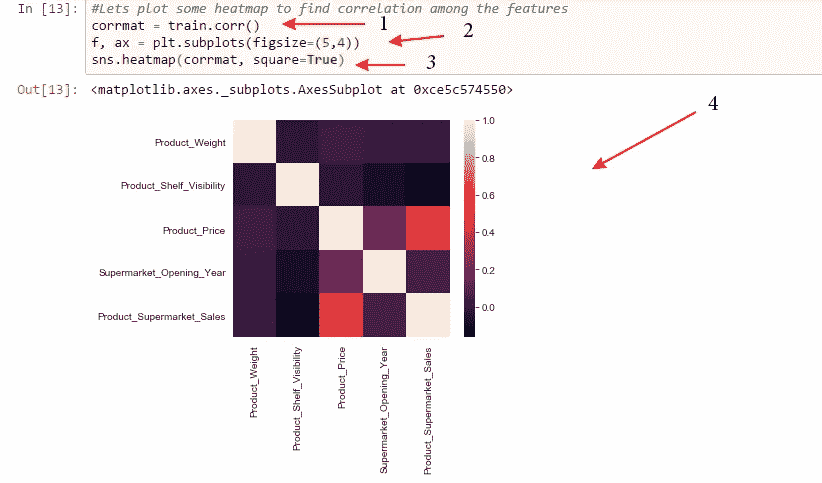**

**seaborn heatmap plot of correlations**

1.  **首先，我们使用熊猫 ***计算数据的相关性。corr( )*** 函数，然后我们将它存储在变量 ***corrmat*** 中**
2.  **这里，我们简单地设置我们的图的图形大小。**
3.  **在这里，我们将 ***corrmat*** 传递给**seaborn**function***heat map()***来制作美丽的剧情。**

**现在我们来解读一下上面的剧情。看一看它，看看你能从中得到什么启示。**

**如果你不知道如何解读一个 ***热图*** 剧情，下面几段给你。如果有，请跳过。**

**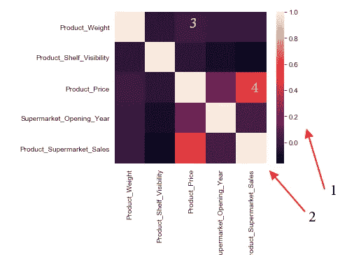**

**Heatmap plot of Supermarket dataset**

*****解读热图*****

**热图中的每个方块显示了任意两个特征**与**的相关程度(它们之间是否存在某种关系)。一个特性的增加会导致另一个特性的增加吗？(正相关)还是一个的增加导致另一个的减少？(负相关)。**

1.  **从 0.0 到 1.0 的垂直范围显示了任意两个要素之间相关性的相对大小，其中较热的值较高，意味着相关性较高。**
2.  **矩阵的几乎发白的对角线部分表示所有特征都与自身高度相关。(当然，他们应该是。)**

**现在，让我们来解释正方形内的标签。**

**向左水平追踪 ***标签 3*** 引出 ***产品 _ 重量*** 垂直向下追踪引出 ***产品 _ 价格*** 。这意味着方形的**框(3)** 向我们展示了**产品 _ 重量**和**产品 _ 价格**的相关程度。我们可以看到它们实际上并不相关，因为正方形几乎是冷的。**

****标签 4** 显示**产品 _ 价格**和**产品 _ 超市 _ 销售之间的关联。我们清楚地看到该区域很热，这意味着相关性很高。****

**这就是你解读热图的方式。**

**好了，你已经获得了热图阅读的学位。现在，你开始了你的第一份工作，下面的热图就摆在你面前。**

**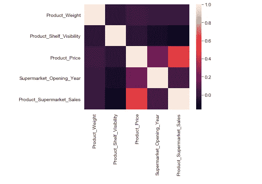**

****heatmap of dataset****

****

> **你的老板满怀信心地看着你，认为他雇对了人，并要求你给出答案。**

**你站起来，看一眼热图，笑着说:**

****

**这个图显示了产品价格是与我们感兴趣的目标 ***【产品 _ 超市 _ 销售】*** 最相关的特征，根据我们的直觉，如果销售更贵的产品，那么总的**产品 _ 超市 _ 销售**可能会增加，反之亦然。**

**你的老板点点头，让你继续。你现在充满了自信，而且还在继续。**

**我能看到的另一个关联——通过 small——是 ***产品 _ 价格*** 和 ***超市 _ 开业 _ 年份。*****

**你的老板问这是什么意思？**

**嗯，综上所述，这是在告诉我们，超市开业的年份似乎是影响着产品的价格。它可能是积极的(新超市卖得更多)，也可能是消极的(旧超市有更多忠诚的顾客，卖得更多)。我必须对此进行调查并找到更多的信息。**

**除此之外，这个图没有其他有趣的关联，先生。但这些只是数字特征。我还是要检查分类特征。**

****

**source: pixabay.com**

**你的老板很高兴，他给你一个坚定的握手，并要求你调查进一步向他报告第二天。**

**你走吧，去做更多的探索。**

**首先，您决定调查数据集中所有要素之间的关系。因此，您希望根据其他特性来绘制每个特性，但是您希望只绘制一次，而不编写多个 for 循环。**

**还好， ***Seaborn 的******pair plot()***前来救援。**

**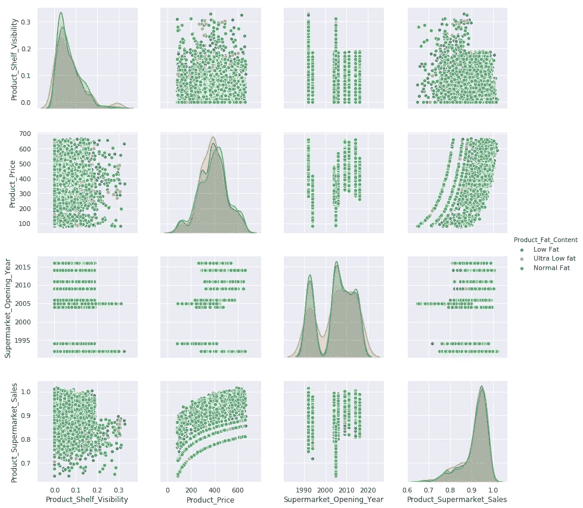**

**seaborn pairplot on supermarket dataset**

**如果你以前没有见过 seaborn pairplot，这就是它的样子。基本上就是一个 ***的单线奇观。*我们还可以指定一个分类特征，用于着色。****

**注意:Seaborn***pair plot***只绘制数字特征，但是我们可以根据所选的分类列为我们的图着色。此外，如果传递给 pairplot 的数据集包含缺失值，它将引发错误。**

**首先，让我们检查有缺失值的列，这样我们就不会将它们添加到 pairplot 中。**

**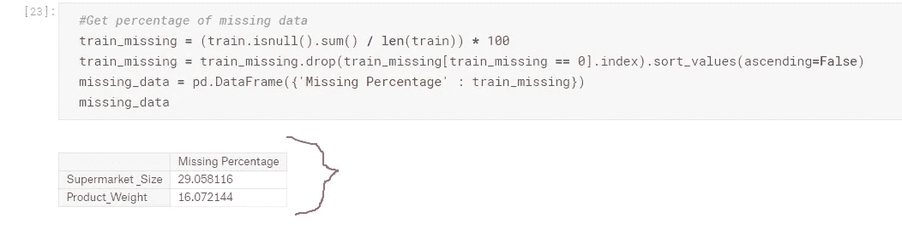**

**Check for missing values**

**嗯，我们有两个缺少值的列，Supermarket_size 是一个分类特征，Product_Weight 是一个数值特征。我们将在下一篇文章中讨论这些缺失的特性，现在，让我们将它们从我们的 ***pairplot( )*** 专栏中排除。**

**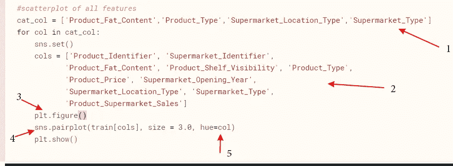**

**code block to pairplot features**

1.  **这里我们列出了数据集中所有的分类特征。(我们将用它们来着色。这意味着每个分类特征都有一组配对图。**
2.  **在 for 循环中，我们列出了所有没有缺失值的列。**
3.  **每次创建一个新的图形**
4.  **调用单行奇迹 ***pairplot( )*** 并传递我们的数据“火车”和我们想要的列。我们指定尺寸为 ***3.0*** ，这样我们就可以看到完整的 pairplot 而无需滚动。**
5.  *****hue*** 变量从我们的分类列中提取一列，并使用它们为我们的配对图着色。**

**运行上面的代码后，我们总共会有四个图。让我们一个接一个地看它们，并试着从中解读或得出见解。**

> **情节一:类别(**产品 _ 脂肪 _ 含量**)**

**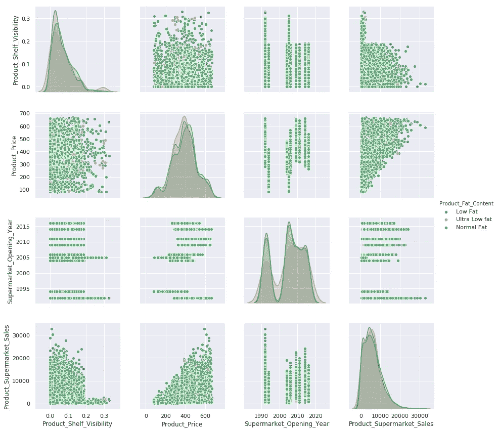**

**Plot one: Category (**Product_Fat_Content**)**

> ****释义:****

*   **我们可以看到绝大多数产品都含有**正常脂肪。那么，我们能用这些知识做些什么呢？** 嗯，我们可以创建一个布尔特征列 **is_normal_fat** 并将**正常脂肪(**多数类)与另外两个**低脂肪**和**超低脂肪(**少数类**)分开。这只是一个建议。****
*   **产品价格和超市销售额之间呈正相关趋势。这证实了**热图**图所示的相关性(正相关)。那么，我们能用这些知识做些什么呢？**
*   **嗯，这个功能肯定很重要。我们可以从中创造更多的功能。**
*   **我们还注意到我们的目标变量(**产品 _ 超市 _ 销售)**和变量**产品 _ 货架 _ 可见性**是 [**右偏**](https://www.mathsisfun.com/data/skewness.html) 。我们可以使用对数函数对它们进行转换，使它们正常偏斜。我们以后再做这个。**
*   **我们也可以看到 ***低脂*** 和 ***超低脂*** 的价格相对高于 ***正常脂*** 的产品。那么，我们能用这些知识做些什么呢？
    嗯，我们可以创建一个分类功能，将 ***正常脂肪*** 产品的价格设置为低，将 ***低/超低脂肪*** 产品的价格设置为高。**
*   **我注意到的另一件事是 S***upermarket _ Opening _ Year***之间似乎有差距。注意 90 年代的超市集群和 2000 年代的另一个集群。我们能用这些知识做些什么？嗯，我们可以创建一个新的特性列来捕获这两个集群。**
*   **在这一对情节中，我没有注意到任何其他有趣的关系，所以我们继续下一个。**

> **如果你注意到任何其他关系，请在下面留言通知我。**

> **地块二:类别(**产品 _ 类型**)**

****

**Plot two: Category (**Product_Type**)**

> ****释义:****

*   **从**Product _ type**category***家居、健康卫生、*** 和 ***其他*** 主导剧情。那么，我们能用这些知识做些什么呢？
    我们可以创建一个特征列，将数据分为两组，一组捕获 ***家庭、健康卫生*** 和 ***其他*** ，另一组捕获其余产品。谁知道呢？这可能是一个很好的功能。**
*   **其他的似乎都没什么意思。所以我就暂时停在这里，进入下一个情节。**

> ****地块三:(超市 _ 位置 _ 类型)****

**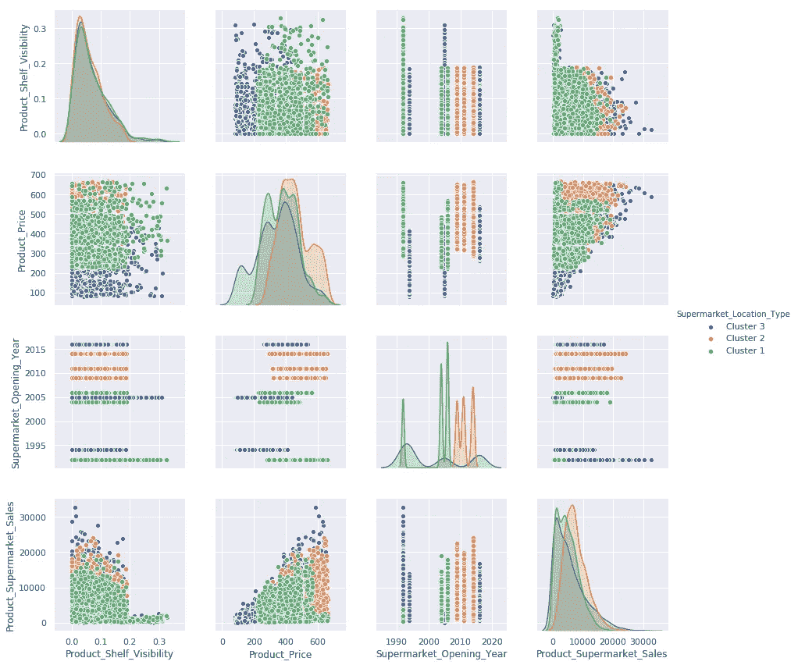**

****Plot three: (Supermarket_Location_Type)****

> ****释义:****

*   **似乎集群 2 是最昂贵的位置。是**产品 _ 价格**和**产品 _ 超市 _ 销售**看起来更高。**
*   **我们还注意到，集群 2 中的超市较新(2010 年以后)。**
*   **集群 1 的产品价格较低，集群 2 介于两者之间。那么，我们能用这些知识做些什么呢？
    好了，现在我们知道了**超市 _ 位置 _ 类型**是一个非常重要的特性，它似乎有一些 [***平凡性***](/understanding-feature-engineering-part-2-categorical-data-f54324193e63) 。如果我们要标记编码这个变量，我们应该尽量保持这个顺序结构。**

**请记住，如果你注意到我错过了任何解释，请使用下面的评论框。**

> ****地块四(超市 _ 类型):****

**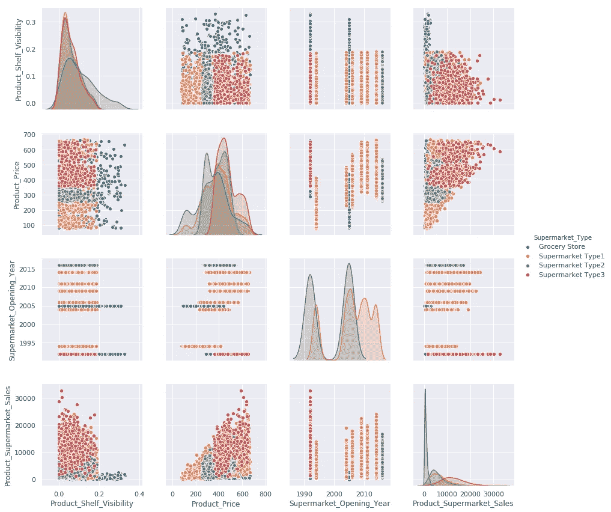**

****Plot four (Supermarket_Type)****

****释义:****

**看着这个图，我们可以立即看到不同的超市几乎被精细地分开。我们可以从中获得很多启示:**

*   **首先，我们可以看到**超市类型 3** 的商品价格一般从 350 左右开始，**超市类型 1** 的商品价格大约在 0-250 之间，而**超市类型 2** 的商品价格大约在 250-350 之间，最后，杂货店接受所有范围的价格。我们能用这种洞察力做什么？
    我们可以创建分类列来捕获这些范围，或者我们可以创建**箱**并根据价格范围对每个超市进行分组。**
*   **查看**超市 _ 开业 _ 年份**，我们立即注意到属于**超市类型 3** 的超市都是在 90 年代开业的；这意味着我们之前提议创建的功能——将开放年份划分为两个集群——将非常重要。**

**一如既往，如果你注意到我可能错过了任何好的解释，请在下面的评论框中通知我。**

**哇哦！这是一个漫长的第一个帖子。希望你学到了很多。**

**在我的下一篇[帖子](https://link.medium.com/MQhb3Q5sUV)中，我们将谈论 [**特征工程和创作**](https://link.medium.com/MQhb3Q5sUV) **。**在那里，我们将把我们在做这个 **EDA** 时收集的所有直觉带入生活。**

**我给你的临别建议是，你得到一个数据集，戳它，撕开它，找到隐藏的宝石并从中获得洞察力，并从中获得乐趣。**

****

****source: pixabay.com****

> **但是请记住，EDA 是一门艺术，它可以用许多不同的方式来完成；上面列出的步骤绝不是你必须严格遵循的大纲。做对你有用的事。**

****

****Source: Pixabay.com****

# **所以，去享受探险的乐趣吧。再见了。**

**本帖的笔记本和资料可以在 [**这里**](https://github.com/risenW/medium_tutorial_notebooks/blob/master/supermarket_regression.ipynb) 找到**

> ***欢迎提问、评论和投稿。***

> **在 [**twitter**](https://twitter.com/risingodegua) **上跟我连线。****
> 
> **在[**insta gram**](https://www.instagram.com/rising_developer/)**上跟我连线。****