# R 中的探索性数据分析-使用伪脸书数据集探索一个变量

> 原文：<https://towardsdatascience.com/exploratory-data-analysis-in-r-explore-one-variable-using-pseudo-facebook-dataset-29031767eb07?source=collection_archive---------9----------------------->

根据维基百科，“ ***探索性数据分析****(****EDA****)是一种分析 d*[*a*](https://en.wikipedia.org/wiki/Data_set)*ta 集合以总结其主要特征的方法，通常采用可视化方法。可以使用或不使用统计模型，但 EDA 主要是为了查看数据可以告诉我们什么，而不仅仅是正式的建模或假设测试任务。*

EDA 是一个让数据给你惊喜的机会。回想调查的目标，重新思考我们试图回答什么问题。识别可能导致意外结果的数据特征。

作为一个实际的例子，我们将使用由 Udacity 整理的 facebook 数据集。该数据集有近 99，000 个观察值和 15 个变量，即对于每个观察值，我们都有用户的不同信息，如姓名、年龄、出生日期。

我们的目标是了解用户的行为和他们的人口统计数据。因此，我们有诸如 friend_count、likes_received 等变量。

# **使用 ggplot**

ggplot 是一个用于统计编程语言 r 的数据可视化包。它是为了用最少的代码行为数据分析设计优雅的可视化而构建的。您可以使用以下功能下载并安装 ggplot 库

```
install.packages('ggplot2')
```

**qplot —** [qplot](https://ggplot2.tidyverse.org/reference/qplot.html) 代表快速绘图，可用于绘制直方图。

## **1。生日等级分析**

为伪 facebook 数据集中出现的所有用户的生日绘制直方图。

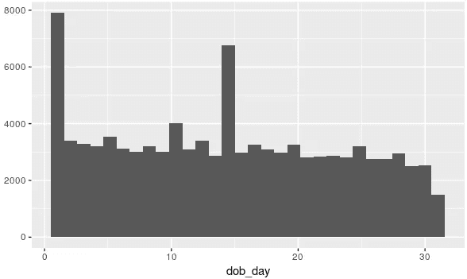

Histogram using qplot

在上面的图中，假设我们需要为一个月中的每一天绘制一个清晰的图形，那么我们需要添加`scale_x_continuous`，这是连续 x 美学的默认比例。

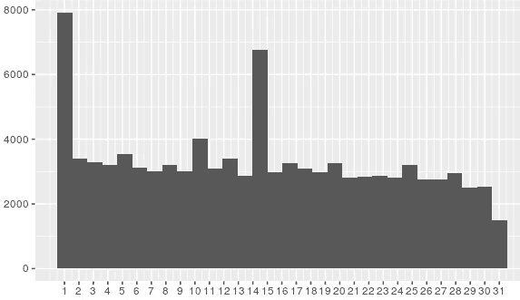

Histogram using qplot with continuous x axis scale

绘制直方图的另一种方法是使用 **ggplot()**

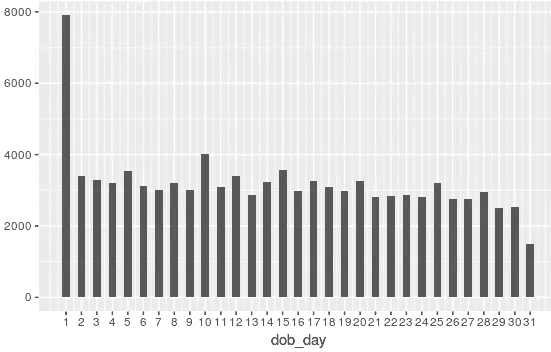

Use of binwidth in ggplot2()

这里的线条是等间距的，因为我们还指定了 binwidth。同样在上面的图中，我们观察到大多数人在每个月的第一天出生，这看起来很奇怪。让我们使用刻面来深入研究这个问题。

## 刻面

在某些情况下，我们希望绘制多个数据子集中的集合变量之间的关系，结果显示为面板。这是 ggplot2 的一个漂亮的特性。[分面](http://www.cookbook-r.com/Graphs/Facets_(ggplot2)/)由分类变量定义。`facet_wrap` 和`facet_grid`用于 r 中的刻面

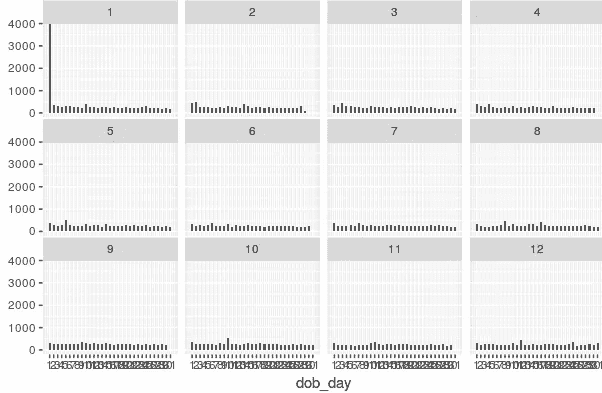

Faceting in R

从上面可以推断，只有第一个月，即一月，由出生于第一天的大多数用户组成。这可以是数据集中的默认值，也可以是异常值。

## 极端值

远离数据集中其他值的值称为异常值。异常值会影响均值和标准差等测量值。异常值可能是关于极端情况的准确数据，或者是由于数据集中的一些变量被[顶部编码](https://en.wikipedia.org/wiki/Top-coded)或底部编码，即一些变量被设置了最大或最小限制。

## 2.朋友级别分析

画出用户的生日后，让我们画出每组观察的朋友数量。

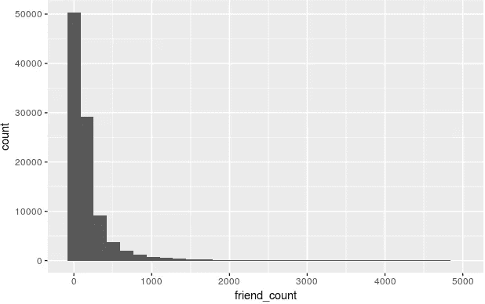

Long tail graph for number of friends of each observation

这种类型的图叫做[长尾图](https://en.wikipedia.org/wiki/Long_tail)。该图是这样的，因为许多人在 500 范围内有脸书朋友，因此我们在左边得到高的箱子。但是有些用户有很多朋友，可能多达 5000 个，这是一个用户可以拥有的最大朋友数量。为了进一步研究这个尾巴中的一些其他观察结果，我们将不得不检查朋友数低于 1000 的用户。

为了避免看到这种长尾数据，我们可以使用以下方法之一:

1.  qplot 内的 **xlim** 参数。这个参数取一个向量，我们有轴的开始位置和结束位置。

```
qplot(x=friend_count,data=pf,xlim=c(0,1000))
```

2.添加一个层并在`scale_x_continuous`内使用限制

```
qplot(x=friend_count,data=pf) + 
  scale_x_continuous(limits=c(0,1000))
```

这两个步骤都会产生下图

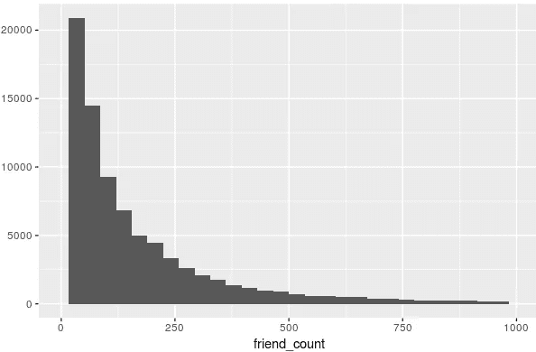

现在让我们添加一些更好的标签和一些宁滨。要调整 binwidth，我们可以传递 binwidth 参数 25，我们也将每隔 50 个单位断开 x 轴，这可以通过将 [**breaks**](https://planspace.org/20141225-how_does_r_calculate_histogram_break_points/) 参数传递给 scale_x_continuous 层来实现。

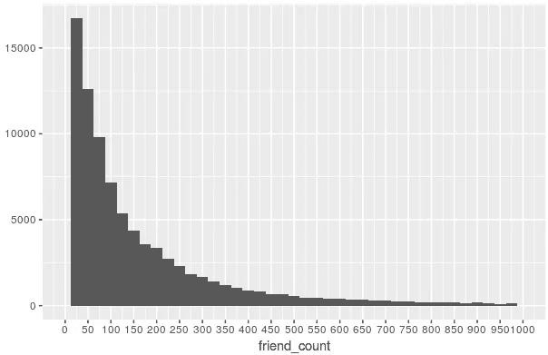

从上面的图表我们可以知道，许多用户的朋友少于 25 个。因此，他们可以被认为是新用户。

## 3.性别水平分析

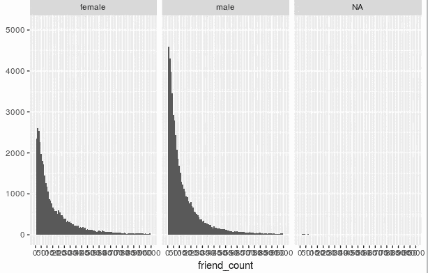

Gender Level Analysis

当我们绘制朋友的性别等级数量时，我们发现很多性别被归入 NA 类别。去掉 NA 后，我们得到下图。

```
qplot(x = friend_count, data = subset(pf,!is.na(gender)), binwidth = 10) +
  scale_x_continuous(limits = c(0, 1000),
                     breaks = seq(0, 1000, 100)) + 
  facet_wrap(gender ~ .)
```

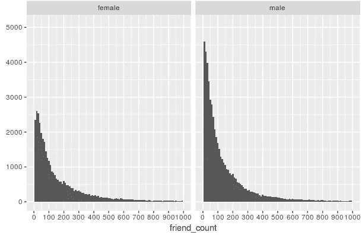

Gender Level Analysis — Removing NA

## 4.任期水平分析

用户的天级任期是下面给出的数据集。请注意，参数 **color** 决定图中对象的颜色轮廓，而参数 **fill** 决定图中对象内部区域的颜色。

```
qplot(x=tenure,data=pf,
      color=I('black'),fill=I('#632b6c'))
```

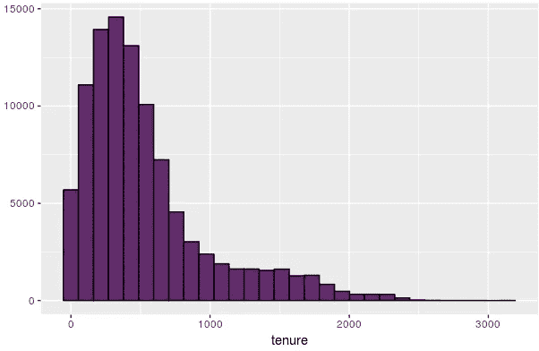

Daily Tenure Level Analysis

如果我们希望看到年级别的任期，那么使用下面的代码， **xlab** 和 **ylab** 是为图分配标签的参数。

```
qplot(x=tenure/365,data=pf,binwidth=0.25,
      xlab="Number of years using facebook",
      ylab="Number of users in sample",
      color=I('black'),
      fill=I('#632b6c')) +
  scale_x_continuous(breaks = seq(1, 7, 1),limits=c(0,7))
```

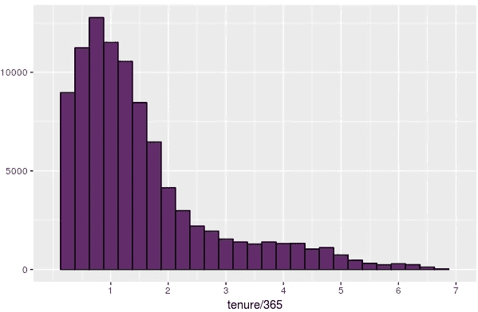

Yearly Tenure Level Analysis

github 上共享了使用权图的等效 ggplot 语法。

## 5.年龄层次分析

绘制年龄水平直方图显示，对于某些特定的年龄，存在某些峰值，并且存在一些一百岁的用户，这在此刻看起来相当奇怪。

```
qplot(x=age,data=pf,xlim=c(0,200),binwidth=1,
      xlab="Number of years using facebook",
      ylab="Number of users in sample",
      color=I('black')
      ,fill=I('#95ada5')) + 
  scale_x_continuous(breaks=seq(10,130,5))
```

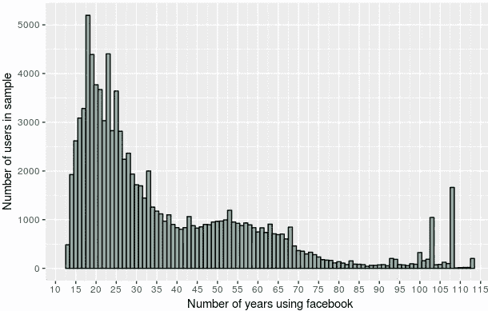

Age Level Analysis

# 转换数据

在生成汇总统计数据时，我们经常会发现一些情况，例如，一些值比中间值大 10 或 100 倍。乍一看，这可能被认为是异常值，但当深入研究时，会发现这是正确的数据。在我们的伪脸书数据集的情况下，可能一些用户比大多数用户具有更高的喜欢和评论量。在统计学中，我们说数据过于分散。通常它有助于转换这些值，所以我们可以看到标准差，所以简单地说，我们只是缩短了尾巴。

从用户级别的好友计数直方图，我们知道我们的直方图有一个长尾。我们可以通过取对数(以 2 为底或以 10 为底)或平方根来转换这个变量，这将帮助我们更清楚地找到一个模式，而不会被尾部所偏离。

统计技术，如线性回归，是基于[假设](https://en.wikipedia.org/wiki/Linear_regression#Assumptions)变量具有正态分布。因此，通过取对数，我们可以将数据转换成更接近正态分布的形式，这对于建模来说是有效的。虽然本文的范围仅限于探索性的数据分析，但是让我们看看变量转换后的情况。

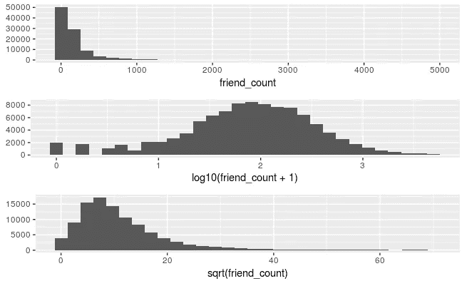

Data transformation

从上图中可以推断出，变量 friend count 下所有观察值的对数是正态分布的，可以用于线性回归。

# 频数多边形

正如[在线统计手册](http://onlinestatbook.com/2/graphing_distributions/freq_poly.html)、*中所定义的，频率多边形是一种用于理解分布形状的图形设备。它们的作用与直方图相同，但在比较数据集时尤其有用。”*

频率多边形类似于直方图，但它们绘制了一条连接直方图中计数的曲线，从而使我们能够更详细地观察分布的形状和峰值。

```
qplot(x = friend_count,
      data = subset(pf,!is.na(gender)),
      xlab="Number of users using facebook",
      ylab="Number of friends per user",
      binwidth = 10
      , geom="freqpoly",color=gender) +
  scale_x_continuous(limits = c(0, 1000),
                     breaks = seq(0, 1000, 100))
```

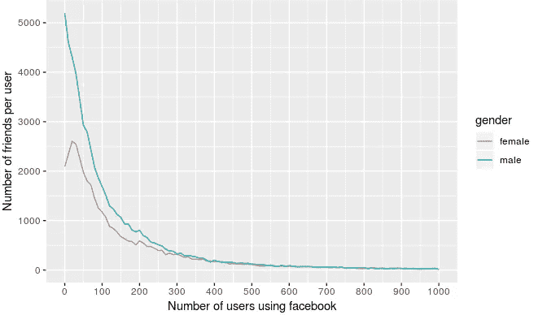

# 箱形图

我们将生成一个按性别划分的好友数量的[箱线图](http://flowingdata.com/2008/02/15/how-to-read-and-use-a-box-and-whisker-plot/)

```
qplot(x=gender
      ,y=friend_count
      ,data= subset(pf,!is.na(gender))
      ,geom='boxplot')
```

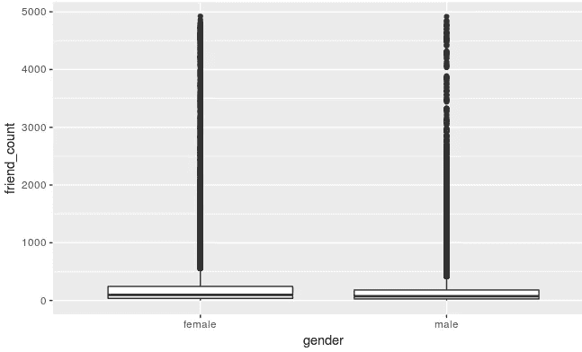

BoxPlot 1 — Gender Level Total Friends

上面方框图中的黑色水平线是中间值，这意味着上面图中的大多数小点都是异常值。我们认为异常值是中位数的四分位数范围的一倍半。按照这种逻辑，这个数据集中有很多离群值。

为了解决这个问题，我们调整了代码，将重点放在好友数量在 0 到 1000 之间的用户上。

```
qplot(x=gender
      ,y=friend_count
      ,data= subset(pf,!is.na(gender))
      ,geom='boxplot')+
  coord_cartesian(ylim=c(0,1000))
```

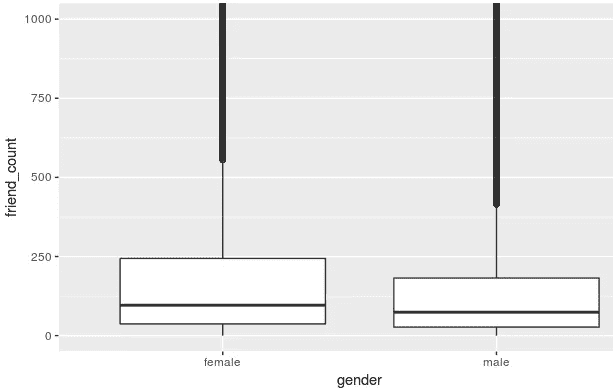

BoxPlot 2— Gender Level Total Friends

在上图中，我们将**scale _ y _ continuous(limits = c(0，1000))** 替换为 **coord_cartesian(ylim=c(0，1000))** 。我们这样做是为了让表格摘要与我们的方框图相匹配(查看 github 了解更多细节)。

# 结论

在一个变量的探索性数据分析中，我们知道每个变量都是重要的，它们可能有一些隐藏的特征，直到我们绘制它们时才显现出来。接下来，我们将通过探索两个变量来讨论 EDA。