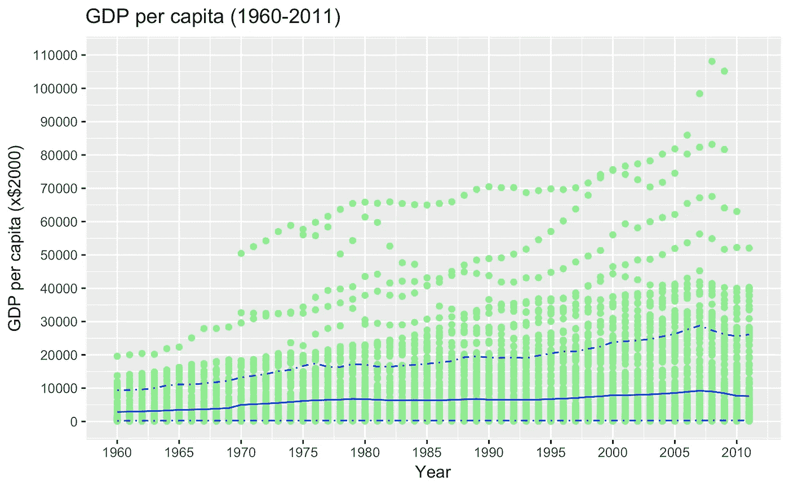
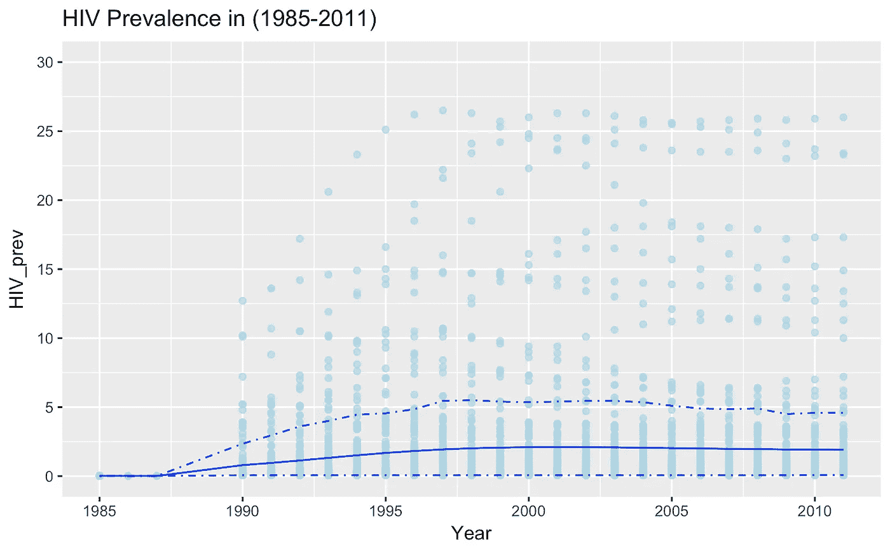
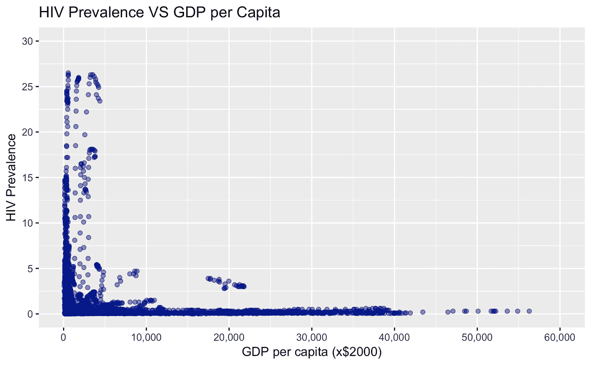
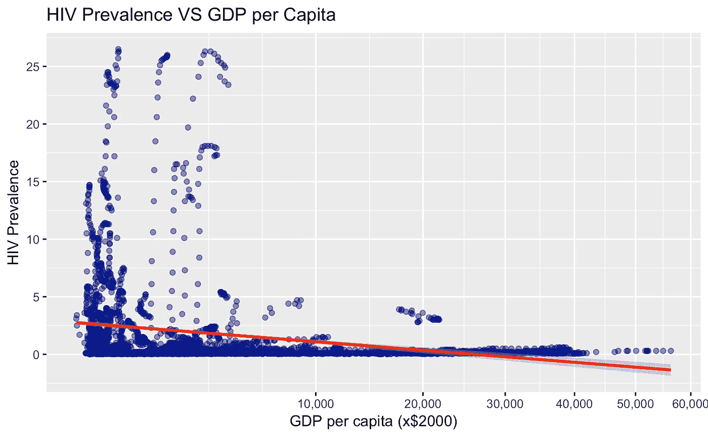

# GapMinder 全球数据的探索性数据分析

> 原文：<https://towardsdatascience.com/exploratory-data-analysis-in-r-of-global-data-from-gapminder-13c5de5bee70?source=collection_archive---------0----------------------->


Hans Rosling/GapMinder

在这篇文章中，我对来自 [GapMinder](https://www.gapminder.org/data/) 的两个数据集进行了探索性的数据分析( [EDA](https://en.wikipedia.org/wiki/Exploratory_data_analysis) )。这个帖子包括使用的 R 代码(也可以在这个 [GitHub repo](https://github.com/hamzaben86/Exploratory-Data-Analysis-Projects/tree/master/EDA-Health-Data-master) 中找到)。总而言之:

*   方法:探索性数据分析、相关、线性回归
*   程序/平台:R/RStudio
*   资料来源:世界卫生组织、世界银行

# 数据

在这个数据分析中，我使用了 GapMinder 的数据网页上的数据。具体来说，我专注于:

*   [](https://www.economicshelp.org/blog/343/economics/gdp-per-capita-statistics/)**(美元，经通胀调整)*来自世界银行(WB)和*
*   *[](https://en.wikipedia.org/wiki/List_of_countries_by_HIV/AIDS_adult_prevalence_rate)**来自世界卫生组织(世卫组织)的 15-49 岁成年人艾滋病病毒感染率(%)* 。**

# **这个问题**

**我在这个分析中提出的问题是:**

*****在 15-49 岁年龄段中，人均国内生产总值和艾滋病毒感染率之间是否存在关联？如果是，这种相关性有多强？*****

**我的预期是，人均 GDP 和艾滋病毒流行率之间存在负相关关系；这意味着越穷的国家艾滋病毒感染率越高。**

# **数据争论**

**让我们在 R 中对从 GapMinder 下载的 CSV 文件进行一些初始数据辩论，为我们的数据分析做准备。**

## **人均国内生产总值数据**

**来自 GapMinder 的数据是 CSV 文件的形式，需要根据原始 CSV 表中的键值对进行重新组织。我使用了惊人的' [tidyr](https://blog.rstudio.com/2014/07/22/introducing-tidyr/) '库中的函数 *gather()* 。**

**让我们来看看生成的数据帧结构，并确定该数据集涵盖的时间范围:**

```
**## 'data.frame': 14300 obs. of 3 variables: 
## $ Income per person (fixed 2000 US$): 
Factor w/ 275 levels "Abkhazia","Afghanistan",..: 1 2 3 5 6 7 8 9 10 12 ... 
## $ Year : int 1960 1960 1960 1960 1960 1960 1960 1960 1960 1960 ... 
## $ GDP : num NA NA NA NA 1280 ...**
```

```
**## [1] 1960 2011**
```

**产生的数据框架包含 3 个变量(国家、年份、GDP)的 14，300 个观察值。“国家”一栏列出了 275 个国家。提供了 275 个国家从 1960 年至 2011 年的人均国内生产总值。**

## **艾滋病毒流行率数据**

**让我们对艾滋病毒流行率数据进行类似的数据整理。同样，我将使用来自“ [tidyr](https://blog.rstudio.com/2014/07/22/introducing-tidyr/) ”库中的函数 *gather()* 。**

**同样，让我们来看看生成的数据帧的结构:**

```
**## 'data.frame': 9075 obs. of 3 variables: 
## $ Estimated HIV Prevalence% - (Ages 15-49): 
Factor w/ 275 levels "Abkhazia","Afghanistan",..: 1 2 3 5 6 7 8 9 10 12 ... 
## $ Year : int 1979 1979 1979 1979 1979 1979 1979 1979 1979 1979 ... 
## $ HIV_prev : num NA NA NA NA NA ...**
```

**由此产生的数据框架包括 3 个变量(国家、年份、估计的艾滋病毒流行率)的 9075 个观察值。“国家”一栏列出了 275 个国家。提供了 275 个国家从 1979 年至 2011 年的人均国内生产总值。**

# **组合数据帧**

**让我们结合这两个数据框架来比较人均 GDP 和艾滋病流行率。我正在使用 [*【合并()*](https://www.rdocumentation.org/packages/data.table/versions/1.10.4-2/topics/merge) 功能。接下来，让我们来看看结果数据帧的结构。**

```
**## 'data.frame': 9075 obs. of 4 variables: 
## $ Country : Factor w/ 275 levels "Abkhazia","Afghanistan",..: 1 1 1 1 1 1 1 1 1 1 ... 
## $ Year : int 1979 1980 1981 1982 1983 1984 1985 1986 1987 1988 ... 
## $ GDP : num NA NA NA NA NA NA NA NA NA NA ... 
## $ HIV_prev: num NA NA NA NA NA NA NA NA NA NA ...**
```

**我们现在有了一个用于后续数据探索的数据框架。该数据框架分为四栏:(一)国家，(二)年份，(三)该国该年的人均国内生产总值，(四)该国该年的艾滋病毒流行率。**

# **探索数据**

**数据集通常以缺失数据为特征。我怀疑这个数据集也是如此，即使它来自一个官方组织。让我们来看看缺失的 GDP 数据在综合数据框架中所占的百分比。**

```
**## [1] 35.30579**
```

**综合数据框架中约 35.3%的人均国内生产总值列有缺失数据。这是相当可观的，很可能是因为持续的 GDP 测量成本很高，而且只是在过去几十年才开始(注意:世界银行成立于二战后的 1945 年)。**

**在随后的分析中，缺失的数据将被排除(即不绘制),而不是用平均值或估计值代替缺失的数据。**

**让我们来看看艾滋病毒流行率方面缺失数据的百分比。**

```
**## [1] 63.62534**
```

**在综合数据框架中，艾滋病毒流行缺失数据的比例甚至更高，达到 63.6%。这当然是因为世界卫生组织的初始数据框架包括了始于 1979 年的时间框架，而我们的综合数据框架始于 1960 年。**

**自 20 世纪 80 年代初，HIV/Aids 成为公认的重大健康危机[后，HIV 相关指标的一致性测量才真正大规模开展。](https://www.hiv.gov/hiv-basics/overview/history/hiv-and-aids-timeline)**

**让我们从两组数据中初步了解一下分布的类型。对于人均国内生产总值:**

```
**## Min. - 1st Qu. - Median - Mean - 3rd Qu. - Max. - NA's 
## 54.51 - 590.26 - 2038.88 - 7315.07 - 9239.73 - 108111.21 - 3204**
```

**关于艾滋病毒流行率:**

```
**## Min. - 1st Qu. - Median - Mean - 3rd Qu. - Max. - NA's 
## 0.010 - 0.100 - 0.300 - 1.743 - 1.200 - 26.500 - 5774**
```

**快速浏览清楚地显示，在我们的数据框架中，一些国家显著提高了分布的平均值(与中位数相比)。艾滋病毒流行率数据尤其如此。**

# **情节**

**在本节中，我生成了各种图(使用 [ggplot](https://www.rdocumentation.org/packages/ggplot2/versions/2.2.1/topics/ggplot) )来获得分布的概况，并试图确定趋势和模式。**

**首先，我们查看整个数据集，并生成一个散点图，显示 1960 年至 2011 年数据集中所列的 275 个国家的人均 GDP。**

**我们还覆盖了平均值和上下限(5%；95%)的 GDP。这将使我们更好地理解我们的大部分分布在哪里。**

****

**该图显示了 1960 年至 2011 年间全球 GDP 的总体增长趋势。大部分数据属于最高人均国内生产总值 30，000 美元(2，000 先令)。**

**让我们通过生成我们的数据集中所列的 275 个国家从 1960 年到 2011 年的艾滋病毒流行率散点图来查看艾滋病毒流行率的数据集。**

**与人均 GPD 类似，我们也叠加了平均值和上下限(5%；95%)的艾滋病毒感染率。我们将关注 1985 年至 2011 年的数据。**

****

**根据我们的数据，艾滋病毒感染率在 1985 年至 2011 年期间有所上升，平均水平从 2000 年代初开始停滞，自 2005 年以来略有下降。这将对应于预防措施的进步，以减少感染艾滋病毒的发生率和可能性。**

# **相关和线性回归**

**现在，让我们将重点放在我们之前创建的组合数据框架上，以研究两个感兴趣的变量之间的相关性。为了先看一下相关性，让我们画出 HIV 感染率与人均 GDP 的关系图。**

****

**散点图清楚地表明，与人均国内生产总值较高的国家相比，人均国内生产总值较低的数据点(即国家)的艾滋病毒流行率要高得多。**

**让我们通过创建一个将[平方根标度](https://www.rdocumentation.org/packages/ggplot2/versions/1.0.0/topics/scale_x_continuous)应用于 x 轴的图来进一步强调人均 GDP 较低的国家。我们还将使用 R 函数 [geom_smooth()](http://ggplot2.tidyverse.org/reference/geom_smooth.html) 来执行简单的线性回归，以更好地显示两个变量之间的关系。**

****

**上面的散点图进一步表明，人均国内生产总值较高的国家平均艾滋病毒感染率较高。**

**让我们使用[皮尔逊方法](https://en.wikipedia.org/wiki/Pearson_correlation_coefficient)计算两个变量之间的相关系数。**

```
**## ## Pearson's product-moment correlation 
## ## data: gdp.HIV$HIV_prev and gdp.HIV$GDP 
## t = -10.938, df = 3183, p-value < 2.2e-16 
## alternative hypothesis: true correlation is not equal to 0 
## 95 percent confidence interval: 
## -0.2235800 -0.1566303 
## sample estimates: 
## **cor** 
## **-0.1903264****
```

**得到的相关系数是-0.19，这是一个负的但微弱的相关性。这与上面绘制的线性回归相匹配。**

**这种负相关但很弱的负相关与其他[发表的结果](http://www.who.int/bulletin/volumes/88/7/09-070185/en/)相匹配，这些结果发现个人的财富(而不是个人居住国家的人均 GDP)是个人特定社区内艾滋病毒流行率的更强指标。**

# **结束语**

**在这个项目中，我们从公共来源(GapMinder，世卫组织，世行)收集数据。我们进行了数据辩论和初步的探索性数据分析。然后，我们推导出一个相关因子，并应用线性回归来评估两个感兴趣的变量(人均国内生产总值、艾滋病毒流行率)之间的线性关系。**