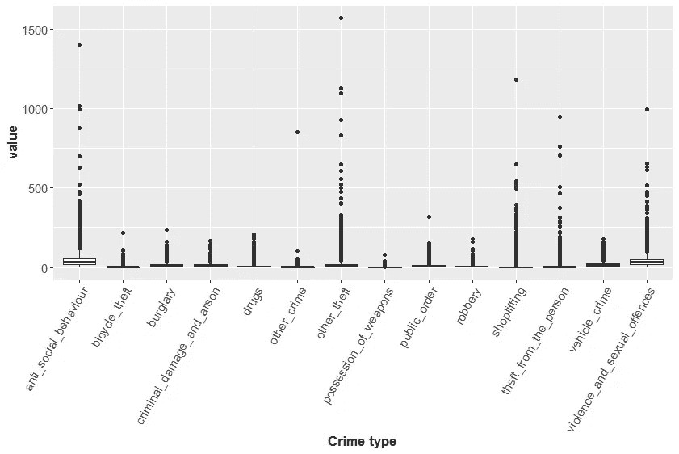
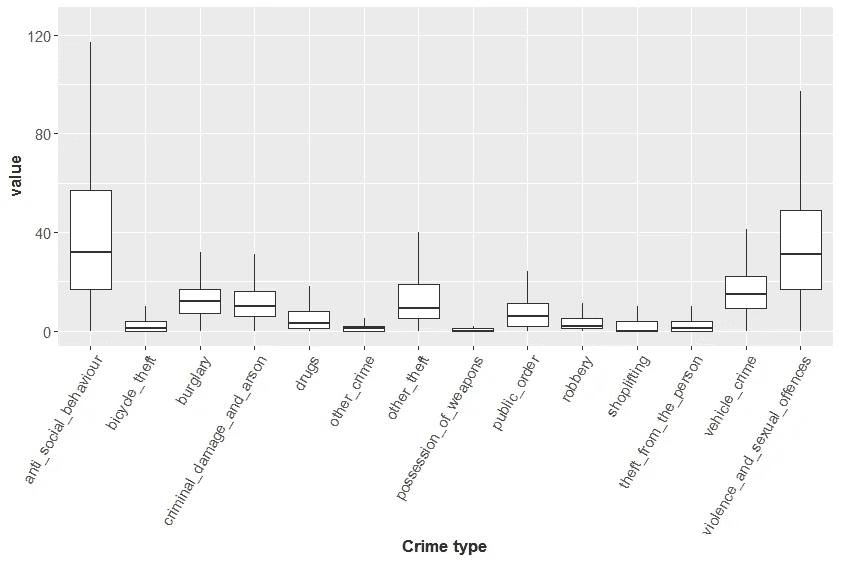
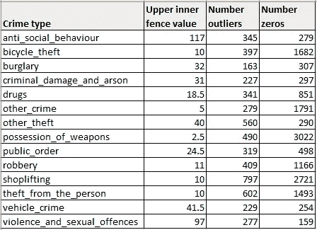
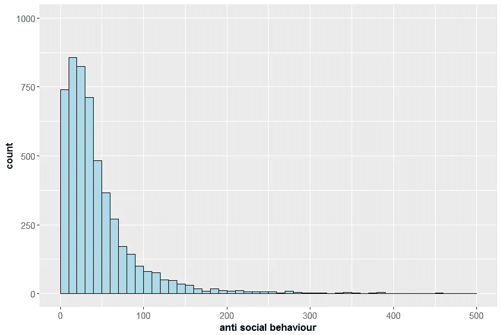
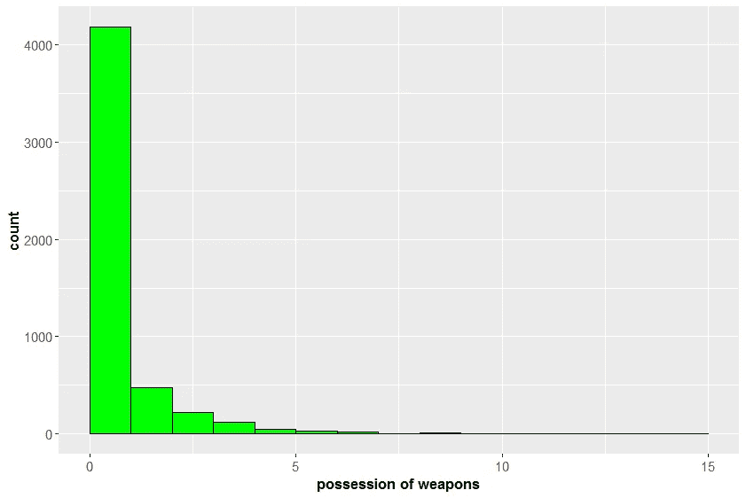
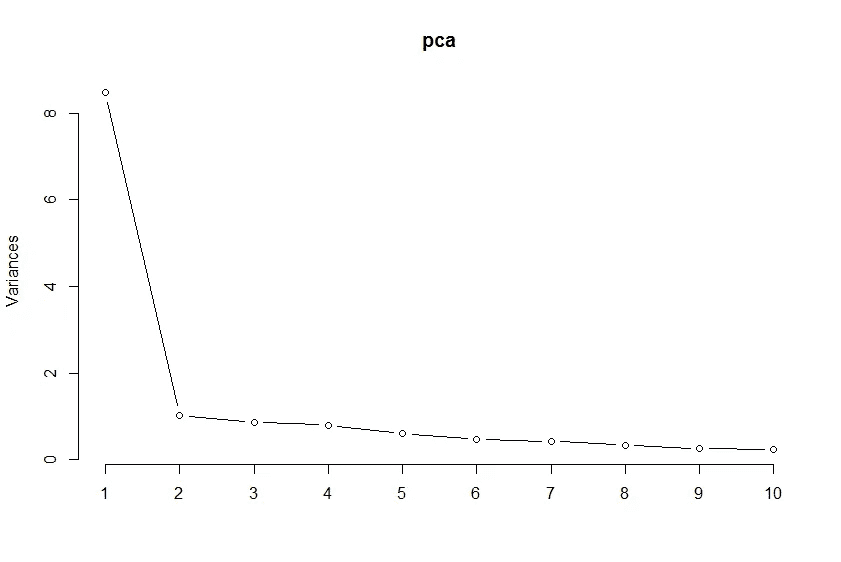
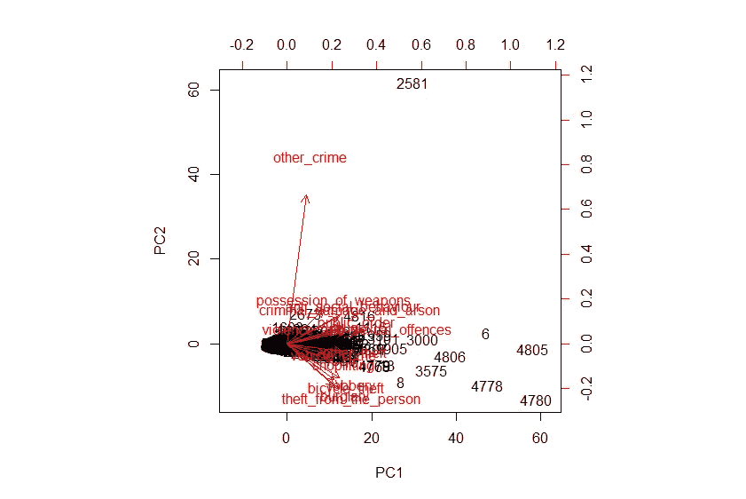
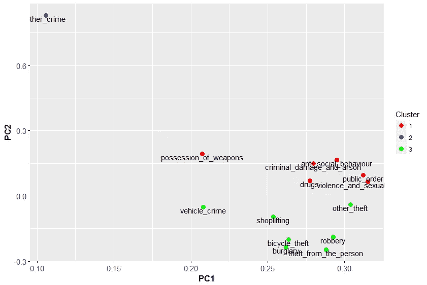
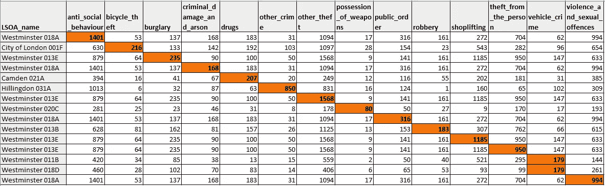

# 对伦敦不同类型犯罪之间关系的探索性数据分析

> 原文：<https://towardsdatascience.com/exploratory-data-analysis-into-the-relationship-between-different-types-of-crime-in-london-20c328e193ff?source=collection_archive---------2----------------------->

最近，我制作了一张地图，标出了伦敦警察局记录的 14 种不同类型的犯罪地点。这让我思考是否有某些类型的犯罪更有可能一起发生(例如，犯罪之间是否存在关系)。

我最初的假设是，因为我们正在处理犯罪问题，如果一个地区的犯罪率较高，那么该地区的所有类型的犯罪率通常都会较高，反之亦然。然而，我想更深入地探讨各种类型的犯罪之间的关系以及犯罪发生的地点。

大量的数据使得简单地使用我创建的[互动图](http://bike2bytes.com/shinyapp-london-crime-mapping.php)来直观地查看一些犯罪是否倾向于一起发生变得有点困难。

## 数据概述

本次分析中使用的数据与我在之前的帖子中使用的数据相同，只是这次我用纬度和经度变量替换了 LSOA(低层超级输出区域)名称定义的犯罪发生区域。这是因为我对每个犯罪事件的确切位置不感兴趣，而是对各种犯罪发生的区域感兴趣。不涉及太多细节，LSOA 是对较小地区的人口普查测量，基于从 1000 到 3000 的人口规模和从 400 到 1200 的家庭。更多信息可以在[国家档案馆网站](http://webarchive.nationalarchives.gov.uk/20160105160709/http://www.ons.gov.uk/ons/guide-method/geography/beginner-s-guide/census/super-output-areas--soas-/index.html)和[伦敦数据商店网站](http://londondatastore-upload.s3.amazonaws.com/instant-atlas/lsoa-atlas1/atlas.html)上找到。

根据数据集定义，总共有 5149 个 LSOA 地区在 2016 年经历了 14 种不同类型的犯罪中的至少一种。

## 方法

首先，我需要使用基本的描述性统计和可视化进行一些探索性分析，以提供对数据的总结和理解，并识别任何模式和特征。为了观察哪些犯罪可能一起发生，我设想使用 k-means 聚类来将这些特定的犯罪分组在一起。在进行聚类之前，我需要将数据的维度从 14 个变量(犯罪类型)减少到一个更容易解释和可视化的数量，同时仍然考虑所有类型的犯罪。为此，我选择使用主成分分析。

用于此分析的代码可以在 [Github](https://github.com/dmorison/eda-relationships-between-crime-london) 上找到。

## 第 1 部分:探索性数据分析

从对数据的基本总结开始，很明显，每种类型的犯罪都经历了非常广泛的发生率。14 种犯罪中有 5 种的第一个四分位数为 0，所有犯罪类型的最大值都显著高于各自的第三个四分位数。这可以通过创建 14 种不同类型犯罪的方框图来看出(图 1)。同样清楚的是，每项犯罪都有大量的异常值。因此，这个箱线图对于可视化每个犯罪的分布不是很有用，所以我为此创建了另一个没有异常值的箱线图(图 2)。

Figure 1: Box plot of the 14 different types of crime including all the data

Figure 2: Box plot of the 14 types of crime without the outliers

通过查看图 1，很难理解每种犯罪的大量异常值和零值，因此我计算了每种犯罪的内部上限值，然后确定有多少区域记录的发生率高于每种犯罪的内部上限值(即外部上限值)。这一点可以在表 1 中看到，其中有一栏列出了每种类型的犯罪都没有发生的地区的数量。

Table 1: List of the 14 types of crime and their respective upper inner fence value, the number of areas that recorded outliers and the number of areas that recorded zero incidences for any particular type of crime.

这现在开始提供数据的一些特征以及 14 种犯罪类型之间分布的差异。我们也越来越了解每起犯罪可以解释多少差异。我计算了每项犯罪的方差，其中“反社会行为”的方差最大，为 3437.2，而“持有武器”的方差最小，仅为 4.3。为这两个变量创建直方图可以更详细地解释它们的分布。

Figure 3: Histogram for anti social behaviour

Figure 4: Histogram for possession of weapons

可以看出，在 5149 个地区中，有 4000 多个地区的“拥有武器”发生率为零或为零。上表也证实了这一点，我们可以看出，这些值中的大多数实际上为零，因为“拥有武器”有 3022 个地区的发生率为零。

“反社会行为”在每个地区记录的事件数量中有更广泛的分布。从上表可以看出,“反社会行为”有 279 个零发生率区域，这少于上异常值的数量(345)。

## 第二部分:犯罪类型的关系

在对数据和数据中的某些特征有了更详细的理解之后，下一步是探索不同类型犯罪之间的关系。

人们可以从制作 14 种犯罪的相关矩阵开始。即使相关矩阵确定了某些类型的犯罪比其他类型的犯罪具有更高的相关性，也很难理解所有 14 种犯罪之间的这些关系。制作所有 14 种犯罪的散点图也很难解释。

在不涉及太多细节的情况下，主成分分析(PCA)因此可以用于将数据的维度减少到更少的成分，这将尽可能多地保留原始数据所表达的可变性。更少的组成部分将有助于描述原始变量之间的关系，方法是将它们投影到二维网格上，以便更容易地进行可视化，从中可以将相似类型的犯罪分组在一起。

PCA 结果提供了 14 个分量(等于变量的数量),分量的重要性可以通过每个分量所占方差的比例来确定。在该分析中，前两个成分分别占方差的 60%和 7%。第一个分量明显高于其余分量，总方差的 80%归因于前 4 个分量。这可以通过每个成分的累积方差比例的折线图来可视化(图 5)。

Figure 5: Proportion of variance explained by each component displayed showing the cumulative proportion of variance.

该图有助于确定保留用于分析的成分数量。很明显，第一个分量是最重要的分量，其后的分量所解释的差异量变化很小，因此在分析中只需要保留前两个分量。

最后，为了确定不同类型的犯罪之间的关系，可以使用前两个主要部分，使用双标图(图 6)进行直观解释。双标图显示代表每个变量的向量，这些向量远离原点，指向由前两个主成分分配给每个变量的值。它还包括分配给数据集中每个区域(5149)的两个组件的值，但是，此分析的重点更多地是变量(犯罪类型)的向量之间的关系。

Figure 6: Biplot representing the values assigned to the variables (crime types) and data points (areas) by the first two principal components.

解释该图时需要考虑的两个因素是矢量的长度和它们之间的角度。较长的向量意味着变量被图很好地表示，反之亦然。向量之间的角度大小决定了变量的相关性，这是实现此分析目标的理想指标。小角度表示强正相关，90 度表示不相关，180 度表示负相关。

由于拥挤，很难解释这一情节，但是，很明显，在比较“其他犯罪”与其他类型犯罪的关系时，“其他犯罪”似乎有点离群。可以生成分配给 14 种犯罪类型的前两个分量值的散点图，以便从双标图中更好地显示其他犯罪类型之间的关系。没有显示两个非常相似的图，一个单独显示散点图，另一个只添加了 K-means 聚类输出，我只是包含了后者(图 7)。

Figure 7: Scatter plot displaying the 14 different types of crime along with their respective clusters.

通过这个情节，各种类型的犯罪之间的关系开始变得更加明显。除了已经被确定为异常值并在此重申的“其他犯罪”之外，还有其他两个变量分组(1 和 3)。在群组 1 和群组 3 中，可以确定某些类型的犯罪比其他类型的犯罪具有更强的关联性。例如，在第一组中，“刑事破坏和纵火”、“反社会行为”、“毒品”、“公共秩序”和“暴力和性犯罪”被认为是密切相关的。而在群组 3 中，“自行车盗窃”、“入室盗窃”、“抢劫”和“偷窃他人”密切相关。

我没有深入分析这些犯罪发生的具体区域，因为我将违反这一分析的范围，所以我将把这一点留给另一篇文章，我制作了一个表格来查看每个犯罪发生率最高的区域。从表 2 中可以看出这一点，表中列出了各地区每种犯罪的发生率，突出显示的单元格代表该特定类型犯罪记录的最高数字。

Table 2: List of areas that had recorded the highest figure for each type of crime.

有趣的观察结果是，有两个地区(威斯敏斯特 018A 和威斯敏斯特 013E)记录了 4 种不同类型犯罪的最高发生率:

威斯敏斯特 018A -“反社会行为”、“刑事破坏和纵火”、“公共秩序”和“暴力和性犯罪”。

威斯敏斯特 013E -“入室盗窃”、“其他盗窃”、“入店行窃”和“偷窃他人财物”。

这些犯罪非常类似于前一情节中产生的集群中被确定为彼此相关的两组明显不同的犯罪类型。

## 结论

这篇文章开头列出的目标是深入挖掘 2016 年伦敦记录的不同类型的犯罪事件，并确定某些类型的犯罪之间是否存在任何关系。

这是通过一些探索性的数据分析方法进行分析的，以确定数据的特征，然后使用主成分分析来降低数据的维度，从而可以使用 K-均值聚类来可视化某些类型的犯罪之间的关系。

进行这一分析是因为我在以前的帖子中获得了一些好奇心，在那里我绘制了不同犯罪的地理位置。我已经开始考虑的下一步是探索不同地区的犯罪概况，并确定某些地区是否可能经历类似的犯罪，以及这些犯罪彼此之间的关系。