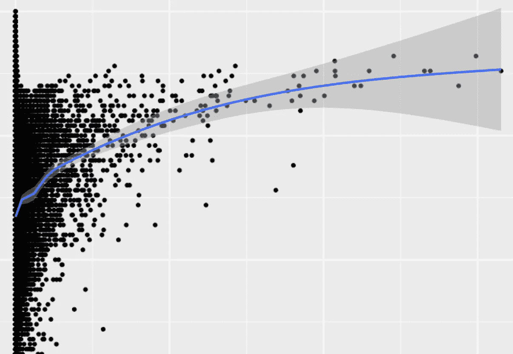

# 探索性数据分析(JHU 课程，课程 4)

> 原文：<https://towardsdatascience.com/exploratory-data-analysis-jhu-coursera-course-4-4a908e0d30d8?source=collection_archive---------0----------------------->

数据科学专业的第四门课程“探索性数据分析”还不错。没有开始任何建模有点令人沮丧，但课程的很大一部分是绘图，这是一项基本技能。一如既往，测验和作业的代码位于我的 [github](https://github.com/mGalarnyk/datasciencecoursera/tree/master/4_Exploratory_Data_Analysis) 上。

**第一周回顾:**分析图形和基本绘图系统的基础有点令人失望。测验看起来不太实用，但我希望第二周更实用。任务本身并不太糟糕。

Exploratory Data Analysis Quiz 1

Exploratory Data Analysis John Hopkins Project 1

**第二周回顾:**第二周远比第一周实用，因为它涉及到了 ggplot，这是 R 中主要的绘图库，在工业中广泛使用。小测验其实是让人理解 ggplot 的。

Exploratory Data Analysis Quiz 2 JHU Coursera

**第三周回顾:**终于！令人高兴的是，这种专门化正在进入广泛使用的层次聚类和 K-Means 聚类。不幸的是，没有测验来测试知识，也没有在课程的其他地方涉及。本周没有作业到期，所以这是一个很好的喘息机会。

**第 4 周回顾:**空气污染案例研究是一个非常好的项目，因为它让人们下载解压文件，对数据进行清理和聚合，绘制并导出 png 文件。

Exploratory Data Analysis Project 2 John Hopkins Coursera

请让我知道你是否有任何问题，或者如果你有任何关于我如何改进我的编码技巧！这个约翰·霍普斯金专业甚至帮助了我的工作。下一门课程“[可重复研究](https://medium.com/@GalarnykMichael/reproducible-research-jhu-coursera-course-5-ad0188bfc53b)”的复习已上线。