# 电子商务数据的探索性数据分析

> 原文：<https://towardsdatascience.com/exploratory-data-analysis-on-e-commerce-data-be24c72b32b2?source=collection_archive---------2----------------------->

## 发现不同客户和国家的有趣交易模式

([Source](https://unsplash.com/photos/ueZXMrZFFKQ))

一般的解释，数据科学无非是利用先进的统计和机器学习技术，利用数据解决各种问题。然而，更容易的是直接应用一些奇特的机器学习算法——瞧！你得到了预测——没有首先理解数据。

这正是**探索性数据分析(EDA)** (由[贾迪普·哈雷](https://medium.com/u/262a692865f0?source=post_page-----be24c72b32b2--------------------------------)定义)的[重要性所在，不幸的是，这是作为数据科学过程的一部分](https://www.upgrad.com/blog/exploratory-data-analysis-and-its-importance-to-your-business/)通常被低估的[步骤。](http://www.jeannjoroge.com/significance-of-exploratory-data-anaysis/)

EDA 如此重要(至少)有以下三个原因:

1.  确保业务利益相关者提出正确的问题——通常通过探索和可视化数据——并通过彻底的调查验证他们的业务假设
2.  发现数据中的任何潜在异常，以避免向机器学习模型输入错误的数据
3.  解释模型输出并测试其假设

这就是了。现在我们已经了解了 EDA 的**“什么和为什么”**方面，让我们一起检查一个数据集，并浏览**“如何”**，这将最终引导我们发现一些有趣的模式，我们将在下一节中看到。

我们将关注 EDA 的整体工作流程、可视化及其结果。关于技术参考，如果您想对代码有更详细的了解，请随时查阅 Kaggle 上的 [**我的笔记本。**](https://www.kaggle.com/admond1994/e-commerce-data-eda/notebook)

为了给出一个简要的概述，这篇文章分为以下 5 个部分:

1.  数据的上下文
2.  数据清理(又称数据预处理)
3.  探索性数据分析
4.  结果
5.  结论

让我们开始玩吧！

# 数据的上下文

[(Source)](https://unsplash.com/photos/0FRJ2SCuY4k)

在本帖中，我们将调查从 [Kaggle](https://www.kaggle.com/) 获得的[电子商务数据集](https://www.kaggle.com/carrie1/ecommerce-data)。在处理数据集之前，让我们试着理解它是什么，以便更好地理解它的上下文。

简而言之，数据集由来自不同国家的客户的**交易数据组成，这些客户从一家总部位于英国的在线零售公司购买独特的全场合礼品**。信息概述如下:

*   公司——总部位于英国并注册的无店铺在线零售
*   销售产品—主要是各种场合的礼品
*   客户—大多数是批发商(本地或国际)
*   交易期—**2010 年 12 月 1 日至 2011 年 12 月 9 日(一年)**

# 数据清理

[(Source)](https://unsplash.com/photos/oTvU7Zmteic)

我们都知道现实世界中的数据是混乱的(包括 Kaggle！)因此，让我们花一些时间将数据整理成我们需要的格式。下面是将数据集加载到 dataframe 后原始数据的快照。

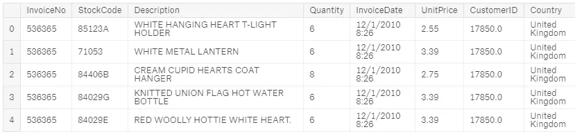

虽然变量(列名)听起来很直观，但让我们更进一步，理解每个变量的含义:

**invoice no*(invoice _ num)***:分配给每笔交易的编号
**stock code*(stock _ code)***:产品代码
**描述 *(description)*** :产品名称
**数量*(数量)*** :每笔交易购买的产品数量
**invoice date*(invoice _ date***

***注释→在我们的整个分析中，假设单位产品价格遵循相同的货币***

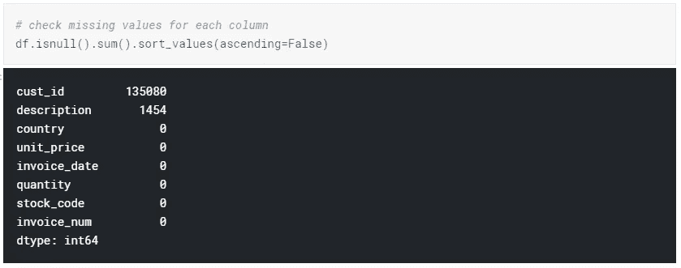

Check missing values

到目前为止，一切顺利。我们发现客户 ID 和描述中缺少一些值。因此，具有任何这些缺失值的行将被删除。

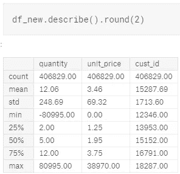

Descriptive statistic of data

通过以更具描述性的方式理解数据，我们注意到两件事:

1.  数量有负值
2.  单价有零值(自由项？)

有意思…

在这一阶段，我们将只删除具有负值的数量— [本笔记本](http://localhost:8888/notebooks/Desktop/Data%20Science/Kaggle/E-Commerce%20Data/customer-segmentation%20(BEST%20kernel).ipynb)解释了负值的含义—具有零值的单价将在后面的部分解释。

要计算每次购买的总花费，我们只需将数量乘以单价:

> 花费金额=数量*单价

最后，我们为每个事务添加几列，包括年、月、日和小时，供以后分析。最终的数据帧将如下所示:

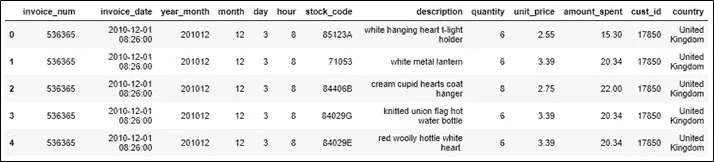

Final dataframe

# 探索性数据分析

[(Source)](https://unsplash.com/photos/Xbje8u5Yu2U)

## 订单数量和购买金额最高

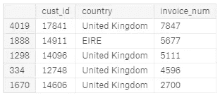

Top 5 customers with most number of orders

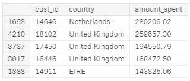

Top 5 customers with highest money spent

在电子商务世界中，我们经常想知道哪些客户——他们来自哪里——下的订单最多，花的钱最多，因为他们推动了公司的销售。

从结果中我们观察到，大多数订单都是在英国完成的，而荷兰顾客的购物金额最高。

## (每月)有多少订单？

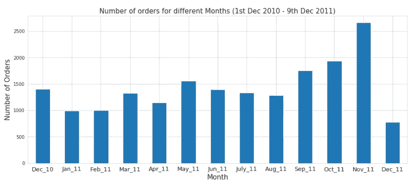

Number of orders for different months

总体而言，我们认为该公司在 2011 年 11 月收到的订单数量最多，因为我们没有 2011 年 12 月整月的数据。

## (每天)有多少订单？

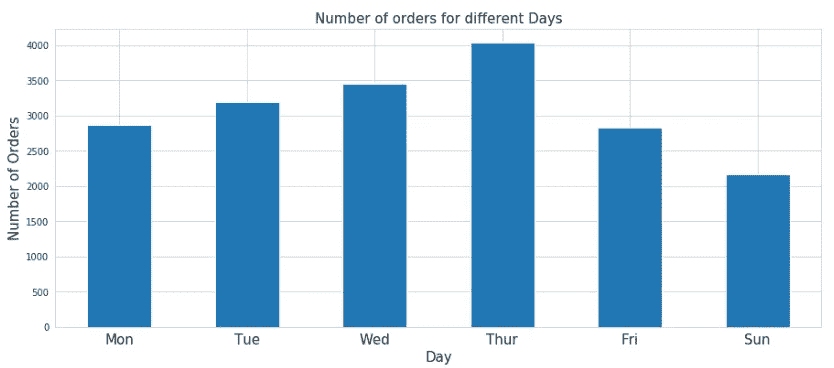

Number of orders for different days

令人惊讶的是，在整个期间(2010 年 12 月 1 日至 2011 年 12 月 9 日)，星期六没有任何交易。由于数据集及其上下文有限，后面的原因留待讨论。

我们还发现了一个趋势，即公司收到的订单数量从周一到周四趋于增加，之后减少。

## 多少订单(每小时)？

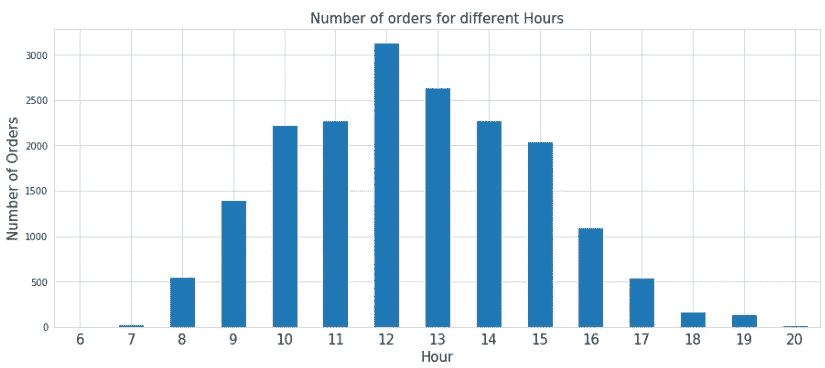

Number of orders for different hours

就时间而言，晚上 8:00 之后直到第二天早上 6:00 都没有交易。

此外，我们注意到该公司在中午 12:00 收到的订单数量最多。原因之一可能是因为大多数顾客在中午 12:00-2:00 的午餐时间购物。

## 发现单价的交易模式

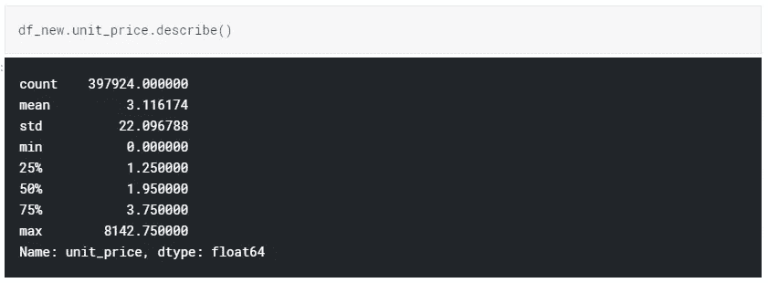

Descriptive statistics of Unit Price

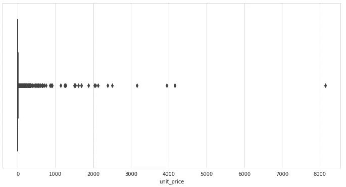

Boxplot for Unit Price

在我们将注意力转移到单价的零值(自由项)之前，我们制作一个[箱线图](https://medium.com/dayem-siddiqui/understanding-and-interpreting-box-plots-d07aab9d1b6c)来检查所有产品的单价分布。

我们观察到 75%的数据单价低于 3.75 美元，这表明大多数产品相对便宜。只有少数单位价格高(同样，我们假设每个单位价格遵循相同的货币)。

## 嗯……购买免费物品？是的，也许…

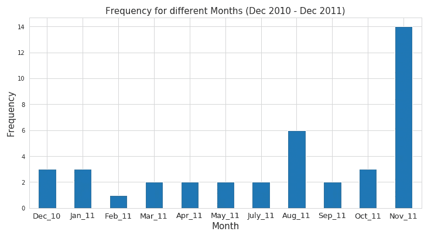

Frequency of giving out FREE items for different months

从剧情来看，公司倾向于**每个月不定期的免费发放购物品(2011 年 6 月除外)**。

然而，不清楚是什么因素促成了向特定顾客发放免费物品。可以做更深入的分析来进一步解释。如果你发现了背后的原因，请告诉我！😏

# 发现每个国家的交易模式

## 订单数量最多的前 5 个国家

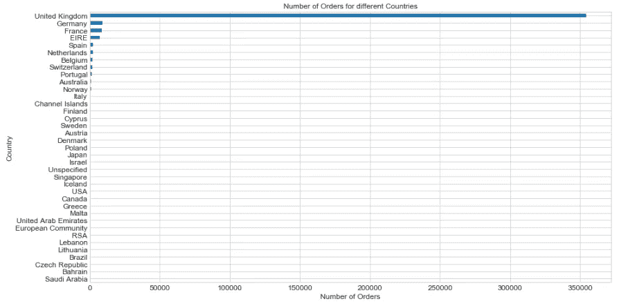

Number of orders in each country **(with UK)**

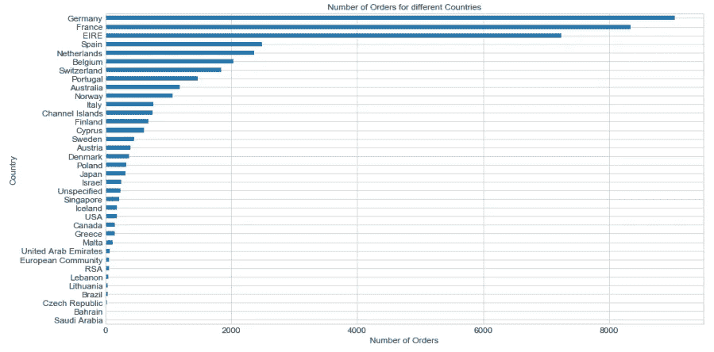

Number of orders in each country **(without UK)**

不出所料，该公司在英国获得的订单数量最多(因为它是一家总部位于英国的公司)。

为了更好地辨别趋势，为了更清楚地比较其他国家，英国被删除。因此，订单数量最多的前 5 个国家(包括英国)如下:

*   联合王国
*   德国
*   法国
*   爱尔兰
*   西班牙

## 花钱最多的前 5 个国家

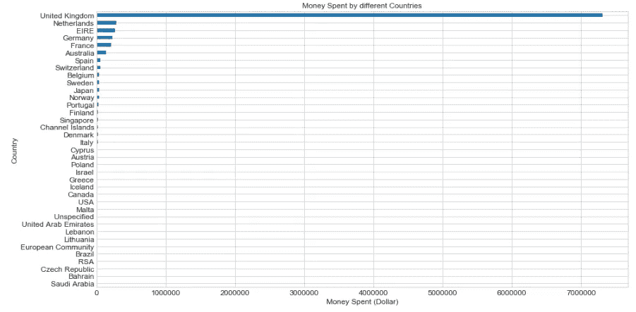

Total money spent by each country **(with UK)**

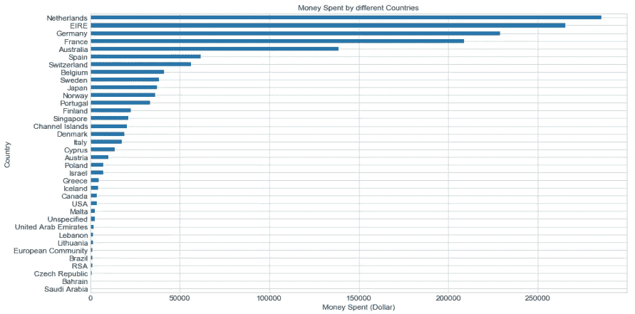

Total money spent by each country **(without UK)**

由于该公司从英国客户那里收到的订单数量最多，因此很自然地会看到英国客户的购物支出最多。

和以前一样，为了更清楚地比较其他国家，英国被删除。花钱最多的前 5 个国家(包括英国)如下:

*   联合王国
*   荷兰
*   爱尔兰
*   德国
*   法国

# 来自 EDA 的结果

1.  订单数量最多的**客户来自英国**
2.  购买金额最高的**客户来自荷兰**
3.  该公司从英国客户那里收到的订单数量最多(因为它是一家总部位于英国的公司)。因此，下单**数量**最多的**前 5 名国家**(包括英国)如下→ **英国、德国、法国、爱尔兰(EIRE)、西班牙**
4.  由于该公司从英国客户处收到的订单数量最多(因为它是一家总部位于英国的公司)，英国客户的采购支出最多。因此，**在购买**上花费最多**的前 5 个国家**(包括英国)如下→ **英国、荷兰、爱尔兰(EIRE)、德国、法国**
5.  **2011 年 11 月销量最高。**销售额最低的月份尚未确定，因为数据集包含截至 2011 年 12 月 9 日的交易
6.  从 2010 年 12 月 1 日到 2011 年 12 月 9 日，星期六没有交易
7.  公司收到的订单数量从周一到周四呈上升趋势，之后呈下降趋势
8.  公司在中午 12:00 收到的订单数量最多。可能大多数顾客都是在中午 12:00 到下午 2:00 的**午餐时间购买的**
9.  该公司倾向于每月不定期地发放免费购物品(2011 年 6 月除外)。然而，不清楚是什么因素促成了向特定顾客发放免费物品

# 结论

[(Source)](https://unsplash.com/photos/73OZYNjVoNI)

厉害！

通过对数据集执行 EDA，我们发现了一些有趣的结果。当然，结果不止于此。它们总是可以用来验证业务假设(如果有的话)，并解释机器学习模型的输出等等！

记住。做 EDA 的时候创意是你的极限。这真的取决于你对商业的理解，提出有趣问题来挑战和验证假设的好奇心，以及你的直觉。

感谢您的阅读。希望通过展示 EDA 的整体工作流程、可视化及其结果，EDA 将变得不那么让你害怕，并且你将更有兴趣在下一次弄脏你的手。

一如既往，如果您有任何问题或意见，请随时在下面留下您的反馈，或者您可以随时通过 LinkedIn 联系我。在那之前，下一篇文章再见！😄

## 关于作者

[**Admond Lee**](https://www.linkedin.com/in/admond1994/) 目前是东南亚排名第一的商业银行 API 平台 [**Staq**](https://www.trystaq.com) **—** 的联合创始人/首席技术官。

想要获得免费的每周数据科学和创业见解吗？

你可以在 [LinkedIn](https://www.linkedin.com/in/admond1994/) 、 [Medium](https://medium.com/@admond1994) 、 [Twitter](https://twitter.com/admond1994) 、[脸书](https://www.facebook.com/admond1994)上和他联系。

 [## 阿德蒙德·李

### 让每个人都能接触到数据科学。Admond 正在通过先进的社交分析和机器学习，利用可操作的见解帮助公司和数字营销机构实现营销投资回报。

www.admondlee.com](https://www.admondlee.com/)