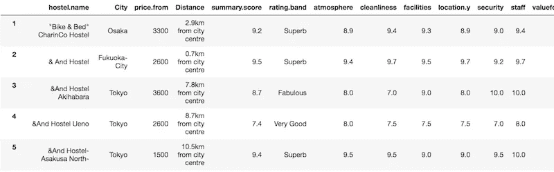
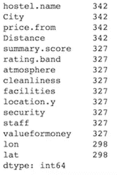
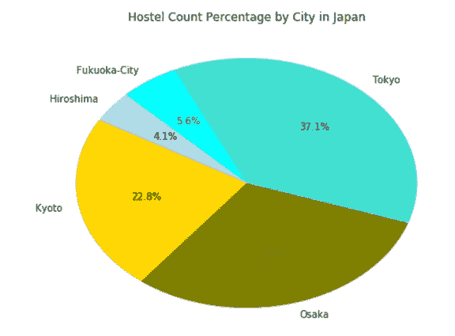
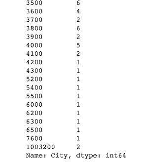
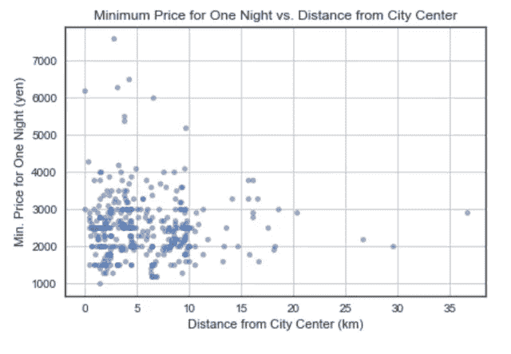
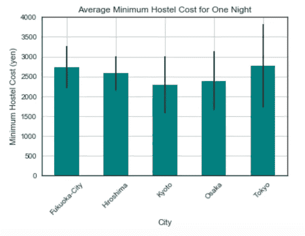
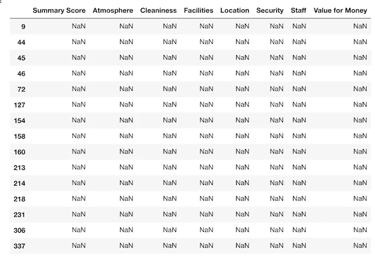
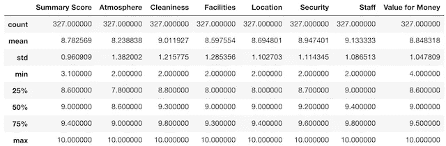
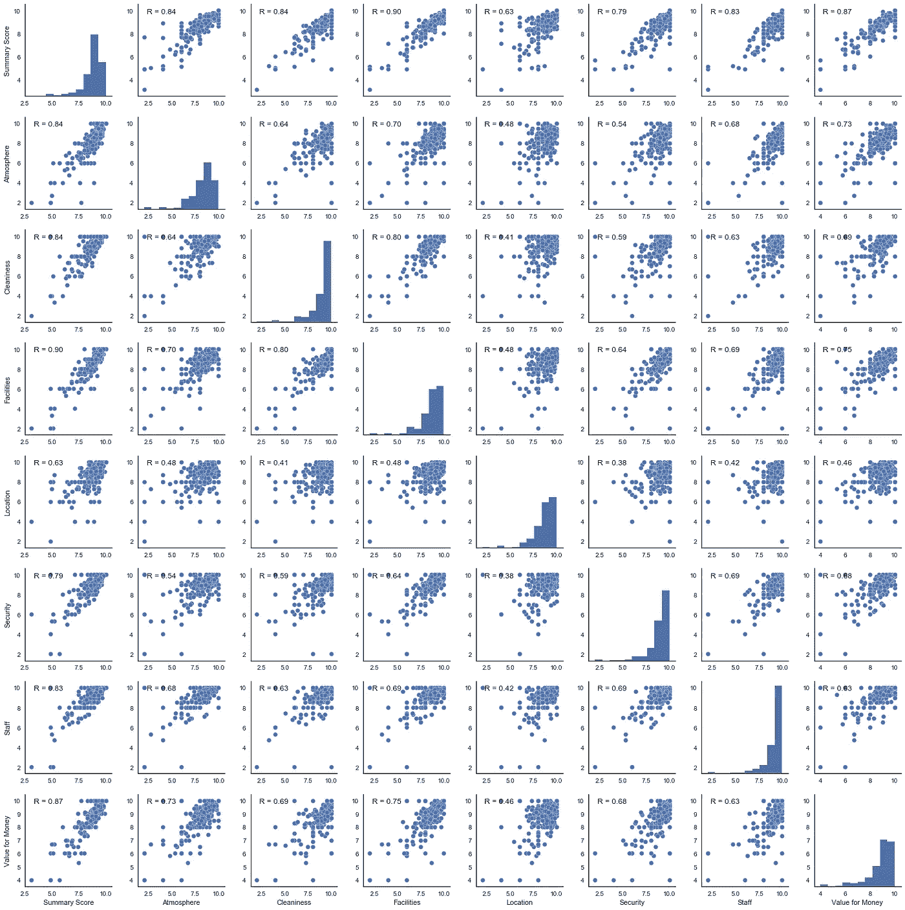
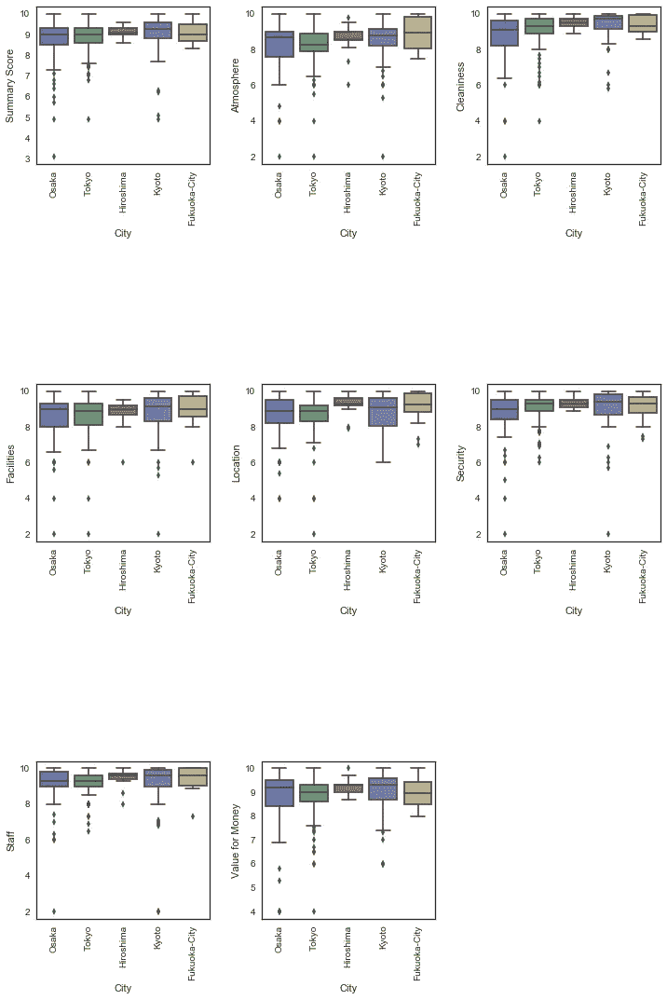

# 使用 Python 对日本旅舍进行探索性数据分析

> 原文：<https://towardsdatascience.com/exploratory-data-analysis-on-hostels-in-japan-using-python-ef23da010584?source=collection_archive---------10----------------------->


Photo by [Andre Benz](https://unsplash.com/@trapnation?utm_source=medium&utm_medium=referral) on [Unsplash](https://unsplash.com?utm_source=medium&utm_medium=referral)

作为一个热爱旅行却又未能再次赢得破纪录的彩票的人(我正瞪着你这个南卡罗来纳州的中奖者)，在旅行中找到省钱的方法是至关重要的。对于预算有限或只想体验传统酒店之外的不同体验的旅行者来说，招待所是一个令人惊叹的、负担得起的住宿选择。在与几个人交谈后，令我惊讶的是，有这么多资金有限的人没有住旅馆，甚至没有考虑过。

受到这些对话和我自己最近旅行的启发，我为我的第一篇媒体博客文章进行了一项关于日本旅馆的简单研究。我使用的数据集是 Koki Ando 从 Hostelworld 网站上搜集的，可以在 Kaggle 上找到。

# 数据清理和基本可视化

今年早些时候，我参加了一个编码训练营课程，以将我的职业生涯过渡到数据分析，我的导师说，几乎总结了我所有未来数据项目的一件事是，数据科学是 *80%的数据清理和 20%的分析*。这个项目就是如此。让我们从导入我们的依赖项并读取 CSV 文件作为 pandas 数据帧开始。

```
# Dependencies
import pandas as pd
import matplotlib.pyplot as plt
from scipy import stats
import seaborn as sns
from wordcloud import WordCloud# Read CSV file
hostels_df = pd.read_csv("../raw_data/Hostel.csv", index_col=0)
hostels_df.head()
```



在处理新数据集时，我喜欢做的第一件事就是检查缺失值并查看列名。

```
# Check for missing values and column names
hostels_df.count()
```



Number of existing values for each column

为了可读性，我们将继续重命名这些列，这对我们的第一对可视化来说应该足够了。

```
# Rename column names
hostels_df.columns = ["Hostel Name", "City", "Min. Price for One Night (yen)", "Distance from City Center", "Summary Score", "Rating", "Atmosphere", "Cleaniness", "Facilities", "Location", "Security", "Staff", "Value for Money", "Longitude", "Latitude"]
```

让我们用柱状图和饼状图来看看每个城市有多少旅舍。

```
# Get hostel count for each city
city_group = hostels_df.groupby("City").count()# Reset index
city_group = city_group.reset_index()# Create new dataframe for city name and hostel count
city_group = city_group[["City", "Hostel Name"]]# Rename columns
city_group.rename(columns={"Hostel Name": "Hostel Count"}, inplace=True)# Create bar chart for hostel count by city
city_bar = city_group.plot.bar(x="City", y="Hostel Count", rot=90, legend=None, color="teal", zorder=3)
plt.grid(which="major", axis="y", zorder=0)
plt.xticks(rotation=45)
plt.title("Hostel Count by City in Japan")
plt.ylabel("# of Hostels")
```


```
# Create pie chart for hostel count by city
hostel_count = city_group["Hostel Count"]
colors = ["aqua", "lightblue", "gold", "olive", "turquoise"]
city_labels = city_group["City"]
plt.figure(figsize=(8,6))
plt.pie(hostel_count, labels=city_labels, colors=colors, startangle=115, autopct="%1.1f%%")plt.title("Hostel Count Percentage by City in Japan")
```



大多数旅馆位于东京、大阪和京都，这并不奇怪，因为这些城市是日本的顶级旅游目的地。超过三分之一的旅舍位于东京，大约三分之二的旅舍位于东京和大阪。

人们普遍认为，越靠近市中心的酒店和 Airbnb 房源越贵，尤其是在热门旅游目的地。让我们通过创建一个散点图来看看这是否也适用于这些旅馆。需要进一步清理数据，因为我们只需要距离列中的数值，然后数据集中的所有数值都必须转换为浮点数。

```
# Use split to obtain numeric value from distance column
hostels_df["Distance from City Center (km)"] = hostels_df["Distance from City Center"].str.split("km").str[0]# Change all numeric values to integer/float data types
hostels_df.apply(pd.to_numeric, errors="ignore")hostels_df[["Distance from City Center (km)"]] = hostels_df[["Distance from City Center (km)"]].apply(pd.to_numeric)
```

如果我们现在使用数据集绘制散点图，图表的尺寸将非常大...关了。让我们调查一下这里发生了什么。

```
# Check value count for each unique value for minimum price column
hostels_df.groupby(["Min. Price for One Night (yen)"]).count()["City"]
```



两家旅馆的最低价格是 1003200 日元(8965.40 美元)一个晚上…让我想一想。这些值是偏离旅馆价格分布的异常值。由于这两个异常值具有相同的值，而且值高得令人怀疑，因此有理由假设某个数字是无意中刮出来的价格值。去除这些异常值是合适的。

```
# Remove outlier
hostels_reduced = hostels_df[hostels_df["Min. Price for One Night (yen)"] < 8000]
```

我们现在可以继续创建散点图。

```
# Create scatter plot
hostels_reduced.plot.scatter("Distance from City Center (km)", "Min. Price for One Night (yen)", alpha=0.6)
plt.tight_layout()
plt.title("Minimum Price for One Night vs. Distance from City Center")
plt.grid()
```



令人惊讶的是，在靠近市中心的地方，有很多价格较低的旅馆。似乎离市中心的距离并不是影响旅馆价格的重要因素。现在，让我们快速看一下每个城市的平均成本和价格分布。

```
# Obtain the mean and standard deviation (STD)
price_mean = hostels_reduced.groupby(["City"]).mean()["Min. Price for One Night (yen)"]
price_std = hostels_reduced.groupby(["City"]).std()["Min. Price for One Night (yen)"]# Create new dataframe for mean values
mean_df = pd.DataFrame({"City":price_mean.index, "Price Mean (yen)":price_mean.values})
mean_df = mean_df.set_index("City")# Create bar chart with y error bar 
mean_df.plot(kind="bar", yerr=price_std.values, color="teal", legend=None)
plt.xticks(rotation=45)
plt.grid()
plt.title("Average Minimum Hostel Cost for One Night")
plt.ylabel("Minimum Hostel Cost (yen)")
```



正如我们在这里看到的，在所有列出的日本城市中，旅馆每晚的平均最低费用约为 2500 日元(22.43 美元)，其中东京的价格分布差距最大。

# 缺失数据和宿舍评级分析

很明显，这些旅馆并不贵，但我们现在必须问问自己，即使价格合理，它们是否真的值得入住。幸运的是，这个数据集包括入住过的顾客对每家旅馆不同类别的平均评分。

为了进行这种额外的分析，我们必须克服每个数据分析师、数据科学家、数据工程师等的障碍。面，那就是**缺失的数据**。有几种方法来处理丢失的数据，有许多博客文章和文章涉及这个主题(我最近读了一篇我喜欢的文章，是这个[的一篇](/how-to-handle-missing-data-8646b18db0d4))。当我们之前检查缺失值时，我们可以看到所有具有评级分数的列都缺失相同数量的值。根据这一观察，我们*可以*假设当一家旅馆缺少一个评级分数时，那么它就缺少所有的分数。但是，我们仍然应该仔细检查，看看丢失的值在哪里。

```
# Create new data frame for hostel rating analysis and view # of missing data
score_df = hostels_df.loc[:, "Summary Score":"Value for Money"]
score_df = score_df.drop(["Rating"], axis=1)# Create new data frame that only returns rows with missing values
null_df = score_df[score_df.isnull().any(axis=1)]
```



正如这里看到的，我们最初的假设是正确的。我们知道丢失的值在哪里，现在我们需要决定如何处理它们。为了帮助确定如何处理丢失的数据，我们可以使用 pandas 的 describe 函数为我们提供数据框的基本统计数据的快照。

```
# Generate descriptive statistics for data frame to help determine what to do with missing data
score_df.describe()
```



由于分布变化不大，只有一小部分数据集丢失数据，因此删除丢失数据的行不会对后续分析产生太大影响。

```
# Drop missing values
score_df = score_df.dropna().reset_index(drop=True)
```

现在我们可以继续我们的可视化和分析。要查看不同评级类别之间的关系，我们可以使用从 Seaborn pairplot 模块生成的 Pearsons R 分数。

```
# Use seaborn package to find pairwise relationships in dataset
def corrfunc(x, y, **kws):
    r, _ = stats.pearsonr(x, y)
    ax = plt.gca()
    ax.annotate("R = {:.2f} ".format(r), 
                xy=(0.1, 0.9), xycoords=ax.transAxes)

g = sns.pairplot(score_df)
g.map_lower(corrfunc)
g.map_upper(corrfunc)
```



氛围、清洁度、设施和性价比是与汇总分数正相关度最高的类别，对汇总分数的正面影响最大。接下来，让我们创建箱线图，按城市分析旅舍评级。

```
# Create Seaborn boxplots
fig = plt.figure(figsize=(12,18))
fig.subplots_adjust(hspace=1.4, wspace=0.3)
for idx, col in enumerate(city_analysis.columns[3:11]):
    fig.add_subplot(3, 3, idx+1)
    sns.boxplot(x=city_analysis["City"], y=city_analysis[col], data=city_analysis)
    plt.xticks(rotation=90)
```



广岛旅馆的评分紧密分布在平均值附近，这意味着这些旅馆具有最一致的分数。这一数据表明，广岛的旅舍为旅行者提供了最一致的服务和体验。

# 结论

很明显，日本的旅馆是一个不容忽视的旅游住宿选择。他们离市中心很近，成本低，物有所值，顾客满意，这些都是任何旅行者值得考虑的理由，无论他们是否在预算之内。为了完成这一数据探索，我使用旅行者给出的评价旅馆的形容词生成了一个词云。

```
# Create list from column values
rating_list = hostels_df["Rating"].tolist()# Convert list to one big string
rating_list = " ".join(rating_list)# Create word cloud
wordcloud = WordCloud().generate(rating_list)
wordcloud = WordCloud(background_color="white", max_words=len(rating_list), max_font_size=100, relative_scaling=0.5).generate(rating_list)
plt.figure()
plt.imshow(wordcloud, interpolation="bilinear")
plt.axis("off")
```


请随时通过我的联系人留下您的意见和反馈。旅行愉快。

参考资料:

1.  [日本旅社 Kaggle 数据集](https://www.kaggle.com/koki25ando/hostel-world-dataset)
2.  [该 EDA 的个人 Github 库](https://github.com/lenatran/japan_hostels)