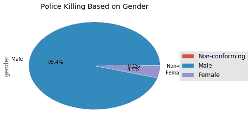
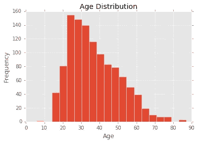
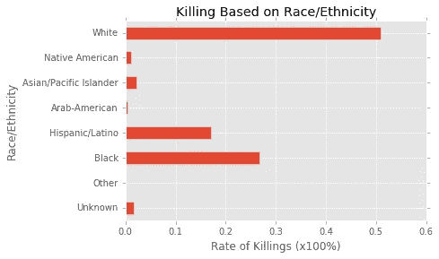
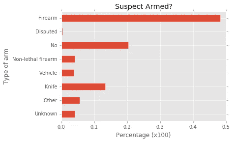
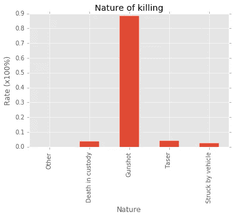
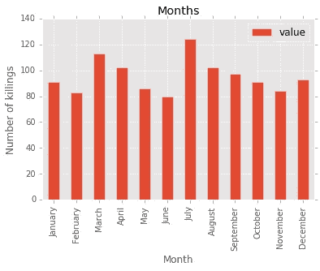
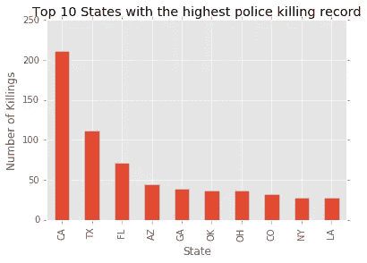
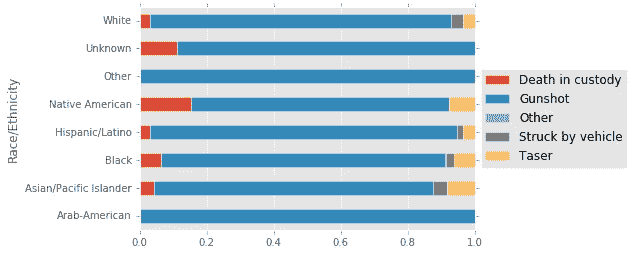

# 探索性数据分析:2015 年美国警察杀人可视化。

> 原文：<https://towardsdatascience.com/exploratory-data-analysis-visualizing-police-killings-in-the-u-s-in-2015-2cb5122c6cbe?source=collection_archive---------1----------------------->

> [The Counted 是《卫报》的一个项目，旨在统计 2015 年和 2016 年美国被警察和其他执法机构杀害的人数，监测他们的人口统计数据，并讲述他们是如何死亡的故事。这些数据可以在 kaggle.com 下载。](https://www.kaggle.com/the-guardian/the-counted)

# **简要描述:**

该数据共包含 1146 个观察值——2015 年美国警察杀人事件的*受害者——以及每个受害者的共 14 个特征——*属性。**

每个受害者的特征记录如下…

1.  id :给每个受害者的唯一号码
2.  **姓名**:受害者姓名
3.  **年龄**:受害者的年龄
4.  **性别**:受害者的性别
5.  **种族/民族**:受害者的种族/民族
6.  **武装**:受害者有武装吗？如果是，什么类型的手臂？
7.  **月**:事件发生的月份
8.  **日**:事件发生的当天。
9.  **年**:事件发生的年份(2015 年)
10.  **街道地址**:发生杀人事件的街道
11.  城市:杀戮之城
12.  **状态**:事件发生的状态
13.  **经度**:杀戮的经度(坐标)
14.  **纬度**:杀戮的纬度(坐标)
15.  **分类**:受害者的死因，即枪击/车辆
16.  **执法机构**:负责攻击的办公室

# 可视化:

性别:毫不夸张地说，在美国，大多数被警察杀害的受害者都是男性，因为这占了所有记录数据的 95%以上。

**年龄分布:**年龄呈长尾正态分布，25-35 岁年龄组出现次数最多。

0-10 之间的小酒吧是杰里米·马迪斯，一个 6 岁的男孩，他没有武装，在 2015 年 11 月被枪杀。他是“白人”,负责谋杀的执法机构是洛杉矶第二区执法官。

种族/民族:被杀的‘白人’比所有其他民族/种族加起来还多。2015 年，超过 50%被美国警察部队杀害的人是白人，阿拉伯裔美国人记录的受害者人数最少，不到记录的总数据的 1%。

**嫌犯持有武器？:**超过 50%的受害者持有枪支或刀具。超过 30%的记录数据没有使用火器，或者使用了非致命火器，或者不知道他们是否携带武器。

**死亡性质**:几乎 90%的受害者都是被枪杀的，死因和死亡性质都很清楚。其他形式有:羁押期间死亡，被车辆、泰瑟枪和其他物体击中(不到 1%)。

**每月杀戮:**杀戮在 7 月份达到顶峰，有超过 125 名受害者，在 6 月份达到最低点，有 80 名受害者。

**各州的杀人事件:**在记录在案的 51 个州中，有 10 个州的杀人事件超过 50%，其中加利福尼亚州以 211 起记录在案的事件高居榜首，占总数据的 18.4%。

**基于武器的种族/民族**:这显示了基于武器杀死每个民族的比率。

几乎 50%被杀的“白人”携带枪支，而阿拉伯裔美国人携带枪支的受害者比例最低。此外，不到 30%的阿拉伯裔美国人被枪杀。

**基于种族/民族的死亡性质**:正如我之前所说，几乎 90%的受害者是被枪杀的。所有记录在案的阿拉伯裔美国人都是被枪击致死的，这是唯一一个 100%死亡的群体。美洲原住民在羁押中死亡的比例最高，亚太裔被泰瑟枪致死的比例最高。请注意，这些比率是相对于每组记录的总数而言的。

2015 年美国警察杀人的探索性数据分析到此结束。

数据和代码可以从[github.com](https://github.com/princeede/the_counted2015/blob/master/the_counted2015.py)下载。

留下你的评论、问题和你想让我添加到帖子中的内容，别忘了推荐。

干杯

Ede