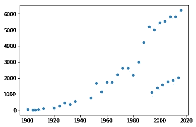
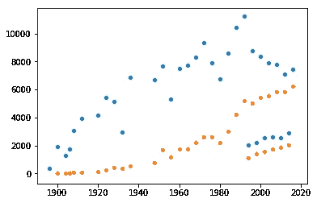

# 使用熊猫的真实数据集的探索性统计数据分析

> 原文：<https://towardsdatascience.com/exploratory-statistical-data-analysis-with-a-real-dataset-using-pandas-208007798b92?source=collection_archive---------4----------------------->

Your Data Science journey has just begun. source: [Pixabay](https://pixabay.com/en/jogging-run-sport-jog-sporty-race-2343558)

有时候，当面临一个数据问题时，我们必须首先深入数据集并了解它。它的属性，它的分布——我们需要沉浸在这个领域中。

今天我们将利用 [Python 的 Pandas 框架](http://www.datastuff.tech/data-science/exploratory-data-analysis-with-pandas-and-jupyter-notebooks/)进行数据分析，利用 Seaborn 进行数据可视化。

作为一个审美感很差的极客程序员，我发现每当我需要理解某个观点时，Seaborn 都是一个非常棒的可视化工具。

它在幕后使用 Matplotlib，但用默认的样式值设置图形，使它们看起来比我能做的漂亮得多。我们将查看一个数据集，我将尝试让您直观地了解如何查看不同的要素。谁知道呢，也许我们真的会从中得到一些启示！

## 没有鸡蛋就做不成煎蛋卷:数据集。

在这个分析中，我使用了 [120 年奥运](https://www.kaggle.com/heesoo37/120-years-of-olympic-history-athletes-and-results#athlete_events.csv)数据集，你可以点击链接下载或阅读更多信息。

我从 Kaggle 免费下载了它，如果你需要一个数据集来尝试一些新的机器学习算法，温习一些框架的 API，或者只是找点乐子，这是一个很棒的网站。

我将只使用“运动员事件”CSV 文件，该文件包含自 1900 年以来每届奥运会上的每名参赛者，以及他们的出生国、是否获得奖牌等。

一个有趣的事实是，*奖牌*栏有 85%是空的，所以平均来说只有大约 15%的奥运会运动员真正拿到了奖牌。除此之外，一些运动员还获得了不止一枚奖牌，这表明，在已经很少的奥运级别运动员中，有更少的人真正获得了奖牌。更值得称赞的是他们！

## 开始分析:数据集是什么样的？

首先，在我试图收集任何见解之前，我想对数据集有一个更好的直觉。有多少数据丢失了？有多少不同的列？我喜欢从这些问题开始。

我使用 Jupyter 笔记本进行分析，但是我将为我运行的每一行相关代码添加代码片段，以便您能够理解。

尽管如此，我还是在这个库中提供了这个笔记本[,以防你自己想看一眼，想有一个起点。](https://github.com/StrikingLoo/Olympics-analysis-notebook/)

我首先要做的是加载熊猫的数据，并检查它的大小。

在本例中，数据集有 15 个不同的列，总共 271116 行！超过 27 万运动员！不过，我想知道实际上有多少不同的运动员。还有，他们中有多少人真的获得了奖牌？

为了检查这一点，我将首先列出对数据集调用“list”函数的数据集的行。我看到我们有许多有趣的特点。

我能想到的一些事情是，我们可以看看奥运会运动员的平均身高和体重，或者按照运动项目来划分。我们也可以看到这两个变量的分布取决于性别。我们甚至可以看到每个国家获得了多少奖牌，以及整个二十世纪文明的兴衰。

可能性是无限的！但首先让我们解决一些难题:我们的数据集有多完整？

对一个序列使用 Pandas 的计数方法，我可以得到非空行的数量。但是查看 shape 属性，我实际上可以看到行的总数，不管它们是否为空。

之后就是减法和除法的问题了。我们看到只有四栏是不完整的:身高、体重、年龄和奖牌。

任何时候运动员没有真正赢得奖牌，奖牌都是不完整的，所以它不会太满。然而，在体重、身高和年龄方面，我们面临着相当大的挑战。

我试图按不同年份过滤这些数据，但随着时间的推移，不完整性似乎是一致的，这使我认为可能有几个国家不提供这些关于他们运动员的数据。

## 开始我们的实际分析:奖牌是怎么回事？

关于这个领域，我们问的第一个问题是，自 1900 年以来，有多少人真正获得了奖牌？以下片段回答了这个问题:

正如你所看到的，在过去的 120 年里，几乎有 135，000 名不同的人参加了奥运会的比赛，但是只有 28，000 多一点的人至少获得了一枚奖牌。

这大约是五分之一，还不算太糟。然而，一旦你考虑到许多人实际上在不止一个类别中竞争，这就不那么乐观了。

现在我们来看看，在这 120 年中，我们实际上获得了多少枚奖牌？

不出所料，奖牌分布几乎是一致的:获得的金牌、银牌和铜牌数量几乎相同。

然而，总共颁发了近 39，000 枚奖牌，这意味着如果你属于获得任何奖牌的前 20%的运动员，你平均应该获得不止一枚奖牌。

按国家分配呢？为此，我们将运行以下代码片段:

使用该函数，我们可以获得某个国家获得的每种类型的奖牌数量，而通过获取熊猫头像数据帧，我们可以看到获得奖牌最多的国家。

有趣的是，第二个获得更多奖牌的国家仍然是苏联，尽管它已经不存在近 20 年了。

在所有类别中，第一名是美国，第三名是德国。我还调查了我的两个国家阿根廷和克罗地亚，惊讶地发现克罗地亚已经获得了 58 枚金牌，尽管它从 1991 年才出现(奥运会年份是 1992 年)。

找到一个脚本来获取一个国家参加奥运会的不同年份将作为读者的一个练习——我打赌你可以做到这一点！

## 女性参与

我想到的另一件有趣的事情是，在整个世纪的奥运会中，女性代表是什么样的？这个片段回答了这个问题:

我很惊讶地看到女性早在 1900 年就开始参加奥运会了。然而，从历史上看，奥运会上每有一名女性，就有三名男性。对 1900 年女性参加奥运会感到惊讶，我决定随时核查她们的人数。我终于用了 Seaborn！

我们可以看到，在过去的几十年里，女性的参与率一直在快速上升，从几乎为零开始，到数千人。然而，她们的参与率真的比男性增长得快吗？或者这仅仅是世界人口的问题？为了解决这个问题，我制作了第二张图表:

Female participation (Orange) vs male (Blue) over time.

这一次我们可以清楚地看到一种模式是如何出现的:女性实际上正在以绝对的数量接近男性！另一件有趣的事情出现了:看到下面右边的那些小点了吗？我想那是冬季奥运会！无论如何，女性代表的情况看起来相当乐观，尽管还没有哪一年女性参与者多于男性。

## 杂集分析:身高和体重

我花了很长时间查看身高和体重图表，但没有收集到任何有趣的结论。

*   对于大多数运动来说，两者都是明显的正态分布
*   在我检查过的所有运动项目中，男性总是比女性更重更高
*   唯一有趣的变化似乎是一种性别与另一种性别的差距有多大，这取决于运动。

如果你有任何有趣的想法可以用体重和身高来分析，请告诉我！我还没有足够深入地按每项运动进行分组，因此可能会有一些见解。今天就到这里，我希望你对这个分析感兴趣，或者至少你了解了一些关于熊猫或数据分析的知识。

我在 GitHub 上提供了这个笔记本，这样你就可以分叉这个项目，做你自己的分析，然后做一个拉取请求。

你当然可以把所有的功劳都拿走！希望你在图表和视觉效果方面比我强。

[*第二部关于体育的真知灼见*](/olympics-kaggle-dataset-exploratory-analysis-part-2-understanding-sports-4b8d73a8ec30) *已经有了。*

*有一本 O'Reilly 的书我很喜欢，当我开始我的数据科学之旅时，我发现它非常有用。用 Python* *从零开始叫* [*数据科学，大概也是我得到这份工作的一半原因。如果你读到这里，你可能会喜欢它！*](https://www.bookdepository.com/book/9781491901427/?a_aid=strikingloo&chan=ws)

*请考虑* [*用一点点捐款支持我的写作习惯*](https://www.buymeacoffee.com/strikingloo) *。*

*如果您还没有，请关注我的 Medium 和*[*Twitter*](http://www.twitter.com/strikingloo)*以获取更多针对软件开发人员和数据科学家的教程、提示和技巧。*

如果你真的喜欢这篇文章，就和朋友分享吧！

*也可上*[*www . data stuff . tech*](http://www.datastuff.tech/data-analysis/exploratory-data-analysis-pandas-seaborn/)*。*