# 探索原始数据并从中获取价值:Splunk 简介

> 原文：<https://towardsdatascience.com/explore-and-get-value-out-of-your-raw-data-an-introduction-to-splunk-e5cb94c0855e?source=collection_archive---------8----------------------->

您刚刚接触了一些原始数据文件(json、csv 等)。现在会发生什么？你如何理解它？

你打开一个控制台，开始使用 less、grep、jq 等工具。开始的时候很棒，但是…除了基本的，很难做更多的事情。

这听起来熟悉吗？太好了！请继续阅读，了解 Splunk 如何帮助您。

# 安装 Splunk 企业版

让我们从在您的计算机中安装 Splunk Enterprise 开始。安装 Splunk 非常简单，安装包几乎适用于所有平台:OSX/Linux/Windows。在此下载软件包[，并按照安装说明进行操作。](https://www.splunk.com/en_us/download/splunk-enterprise.html)

Splunk *企业*？但是...它有免费许可证吗？是啊！

> **指标 500 MB/天**。(…)60 天后，您可以转换为永久免费许可证或购买 Splunk 企业许可证，以继续使用专为企业级部署设计的扩展功能。”
> 
> [https://www . splunk . com/en _ us/download/splunk-enterprise . html](https://www.splunk.com/en_us/download/splunk-enterprise.html)

虽然在介绍和个人使用的范围内，在您的机器上进行本地安装是很好的，但我强烈建议您在开始更广泛地使用 Splunk 时，尽快转移到正确的 Splunk 部署(内部部署或云中部署)。

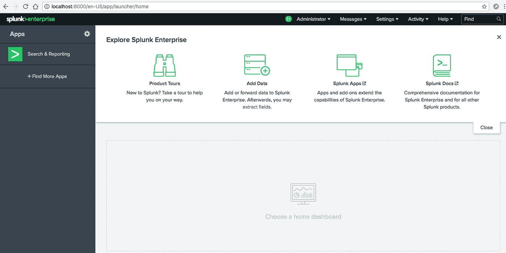

Splunk Enterprise 7.1.3 Web Interface

如果您的本地安装进展顺利，您将会看到一个类似于上面截图的 web 界面。耶！

# 导入原始数据

本文适用于任何类型的原始数据- Splunk **与其生成一些无意义的虚拟测试数据集，我决定搜索一个有趣的真实世界数据集，作为[开放数据](https://en.wikipedia.org/wiki/Open_data)。**

> 赫尔辛基公共交通(HSL)—2016 年 10 月期间每个车站的客运量

我从赫尔辛基地区交通局(HSL)找到了一个有趣的数据集，其中包含赫尔辛基地区每个车站的乘客量。数据集([此处可用](https://hri.fi/data/en_GB/dataset/hsl-n-nousijamaarat-pysakeittain))包含 2016 年 11 月期间每天的平均乘客人数，从乘客旅行卡系统中收集。虽然我对这个特定的数据集只有可用的旧数据(2016 年 11 月)感到有点失望，但我非常惊讶地发现 [HSL](https://www.hsl.fi/) (以及芬兰公共当局总体而言)有相当大的公开可用的数据目录(【https://www.opendata.fi/en】)。不错！

通过下载[这个特定的 HSL 数据集](https://hri.fi/data/en_GB/dataset/hsl-n-nousijamaarat-pysakeittain/resource/82d905c8-d008-4422-9b8b-a4563f16d0ac)——我选择了 [GeoJSON APIJSON](https://hri.fi/data/en_GB/dataset/hsl-n-nousijamaarat-pysakeittain/resource/82d905c8-d008-4422-9b8b-a4563f16d0ac) 数据格式——您将获得一个名为*HSL % 3 an _ nousijam rt . geo JSON*的原始数据文件


Raw data from HSL

正如你所看到的，在顶层我们有一个单一的 *FeatureCollection* ，其中包含了所有的 *Feature* 事件。

由于我们只关心事件(不需要高级 FeatureCollection 数组部分)，我们可以通过删除 JSON 数组并把所有的*特性事件*放到一个新文件(HSLvolumes.json)中来清理数据。

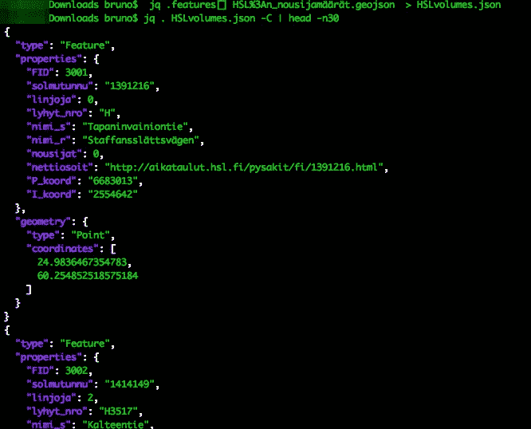

# 将数据添加到 Splunk

从本地硬盘中的文件向 Splunk 添加新数据非常简单。让我们前往 Splunk 并使用 UI 选项来实现这一目的。

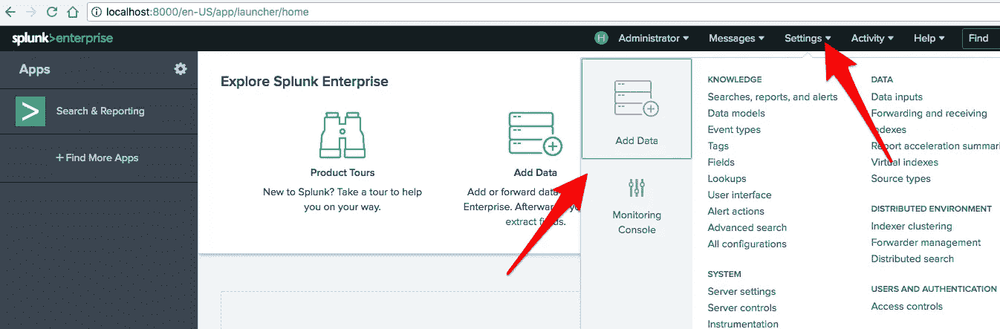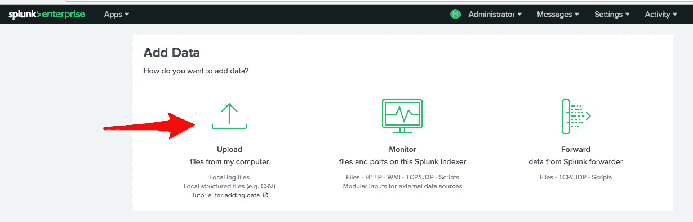

Splunk > Add data

单击添加数据选项，然后选择上传(从我电脑中的文件)


Splunk > Add data: Select Source

将出现一个逐步指南。让我们从选择原始数据文件开始。在我的例子中，我将使用包含*特性事件的 HSLvolumes.json 文件。*

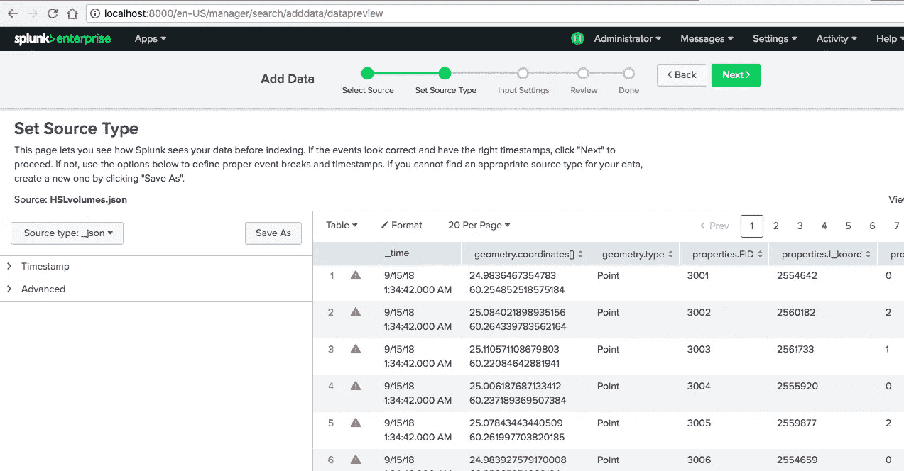

Splunk > Add data: Set Source Type

在获得您的数据后，Splunk 将尝试自动"*理解"*"您的数据，并允许您调整和提供有关数据格式的更多细节。

在这个特殊的例子中，您可以看到它自动将我的数据识别为 JSON (Source type: _json)，总体来说事件看起来不错。但是，有一些警告说它无法解析每个事件的时间戳。

为什么？Splunk 的核心是事件处理，时间至关重要。基于您正在索引的事件，Splunk 将自动尝试查找时间戳。由于我们的数据没有时间戳字段，Splunk 将使用每个事件被编入索引时的当前时间作为事件时间戳。

有关 Splunk 时间戳分配如何工作的深入解释，请查看此 [Splunk 文档页面。](http://docs.splunk.com/Documentation/Splunk/7.1.2/Data/HowSplunkextractstimestamps)

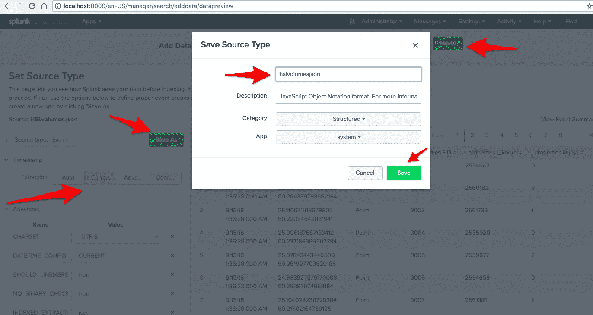

Splunk > Add data: Save Source Type

因此，在时间戳部分，我们将通过选择*当前*来实施这一点，因为我们修改了 _json 源类型，所以让我们点击“另存为”并根据我们的数据源对其进行命名(例如 hslvolumesjson)。

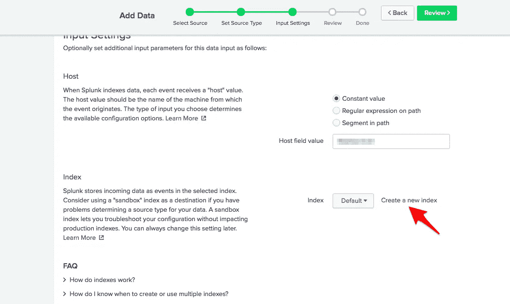

Splunk > Add data: Input Settings

在此部分中，我们需要选择要在哪个 Splunk 索引中存储此数据。为不同类型的数据创建单独的索引是一个好习惯，所以让我们创建一个新的索引。


Splunk > Add data: New Index

选择您的索引名称，然后单击保存。我们可以保留其他字段的默认值。

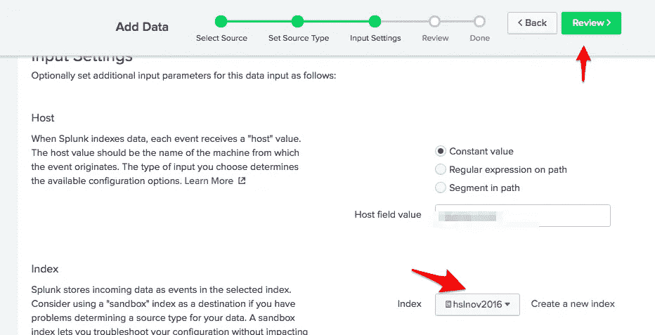

仔细检查是否选择了新索引。点击*审核*，*提交* & *开始搜索*即可。

有关在 Splunk 中获取数据的更深入的解释，请查看 Splunk 文档:[http://dev.splunk.com/view/dev-guide/SP-CAAAE3A](http://dev.splunk.com/view/dev-guide/SP-CAAAE3A)

# 第一眼看你的数据:探索

单击*开始搜索*按钮后，您将被引导至 Splunk 搜索面板。

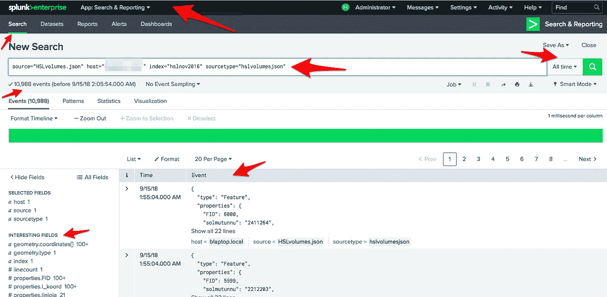

这个观点里有很多有趣的东西。如果你以前从未使用过 Splunk，你可能会感到有点不知所措。请允许我重点介绍一些领域，并为您拆分视图。

在左上角，你会找到你当前所在的 Splunk 应用(*默认:搜索&报告*)和面板(*默认:搜索*)。

在它的正下方，您会发现 Splunk 搜索栏，其中有一个查询(乍一看)可能有点复杂。给定我们的简单用例，完全相同的搜索结果将出现在查询中: *index="hslnov2016 "。*我们将在下面探索查询语言。

在右上角，你会发现时间选择器(*默认:所有时间*)。这允许您选择搜索的时间范围。因为我们的时间戳被设置为索引当前时间，这在这里没有用。

在左下角，你会发现*有趣的字段。这些是 Splunk 能够从您的数据中自动提取的字段。*

最后，剩下的下半部分将显示您的搜索查询结果事件。在这种情况下，所有的索引结果都会出现。

酷，现在怎么办？

在 Splunk 中浏览数据时，我最喜欢首先使用的选项之一是“有趣的字段”面板。通过点击任何一个领域，你都可以很快获得有价值的见解。

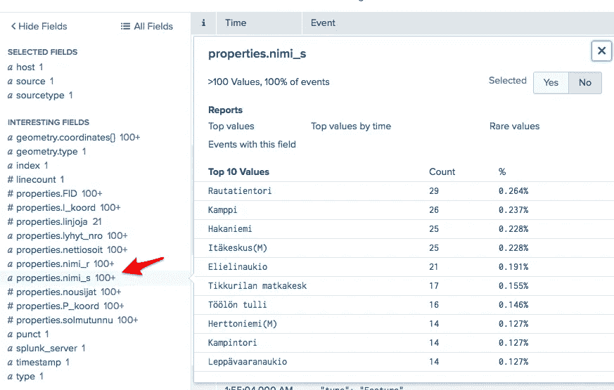

在这种情况下，通过选择字段 *properties.nimi_s* ，我们能够快速了解什么是字段顶值，即在大多数事件中出现的 HSL 站名称。[对任何赫尔辛基地区的居民来说都不奇怪的是，*劳塔廷托里*(中央火车站)和*坎皮*在最上面:]

# 获得答案:统计和数据整理

Splunk 搜索和查询语言既强大又庞大，但是通过一些简单的命令和少量经验，您可以快速获得一些有价值的答案。

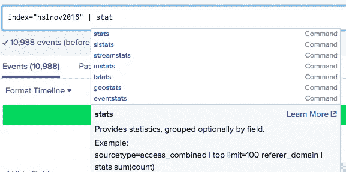

如果您从: *index=yourindex | command，* Splunk 将为您提供关于每个命令的自动完成、指导和解释。

由于每个事件都包含单个车站的日平均乘客量，假设我们想知道每个车站的总乘客量是多少。我们如何做到这一点？

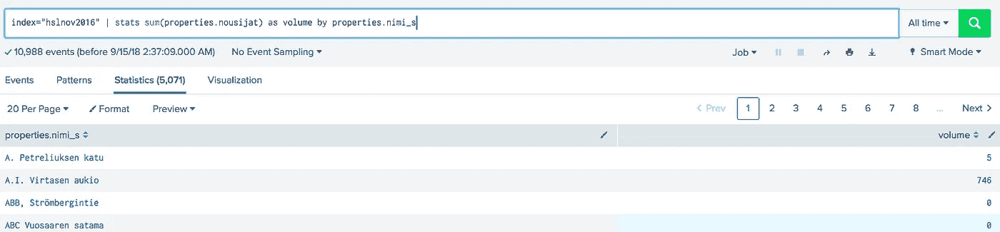

轻松点。我们可以快速使用 stats 命令，将所有的日平均值(properties.nousijat)相加，并按电台名称(properties.nimi_s)汇总这些结果。

**额外收获**:通过获得 5071 个结果，我们还知道了数据集中的电台总数。不错！

想知道前几名或者后几名的 X 站怎么办？

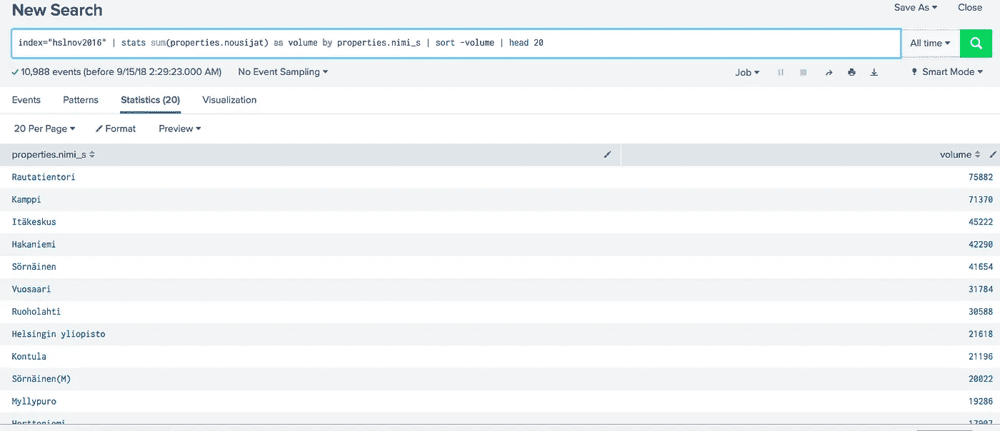

通过追加到我们之前的查询: *| sort -volume | head 20* ，我们立即得到了这个问题的答案。

我们使用*排序*来获得**较高**音量的结果，即降序(对于**较低**，即升序，将是排序*+音量*)和**头**来仅过滤出前 X 个结果

通过不同的 Splunk 查询探索您的数据并获得有价值的答案。

# 仪表板和可视化

一旦您开始掌握 Splunk 搜索的诀窍并保存了几个最有趣的查询，您就可以创建您的第一个仪表板并以不同的方式可视化您的数据。


转到仪表板部分，点击*创建新仪表板。*为您的仪表板命名，并添加您的第一个面板。

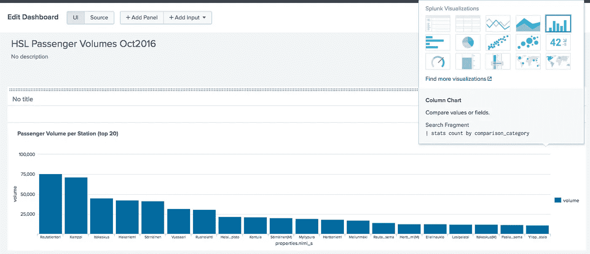

使用与前面相同的查询，我添加了一个简单的柱形图面板。

很快，我们的前 20 个车站在客流量方面变得非常非常不同。Kamppi 和 Rautatientori 的客流量是排名前五的其他三个车站的两倍。当我们看剩下的 15 个站(前 20！)我们得到 3 倍的体积。

在这一点上，我决定添加两个额外的新面板…

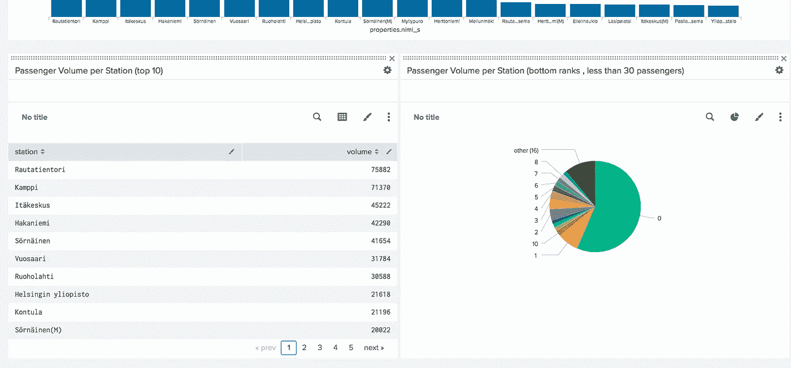

左边是**每站旅客量前 50 名**(与*|头 50* 查询相同)和一个简单的可视化表格。

右边是每个车站的**乘客量(最下面一排，不到 30 名乘客)。**带饼图和查询:***index = " HSL nov 2016 " | stats sum(properties . nousijat)as volume by " properties . nimi _ s " | sort+volume | search volume<30 | stats count by volume***

**我决定只包括客流量少于 30 人的车站。而且我很惊讶的看到有这么多车站(1827)0 乘客。**

****最后一个面板…****

**由于我的数据集包括每个站点的地理坐标(纬度和经度)，我决定再添加一个面板(类型地图)。为此，我扩展了我的 Splunk 并安装了一个名为 *Maps+ for Splunk* 的第三方可视化工具。**

**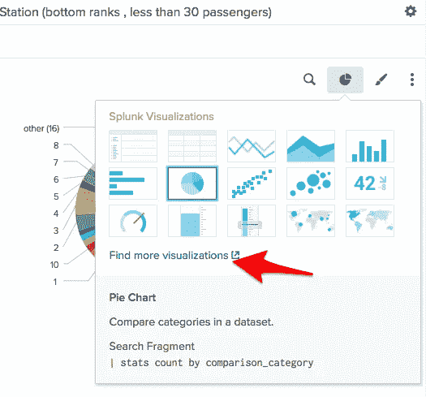**

**您可以通过浏览现有的可视化类型并转到*“查找更多可视化”*来完成同样的操作**

> **Splunk 具有内置的地图可视化功能。为什么不用它呢？**
> 
> **我一开始确实使用了内置地图，但我发现了一些局限性:你不能在城市级别缩放，而且我的 Splunk 查询更复杂。Splunk 的 Maps+对我来说是一个明显的赢家。**

**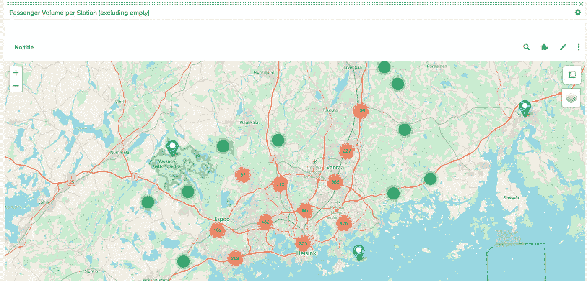**

**面板 Splunk 搜索查询为:*index = " hslnov 2016 " | spath path = " geometry . coordinates { 0 } " output = longitude | spath path = " geometry . coordinates { 1 } " output = latitude | stats first(latitude)为纬度，first(longitude)为经度，first(properties.nimi_s)为描述，sum(properties.nousijat)为标题 by " properties . nimi _ s " | sort-title |搜索标题> 0***

**需要使用 spath 进行初始转换，因为纬度和经度在同一个字段中(多值 json 类型)，因此我必须将它们“分割”到不同的字段中。**

**这种可视化(Maps+ for Splunk)只要求您在一个表中有一些带有特定标签名称的字段。更多详细信息，请查看位于[https://github.com/sghaskell/maps-plus](https://github.com/sghaskell/maps-plus)的项目文件。**

```
base_search | table latitude, longitude [ description| title | (...)
```

**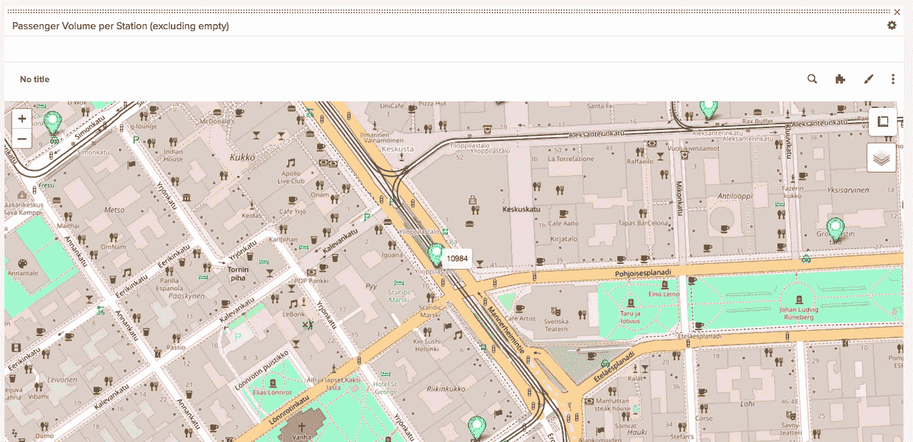**

**我发现这张地图真的很好，很有帮助。我可以通过悬停在某个车站上来快速查看该车站的乘客量。**

**我希望这篇文章对你有用！请分享您的反馈和想法。**

**伸出手，在 [Twitter](https://twitter.com/bruno_amaro) 和 [Instagram](https://www.instagram.com/brunoamaroalmeida/) 上关注**

**布鲁诺**