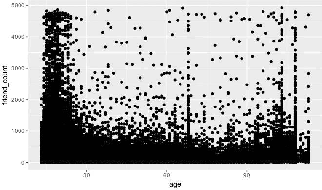
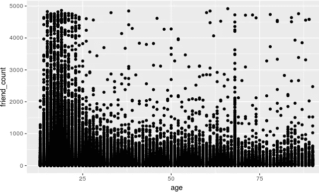
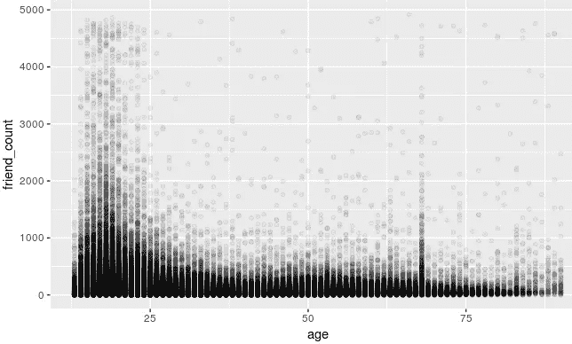
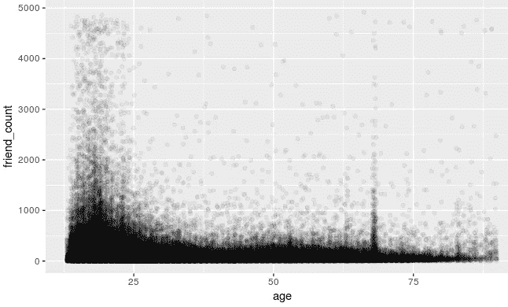
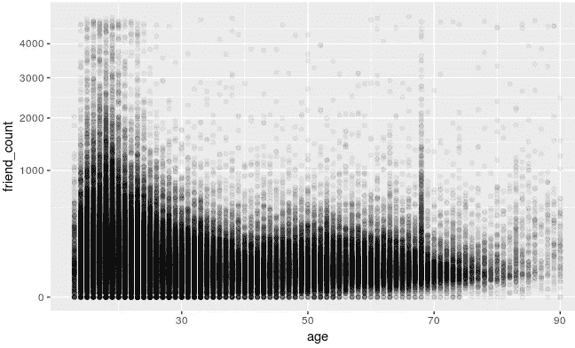
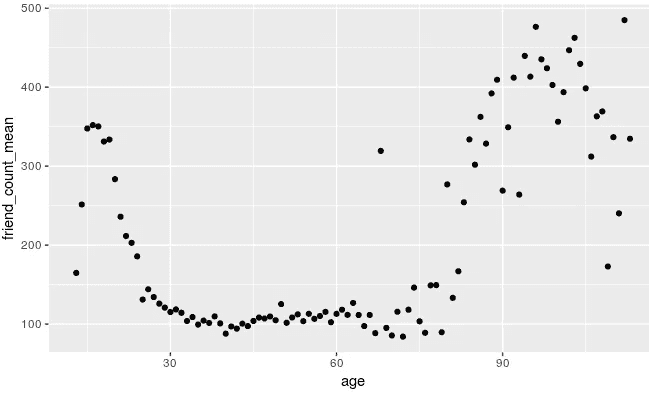
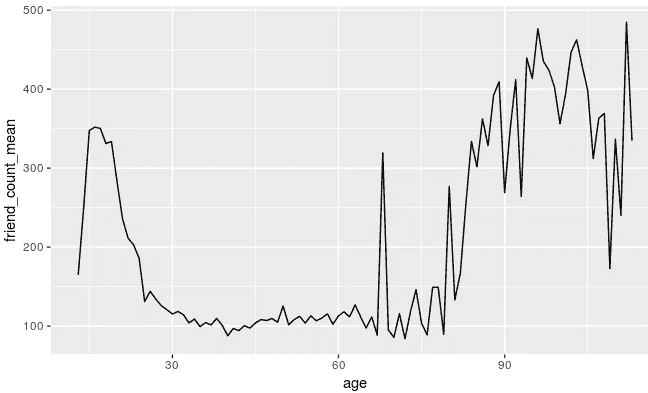
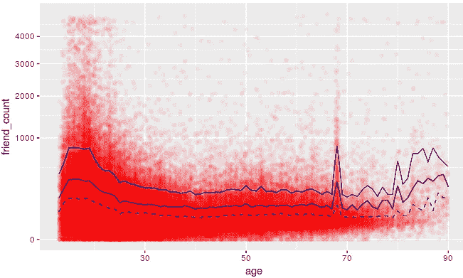
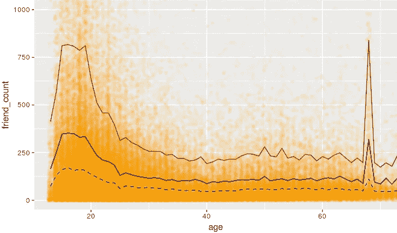

# 使用 R 探究两个变量

> 原文：<https://towardsdatascience.com/explore-two-variables-using-r-68ece9cbcd81?source=collection_archive---------6----------------------->

本文是 R-One Variable 中的[探索性数据分析的继续，其中我们讨论了伪 facebook 数据集的 EDA。](/exploratory-data-analysis-in-r-explore-one-variable-using-pseudo-facebook-dataset-29031767eb07)

在本文中，我们将基于 Udacity 策划的伪 facebook 数据集，了解数据聚合、条件均值和散点图。

现在我们将同时考察两个连续变量。散点图是检验两个变量之间关系的最佳图之一。让我们在所有用户的年龄和朋友数量之间画一个散点图。

```
qplot(age,friend_count,data=pf)
```

运筹学

```
ggplot(aes(x=age,y=friend_count),data=pf)+
  geom_point()
```

当我们使用 geom_point()时，散点图是默认图。



***Plot 1 Scatter Plot — Friend Count Vs Age***

从上面的图中，以下两个观察结果是相当明显的:

1.  年龄不到 30 岁的人有成千上万的朋友
2.  69 岁接近 100 岁有一条垂直线，似乎不正确。

我们知道持有脸书帐户的最低年龄要求是 13 岁，90 岁似乎是一个相当大的年龄，所以让我们将 x 轴限制在 13 到 90 岁之间。

```
ggplot(aes(x=age,y=friend_count),data=pf)+
  geom_point()+
  xlim(13,90)
```



***Plot 2 Scatter Plot — Age Vs Friend Count (x axis restricted)***

上面的地块比地块 1 好，但是下部人满为患，很难统计那个区域的点数。

> geom_point 的 Alpha 美学可用于设置地块过度拥挤区域中点的透明度级别。

对于我们的场景，让我们设置 alpha 值为 1/20，这意味着需要 20 个点来完成一个黑点。

```
ggplot(aes(x=age,y=friend_count),data=pf)+
  geom_point(alpha=1/20)+
  xlim(13,90)
```



***Plot 3 Scatter Plot — Age Vs Friend Count — Alpha Aesthetics***

此外，将抖动添加到我们的绘图中，以分散过度绘制的点。

> 抖动是指向数据中添加少量随机噪声。

```
ggplot(aes(x=age,y=friend_count),data=pf)+
  geom_jitter(alpha=1/20)+
  xlim(13,90)
```



***Plot 4 Scatter Plot — Age Vs Friend Count — Jittering***

从上面的情节可以推断，25 岁以下的用户绝大多数朋友都在 1000 以下。*这个推论与我们从情节 1 的第一个观察相矛盾，象征着 EDA 的重要性。*

更进一步，让我们使用 [coord_trans](https://ggplot2.tidyverse.org/reference/coord_trans.html) 进行可视化。

```
ggplot(aes(x=age,y=friend_count),data=pf)+
  geom_point(alpha=1/20)+
  xlim(13,90)+
  coord_trans(y = "sqrt")
```

运筹学

```
ggplot(aes(x=age,y=friend_count),data=pf)+
  geom_point(alpha=1/20,position=position_jitter(h=0))+
  xlim(13,90)+
  coord_trans(y = "sqrt")
```



***Plot 5 Scatter Plot — Age Vs Friend Count — Use coord_trans***

有了这个剧情，看好友数，条件，年龄就容易多了。
从数据可视化到现在，我们可以观察数据集中的每一个点。尽管如此，从这样的显示中还是无法确定重要的量，如平均值和中间值。有时我们想了解均值或中值如何随其他变量而变化。让我们创建一个表格，为我们提供所有年龄的平均值和中间值。为此我们将使用[**D Plyr**](https://www.r-bloggers.com/hadley-wickham-presents-dplyr-at-user-2014/)。【Dplyr 的基础教程可以在[这里](https://www.r-bloggers.com/hadley-wickhams-dplyr-tutorial-at-user-2014-part-1/)和[这里](https://www.r-bloggers.com/hadley-wickhams-dplyr-tutorial-at-user-2014-part-2/)找到。同样可以使用 [lapply、tapply 和 split](https://rollingyours.wordpress.com/2014/10/20/the-lapply-command-101/) 等函数创建。

```
age_groups<-group_by(pf,age)
pf.fc_by_age<-summarise(age_groups,
          friend_count_mean=mean(friend_count),
          friend_count_median=median(friend_count),
          n=n())
pf.fc_by_age<-arrange(pf.fc_by_age,age)
head(pf.fc_by_age)
```

上面的代码产生一个[tible](https://cran.r-project.org/web/packages/tibble/vignettes/tibble.html)，输出如下所示:

```
A tibble: 6 x 4
    age friend_count_mean friend_count_median     n
  <int>             <dbl>               <dbl> <int>
1    13              165\.                 74    484
2    14              251\.                132   1925
3    15              348\.                161   2618
4    16              352\.                172\.  3086
5    17              350\.                156   3283
6    18              331\.                162   5196
```

> Tibbles 是数据帧的现代版本。他们保留了经受住时间考验的功能，放弃了过去方便但现在令人沮丧的功能。更多信息可以在找到[。](http://r4ds.had.co.nz/tibbles.html)

使用上面的表格，我们将绘制年龄与朋友数量平均值的散点图。

```
ggplot(aes(age,friend_count_mean),data=pf.fc_by_age) +
  geom_point()
```



***Plot 6 Scatter Plot — Age Vs Friend Count Mean***

用线将分散的点连接起来。请遵守**几何线。**

```
ggplot(aes(age,friend_count_mean),data=pf.fc_by_age) +
  geom_line()
```



***Plot 7 Line Plot — Age Vs Friend Count Mean***

酷！让我们在图 5 中绘制之前的散点图。

```
ggplot(aes(x=age,y=friend_count),data=pf)+
  geom_point(alpha=1/20,
             position=position_jitter(h=0),
             color='red')+
  xlim(13,90)+
  coord_trans(y = "sqrt")+
  geom_line(stat='summary',fun.y=mean)+
  geom_line(stat='summary',fun.y=median,linetype=2,color='blue')+
  geom_line(stat='summary',fun.y=quantile,fun.args=list(probs=0.9),color='blue')
```



***Plot 8 — Overlaying summaries with raw data***

从上面我们可以推断，超过 1000 个朋友是很少发生的。要进一步缩放，我们可以使用 coord_cartesian。

```
ggplot(aes(x=age,y=friend_count),data=pf)+
  coord_cartesian(xlim=c(13,70),ylim=c(0,1000))+
  geom_point(alpha=1/20,
             position=position_jitter(h=0),
             color='orange')+
  geom_line(stat='summary',fun.y=mean)+
  geom_line(stat='summary',fun.y=median,linetype=2,color='blue')+
  geom_line(stat='summary',fun.y=quantile,fun.args=list(probs=0.9),color='brown')
```



***Plot 9— Overlaying summaries with raw data — Zoomed***

接下来，作为探索性数据分析系列的一部分，我们将通过 R 探索多个变量。