# 探索神经网络的激活函数

> 原文：<https://towardsdatascience.com/exploring-activation-functions-for-neural-networks-73498da59b02?source=collection_archive---------0----------------------->

在这篇文章中，我想更多地关注我们在神经网络中使用的激活函数。为此，我将使用具有不同激活函数的简单全连接神经网络来解决 [MNIST](https://en.wikipedia.org/wiki/MNIST_database) 问题。

MNIST 数据是一组大约 70000 张手写数字的照片，每张照片的尺寸是 28x28，并且是黑白的。这意味着我们的输入数据形状是(70000，784)，我们的输出是(70000，10)。

我将使用一个基本的全连接神经网络，只有一个隐藏层。它看起来像这样:

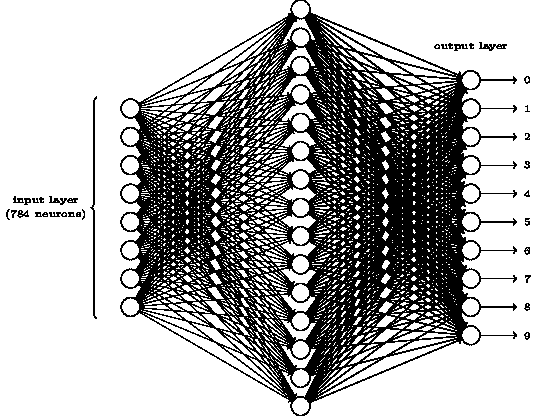

输入层有 784 个神经元，照片中的每个像素一个，隐藏层有 512 个神经元，输出层有 10 个神经元，每个数字一个。

在`keras`中，我们可以为每一层使用不同的激活功能。这意味着，在我们的情况下，我们必须决定在隐藏层和输出层使用什么激活函数，在这篇文章中，我将只在隐藏层进行实验，但它也应该与最终层相关。

有许多激活函数，我将只讨论基本的:Sigmoid，Tanh 和 Relu。

首先，让我们尽量不要使用任何激活功能。你认为会发生什么？下面是代码(我跳过了数据加载部分，你可以在这个[笔记本](https://github.com/shudima/notebooks/blob/master/Activation%20Functions.ipynb)里找到完整的代码):

```
model = Sequential()
model.add(Dense(512, input_shape=(784,)))
model.add(Dense(10, activation='softmax'))
```

我说过，784 个输入，512 个在隐藏层，10 个神经元在输出层。在培训之前，我们可以使用`model.summary and model.layers`查看网络架构和参数:

```
Layers (input ==> output)
--------------------------
dense_1 (None, 784) ==> (None, 512)
dense_2 (None, 512) ==> (None, 10)Summary
_________________________________________________________________
Layer (type)                 Output Shape              Param #   
=================================================================
dense_1 (Dense)              (None, 512)               401920    
_________________________________________________________________
output (Dense)              (None, 10)                5130      
=================================================================
Total params: 407,050
Trainable params: 407,050
Non-trainable params: 0
_________________________________________________________________
None
```

好了，现在我们确定了网络的架构，让我们针对 5 个时期进行培训:

```
Train on 60000 samples, validate on 10000 samples
Epoch 1/5
60000/60000 [==============================] - 3s - loss: 0.3813 - acc: 0.8901 - val_loss: 0.2985 - val_acc: 0.9178
Epoch 2/5
60000/60000 [==============================] - 3s - loss: 0.3100 - acc: 0.9132 - val_loss: 0.2977 - val_acc: 0.9196
Epoch 3/5
60000/60000 [==============================] - 3s - loss: 0.2965 - acc: 0.9172 - val_loss: 0.2955 - val_acc: 0.9186
Epoch 4/5
60000/60000 [==============================] - 3s - loss: 0.2873 - acc: 0.9209 - val_loss: 0.2857 - val_acc: 0.9245
Epoch 5/5
60000/60000 [==============================] - 3s - loss: 0.2829 - acc: 0.9214 - val_loss: 0.2982 - val_acc: 0.9185Test loss:, 0.299
**Test accuracy: 0.918**
```

我们得到的结果不是很好，在 MNIST 数据集上 91.8%的准确率相当糟糕。当然，你可以说我们需要比 5 个时期多得多的时期，但是让我们画出损失:

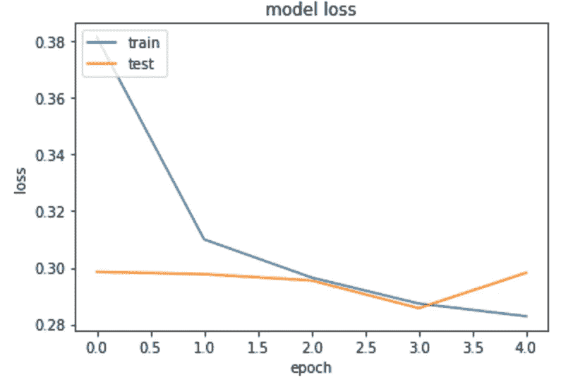

你可以看到验证损失没有改善，我可以向你保证，即使经过 100 个时代也不会改善。我们可以尝试不同的技术来防止过度适应，或者让我们的网络更大更智能，以便更好地学习和提高，但让我们只是尝试使用`sigmoid`激活功能。

Sigmoid 函数看起来像这样:

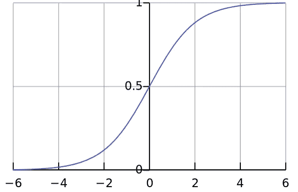

它将输出压缩为(0，1)区间，并且是非线性的。让我们在网络中使用它:

```
model = Sequential()
model.add(Dense(512, activation='sigmoid', input_shape=(784,)))
model.add(Dense(10, activation='softmax'))
```

你可以看到架构是完全一样的，我们只改变了`Dense`层的激活功能。让我们再训练 5 个纪元:

```
Train on 60000 samples, validate on 10000 samples
Epoch 1/5
60000/60000 [==============================] - 3s - loss: 0.4224 - acc: 0.8864 - val_loss: 0.2617 - val_acc: 0.9237
Epoch 2/5
60000/60000 [==============================] - 3s - loss: 0.2359 - acc: 0.9310 - val_loss: 0.1989 - val_acc: 0.9409
Epoch 3/5
60000/60000 [==============================] - 3s - loss: 0.1785 - acc: 0.9477 - val_loss: 0.1501 - val_acc: 0.9550
Epoch 4/5
60000/60000 [==============================] - 3s - loss: 0.1379 - acc: 0.9598 - val_loss: 0.1272 - val_acc: 0.9629
Epoch 5/5
60000/60000 [==============================] - 3s - loss: 0.1116 - acc: 0.9673 - val_loss: 0.1131 - val_acc: 0.9668

Test loss: 0.113
**Test accuracy: 0.967**
```

那好多了。为了理解为什么，让我们回忆一下我们的神经元是什么样子的:

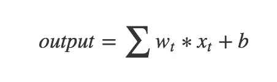

其中`x`是输入，`w`是权重，`b`是偏差。可以看到，这只是输入与权重和偏差的线性组合。即使在叠加了很多之后，我们仍然可以把它表示成一个线性方程。这意味着，它类似于一个完全没有隐藏层的网络，对于任何数量的隐藏层都是如此。！).我们将添加一些层到我们的第一个网络，看看会发生什么。看起来是这样的:

```
model = Sequential()
model.add(Dense(512, input_shape=(784,)))for i in range(5):
    model.add(Dense(512))model.add(Dense(10, activation='softmax'))
```

这是网络的样子:

```
dense_1 (None, 784) ==> (None, 512)
dense_2 (None, 512) ==> (None, 512)
dense_3 (None, 512) ==> (None, 512)
dense_4 (None, 512) ==> (None, 512)
dense_5 (None, 512) ==> (None, 512)
dense_6 (None, 512) ==> (None, 10)

_________________________________________________________________
Layer (type)                 Output Shape              Param #   
=================================================================
dense_1 (Dense)             (None, 512)               401920    
_________________________________________________________________
dense_2 (Dense)             (None, 512)               262656    
_________________________________________________________________
dense_3 (Dense)             (None, 512)               262656    
_________________________________________________________________
dense_4 (Dense)             (None, 512)               262656    
_________________________________________________________________
dense_5 (Dense)             (None, 512)               262656    
_________________________________________________________________
dense_16 (Dense)             (None, 10)                5130      
=================================================================
Total params: 1,720,330
Trainable params: 1,720,330
Non-trainable params: 0
_________________________________________________________________
None
```

这些是训练 5 个时期后的结果:

```
Train on 60000 samples, validate on 10000 samples
Epoch 1/5
60000/60000 [==============================] - 17s - loss: 1.3217 - acc: 0.7310 - val_loss: 0.7553 - val_acc: 0.7928
Epoch 2/5
60000/60000 [==============================] - 16s - loss: 0.5304 - acc: 0.8425 - val_loss: 0.4121 - val_acc: 0.8787
Epoch 3/5
60000/60000 [==============================] - 15s - loss: 0.4325 - acc: 0.8724 - val_loss: 0.3683 - val_acc: 0.9005
Epoch 4/5
60000/60000 [==============================] - 16s - loss: 0.3936 - acc: 0.8852 - val_loss: 0.3638 - val_acc: 0.8953
Epoch 5/5
60000/60000 [==============================] - 16s - loss: 0.3712 - acc: 0.8945 - val_loss: 0.4163 - val_acc: 0.8767

Test loss: 0.416
**Test accuracy: 0.877**
```

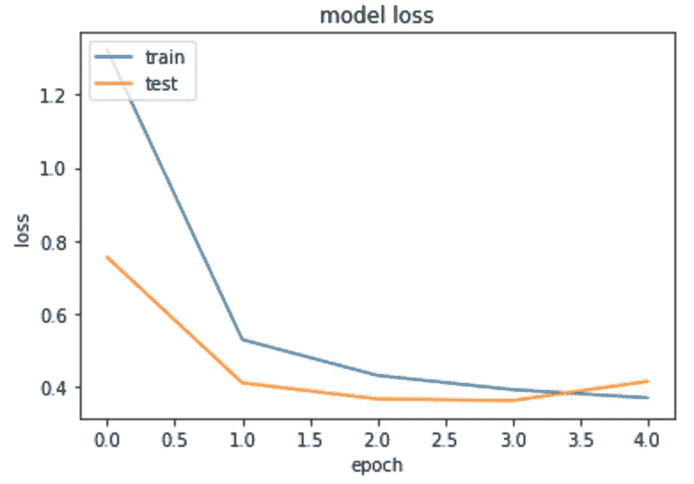

这很糟糕。我们可以看到网络无法学习我们想要的东西。这是因为没有非线性，我们的网络只是一个线性分类器，不能获得非线性关系。

另一方面，`sigmoid`是一个非线性函数，我们不能将其表示为我们输入的线性组合。这给我们的网络带来了非线性，使它能够学习非线性关系。让我们再次尝试训练 5 个隐藏层网络，这次使用`sigmoid`激活:

```
Train on 60000 samples, validate on 10000 samples
Epoch 1/5
60000/60000 [==============================] - 16s - loss: 0.8012 - acc: 0.7228 - val_loss: 0.3798 - val_acc: 0.8949
Epoch 2/5
60000/60000 [==============================] - 15s - loss: 0.3078 - acc: 0.9131 - val_loss: 0.2642 - val_acc: 0.9264
Epoch 3/5
60000/60000 [==============================] - 15s - loss: 0.2031 - acc: 0.9419 - val_loss: 0.2095 - val_acc: 0.9408
Epoch 4/5
60000/60000 [==============================] - 15s - loss: 0.1545 - acc: 0.9544 - val_loss: 0.2434 - val_acc: 0.9282
Epoch 5/5
60000/60000 [==============================] - 15s - loss: 0.1236 - acc: 0.9633 - val_loss: 0.1504 - val_acc: 0.9548

Test loss: 0.15
**Test accuracy: 0.955**
```

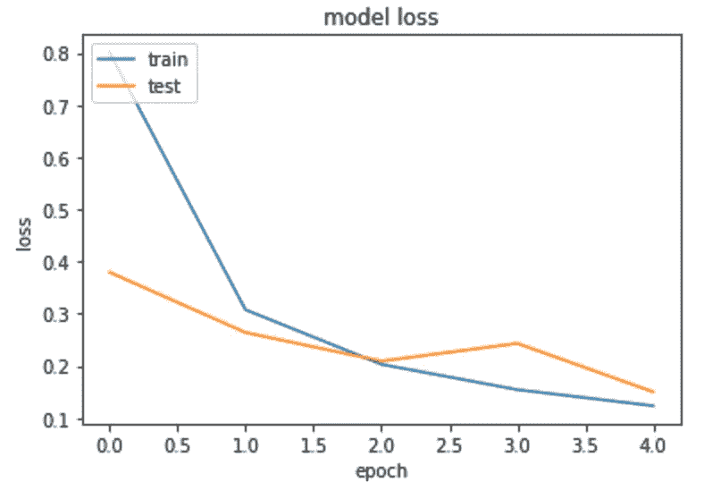

还是那句话，好多了。我们可能过拟合，但我们得到了一个显着的性能提升只是通过使用激活函数。

Sigmoid 很棒，它有许多积极的属性，如非线性、[可微性](https://en.wikipedia.org/wiki/Differentiable_function)和(0，1)范围为我们提供了返回值的概率，这很好，但它也有缺点。当我们使用反向传播时，我们必须将输出的导数反向传播回我们的第一个权重，换句话说，我们希望将最终输出值中的分类/回归误差传递回整个网络。这意味着我们应该派生我们的层并更新权重。sigmoid 的问题是，它的导数是这样的:

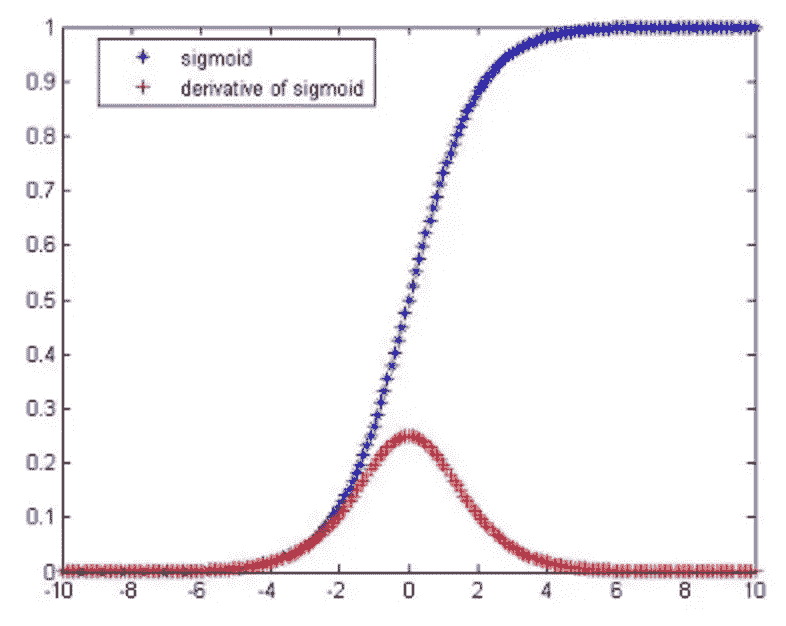

你可以看到导数的最大值非常小(0.25)，这意味着我们只会将一小部分误差传递给前面的层。这可能会导致我们的网络学习缓慢(我所说的缓慢是指我们需要更多的数据或时期，而不是计算时间)。

为了解决这个问题，我们可以使用`Tanh`函数，如下所示:

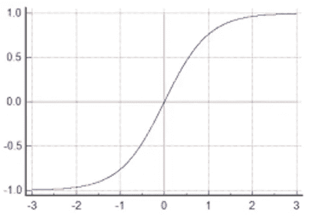

`tanh`函数也是非线性和可微的。它的输出在(-1，1)范围内，没有(0，1)范围好，但是对于隐藏层来说还是可以的。最后，它的最大导数是一个很好的值，因为现在我们可以更好地传递误差。

要使用`tanh`激活功能，我们只需改变`Dense`层的`activation`属性:

```
model = Sequential()
model.add(Dense(512, activation=’tanh’, input_shape=(784,)))
model.add(Dense(10, activation=’softmax’))
```

还是那句话，网络架构是一样的，只是激活不同。让我们训练 5 个纪元:

```
Train on 60000 samples, validate on 10000 samples
Epoch 1/5
60000/60000 [==============================] - 5s - loss: 0.3333 - acc: 0.9006 - val_loss: 0.2106 - val_acc: 0.9383
Epoch 2/5
60000/60000 [==============================] - 3s - loss: 0.1754 - acc: 0.9489 - val_loss: 0.1485 - val_acc: 0.9567
Epoch 3/5
60000/60000 [==============================] - 3s - loss: 0.1165 - acc: 0.9657 - val_loss: 0.1082 - val_acc: 0.9670
Epoch 4/5
60000/60000 [==============================] - 3s - loss: 0.0843 - acc: 0.9750 - val_loss: 0.0920 - val_acc: 0.9717
Epoch 5/5
60000/60000 [==============================] - 3s - loss: 0.0653 - acc: 0.9806 - val_loss: 0.0730 - val_acc: 0.9782

Test loss: 0.073
**Test accuracy: 0.978**
```

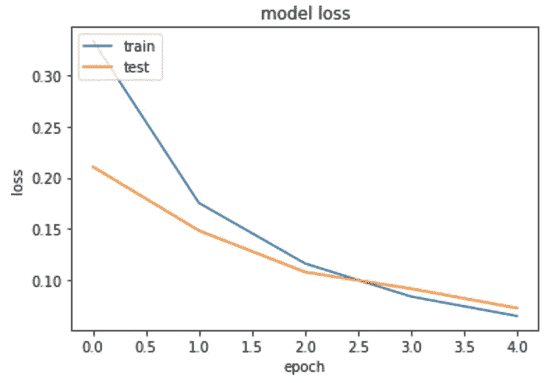

太好了！仅通过使用不同的激活函数，我们就将测试精度提高了 1%以上。

我们能做得更好吗？似乎在大多数情况下，我们可以使用 relu 激活功能。Relu 长这样:

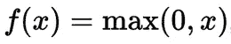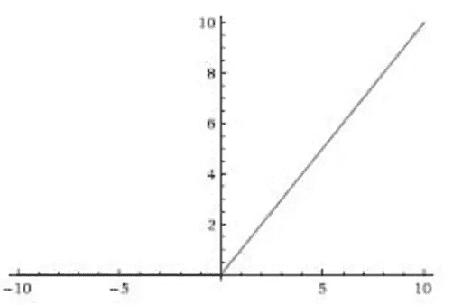

这个激活函数的范围是(0，inf)，在零点不可微(这个有解)。关于`relu`最好的事情是它的梯度是**总是**等于`1`，这样我们可以在反向传播过程中通过网络传递最大数量的误差。

让我们训练一下，看看结果:

```
Train on 60000 samples, validate on 10000 samples
Epoch 1/5
60000/60000 [==============================] - 5s - loss: 0.2553 - acc: 0.9263 - val_loss: 0.1505 - val_acc: 0.9516
Epoch 2/5
60000/60000 [==============================] - 3s - loss: 0.1041 - acc: 0.9693 - val_loss: 0.0920 - val_acc: 0.9719
Epoch 3/5
60000/60000 [==============================] - 3s - loss: 0.0690 - acc: 0.9790 - val_loss: 0.0833 - val_acc: 0.9744
Epoch 4/5
60000/60000 [==============================] - 4s - loss: 0.0493 - acc: 0.9844 - val_loss: 0.0715 - val_acc: 0.9781
Epoch 5/5
60000/60000 [==============================] - 3s - loss: 0.0376 - acc: 0.9885 - val_loss: 0.0645 - val_acc: 0.9823

Test loss: 0.064
**Test accuracy: 0.982**
```

到目前为止，我们取得了最好的成绩。98.2%这是一个不错的结果，我们只使用了一个隐藏层。

需要注意的是，这里没有**最好的**激活功能。在许多情况下，一个可能比另一个更好，但在另一些情况下会更差。

另一个重要的注意事项是，使用不同的激活函数不影响我们的网络可以学习什么，只影响多快(它需要多少数据/时期)。这是我们尝试过的所有激活函数的曲线图，但这次是在一个更长的训练周期内。你可以看到所有的激活函数最终都达到了 98%的准确率。

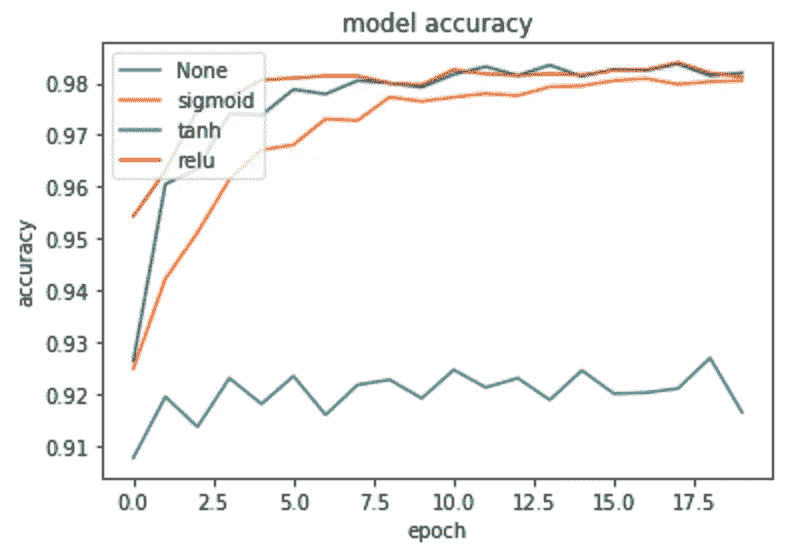

希望你喜欢这篇文章。你可以在这里找到代码[。](https://github.com/shudima/notebooks/blob/master/Activation%20Functions.ipynb)