# 使用 pandas 和 Bokeh 探索和可视化芝加哥公交数据—第一部分(pandas 简介)

> 原文：<https://towardsdatascience.com/exploring-and-visualizing-chicago-transit-data-using-pandas-and-bokeh-part-i-intro-to-pandas-5d6caa8813ef?source=collection_archive---------1----------------------->


Source: Me

***本系列的第 1 部分*** *是对 pandas 的介绍，其中我将描述如何用 python3 将大型开放存取数据集读入 Jupyter 笔记本，并演示 pandas 作为高性能数据操作/分析软件包的一些功能。*

***第 2 部分*** *将更深入地探讨散景软件包，在这里我将演示交互式可视化功能和地理空间映射特性，以便以引人入胜的方式呈现第 1 部分中的数据。*

芝加哥市提供了大量的开放数据供市民探索。芝加哥数据门户([https://data.cityofchicago.org/](https://data.cityofchicago.org/#about))收藏了成千上万可供下载的数据集。它包括从电影拍摄地到你最喜欢的餐馆的卫生数据。人们已经创建了以非常独特和有用的方式集成这些数据的应用程序！例如，我发现了一个应用程序，当你的街道将被清扫时，它会通过短信提醒你(以避免城市在清洁期间因未能移动你的汽车而发放的可爱罚单):参见 [https://sweeparound.us](https://sweeparound.us)

我认为探索芝加哥数据门户上的数据集会很有趣，围绕的主题是大多数芝加哥人都熟悉的:**芝加哥运输管理局(CTA)公共列车系统(也称为“L”列车)**。对于非芝加哥地区的人，CTA 列车系统分为 8 条不同的“L”型列车线路:

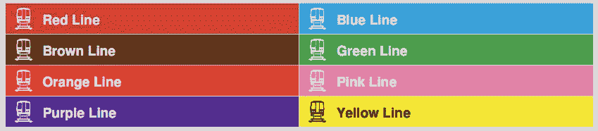

每条铁路线都经过一组车站。有些车站有多条线路穿过。以下是 CTA 列车系统的地图:

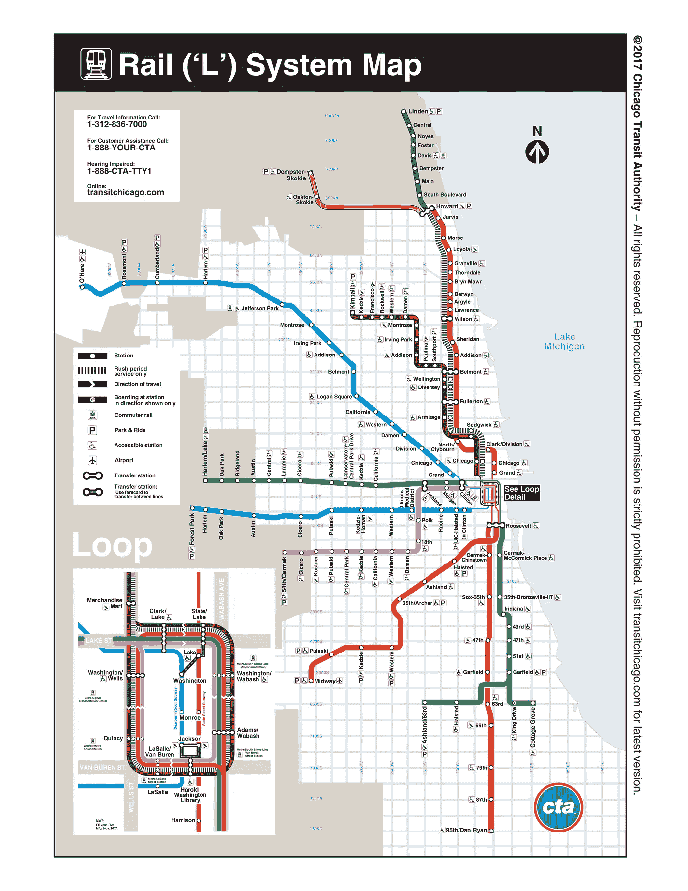

CTA Transit Map. Source: [https://www.transitchicago.com/assets/1/6/ctamap_Lsystem.png](https://www.transitchicago.com/assets/1/6/ctamap_Lsystem.png)

# 数据

芝加哥数据门户有许多与公共交通系统相关的数据集。我们将在本教程中使用的两个数据集位于下面:

1.  [**CTA —乘客量—‘L’站条目—月日型平均值&总计**](https://data.cityofchicago.org/Transportation/CTA-Ridership-L-Station-Entries-Monthly-Day-Type-A/t2rn-p8d7)
2.  [**CTA-系统-信息-停靠站列表-地图**](https://data.cityofchicago.org/Transportation/CTA-System-Information-List-of-L-Stops-Map/zbnc-zirh)

第一个数据集包含所有 CTA 火车站的每月乘客总数，并进一步按日类型细分。(工作日、周六或周日/假日)令人惊叹的是，这些数据可以追溯到 2001 年。相当令人印象深刻！

第二个数据集是一个地图，它包含关于每个 CTA 火车站的地理空间数据(包括车站名称和地图上的坐标)。您可以将信息导出为多种格式(JSON、TSV、XML)。我们将在本教程的第 2 部分更多地使用它。

# 制定问题/探索数据

作为一个芝加哥人，我坐过大部分的火车线(除了紫色线)。通过经常乘坐火车，你可以对某些交通模式有所了解。例如，你会知道在早上 7:30 带你的全家去红线州/湖站是一个**非常糟糕的**主意。使用这些交通数据，可以发现更多具体的和基于数据的模式。

在全力以赴分析数据和绘制曲线之前，你必须提出问题——或者开始**探索数据。总的来说，你希望发现什么？你在查阅资料前后有哪些具体的疑问？你不知道你想知道什么？这个过程可以是迭代的:发现新信息后，可以开始提出新的问题。**

我对 CTA 培训系统的一些一般性问题，这些数据将有助于回答:

## 问题

1.  我公寓旁边的两个火车站哪个更受欢迎？
2.  **总体上最受欢迎(和最不受欢迎)的电台有哪些？**
3.  **城市的哪个区域乘客最多？**
4.  **随着时间的推移，有什么有趣的乘客趋势吗？**

与大多数数据科学问题一样，首先要做的是读入和处理数据(并检查数据质量问题)，开始回答一些基本问题。这将是本文的主要焦点(问题 1-2 的答案)。我计划在第 2 部分深入一些更高级的主题，包括使用散景和彩虹贴图的更高级的可视化方法(问题 3-4)。

# Jupyter 笔记本入门

我将使用一个 [Jupyter 笔记本](http://jupyter.org/index.html)和 python3，以及其他一些有用的软件包([熊猫](https://pandas.pydata.org)和[散景](https://bokeh.pydata.org/en/latest/))来进行分析。**如果你不知道什么是**[**Jupyter**](http://jupyter.org/index.html)**笔记本，那你就错过了！**这是一种令人难以置信的编程/进行探索性数据分析的可视化方式，它帮助我成为一名更好的 python 程序员，并使我摆脱了 Excel 的束缚。这里有一些在你的电脑上安装 Jupyter 的说明:[http://jupyter.org/install](http://jupyter.org/install)

你还需要[安装 python3](http://docs.python-guide.org/en/latest/starting/install3/osx/) 和 pandas / bokeh 包。我在命令行中使用了以下命令:

```
pip3 install pandas
pip3 install bokeh
```

要从命令行(在所需的目录中)启动 Jupyter 笔记本，请键入:

```
jupyter notebook
```

这将在浏览器中启动 Jupyter 笔记本仪表板(默认情况下，`[http://localhost:8888](http://localhost:8888)`)。

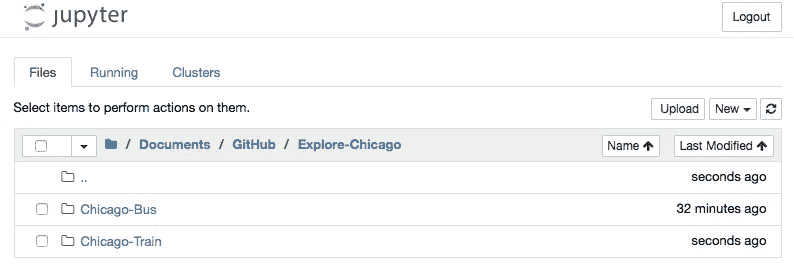

这个 dasboard 视图显示了启动笔记本服务器的目录中的笔记本、文件和子目录的列表。

要创建一个新的笔记本，你点击顶部的*新建*按钮，并选择一个 *Python 3* 环境。

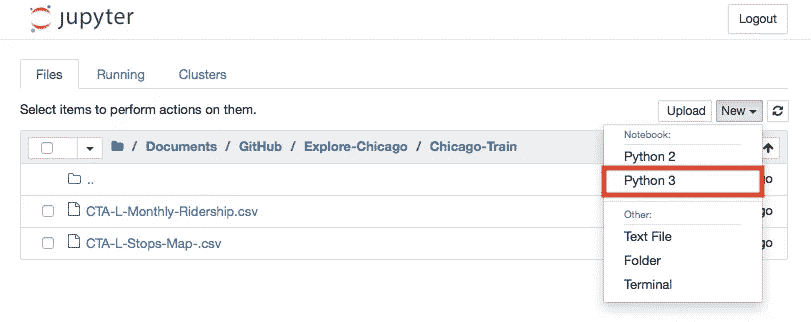

这将打开笔记本视图，您可以在这里开始用 python3 编码！

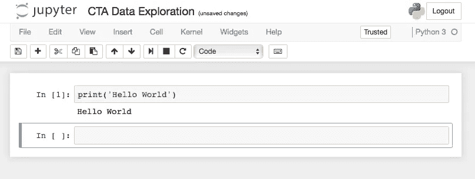

要想快速了解如何使用 jupyter 笔记本，请看 t [他的文章](https://medium.com/codingthesmartway-com-blog/getting-started-with-jupyter-notebook-for-python-4e7082bd5d46)。

# 工具

我将在此分析中使用的两个主要工具是熊猫和散景:

*   [**pandas**](https://pandas.pydata.org):[Python](http://www.python.org/)包提供了快速、灵活且富于表现力的**数据结构**，旨在使处理“关系”或“带标签”的数据变得既简单又直观。它的目标是成为用 Python 进行实际的、真实世界的数据分析的基础高级构建块”
*   [**散景**](https://bokeh.pydata.org/en/latest/) :“散景是一个交互式可视化库，面向现代 web 浏览器进行演示。它的目标是提供优雅、简洁的通用**图形**结构，并通过超大型或流式数据集的高性能交互来扩展这种能力。散景可以帮助任何想要快速轻松地创建**交互式绘图**、仪表盘和数据应用的人。”

底线是 pandas 将主要用于**存储和操作**数据(在[数据帧](https://pandas.pydata.org/pandas-docs/stable/generated/pandas.DataFrame.html)中)，而 Bokeh 将用于数据的**呈现和可视化**。

# 读入数据

为了读入数据，我导入了 pandas 包并读入了 L-stop 平均客流量的 CSV。我可以用 [**。read_csv()**](https://pandas.pydata.org/pandas-docs/stable/generated/pandas.read_csv.html) 函数执行此操作，传递文件名和一个分隔符作为参数:

```
import pandas as pdL_Rides = pd.read_csv('CTA-L-Monthly-Ridership.csv',sep=',')
L_Rides.head()
```

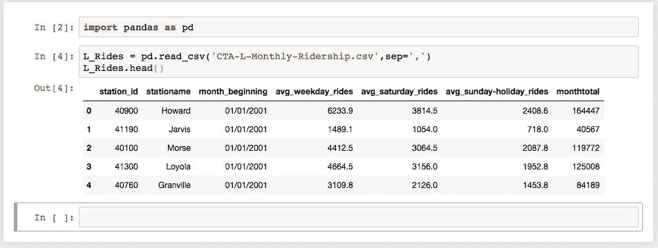

**L_Rides** 是包含乘客数据的数据帧。使用 [**。head()**](https://pandas.pydata.org/pandas-docs/stable/generated/pandas.DataFrame.head.html) 功能允许我只查看数据帧的前几行。这是查看数据外观的好方法。

这里我们看到有几列数据:

*   *station_id，stationame，month_beginning，avg_weekday_rides，avg_saturday_rides，avg_sunday-holiday_rides，month_total*

看起来每个车站和每个月都有工作日/周末的乘客统计，以及每个车站的每月总数。

熊猫还有一个有用的功能叫做 [**。describe()**](https://pandas.pydata.org/pandas-docs/version/0.21/generated/pandas.DataFrame.describe.html) 用于汇总数据帧，提供关于数据集的有用统计信息(平均值、最小值、最大值等)。运行以下命令，将提供这些统计信息:

```
L_Rides.describe()
```

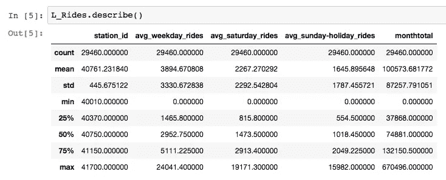

查看该数据框，我们可以看到该数据集中总共有 29，460 个数据点(行)。一些更有趣的花絮:

*   *工作日最多乘车一站已给过****24041****。*
*   *一个普通的 CTA 站一个月大概给* ***100，573*** *次乘车。*
*   一般来说，工作日的乘客最多，而周日的乘客最少。

查看这些单独的数字可以提供线索，了解哪些统计数据值得可视化，尽管创建表格和可视化可以提供更完整的图片并讲述更有说服力的故事。

# 回答问题

## 问题 1: **我公寓旁边的两个火车站哪个更受欢迎？**

在阅读完数据后，我现在可以开始回答我最初的一些问题了。我住在城市的北边 [Edgewater](https://en.wikipedia.org/wiki/Edgewater,_Chicago) ，离我最近的两个站是 [Bryn Mawr](https://www.transitchicago.com/travel-information/rail-station/-stopid-28/) 和 [Berwyn](https://www.transitchicago.com/travel-information/rail-station/-stopid-27/) 红线站。想知道 2017 年这两个哪个最受欢迎？我可以使用熊猫非常有用的索引功能来做到这一点。

为了选择 Berwyn 站的数据，我最终回答了以下问题:

> 找到伯温站是**【车站名称】**的所有数据

您可以将此查询转换成熊猫索引选择，如下所示:

```
L_Rides[L_Rides['stationame'] == 'Berwyn']
```

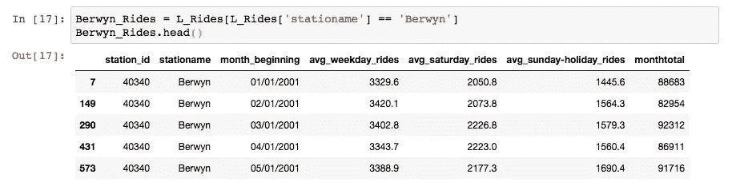

您可以看到，这将数据帧过滤为只有那些以“Berwyn”作为“stationame”的电台。

好吧，那很酷。但是我怎么只得到 2017 年的伯温站数据呢？

简单。您可以添加更多布尔运算符来过滤日期。

> 查找 2017 年 1 月 1 日到 2017 年 12 月 31 日之间的所有数据

这里棘手的部分是导入的数据被分配了特定的变量类型。Pandas 尽力为每一列中的数据分配变量类型。例如，stationame 列作为一个字符串被引入(技术上是一个 python 对象:[在这里阅读更多内容](https://stackoverflow.com/questions/34881079/pandas-distinction-between-str-and-object-types))。您可以使用以下命令对此进行检查:

```
L_Rides.dtypes
```

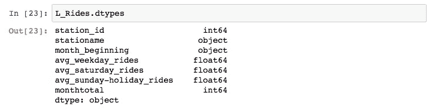

您可以在上面看到所有列及其关联的数据类型。有一些好消息和坏消息。

**坏消息**:‘month _ beginning’列不是日期-时间类型，我们不能很容易地进行日期比较

好消息:熊猫让改变这种类型变得容易

要在 pandas 中更改整列的数据类型，可以使用 [**到 _datetime()**](https://pandas.pydata.org/pandas-docs/version/0.21/generated/pandas.to_datetime.html) 函数。我通常的做法是为这些数据创建一个新列。我使用以下命令来完成此操作:

```
L_Rides['date_time'] = pd.to_datetime(L_Rides['month_beginning'])
```

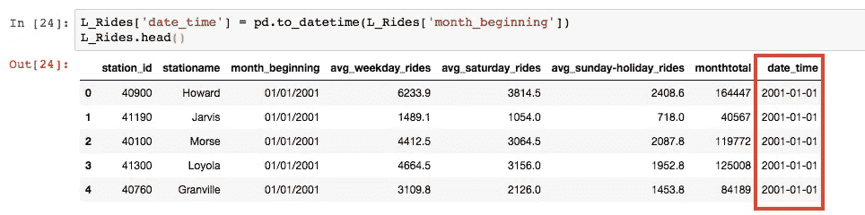

您可以看到添加了另一个名为 date_time 的列，它现在是“datetime64[ns]”数据类型。

现在我们可以执行日期时间比较操作。我可以使用以下命令选择 2017 年 1 月 1 日至 2017 年 12 月 31 日之间的 Berwyn 数据:

```
Berwyn_Rides = L_Rides[(L_Rides['stationame'] == 'Berwyn') &
                       (L_Rides['date_time'] >= '01/01/2017') &
                       (L_Rides['date_time'] < '12/31/2017')]
```

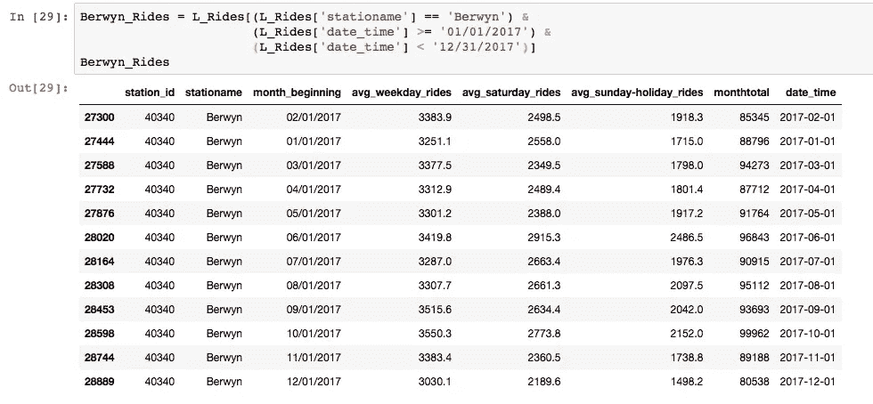

现在，我们拥有 2017 年 Berwyn 站各月数据的 12 个数据点。

最后一步是获得全年的总乘客量。为此，我必须汇总我选择的不同数据行。同样，pandas 使这变得非常容易，因为数据框具有数学函数，可以应用于每一列数据。

不出所料，求和函数被称为 [**。求和()**](https://pandas.pydata.org/pandas-docs/version/0.21/generated/pandas.DataFrame.sum.html) **。您可以直接使用这个函数来获得数据框中每一列的总和，或者您可以传递特定的列名。我使用以下命令获得了 Berwyn 2017 年的乘客总数:**

```
Berwyn_Rides['monthtotal'].sum()
```

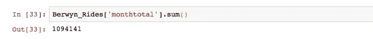

可以对布林莫尔站执行相同的命令:


最终，我们看到**2017 年，布林莫尔站的受欢迎程度比伯温站高出近 50%**(1，094，141 次伯温骑行到 1，509，613 次布林莫尔骑行)。

## **问题 2:最受欢迎(和最不受欢迎)的电台有哪些？**

下一个问题是关于 CTA 运输系统中所有车站的数据，因此我们将使用整个 L 车站数据集。要获得最受欢迎的中转站的列表，我们必须首先按每个中转站对数据进行分组。

像我在前面的例子中所做的那样为每个站创建单独的总数将会是一堆不必要的工作。相反我们要用这个奇妙的 [**。groupby()**](https://pandas.pydata.org/pandas-docs/stable/generated/pandas.DataFrame.groupby.html) 熊猫才有的功能！

groupby 函数在[这里有很好的描述](http://pandas.pydata.org/pandas-docs/stable/groupby.html)，但基本概念是执行以下一个或多个函数:

> 分割—将数据分组
> 
> 应用—对组执行功能
> 
> 合并-将结果合并到数据结构中

对于这个公交示例，我们希望**将**数据分成公交站组，**对总乘客量应用**求和函数，然后**将**结果组合成单个数据帧。

首先，我们可以使用以下命令按站点执行分割:

```
Station_Group = L_Rides.groupby(['stationame'])
```

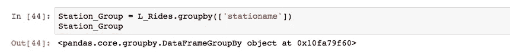

上面我们看到这个组只是一个熊猫数据帧组对象。对于这个对象，你可以执行各种**应用**功能。若要查看数据已被拆分的唯一组，可以使用。群组功能:

```
Station_Group.groups
```

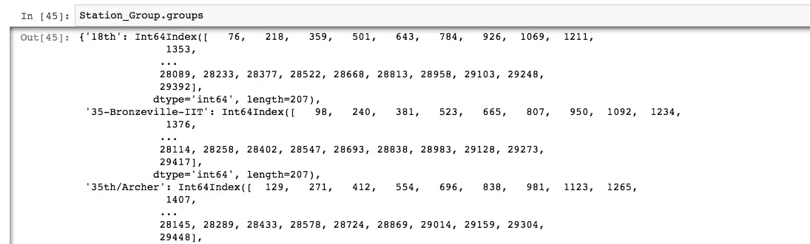

结果表明，该对象只是一个字典，其中包含作为键的组，以及作为值的该组的值。

创建分组对象后，我们可以对组执行聚合(**应用**)操作。我想对数据帧的“monthtotal”列应用求和运算。我用下面的命令做到这一点:

```
Station_Group['monthtotal'].sum()#orStation_Group['monthtotal'].agg('sum')
```

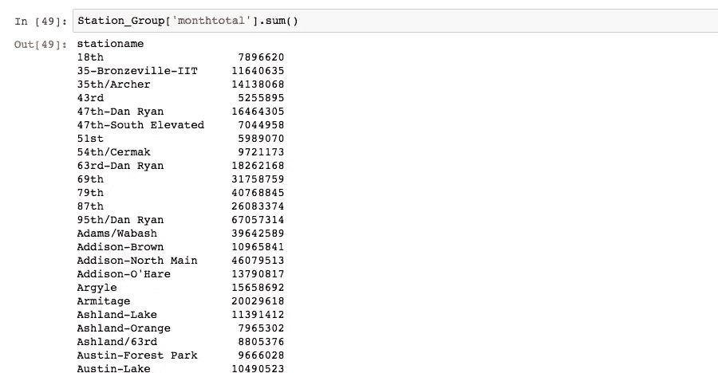

这里我们可以看到每个站点的月总数，一直到 2001 年初。

对此我们能做的最后一件事是**将**结果组合回一个数据帧中(并使用[和**对结果进行排序)。sort_values(** )](https://pandas.pydata.org/pandas-docs/version/0.21/generated/pandas.DataFrame.sort_values.html) 函数):

```
Station_Totals = pd.DataFrame(Station_Group['monthtotal'].sum())
Station_Totals.sort_values(ascending=False,by='monthtotal',inplace=True)
Station_Totals
```

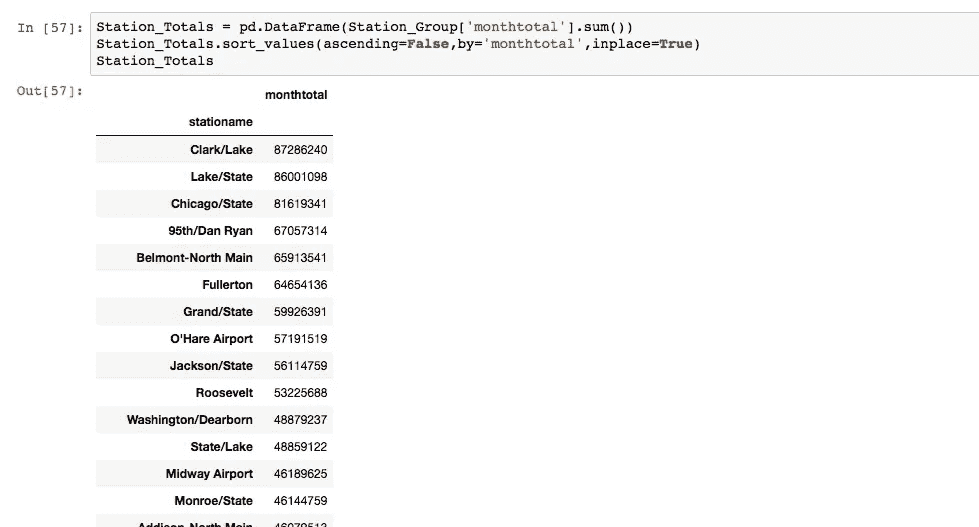

现在我们有了每个站点的乘客总数的数据框，我们可以回答提出的问题了。我将使用一些方便的 pandas 命令返回前 5 个站点和后 5 个站点:

```
Station_Totals.head(5)         # Top 5 stationsStation_Totals.tail(5)         # Bottom 5 stations
```

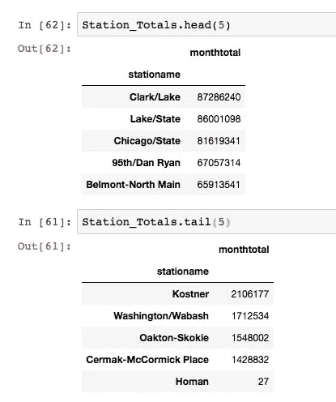

现在我们有最受欢迎和最不受欢迎的 CTA 站(从 2001 年初开始)。

好了，现在关于霍曼上的那 27 次乘坐…

## 迷你历史课

来自维基百科:

> H 阿曼是[芝加哥运输管理局](https://en.wikipedia.org/wiki/Chicago_Transit_Authority)的[绿线](https://en.wikipedia.org/wiki/Green_Line_(Chicago_Transit_Authority))上的[站](https://en.wikipedia.org/wiki/Metro_station)。车站位于芝加哥[的](https://en.wikipedia.org/wiki/Chicago)[东加菲尔德公园](https://en.wikipedia.org/wiki/East_Garfield_Park,_Chicago)附近的[湖街](https://en.wikipedia.org/wiki/Lake_Street_(Chicago))和[霍曼大道。霍曼位于普拉斯基](https://en.wikipedia.org/wiki/Chicago)[以东](https://en.wikipedia.org/wiki/Pulaski_(CTA_Green_Line_station))和凯兹以西[。霍曼于 1894 年 3 月开放，1994 年 1 月 9 日关闭，当时整条绿线因一项翻新和修复工程而关闭。1996 年 5 月 12 日，该车站没有与绿线的其他部分一起重新开放。](https://en.wikipedia.org/wiki/Kedzie_(CTA_Green_Line_station))[【1】](https://en.wikipedia.org/wiki/Homan_station_(CTA_Green_Line)#cite_note-Homan-1)
> 
> 2001 年 3 月开始进行前站房的搬迁工作，2001 年 6 月 30 日新站在音乐学院落成。[](https://en.wikipedia.org/wiki/Homan_station_(CTA_Green_Line)#cite_note-Conservatory-4)

**所以很有可能在车站关闭之前/之后有 27 个人乘坐了一些车…**

# **使用熊猫的基本情节**

**虽然 pandas 主要用于数据辩论，但它也有一些有用的绘图功能。熊猫可以从数据帧中绘制图表(使用引擎盖下的`[matplotlib](https://matplotlib.org)`库)。[功能**。plot()**](https://pandas.pydata.org/pandas-docs/version/0.21/generated/pandas.DataFrame.plot.html) 可以追加到一个 dataframe 中来绘制所有的列。**

```
Berywn_Rides.plot()
```

**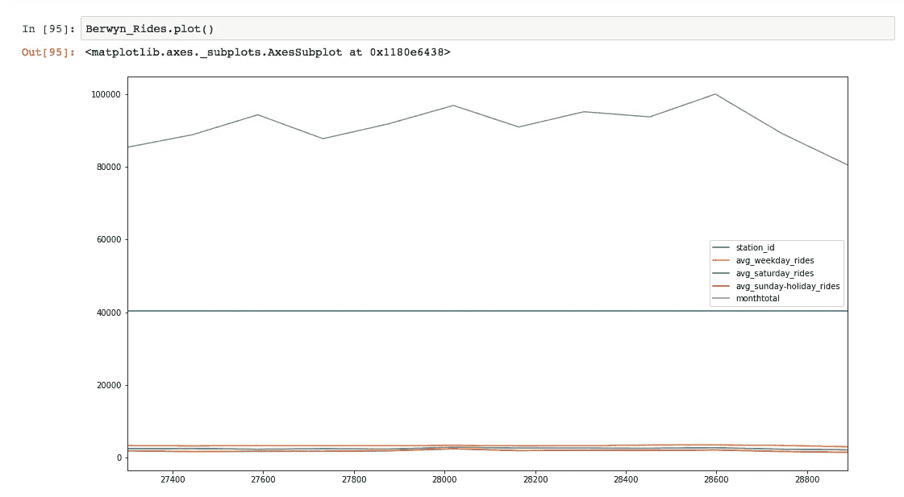**

**上图不是特别有用，尽管额外的参数(比如用于 x 和 y 轴的列)可以传递给。plot()函数来制作一个更有用的图形。下面，我将列名作为 x 和 y 参数传递，以绘制一段时间内工作日的平均乘车次数。**

```
Berwyn_Rides.plot(x ='date_time', y='avg_weekday_rides')
```

**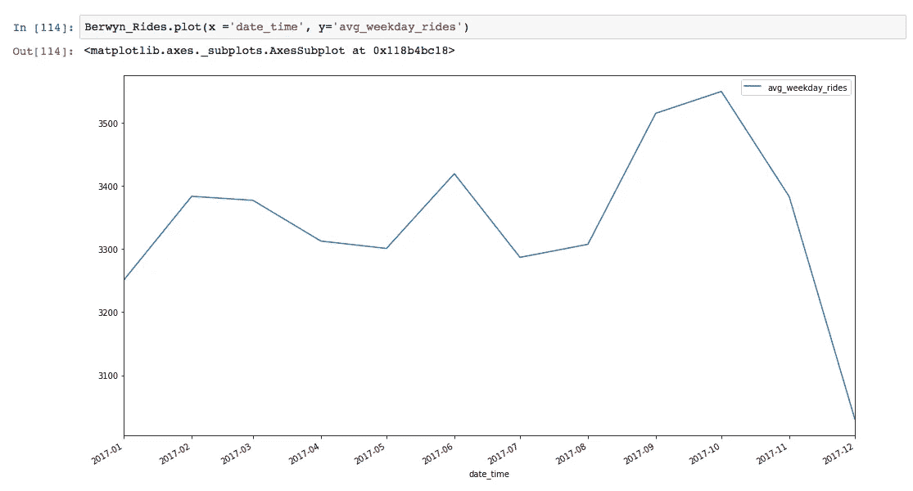**

**The above graph displays the Berwyn stop average weekday rides over the course of 2017.**

**默认情况下，pandas 使用线条绘制数据，尽管也可以使用许多其他可视化类型:直方图、盒状图、饼状图等。**

**为了演示这一点，我将创建一个排名前 25 位的 CTA 站点的条形图。我可以使用我们上面制作的 **Station_Totals** 数据帧，并传递**‘bar’**作为*‘kind’*参数和 **60** 作为‘rot’参数，将标签旋转 60 度。**

```
Station_Totals.head(25).plot(kind='bar',rot=60)
```

**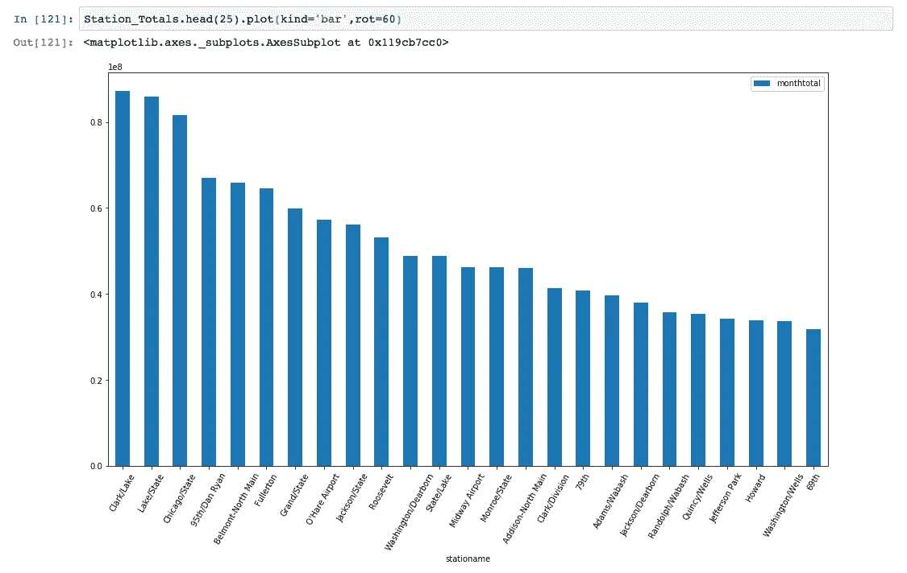**

**如您所见，pandas 中的绘图功能使用起来相当简单。因为 pandas 使用 matplotlib 库作为包装器，所以可以使用 matplotlib 的特性进一步定制绘图。**

**关于 pandas 的伟大之处在于数据帧可以在其他主要的 python 绘图包中使用。(即 [plot.ly](https://plot.ly/pandas/) 和 [Bokeh](https://bokeh.pydata.org/en/latest/) )。所以你不只是停留在一个选项来绘制你的数据。**

**[在我的下一篇文章](/exploring-and-visualizing-chicago-transit-data-using-pandas-and-bokeh-part-ii-intro-to-bokeh-5dca6c5ced10)(第 2 部分)中，我将介绍散景可视化包，开始可视化一些 CTA 交通数据。我还将尝试将 CTA 地图集成到可视化中，以提供关于乘客数据的地理上下文信息！敬请期待！希望你喜欢第 1 部分。**