# 使用 pandas 和散景探索和可视化芝加哥公交数据—第二部分(散景介绍)

> 原文：<https://towardsdatascience.com/exploring-and-visualizing-chicago-transit-data-using-pandas-and-bokeh-part-ii-intro-to-bokeh-5dca6c5ced10?source=collection_archive---------7----------------------->

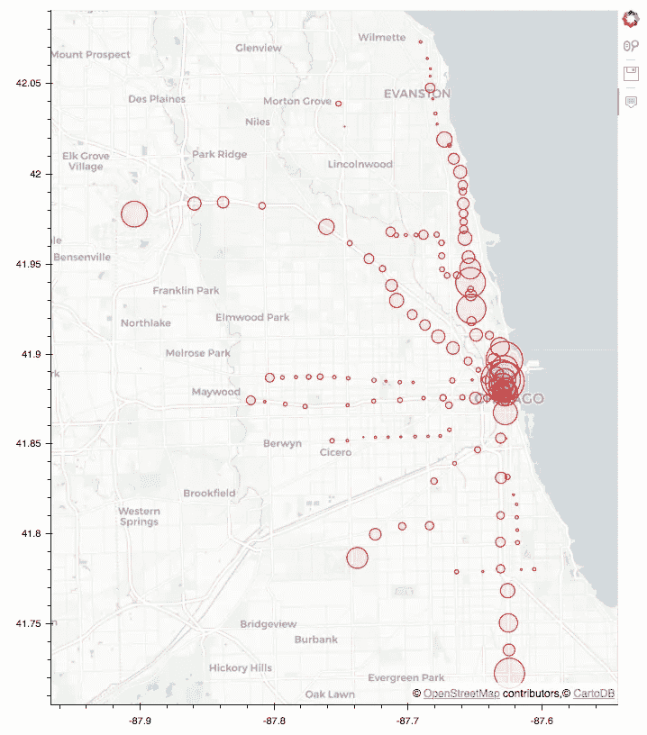

Live Version of the Plot: [https://cpreid2.github.io/Chicago-CTA/](https://cpreid2.github.io/Chicago-CTA/)

[***本系列的第 1 部分***](https://medium.com/@colinpatrickreid/exploring-and-visualizing-chicago-transit-data-using-pandas-and-bokeh-part-i-intro-to-pandas-5d6caa8813ef)**是对 pandas 的介绍，其中我描述了如何使用 python3 将大型开放存取数据集读入 Jupyter 笔记本，并演示了 pandas 作为高性能数据操作/分析软件包的一些功能。**

***在这个大数据时代，从空间和地理角度进行思考从未如此重要，创建引人注目的地理空间数据可视化已经成为数据科学家的一项基本技能。***

***我上一篇文章的目的是帮助回答一些关于芝加哥交通数据的问题。我关于数据集的第三个问题如下:***

> *****3。这个城市的哪个地区有最多的火车乘客？*****

***要回答这个问题，在地图上查看乘客数据很有帮助。随着 CTA 乘客数据加载到熊猫数据框架中，制作这样的地图是完全可能的。***

***在本文中，我将基于第 1 部分中使用的数据，介绍一个非常棒的交互式可视化库，名为[散景](https://bokeh.pydata.org/en/latest/)，它可以使用熊猫数据帧作为输入来创建交互式图形。***

***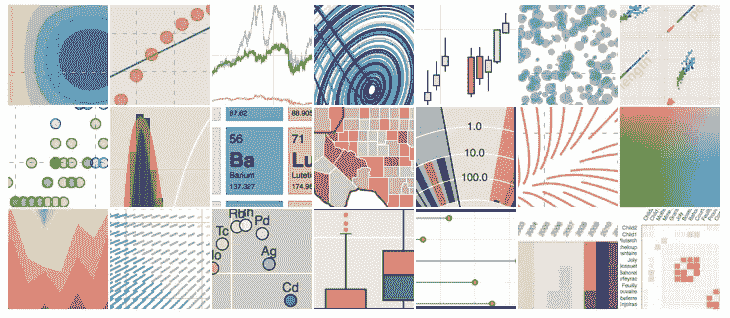***

***Source: [https://bokeh.pydata.org/en/latest/](https://bokeh.pydata.org/en/latest/)***

# ***什么是散景？***

***我喜欢子弹，所以这里有一些:***

*   ***Bokeh 是 python 的一个**数据可视化库*****
*   ***散景是为网络而建的***
*   *****创建由数据驱动的**动态和交互式图/图形*******

# *****为什么要用散景？*****

*****除了我说你应该使用散景之外，还有很多好的理由使用散景。您应该在以下情况下使用它:*****

*   *****你想构建交互式网络图形，但是比起 javascript，你更喜欢用 python 编码*****
*   *****您希望**使用大型数据集**。*****

*****关于散景的另一个优点是，它有一个[大型类库和函数库](https://bokeh.pydata.org/en/latest/docs/reference.html#)，所以你可以非常容易地构建非常高级的可视化效果。*****

*****总的来说，我发现它是一个制作漂亮的 web 2.0 可视化效果的非常简单的库。*****

# *****散景积木*****

*****您可以将散景图视为一系列对象。在最底层是一个**图形，**，在它上面你可以添加**字形。*******

*****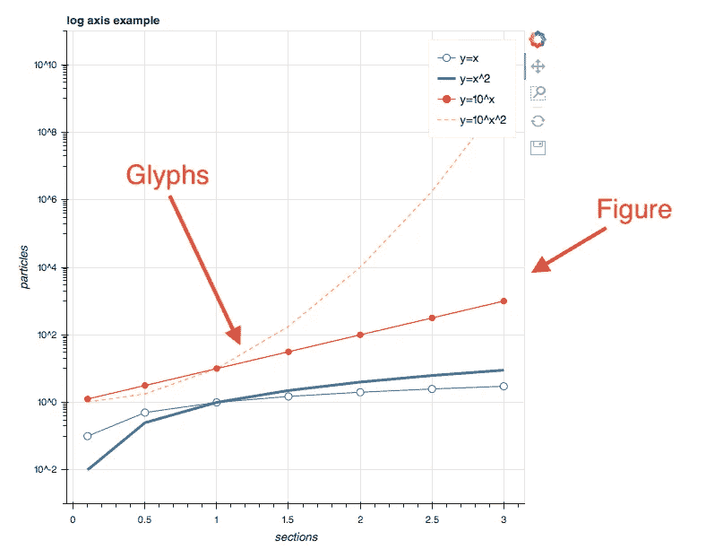*****

*****一个**图**是所有元素(即情节)的分组，而**字形**是散景可以显示的基本视觉标记。最基本的字形是一条[线](https://bokeh.pydata.org/en/latest/docs/reference/models/glyphs/line.html)。还有很多[其他字形](https://bokeh.pydata.org/en/latest/docs/reference/models/glyphs.html#bokeh-models-glyphs)，比如[圆](https://bokeh.pydata.org/en/latest/docs/reference/plotting.html#bokeh.plotting.figure.Figure.circle)、[条](https://bokeh.pydata.org/en/latest/docs/reference/plotting.html#bokeh.plotting.figure.Figure.hbar)、[楔](https://bokeh.pydata.org/en/latest/docs/reference/plotting.html#bokeh.plotting.figure.Figure.annular_wedge)等。最棒的是，你可以在一个图形上堆叠多个字形。*****

> *****在接下来的几节中，我将参考本系列第 1 部分中的数据帧。假设您已经在机器上安装了 Jupyter、pandas 和 Bokeh。*****

# *****构建您的第一个散景图*****

*****用散景构建一个简单的情节只需要几行代码。我们将遵循这一循序渐进的过程:*****

1.  *******导入必要的模块*******
2.  *******创建一个图*******
3.  *******添加字形*******
4.  *******显示/导出图形*******

*****我将为一些样本值构建一个简单的 x/y 图，对该图应用一些格式，然后显示该图。我可以用下面的代码做到这一点:*****

```
*****# 1\. Import Modules
**from bokeh.io import show, output_notebook
from bokeh.plotting import figure**# 2\. Create Figure
p = figure(plot_width = 600, plot_height = 400, title = 'My First Plot')# 3\. Add Glyphs
x = [1, 2, 3, 4, 5]
y = [10, 20, 40, 80, 160]p.circle(x, y, color = 'red', alpha = 0.5, size = 15)# 4\. Show the plot
output_notebook()
show(p)*****
```

**********

*****我将在下面的部分中分解生成该图的代码:*****

1.  *******导入模块:**show()和 output_notebook()函数用于显示 Jupyter 笔记本中的图形。如果您想生成一个静态 HTML 文件(用于创建独立的 web 应用程序)，您可以导入并使用 output_file()函数。还导入了 figure()类，它包含大多数用于显示对象的默认选项。*****
2.  *******创建 Figure** :要创建一个新的绘图，您需要实例化一个新的 Figure()类。用外行人的话来说，你创建一个新的人物对象。您可以向该函数传递参数来修改默认布局。例如，我设置了情节的高度和宽度，并给情节加了一个标题。*****
3.  *******添加字形:**可视化的要点是显示数据。我创建了两个数据列表(标记为 x 和 y)。虽然我已经创建了 python 列表，但是您可以使用 NumPy 数组或 Pandas 系列作为输入数据。有了数据，您可以将它传递给一个 render / Glyph 函数来呈现数据。这里我使用了[圆()](https://bokeh.pydata.org/en/latest/docs/reference/plotting.html#bokeh.plotting.figure.Figure.circle)字形。如果我愿意，我可以在这个列表中使用任何其他字形[。](https://bokeh.pydata.org/en/latest/docs/reference/plotting.html#bokeh.plotting.figure.Figure.circle)*****
4.  *******显示/导出:**我现在可以调用一些函数来显示剧情了。我调用 output_notebook()来渲染 Jupyter 笔记本中的情节。然后我调用 show()来实际渲染情节。*****

*****当剧情渲染时，你会注意到它是交互式的！您可以轻松地放大和缩小绘图。右边的工具控制这个功能。默认情况下，绘图包括缩放、保存和重置绘图的工具。你会看到这些都是[可定制的](https://bokeh.pydata.org/en/latest/docs/user_guide/tools.html)。*****

*****这就是全部了！现在让我们开始处理芝加哥的交通数据。*****

# *****创建 CTA 乘客的地理空间地图*****

## *****散景映射功能*****

*****散景非常适合处理地理空间数据。将地图数据添加到地块的方法与将其他类型的图示符添加到地物的方法相同。您将使用 **add_tiles()** 命令和一个 [tile provider](https://bokeh.pydata.org/en/latest/docs/reference/tile_providers.html) 作为参数来传入 tiles，而不是使用 circle()之类的东西。*****

*****要创建一个非常简单的地图，您可以使用以下代码:*****

```
*******from** **bokeh.plotting** **import** figure, show, output_notebook
**from** **bokeh.tile_providers** **import** CARTODBPOSITRONp = figure(x_range=(-9780000, -9745000), y_range=(5130000, 5160000),
           x_axis_type="mercator", y_axis_type="mercator")p.add_tile(CARTODBPOSITRON)output_notebook()
show(p)*****
```

*****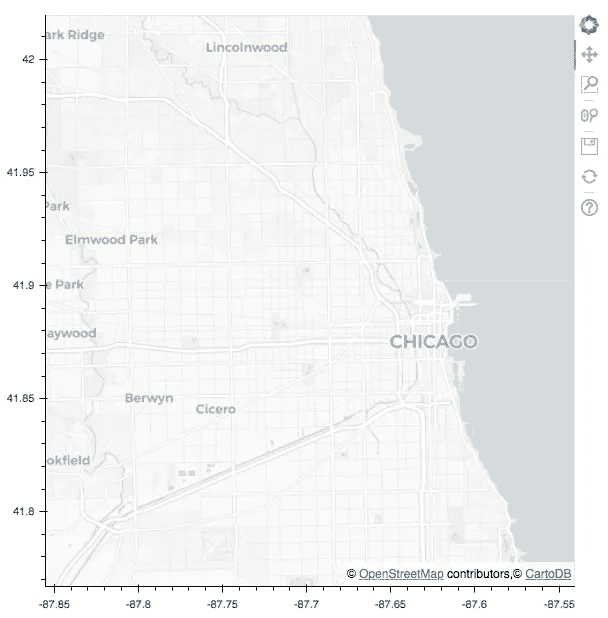*****

*****这段代码生成了一张芝加哥周围的地图。就像其他散景可视化一样，该地图是交互式的，允许用户放大和缩小地图。*****

> *****墨卡托投影:地图的拼贴使用了墨卡托投影。这里有一篇方便的[维基百科文章](https://en.wikipedia.org/wiki/Mercator_projection)描述了它是什么。本质上，地球的球面坐标(经纬度)可以投影到一个平面上(X 和 Y 坐标)。您在浏览器上以 2d 方式查看地图，因此这基本上就是用于显示数据的内容。*****

*****在上面的代码中，您可以看到图形是使用 X 和 Y 坐标绘制的。*****

*   *****在 figure()函数中，我可以传入 X 和 Y 范围，以便地图放大感兴趣的区域(芝加哥)。*****
*   *****x/y_axis_type 参数指定我希望以熟悉的纬度和经度坐标显示坐标。*****

*****有了绘制地图的能力，我们现在可以开始准备将乘客数据投影到地图上。*****

## *****读入 CTA 中转站位置数据*****

*****如第 1 部分所述，芝加哥市提供了每个中转站位于的[信息。我可以将它读入数据框，并使用以下 pandas 命令查看数据:](https://data.cityofchicago.org/Transportation/CTA-System-Information-List-of-L-Stops-Map/zbnc-zirh)*****

```
*****L_Map = pd.read_csv('CTA-L-Stops-Map.csv',sep=',')
L_Map.head()*****
```

*****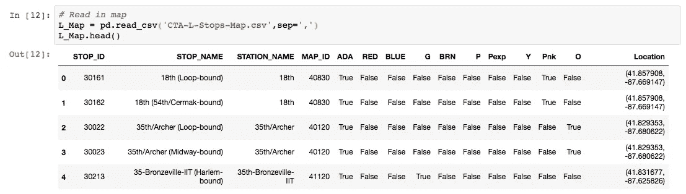*****

*****从这些数据中，我们注意到了一些情况:*****

*   *****每行代表一个不同的站点，由 STOP_ID 标识*****
*   *****每个站可以有**个停靠点(即一个站在一个方向上停靠，另一个站在另一个方向上停靠)*******
*   *****每个站点由站点名称和唯一的地图 ID 标识*****
*   *****该数据还包括关于每个站在哪条线上的信息(即绿色、红色、蓝色等)*****
*   *****最后一列包括纬度和经度坐标*****

*****正如我们在上一节中讨论的，为了绘图的目的，地图需要 X 和 Y 坐标(不是纬度和经度)。*****

*****为了改变这些，我们需要使用一些数学和一点熊猫魔法。*****

*****我创建了一个函数，它接受一串纬度和经度坐标(类似于 dataframe 中的坐标)，并将它们转换为一个 X 和 Y 坐标的元组。*****

```
*****import math
from ast import literal_eval**def merc**(Coords):
    Coordinates = literal_eval(Coords) lat = Coordinates[0]
    lon = Coordinates[1]

    r_major = 6378137.000
    x = r_major * math.radians(lon)
    scale = x/lon
    y = 180.0/math.pi * math.log(math.tan(math.pi/4.0 + 
        lat * (math.pi/180.0)/2.0)) * scale return (x, y)*****
```

**********

*****现在我们有了一个可以将坐标转换成 Bokeh 喜欢的东西的函数，我们可以将它应用到整个数据集，并将其保存为数据框中的一个新列。我在 [**的帮助下做到了这一点。熊猫中的 apply()**](https://pandas.pydata.org/pandas-docs/version/0.21/generated/pandas.DataFrame.apply.html) 函数和 python 中的一个 lambda 函数。*****

```
*****L_Map['coords_x'] = L_Map['Location'].**apply(lambda x: merc(x)[0])**
L_Map['coords_y'] = L_Map['Location'].**apply(lambda x: merc(x)[1])*******
```

*****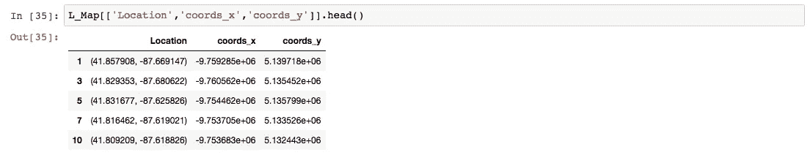*****

*****创建这些列后，我们现在有了可以在地图上绘制的数据。如前所述，L_Map 数据帧中的行对于每个站点都有重复的行(列车行驶的每个方向有 2 个站点)。因此，我们将想要删除这些重复，否则我们将有两个点每站。*****

*****为此，我使用了熊猫 [**。**drop _ duplicates()](http://pandas.pydata.org/pandas-docs/version/0.17/generated/pandas.DataFrame.drop_duplicates.html)命令:*****

```
*****L_Map.drop_duplicates(subset='MAP_ID', keep="last", inplace=True)*****
```

*****现在，我们可以在之前创建的地图上叠加车站。我只需添加一个圆形符号，将列作为 x 和 y 参数传递。*****

```
*****from bokeh.plotting import figure, show, output_notebook
from bokeh.tile_providers import CARTODBPOSITRONp = figure(x_axis_type="mercator", y_axis_type="mercator")
p.add_tile(CARTODBPOSITRON)**p.circle(x = L_Map['coords_x'],
         y = L_Map['coords_y'])**output_notebook()
show(p)*****
```

*****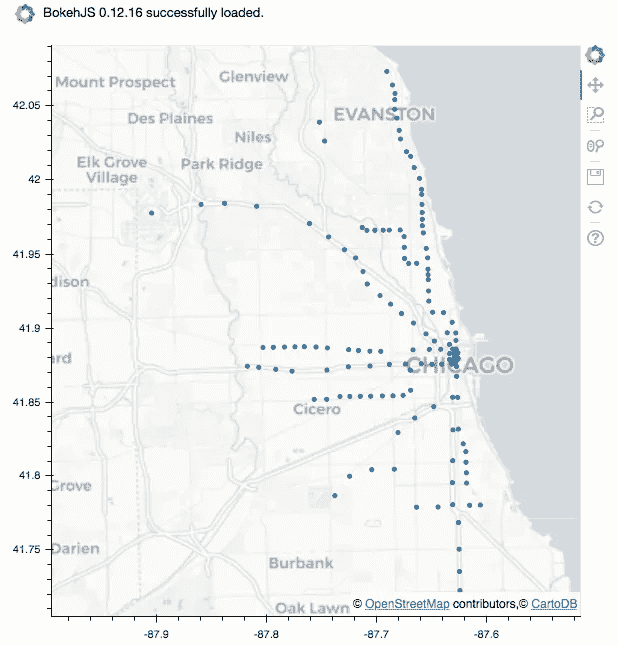*****

*****太好了！现在我们知道了每个 CTA 站在地图上的位置。*****

*******结合地理空间和乘客数据*******

*****该图表的目标是可视化最受欢迎和最不受欢迎的电台。这可以通过改变每个圆形符号的直径(或比例)来表示每个车站的相对乘客量来实现。较大的圆圈代表繁忙的车站，较小的圆圈代表乘客较少的车站。*****

*****第一步是**组合**包含乘客数据的数据帧和包含站 GPS 坐标的数据帧。我们将使用熊猫 [**。**merge()](https://pandas.pydata.org/pandas-docs/stable/generated/pandas.DataFrame.merge.html)功能。*****

*****此函数允许您指定 1)要合并的数据框，2)哪些列将用作键或合并两者的列，以及 3)它们的连接方式。*****

*****在下面的代码中，我将 **L_Map** 数据帧(包含坐标)与根据“station_id”列分组的 **Station_Totals** 数据帧(包含乘客总数)合并。*****

```
*****# 1\. Group ridership totals
Station_Group = L_Rides.groupby(['station_id'])
Station_Totals = pd.DataFrame(Station_Group['monthtotal'].sum())# 2\. Merge dataframes
Merged = pd.merge(L_Map, Station_Totals, left_on='MAP_ID', right_index=True)*****
```

*****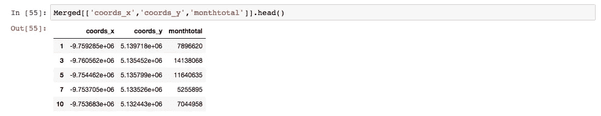*****

*****我们现在已经合并了乘客数据和地图数据！*****

*****接下来要做的是将乘客数据缩放到适当大小的圆。我选择了 2000000 作为缩放因子，因为它不会使圆圈太大或太小。一些尝试和错误帮助我确定了这个数字。*****

```
*****Merged['circle_sizes'] = Merged['monthtotal'] / 2000000*****
```

*****我们现在准备绘制我们的最终地图！我将把“circle_sizes”列传递给圆形标志符号，并添加一些其他参数来更改圆形的颜色和填充。*****

```
*****from bokeh.plotting import figure, show, output_notebook
from bokeh.tile_providers import CARTODBPOSITRON# range bounds supplied in web mercator coordinates
p = figure(x_axis_type="mercator", y_axis_type="mercator")
p.add_tile(CARTODBPOSITRON)p.circle(x=Merged['coords_x'],
         y=Merged['coords_y'], 
         **size=Merged['circle_sizes']**,
        ** line_color="#FF0000", 
         fill_color="#FF0000",
         fill_alpha=0.05**)

output_notebook()show(p)*****
```

*****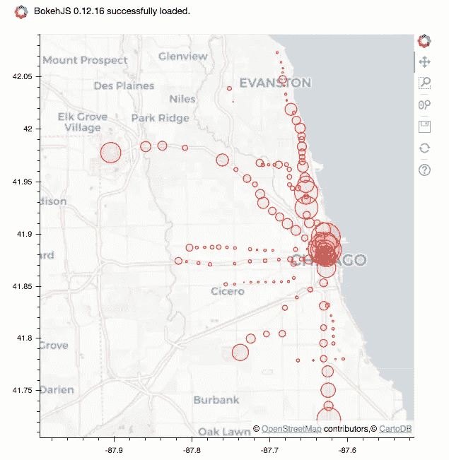*****

*****看起来棒极了！但是我们怎么知道哪个站是哪个站呢？*****

*****解决方案是定制默认工具。散景有交互式工具，可用于报告信息和更改绘图参数，如缩放级别或范围(如右侧面板所示)。*****

*****帮助我们的工具叫做 [**悬停工具**](https://bokeh.pydata.org/en/latest/docs/user_guide/tools.html#hovertool) 。当用户悬停在一个圆圈上时，我们可以用它来叠加每个站点的信息。*****

*****设置悬停工具需要两个部分:*****

1.  *****创建一个 [**ColumnDataSource**](https://bokeh.pydata.org/en/latest/docs/reference/models/sources.html) 对象，该对象将成为绘图的最终数据源。这个对象有其他功能，但是我们可以在另一篇文章中讨论*****
2.  *****创建一个悬停工具对象并将其指向 ColumnDataSource 对象*****

```
*****from bokeh.plotting import figure, show, output_notebook
from bokeh.tile_providers import CARTODBPOSITRON
from bokeh.models import ColumnDataSource, HoverTool**source = ColumnDataSource(data=dict(
                        x=list(Merged['coords_x']), 
                        y=list(Merged['coords_y']),
                        ridership=list(Merged['monthtotal']),
                        sizes=list(Merged['circle_sizes']),
                        stationname=list(Merged['STATION_NAME'])))****hover = HoverTool(tooltips=[
    ("station", "**[**@stationname**](http://twitter.com/stationname)**"),
    ("ridership","**[**@ridership**](http://twitter.com/ridership)**")

])**# range bounds supplied in web mercator coordinates
p = figure(x_axis_type="mercator", 
           y_axis_type="mercator",
           **tools=[hover, 'wheel_zoom','save']**)p.add_tile(CARTODBPOSITRON)p.circle(x='x',
         y='y', 
         **source=source,**
         size='sizes',
         line_color="#FF0000", 
         fill_color="#FF0000",
         fill_alpha=0.05)

output_notebook()show(p)*****
```

*****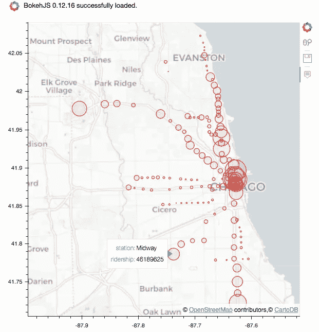*****

*****现在我们有能力看到哪个站是哪个了！悬停框包括原始乘客号和站名。*****

## *****我们现在可以开始研究数据并做一些笔记:*****

*****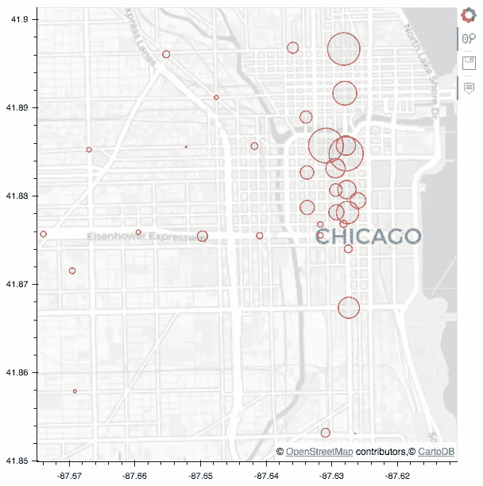*****

*   *****市区环路是 CTA 系统中最繁忙的部分(拥有最大的环路)。*****
*   *****95 号红线站作为终点站，客流量惊人。有一个项目来扩展 CTA 的这一部分是有意义的。*****
*   *****城西的蓝线和绿线并没有我想象的那么繁忙。*****
*   *****在芝加哥环线上，更南边和西边的火车站是最不繁忙的。*****

*****这里主持的剧情现场版:[https://cpreid2.github.io/Chicago-CTA/](https://cpreid2.github.io/Chicago-CTA/)*****

*****虽然我计划只制作这一系列的两个部分，但是我认为尝试在地图上添加一些动画特征会有所帮助，这样可以随着时间的推移查看数据。我将在以后的文章中介绍这一点，敬请关注！*****