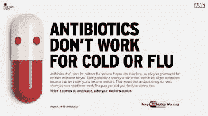
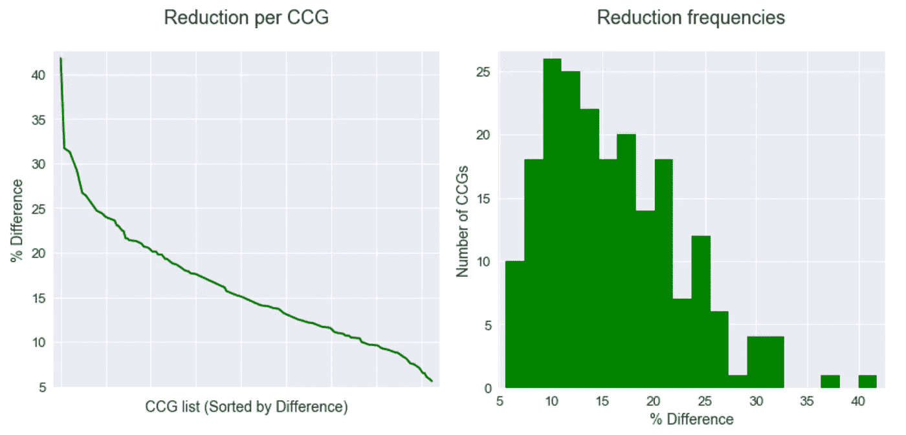
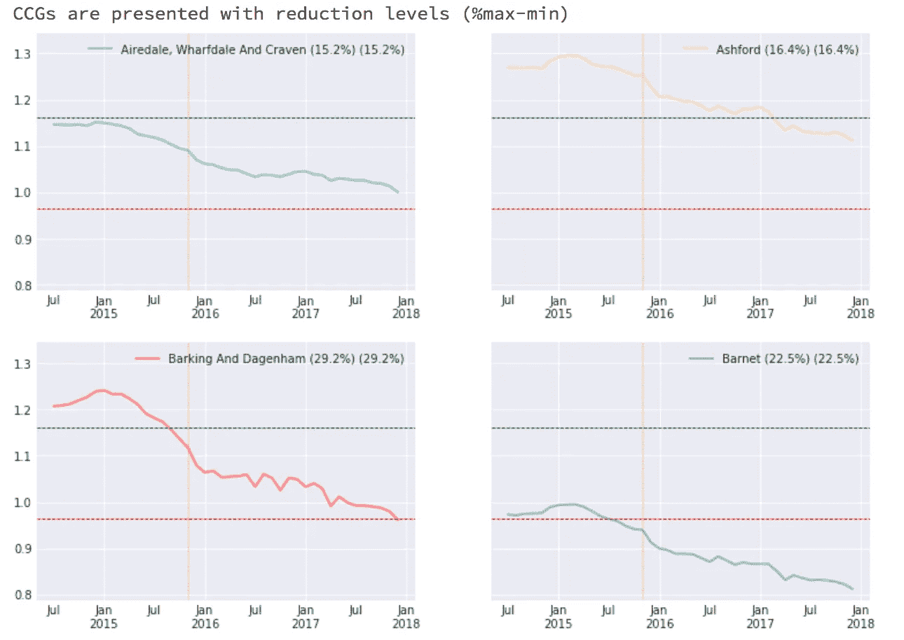
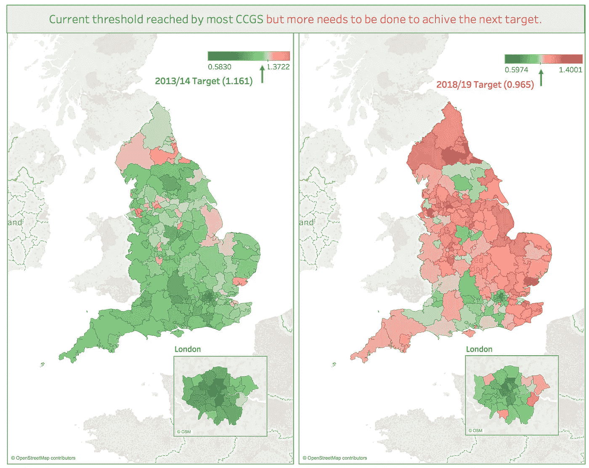
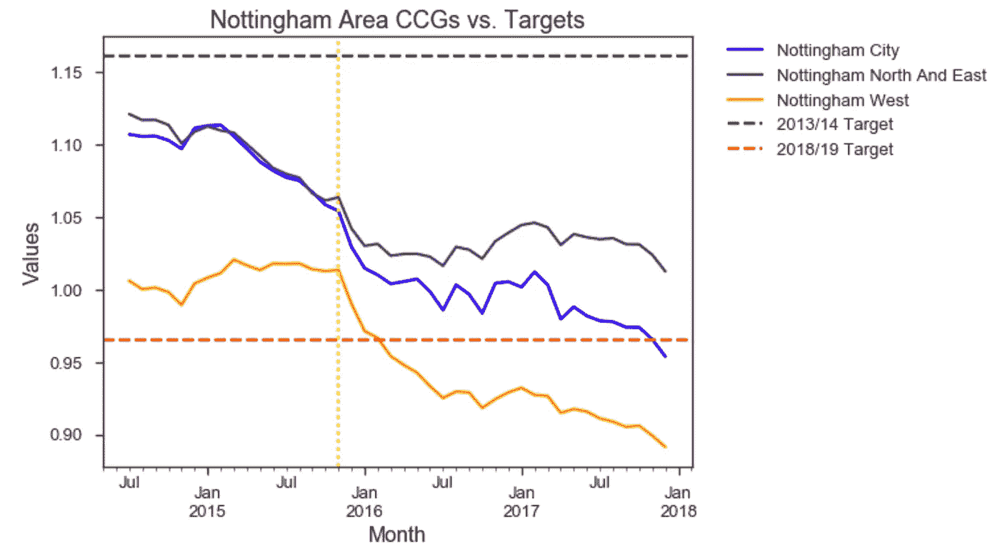

# 用 Python 和 Tableau 探索抗生素处方

> 原文：<https://towardsdatascience.com/exploring-antibiotic-prescribing-with-python-and-tableau-21c9bbd7b400?source=collection_archive---------10----------------------->

我最近参观了在伦敦卫生和热带医学院举行的“超级细菌——对抗细菌的军备竞赛”(哈佛大学出版社)的新书发布会。发起的作者和小组成员利用这个平台表达了他们对公共卫生的担忧，以及对开发新疗法的有限激励。据估计(2014 年)每年有 700，000 人死于耐药性感染，而只有很少的药物在研发中，这一警报需要保持在头条位置。

与此同时，我希望听到更多关于近年来取得的进展。2013 年，英国政府启动了一项[五年战略](https://www.gov.uk/government/publications/uk-5-year-antimicrobial-resistance-strategy-2013-to-2018)来对抗抗生素耐药性。一年后，这本书的作者对英国的形势进行了一次广泛的回顾。甚至在审查之前就开始实施的战略效果如何？我决定使用由英国公共卫生部(PHE)维护和提供的 AMR 本地指标来探索这个问题，作为英国战略监测组成部分的一部分。我想看看我是否能够深入了解当地和地区的抗生素使用模式，以及我是否能够提供额外的可视化和分析模式。

我开始使用在临床委托组(ccg)级别获得的数据进行研究。英格兰保健委员会是 2012 年成立的 208 个区域组织，旨在组织英格兰的保健服务。他们的数据给出了不同地区处方模式的总体情况，随后可以在更精细的水平上进行探索。所有指标/ccg 的数据作为一个数据集可用，但使用由 PHE 数据科学小组开发的[指尖库](https://cran.r-project.org/web/packages/fingertipsR/index.html)可以更方便地进行研究。使用 Python (pandas、seaborn、plotly)进行数据准备、清理和分析，使用 Tableau 的故事功能构建仪表盘。脚本可以作为 [jupyter 笔记本](https://github.com/ronyarmon/AMR)和仪表盘[在这里](https://public.tableau.com/profile/rony.armon#!/vizhome/prescribing_reduction_extract/Story)和[在这里](https://public.tableau.com/profile/rony.armon#!/vizhome/AntibioticsprescribingtimeseriesEngland2014-2017/Story1)获得。

仪表板基于每个 CCG 地区每个标准化处方单位(STAR-PU)12 个月的抗生素处方项目滚动总数。这种标准化不仅考虑到每个地区的患者人数，还考虑到他们的年龄和性别构成以及周期性波动，因此只能呈现总体趋势。为了[计算](https://github.com/ronyarmon/AMR/blob/master/preparation%26calculations/reduction.ipynb)减少的变化，我提取了指标的数据，然后使用 pandas 的描述性模块收集该期间的最大值和最小值，并计算处方中的差异和相对差异。

结果表明，所有 ccg 在此期间都降低了他们的处方水平，但一些 ccg 的处方水平显著下降，降幅在 20-40%之间，大多数 ccg 的处方水平下降了 10-15%。因此，对[所有 ccg](http://nbviewer.jupyter.org/github/ronyarmon/AMR/blob/cd431f535dd9e624fb5803d63bb461637f8879ab/time_series/Time_series-All_ccgs.ipynb)的单个时间序列的比较显示，在活动开始时的起点和减排力度方面，情况非常不一致:

国民医疗服务体系(NHS)制定的处方目标中的绿线和红线:竞选开始时的目标(1.161，绿色)和 2018/19 年更雄心勃勃的目标(0.965，红色)。为了方便直观地比较所有 ccg 与这些目标的关系，我对数据集中最近一年(截至 2017 年 12 月的 12 个月)的值进行了切片，将数据连接到英国国家统计局提供的 ccg 边界，并使用 Tableau 的映射功能绘制了连接的数据框架。其结果是一张与国民保健制度设定的早期和晚期目标相关的处方减少图:

虽然大多数 ccg 尚未实现更雄心勃勃的目标，但迄今为止看到的减少应被视为减少处方的努力的标志。虽然该战略是在全国范围内进行评估的，但数据表明，地方努力也应得到考虑。伦敦的大多数 ccg 已经实现了这两个目标；诺丁汉一个 ccg 的评论员看了数据后指出，他们在早期阶段就实现了这两个目标。这些成就，从下面的时间序列中可以清楚地看到，主要是由于当地的努力。

观察到的总体减少表明，该战略确实对抗生素处方有显著影响，但也需要考虑地方努力的故事。成功的故事不仅能鼓舞人心，还能提示干预最有效的领域。另一方面，应该听取仍在努力实现目标的 ccg 代表的意见，以了解他们对需要做出更多努力的领域的看法。虽然地理空间和时间序列分析经常被用来可视化总体趋势，但我发现它们在公共卫生问题的局部空隙中是有用的。

# 附加说明

***项目文件及成果***:[https://github.com/ronyarmon/AMR](https://github.com/ronyarmon/AMR)

[总结并向英国议会健康和社会保健委员会(2018 年)设立的抗生素耐药性调查提交结果](https://www.researchgate.net/publication/326067145_Antimicrobial_resistance_AMR_inquiry_submission)

一项关于[抗生素处方与不同社会人口统计剥夺指数相关的随访研究](https://www.researchgate.net/publication/328172326_Antibiotic_Prescribing_and_Sociodemographic_Deprivation-From_General_Index_to_Specific_Domains)

[*英国 5 年抗菌药物耐药策略*](https://www.gov.uk/government/publications/uk-5-year-antimicrobial-resistance-strategy-2013-to-2018)

[*英国抗菌药物耐药性综述*](https://amr-review.org/)

***仪表盘*** : [AMR 指标(PHE)](https://fingertips.phe.org.uk/profile/amr-local-indicators/data#page/4/gid/1938132909/pat/46/par/E39000030/ati/152/are/E38000010) ，[药品优化(NHS)](https://apps.nhsbsa.nhs.uk/MOD/AtlasCCGMedsOp/atlas.html)，[抗菌数据月报(PrescQIPP)](https://www.prescqipp.info/pqva/visual-snapshot-ams)