# 探索、聚类和映射多伦多的犯罪

> 原文：<https://towardsdatascience.com/exploring-clustering-and-mapping-torontos-crimes-96336efe490f?source=collection_archive---------2----------------------->


Photo credit: Pixabay

我通过开放数据门户网站探索美国城市的犯罪数据，从中获得了很多乐趣，因为多伦多的犯罪数据根本不可用。

然而，在今年夏天，多伦多警方推出了一个公共安全数据门户网站，以增加公众和官员之间的透明度。因此，我有机会通过[多伦多警察局公共安全数据门户](http://data.torontopolice.on.ca/pages/open-data)探索多伦多的犯罪。我对[2016 年主要犯罪指标(MCI)](http://data.torontopolice.on.ca/datasets?t=MCI)特别感兴趣，它包含了 2016 年 32，612 份报告的列表(这是唯一有数据可用的一年)。

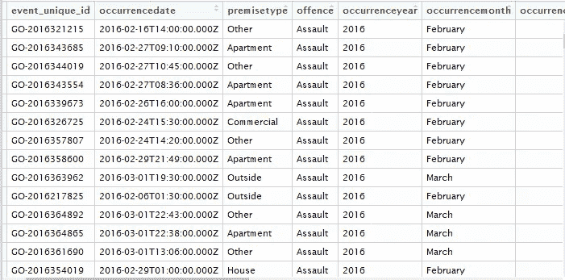

我们用 R 来看看数据，看看有没有什么有趣的。

# 数据

```
library(ggplot2)
library(ggthemes)
library(dplyr)
library(viridis)
library(tidyr)
library(cluster)
library(ggmap)
library(maps)
```

经过一点探索，我发现有很多重复(event_unique_id)，所以让我们从数据中删除它。

```
toronto <- read.csv('toronto_crime.csv')
toronto <- subset(toronto, !duplicated(toronto$event_unique_id))
unique(toronto$occurrenceyear)
unique(toronto$reportedyear)
```

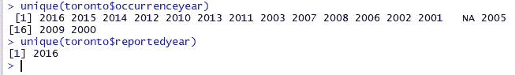

发现什么有趣的东西了吗？发生年份从 2000 年到 2016 年不等，但所有犯罪的报告年份都是 2016 年。这意味着人们在 2016 年向警方报告了前几年发生的事件。让我们看看我们的数据中有多少延迟报告的事件。

```
year_group <- group_by(toronto, occurrenceyear)
crime_by_year <- summarise(year_group,
                          n = n())
crime_by_year
```

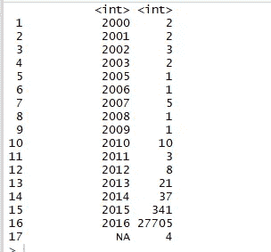

2 起发生在 2000 年，2 起发生在 2001 年，以此类推。但是，绝大多数事件发生在 2016 年，因此我们将只使用 2016 年的事件。我还删除了我们不需要的所有列，以及缺少值的四行。

```
drops <- c("X", "Y", "Index_", "ucr_code", "ucr_ext", "reporteddate", "reportedmonth", "reportedday", "reporteddayofyear", "reporteddayofweek", "reportedhour", "occurrencedayofyear", "reportedyear", "Division", "Hood_ID", "FID")toronto <- toronto[, !(names(toronto) %in% drops)]
toronto <- toronto[toronto$occurrenceyear == 2016, ]
toronto <- toronto[complete.cases(toronto), ]
```

# 探索

**2016 年有哪些重大犯罪？**

```
indicator_group <- group_by(toronto, MCI)
crime_by_indicator <- summarise(indicator_group, n=n())
crime_by_indicator <- crime_by_indicator[order(crime_by_indicator$n, decreasing = TRUE),]ggplot(aes(x = reorder(MCI, n), y = n), data = crime_by_indicator) +
  geom_bar(stat = 'identity', width = 0.5) +
  geom_text(aes(label = n), stat = 'identity', data = crime_by_indicator, hjust = -0.1, size = 3.5) +
  coord_flip() +
  xlab('Major Crime Indicators') +
  ylab('Number of Occurrences') +
  ggtitle('Major Crime Indicators Toronto 2016') +
  theme_bw() +
  theme(plot.title = element_text(size = 16),
        axis.title = element_text(size = 12, face = "bold"))
```

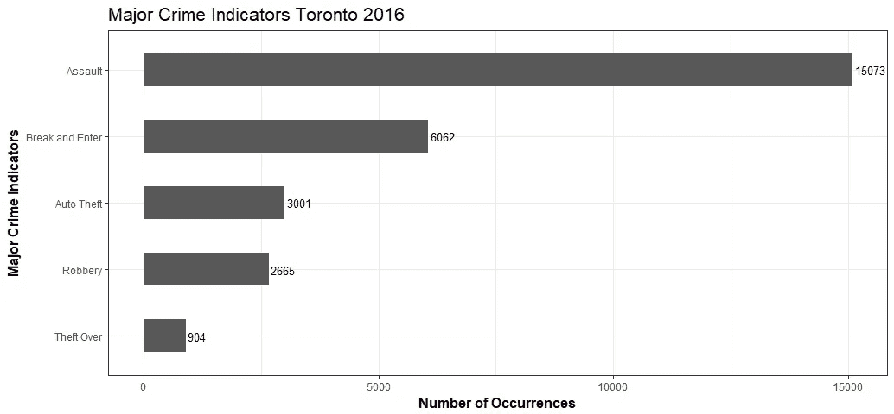

Figure 1

袭击是多伦多最普遍的暴力犯罪形式。什么是攻击？在刑法和民法中,[攻击是指试图与他人进行有害的或冒犯性的接触，或威胁这样做。](https://en.wikipedia.org/wiki/Assault)

**突击有哪些不同的类型？哪种类型最差？**

```
assault <- toronto[toronto$MCI == 'Assault', ]
assault_group <- group_by(assault, offence)
assault_by_offence <- summarise(assault_group, n=n())
assault_by_offence <- assault_by_offence[order(assault_by_offence$n, decreasing = TRUE), ]ggplot(aes(x = reorder(offence, n), y = n), data = assault_by_offence) +
  geom_bar(stat = 'identity', width = 0.6) +
  geom_text(aes(label = n), stat = 'identity', data = assault_by_offence, hjust = -0.1, size = 3) +
  coord_flip() +
  xlab('Types of Assault') +
  ylab('Number of Occurrences') +
  ggtitle('Assault Crime Toronto 2016') +
  theme_bw() +
  theme(plot.title = element_text(size = 16),
        axis.title = element_text(size = 12, face = "bold"))
```

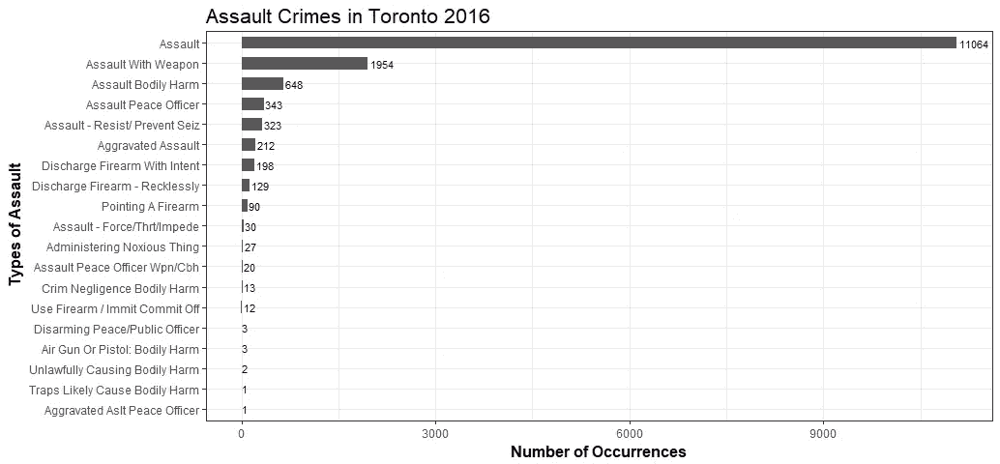

Figure 2

这里没有太多的信息，因为最常见的攻击类别是…攻击。我最终通过 Attorneys.com 学会了不同类型的攻击。

**然后让我们看看最严重的犯罪**

```
offence_group <- group_by(toronto, offence)
crime_by_offence <- summarise(offence_group, n=n())
crime_by_offence <- crime_by_offence[order(crime_by_offence$n, decreasing = TRUE), ]ggplot(aes(x = reorder(offence, n), y = n), data = crime_by_offence) +
  geom_bar(stat = 'identity', width = 0.7) +
  geom_text(aes(label = n), stat = 'identity', data = crime_by_offence, hjust = -0.1, size = 2) +
  coord_flip() +
  xlab('Types of Offence') +
  ylab('Number of Occurrences') +
  ggtitle('Offence Types Toronto 2016') +
  theme_bw() +
  theme(plot.title = element_text(size = 16),
        axis.title = element_text(size = 12, face = "bold"))
```

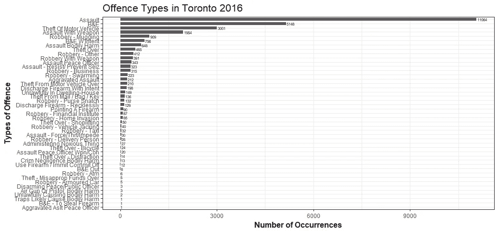

Figure 3

袭击是最常见的犯罪，其次是破门而入。根据 Wikibooks 的说法，最典型的破门而入形式是闯入商业地产或私人住宅以窃取财产。这表明破门而入最有可能发生在家里或办公室没有人的时候。

**一天中的犯罪时间怎么样？**

```
hour_group <- group_by(toronto, occurrencehour)
crime_hour <- summarise(hour_group, n=n())ggplot(aes(x=occurrencehour, y=n), data = crime_hour) + geom_line(size = 2.5, alpha = 0.7, color = "mediumseagreen", group=1) + 
  geom_point(size = 0.5) + 
  ggtitle('Total Crimes by Hour of Day in Toronto 2016') +
  ylab('Number of Occurrences') +
  xlab('Hour(24-hour clock)') +
  theme_bw() +
  theme(plot.title = element_text(size = 16),
        axis.title = element_text(size = 12, face = "bold"))
```

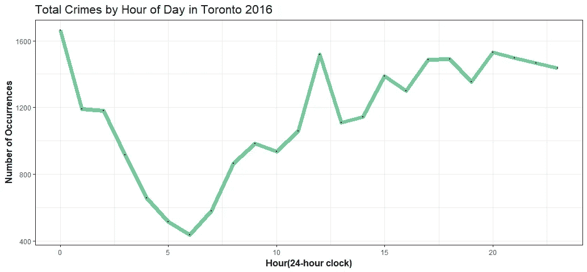

Figure 4

最糟糕的时间是在午夜左右，另一个高峰时间是在中午左右，然后是晚上 8 点左右。

**好吧，但是一天中的每个小时什么类型的犯罪最频繁？**

```
hour_crime_group <- group_by(toronto, occurrencehour, MCI)
hour_crime <- summarise(hour_crime_group, n=n())ggplot(aes(x=occurrencehour, y=n, color=MCI), data = hour_crime) + 
  geom_line(size=1.5) + 
  ggtitle('Crime Types by Hour of Day in Toronto 2016') +
  ylab('Number of Occurrences') +
  xlab('Hour(24-hour clock)') +
  theme_bw() +
  theme(plot.title = element_text(size = 16),
        axis.title = element_text(size = 12, face = "bold"))
```

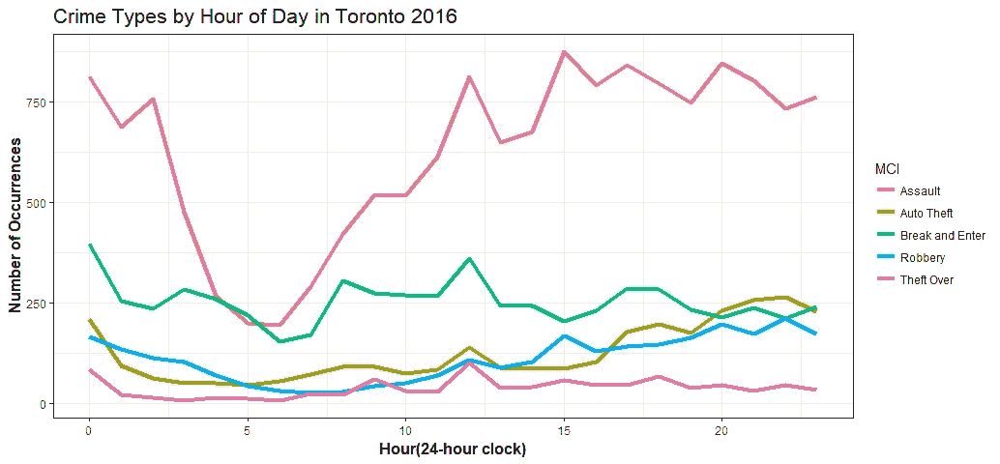

Figure 5

虽然袭击是一天中最常见的犯罪，但它们发生在傍晚和夜间的频率高于清晨。另一方面，破门而入的犯罪更经常发生在早上和午夜左右(那时没有人在家或在办公室)。抢劫和汽车盗窃更有可能在深夜发生。所有这些模式都有意义。

这些犯罪最有可能发生在多伦多的什么地方？

```
location_group <- group_by(toronto, Neighbourhood)
crime_by_location <- summarise(location_group, n=n())
crime_by_location <- crime_by_location[order(crime_by_location$n, decreasing = TRUE), ]
crime_by_location_top20 <- head(crime_by_location, 20)ggplot(aes(x = reorder(Neighbourhood, n), y = n), data = crime_by_location_top20) +
  geom_bar(stat = 'identity', width = 0.6) +
  geom_text(aes(label = n), stat = 'identity', data = crime_by_location_top20, hjust = -0.1, size = 3) +
  coord_flip() +
  xlab('Neighbourhoods') +
  ylab('Number of Occurrences') +
  ggtitle('Neighbourhoods with Most Crimes - Top 20') +
  theme_bw() +
  theme(plot.title = element_text(size = 16),
        axis.title = element_text(size = 12, face = "bold"))
```

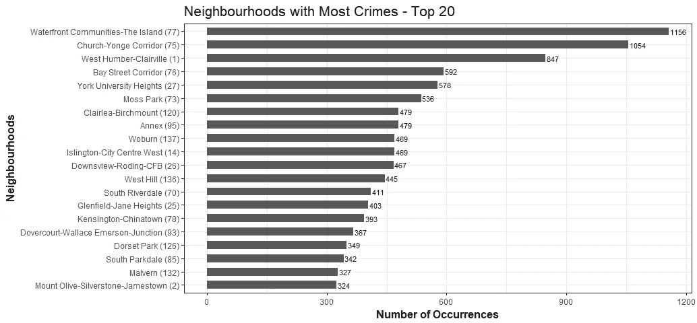

Figure 6

最危险的街区是…滨水区。[这个不断扩张的市中心包罗万象，不仅包括密集的公寓社区，还包括极度活跃的娱乐区。结果是:这里发生了数量惊人的暴力犯罪和纵火案。](https://torontolife.com/crime/)


Photo credit: Pixabay

第二危险的街区是教堂-央街走廊。它很受学生的欢迎，因为它靠近瑞尔森大学，而且它是多伦多同性恋村的一方的家。然而，这个地区也有它的犯罪问题，考虑到它离市中心有多近，这有点令人惊讶。

哪里是最安全的社区？

```
tail(crime_by_location, 5)
```

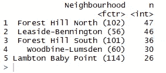

考虑搬到多伦多吗？我们已经为你选好了新家！森林山南是多伦多一个安全、华丽和富裕的社区，拥有许多漂亮的房子，比如这栋豪宅。


Photo credit: Torontorentals.com

**让我们比较一下犯罪率最高的街区**。

```
offence_location_group <- group_by(toronto, Neighbourhood, offence)
offence_type_by_location <- summarise(offence_location_group, n=n())
offence_type_by_location <- offence_type_by_location[order(offence_type_by_location$n, decreasing = TRUE), ]
offence_type_by_location_top20 <- head(offence_type_by_location, 20)ggplot(aes(x = Neighbourhood, y=n, fill = offence), data=offence_type_by_location_top20) +
  geom_bar(stat = 'identity', position = position_dodge(), width = 0.8) +
  xlab('Neighbourhood') +
  ylab('Number of Occurrence') +
  ggtitle('Offence Type vs. Neighbourhood Toronto 2016') + theme_bw() +
  theme(plot.title = element_text(size = 16),
        axis.title = element_text(size = 12, face = "bold"),
        axis.text.x = element_text(angle = 90, hjust = 1, vjust = .4))
```

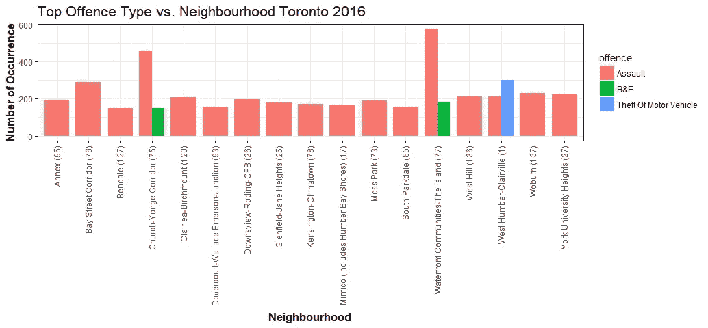

Figure 7

我没想到会这样。它不漂亮。然而，它确实告诉我们，除了袭击事件，教堂-央街走廊和海滨是破门而入犯罪最多的地方(不要去那里！)，西亨伯-克莱尔维尔的车辆失窃率最高(不要把车停在那里！).

**让我们试试不同的东西**

```
crime_count <- toronto %>% group_by(occurrencemonth, MCI) %>% summarise(Total = n())
crime_count$occurrencemonth <- ordered(crime_count$occurrencemonth, levels = c('January', 'February', 'March', 'April', 'May', 'June', 'July', 'August', 'September', 'October', 'November', 'December'))ggplot(crime_count, aes(occurrencemonth, MCI, fill = Total)) +
  geom_tile(size = 1, color = "white") +
  scale_fill_viridis()  +
  geom_text(aes(label=Total), color='white') +
  ggtitle("Major Crime Indicators by Month 2016") +
  xlab('Month') +
  theme(plot.title = element_text(size = 16), 
        axis.title = element_text(size = 12, face = "bold"))
```

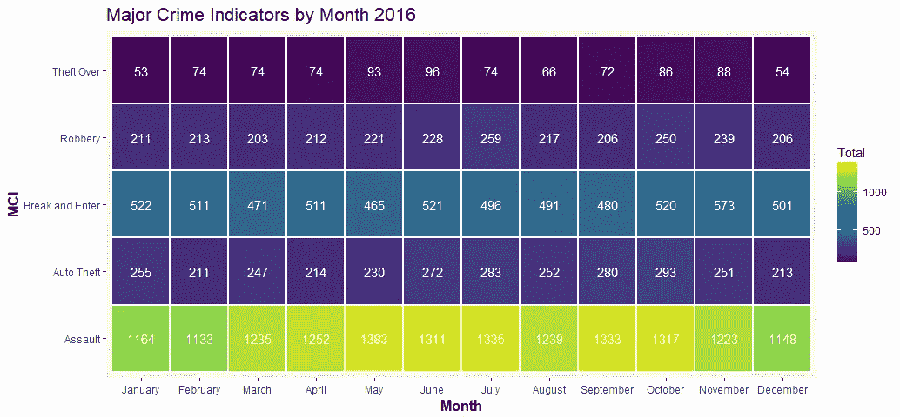

Figure 8

好多了！

人身攻击是一年中每个月最常见的犯罪类型，无一例外。5 月份的袭击事件似乎比去年其他月份都多。

```
day_count <- toronto %>% group_by(occurrencedayofweek, MCI) %>% summarise(Total = n())ggplot(day_count, aes(occurrencedayofweek, MCI, fill = Total)) +
  geom_tile(size = 1, color = "white") +
  scale_fill_viridis()  +
  geom_text(aes(label=Total), color='white') +
  ggtitle("Major Crime Indicators by Day of Week 2016") +
  xlab('Day of Week') +
  theme(plot.title = element_text(size = 16), 
        axis.title = element_text(size = 12, face = "bold"))
```

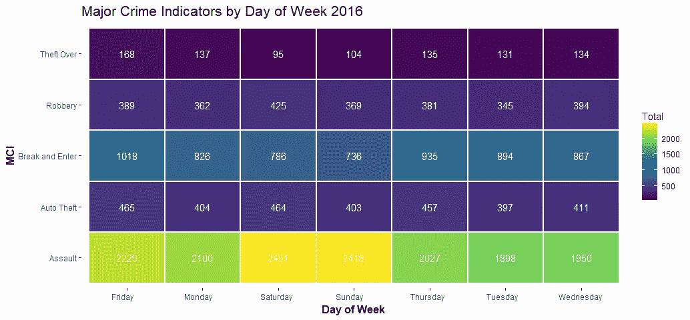

Figure 9

周六和周日比一周中的其他任何一天有更多的袭击，比其他任何一天有更少的盗窃。偷车贼几乎每天都很忙。

我希望发现一些季节性犯罪模式，如温度变化和日照时间可能与全年的犯罪有关，或者学年的开始和结束与全年的犯罪变化有关。但这一年的数据不足以解决我的上述担忧。我希望在不久的将来，多伦多警察局将通过其开放数据门户发布更多的数据。

**凶杀案**

```
homicide <- read.csv('homicide.csv', stringsAsFactors = F)
homicide$Occurrence_Date <- as.Date(homicide$Occurrence_Date)year_group <- group_by(homicide, Occurrence_year, Homicide_Type)
homicide_by_year <- summarise(year_group, n=n())ggplot(aes(x = Occurrence_year, y=n, fill = Homicide_Type), data=homicide_by_year) +
  geom_bar(stat = 'identity', position = position_dodge(), width = 0.8) +
  xlab('Year') +
  ylab('Number of Homicides') +
  ggtitle('Homicide 2004-2016') + theme_bw() +
  theme(plot.title = element_text(size = 16),
        axis.title = element_text(size = 12, face = "bold"))
```

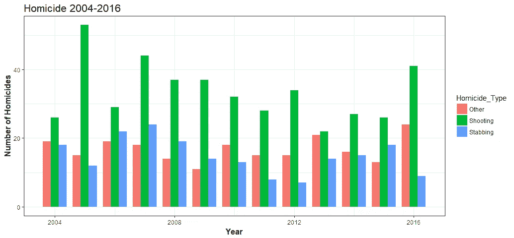

Figure 10

2005 年被称为多伦多的“T2 枪年”。11 年后的 2016 年，多伦多的涉枪杀人案再次激增。

```
homicide$month <- format(as.Date(homicide$Occurrence_Date) , "%B")homicide_count <- homicide %>% group_by(Occurrence_year, month) %>% summarise(Total = n())
homicide_count$month <- ordered(homicide_count$month, levels = c('January', 'February', 'March', 'April', 'May', 'June', 'July', 'August', 'September', 'October', 'November', 'December'))
ggplot(homicide_count, aes(Occurrence_year, month, fill = Total)) +
  geom_tile(size = 1, color = "white") +
  scale_fill_viridis()  +
  geom_text(aes(label=Total), color='white') +
  ggtitle("Homicides in Toronto (2004-2016)") +
  xlab('Year') +
  theme(plot.title = element_text(size = 16), 
        axis.title = element_text(size = 12, face = "bold"))
```

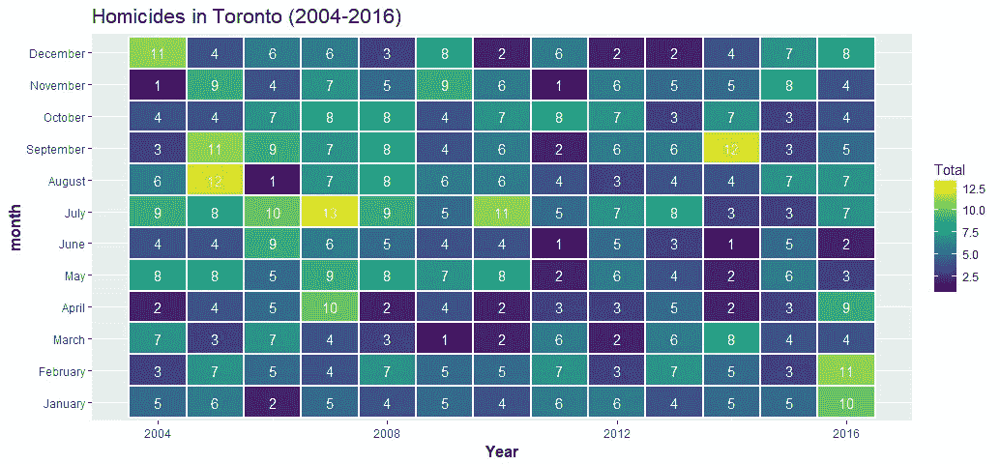

Figure 11

令人担忧的是，与 2015 年相比，2016 年多伦多的凶杀案总数大幅增加。希望我们有一个更好的 2017 年。然而，当我读到[多伦多被经济学家](https://globalnews.ca/news/3798979/toronto-safest-city-north-america/)评为北美最安全的城市时，我感觉安全多了。

# **K 均值聚类**

K-Means 是最流行的“聚类”算法之一。它是将数据点组划分为少量簇的过程。使用我们的犯罪数据，当我们测量攻击数量和其他指标时，攻击数量高的街区将被分组在一起。K 均值聚类的目标是为每个数据点(邻域)分配一个聚类。我们首先将数据点(邻域)划分为 *k* 个聚类，其中每个邻域属于具有最近平均值的聚类(用作聚类的原型)。

作为一种无监督学习算法，我们使用 K-Mean 来建立模型，帮助我们更好地理解我们的数据。它使我们能够对未标记的数据点进行分组。

**为了进行聚类分析，我们的数据必须如下所示**:

```
by_groups <- group_by(toronto, MCI, Neighbourhood)
groups <- summarise(by_groups, n=n())
groups <- groups[c("Neighbourhood", "MCI", "n")]
groups_wide <- spread(groups, key = MCI, value = n)
```

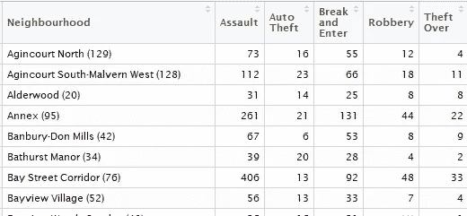

**第一列——定性数据应从分析中移除**

```
z <- groups_wide[, -c(1,1)]
```

**数据不能有任何缺失值**

```
z <- z[complete.cases(z), ]
```

**必须对数据进行缩放以进行比较**

```
m <- apply(z, 2, mean)
s <- apply(z, 2, sd)
z <- scale(z, m, s)
```

**确定集群的数量**

```
wss <- (nrow(z)-1) * sum(apply(z, 2, var))
for (i in 2:20) wss[i] <- sum(kmeans(z, centers=i)$withiness)
plot(1:20, wss, type='b', xlab='Number of Clusters', ylab='Within groups sum of squares')
```

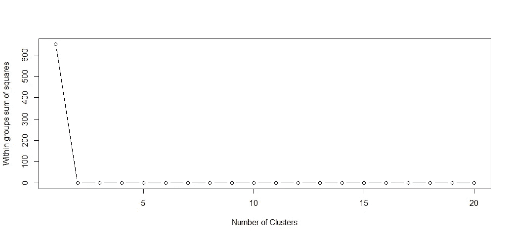

Figure 12

由于该图显示了一个非常强的肘形，基于该图，我们可以有把握地说，我们不需要两个以上的群集(质心)。

**试衣模特**

```
kc <- kmeans(z, 2)
kc
```

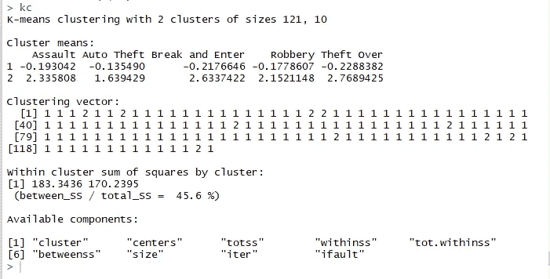

**释义:**

*   第一类有 121 个街区，第二类有 10 个街区。
*   聚类意味着:如果这些数字的范围看起来很奇怪，那是因为我们在进行聚类分析之前对数据进行了标准化。负值表示“低于大多数”，正值表示“高于大多数”。因此，集群 1 具有低攻击、低汽车盗窃、低破门而入、低抢劫和低盗窃的街区。第 2 类社区具有高攻击性、高汽车盗窃、高非法闯入、高抢劫和高盗窃率。这两组在每一个变量上都有显著的差异，这是好事，因为这表明每一个变量在聚类分类中都起着重要的作用。
*   聚类向量:第一、第二和第三邻域应该都属于聚类 1，第四邻域应该属于聚类 2，等等。
*   更相关的度量是“在内”和“在之间”。
    withinss 告诉我们每个数据点到聚类中心的距离的平方和。越低越好。betwess 告诉我们聚类中心之间距离的平方和。理想情况下，我们希望聚类中心彼此远离。
*   可用组件不言自明。

**绘制 k 均值结果**

```
z1 <- data.frame(z, kc$cluster)
clusplot(z1, kc$cluster, color=TRUE, shade=F, labels=0, lines=0, main='k-Means Cluster Analysis')
```

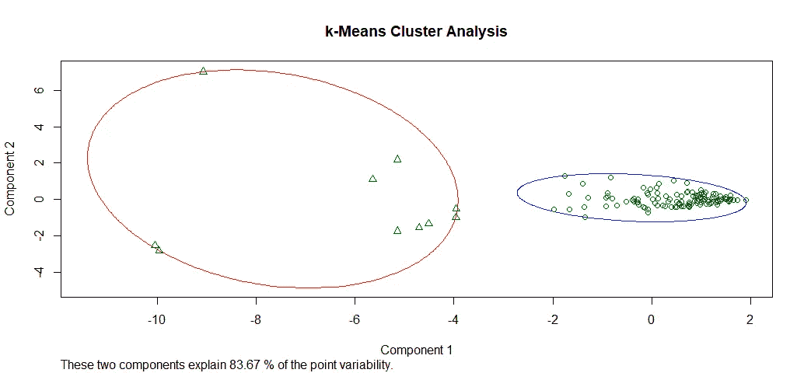

Figure 13

看起来我们对集群数量的选择是好的，并且我们几乎没有噪声。

# 分层聚类

对于分层聚类方法，树状图是深入了解聚类解决方案的主要图形工具。

```
z2 <- data.frame(z)
distance <- dist(z2)
hc <- hclust(distance)
```

现在我们已经有了一个集群解决方案。让我们检查结果。

```
plot(hc, labels = groups_wide$Neighbourhood, main='Cluster Dendrogram', cex=0.65)
```

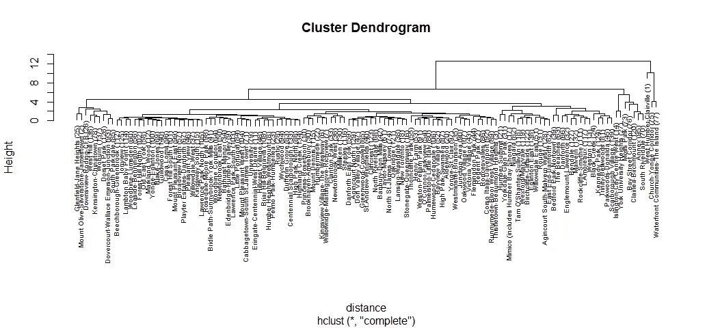

Figure 14

如果我们沿着树形图的 y 轴选择任意高度，并在树形图中移动，计算我们穿过的线的数量，每条线代表一个聚类。例如，如果我们观察高度为 10 的物体，并在该高度移动穿过 x 轴，我们将穿过两条直线。它定义了一个双集群解决方案；沿着这条线向下穿过它的所有分支，我们可以看到包含在这两个集群中的街区的名称。查看多伦多犯罪数据的树状图，我们可以看到我们的数据点非常不平衡。从树的顶端，有两个不同的组；一组由有分支和更多分支的分支组成，而另一组只由几个街区组成(我们可以看到这些街区是多伦多最危险的街区)。然而，我想立刻尝试许多不同的分组，开始调查。

```
counts = sapply(2:6,function(ncl)table(cutree(hc,ncl)))
names(counts) = 2:6
counts
```


解释:

*   对于双集群解决方案，集群 1 中有 128 个小区，集群 2 中有 3 个小区。
*   对于 3 个集群的解决方案，我们在集群 1 中有 128 个邻居，在集群 2 中有 2 个邻居，在集群 3 中有 1 个邻居。以此类推，直到我们得到一个 6 集群解决方案。

在实践中，我们希望有一个解决方案，其中没有太多只有少量观察值的聚类，因为这可能会使我们难以解释我们的结果。在这个练习中，我将坚持使用 3 集群解决方案，看看我将获得什么结果。

```
member <- cutree(hc, 3)
aggregate(z, list(member), mean)
```


在第一组中，所有犯罪指标都是负面的。与聚类 2 和聚类 3 相比，聚类 1 在每个变量上也有显著差异。除了汽车盗窃之外，第二组在大多数犯罪指标方面都高于第三组。

```
plot(silhouette(cutree(hc, 3), distance))
```

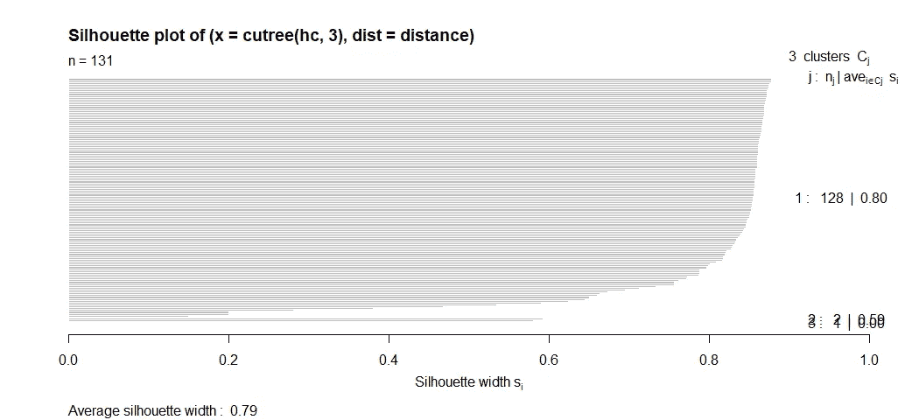

聚类 3 的轮廓宽度值是零，并且轮廓图表明我们确实不需要第三个聚类，绝大多数邻域属于第一个聚类，并且 2-聚类将是我们的解决方案。

# 制作多伦多犯罪地图

r 中有许多用于绘制和操作空间数据的包。我将使用 ggmap 来制作一个简单易用的多伦多犯罪地图。

```
lat <- toronto$Lat
lon <- toronto$Long
crimes <- toronto$MCI
to_map <- data.frame(crimes, lat, lon)
colnames(to_map) <- c('crimes', 'lat', 'lon')
sbbox <- make_bbox(lon = toronto$Long, lat = toronto$Lat, f = 0.01)
my_map <- get_map(location = sbbox, maptype = "roadmap", scale = 2, color="bw", zoom = 10)
ggmap(my_map) +
  geom_point(data=to_map, aes(x = lon, y = lat, color = "#27AE60"), 
             size = 0.5, alpha = 0.03) +
  xlab('Longitude') +
  ylab('Latitude') +
  ggtitle('Location of Major Crime Indicators Toronto 2016') +
  guides(color=FALSE)
```

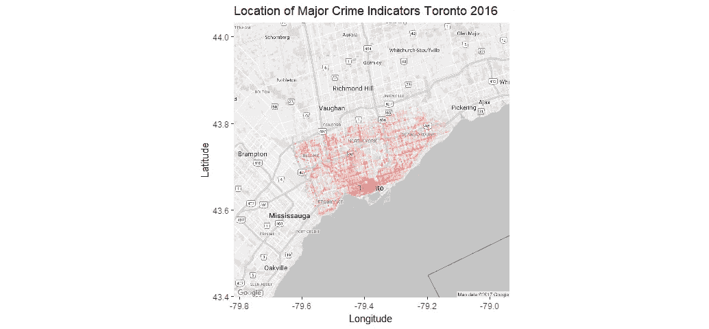

Figure 15

从地图上可以清楚地看到这个城市的主要犯罪发生地。大部分集中在滨水区，北约克以南比其他任何地区都更和平。然而，在比较高密度区域时，点叠加没有帮助，所以让我们优化这种可视化。

```
ggmap(my_map) +
  geom_point(data=to_map, aes(x = lon, y = lat, color = "#27AE60"), 
             size = 0.5, alpha = 0.05) +
  xlab('Longitude') +
  ylab('Latitude') +
  ggtitle('Location of Major Crime Indicators Toronto 2016') +
  guides(color=FALSE) +
  facet_wrap(~ crimes, nrow = 2)
```

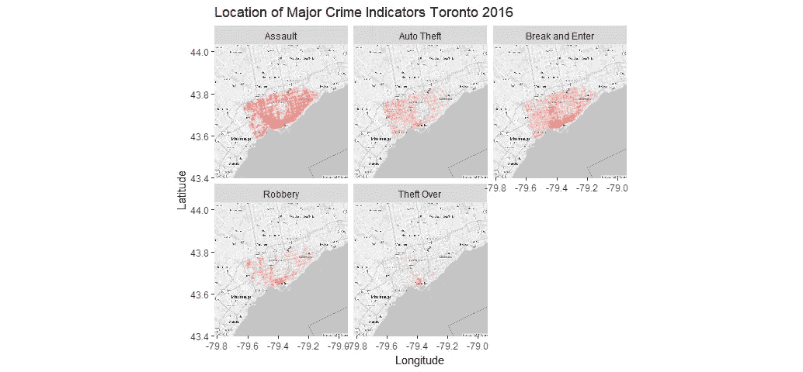

Figure 16

这当然更有趣，信息量也更大。一些犯罪，如袭击、破门而入，在城市各处都有发生，集中在滨水区。其他犯罪，比如偷车，西边比东边多点。抢劫和盗窃主要发生在海滨地区。

# 摘要

通过查看多伦多重大犯罪指标的数据，可以回答的问题并不多。不过没关系。这些数据当然还有其他有趣的用途(比如在 MicroStrategy 上创建一个仪表板)。

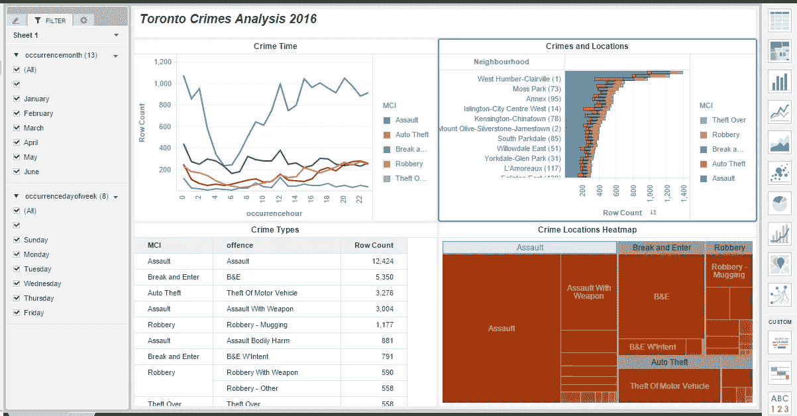

Figure 17

和往常一样，所有代码都可以在 [Github](https://github.com/susanli2016/Data-Analysis-with-R/blob/master/toronto_major_crime_indicators.Rmd) 上找到。我将很高兴收到关于上述任何反馈或问题。