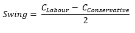
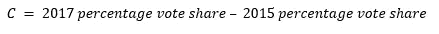
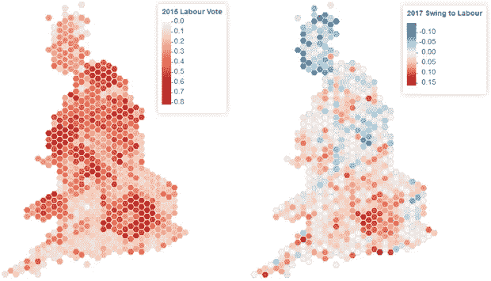
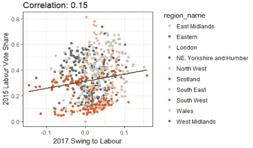
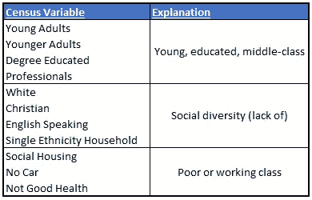
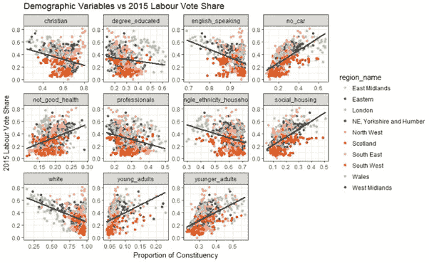
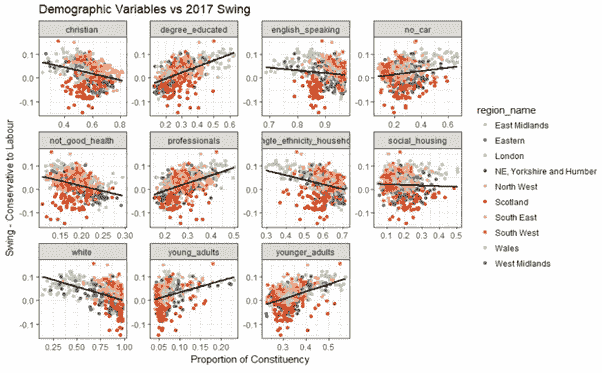
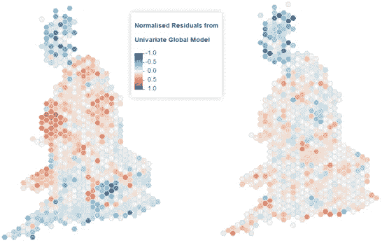

# 用视觉分析法探索英国工党投票中的人口统计变化

> 原文：<https://towardsdatascience.com/exploring-demographic-changes-in-the-uk-labour-partys-vote-with-visual-analytics-42cb5e8b6b2d?source=collection_archive---------9----------------------->

这篇文章改编自我在理学硕士数据科学课程中进行的一项分析，研究人口统计变量如何与 2017 年英国大选中工党选票的变化相关联，以及这些关系在全国各地如何变化。

这个项目的概要是非常公开的；选择一个研究问题，使用任何数据集和任何工具进行研究。唯一的限制是分析必须利用视觉分析方法，也就是说，“视觉输出的解释必须通知计算分析，计算输出必须通知你可视化和解释输出的方式。”

我所有的工作都是在 R 中进行的，代码、数据、完整报告都可以在 [GitHub](https://github.com/tobystaines/Election2017VA) 上获得。

# 介绍

我选择关注最近一次英国大选的结果，部分原因是因为我需要的数据相当大、丰富且可以公开获得，但也因为我渴望看到，我是否可以超越我在新闻中读到的内容来理解这些结果。

过去三年里，英国和全世界都经历了一连串的选举冲击。最近的一次是 2017 年英国大选。竞选活动以保守党享有 20%的民意调查领先优势开始[1]，但以非常接近的结果结束(保守党 42.4%，工党 40%[2])。尽管保守党继续执政，但相对于他们的预期表现，这一结果被广泛认为是工党的成功。工党的成功在很大程度上归功于年轻人和受过良好教育的中产阶级的支持，而不是工党传统的白人工人阶级基础[4]——这一群体的支持率下降，特别是在杰里米·科尔宾当选为工党领袖和 2016 年欧盟公投结果之后，被认为是他们失败的原因[5]。这种情况在多大程度上对英国两大政党的未来走向有着重大影响。

我的目标是通过回答三个问题，调查议会选区的人口构成与 2017 年投票方式之间的关系，重点是工党的意外成功:

1.  工党选举表现的改善在多大程度上与选民的人口构成有关？
2.  这种关系全国都一样吗？
3.  这在多大程度上代表了工党支持者的社会构成的变化？

# 数据和指标

2015 年和 2017 年英国大选的选举数据由英国议会公布[6][7]，给出了英国 632 个选区中每个政党的投票数。我排除了北爱尔兰，因为工党在那里没有候选人。人口统计数据来自 2011 年英国人口普查的结果，由英国国家统计局提供[8]，人口普查输出区域到议会选区的映射也是如此[9][10][11]，从而能够将人口普查与选举结果进行比较。

为了评估选举结果，我使用了两种方法:从保守党转向工党，这是衡量工党支持率的基线指标(他们在 2015 年大选中的投票份额)。摆动计算如下:

在哪里

# 分析

第一步是可视化这两项措施在全国的分布，这是通过议会选区的六边形地图来完成的，如下所示。这些地图清楚地显示了每一项措施的不同分布，表明驱动每一项措施的因素可能不同，而且它们可能因地区而异。

Figure 1: Left: The Labour Party’s share of the vote in the 2015 General Election. Right: Swing from Conservative to Labour in the 2017 General Election.

这一想法得到了对两个指标之间关系的评估的支持(图 2)，该评估仅显示了一周的相关性，以及一些不同的区域模式。例如，伦敦和西北部在 2015 年显示出对工党的强烈支持，并进一步向那个方向摇摆，但东北部、约克郡和亨伯河在 2015 年显示出对工党的强烈支持，并在 2017 年转向保守党。

Figure 2: 2017 Swing to Labour vs 2015 Labour Vote Share. Only a week correlation is observed between the two measures.

为了研究人口统计数据并找出可能有助于解释选举结果的因素，我结合人口普查结果创建了 11 个变量，每个变量都可以作为预计投票给工党的群体的指标。这些在下表中列出。

Table 1: Census variables selected for analysis and the group or area characteristic which they are expected to represent.

下图的比较表明，一些变量与两种选举措施有类似的关系:代表年轻人(年轻成年人和更年轻的成年人)的变量有正相关性，代表“传统”英国(或缺乏社会多样性)的变量都有负相关性。然而，受教育程度和专业人士都显示出与劳动力的基线轻微负相关，但与摇摆有明确的正相关。穷人或工人阶级的指标都显示出与基线有很强的正相关性，但与摇摆关系不大。同样值得注意的是，在所有变量中，苏格兰的选区始终显示出比全国其他地区更倾向于工党。

Figure 3: Demographic Variables vs Labour Vote Share

Figure 4: Demographic Variables vs 2017 Swing

接下来，我想模拟这些变量和选举结果之间的关系，并评估它们的地理差异。图 1 表明，我们需要为每个度量使用不同的模型。我使用调整后的 R 分数来确定最强的解释变量(2015 年投票份额的无车(0.49)和 2017 年摇摆的学历(0.28))，并为每个变量创建线性回归模型。每个选区的每个模型的残差(模型预测和实际结果之间的差异)如图 5 所示。残差被标准化为[-1，1]的区间，以说明摇摆通常小于投票份额的事实。

Figure 5: Residuals from global univariate regression models, normalised to a range of [-1,1] Left: No Car vs 2015 Labour Vote Share. Right: Degree Educated vs 2017 Swing Towards Labour.

首先要注意的是，这两个模型都过度预测了工党在苏格兰的成功，这表明英国这一地区的投票行为可能有根本的不同。将苏格兰从模型中移除会增加调整后的 R 结果(分别从 0.49 增加到 0.55，从 0.28 增加到 0.38)。

无车模型低估了在英格兰北部和伦敦大部分地区的成功，而高估了在伦敦西部和南部其他地区的成功，这很好地反映了对工党传统基础的公认理解。受教育程度模型显示了英格兰和威尔士相当准确的统一结果，支持了 2017 年工党支持率上升的观点，这是由于不同的群体，而不是那些构成他们历史支持的群体。

对多变量模型的进一步实验显示了与图 5 所示相似的模式，但是调整后的 R 增加到 0.7 和 0.46。报告中详细描述了变量的最终选择以及这些选择的原因。

分析的最后一步是应用地理加权汇总统计数据，如图 6 所示。每张地图都显示了全国范围内两个变量之间的相关性是如何变化的。使用加权邻域为每个选区创建单独的模型，在本例中是 50 个最近的选区。蓝色区域显示负相关，红色区域显示正相关。

Figure 6: The first map shows the geographically weighted correlation between 2015 Labour Vote Share and 2017 Swing. Each subsequent map shows the weighted correlation between one demographic variable and one electoral measure.

# 回答我们的问题

那么，在建立了一系列模型，并绘制了一些漂亮的图表和地图之后，它对我们回答最初的三个研究问题有多大帮助呢？

## 1.工党选举表现的改善在多大程度上与选民的人口构成有关？

工党在 2017 年大选中的改善结果确实显示了与议会选区人口构成的相关性，尽管没有他们的基线支持那么强烈。

这种摇摆强度的最重要指标是那些代表年轻、受过教育、中产阶级(20 至 44 岁、具有学位水平资格或从事专业水平就业的居民比例)的指标，分别解释了结果中 20%、28%和 23%的变化。这与 2015 年投票份额的最强指标形成了对比，这些指标与较贫困或工人阶级社区有关(居住在社会住房、没有汽车或健康状况不佳的人口比例(36%、49%和 17%)。

社会多样性在 2015 年的结果和 2017 年的变化中都是不变的，在两种情况下都是负相关的，尽管这一类别在两种情况下都不是最重要的。

## 2.这种关系全国都一样吗？

全球模型的残差显示，尤其是苏格兰和英国其他地区之间存在差异。地理加权模型显示，基线支持指标往往具有相当的全球性(苏格兰的某些情况除外)；在英格兰和威尔士，相关性通常在相同的方向，具有相似的强度，特别是多样性和工人阶级指标。

与挥杆的相关性通常较弱，并在几个测量中显示出较大的区域差异。然而，最强的指标确实显示了一种全球模式。

## 3.这在多大程度上代表了工党支持者的社会构成的变化？

在国家一级，没有一个指标显示从 2015 年的结果到 2017 年的波动从正相关转为负相关，这表明工党在已经支持它的群体中没有失去重要的支持。受教育程度和专业人士之间从负相关到正相关的转变可能表明工党支持者的人口构成发生了变化，但很难对问题 3 做出定量回答。对这些指标所贡献的相对票数进行进一步分析，并对较长时期内的结果进行检查，将有助于更详细地回答这个问题，但这超出了本分析的范围。

# 反射

## 方法的有效性

对于这种类型的分析，人们必须小心，不要试图对个人投票行为下结论。虽然我们观察了选区一级的关系，但我们不知道每个选区内的团体是如何投票的，也不知道他们的相对投票率是多少，我们也不能说某个团体以某种方式投票。分析也不试图捕捉可能影响投票行为的具体地方问题，也不能说明自 2011 年人口普查以来可能发生的人口变化。民意调查可能更容易建立这种联系，在民意调查中，一个人的人口统计、观点和投票之间有直接联系。然而，这些都是昂贵的，并且很少在足以揭示本研究调查的区域差异的规模上进行。这种分析的优势在于它包括每一个人和每一张选票，因此它的范围比民意测验分析要广得多。

选举措施的选择提供了有用的结果，但这些措施是有限的。在苏格兰，保守党和工党之间的摇摆可能过于简单，因为两者都不是那里的最大政党，而且它确实表现出与全国其他地区不同的模式。苏格兰也在 2014 年举行了自己的英国成员资格公投；一个非常重要和特殊的政治事件。包括苏格兰民族党在内的具体苏格兰分析可能会更好地理解这些关系。

选择六边形地图显示地理关系效果很好，可以对结果进行清晰的视觉解释，尽管地理失真意味着特定位置的身份并不总是立即明显。它们与全球回归模型一起使用对回答问题 2 特别有帮助。

六边形图是散点图的一个很好的补充，散点图提供了一个高层次的相关性视图，但由于大量的数据点和相对大量的区域，很难详细解释，使得很难区分图中心拥挤的模式。对单个区域的进一步分析将是有趣的，但作为这项工作的一部分是不可行的。

相关性的地理加权模型显示了有趣的区域差异，但理解这些不同的相关性如何组合成一幅整体图景并不简单，而且量化它们如何影响两个单独的选举措施组合尤其困难。使用基于分区的聚类的进一步工作可能对此有所启发，并有助于获得问题 3 的更可量化的答案。

此分析中使用的技术可高度推广到复杂空间多元数据常见的其他领域。除了政治之外，类似的方法可以应用于调查各种社会问题答案的空间变化，例如比较任何财富或收入平等、健康、教育成果或环境变化。

## 含义

在英国的多党、得票最多者当选的选举制度中，了解地方一级的投票模式是如何受到影响的非常重要。在选举之前，有很多关于全国民意调查的讨论，以及全国投票份额的变化如何反映在议会席位中。众所周知，这种推断很难，正如最近的几次选举所显示的那样，相对较小的民意调查并不总是能很好地概括全国的情况。因此，了解一个政党在人口统计和区域变量方面的表现是非常有价值的。然而，这种分析本质上是反应性的；它可以提供对过去结果的洞察，但这并不意味着它可以用来预测未来的选举，因为采样和未来事件之间的差距太大了。

结果显示，受教育程度变量与倾向于工党的相关模式类似，因为其他工作已经注意到在 2016 年欧盟公投中投票[12]，尽管这种关系没有那么强。这支持了一种观点，即工党的部分成功是对公投结果的反应，不满的专业保守党，留欧选民转向工党，而工人阶级脱欧投票工党支持者的预期相反反应并没有成为现实。然而，也有人认为，这两个结果都反映了选民行为中更为根本的变化[13]。

如果工党能够保持这种模式，在保持现有支持的同时，扩大他们对新人口的支持基础，这显然对他们有利。对照人口指标分析选区一级目前的选举差额可能是一个值得探索的有趣途径，以便了解这些模式的继续会在未来产生多大的影响。

# 最后

谢谢你能走到这一步！请随时留下任何评论、反馈或掌声。如果你是一个真正喜欢惩罚的人，那么[完整报告](https://github.com/tobystaines/Election2017VA/blob/master/Changing%20Demographics%20in%20the%20UK%20Labour%20Party%20v1.2.pdf)将会更详细地介绍你在这个过程中所使用的方法和做出的选择。

# 参考

[1] J. Holder、N. Kommenda、C. Barr 和 S. Clarke，“特里萨·梅的选举赌博是如何失败的？|政治|卫报。”【在线】。可用:[https://www . the guardian . com/politics/ng-interactive/2017/jun/09/Theresa-may-election-gamble-fail-conservatives-majority-polls。](https://www.theguardian.com/politics/ng-interactive/2017/jun/09/theresa-may-election-gamble-fail-conservatives-majority-polls.)【访问时间:2017 年 12 月 1 日】。

[2]“2017 年英国大选:全部结果|政治|卫报。”【在线】。可用:[https://www . the guardian . com/politics/ng-interactive/2017/jun/08/live-uk-election-results-in-full-2017。](https://www.theguardian.com/politics/ng-interactive/2017/jun/08/live-uk-election-results-in-full-2017.)【访问时间:2017 年 12 月 1 日】。

[3] P. Walker 和 J. Elgot，“当工党赢得席位时，科尔宾蔑视怀疑者|政治|卫报。”【在线】。可用:[https://www . the guardian . com/politics/2017/jun/09/Jeremy-cor byn-labour-defies-doubles-gain-seats-election-2017。](https://www.theguardian.com/politics/2017/jun/09/jeremy-corbyn-labour-defies-doubters-gain-seats-election-2017.)【访问时间:2017 年 12 月 31 日】。

[4] H .刘易斯，“是什么推动了工党的成功？对移民采取强硬路线，并向中产阶级发出呼吁。”【在线】。可用:[https://www . newstatesman . com/politics/June 2017/2017/06/what-driven-labours-success-tough-line-immigration-and-appeal-middle-class。](https://www.newstatesman.com/politics/june2017/2017/06/what-drove-labours-success-tough-line-immigration-and-appeal-middle-class.)【访问日期:2017 年 12 月 31 日】。

[5] K .麦肯，“民意调查显示，工党现在是工人阶级选民中第三大受欢迎的政党。”【在线】。可用:[http://www . telegraph . co . uk/news/2017/02/13/labour-now-third-popular-party-in-working-class-voters-poll/。](http://www.telegraph.co.uk/news/2017/02/13/labour-now-third-popular-party-among-working-class-voters-poll/.)【访问日期:2017 年 12 月 31 日】。

[6]英国议会，“2015 年大选结果—data . Parliament . UK”[在线]。可用:[http://www . data . parliament . uk/dataset/general-election-2015。](http://www.data.parliament.uk/dataset/general-election-2015.)【访问时间:2017 年 12 月 13 日】。

[7] C .贝克*等*《2017 年大选:全部结果与分析》【在线】。可用:[http://research briefings . parliament . uk/research briefing/Summary/CBP-7979。](http://researchbriefings.parliament.uk/ResearchBriefing/Summary/CBP-7979.)【访问时间:2017 年 12 月 13 日】。

[8] O .英国政府，“批量数据下载—国家统计局。”【在线】。可用:[https://www . ons . gov . uk/census/2011 census/2011 census data/bulk data/bulk data downloads。](https://www.ons.gov.uk/census/2011census/2011censusdata/bulkdata/bulkdatadownloads.)【访问时间:2017 年 12 月 1 日】。

[9] O. for N. S. UK Government，“英格兰和威尔士地方当局辖区的输出区域(2016 年 12 月)查找|开放地理门户”，2016 年。【在线】。可用:[http://geo portal . statistics . gov . uk/datasets/output-area-to-ward-to-local-authority-district-2016-12-lookup-in-England-and-Wales。](http://geoportal.statistics.gov.uk/datasets/output-area-to-ward-to-local-authority-district-december-2016-lookup-in-england-and-wales.)【访问时间:2017 年 12 月 11 日】。

[10] O .对于 N. S. UK 政府，“从威斯敏斯特议会选区到地方当局选区(2016 年 12 月)在英国|开放地理门户中的查找。”【在线】。可用:[http://geo portal 1-ons . open data . ArcGIS . com/datasets/f 52 c 48 ea 5 cf 2494 b 824d 35 f 4 be 88 F2 EC _ 0/data。](http://geoportal1-ons.opendata.arcgis.com/datasets/f52c48ea5cf2494b824d35f4be88f2ec_0/data.)【访问时间:2017 年 12 月 11 日】。

[11]苏格兰政府，“2011 年数据区和中间区查找”【在线】。可用:[http://www . gov . scot/Topics/Statistics/SNS/SNS ref/dz 2011 lookups。](http://www.gov.scot/Topics/Statistics/sns/SNSRef/DZ2011Lookups.)【访问时间:2017 年 12 月 13 日】。

[12] R. Beecham，A. Slingsby 和 B. Chris，“英国投票脱离欧盟背后的地方差异解释”，2016 年。

[13] W .詹宁斯和 g .斯托克，“向世界主义轴心倾斜？英格兰的政治变化和 2017 年大选。Q. ，第 88 卷第 3 期，第 359–369 页，2017 年。