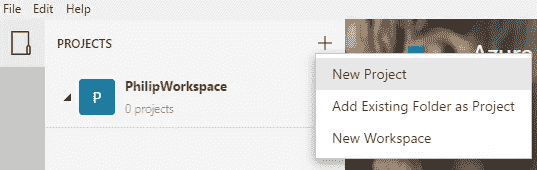
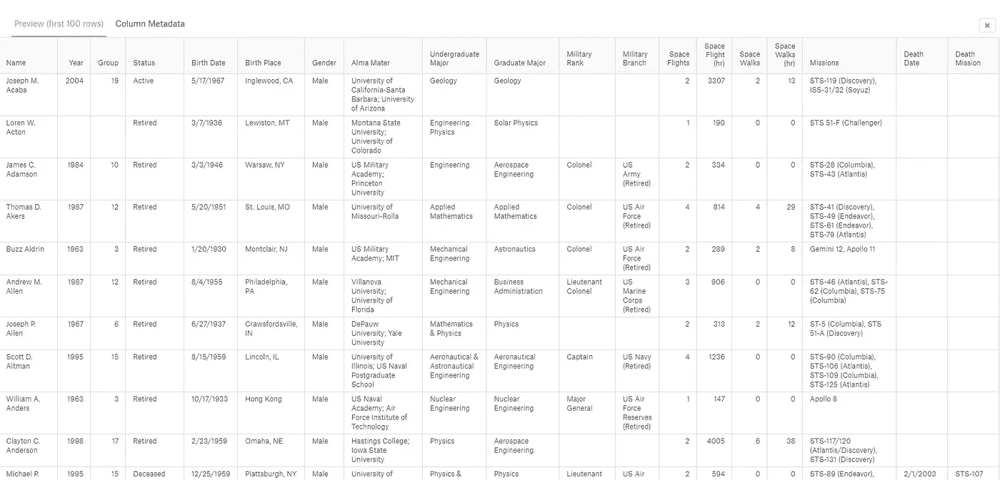
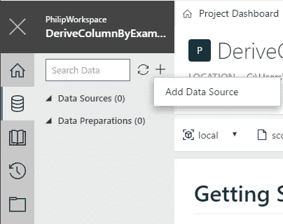
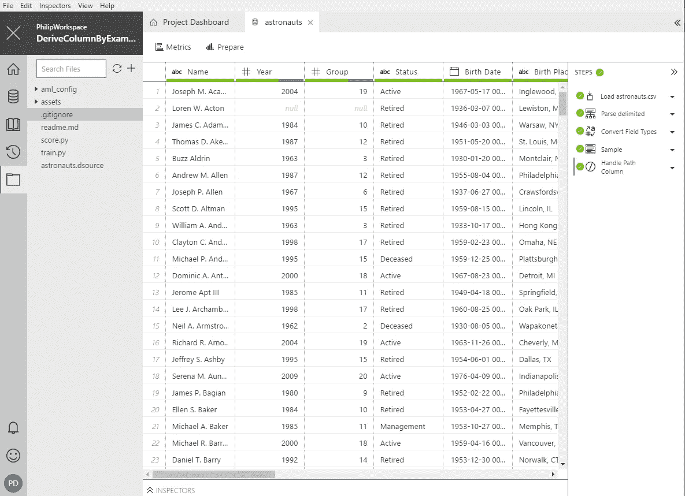
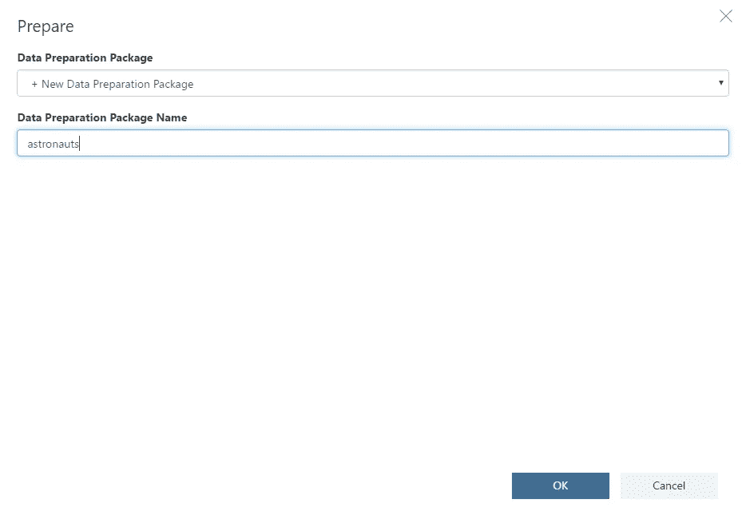
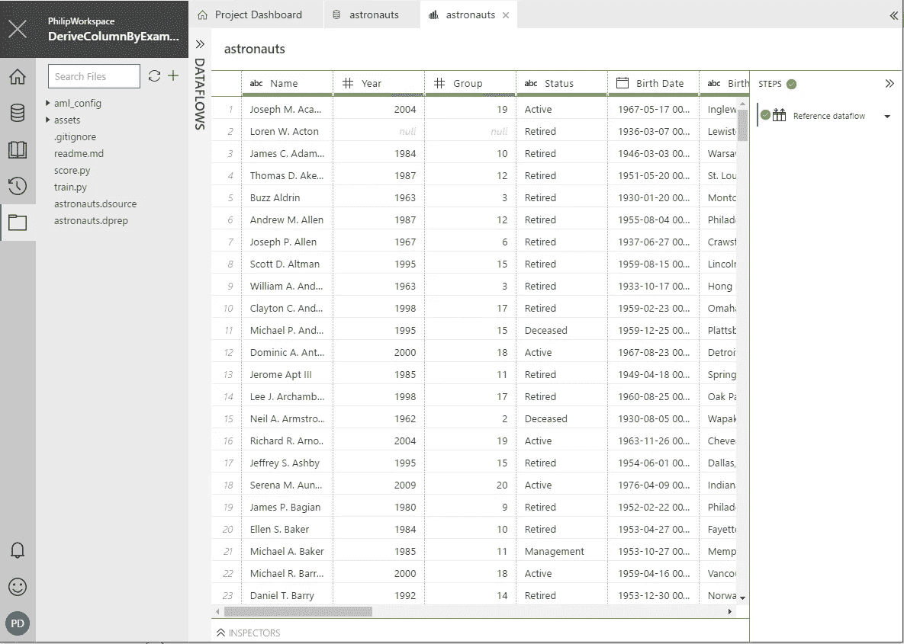
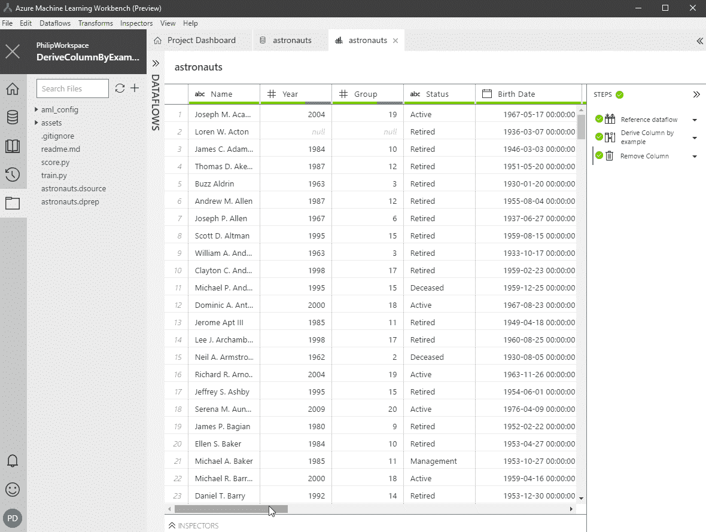
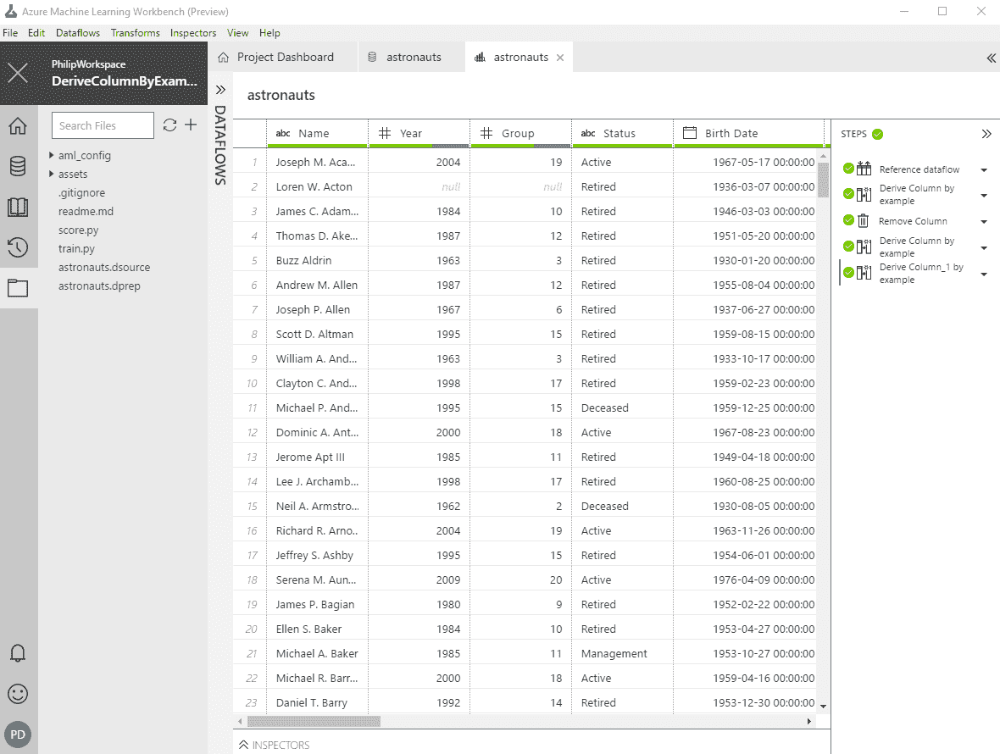
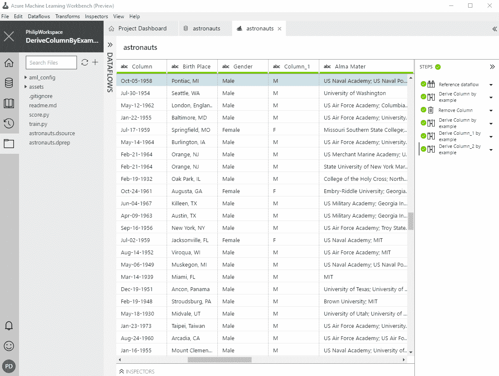

# 在 Azure 机器学习工作台中通过示例探索派生列

> 原文：<https://towardsdatascience.com/exploring-derive-column-by-example-in-azure-machine-learning-workbench-43a7842e61b?source=collection_archive---------3----------------------->

与我最近在博客上分享的关于[Visual Studio Code Tools for AI](https://medium.com/towards-data-science/setting-up-your-visual-studio-code-tools-for-ai-76c89f3d6e3e)的内容类似，Azure Machine Learning Workbench 或 AML Workbench 也是最新的人工智能工具之一，由微软在 2017 年 9 月的 Microsoft Ignite 上发布。

[AML Workbench](https://docs.microsoft.com/en-us/azure/machine-learning/preview/overview-what-is-azure-ml) 是一个跨平台的桌面客户端(目前 Windows 和 macOS 都支持)，用于数据辩论和实验管理。我发现 AML Workbench 的一个有趣的特性是“通过示例导出列”。

> **通过示例导出列**转换使用户能够使用用户提供的导出结果示例来创建一个或多个现有列的衍生物。导数可以是支持的字符串、日期和数字转换的任意组合。

*旁注:如果你还没有安装和设置你的 AML 工作台，你可以查看我的博客文章* [*设置你的 Visual Studio 代码工具用于人工智能*](https://medium.com/towards-data-science/setting-up-your-visual-studio-code-tools-for-ai-76c89f3d6e3e) *，在那里我也分享了如何设置 AML 工作台，因为这是使用 VSCode 工具用于人工智能的先决条件。或者你可以直接查看他们的官方文档页面* [*这里*](https://docs.microsoft.com/en-us/azure/machine-learning/preview/quickstart-installation) *。*

# 入门指南

为了向您展示该功能的工作原理，请打开您的 AML 工作台并创建一个新项目(在本教程中，它可以是一个空白项目)。

## 导入数据集

我将在这个例子中使用的数据集是来自 kaggle 的 **NASA 宇航员，1959 年至今的**数据集，你可以在这里下载[。](https://www.kaggle.com/nasa/astronaut-yearbook)

NASA Astronauts, 1959-Present Data preview

创建项目并准备好数据集后，您需要:

1.  点击“数据”图标
2.  添加新的“数据源”

3.选择“文件/目录”

4.使用“本地”路径添加`astronauts.csv`文件

5.点击“完成”

成功创建了一个`astronauts.dsource`文件后，您应该能够看到:

## 创建数据准备包

既然我们已经有了数据源，现在我们将创建一个**数据准备包**，我们将使用它来转换我们的数据。

> [数据准备](https://github.com/MicrosoftDocs/azure-docs/blob/master/articles/machine-learning/preview/data-prep-getting-started.md)提供了一套有效探索、理解和解决数据问题的工具。它允许您使用多种形式的数据，并将这些数据转换成更适合下游使用的干净数据。

1.  再次点击“数据”图标
2.  右击`astronauts`数据源并点击“准备”
3.  添加“数据准备包名称”,然后按“确定”

这将在您的项目目录中创建一个`astronauts.dprep`文件，并显示一个与我们添加数据源后看到的几乎相似的页面。

# 通过示例转换派生列

让我举几个例子来说明这种转变是如何进行的。

## 转换日期

假设我们想要将**出生日期**列的格式从`yyyy-mm-dd 00:00:00`更改为`mmm-dd-yyyy`。

1.  右键单击“出生日期”列，然后选择“根据示例导出列”
2.  键入您希望在“出生日期”列右侧新添加的列中使用的日期格式示例。
3.  单击“确定”接受转换

日期转换应该如下所示:

Date Transformation

## 转换字符串

对于这个例子，让我们通过执行与上一个类似的步骤，尝试将性别格式从男性/女性更改为 M/F。

String Transformation

## 转换数

在下一个示例中，我们将更改 **Space Flight (hr)** 列的数字格式，为数字添加一个适当的逗号。

Number Transformation

您还可以通过转到“步骤”部分，右键单击特定步骤，然后按“编辑”来编辑您已成功做出的更改。从那里，您将能够更新列的值。

如何看待 Azure 机器学习工作台中的 Derive 专栏 By Example？如果你想要更多的例子，你可以去他们的官方文档页面[这里](https://docs.microsoft.com/en-us/azure/machine-learning/preview/data-prep-derive-column-by-example)。