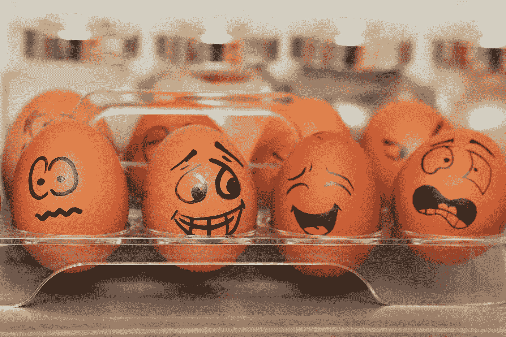
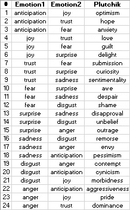
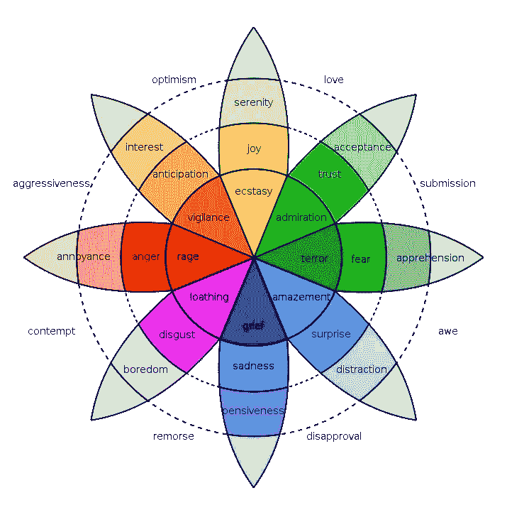
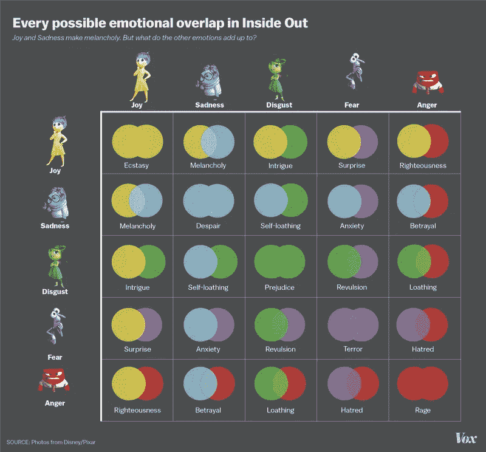
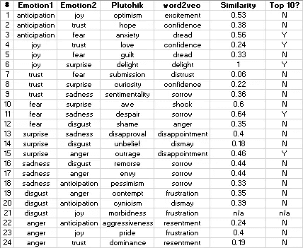
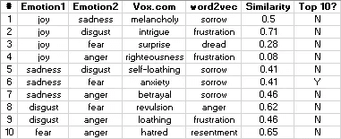

# 使用 word2vec 探索情感组合

> 原文：<https://towardsdatascience.com/exploring-emotion-combinations-using-word2vec-54c8be43fa6?source=collection_archive---------5----------------------->

Photo by [Tengyart](https://unsplash.com/@tengyart?utm_source=medium&utm_medium=referral) on [Unsplash](https://unsplash.com?utm_source=medium&utm_medium=referral)

在这篇博文中，我们使用 word2vec 探索了两组情感组合。具体来说，一张是由罗伯特·普卢奇克在 1980 年制作的，另一张是由 vox.com 的 T2 制作的流行媒体图表。我们将范围限制在二元组，即两种基本情绪的组合，构成一种更复杂的情绪。

> *正如* ***蓝*** *和* ***红*** *紫***；*喜悦*和*惊喜*给予*喜悦*。**

**

**Above: The table has been extracted from the* [*Wikipedia*](https://en.wikipedia.org/wiki/Contrasting_and_categorization_of_emotions) *page.**

**

**Above: The wheel of emotions contains a superset of the previous table, where similar emotions in the wheel are near to each other. Also extracted from the* [*Wikipedia*](https://en.wikipedia.org/wiki/Contrasting_and_categorization_of_emotions) *page.**

**

**Above: Popular media ‘best-guess’ on emotions dyads based on characters from Inside Out. From* [*Vox.com*](https://www.vox.com/2015/6/29/8860247/inside-out-emotions-graphic)*

*给大家一些背景资料，这部电影描述了一个孩子进入青春期后如何产生复杂的情感。在这里，一个混合了*的快乐和悲伤被描绘出来。**

# *方法*

*为了探索情绪的可加性，word2vec 是一个很好的候选模型。如前几篇文章所述，我们看到分布式表示模型(如 word2vec)可以解决以下不同复杂性的类比，并建议使用*斜体*单词。*

*男人:国王::女人:*皇后**

*Lady Gaga:美国::*滨崎步*:日本*

*等效地，上述词对类比可以表示为等式:*

*男人+国王-女人= *女王**

*Lady Gaga +美日= *滨崎步**

*在接下来的部分中，我们将演示单词向量的加法属性，以找到*斜体的*单词。*

*喜悦+惊喜= *喜悦**

*为了实现这一点，我们使用来自[的预训练 word2vec 向量，这里是](https://drive.google.com/file/d/0B7XkCwpI5KDYNlNUTTlSS21pQmM/edit)。有了 [gensim](https://radimrehurek.com/gensim/install.html) ，我们可以轻松使用这些向量。*

*使用上面的代码，可以从 word2vec 中提取两种情绪之和的最相似的单词，计算建议单词和人类建议之间的余弦相似度。这个相似性度量的范围从-1(完全相反)到 1(相同的意思)，最后，检查来自人类的建议情感是否在 word2vec 的前 10 个建议单词内。*

*这篇文章的其余部分被组织成两个研究，每个研究测试 word2vec 和一组特定建议之间的一致性。在每项研究中，我们将首先展示结果，然后进行讨论。*

# *研究 1 —普卢奇克*

**

*Above: Study 1 results*

*此时，需要注意的是，预训练的 word2vec 模型已经在 Google News 数据集上进行了约 1000 亿字的训练。作为一个以新闻为中心的数据集，语料库并不期望产生一个模型来对情绪进行微妙的区分。*

*令人鼓舞的是，word2vec 显示出与 Plutchik 的暗示情绪基本一致，所有情绪对的积极得分相似。*

*我们观察到 word2vec 为一些情感对建议了相同的单词。例如，*悲伤*在第 9、11、16、17、18 对中暗示。每当*悲伤*被加上什么东西的时候，*悲伤*就被暗示出来。这突出了用新闻数据集训练的模型的情感之间的有限区别。*

*Pair 13 是一个有趣的组合，是*惊喜*和*悲伤*的总和。Plutchik 建议*不赞成*而 word2vec 建议*失望*我个人更喜欢这个。然而，这只是一个外行对心理学的看法。*

*Pair 7 是另一个有趣的，word2vec 认为*恐惧*对*信任*否定*信任*并暗示*不信任*，而 Plutchik 则暗示*提交*是*恐惧*和*信任*的累积。两者似乎都有道理，这表明单词可以以多种方式有意义地组合在一起。该组合可以通过句子中的词汇结构来修改。*

*对 21 接收 n/a，因为 word2vec 字典没有*病态*。*

# *研究 2 —从里到外*

**

*Above: Study 2 results*

*研究结果与研究 1 非常相似，在研究 1 中，我们观察到人类建议和 word2vec 之间的一般一致性，以及跨情感对重复建议(例如*悲伤*和*沮丧*)。*

# *结论*

*这结束了一个简短的帖子，说明了词的通用分布式表示的另一种用途，并强调了使用相关语料库来训练词向量的重要性，如果它将用于专门领域的话。*

**原载于 2018 年 1 月 30 日 joshuakyh.wordpress.com***。***