# 探索和机器学习多伦多的 Airbnb 房源

> 原文：<https://towardsdatascience.com/exploring-machine-learning-for-airbnb-listings-in-toronto-efdbdeba2644?source=collection_archive---------5----------------------->

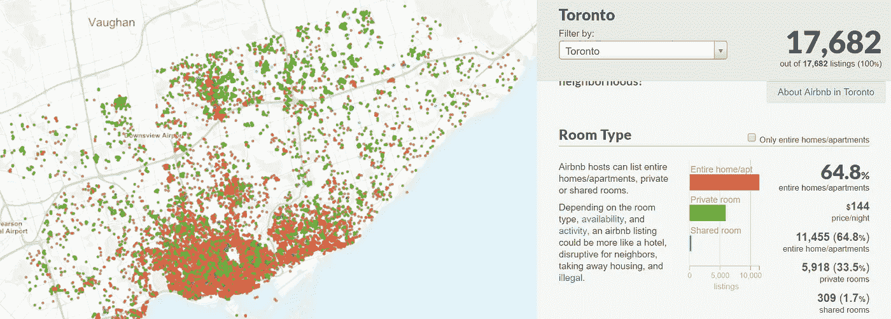

Photo credit: Inside Airbnb

## Airbnb 房源、特征工程、探索性分析、回归

[**Airbnb**](https://www.airbnb.ca/?locale=en) 不提供我们可以使用的巨型数据库或转储意义上的开放数据。然而，Airbnb 内部的[](http://insideairbnb.com/index.html)**利用从 Airbnb 网站汇编的公开信息，分析关于一个城市的 Airbnb 房源的公开信息，并提供过滤器和关键指标，以便我们可以看到 Airbnb 在世界各大城市的使用情况。Airbnb 内部的[](http://insideairbnb.com/index.html)**是一套独立的、非商业性的工具和数据，与 Airbnb 或 Airbnb 的任何竞争对手都没有关联，也没有得到它们的认可。****

****然而，Airbnb 内 [**提供的信息对我们来说是不够的。我们将从那里下载数据用于我们自己的分析。**](http://insideairbnb.com/index.html)****

****我将与[多伦多数据](http://insideairbnb.com/toronto/)合作。因为我住在这里，我知道这里的一些街区。欢迎你选择任何你喜欢的城市。****

****我们将查看 Airbnb 的房源和日历，并尝试提供一些关于预测房源价格的探索性分析，如果我们假设在 Airbnb 工作，也是为了消费者。我们开始吧！****

# ****日历****

```
**calendar = pd.read_csv('calendar.csv.gz')
print('We have', calendar.date.nunique(), 'days and', calendar.listing_id.nunique(), 'unique listings in the calendar data.')**
```

****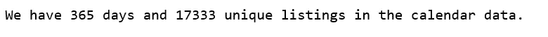****

```
**calendar.date.min(), calendar.date.max()**
```

****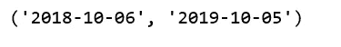****

****该日历涵盖一年的时间范围，即下一年每天的价格和可用性。在我们的案例中，从 2018–10–16 到 2019–10–15。****

****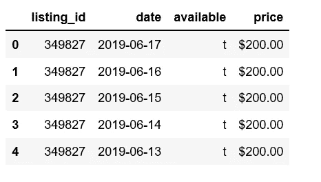****

****Figure 1****

## ****日历上的可用性****

****当我们查看日历数据时，我们可能想问这样的问题:未来一年多伦多的 Airbnb 主机会有多忙？****

```
**calendar.available.value_counts()**
```

****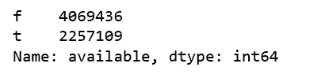****

****f(假)表示不可用，t(真)表示可用。为了找出一年的日平均可用性，如果可用，我们将把 available 列转换为 0，如果不可用，则转换为 1。****

```
**calendar_new = calendar[['date', 'available']]
calendar_new['busy'] = calendar_new.available.map( lambda x: 0 if x == 't' else 1)
calendar_new = calendar_new.groupby('date')['busy'].mean().reset_index()
calendar_new['date'] = pd.to_datetime(calendar_new['date'])plt.figure(figsize=(10, 5))
plt.plot(calendar_new['date'], calendar_new['busy'])
plt.title('Airbnb Toronto Calendar')
plt.ylabel('% busy')
plt.show();**
```

****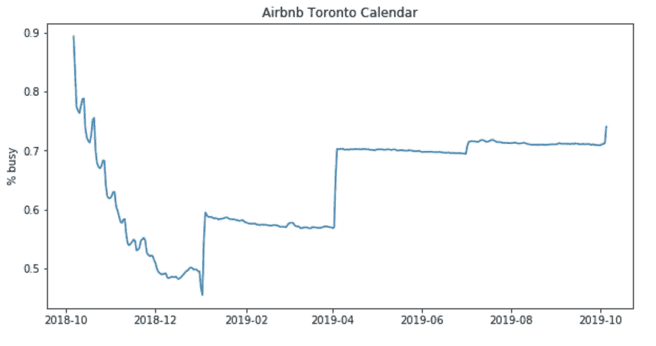****

****Figure 2****

****多伦多最繁忙的月份是刚刚过去的十月。接下来忙碌的几个月似乎是在四月之后，一直延续到夏天。这些都在我们的体验和预期之内。****

## ****日历上的价格****

****价格如何逐月逐年变化？****

****我们删除 price 列中的“$”符号，将其转换为数字，并将 date 转换为 datetime 数据类型。****

```
**calendar['date'] = pd.to_datetime(calendar['date'])
calendar['price'] = calendar['price'].str.replace(',', '')
calendar['price'] = calendar['price'].str.replace('$', '')
calendar['price'] = calendar['price'].astype(float)
calendar['date'] = pd.to_datetime(calendar['date'])
mean_of_month = calendar.groupby(calendar['date'].dt.strftime('%B'),
                                 sort=False)['price'].mean()
mean_of_month.plot(kind = 'barh' , figsize = (12,7))
plt.xlabel('average monthly price');**
```

****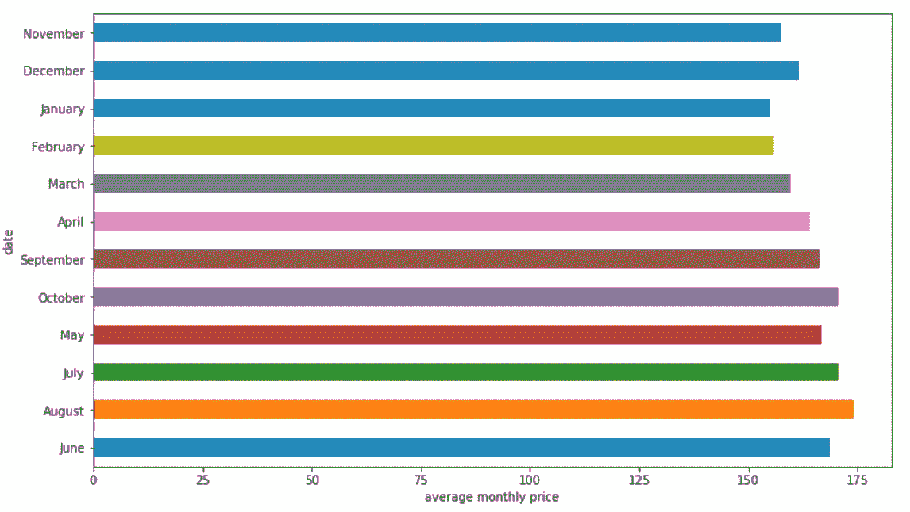****

****Figure 3****

****多伦多的 Airbnb 价格在 7 月、8 月和 10 月上涨。同意，这三个月是游览多伦多最好的月份。****

****价格在一周中的某一天是如何变化的？****

```
**calendar['dayofweek'] = calendar.date.dt.weekday_name
cats = [ 'Monday', 'Tuesday', 'Wednesday', 'Thursday', 'Friday', 'Saturday', 'Sunday']
price_week=calendar[['dayofweek','price']]
price_week = calendar.groupby(['dayofweek']).mean().reindex(cats)
price_week.drop('listing_id', axis=1, inplace=True)
price_week.plot()
ticks = list(range(0, 7, 1)) # points on the x axis where you want the label to appear
labels = "Mon Tues Weds Thurs Fri Sat Sun".split()
plt.xticks(ticks, labels);**
```

****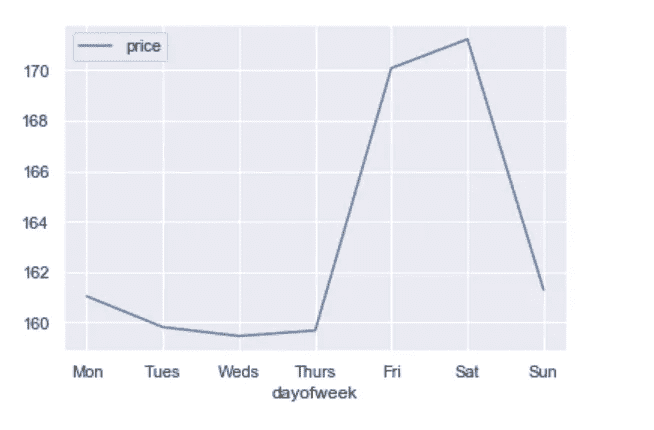****

****Figure 4****

****星期五和星期六比一周中的其他时间要贵 10 美元以上。****

# ****清单****

******每个街区的列表数量******

```
**listings = pd.read_csv('listings.csv.gz')
print('We have', listings.id.nunique(), 'listings in the listing data.')**
```

****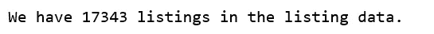****

```
**listings.groupby(by='neighbourhood_cleansed').count()[['id']].sort_values(by='id', ascending=False).head(10)**
```

****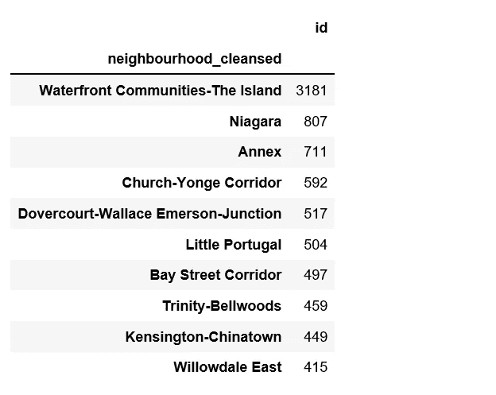****

****Figure 5****

****列表数量最多的街区是海滨社区——岛屿，几乎是第二多的街区(尼亚加拉)的四倍。从上面的标题图，我们也可以看到这一点。****

******审核评分等级******

```
**plt.figure(figsize=(12,6))
sns.distplot(listings.review_scores_rating.dropna(), rug=True)
sns.despine()
plt.show();**
```

****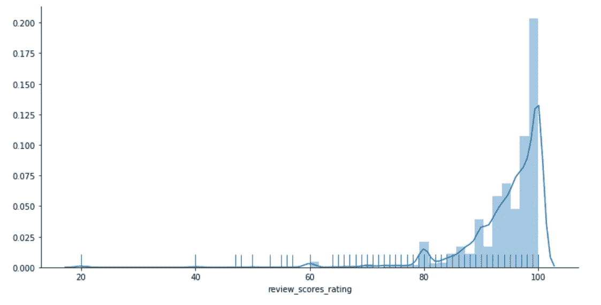****

****Figure 6****

```
**listings.review_scores_rating.describe()**
```

****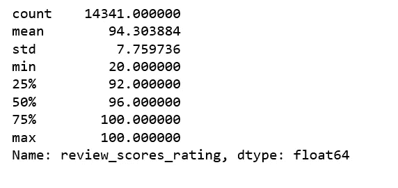****

****Figure 7****

****不出所料，大多数评论者都给出了高分。****

## ****探索价格****

****price 列需要一些清理，例如删除“$”并转换为数字。****

```
**listings['price'] = listings['price'].str.replace(',', '')
listings['price'] = listings['price'].str.replace('$', '')
listings['price'] = listings['price'].astype(float)listings['price'].describe()**
```

****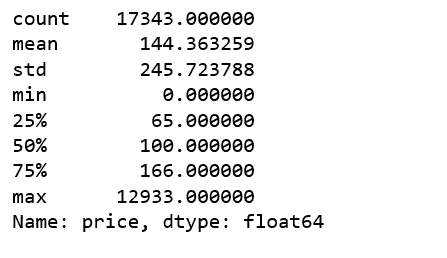****

****Figure 8****

****多伦多最贵的 Airbnb 房源是 12933 美元/晚。从[的列表网址](https://www.airbnb.ca/rooms/16039481?locale=en)，据我所知似乎是合法的。一位艺术收藏家在多伦多最时尚街区的顶层公寓。不错！****

****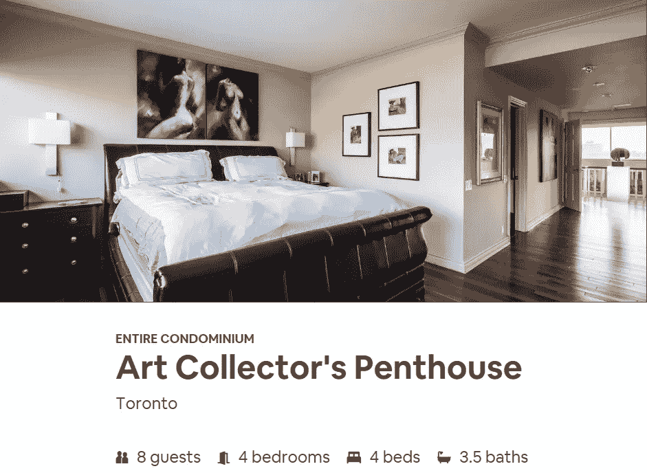****

****source: Airbnb****

****为了不受极端情况的影响，我决定删除超过 600 美元/晚的房源，以及 7 个价格为 0 的房源，以便进行下面的探索性分析。****

******剔除异常值后的列表价格分布******

```
**listings.loc[(listings.price <= 600) & (listings.price > 0)].price.hist(bins=200)
plt.ylabel('Count')
plt.xlabel('Listing price in $')
plt.title('Histogram of listing prices');**
```

****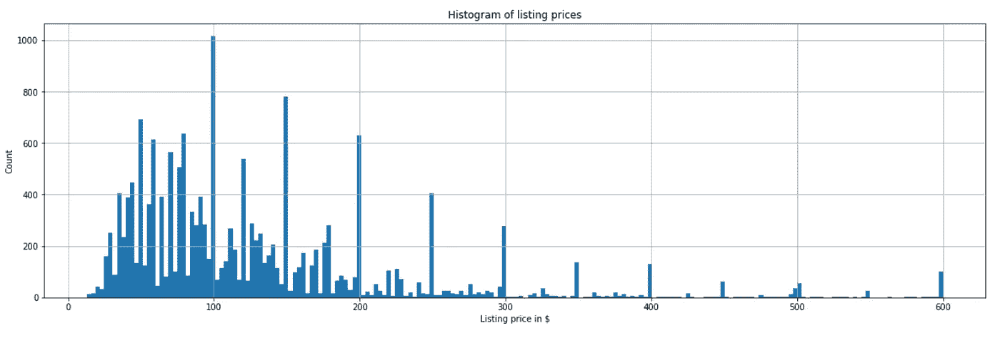****

****Figure 9****

******邻里关系与价格******

****neighbourhood vs. price****

****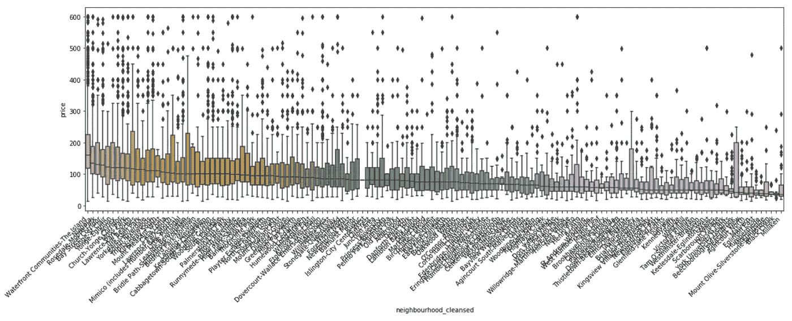****

****Figure 10****

****不仅是滨水社区——岛上的房源数量最多，它还享有最高的中位价，而米利肯的中位价最低。****

******物业类型与价格******

****property_type vs. price****

****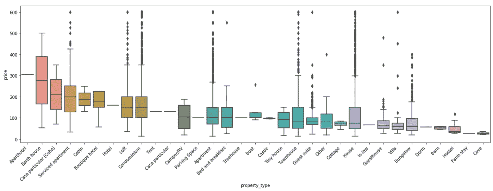****

****Figure 11****

****当我们查看每种物业类型的中值价格时，我们必须小心，不能说“最贵的物业类型是公寓式酒店，帐篷和停车位的中值价格高于公寓和城堡。”，因为 Aparthotel、Tend 和 Parking Space 各只有一个列表。****

******房型与价格******

****room_type vs. price****

****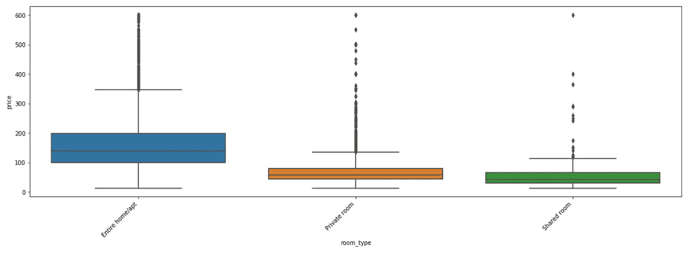****

****Figure 12****

****不言而喻，整个房间/公寓的价格比其他类型的房间要高得多。****

```
**listings.loc[(listings.price <= 600) & (listings.price > 0)].pivot(columns = 'room_type', values = 'price').plot.hist(stacked = True, bins=100)
plt.xlabel('Listing price in $');**
```

****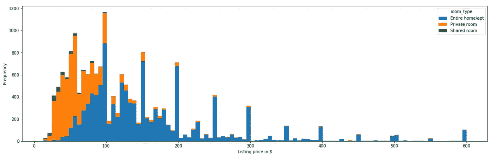****

****Figure 13****

****整个家/公寓也有最多的房源。Airbnb 内部已经表明[整栋整栋的住宅或公寓全年对游客开放，可能没有主人在场，可能是非法的，更重要的是，正在取代居民](http://insideairbnb.com/toronto/)。我们将暂时把忧虑放在一边。****

******床型与价格******

****bed_type vs. price****

****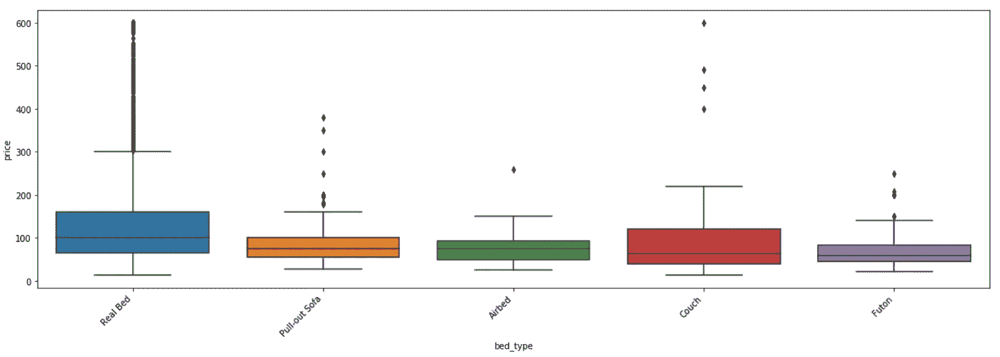****

****Figure 14****

****这里没有惊喜。****

******便利设施******

****便利设施文本框需要清理一下。****

```
**listings.amenities = listings.amenities.str.replace("[{}]", "").str.replace('"', "")
listings['amenities'].head()**
```

****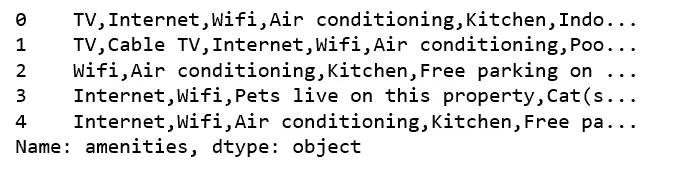****

****Figure 15****

****20 种最常见的娱乐设施。****

```
**pd.Series(np.concatenate(listings['amenities'].map(lambda amns: amns.split(","))))\
    .value_counts().head(20)\
    .plot(kind='bar')
ax = plt.gca()
ax.set_xticklabels(ax.get_xticklabels(), rotation=45, ha='right', fontsize=12)
plt.show();**
```

****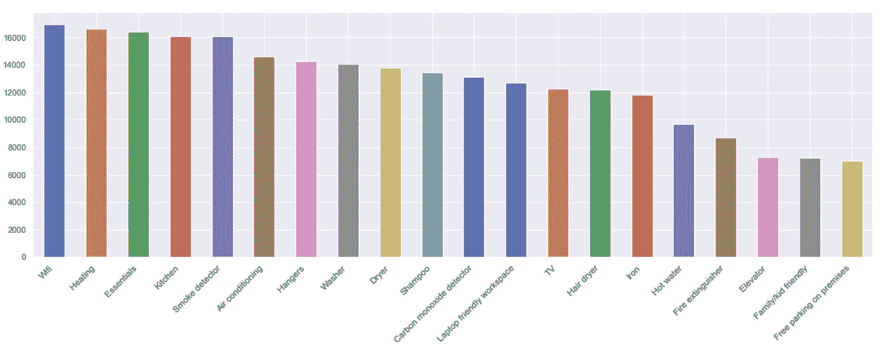****

****Figure 16****

****Wifi、暖气、必需品、厨房和烟雾探测器等都是最常见的便利设施。****

******便利设施与价格前 20 名******

```
**amenities = np.unique(np.concatenate(listings['amenities'].map(lambda amns: amns.split(","))))
amenity_prices = [(amn, listings[listings['amenities'].map(lambda amns: amn in amns)]['price'].mean()) for amn in amenities if amn != ""]
amenity_srs = pd.Series(data=[a[1] for a in amenity_prices], index=[a[0] for a in amenity_prices])amenity_srs.sort_values(ascending=False)[:20].plot(kind='bar')
ax = plt.gca()
ax.set_xticklabels(ax.get_xticklabels(), rotation=45, ha='right', fontsize=12)
plt.show();**
```

****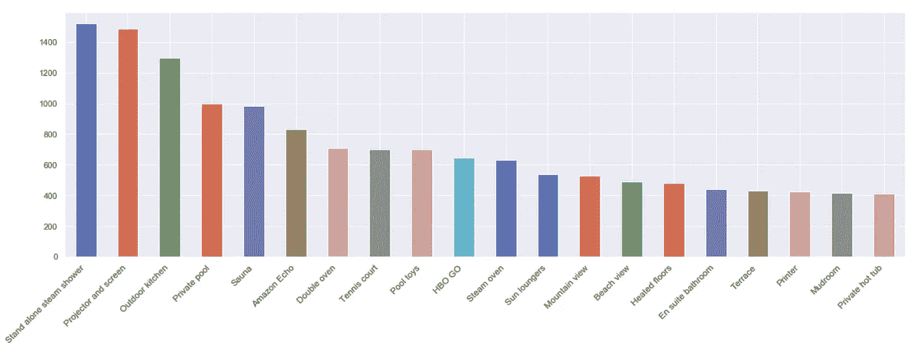****

****Figure 17****

****有趣的是，便利设施功能似乎与价格有一定关系。****

******床位数量与价格******

```
**listings.loc[(listings.price <= 600) & (listings.price > 0)].pivot(columns = 'beds',values = 'price').plot.hist(stacked = True,bins=100)
plt.xlabel('Listing price in $');**
```

****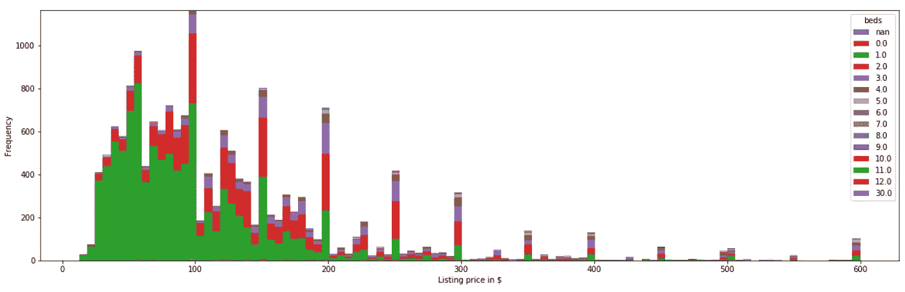****

****Figure 18****

****绝大多数房源都有一张床，一张床的房源价格差异很大。有没有床的列表。****

```
**sns.boxplot(y='price', x='beds', data = listings.loc[(listings.price <= 600) & (listings.price > 0)])
plt.show();**
```

****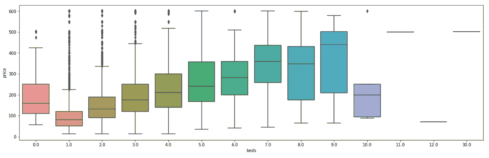****

****Figure 19****

****有趣的是，无床房源的中值价格高于 1 床和 2 床房源，而 10 床房源的中值价格非常低。****

******数字特征******

****我们选择了几个数字特征，并尝试一起探索它们。****

```
**col = ['host_listings_count', 'accommodates', 'bathrooms', 'bedrooms', 'beds', 'price', 'number_of_reviews', 'review_scores_rating', 'reviews_per_month']
sns.set(style="ticks", color_codes=True)
sns.pairplot(listings.loc[(listings.price <= 600) & (listings.price > 0)][col].dropna())
plt.show();**
```

****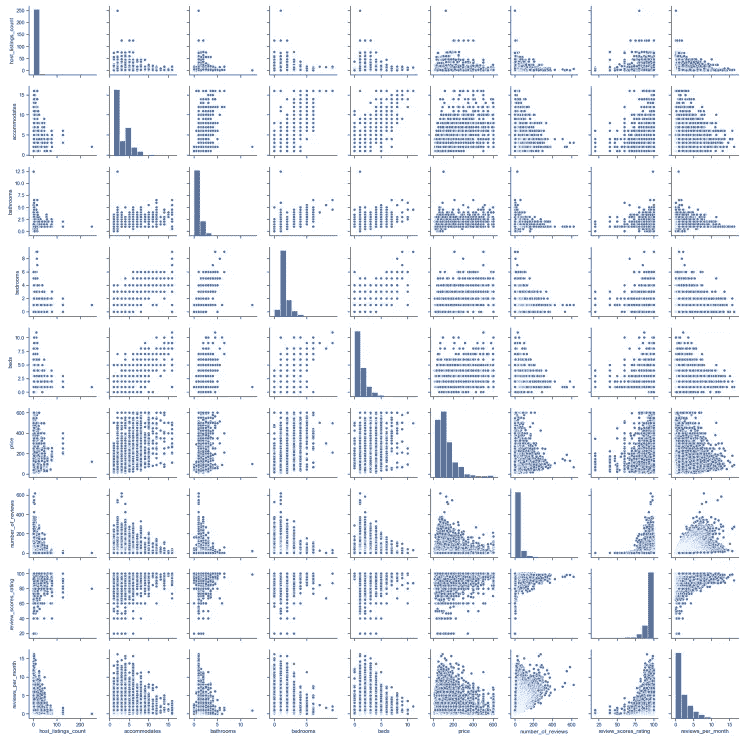****

****Figure 20****

```
**corr = listings.loc[(listings.price <= 600) & (listings.price > 0)][col].dropna().corr()
plt.figure(figsize = (6,6))
sns.set(font_scale=1)
sns.heatmap(corr, cbar = True, annot=True, square = True, fmt = '.2f', xticklabels=col, yticklabels=col)
plt.show();**
```

****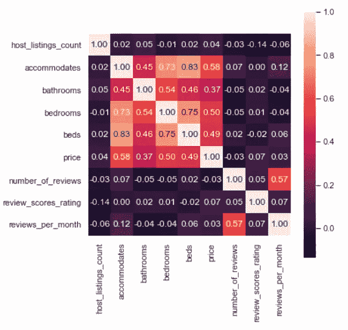****

****Figure 21****

****有一些不坏的消息，如卧室和住宿的数量似乎与价格相关。也容纳，床和卧室是相关的，我们将保留其中一个模型。****

# ****建模标价****

## ******数据预处理和特征工程******

****清理**价格**特征。我们将要建模和预测的特征。****

```
**listings['price'] = listings['price'].str.replace(',', '')
listings['price'] = listings['price'].str.replace('$', '')
listings['price'] = listings['price'].astype(float)
listings = listings.loc[(listings.price <= 600) & (listings.price > 0)]**
```

******娱乐设施**功能的术语文档矩阵。****

****amenities****

****如果为“f”，则将以下特性中的值替换为 0，如果为“t”，则替换为 1。****

```
**columns =  ['host_is_superhost', 'host_identity_verified', 'host_has_profile_pic',
                   'is_location_exact', 'requires_license', 'instant_bookable',
                   'require_guest_profile_picture', 'require_guest_phone_verification']
for c in columns:
    listings[c] = listings[c].replace('f',0,regex=True)
    listings[c] = listings[c].replace('t',1,regex=True)**
```

****用同样的方法清理其他货币值列。****

```
**listings['security_deposit'] = listings['security_deposit'].fillna(value=0)
listings['security_deposit'] = listings['security_deposit'].replace( '[\$,)]','', regex=True ).astype(float)
listings['cleaning_fee'] = listings['cleaning_fee'].fillna(value=0)
listings['cleaning_fee'] = listings['cleaning_fee'].replace( '[\$,)]','', regex=True ).astype(float)**
```

****以下是我们将使用的**数字**功能。****

****numeric_features****

****用中位数填充数值要素中缺失的值。****

```
**for col in listings_new.columns[listings_new.isnull().any()]:
    listings_new[col] = listings_new[col].fillna(listings_new[col].median())**
```

****处理和添加**分类**特征。****

```
**for cat_feature in ['zipcode', 'property_type', 'room_type', 'cancellation_policy', 'neighbourhood_cleansed', 'bed_type']:
    listings_new = pd.concat([listings_new, pd.get_dummies(listings[cat_feature])], axis=1)**
```

****添加我们之前从便利设施功能创建的术语文档矩阵。****

```
**listings_new = pd.concat([listings_new, df_amenities], axis=1, join='inner')**
```

****数据预处理和特征工程完成了！****

## ******随机森林回归器******

****RandomForestRegressor****

****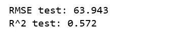****

******随机森林的特征重要性******

```
**coefs_df = pd.DataFrame()coefs_df['est_int'] = X_train.columns
coefs_df['coefs'] = rf.feature_importances_
coefs_df.sort_values('coefs', ascending=False).head(20)**
```

****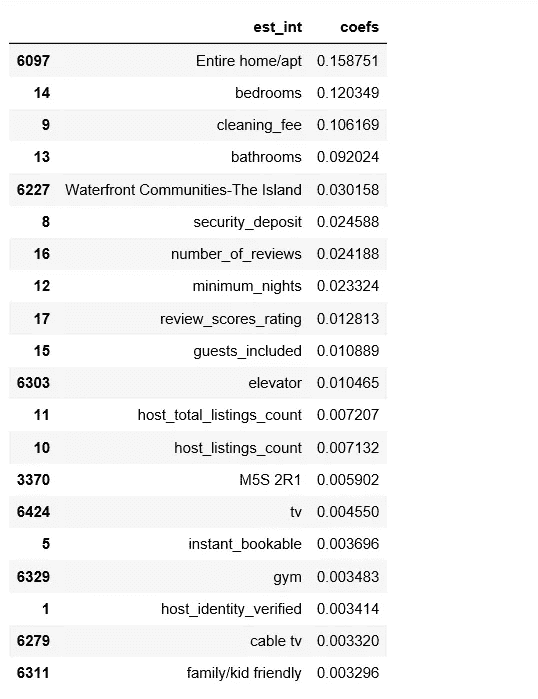****

****Figure 22****

## ****LightGBM****

****LightGBM****

****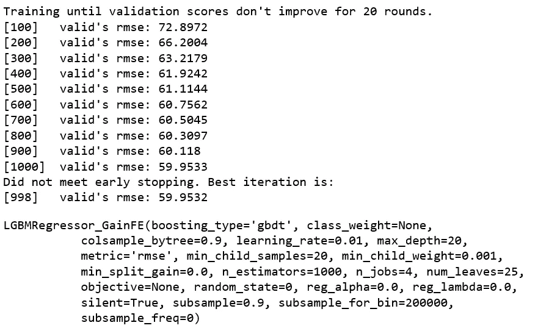********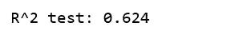****

******light GBM 的特征重要性******

```
**feat_imp = pd.Series(clf.feature_importances_, index=X.columns)
feat_imp.nlargest(20).plot(kind='barh', figsize=(10,6))**
```

****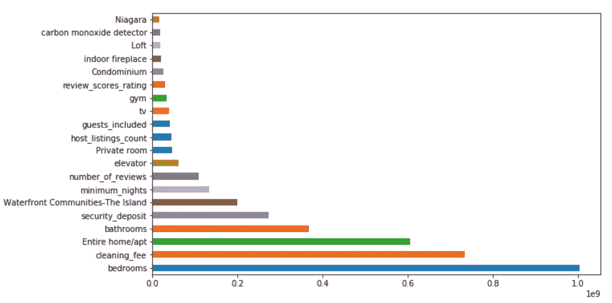****

****Figure 23****

****这两个模型产生的特征重要性是相似的。****

****因此，我们取得的最好结果是平均小于 60 美元的测试 RMSE 误差，该模型解释了 62.4%的上市价格波动。****

****结果好吗？不太好。然而，价格是一个很难建模的东西，似乎在功能中没有足够的信号。我们可能希望添加季节性、预订窗口、停留时间等功能。我将把它留给其他时间。****

****[Jupyter 笔记本](https://github.com/susanli2016/Machine-Learning-with-Python/blob/master/Airbnb%20Listing%20Toronto.ipynb)可以在 [Github](https://github.com/susanli2016/Machine-Learning-with-Python/blob/master/Airbnb%20Listing%20Toronto.ipynb) 上找到。享受这周剩下的时光。****