# 用 AWS Athena 探索墨尔本的 Myki 数据

> 原文：<https://towardsdatascience.com/exploring-melbournes-myki-data-with-aws-athena-511410d2e461?source=collection_archive---------4----------------------->

## 使用无服务器 SQL 查询对 S3 CSV 数据进行简单分析

编辑:应维多利亚数据中心的要求，本文中讨论的数据链接已被删除。

作为墨尔本居民和 Myki 公共交通票价系统的日常通勤者(无可奉告)，当我听说 2018 年墨尔本数据大会[的数据集将是大规模的真实世界 Myki 使用数据时，我很感兴趣。关于我们熙熙攘攘的城市如何使用公共交通网络，我们能收集到什么样的深刻见解？让我们来了解一下！最重要的是，我们将检查它，而不需要从 CSV 转换，甚至不需要将它移出 S3。](http://www.datasciencemelbourne.com/datathon/)

下面是我从这个 18 亿行的数据集中收集到的一些快速统计数据，SQL 查询只需几秒钟就能运行，比一杯咖啡的费用要低得多:

*   票价包括 65.65%的全票价，33.65%的付费优惠票价，以及少得可怜的 0.69%的免费乘车优惠
*   周日，维多利亚州老年人优惠卡持有者最喜欢去的地方是博克斯山火车站

## AWS 雅典娜

[AWS Athena](https://aws.amazon.com/athena/) 是一个完全托管的无服务器查询服务，允许您对存储在 S3 存储桶中的数据运行 SQL 查询——有点像魔术。基于 [Apache Hive](https://hive.apache.org/) 和脸书的 [Presto](https://prestodb.io/) ，Athena 让你定义(甚至发现)你的数据模式，然后立即开始运行查询。你所支付的只是雅典娜运行你的查询所需要的数据，以及在 S3 存储这些数据的费用。

因此，首先让我们获取数据，将其放入 S3，并准备我们的模式。

## 在 S3 准备我们的 Myki 数据

要先看一眼并探索数据文件，请查看这个公开的 S3 链接:

```
*Edit: by request of Data Victoria, links to the data discussed in this article have been removed.*(bucket contents is 25.4gb)---Once again, so many thanks to Data Science Melbourne for organising the Melbourne Datathon and providing the data. Thanks also to PTV for releasing the dataset.[http://www.datasciencemelbourne.com/datathon/](http://www.datasciencemelbourne.com/datathon/)
[https://www.ptv.vic.gov.au/](https://www.ptv.vic.gov.au/)
```

以下是我们今天感兴趣的文件的简要描述:

```
[events/](https://tomwwright-myki-data.s3.ap-southeast-2.amazonaws.com/lst.html?prefix=events/)         # our myki usage dataset is in here
 [Samp_0/](https://tomwwright-myki-data.s3.ap-southeast-2.amazonaws.com/lst.html?prefix=Samp_0/)        # data is split into ten chunks
  ScanOffTransaction/  # myki 'touch on' events when people board
  ScanOnTransaction/   # myki 'touch off' events from disembarking
   2015/        # year partitions
   ...
   2017/
    Week1/      # week partitions
    ...
    Week52/
     [QID3530164_20180713_12510_0.txt.gz](https://tomwwright-myki-data.s3.ap-southeast-2.amazonaws.com/Samp_0/ScanOffTransaction/2017/Week53/QID3530164_20180713_12510_0.txt.gz)    # data!
 [Samp_1/](https://tomwwright-myki-data.s3.ap-southeast-2.amazonaws.com/lst.html?prefix=Samp_1/)
 ...
 [Samp_9/](https://tomwwright-myki-data.s3.ap-southeast-2.amazonaws.com/lst.html?prefix=Samp_9/)
[calendar/](https://tomwwright-myki-data.s3.ap-southeast-2.amazonaws.com/lst.html?prefix=calendar/)       # map dates to week numbers, days of week, etc.
[cardtypes/](https://tomwwright-myki-data.s3.ap-southeast-2.amazonaws.com/lst.html?prefix=cardtypes/)      # myki fare types: full fare, concession, etc.
[stops/](https://tomwwright-myki-data.s3.ap-southeast-2.amazonaws.com/lst.html?prefix=stops/)          # links stop information to a stop id
```

为自己创建一个存储桶并复制数据！(如果您想更好地了解数据，可以随意复制其中一个`Samp_X`目录)

```
aws s3 mb s3://mediumreader-myki-data
aws s3 cp --recursive s3://bucket-no-longer-exists/ s3://mediumreader-myki-data/
```

轻松点。现在，我们告诉 AWS Athena 我们的数据是什么样子，以便它可以查询它——我们使用 AWS Glue 中的数据目录来完成这一点，它与 Athena 集成在一起。

## 在 AWS Glue 数据目录中准备我们的数据模式

[AWS Glue](https://aws.amazon.com/glue/) 是亚马逊完全托管的 ETL(提取、转换、加载)服务，可以轻松地从各种数据源准备和加载数据，以进行分析和批处理。今天，我们只对数据目录使用 Glue 感兴趣，因为这将允许我们在刚刚转储到 S3 的 Myki 数据上定义一个模式。AWS Glue 通过提供数据“爬虫”使这变得容易，这些爬虫可以窥视我们的数据并自动发现我们的大量模式。

*   导航到 *AWS 胶水*
*   从菜单中选择*爬虫*
*   选择*添加爬虫*


Getting started by adding a crawler to discover our schema

*   命名我们的爬虫 *myki_crawler*
*   点击*下一步，*这里我们不需要任何可选配置

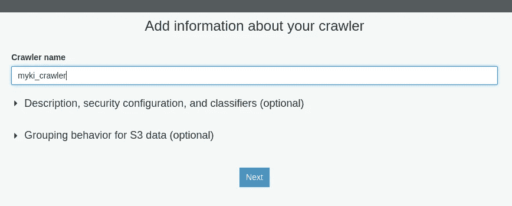

Naming our crawler, other optional config is fine as defaults

*   *S3* 数据仓库
*   *我的账户中指定的路径*
*   对于我来说，Include path 是*S3://tomwwright-myki-data/*，替换为您之前在复制数据时调用的 bucket
*   将*排除模式*留空，对于这个数据集，我们只清理爬虫发现的我们不想要的垃圾
*   点击*下一步，s* 选择*否*添加另一个数据存储，再次点击*下一步*

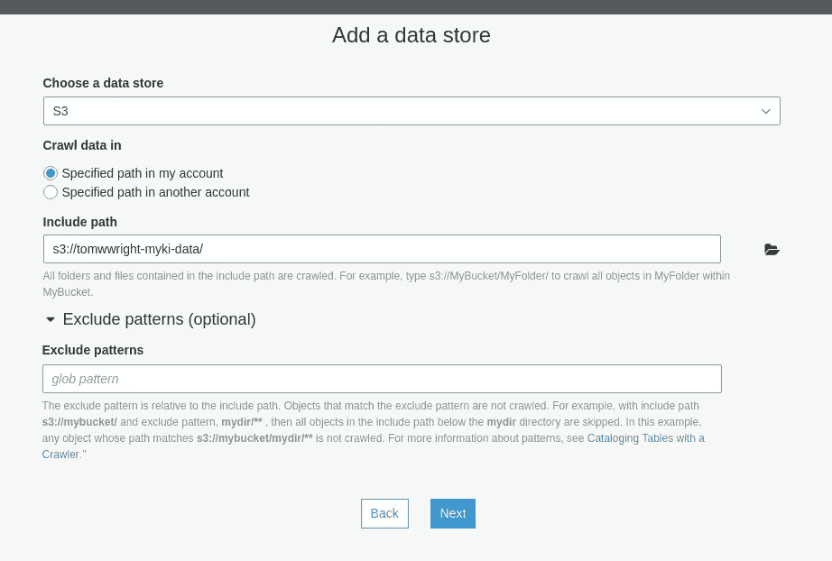

Pointing our crawler at our S3 data bucket

*   选择*创建一个 IAM 角色*(除非您已经为 Glue 准备好了角色)
*   输入 *MykiCrawler* 作为名字——或者随便你怎么想，我是一个中等职位，不是你的母亲
*   点击*下一个*

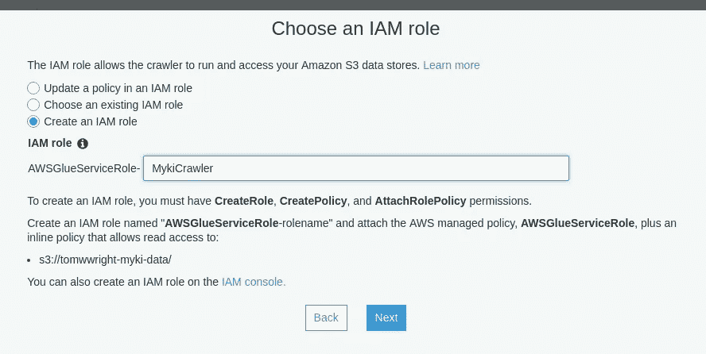

Creating an IAM role to give our crawler access to our bucket

*   选择“按需运行”作为频率，我们只想运行一次
*   点击*下一个*

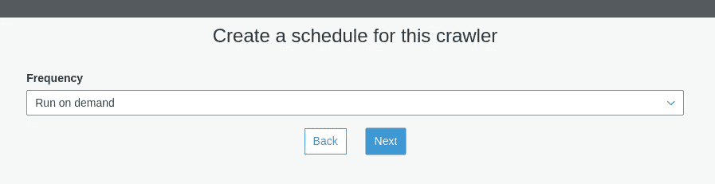

We just want to run it the once anyway…

*   选择*添加数据库*，姑且称之为 *myki* ，不需要任何的可选配置，点击*创建*
*   保持所有可选配置不变
*   点击*下一个*
*   点击*完成！*

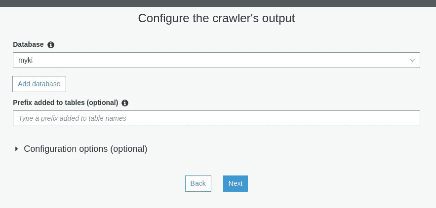

Creating a database for the tables discovered by the crawler

你应该已经回到 AWS Glue 的爬虫屏幕，所以选择 *myki_crawler* 并点击 *Run crawler* 。根据我的经验，跑步大概需要 7 分钟，所以你可以喝杯咖啡或者散散步。

一旦爬虫完成，我们将能够在*数据库- >表*下查看发现的表。我们要做的第一件事是删除一些垃圾表，这些垃圾表是爬虫通过检查我们的 S3 桶中的一些非数据文件而创建的——删除所有分类为 *Unknown* 的表，如下面的截图所示。我们本来可以通过忽略将它们复制到 bucket 中，或者将它们添加到 crawler 的 exclude paths 配置中来省去这个麻烦。哦，好吧，很容易删除它们。

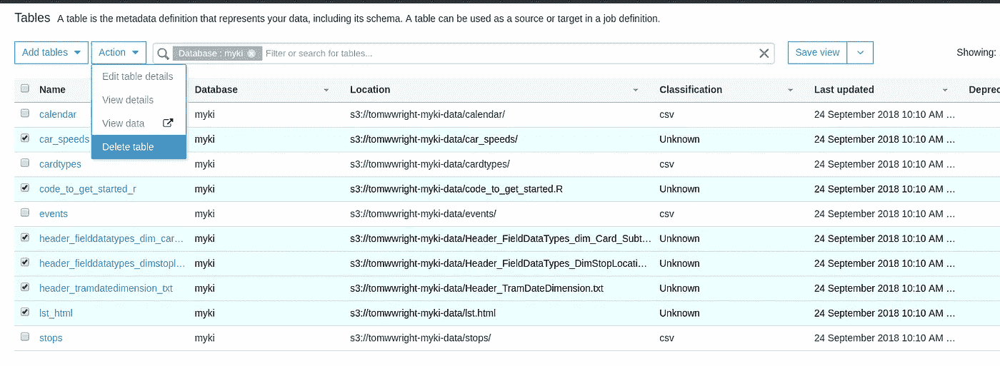

Deleting junk tables the crawler inadvertently created by scanning everything in the bucket — that’s our bad, oops.

打开日历表，我们可以看到爬虫为我们发现的所有好东西:数据格式、分隔符、记录计数、列类型等等。缺少的一点是列名，因为 myki 数据文件中没有该信息。下面你会发现一些我们需要应用的列标签(不一定是全部)，以便能够为我们的表编写可读的查询。选择一个表并点击右上角的*编辑模式*来更新列。

```
table: calendar1  col0   bigint   dateid
2  col1   string   date
3  col2   bigint   year
6  col5   string   month
13 col12  string   daytype  # 'Weekday', 'Weekend', 'Public Holiday'
16 col15  string   dayofweek---table: cardtypes1  col0   bigint   typeid
2  col1   string   typedesc
3  col2   string   paidorfree  # 'Paid', 'Free'
4  col3   string   concession  # 'Full Fare', 'Concession'---table: events1  col0   bigint   mode
2  col1   string   date
3  col2   string   datetime
4  col3   bigint   cardid
5  col4   bigint   cardtypeid
6  col5   bigint   vehicleid8  col7   string   routeid
9  col8   string   stopid
10 partition_0     samplenum
11 partition_1     onoroff  # 'ScanOffTransaction', 'ScanOnTra...on'
12 partition_2     year
13 partition_3     week---table: stops1  col0   bigint   stopid
2  col1   string   name
3  col2   string   longname
4  col3   string   stoptype
5  col4   string   suburb
6  col5   bigint   postcode
10 col9   double   lat
11 col10  double   long
```

有了我们的列名，我们终于准备好做一些查询了！

## 用 AWS Athena 查询我们的模式

通过点击 Athena 服务，我们发现自己首先出现在查询编辑器屏幕上。酷，让我们选择我们的`myki`数据库并插入一个简单的计数查询！

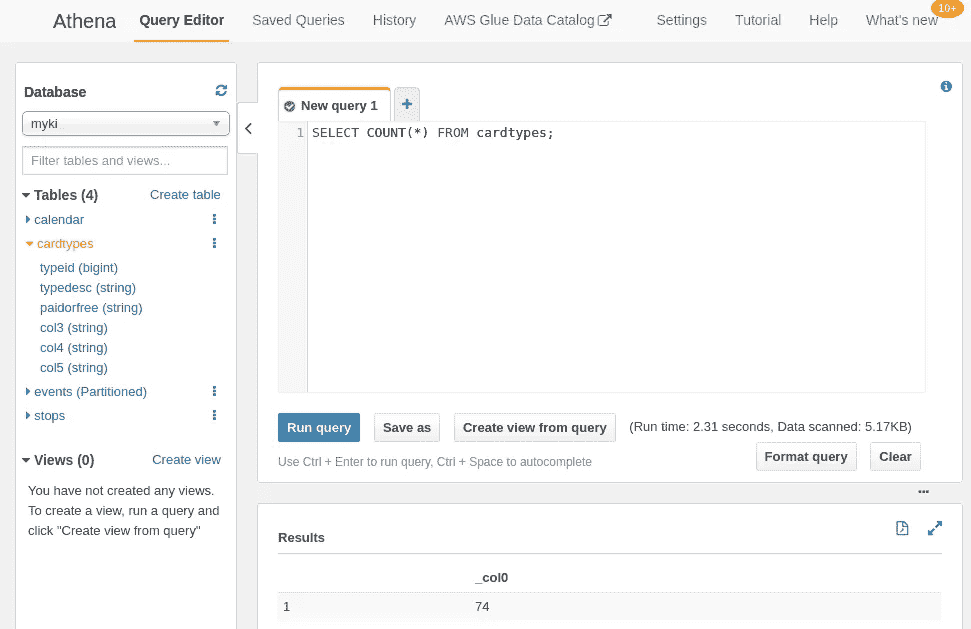

AWS Athena’s Query Editor makes it simple to develop queries against our Myki schema

当我们得到一个我们真正满意的查询时，我们可以点击`Save as`并给它一个名字，然后我们可以很容易地找到它并在`Saved Queries`下再次运行它。Athena 还允许我们在`History`下访问我们的查询历史，在那里我们可以下载任何查询结果。

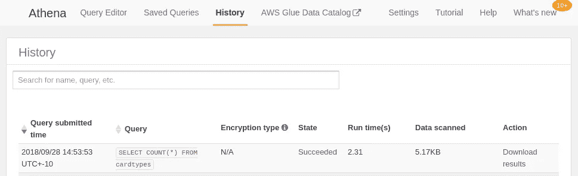

AWS Athena’s query history allows us to find our past queries and download the results

这里需要注意的一个重要指标是 Athena 查询所扫描的**数据**，因为 Athena 的[定价直接(且仅)与 Athena 在运行查询的过程中读取的数据量相关:](https://aws.amazon.com/athena/pricing/)

> “Amazon Athena 会根据扫描的字节数向您收费，四舍五入到最接近的兆字节，每次查询最少 10MB。
> 
> 扫描每 TB 数据 5 美元”

由于它操作的是普通的平面文件，Athena 很难智能地处理它所扫描的数据，通常它需要读取模式指定的构成表的所有文件。除非在创建模式时，指定了**分区**来定义映射到目录的“列”, Athena 可以使用这些目录来智能地判断对于给定的查询应该扫描哪些数据。举例来说，回想一下我们数据的文件夹结构:

```
[events/](https://tomwwright-myki-data.s3.ap-southeast-2.amazonaws.com/lst.html?prefix=events/)         # our myki usage dataset is in here
 [Samp_0/](https://tomwwright-myki-data.s3.ap-southeast-2.amazonaws.com/lst.html?prefix=Samp_0/)        # data is split into ten chunks
  ScanOffTransaction/  # myki 'touch on' events when people board
  ScanOnTransaction/   # myki 'touch off' events from disembarking
   2015/        # year partitions
   ...
   2017/
    Week1/      # week partitions
    ...
    Week52/
     [QID3530164_20180713_12510_0.txt.gz](https://tomwwright-myki-data.s3.ap-southeast-2.amazonaws.com/Samp_0/ScanOffTransaction/2017/Week53/QID3530164_20180713_12510_0.txt.gz)    # data!
 [Samp_1/](https://tomwwright-myki-data.s3.ap-southeast-2.amazonaws.com/lst.html?prefix=Samp_1/)
 ...
 [Samp_9/](https://tomwwright-myki-data.s3.ap-southeast-2.amazonaws.com/lst.html?prefix=Samp_9/)
[calendar/](https://tomwwright-myki-data.s3.ap-southeast-2.amazonaws.com/lst.html?prefix=calendar/)       # map dates to week numbers, days of week, etc.
[cardtypes/](https://tomwwright-myki-data.s3.ap-southeast-2.amazonaws.com/lst.html?prefix=cardtypes/)      # myki fare types: full fare, concession, etc.
[stops/](https://tomwwright-myki-data.s3.ap-southeast-2.amazonaws.com/lst.html?prefix=stops/)          # links stop information to a stop id
```

我们的`events`文件夹由一系列子文件夹组成，这些子文件夹按照几个关键列整齐地划分我们的事件数据:一个编号的样本文件夹，无论它是一个接触式事件还是触发式事件，年份和星期。幸运的是，我们的 AWS Glue crawler 足够聪明，能够注意到所有这些，并且已经在我们的模式中组织了所有这些！不错！

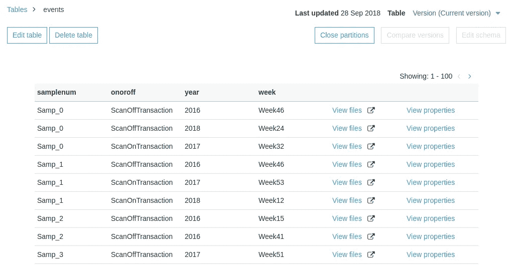

You can view partitions for a table in the AWS Glue Data Catalogue

为了说明这些分区的重要性，我用*两个不同的查询*计算了 2016 年使用的唯一 Myki 卡的数量(顺便说一下，大约 740 万张):一个使用数据中`date`列的`LIKE`操作符，另一个使用我们的`year`分区列。

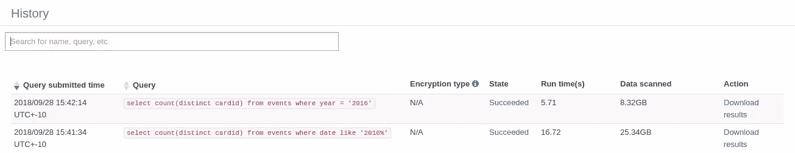

The power of partitioning: Athena scans only the relevant data for 2016, less than 30% of the entire dataset

我们使用`date LIKE '2016%'`的第一个查询必须扫描整个`events`表，总共 25gb，因为 Athena 无法确定哪些文件中可能有匹配行。此查询的成本约为 0.12 美元。

我们使用`year = '2016'`的第二个查询能够检索我们的结果，并且只扫描 8g 的`events`数据！这是因为`year`是映射到我们的 S3 数据中特定键模式的分区列之一。该查询的成本约为 0.04 美元，运行时间不到三分之一！

使用分区智能地组织数据是能够在 Athena 上运行快速且经济高效的查询的关键。好吧，我们继续！

## 触发的热门站点

所以，我的第一个想法是，人们使用 Myki 会去哪里？用 SQL 回答这个问题似乎很简单，让我们从获得最受欢迎的站点列表开始。

```
# top 20 stop ids for touch-off events select stopid, count(*) as count
from events
where onoroff = 'ScanOffTransaction'
group by stopid
order by count desc
limit 20;
```

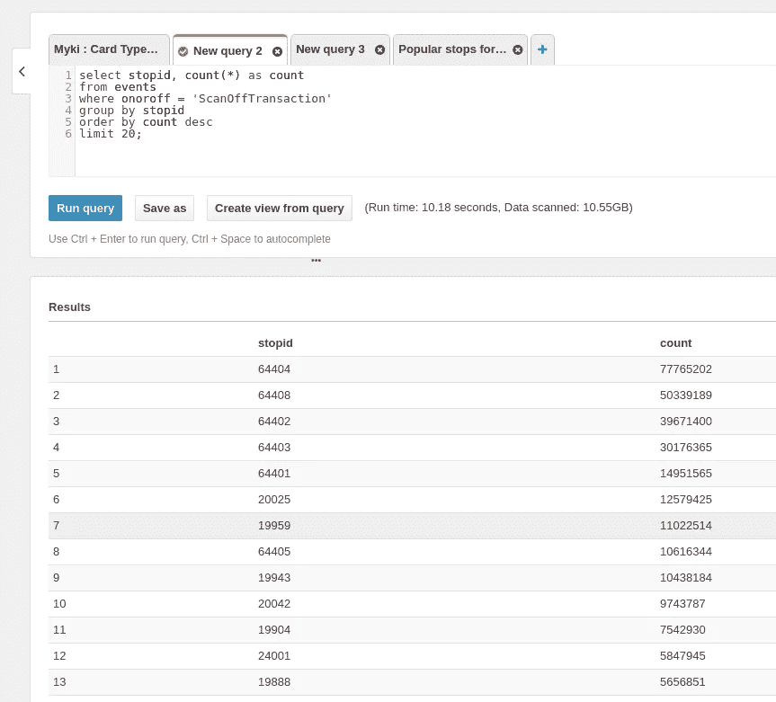

Touch-off events aggregated by the stop ID

很好，我们可以用我们的`stops`表来连接这个，以获得一个更易于阅读的表示，就这么做吧。

```
# select our top stops like before, then join to our stops tablewith topstops (stopid, count) as (
  select stopid, count(*) as count
  from events
  where onoroff = 'ScanOffTransaction'
  group by stopid
)
select topstops.stopid, stops.longname, stops.suburb, topstops.count
from topstops left outer join stops
on topstops.stopid = stops.stopid
order by topstops.count desc
limit 20;
```

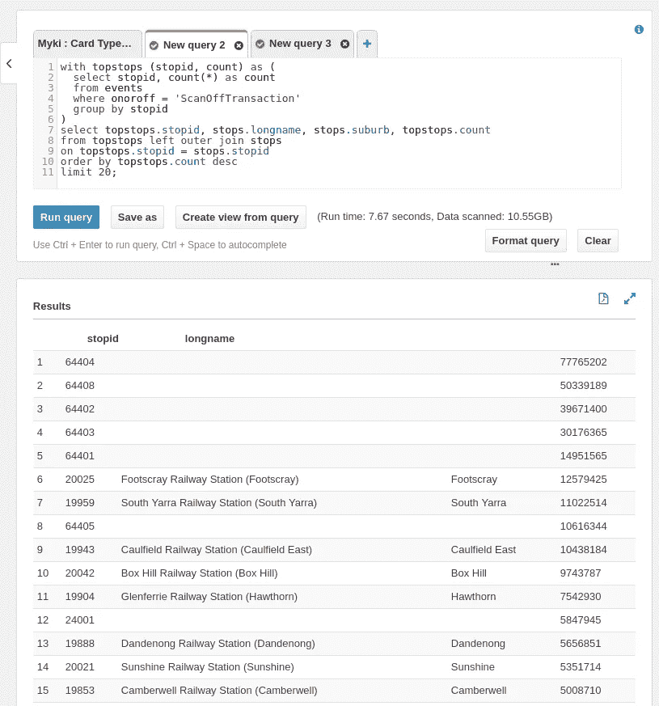

Results of running our “top touch-off stops” query

嗯。有一堆`stopid`行遗漏了`stops`信息……对我来说，鉴于它们是最受欢迎的车站，并且有正确的数字，我的猜测是`64xxx`站是城市环路铁路站，也许`24001`是里士满站？

除此之外，这些结果对我来说是有意义的，看到所有的顶级车站都是火车站一点也不奇怪。


Melbourne’s City Loop — map courtesy of [Public Transport Victoria](https://static.ptv.vic.gov.au/PDFs/Maps/Network-maps/1535090671/PTV_MetropolitanTrainNetworkMap_August2018.pdf)

## 票价类型的细分

似乎总是有一些关于向各种群体提供优惠公共交通出行的肆意支出的喋喋不休。全价票和优惠票的细目是什么？同样，看起来很简单。让我们首先根据`events`表中的卡类型进行汇总。

```
# aggregate our touch-on events by the card type usedselect cardtypeid, count(*) as count
from events
where onoroff = 'ScanOnTransaction'
group by cardtypeid
order by count desc
```

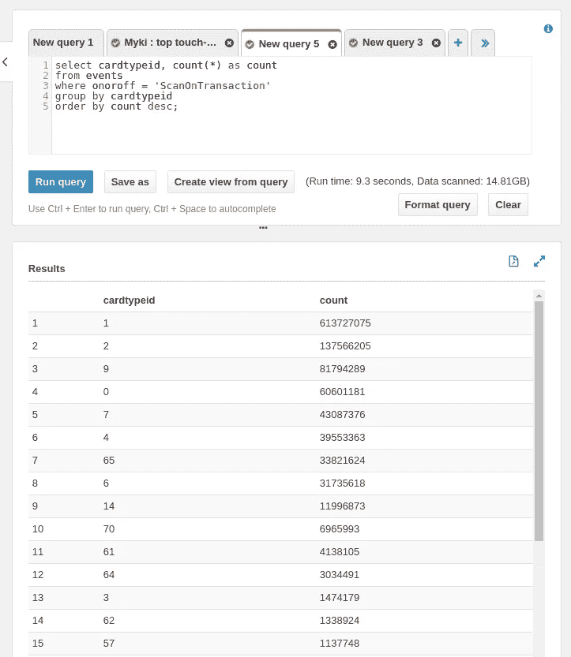

Touch-on events aggregated by the card type ID

很好，所以和上次一样，让我们加入到我们的`cardtypes`表中来，以提供更多人类可读的信息:

```
# aggregate by card type as before, then join to card types
# information to determine concession and paying statuswith cardtypecounts (cardtypeid, count) as (
  select cardtypeid, count(*) as count
  from events
  where onoroff = 'ScanOnTransaction'
  group by cardtypeid
)
select cardtypecounts.cardtypeid, cardtypes.typedesc, cardtypes.concession, cardtypes.paidorfree, cardtypecounts.count
from cardtypecounts left outer join cardtypes
on cardtypecounts.cardtypeid = cardtypes.typeid
order by cardtypecounts.count desc;
```


Top fare types and concession / paying status

全价乘客看起来占了绝大多数，是最常见(但标签模糊)优惠票价类型的 4 倍多。但是列表的其余部分是由各种不同的特许权类型组成的，所以可能不会这么简单。唯一进入前 14 名的免费乘车类型是`Employee Travel Pass`——有道理。

让我们通过再次汇总来进行更高层次的观察，我对全价、优惠和免费的总体细分很好奇。

```
# further aggregating our query by concession and paying
# statuseswith cardtypecounts (cardtypeid, count) as (
  select cardtypeid, count(*) as count
  from events
  where onoroff = 'ScanOnTransaction'
  group by cardtypeid
)
select cardtypes.concession, cardtypes.paidorfree, sum(cardtypecounts.count) as count
from cardtypecounts left outer join cardtypes
on cardtypecounts.cardtypeid = cardtypes.typeid
group by cardtypes.concession, cardtypes.paidorfree 
order by count desc;
```


Full-fare vs. concession vs. free fare types

好吧，这就是全貌:65.65%的全价票，33.65%的付费优惠票，以及少得可怜的 0.69%的免费乘车优惠票。

## 老年人的最佳周日目的地

最后，让我们尝试一些稍微具体的东西。在一个星期天，我们的高级公共交通用户喜欢去哪里？

加入我们的`calendar`表将允许我们确定哪些日期是`Sunday`，我们之前对票价类型的查询显示`cardtypeid = 9`是我们需要寻找的`Victorian Seniors Concession`票价类型。厉害！

```
# selecting touch-on events that were on a Sunday using a Victorian Seniors
# Concession fareselect stopid, count(*) as count
from events, calendar
where onoroff = 'ScanOffTransaction'
and events.date = calendar.date
and events.cardtypeid = 9
and calendar.dayofweek = 'Sunday'
group by events.stopid;
```

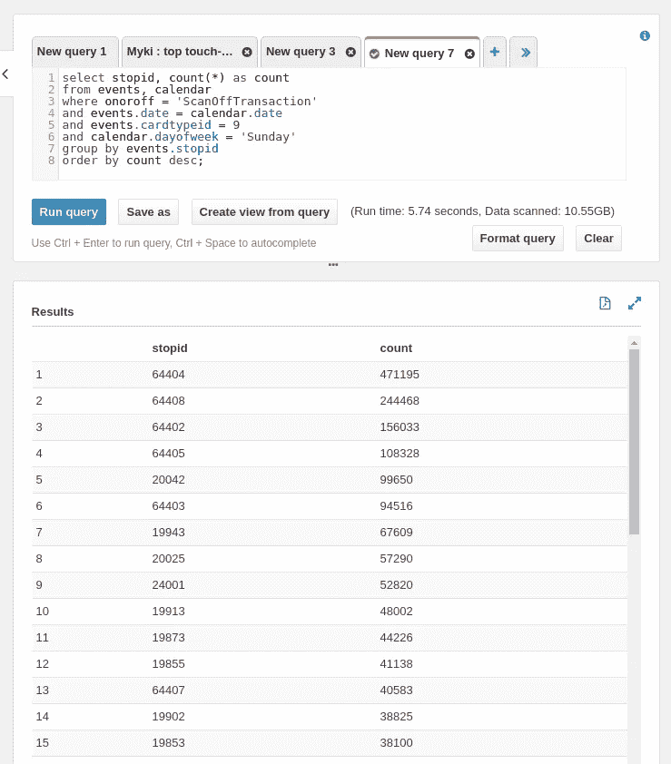

Touch-on events on a Sunday by seniors, aggregated by the stop ID

现在就像我们的第一个查询一样，加入到`stops`来给我们一些人类可读的信息。再次记住有些止损点似乎错过了他们的信息…

```
# join or sunday seniors stops to stops informationwith seniorsundaystops (stopid, count) as (
  select stopid, count(*) as count
  from events, calendar
  where onoroff = 'ScanOffTransaction'
  and events.date = calendar.date
  and events.cardtypeid = 9
  and calendar.dayofweek = 'Sunday'
  group by events.stopid
)
select seniorsundaystops.stopid, stops.longname, stops.suburb, seniorsundaystops.count
from seniorsundaystops left outer join stops
on seniorsundaystops.stopid = stops.stopid
order by seniorsundaystops.count desc;
```

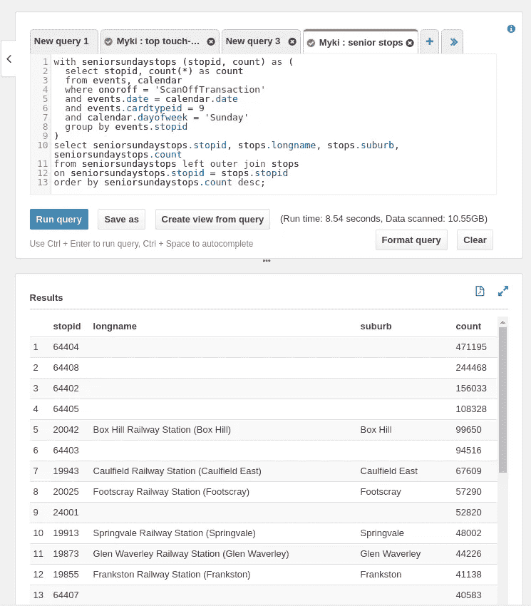

我们神秘的未命名站点(几乎可以肯定是城市环路站点)仍然领先，但显然我们挥舞着 Myki 的老年人喜欢在 Box Hill，Caulfield 和 Footscray 度过时光。谁知道呢。

## 包扎

花点时间想想这种技术有多酷是有好处的，因为一旦你投入进去，就很容易忘记。能够运行带有连接的 SQL 查询，只针对位于 S3 的 CSV 文件。令人印象深刻。

这个 Myki 数据也不是一个可以分析的小数目。超过 18 亿行，我们能够在不到 10 秒的时间内处理它。而且它的成本非常低。本文中列出的查询扫描了大约 145 千兆字节的 S3 数据，总共花费了我巨大的…

$0.75

查询愉快！汤姆

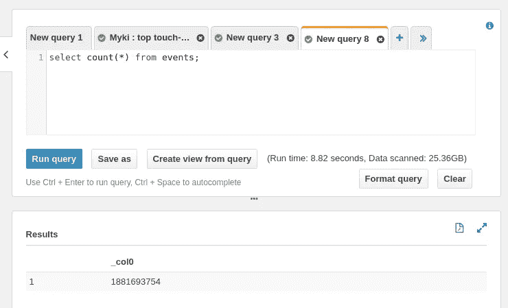

Counting our data — it’s a decent bit to be crunching in under 10 seconds and paying next to nothing for