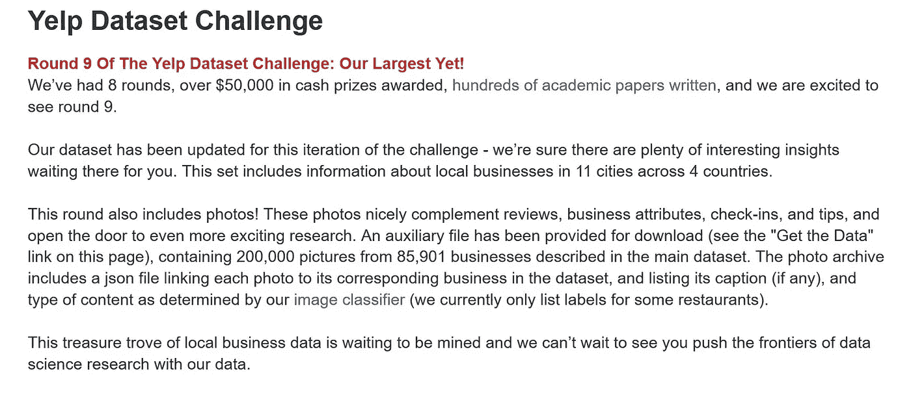
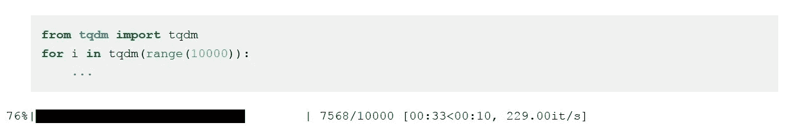
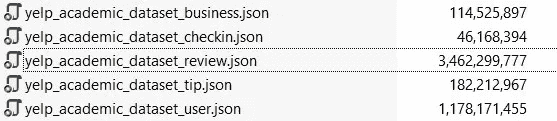
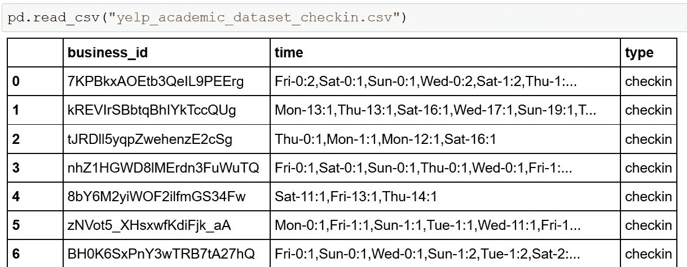
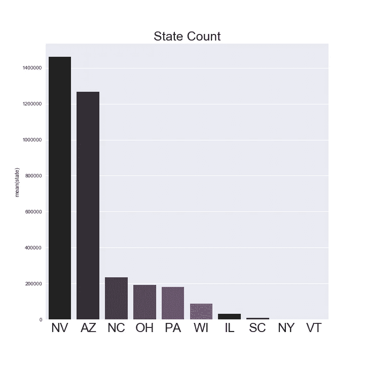
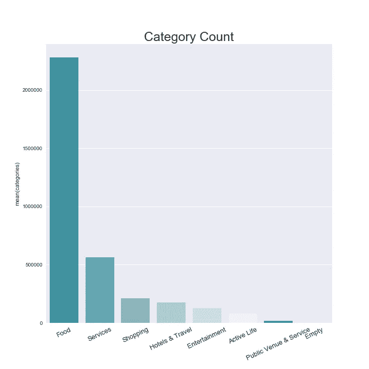

# 探索 NLP/AWS/BigData:第 1 部分

> 原文：<https://towardsdatascience.com/exploring-nlp-aws-bigdata-part-1-53716f3ad671?source=collection_archive---------5----------------------->

我必须承认，在我探索机器学习的时候，我对 [NLP](https://en.wikipedia.org/wiki/Natural_language_processing) (自然语言处理)并不太感兴趣，实际上我把它和另一个 [NLP](https://en.wikipedia.org/wiki/Neuro-linguistic_programming) (神经语言编程)混淆了。但是当我在大会上重温我的顶点项目的材料时，我偶然发现了由 [YELP](https://www.yelp.com/dataset_challenge) 提供的这个惊人的数据。数据集非常具有描述性，但是非常庞大，但是可以分为两条路线(NLP 或图像识别)。

在这个系列中，我将使用 yelp 提供的数据集回顾我探索 NLP 技术的过程。我将探索我的陷阱和策略，并希望我能帮助揭开一些概念的神秘面纱。在本系列中，我还将回顾我使用 AWS 弹性计算云( [E2C](https://aws.amazon.com/ec2/) )的经历，并用 Scala 语言复制 python 中的几种机器学习技术(我觉得这种语言**可以完成**的工作，但对于一个来自 Python 和 C++的人来说，这是一种如此丑陋的语言)。

# Yelp 数据集

*   图像分类通过有 5 千兆压缩的 JPEGs。
*   来自几个主要城市的商业/用户/评论数据库。

> 英国:爱丁堡
> 
> 德国:卡尔斯鲁厄
> 
> 加拿大:蒙特利尔和滑铁卢
> 
> 美国:匹兹堡、夏洛特、厄巴纳-香槟、凤凰城、拉斯维加斯、麦迪逊、克利夫兰



# 踪迹地图

1.  规范化、清洗和 EDA。
2.  模型选择(逻辑回归、贝叶斯、随机森林)
3.  使用 AWS 的 Spark、Scala 和 Hadoop。
4.  Word2Vec。

# 设置和库:

我用的是 Python 3.5.2 |Anaconda 自定义(64 位)。

Git bash 终端。

我的电脑运行的是 I-7–5500 2.40 GHz 和 8GB RAM(我们将把它与 AWS 服务器进行比较，看看为什么后者是更好的选择)

*   [空间](https://spacy.io/)(版本 1.8.0)。安装了英语“en”型号。这在处理“停用词”时很重要。

```
pip install spacy
sudo python -m spacy download en
```

*   NLTK(3 . 2 . 1 版)另一个比 SpaCy 更老的 NLP 库。
*   gensim(版本 2.1.0)是一个很棒的免费库，我用来实现 Word2Vec
*   [全球](https://docs.python.org/2/library/glob.html)。从路径名中读取文件。
*   [tqdm](https://pypi.python.org/pypi/tqdm) (4.11.2)这是可选的，但是当你想检查一个熊猫函数的进度时，这是必须的。这些文件是巨大的，当你运行所有的东西时，看到你在哪里是很棒的。



# SpaCy 对 NLTK:

简而言之空间就是[快](https://spacy.io/docs/api/)。在我最初的 YELP 草稿中，我一直与这两个库合作，并且在“标记化”和“词汇化/词干化”过程中，我使用 SpaCy 做了许多繁重的工作，它非常快速和健壮。

# JSON 到 CSV:

Yelp 提供的数据集由原始 json 组成。我的第一个挑战是将如此大的文件管理成可以翻译成 Python pandas 的东西。



Do not open this with pythons.read() . You’ll regret it.

我找到的解决方法是链接[这里](https://gist.github.com/paulgb/5265767)。这将需要一段时间来转换，尤其是 review.json。对于 Python 3 用户，您可能需要将这一行代码添加到上面的链接中。

```
**tqdm**(glob('yelp_academic_dataset_checkin.json')):
df = pd.DataFrame([convert(line) for line in **open**(json_filename)]) 
```

一旦 json 被转换成 CSV 格式，你可以用熊猫打开它，结果应该是这样的。



# 约束条件:

重要的是要记住，我的最终数据集不同于 YELP 提供的数据集。有大量的删改工作，包括将所有评论保留在美国和英国。原始数据集包含美国境内外的德国评论，因为拉斯维加斯是一个主要的旅游目的地，所以我看到一些德国评论并不奇怪。然而，我决定消除这些类型的审查，留在美国是基于领域知识。我不认为自己非常精通英语语言学，但我理解现代口语和基本的语法结构，作为美国公民，我也能理解每个城市/州的风味和内涵。当我探索欧洲城市时，我失去了这种能力(我不能告诉你英国哪个地区以炸鱼薯条闻名，但我知道最好的 Tocos 总是在边境以南，胸肉在德克萨斯州是国王)。另外，我唯一知道的德语单词是“幸灾乐祸”和其他。。。脏话。

YELP API 中的[类别](https://www.yelp.com/developers/documentation/v2/category_list)是另一个挑战。问题是如何处理数据框中的嵌套数组。最后，我决定将每个类别过滤成 7 个主要类别和一个空角色。

# 我们来看看数据:

使用美国大约 300 万条评论的整个数据集。



The bulk of the reviews came from NV,AZ,NC. With only 2 reviews for VT.



# 可视化:

这里有一个表格[显示了 Q1 第四季度时间序列中平均商业得分最高的四个州。](https://public.tableau.com/shared/M47S89PRC?:display_count=yes)

## 后续步骤:

在我的下一篇文章中，我将探索模型选择过程。(逻辑回归、多项式朴素贝叶斯、随机森林)。我将讨论每种策略的利与弊，以及幕后发生的一些事情。