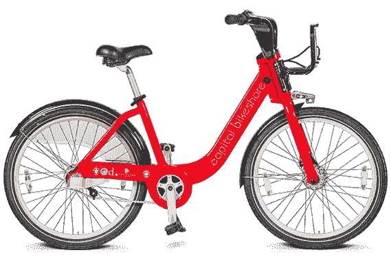
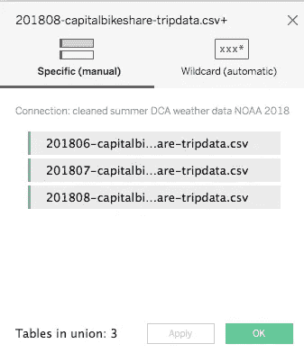
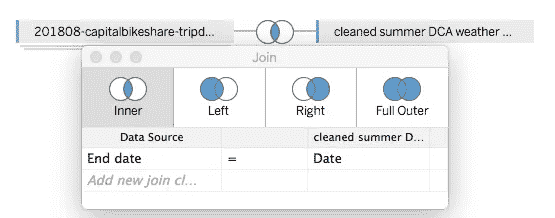
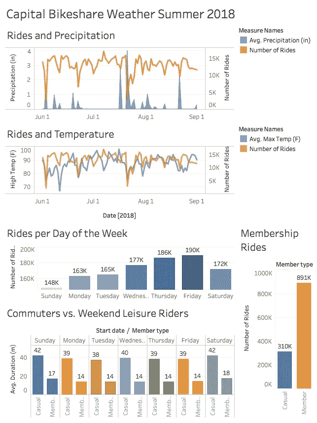

# 探索 Tableau 与资本自行车共享和天气数据

> 原文：<https://towardsdatascience.com/exploring-tableau-with-capital-bikeshare-and-weather-data-7da84f0ecee2?source=collection_archive---------9----------------------->

在这篇文章中，我将向您展示如何使用 Tableau Public 2018 进行一些有趣的数据分析和可视化。

我们将在 2018 年夏天探索华盛顿 DC 地区的首都自行车共享用户。特别是，我们将看看天气、星期几和会员类型如何影响乘客量。

我们开始吧。🚀

# （舞台上由人扮的）静态画面

[Tableau](https://www.tableau.com/) 是一款超级强大的数据分析和数据可视化工具。它已被各种公司广泛采用，以帮助他们变得更加数据驱动。对于许多数据科学家、业务分析师和高管来说，这是一个能够使用的重要程序。

整个 DC 市区有超过 4300 辆自行车共享单车。我是一个自行车共享成员，并挖掘它。我只是希望有更多的自行车和码头:)

# 数据

首都自行车共享数据可在此免费获取:

 [## 系统数据|首都自行车共享

### 开发者、工程师、统计学家和学者可以找到并下载首都自行车共享会员的数据…

www.capitalbikeshare.com](https://www.capitalbikeshare.com/system-data) 

天气数据可在此免费获取:

 [## 搜索|在线气候数据(CDO) |国家气候数据中心(NCDC)

### 气候数据在线(CDO)国家气候数据中心(NCDC)定位数据的主要一般搜索页面…

www.ncdc.noaa.gov](https://www.ncdc.noaa.gov/cdo-web/search) 

Tableau Public 可在此免费获得:

 [## Tableau 软件

### Tableau 可以帮助任何人看到和理解他们的数据。连接到几乎任何数据库，拖放创建…

www.tableau.com](https://www.tableau.com/) 

Bikeshare 数据只包含几个字段。

*   持续时间—行程的持续时间
*   开始日期—包括开始日期和时间
*   结束日期—包括结束日期和时间
*   起点桩号—包括起点桩号名称和编号
*   终点桩号—包括终点桩号名称和编号
*   自行车号码—包括旅行中使用的自行车的 ID 号
*   会员类型—表示用户是“注册”会员(年度会员、30 天会员或日间会员)还是“临时”会员(单程、24 小时通票、3 天通票或 5 天通票)

仅查看 2018 年 6 月、7 月和 8 月就有 100 万条记录，因此我们将在这三个月停下来做这个练习。进入 Tableau 工作表后，您可以创建一个计算字段，使*持续时间*更容易处理。*持续时间*如果你想以分钟而不是秒为单位工作，需要除以 60。或者你可以提前在 Excel 或 Google Sheets 中完成。

我从 NOAA 获取了里根国家机场(DCA)从 2018 年 6 月 1 日到 2018 年 8 月 31 日的温度和降水数据。当数据可以下载时，NOAA 会给你发一封电子邮件。只需要一分钟。我删除了。csv 文件除了*降水，最高温度，*和*日期*使用 Excel。🌦

# 导入和设置数据

确保在添加天气数据之前将 Bikeshare 数据添加到 Tableau。这将在您稍后更改 Bikeshare 数据的主键时派上用场。

在 Tableau 中，执行一个 [union](https://www.tableau.com/about/blog/2016/1/combine-your-data-files-union-tableau-93-48891) 来快速垂直连接所有观察结果(也称为添加更多行)。

然后是添加天气数据的时候了。我们需要在自行车共享数据中加入天气数据。为了使这个连接工作，需要使用一个日期列作为键，即两个表中的共享列。

如果不进行修改，Bikeshare *开始日期*列将无法工作，因为它是日期时间格式，而天气数据的日期字段是日期格式。Tableau 的数据解释器可能在这方面有所帮助，但每当我试图使用它时，它都会抛出一个错误。这个问题发生在文本文件中，包括。csv 文件。如果你先把你的数据存成一个. xls 文件，它可能会工作——我没有测试过。

对于这个分析，我们并不真正需要*开始日期*和*结束日期*列，所以我将*结束日期*列转换为*日期*数据类型。

实际上花了一些时间来弄清楚如何让 Tableau 保存一个新的数据库字段用于连接。诀窍在于，在你点击工作表之前，Tableau 不会保存数据类型的改变。然后，您可以返回到数据源选项卡并进行连接。

# 数据可视化和分析乐趣

我制作了一些可视化的工作表，探索数据的各个方面。然后我把其中几个组合成一个仪表盘和一个故事，你可以在这里看到。仪表板和故事可以嵌入到大多数网站中，但 Medium 不允许真正的嵌入 html 或 javascript 代码，所以您在下面看到的是一个截图。

同样，对于交互式版本，请点击[这里](https://public.tableau.com/profile/jeff.hale6436#!/vizhome/CapitalBikeshareWeatherSummer2018_0/CapitalBikeshareSummer2018Story?publish=yes)。Tableau 的强大之处在于它的交互式图表，所以我鼓励你去看看这个网站。

最上面的两个图表是双轴图表。我不喜欢双轴图表，因为它们通常不像单轴图表那样直观。然而，它们可以很好地显示三个变量之间的关系。

# 分析

在某些情况下，高降雨量确实与低乘车率相一致。看起来下雨和低客流量之间有关系。🌧

分解一天中的时间来观察乘客量会很有趣。深夜或清晨的雨可能对乘客没有什么影响。我们将把这个分析留到以后。😃

有趣的是，温度对乘车人数没有明显的影响。

我很惊讶地发现，夏季的周四和周五的客流量比一周前几天要高得多。一周中每天的*乘车次数*条形图清楚地表明了这种关系。

有趣的是，成员们骑行的时间比临时的、不骑马的成员要短得多。这是有道理的，因为会员可能主要是通勤者，而非会员可能是悠闲地参观购物中心周围景点的游客。

在这三个月中，会员的旅行次数几乎是非会员的三倍。随着旅游季节的结束，这种差距是否会扩大，这将是一件有趣的事情。

Tableau Public 没有很多内置的统计工具，尽管它增加了更多。你可以拟合一条趋势线，了解是否有一些相关性。唯一有意义的(p < .05) correlation I found via linear regression was between date and temperature — it got hotter over the summer. ☀️ Not a shock there.

# Conclusion

In this article we found some interesting insights about Bikeshare ridership in Washington DC by using Tableau and combining two publicly available datasets. Tableau makes data analysis fast; it took just a few hours to find, clean, and join the data, make the dashboard, and write this article.

There are lots of related analyses and projects it would be neat to explore, in addition to the ones mentioned above. It would be interesting to look at data since the program’s inception in 2010 to see how ridership has increased.

It would also be interesting to create a forecast for ridership using machine learning. Tableau Public doesn’t allow easy links to python code, but the Tableau Desktop, which recently jumped to $70 per user, does.

Finally, Bikeshare is about to unveil its first electronic bikes. It could be interesting to dig into that data in a few months to see how they are used.

# Wrap

Thanks for reading. 👍 I hope you found this article helpful. If you did, please share it on your favorite social media channel. 😃

I encourage you to try out Tableau if you haven’t. Udemy’s [*Tableau 10 A-Z:数据科学实践 Tableau 培训！*](https://www.udemy.com/tableau10/) 对任何想尝试的人来说都是一个很好的廉价训练。

我帮助人们了解 Python、云计算、数据科学和其他技术主题。查看我的其他文章，如果你对这些感兴趣，请关注我。

用餐愉快！📊