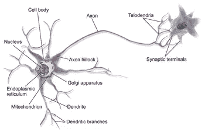

# 探索知识的新领域

> 原文：<https://towardsdatascience.com/exploring-the-frontiers-of-knowledge-a7f7acf538f0?source=collection_archive---------4----------------------->

# 人工智能

人工智能是让机器变得聪明的科学，但它们有多聪明，我们希望它们有多聪明？在这篇文章中，我邀请你深入研究制造智能机器的哲学，并帮助我探索我们对我们生活的世界的知识前沿，以及人工智能可能如何改变这种情况。

> “人工智能系统将成为我们大脑的延伸，就像汽车是我们双腿的延伸一样，它们不会取代我们，它们将放大我们所做的一切，增强你的记忆，给你即时的知识，让我们专注于做正确的事情。” *—脸书人工智能研究*

# 我们对人工智能做了什么？

从语音识别系统、自主系统和自动驾驶汽车、自动机器翻译、计算机视觉和自然语言处理(照片中的对象检测和分类、图像字幕生成)，许多领域都有许多涉及人工智能的创新，不胜枚举。以下是人工智能使用的一些常见用例列表。

*   **营销个性化、广告**(谷歌广告感知、赞助广告)和**推荐引擎**(网飞、亚马逊)
*   **个人安全**
*   **医疗保健**(在早期阶段检测疾病)，如果你想了解该行业对这场斗争的重视程度，最近有一个关于提高肺癌检测的[挑战](https://www.kaggle.com/c/data-science-bowl-2017)，现在又有一个关于[预测基因变异的影响以实现个性化医疗的挑战](https://www.kaggle.com/c/msk-redefining-cancer-treatment)。
*   **金融交易**
*   **欺诈检测**
*   **网上搜索**
*   **数据安全**
*   **太空、天文学和机器人学**
*   **天气预报**
*   **计算神经科学**

# 人工智能的目标

你认为什么样的人工智能会给我们带来完整的体验？我们知道，我们需要人工智能做得更好的事情之一是当涉及到感知时，即看到和理解语言的能力，以便与我们周围的事物进行交互和描述。我们不能否认我们对卷积神经网络(CNN)、递归神经网络、生成对抗网络(GAN)和许多更复杂的算法的热爱和热情，这些算法在学术界和工业界都产生了最先进的结果，但即使如此，主要问题仍未解决。现在你可能会问我，人工智能的终极目标是什么？

**答案:人工通用智能** ( **AGI** )

其他人也会认为人工智能的目标之一是奇点，**技术奇点**是一种假设，即人工智能**超智能**的发明将突然引发失控的**技术增长**，从而导致人类文明发生深不可测的变化。根据这一假设，一个**可升级的**智能代理(如运行基于软件的人工通用智能的计算机)将进入自我改进周期的“失控反应”，每一代新的更智能的一代出现得越来越快，导致智能爆炸，并产生一个强大的超级智能，从质量上讲，它将远远超过所有人类智能。

# **人工通用智能(AGI)**

AGI 是一台智能机器，它能成功地完成人类能完成的任何智力任务。它是一些人工智能研究实验室的首要目标，也是科幻小说和未来研究中的常见话题。AGI 也被称为强人工智能或通用人工智能，你可以在 [AGI 学会](http://www.agi-society.org/)上找到更多信息，还有这个[通用人工智能挑战赛](https://www.general-ai-challenge.org/)。

## 我们有什么样的人工智能？

现在我们知道人工智能的目标，但我们还没有达到，但这里还缺少一些东西，那就是描述什么样的人工智能目前对我们可用？

# 人工狭义智能(狭义 AI)

狭义人工智能(Narrow AI)，也称为 Week AI，是人类迄今为止实现的唯一人工智能形式。这是一种擅长执行单一任务的人工智能，例如下棋或下围棋，提出购买建议，销售预测和天气预报。计算机视觉、自然语言处理现阶段仍属于狭义 AI。语音和图像识别是狭义的人工智能，即使它们的进步看起来很迷人。甚至谷歌的翻译引擎和许多我们习惯看到甚至钦佩的人工智能，尽管它们很复杂，但它们是狭义人工智能的一种形式。

# 为什么是艾将军？

我认为 [Google DeepMind](https://deepmind.com/) 的两份使命声明确实有助于回答这个问题。

**DeepMind 任务**

1.  求解智能
2.  用它来解决其他一切

这里的前提是，如果人类曾经达到解决智能的地步，那么我们将利用它来解决其他一切问题，从而使世界变得更加美好。在这个关于[万有理论](https://www.youtube.com/watch?v=rbsqaJwpu6A&list=LLE88mrInwfu6bFi-OmsMUpw&index=12)的演讲中，戴密斯·哈萨比斯说:“*为了找到万有理论，结果可能是我们必须解决智力*”。这源于这样一种想法，即关于这个世界，我们仍然有许多事情不了解，人类不断面临着困难的问题(治愈疾病，星际探索……)，并且有这样一种信念，即人工智能将帮助人类以不同的方式处理这些问题，并更快地解决它们，从那时起，我们将开始突破知识的前沿。在我忘记之前，AlphaGo 是科学的巨大突破，但还不是 AGI。

# 是什么让求解智能如此困难？

为什么一直没能解决一般情报？事实是，这个问题没有明确的答案，但让这句话帮助我们:

> 我无法建造的东西，我并不真正理解。—理查德·费曼

最近，深度学习的爆炸式发展带来了许多进步和新发现。深度学习表示一组基于深度人工神经网络的架构。现在另一个问题可能会出现在你的脑海中，什么是人工神经网络？人工神经网络是受人脑工作方式启发的算法。

Anatomy of neuron

我不会谈论太多细节，但现在你应该知道，在神经科学中，**生物神经网络**是一系列相互连接的神经元，它们的激活定义了一条可识别的线性路径。神经元与其邻居相互作用的界面通常由几个轴突终末组成，这些轴突终末通过突触连接到其他神经元上的树突。

许多人误解了这一点，人工神经网络不像我们的大脑那样工作，人工神经网络只是简单的原始比较，神经元之间的连接比通过**人工神经网络**架构实现的连接要复杂得多，记住，我们的大脑要复杂得多，我们需要从中学习更多。关于我们的大脑，有许多事情我们不知道，这也使得我们很难知道我们应该如何在人类层面上模拟一个人工大脑来进行推理。

如果有人说大脑是宇宙中最复杂的机器，他有充分的理由这样想。

# 最终注释

也许这里的标题应该是“最终问题”，这个帖子是为了陈述一些还没有最终答案的问题。很难说哪里会有突破，但我们仍然可以提出一些问题，思考解决真正人工智能的问题。

*   我们已经有解决智能问题的正确算法了吗？
*   我们是否受到当前可用硬件的限制？
*   我们还需要发明智能数学吗？
*   如果我们不知道我们的大脑是如何工作的，构建人工智能也将成为一项艰巨的任务，人类的大脑是我们了解学习如何发生、记忆如何储存的最佳工具？推理是怎么做的？我们应该如何模拟一个人造大脑
*   理解深度神经网络如何学习变得越来越难，许多其他人工智能被视为黑盒，因为我们不太明白它为什么或如何工作或做什么，如果它们中的一个达到了人类水平的智能，我们将如何知道？

我个人认为这个话题还有很多东西需要探索，不可能一篇文章或者一本书就能完全涵盖我在这里提出来讨论的主题。这是一个公开的讨论，我对人工智能和世界各地正在开发的改善人们生活的东西很感兴趣。显然，人工智能的未来仍是未知的，世界仍在探索这一强大技术的其他用途。

这是一个公开的讨论，我很想听听你对这个话题的看法，并找到可以一起探讨更多想法的人。欢迎回复本帖或 [*微博我*](https://twitter.com/fumodavi) *。*

如果你喜欢这些作品，请留下你的掌声👏*推荐这篇文章，让别人也能看到。*