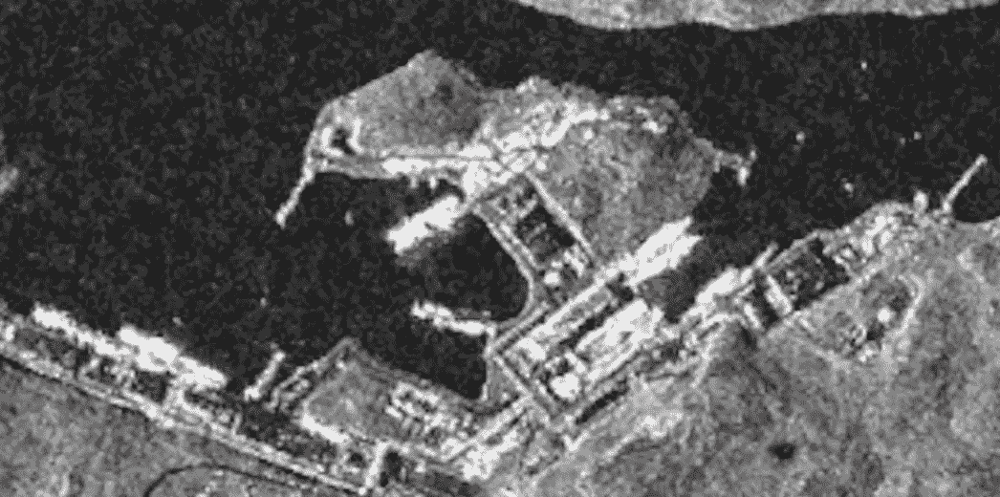
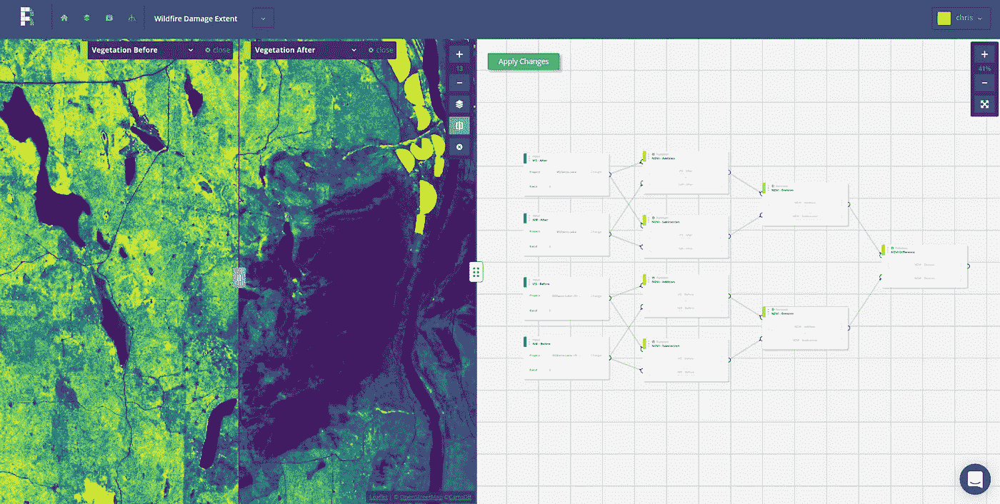
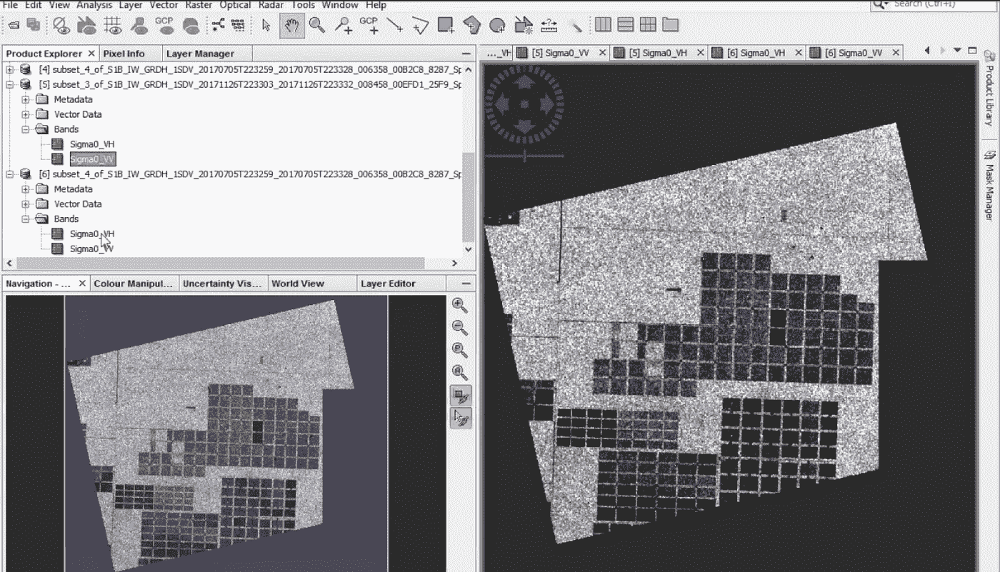
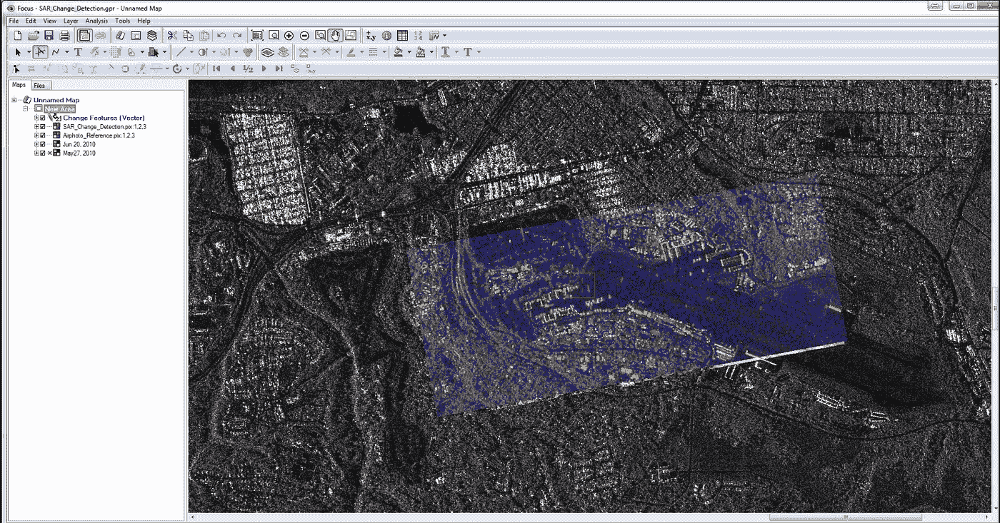

# 探索 2018 年的 SAR 工具前景

> 原文：<https://towardsdatascience.com/exploring-the-sar-tools-landscape-in-2018-925aec6fe7c3?source=collection_archive---------10----------------------->

使用 SAR 数据处理应用程序时，有许多工具可供选择。其中大部分是已经存在多年的商业或开源软件。功能范围从基本的 SAR 处理和可视化，到干涉测量和时间序列分析。如今，支持普通开发人员处理 SAR 数据的全功能云原生平台的选项越来越少。

# 题目

我想了解有哪些商业和开放工具可用于从 SAR 数据中获取信息。我非常熟悉光学影像工具的前景，并且知道因为它们主要只是地理空间栅格处理的引擎，所以它们中的大多数在某种程度上用于基本的 SAR 数据处理。然而，我想专门探索那些构建时考虑了 SAR 功能并具有独特或明确的 SAR 特性的工具。我把这些工具分为四类:商业云平台、开源平台、商业软件、开放软件。我没有使用过所有这些工具，但是我尝试给出一个从我能找到的信息中提炼出来的简要描述。我有意不讨论数据发现工具。这里的目的不是要全面，而是要给人一种对地形的感觉。

# 商业云平台

如今，相对而言，很少有[云原生的](https://medium.com/planet-stories/cloud-native-geospatial-part-1-basic-assumptions-and-workflows-aa67b6156b53)SAR 工具作为服务提供给应用程序开发人员和科学家。总的来说，云原生地理空间平台才出现了几年，所以我想这并不奇怪。我没有遇到*任何*平台提供内置功能，比如多视角或干涉处理。随着更多合成孔径雷达数据的出现，我预计在未来几年内，这一领域的能力和选择的数量都会增加。

[**谷歌地球引擎**](https://earthengine.google.com/) 是一个平台，它使任何科学家或开发人员都可以相对容易地进行大规模的 SAR 数据处理。如果你能用 javascript 编写一些代码，你就可以使用他们的代码编辑器和可视化工具来进行大规模的 SAR 数据处理。到目前为止，我看到的所有 SAR 用例都围绕着 Sentinel-1 数据，但是有一个强大的[用户社区开发脚本](https://github.com/Fernerkundung/EarthEngine_scripts)来支持 SAR 处理。最棒的是，这些工具可以免费用于[非商业目的](https://earthengine.google.com/terms/)(目前)。如果你正在处理自己的数据，并把它存储回谷歌云中，你可能需要支付一点存储费用。对于使用 Sentinel-1 数据的学者和非政府组织来说，这是一个很好的选择，但对于支持企业的平台来说，这不是一个很好的选择。

[**GBDX**](https://www.digitalglobe.com/platforms/gbdx)**是 DigitalGlobe 云原生平台，用于处理他们的卫星图像。随着 MDA 和 DigitalGlobe 的合并，他们已经开始引入一些工具来处理 [Radarsat-2 数据](https://gbdxdocs.digitalglobe.com/docs/mda-radarsat-2)，就像这个 [SAR 振幅变化检测工作流程](https://gbdxdocs.digitalglobe.com/docs/mda-sar-amplitude-change-detection-end-to-end-workflow)。由于 GBDX 平台的核心似乎只是一个将“任务”链接到“工作流”的大型[容器](https://www.docker.com/resources/what-container)编排系统，开发人员可以使用任何库来构建自己的 Radarsat-2 数据处理工作流。GBDX 还在他们的平台上提供了来自 Harris ENVI 的一些算法。对于试图构建使用 Radarsat-2 数据的工作流的软件工程师来说，这将是一个很好的云原生选项。**

****

**A SAR Amplitude Change Detection Result from the GBDX Platform. Borrowed from [their public docs](https://gbdxdocs.digitalglobe.com/docs/mda-sar-amplitude-change-detection-end-to-end-workflow).**

**[**笛卡尔实验室**](http://www.descarteslabs.com/) 将他们的平台标榜为“数据精炼厂，为了解这个星球而建”。它在概念上类似于 GBDX，但是可能更加数据不可知。用户可以通过目录 API 添加自己的数据。用户利用几个预定义环境中的[之一，用 python 代码编写一个“任务”。这些环境包含用于地理空间数据、数据科学和机器学习的典型 python 库。似乎没有任何独特的更高级别的工具可以更容易地处理 SAR 数据，尽管他们已经用他们的平台建立了一个 Sentinel-1 数据的全球复合图。对于试图构建 SAR 工作流的公司来说，这将是一个很好的云原生选择，但是工程团队仍然需要 SAR 专家。](https://docs.descarteslabs.com/guides/tasks.html)**

**[**Planetwatchers 预见**](https://www.planetwatchers.com/platform/) 最近宣布成为地理空间分析平台，最初专注于利用 SAR 和光学数据解决[林业、农业和能源使用案例](https://spacenews.com/planetwatchers-markets/)。他们的平台上没有多少公开信息。**

# **开源平台**

**包含 SAR 相关特性的开源平台选项似乎相对有限。我似乎找不到任何好的例子。目前有几个值得注意的处理栅格数据的开源平台选项，如 [RasterFoundry](https://www.rasterfoundry.com/) 和 [Geotrellis](https://geotrellis.io/) (由 [Azavea](https://www.azavea.com/) 开发)和 [Cumulus](https://developmentseed.org/projects/nasa/) (由[开发种子](https://developmentseed.org/)开发)。虽然它们都没有特定的 SAR 焦点，但它们都可以用作执行一些常规数据管理和大规模栅格数据处理(通常为[无服务器](https://aws.amazon.com/serverless/))的起点。例如， [Radiant Earth](https://www.radiant.earth/) 正在[使用 RasterFoundry 作为他们开放数据平台的基础](https://www.prnewswire.com/news-releases/radiant-taps-azavea-and-vizzuality-to-build-its-premiere-open-source-platform-300430293.html)(尽管还没有 SAR)。**

****

**Raster Foundry Lab for examining wildfire damage with optical imagery. Borrowed from [their blog post](https://blog.rasterfoundry.com/tracking-the-british-columbia-wildfires-from-space-ff5e2d6ee22).**

# **开源软件**

**对于各种类型的 SAR 数据处理，似乎有太多好的开源软件包。与平台选项一样，有许多有用的项目不一定是特定于 SAR 的，比如 [GDAL](https://www.gdal.org/) ，但是我将坚持探索那些具有 SAR 焦点的项目。这只是我经常看到提到的一些例子。我将留给读者去更深入地探究这个来自 [RadarCODE](https://github.com/RadarCODE) 或[poke about github](https://github.com/topics/synthetic-aperture-radar)的两年前的列表。**

**[**SNAP**](http://step.esa.int/main/toolboxes/snap/) **，** [**Sentinel-1 工具箱**](http://step.esa.int/main/toolboxes/sentinel-1-toolbox/) **，**[**PolSARPro**](https://earth.esa.int/web/polsarpro)**都是在欧洲航天局(ESA)的资金支持下开发的软件包。PolSARPro 是一个较老的偏振处理和教育工具。积极开发似乎在 2013 年停止了。SNAP 是一个通用的架构和接口，用于处理来自所有 Sentinel 任务的数据以及来自一些 Copernicus 贡献任务的数据。Sentinel-1 工具箱是所有欧空局搜救任务和一些第三方数据提供商(如 COSMO-SkyMed)的处理工具、数据产品读取器和写入器的集合。Sentinel-1 工具箱包含了从它所支持的任务中获取信息产品所需的任何功能。你可以通过 SNAP GUI，或者使用 [SNAP python 接口](https://senbox.atlassian.net/wiki/spaces/SNAP/pages/24051781/Using+SNAP+in+your+programs)来实现。****

********

****Working with some Sentinel-1 data in the SNAP interface.****

****[**RAT 和**](https://github.com/birgander2/PyRAT) 是通用的 SAR 后处理工具。RAT 项目在柏林技术大学启动，现在已经退役。它以 PyRAT 的形式存在，PyRAT 是一个用于 SAR 处理的 GUI、CLI 和 python 框架。这似乎是一个面向专家的选项…这里没有训练轮。****

****[**InSAR ISCE**](https://winsar.unavco.org/software/isce)**[**GM tsar**](https://topex.ucsd.edu/gmtsar/)**[**Doris**](http://doris.tudelft.nl/)都是干涉 SAR 处理工作流程的成熟工具。它们在许多期刊文章中被很好地记录和引用。对于科学家和学者来说，这些都是很好的工具。任何打算将该软件用于商业目的的人都应该仔细阅读许可证。虽然 GMTSAR 是 GPL，但其他两个似乎有更复杂的许可条件。********

****[**迪诺萨尔**](https://github.com/scottyhq/dinosar) 是一个有趣的项目，旨在云中按需处理干涉图(目前是 AWS，ISCE 在引擎盖下)。我希望在未来看到更多像这样的更高级别的项目，因为它们将使没有深厚遥感或信号处理背景的开发人员仍然能够进行有趣的地理空间分析。****

****[**六**](https://github.com/ngageoint/six-library) 是一个跨平台的 C++ API(带有一些 python 绑定)，用于读写 [NGA](https://www.nga.mil/Pages/Default.aspx) 的复相历史(CPHD)、复相(SICD)、派生(SIDD)传感器无关雷达格式。该项目的目的是为开发人员提供一种简单的方法来确保他们的文件和元数据符合 NGA 标准，并为多源数据提供一种通用格式。****

# ****商业软件****

****通常的嫌疑人都有内置或附加的 SAR 数据处理能力。这些工具中的大多数已经存在了许多年(> 20 年)，并且已经迭代了许多版本。它们主要是桌面工具，尽管一些供应商已经开发了跨多台机器编排更大规模工作流的引擎(例如 [PCI GXL](https://www.pcigeomatics.com/software/gxl/gxl-overview) )。性能、许可模式和成本各不相同，但不同软件包的功能似乎相似:正射校正、协同配准、斑点滤波、InSAR、相干变化检测等。****

****[**哈里斯 ENVI&sar scape**](https://www.harrisgeospatial.com/Software-Technology/ENVI-SARscape)**是用于多源图像分析的桌面和服务器软件。基本的 ENVI 包允许一个分析师在桌面上做数据处理，或者一个开发者从服务器配置中使用 ENVI API 建立一个工作流。与 ESRI T21 的软件生态系统也有相对深度的整合。SARScape 是一个附加模块，有三个模块，允许您进行基本的 SAR 处理、干涉测量和干涉测量叠加。******

******[**PCI Geomatica &雷达套件**](https://www.pcigeomatics.com/software/geomatica/radar-suite) 似乎在功能上与 ENVI 相似。Geomatica 有一个桌面版本和一个面向开发人员的版本，提供对 python API 的访问。雷达套件提供了用于基本 SAR 分析、干涉测量、正射校正和 DEM 生成的工具。******

********

****SAR Change Detection using PCI.****

****[**BAE SOCET GXP**](https://www.geospatialexploitationproducts.com/content/webinar-series/socet-gxp-terrain-and-lidar-2/)**是另一个多源遥感软件包，功能与上述类似。根据用户需求，GXP 还提供各种许可捆绑包选项。******

******ERDAS IMAGINE**是商业套装的另一个好选择。这里没有惊喜。********

**********GAMMA 是一个专注于 SAR 的软件包，由瑞士的一家小型软件提供商提供，支持从原始数据到衍生产品的整个处理链。GAMMA 在他们自己的咨询活动中使用该软件，并提供商业许可。**********

******[**MATLAB**](https://www.mathworks.com/help/dsp/examples/synthetic-aperture-radar-sar-processing.html)**对于那些希望其信号处理链具有近乎无限灵活性的人来说，是一款强大的工具。如果你仔细观察，会发现有一些库可以使摄取和处理 SAR 数据集变得更容易，比如 NGA 的 [MATLAB SAR 工具箱](https://github.com/ngageoint/MATLAB_SAR)。********

# ******包扎******

******商业和开放软件选项比比皆是，但具有更高级工作流的平台选项对于 SAR 来说仍然有点有限。如果普通开发人员对在他们的应用程序中从 SAR 数据中获取信息感兴趣，他们仍然有一个陡峭的学习曲线和许多行代码要写。随着可用 SAR 数据量的增加，是否会有更多的平台选项和功能变得可用，这将是一件有趣的事情。******

******我错过了什么有趣的软件包或项目吗？请在评论中告诉我。******