# 用动态话题模型探索联合国一般性辩论

> 原文：<https://towardsdatascience.com/exploring-the-un-general-debates-with-dynamic-topic-models-72dc0e307696?source=collection_archive---------6----------------------->


Credit: [Vladislav Klapin](https://unsplash.com/@lemonvlad?utm_source=medium&utm_medium=referral) on [Unsplash](https://unsplash.com?utm_source=medium&utm_medium=referral)

在本文中，我介绍了动态主题模型背后的直觉，并通过对演讲语料库的应用，展示了这种方法在非结构化文本中发现不断发展的叙事的能力。

通过阅读，我希望你能了解动态主题模型，它们试图解决的问题，使用文本数据完成项目的实用技巧，以及对现代世界事务的一些见解！如果你想跟随代码，你可以在这里找到。

每年秋天，世界各国领导人聚集在纽约，参加联合国大会的一般性辩论。在围绕核武器和叙利亚战争等问题进行讨论后，今年的会议于本月早些时候结束。

一般性辩论中的发言形成了国际社会关注的问题的历史记录。隐藏在这些文本数据中的是关于对话如何随时间变化的见解，而动态主题模型可以帮助我们定量地模拟这种演变。

# 动态主题模型

主题建模是一个通用术语，用于描述在非结构化文本语料库中查找主题的过程。一种流行的方法是潜在狄利克雷分配(LDA ),这是一种学习预定义数量的潜在主题的生成模型，其中每个主题被表示为词的分布，每个文档被表示为主题的分布。下面的文章很好地解释了这个想法，并且[维基百科页面](https://en.wikipedia.org/wiki/Latent_Dirichlet_allocation)也是一个很好的参考。

[](https://medium.com/@lettier/how-does-lda-work-ill-explain-using-emoji-108abf40fa7d) [## 你的潜在狄利克雷分配简单指南

### 在我们开始之前，我做了一个工具(这是源代码),可以在你的浏览器中运行 LDA(非常简洁)。是…

medium.com](https://medium.com/@lettier/how-does-lda-work-ill-explain-using-emoji-108abf40fa7d) 

LDA 由于其高度可解释的主题而对于大语料库的定性分析是一种非常强大的技术，并且由于其将稀疏的文档术语矩阵转换成固定的低维文档主题矩阵而对于维数减少也是有用的。然而，LDA 忽略了存在于许多文档集合中的时间方面。

考虑一下 LDA 在过去十年的新闻语料库中发现的一个关于美国政治的话题。你可能认为最有可能的术语是“国会”、“选举”、“投票”等等。然而，该模型在术语概率方面将 2010 年的文件与 2018 年的文件视为相同，因此它无法了解到，例如，“特朗普”一词直到最近才在政治背景下几乎不存在。

Blei 和 Lafferty [在这里](https://mimno.infosci.cornell.edu/info6150/readings/dynamic_topic_models.pdf)提出的动态主题模型(DTM)通过扩展 LDA 的思想来解决这个问题，以允许主题表示在固定的时间间隔(如几年)内发展。具体地，每个时间片内的文档用相同维度的主题模型建模，时间片`t`内的每个主题由时间片`t-1`内的相应主题演化而来。

LDA 的生成过程大体上保持相同，除了关键的差异，即整体主题分布和每个主题的术语分布根据时间片而不同。特别地，这些分布的参数在每个时间片上“发展”,这是通过从以前一个时间片的相应值为中心的分布中提取的。

这样做的最终结果是一系列类似 LDA 的主题模型，它们按顺序连接在一起。因此，DTM 学习的主题是一系列相关的术语分布。带着这种直觉，我现在转向它的应用。

# 一般性辩论数据集

由 1970 年至 2015 年一般性辩论中的发言组成的语料库由[托管在 Kaggle](https://www.kaggle.com/unitednations/un-general-debates/home) 上(总共 7507 篇)。该数据集最初是由英国和爱尔兰的研究人员在去年发布的(见[本文见](https://arxiv.org/pdf/1707.02774.pdf))，他们用它来研究不同国家在不同政策维度上的立场。

每篇演讲都标有发表的年份和会议，以及演讲者代表的国家的 ISO Alpha-3 代码。

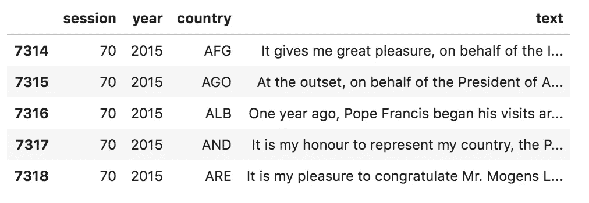

Sample rows from the dataset

# 数据预处理

在这个数据集中的一个关键观察是，这些演讲中的每一个都包含了对大量话题的讨论。如果每个演讲都包含关于贫困和恐怖主义的讨论，那么在整个演讲上训练的主题模型将无法理解像“贫困”和“恐怖主义”这样的术语应该代表不同的主题。

为了解决这个问题，我将每个演讲分成段落，并将每个段落作为一个单独的文档进行分析。一个简单的基于规则的方法，寻找由换行符分隔的句子，在这个数据集的段落标记化任务中表现得相当好。在这一步之后，文件的数量从 7，507(完整的发言)增加到 283，593(段落)。

在将每个语音扩展成多个文档后，我进行单词标记化，通过小写和词条化来规范化每个术语，并从词汇表中删除低频术语。最终结果是 7，054 个术语的词汇表和每个文档的单词包表示，可以用作 DTM 的输入。

Word, sentence, and paragraph tokenizers for the General Debate corpus

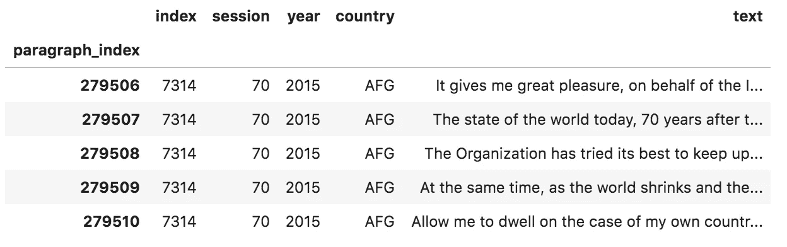

Sample rows after paragraph tokenization

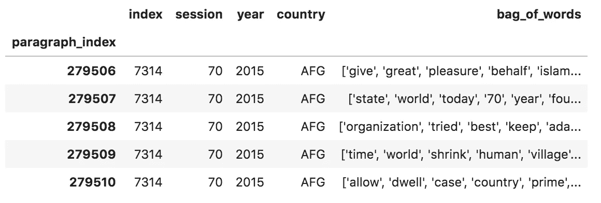

Sample rows after word tokenization of paragraphs

# 推理

为了确定要使用的主题数量，我使用不同数量的主题(10、15、20、30)在几个不同的时间片上分别运行了 LDA，以便对问题有所了解。通过手工检查，15 似乎产生了最可解释的主题，所以这就是我为 DTM 选定的。更多的实验和严格的定量评估肯定可以改善这一点。

使用`[gensim](https://radimrehurek.com/gensim/models/wrappers/dtmmodel.html)` [的 Python 包装器](https://radimrehurek.com/gensim/models/wrappers/dtmmodel.html)到[的原始 DTM C++代码](https://github.com/blei-lab/dtm)，推断 DTM 的参数是简单明了的，尽管很慢。在 Google 云平台上的 n1-standard-2 (2 个 vCPUs，7.5 GB 内存)实例上，推理耗时约 8 小时。然而，我是在单核上运行的，所以如果您能够编译原始 C++的并行版本，这个时间可能会缩短。

# 结果

该模型发现了非常容易解释的主题，我在这里深入分析了其中的几个。具体来说，我为几个主题展示了时间片样本中的顶级术语，以及随着时间推移显著术语的概率图。该模型发现的主题及其热门术语的完整列表可以在本文末尾的附录中找到。

## 人权

《联合国宪章》序言指出:

> 我联合国人民决心……重申基本人权、人格尊严与价值、男女平等权利和大小国家平等权利的信念。

因此，毫不奇怪，人权是一般性辩论中的一个永恒主题，也是该模型能够发现的一个主题。尽管上文引用的《宪章》中出现了两性平等的概念，但模型显示,“妇女”和“性别”这两个术语真正流行起来还需要相当长的时间。此外，请注意“humane”的使用在增加，而“mankind”的使用在减少。

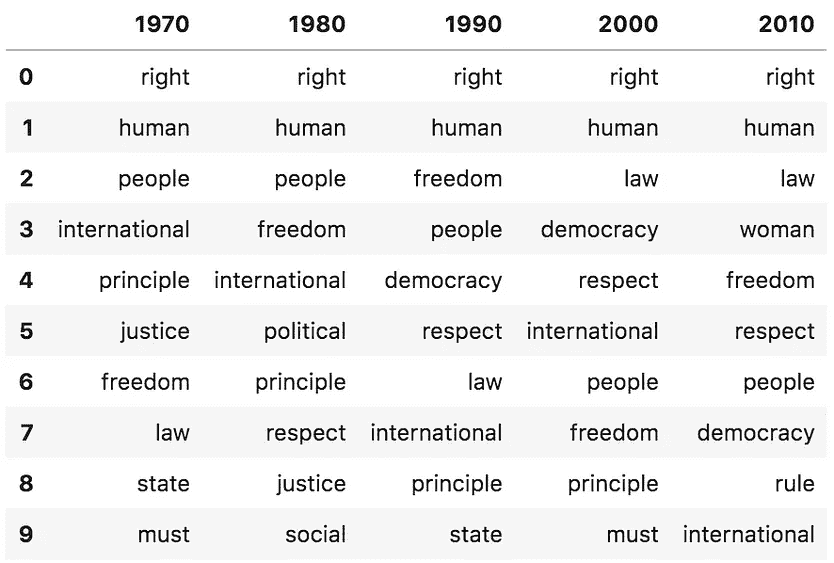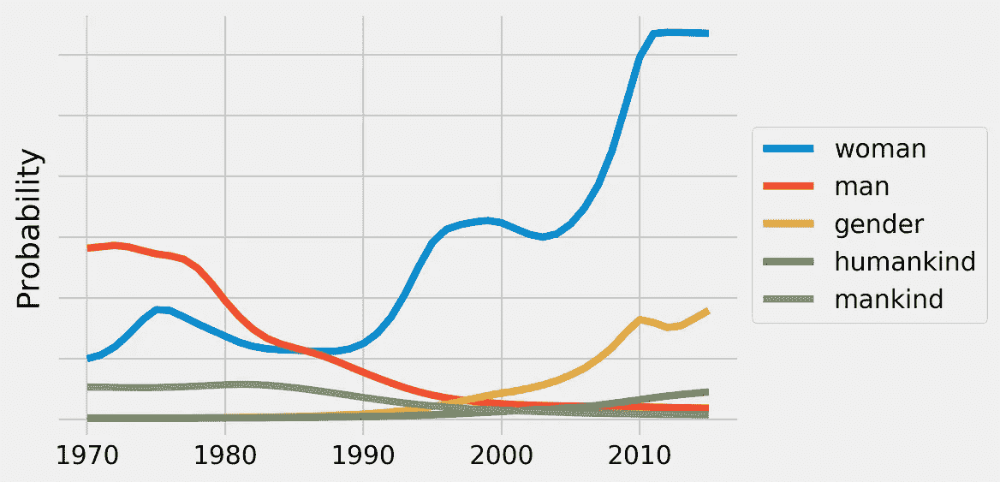

Topic 3 (Human Rights): Top ten terms by probability at sampled time slices (left) and selected term probabilities over time (right)

## 以色列

自 1948 年现代以色列成立以来，围绕阿拉伯-以色列冲突、边界、定居点和巴勒斯坦人民的待遇，一直存在着争论，而联合国一直密切参与其中。事实上，维基百科上有整整一个页面专门讨论这个问题。

该模型显示，在 2007 年以色列和埃及封锁加沙之后，人们越来越关注加沙，并不断围绕以色列定居点展开讨论，根据国际法，[联合国认为这种做法是非法的。“两个”一词的出现很有趣，可能来自于围绕“两国解决方案”的讨论。](https://www.un.org/press/en/2016/sc12657.doc.htm)

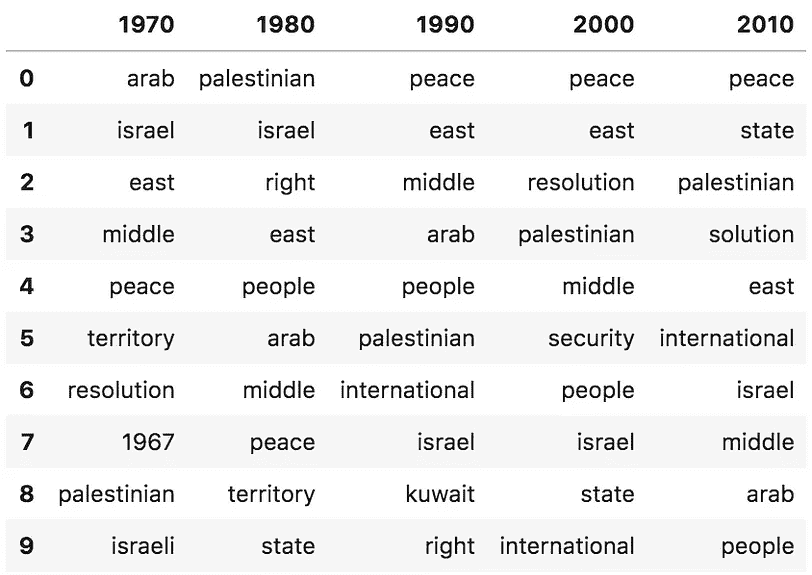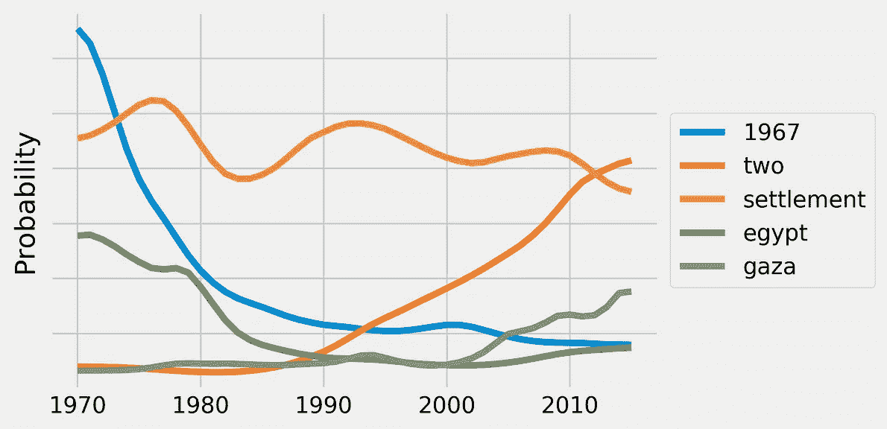

Topic 5 (Israel): Top ten terms by probability at sampled time slices (left) and selected term probabilities over time (right)

## 非洲

关于非洲的讨论已经从过去的殖民地发展到独立、种族隔离时代，最后是新政府的诞生、选举和民主。

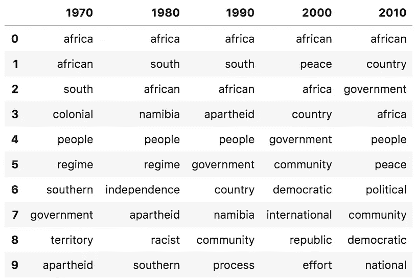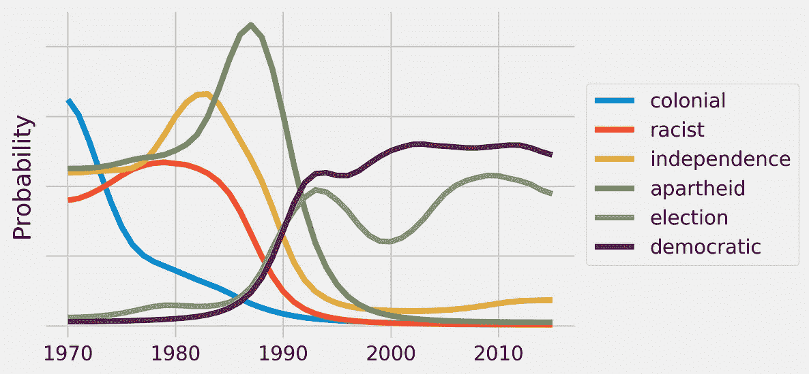

Topic 8 (Africa): Top ten terms by probability at sampled time slices (left) and selected term probabilities over time (right)

## 核武器

冷战时代带来了美国和苏联之间的军备竞赛，以及随后关于裁军的讨论。最近，焦点集中在伊朗。

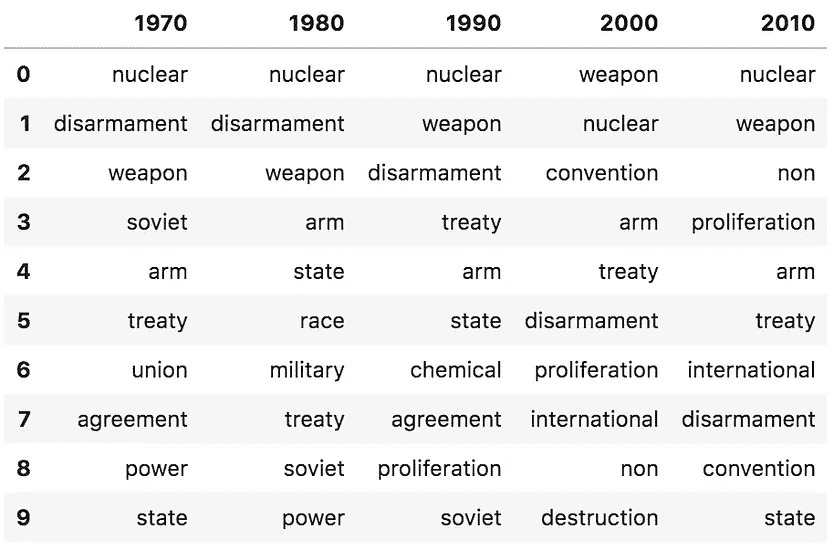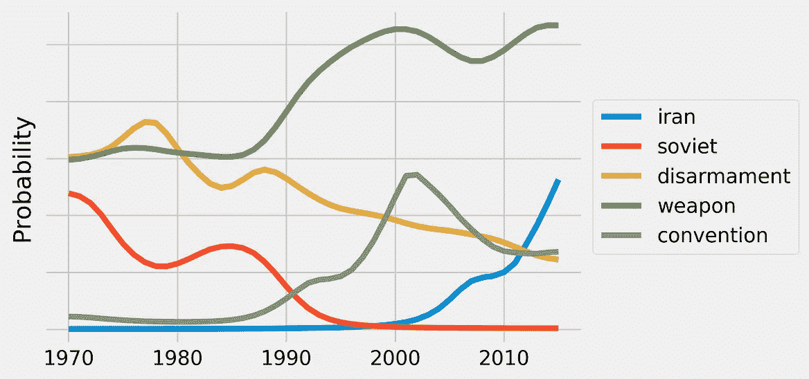

Topic 2 (Nuclear Weapons): Top ten terms by probability at sampled time slices (left) and selected term probabilities over time (right)

## 发展

千年发展目标和可持续发展目标是联合国分别于 2000 年和 2015 年推出的倡议，旨在解决贫困、教育和性别平等等问题。这个话题似乎已经从围绕国际发展的一般性讨论发展到这些结构化的项目。

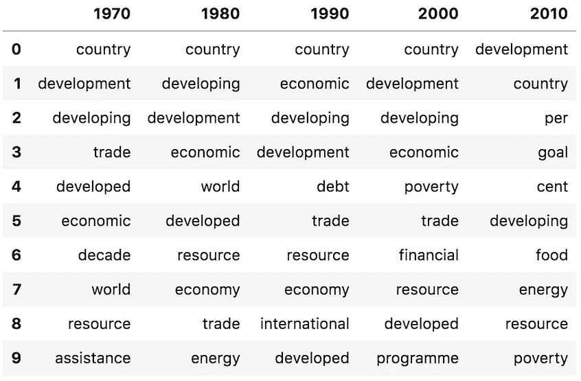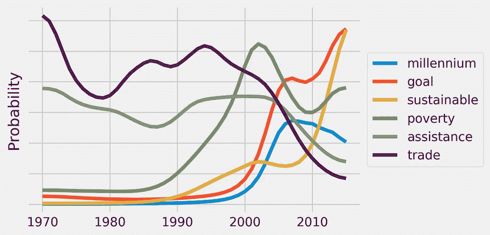

Topic 4 (Development): Top ten terms by probability at sampled time slices (left) and selected term probabilities over time (right)

# 结论

这个练习演示了 DTM 是如何表示主题的，以及这种方法在非结构化文本中发现叙事的惊人能力。请记住，该模型在没有任何人类智能的情况下完成了上述所有工作！

我有可能通过试验更大的词汇量、不同数量的主题及其评估、短语提取(例如，“human_rights”可以是一个标记，而不是分别具有“human”和“rights”)，以及不同的词干分析器或词尾分析器来改进所使用的方法。其他超出单词表示范围并使用单词嵌入的方法也值得探索。

这里没有利用 DTM 的一个方面(但是我想进一步探讨的一个方面)是学习文档的向量表示。这不仅有助于计算文档之间的相似性值，也有助于找到每个主题的代表性文档。例如，获取美国代表的所有发言，为每个时间段挑选出最具代表性的段落，比如说人权主题，并使用这些段落来构建美国人权话语演变的线索，这将是很有趣的。

总的来说，这是一个令人着迷的练习。如果您想亲自试验或更深入地了解实现细节，可以在 repo [这里的](https://github.com/llefebure/un-general-debates)中再次找到该分析的所有代码。感谢您的关注，如果您有其他想法或问题，请留下您的评论！

# 附录

以下是 DTM 发现的主题的完整列表。对于每个主题，显示了 1975 年、1995 年和 2015 年时间片的前十个术语。

```
Topic 0
            1975           1995           2015
0       security        council        council
1            non       security       security
2          state         member         member
3        council          state         reform
4         cyprus        general         united
5  international         reform         nation
6      principle         nation      permanent
7         nation         united          state
8        aligned  international           must
9        charter           must  international

Topic 1
            1975           1995           2015
0            sea  international          state
1            law          state         island
2          state         island          small
3          latin           drug  international
4        america        country        country
5       resource          small           sids
6       american        america          crime
7        country      caribbean      caribbean
8     conference     convention     developing
9  international          crime        pacific

Topic 2
          1975           1995           2015
0      nuclear        nuclear         weapon
1  disarmament         weapon        nuclear
2       weapon         treaty           iran
3          arm    disarmament         treaty
4        state  proliferation            arm
5       soviet            non      agreement
6       treaty            arm  international
7        power          state            use
8        union           test            non
9         race  international       chemical

Topic 3
            1975           1995           2015
0          right          right          right
1          human          human          human
2         people        respect            law
3  international      democracy          woman
4        freedom         people         people
5      principle  international        respect
6        justice            law        freedom
7      political        freedom           rule
8        respect      principle  international
9           must        society          peace

Topic 4
            1975           1995           2015
0       economic       economic       economic
1  international    development        country
2          world  international          world
3        country          world         global
4            new            new  international
5          order         social         social
6    development      political    development
7       relation        country      political
8      political         global         crisis
9             co    cooperation            new

Topic 5
          1975         1995           2015
0         east        peace          state
1       middle         east          peace
2         arab       middle       solution
3       israel   resolution    palestinian
4        peace       people       conflict
5  palestinian  palestinian  international
6       people       israel          syria
7        right      process         people
8    territory       region           east
9    palestine    agreement         israel

Topic 6
         1975          1995           2015
0    republic        united         united
1      people        nation         nation
2      united         peace  international
3       state     operation          peace
4      nation       keeping       conflict
5  government      republic           role
6       korea      conflict   peacekeeping
7    peaceful        bosnia        mission
8        viet  organization        support
9     country   herzegovina       republic

Topic 7
        1975         1995           2015
0  operation  cooperation         region
1         co       region    cooperation
2      peace     regional  international
3    country     european        country
4     europe      country       security
5   security       europe       regional
6   relation        union       european
7   european        state      terrorism
8     region     security          union
9    detente    stability         effort

Topic 8
           1975        1995        2015
0        africa      africa     african
1         south     african     country
2       african     country      people
3        people  government  government
4        regime       peace    republic
5      southern   community      africa
6       namibia      people   political
7     apartheid  democratic   community
8  independence     process  democratic
9        racist      effort       peace

Topic 9
        1975      1995       2015
0      world       war    climate
1          u     world     change
2        one  conflict      world
3        war      cold     global
4    problem      many     threat
5       time         u  challenge
6  situation     peace       must
7      peace       one    country
8      power   problem     crisis
9   conflict      must   conflict

Topic 10
           1975        1995       2015
0        people      people     people
1      struggle     country        war
2       country     refugee       year
3  independence        year      world
4      national       state    country
5         force       force        one
6    liberation         war  terrorist
7         state  government      today
8   imperialist         one      state
9   imperialism        life       many

Topic 11
            1975           1995       2015
0         nation         nation     nation
1         united         united     united
2   organization   organization      world
3          world          world          u
4          peace           must       must
5         member  international  challenge
6  international              u     future
7        charter           role      peace
8           role          peace       year
9          state            new     global

Topic 12
          1975         1995         2015
0      country      country  development
1   developing  development      country
2  development     economic         goal
3     economic   developing  sustainable
4        world        trade          per
5    developed     resource       agenda
6     resource      economy         cent
7        trade    financial      poverty
8        price    programme       health
9   assistance   assistance    education

Topic 13
         1975       1995       2015
0          mr    general    general
1     general    session   assembly
2   president   assembly    session
3    assembly         mr  president
4     session  president         mr
5  delegation  secretary       like
6        also       also      would
7        like       like  secretary
8        wish   election       also
9    election       wish      sixty

Topic 14
         1975         1995         2015
0     session   conference  development
1    assembly  development         2015
2     general      general           70
3  conference         year       agenda
4  resolution       agenda         year
5        year     assembly  sustainable
6     special      meeting   conference
7  government       summit           pv
8      united         held           15
9     meeting         last         post
```