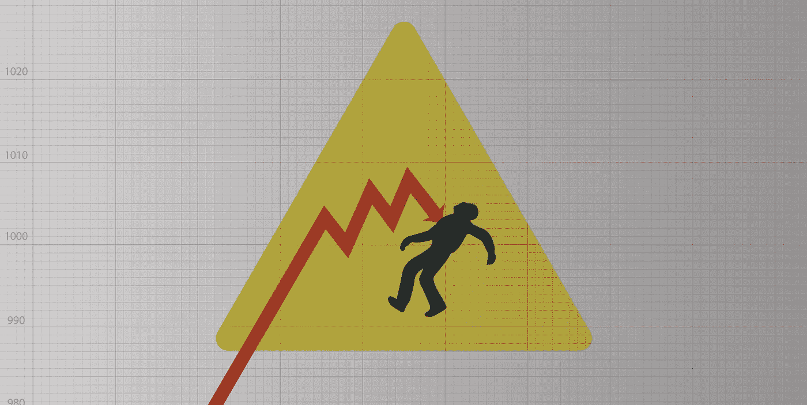
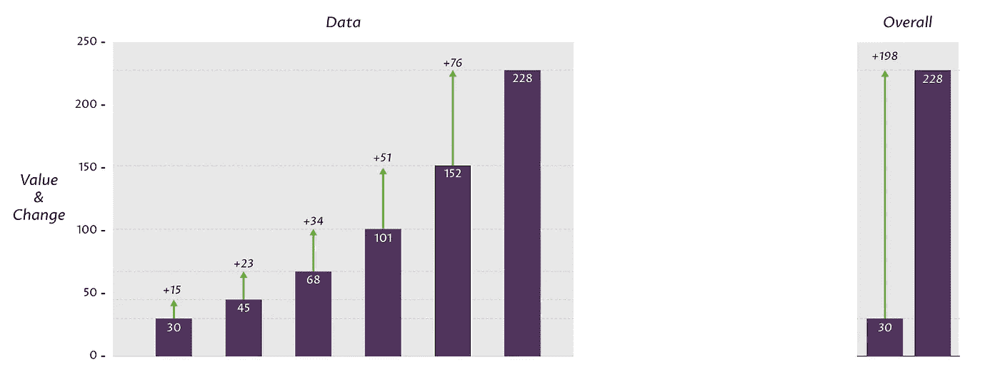
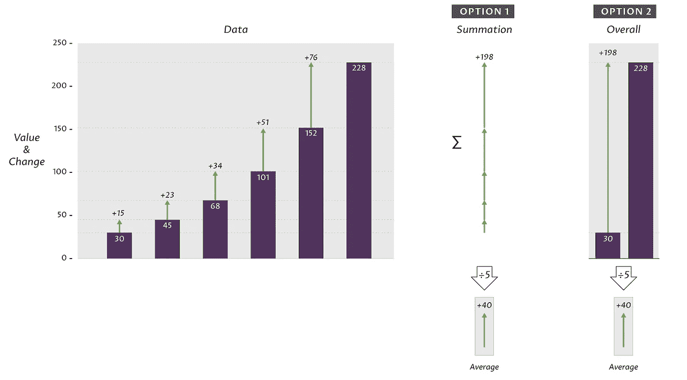
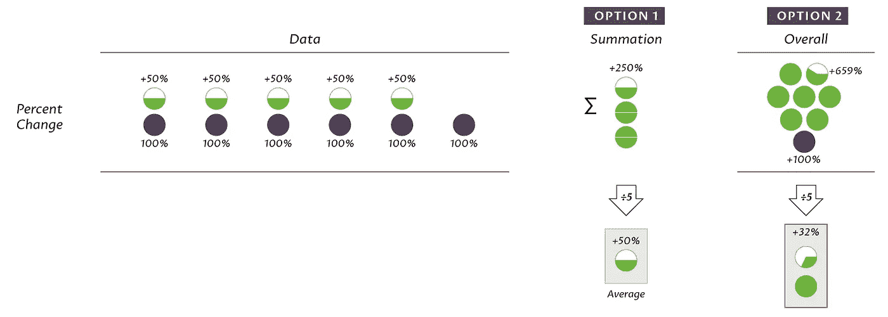
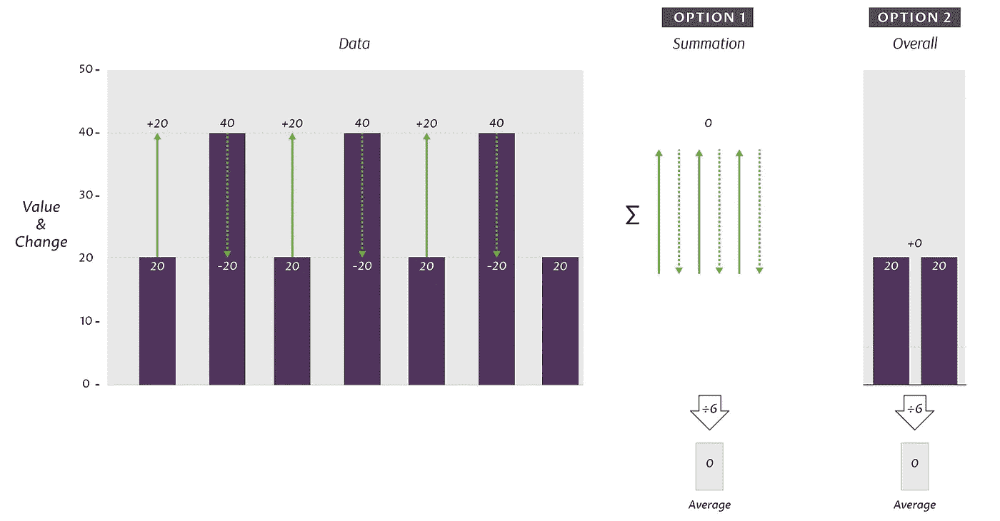
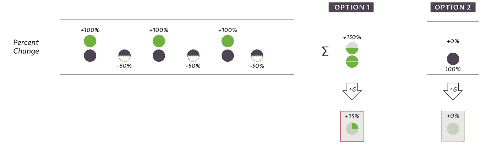
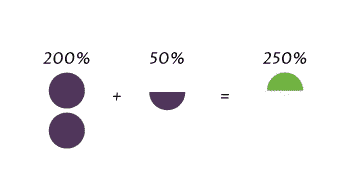
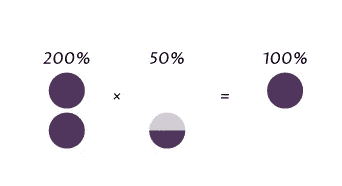
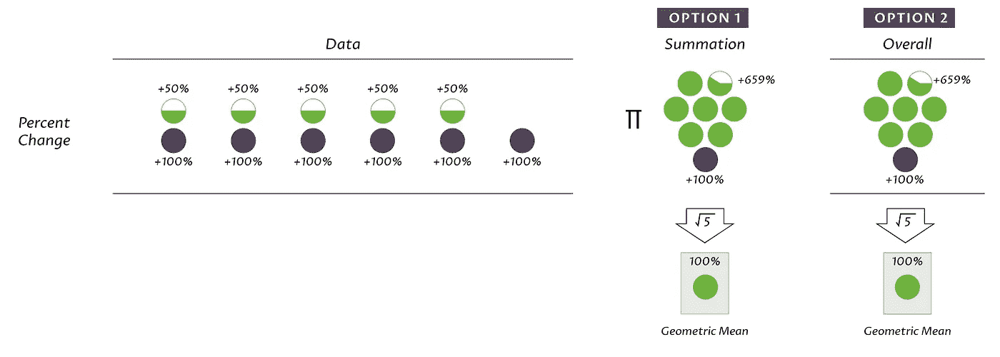

# 通过可视化计算暴露错误的想法

> 原文：<https://towardsdatascience.com/expose-faulty-thinking-by-visualizing-calculations-c0cb6fa9c34c?source=collection_archive---------4----------------------->



Struck by Data (Jasper McChesney)

我们经常使用可视化来呈现*数据。*但是我们对数据 *做的****的可视化呢？我指的是聚合、算法和流程。*****

*通常这些计算非常简单。但是人们总是把简单的事情弄错——尤其是数学方面的事情。可视化可以帮助显示正在发生的事情，以及为什么一种方法可能行不通。你知道，同事的方法。*

# *目标和“解决方案”*

*我在和某人一起写一份报告。我们需要向非技术观众解释如何根据行业趋势做出基本的预算预测。这些“趋势”实际上是**逐年的百分比增长**；以及在此期间**的总体增长**。它可能看起来像这样:*

**

*假设明年的增长将与过去几年的变化相似。但是我们不能规定任何花哨的建模:我们正在帮助人们用 Excel 或台式计算器进行粗略的猜测。*

*我的同事给人们提供了两种选择*

1.  *取历史增长(%)的算术平均值。*
2.  *求总体涨幅(%)，除以年数。*

*我不确定这些是否有意义。但是说服我的同事？没那么容易。什么有帮助？会议议程背面潦草的图表。*

*每张图都是一组示例数据，加上您要进行投影的操作。每一个都说明了为什么上面的方法有问题。*

# *错误*

*在数学层面上，这里的问题是根本性的:我的同事想要处理百分比增长，即*比率*，就像他会处理美元增长一样，美元增长只是*值*。*

*但是比率不是价值——事实上，它们将两个价值联系在一起。他们与自己互动的方式也不同。通常它们是通过乘法而不是加法结合在一起的；他们*复合*。所以把每年的利率加在一起得到最终利率在概念上是没有意义的。*

*(你可以用量纲分析来证实这一点。我们在这里的增长是无量纲的比例。所以把一堆加在一起，然后除以年，就产生了 1/年的单位。这对预算有什么用呢？)*

*但是这个论证依赖于数学。也许我是一个坚持理论严谨的混蛋，当我们只需要一些有用的东西。好吧，让我们看看是不是这样。*

# *选项 2 拆卸(恒定百分比变化)*

*选项#2 是额外的攻击，值得首先反驳。但是为什么一开始会有人想这么做呢？*

*如果我们处理的是简单的数量，比如预算金额的变化(T1)，选项 2(T2)就可以了(T3):你可以将总的变化除以年数，得到一种年平均值。它之所以有效，是因为它在数学上 ***等同于*** 选项 1，即每年数值的平均值。*

**这是我们的第一个例子，对两个选项都进行了计算:**

**

*处理简单数值时，*变化总和*与*总体变化相同。这就是为什么选项 2 很诱人。**

## *百分比变化打破了这一点*

*现在，让我们看看当我们尝试这些相同的计算时，百分比会发生什么变化(正如我的同事提议的那样):*

**

*在这个整洁的例子中，每个百分比变化都是相同的，这使得我们的“预测”非常容易:我们允许的任何解决方案都应该*肯定*产生 50%。然而，选项 2 没有。它不仅在数学上没有意义，也不能产生合理的结果。我不仅仅是个混蛋！*

# *选项 1 下降(振荡变化)*

*看到这个例子后，您可能会认为选项 1 是可行的。在这个简单的例子中，它确实是这样的，不断地变化。但那不是真正的测试。我们需要一个稍微现实一点的例子:年复一年的变化。*

**

*认识到一种模式，我们人类当然期待明年有+20 的变化。但是我们粗略估计的目标是简单地使用前几年的主要趋势；而不是去寻找不同的模式或体重年份。这些变化的中心趋势显然是相互平衡；以产生零净变化。*

*事实上，当使用原始的数字变化时，我们的两个选项都计算零平均变化。*

## *百分比再次打破了事物*

*但我们任务的另一个假设是，任何真正的趋势都将是百分比变化的趋势，而不是原始值(正如我们在上面看到的，这些显然是不一样的)。在本例中，我们看到两种百分比变化:+100%和-50%。如果我们把这些输入算法，我们会得到什么？*

**

*这一次，选项 1 是明显的失败。变化的线性平均值为 25%。这意味着，如果我们假设所有年份都一样，那么每年都会有 25%的增长。但是如果我们算一下，从 20 岁开始，到 60 岁结束。差远了！*

## *为什么不管用？*

*同样，这是因为我们误用了简单的汇总统计数据(矩)，比如平均值。均值允许我们通过在所有项目之间分配总价值来假装所有项目都是相同的。通过加法，这种扩散是线性的。但是百分比不能把普通的数字相加。*

*让我们通过例子来说明这一点。数据中没有上升或下降的总趋势:上升抵消了下降，所以它们是无用的。这意味着**200%的变化必须被*50%的变化抵消*。**(我已经将增加的百分比转换为原始百分比；200%和 50%当然相当于+100%和-50%)。*

*但是在**加法**的土地上，这两项**并不**平衡:200% + 50% = 250%，平均变化 125%。我们应该得到的结果是 100%。*

**

# *什么会起作用？*

*我们的变化如何平衡？与**相乘**。200%和 50%的乘积是 100%。没有变化。*

**

*乘法不仅仅是*发生*计算出来:它在概念上是有意义的，因为百分比是这样运作的:增加的大小取决于之前的值。(而加法与它们无关:如果你在银行账户上增加更多的钱，你就获得了总数；你现有的平衡不会改变它。不像按揭付款！)*

## *另一种意思是*

*当然，我们不只是想要组合百分比，我们想要它们的平均值；我们想知道如果它们都一样的话，哪一年会是什么样。通俗说法的“平均”就是算术平均值。但是均值有很多种，包括**几何均值**，它的工作原理是等效的，但是用于乘法运算。你不是把值相加，而是把它们相乘；你不用除以数值的个数，而是取那个*的根*。*

*如果我们回到我们的第一个例子，恒定+150%的增长，我们可以看到它是如何工作的，使用选项 1。我们将再次使用基本百分比而不是增加额(即 250%):*

```
*2.5 x 2.5 x 2.5 x 2.5 x 2.5 = 97.6697.66 ^(1/5) = **2.5***
```

*在第二个示例中也是如此，没有任何变化:*

```
*2 x 0.5 x 2 x 0.5 x 2 x 0.5 = 11 ^ (1/6) = **1***
```

*所以我们至少可以在我们的(奇怪的)测试案例中确认合理的行为。*

## *选项 1 和 2 再次变得等效*

*我们也可以放心使用几何平均，因为这两个选项再次产生相同的结果。也就是说，百分比*增长*的几何平均值与*总体*增长百分比*的几何平均值相同。*(因为将每一个连续的乘数相乘自然会产生总乘数。)*

**

# *结论*

*这里的一个小教训是要小心利率！更一般地说，要小心看似基本的数学，尤其是当你关注更大的问题时。*

*但是另一个主题是使用视觉来谈论*思维*，特别是关于数据的数学或统计思维——即使操作很简单。这可能会为你赢得一场争论。*