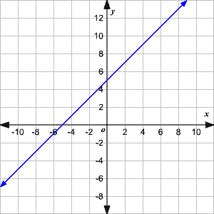
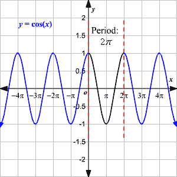
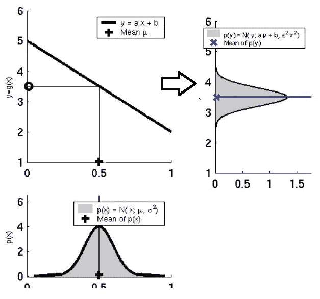
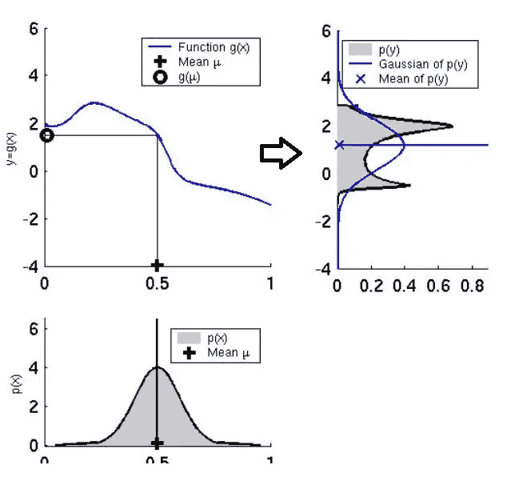
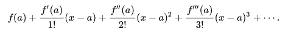
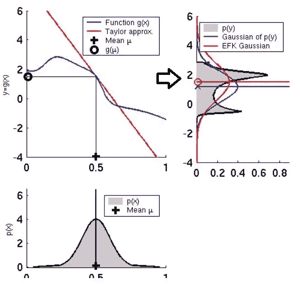
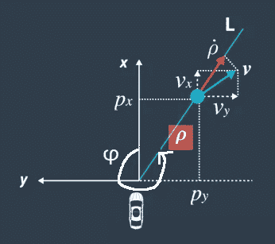
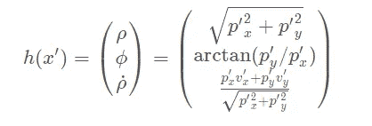
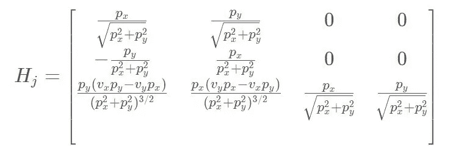

# 扩展卡尔曼滤波器:为什么我们需要一个扩展版本？

> 原文：<https://towardsdatascience.com/extended-kalman-filter-43e52b16757d?source=collection_archive---------0----------------------->

这篇文章是我上一篇关于卡尔曼滤波器的文章的延续。我的同事 Larry 对卡尔曼滤波器的工作原理非常感兴趣，但他能理解非线性和扩展卡尔曼滤波器的概念吗？让我们找出答案。

*拉里:我知道卡尔曼滤波器，我现在可以预测和更新，我现在基本上知道一个重要的预测工具。*
我:你能告诉我在阅读卡尔曼滤波器时我们做了什么假设吗？

拉里:假设…？你什么意思？你刚才说卡尔曼滤波器只对高斯函数有效。就是这样。不是吗？
我:嗯，说对了一半。上一篇文章中隐藏的另一个重要假设是线性函数。所以两个假设是-:
1。卡尔曼滤波器将始终与**高斯分布一起工作。**
2。卡尔曼滤波器将始终与**线性函数一起工作。**

拉里:哦，天哪！那么线性函数是从哪里出现的呢？
Me:对于线性函数，我的意思是预测和更新步骤都只包含线性函数。如果你仔细观察所有的方程，它们已经存在了。

线性函数看起来有点像这样:

Figure 1\. Linear Function. ([Source](http://multidict.net/clilstore/page.php?id=4912))

另一方面，非线性函数看起来像这样:

Figure 2\. Non Linear Function. ([Source](https://www.varsitytutors.com/hotmath/hotmath_help/topics/graphing-cosine-function))

从这些图中可以看出，直线方程是线性函数，而 cos 函数是非线性函数。

赖瑞:是的，没关系。我们的方程中没有任何角度，所以它们看起来只是线性的。那 KF 现在的问题是什么？我:大多数现实世界的问题都涉及到非线性函数。在大多数情况下，系统会观察某个方向，并在另一个方向进行测量。这涉及到角度和正弦、余弦函数，它们是非线性函数，然后会产生问题。

拉里:嗯，但是非线性函数是如何产生问题的呢？
我:**如果你给高斯函数输入一个线性函数，那么输出也是高斯函数**

Figure 3\. Gaussian + Linear Function = Gaussian ([Source](https://www.youtube.com/watch?v=DE6Jn2cB4J4&t=2048s))

**如果用非线性函数输入高斯函数，则输出不是高斯函数。非线性函数导致非高斯分布。**

Figure 4\. Gaussian + Non Linear Function = Non Gaussian ([Source](https://www.youtube.com/watch?v=DE6Jn2cB4J4&t=2048s))

因此，如果我们应用非线性函数，它将不会以高斯分布结束，我们不能再应用卡尔曼滤波器了。非线性破坏了高斯分布，计算平均值和方差是没有意义的。

拉里:哦，不，那样的话，我们的卡尔曼滤波器坏了。那么解决办法是什么呢？
我:你能想到的最琐碎的解决办法是什么？

拉里:我？嗯。我只能说使用线性函数:D:虽然这没有意义，但这确实是解决方案。

拉里:什么？你是说我是对的？？怎么会这样 T2:是的，你是对的。我们将只研究线性函数。

拉里:但是你说成本、收益函数呢？它们仍然是非线性的，对吗？
我:绝对。它们是非线性的，但是我们将通过近似使它们线性。在这里，我们将借助一个叫做泰勒级数的强大工具，它将帮助我们得到非线性函数的线性近似。应用近似后，我们得到的是一个扩展卡尔曼滤波器。

拉里:新工具不断涌现！这个泰勒是怎么工作的？
Me:我们取一个点，对那个点进行一堆求导。在 EKF 的情况下，我们采用非线性曲线上的高斯平均值，并对其进行多次求导以逼近它。

Figure 5\. Taylor Series

假设我们想在 x=0 时逼近 sin(x)。
假设我们要找一个多项式函数**P(x)= c _ 0+c _ 1 * x+c _ 2 * x+c _ 3 * x**来近似 sin(x)。所以我们需要找出 c0，C1，C2 和 C3 的值

在 x=0 时，sin(x) = 0，P(x) = c_0 + 0 + 0
如果我们的近似值必须更接近 sin(x)，那么 sin(x)的值必须等于 x=0 时 P(x)的值。所以，0 = 0

如果我们的近似值与 x=0 处的 sin(x)具有相同的正切斜率也是很好的所以 1 = 1

发生..我们可以发现 sin(x)= x x/3 的近似值！+ x⁵/5！x⁷/7！+ x⁹/9！…

拉里:酷！那真的很酷。但是这又会给出一条非线性的曲线，我们不是只对线性化感兴趣吗？
我:正是，我们对线性化感兴趣，所以我们只是对泰勒级数的一阶导数感兴趣。对于每一个非线性函数，我们只需在平均值周围画一条切线，并尝试线性逼近该函数。

*赖瑞:嗯。好的。KF 只研究线性函数，但在现实生活中，我们会遇到破坏高斯分布的非线性函数，所以我们尝试用泰勒级数来线性逼近这些函数，这属于扩展卡尔曼滤波。对吗？*
我:绝对。完全正确！看看这个。

Figure 6\. Scenario after applying Taylor’s Approximation to Linearize our function

拉里:我想知道这对我们为卡尔曼滤波器写的方程有什么影响，但在那之前，提供数据的传感器是什么？
我:假设我们有两个传感器激光雷达和雷达。激光雷达以笛卡尔坐标系的形式为我们提供距离。另一方面，雷达为我们提供了极坐标系统中的距离和速度。

Lidar => {px，py}
雷达= > { *ρ，φ，ρ_dot}*

px，py ->物体在笛卡尔坐标系中的坐标
*ρ - >* 是到物体的距离
*φ->*是 *ρ* 与 x 轴
*ρ_dot - >* 是 *ρ
的变化 x 轴始终在汽车前进的方向。*

Figure 7\. Polar Coordinates as reported by Radar. ([Source](http://Taken from Udacity Nanodegree))

拉里:我们能从两个传感器都获取数据吗？
我:你当然要带。从不同的传感器获取数据并将它们组合在一起称为传感器融合。

拉里:好的，据我猜测，来自雷达的测量结果是非线性的，因为它们涉及到角度。现在我有兴趣知道扩展卡尔曼滤波器的方程！
我:对！当然可以。

## 预测步骤

***x′= f . x+b .μ+ν*** ***p′=fpfᵀ+q*** 预测步骤与卡尔曼滤波完全相同。无论数据来自激光雷达还是雷达，预测步骤都是完全相同的。

## **更新步骤(仅在 EKF 情况下，即来自雷达的非线性测量)**

> 等式 1:
> 
> **y = z-h(x′)**
> 
> z ->极坐标中的实际测量值
> h - >指定我们的速度和位置如何映射到极坐标中的函数
> x′->预测值
> y - >测量值和实际值之间的差值

## **h(x’)**

这是一个指定我们在笛卡尔坐标和极坐标中的预测值之间的映射的函数。**此映射是必需的，因为我们在笛卡尔坐标中进行预测，但来自传感器的测量值(z)在极坐标中。**

Figure 8\. Mapping between Cartesian and Polar coordinates ([Source](http://Taken from Udacity Nanodegree))

> 等式 2:
> 
> **s =hⱼp′hⱼᵀ+r
> k =p′hⱼᵀs⁻**
> 
> R ->测量噪声
> K - >卡尔曼增益
> S- >总误差
> s⁻->s 的逆
> Hⱼ - >雅可比矩阵

## Hⱼ

Hⱼ是雅可比矩阵。雅可比矩阵是我们刚刚在泰勒级数中讨论过的一阶导数。因为我们在这里处理矩阵，我们需要找到矩阵形式的微分。

> J_kl = d F_k / dX_l
> 
> J_kl 是雅可比矩阵的 k，l 元素，F_k 是向量函数 F 的第 k 个元素，X_l 是向量变量 X 的第 l 个元素。

这里 F_k = { *ρ，φ，ρ_dot}* X_l = {px，py，vx，vy}

因为在雷达的情况下，我们有 4 个测量值，2 个用于距离，2 个用于速度。

Figure 9\. Jacobian matrix ([Source](http://Taken from Udacity Nanodegree))

Figure 10\. Jacobian Matrix after applying derivatives

> 等式 3:
> 
> x = x′+k . y
> p =(I-khⱼ)p′

拉里:哦，明白了！因此，在激光雷达的情况下，我们将应用卡尔曼滤波器，因为来自传感器的测量是线性的。但是在雷达的情况下，我们需要应用扩展卡尔曼滤波器，因为它包括非线性的角度，因此我们使用泰勒级数的一阶导数来近似非线性函数，称为雅可比矩阵(Hⱼ)。然后我们用 h(x′)把笛卡尔空间转换到极空间，最后我们用 Hⱼ替换了 KF 的所有方程中的 h。
我:10/10。谢谢大家！

> 雅可比矩阵确实有点神奇，因为它将非线性空间转换成线性空间。但是相信我，这不是魔术，这都是数学。如果你发现任何错误，请务必与我联系。你可以在 LinkedIn [这里](https://www.linkedin.com/in/harveenchadha/)找到我。
> 
> 你可以在这里阅读卡尔曼滤波器[的基础知识。无迹卡尔曼滤波器](/kalman-filter-interview-bdc39f3e6cf3)[这里](https://medium.com/@harveen54/the-unscented-kalman-filter-anything-ekf-can-do-i-can-do-it-better-ce7c773cf88d)。