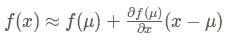
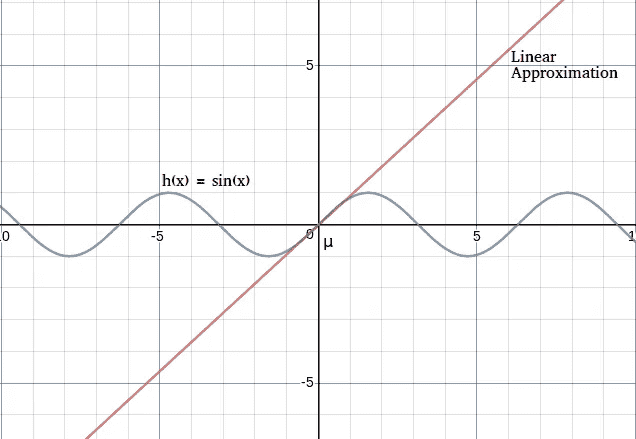
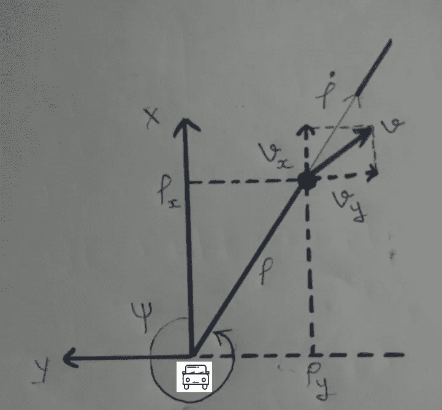
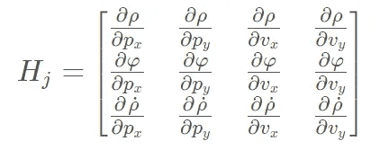
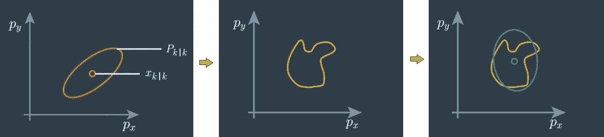

# 扩展卡尔曼滤波器

> 原文：<https://towardsdatascience.com/extended-kalman-filter-ee9bd04ac5dc?source=collection_archive---------2----------------------->

在我以前的博客中，我已经介绍过卡尔曼滤波器。在这篇博客中，我将讨论扩展滤波，并看看它如何解决卡尔曼滤波的问题。

这篇博客是我之前关于卡尔曼滤波器的博客的延续，所以如果你还没有读过，请在这里阅读。

# 为什么要使用扩展卡尔曼滤波器？

为了解决卡尔曼滤波中的非线性问题，引入了扩展卡尔曼滤波。在现实生活中，可能有许多场景，系统可能会从一个方向观察，而从另一个方向进行测量。这涉及到解决这些问题的角度，导致非线性函数，当输入高斯函数时，导致非高斯分布。并且我们不能对非高斯分布应用卡尔曼滤波器，因为计算非高斯函数的均值和方差是没有意义的。

它是如何工作的？

扩展卡尔曼滤波器利用**泰勒级数、**将非线性函数转化为线性函数，有助于得到非线性函数的**线性逼近**。

## 泰勒级数:

在数学中，**泰勒级数**是一个函数的表示，它是由函数在一个点的导数的值计算出来的无穷多个项的总和。简单来说，我们可以说，在泰勒级数中，我们取一个点，对它进行一系列求导。

当我们对一个多项式执行泰勒级数时，结果也是一个多项式，因此 EKF 所做的是首先在一个平均值处评估非线性函数，该平均值是分布的最佳近似值，然后估计一条斜率在该平均值附近的直线。该斜率由泰勒展开的一阶导数确定，因为一阶导数给出了线性值。因此，这种从泰勒级数的一阶导数获得斜率的方法被称为**一阶泰勒展开。**

**如何进行泰勒展开？**

泰勒级数由下式给出

Taylor Series

非线性函数 f(x)在均值(μ)处的泰勒级数方程的一般公式由下式给出:

By appling first order taylor expansion method

*得到泰勒展开式需要遵循的步骤:*

*   用一个给定的等式代替 f(x)
*   求偏导数
*   插入值μ，并进行评估，以获得μ值处的泰勒展开式。

让我们通过一个例子来理解这一点:

假设我们必须找到方程 sin(x)在μ = 0 时的泰勒展开式

所以按照上面讨论的步骤:

*   h(x) = sin(x)
*   ∂h = cos(x)
*   h(x)≈h(μ)+∂x∂h(μ)(xμ)

h(x)≈sin(μ)+cos(μ)(xμ)= 0+1 *(x-0)= x

# EKF 对 KF 预测和更新方程的影响

当我们谈到 EKF 对 KF 方程的影响时，有必要知道数据的来源。也就是说，对于自主车辆，我们需要知道我们必须执行预测的数据是来自激光雷达还是雷达。

因为激光雷达以笛卡尔坐标系统的形式为我们提供距离，而雷达以极坐标系统为我们提供距离和速度。两者的测量向量如下:

**激光雷达:{px，py}**

**雷达:{ *ρ，φ，ρ_dot* }**

其中 px:物体在笛卡尔坐标系中的 x 坐标

**py:** 物体在笛卡尔坐标系中的 y 坐标

**:*物体与车辆的距离*

****φ****:x 和ρ之间的逆时针角度**

****ρ_ dot****:ρ的变化率**

*x 轴决定汽车移动的位置。*

**

*Polar coordinate System*

*到目前为止，你可能已经理解了激光雷达提供的数据本质上是线性的，而雷达提供的数据是非线性的。因此，激光雷达数据的等式将保持与卡尔曼滤波器的等式相同，但是对于雷达测量，等式将如下:*

***预测步骤:***

> ***x′= f . x+b .μ+ν***
> 
> ***p′=fpfᵀ+q***

*无论使用何种设备，它都将保持与 KF 相同的状态。*

***雷达测量更新步骤:***

> ***y = z—h(x’)***

***z:** 极坐标下的实际测量*

***h(x’):**预测笛卡尔坐标系到极坐标的映射。这里的**x′**是笛卡尔坐标系中的预测值。*

**

*Mapping of Cartesian to Polar Coordinate system [Taken from udacity Nano degree]*

***y:** 实测值与实际测量值之差。*

> ***s =hⱼp′hⱼᵀ+r
> k =p′hⱼᵀs⁻***

***R:** 测量噪音*

*这些噪声决定了器件的校正参数。它由设备制造商提供，并在整个周期中保持不变。*

***Hⱼ:** 雅可比矩阵*

*正如我们已经看到的，为了将非线性函数转换为线性函数，我们使用泰勒级数展开，并对其进行一阶导数。当我们在方程中处理矩阵时，这个一阶导数由雅可比矩阵给出。*

**

*Jacobian matrix*

*因为雷达的状态向量由 px、py、vx 和 vy 组成。*

*通过应用导数，我们将得到 Hj 的最终值，如下所示:*

**

*Jacobian matix after applying derivative*

***K:** 卡尔曼增益*

*我们通过简单的公式计算卡尔曼增益，这个公式我已经在我的关于卡尔曼滤波的博客中展示过了。唯一的事情是，在矩阵中我们不能分割，所以这里我们采取 **S⁻。***

> ***x = x′+k . y
> p =(I-khⱼ)p′***

*最后，我们更新状态向量和协方差矩阵，并继续下一个预测步骤以获得其他值。*

# *扩展卡尔曼滤波器的问题*

*在扩展卡尔曼滤波器中，近似是基于单点即均值来完成的。这种近似可能不是最佳的近似，并导致较差的性能。你可以通过下图来理解:*

**

*mean and variance [Left] approximation based on mean[center] best possible approximation vs EKF approximation.[right][[Image Source](https://classroom.udacity.com/nanodegrees/nd013-connect/parts/7dc7c9b7-2884-4e43-bf15-2d1e1a121081)]*

*使用[无迹卡尔曼滤波器](https://en.wikipedia.org/wiki/UKF)解决了扩展卡尔曼滤波器的这个问题*