# 女子网球比赛的广泛分析

> 原文：<https://towardsdatascience.com/extensive-analysis-of-women-tennis-matches-5c98333f338a?source=collection_archive---------5----------------------->


Photo by [Ben Hershey](https://unsplash.com/photos/VEW78A1YZ6I?utm_source=unsplash&utm_medium=referral&utm_content=creditCopyText) on [Unsplash](https://unsplash.com/search/photos/tennis?utm_source=unsplash&utm_medium=referral&utm_content=creditCopyText)

在这里找到的 Kaggle 数据集涵盖了在 **WTA** (女子网球协会)注册的球员的统计数据，每年每场巡回赛发生的比赛，结果，以及巡回赛的一些资格赛。

> 从 2000 年到 2017 年的数据中发现了一些**有趣的分析**(其中一部分)。*分析是在 R Markdown 中完成的，在这里作为 Kaggle 内核*[](https://www.kaggle.com/ambarish/detailed-analysis-of-womens-tennis-matches)*托管*

# ***玩家统治***

*   *除了 2014 年和 2015 年由塞雷娜·威廉姆斯主导之外，2017-2003 年没有完全的优势*
*   ***1984 年至 1996 年由三名球员主宰，他们是玛蒂娜·纳芙拉蒂洛娃、施特菲·格拉芙和莫妮卡·塞莱斯。1997 年到 2002 年左右由林德赛·达文波特和玛蒂娜·辛吉斯主导***
*   ***在 2000 年至 2017 年(部分时间)的分析中，塞雷娜统治了大满贯赛事，赢得了 **7 个澳大利亚公开赛、3 个法国公开赛、7 个温布尔登公开赛和 5 个美国公开赛*****

# *****输掉第一盘或第二盘后获胜*****

*   ***在决赛输掉第一盘后**赢得美网决赛的概率是**零**。*****
*   ***在一场决赛输掉第一盘后**赢得法网决赛的概率是 **5 %** 。这种情况只在 2001 年珍妮弗·卡普里亚蒂击败吉姆·克里斯特尔斯时发生过一次*****
*   ***在一场决赛输掉第一盘后**赢得澳网决赛的概率是 **22%** 。*****
*   ***在一场决赛输掉第一盘后**赢得温网决赛的概率是 **17%** 。*****
*   ***在所有比赛中输掉第一盘后获胜的概率是 **16%*****
*   ***在所有比赛中输掉第二盘后获胜的概率是 **14%*****

# *****表面分析*****

******

***Photo by [Aaina Sharma](https://unsplash.com/photos/T7RHJ3c6s7Q?utm_source=unsplash&utm_medium=referral&utm_content=creditCopyText) on [Unsplash](https://unsplash.com/search/photos/clay-court?utm_source=unsplash&utm_medium=referral&utm_content=creditCopyText)***

***在 **2000 年至 2017 年期间(有 2017 年的部分数据)**，观察如下***

*   ***威廉姆斯姐妹占据了中奖名单的第一和第二名***
*   ***从各方面来看，俄罗斯人、美国人和法国人赢得了最多的比赛***
*   ***在硬面上，俄罗斯人、美国人和法国人占据了前三名的位置***
*   ***在红土表面，俄罗斯人、西班牙人和美国人占据了前三名***
*   ***在*草*面上，美国人、俄罗斯人和**澳大利亚人**又占据了前三的位置***
*   ***在*地毯*表面，俄罗斯人、法国人和美国人占据了前三的位置***

# *****锦标赛等级分析*****

***我们调查了不同锦标赛级别的**顶级赢家*****

*   ***威廉姆斯姐妹和玛丽亚·莎拉波娃占据了大满贯的前三名***
*   ***伊琳娜·德门蒂耶娃、贾斯汀·海宁和玛蒂娜·辛吉斯占据了 T1 锦标赛的前三名。比赛最多的 T1 锦标赛是迈阿密、印第安维尔斯和罗马***
*   ***陈月娇·毛瑞斯莫、林德赛·达文波特和吉姆·克里斯特尔斯占据了 T2 锦标赛的前三名。比赛最多的 T2 锦标赛是阿米莉娅岛、洛杉机和悉尼***

# *****镦粗分析*****

******

***Photo by [Davon King](https://unsplash.com/photos/BO8s2QCX3YM?utm_source=unsplash&utm_medium=referral&utm_content=creditCopyText) on [Unsplash](https://unsplash.com/search/photos/tennis-upset?utm_source=unsplash&utm_medium=referral&utm_content=creditCopyText)***

***如果赢家排名比输家排名至少高 10 位，我们可以认为是一个冷门。我们绘制了大满贯冠军和失败者之间的排名差异。***

*   ***我们注意到大满贯决赛中冷门很少。但是他们中的一些在那里，让我们找出他们是什么。**维纳斯·大威廉姆斯**在大满贯决赛中创造了**两次**爆冷。2017 年美国网球公开赛爆冷，半决赛**斯隆·斯蒂芬斯**击败**维纳斯·大威廉姆斯**决赛**麦迪逊·凯斯**。***
*   ***吉姆·克里斯特尔斯和丹尼埃拉·汉图楚娃在 T1 锦标赛决赛中创造了两次冷门***
*   ***查达·鲁宾在 T2 锦标赛决赛中创造了两次冷门***

***如果您对 ***代码感兴趣，请在下面查找详细信息。*** *分析是在 R Markdown 中完成的，在这里作为 Kaggle 内核*[](https://www.kaggle.com/ambarish/detailed-analysis-of-womens-tennis-matches)**托管。*****

# ******加载库******

****我们需要加载库来进行数据分析。****

```
****library(tidyverse)
library(stringr)
library(lubridate)
library(DT)****
```

# ******读取数据******

****将数据放在项目的输入目录中，并读取文件。数据集托管在[这里](https://www.kaggle.com/joaoevangelista/wta-matches-and-rankings)****

```
****fillColor = “#FFA07A”
fillColor2 = “#F1C40F”players = read_csv(“../input/wta/players.csv”)
rankings = read_csv(“../input/wta/rankings.csv”)
matches = read_csv(“../input/wta/matches.csv”)matches$tourney_name = str_replace(matches$tourney_name,”Us Open”,”US Open”)****
```

******国家和选手******

****该图显示了从 2000 年到 2017 年代表他们国家的国家和球员人数。我们观察到**美国是最大的赢家，澳大利亚、俄国、法国、德国、日本和中国都有超过五十名玩家参加******

****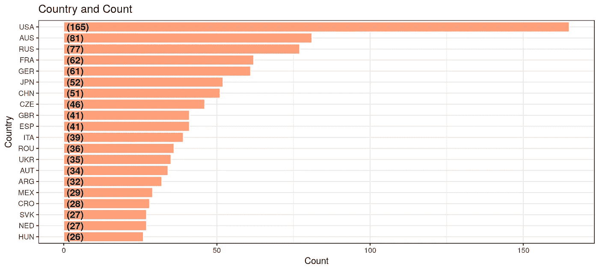****

```
****matches_country_winner = 
 matches %>% 
 select(winner_name,winner_ioc) %>%
 rename ( name = winner_name,ioc = winner_ioc)matches_country_loser = 
 matches %>% 
 select(loser_name,loser_ioc) %>%
 rename ( name = loser_name,ioc = loser_ioc)matches_country = unique(rbind(matches_country_winner,matches_country_loser))matches_country %>%
 group_by(ioc) %>%
 summarise(Count = n()) %>%
 arrange(desc(Count)) %>%
 ungroup() %>%
 mutate(ioc = reorder(ioc,Count)) %>%
 head(20) %>%

 ggplot(aes(x = ioc,y = Count)) +
 geom_bar(stat=’identity’,colour=”white”, fill = fillColor) +
 geom_text(aes(x = ioc, y = 1, label = paste0(“(“,Count,”)”,sep=””)),
 hjust=0, vjust=.5, size = 4, colour = ‘black’,
 fontface = ‘bold’) +
 labs(x = ‘Country’, 
 y = ‘Count’, 
 title = ‘Country and Count’) +
 coord_flip() +
 theme_bw()****
```

******排名和年份******

****我们显示球员和他们每年排名第一的位置。我们绘制了一个条形图，显示了他们至少获得 1 级排名的年数。同年，这些球员的排名可能下滑至第一名以下。**这显示了玩家的*坚持和长寿*。******

****在过去的 20 年里，施特菲·格拉芙、小威廉姆斯、林德赛·达文波特、莫妮卡·塞莱斯和玛蒂娜·辛吉斯这些普通的名字主宰了女子网球。****

****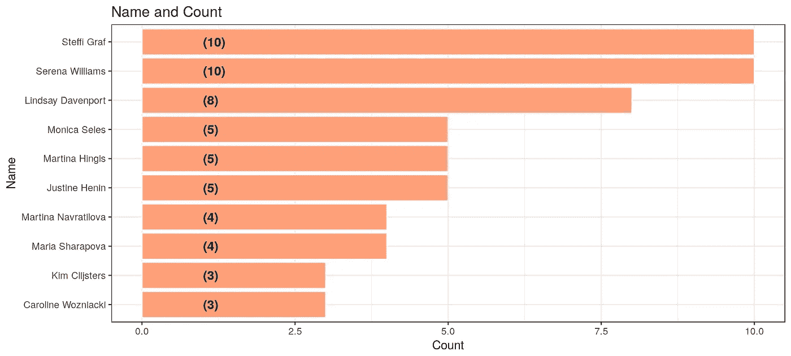****

****Years in No 1 Rank****

```
****players_rankings = inner_join(players,rankings)
players_rankings$year = str_sub(players_rankings$ranking_date,1,4)
players_rankings$month = str_sub(players_rankings$ranking_date,5,6)players_rankings_rank_one = players_rankings %>% filter(ranking == 1)players_rankings_rank_one_year = 
 players_rankings_rank_one %>% 
 group_by(first_name,last_name,year) %>% 
 tally()
players_rankings_rank_one_year = players_rankings_rank_one_year %>% select(-n)
players_rankings_rank_one_year = unique(players_rankings_rank_one_year)players_rankings_rank_one_year %>%
 mutate(FullName = paste0(first_name,” “,last_name,””)) %>%
 group_by(FullName) %>%
 summarise(Count = n()) %>%
 arrange(desc(Count)) %>%
 ungroup() %>%
 mutate(FullName = reorder(FullName,Count)) %>%
 head(10) %>%

 ggplot(aes(x = FullName,y = Count)) +
 geom_bar(stat=’identity’,colour=”white”, fill = fillColor) +
 geom_text(aes(x = FullName, y = 1, label = paste0(“(“,Count,”)”,sep=””)),
 hjust=0, vjust=.5, size = 4, colour = ‘black’,
 fontface = ‘bold’) +
 labs(x = ‘Name’, 
 y = ‘Count’, 
 title = ‘Name and Count’) +
 coord_flip() + 
 theme_bw()****
```

# ******每年排名第一的网球选手数量******

****我们绘制了一年中排名第一的网球运动员的数量。这显示了一年中有多少玩家排名第一。****

## ****2017 年至 2003 年排名第一的网球运动员人数****

****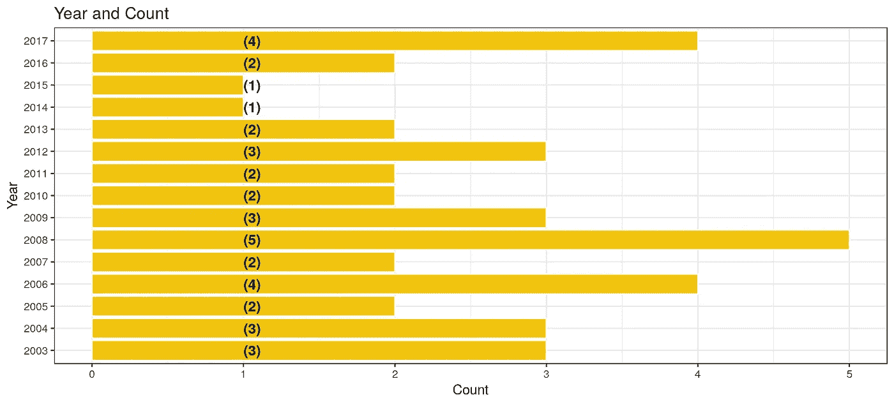****

****如柱状图 ***所示，2017 年至 2003 年没有完全的优势，除了 2014 年和 2015 年由小威廉姆斯*** 主导。****

```
****players_rankings_rank_one_year %>%
 group_by(year) %>%
 summarise(Count = n()) %>%
 arrange(desc(year)) %>%
 ungroup() %>%
 head(15) %>%

 ggplot(aes(x = year,y = Count)) +
 geom_bar(stat=’identity’,colour=”white”, fill = fillColor2) +
 geom_text(aes(x = year, y = 1, label = paste0(“(“,Count,”)”,sep=””)),
 hjust=0, vjust=.5, size = 4, colour = ‘black’,
 fontface = ‘bold’) +
 labs(x = ‘Year’, 
 y = ‘Count’, 
 title = ‘Year and Count’) +
 coord_flip() + 
 theme_bw()****
```

****排名数据如下所示****

```
****datatable(head(players_rankings_rank_one_year %>% arrange(desc(year)),10), style=”bootstrap”, class=”table-condensed”, options = list(dom = ‘tp’,scrollX = TRUE))****
```

******1984-2003 年世界排名第一的网球运动员人数******

****1984 年至 1996 年由三名球员主导 ***玛蒂娜·纳芙拉蒂洛娃、施特菲·格拉芙和莫妮卡·塞莱斯***。1997 年至 2002 年左右由 ***林德赛·达文波特和玛蒂娜·辛吉斯主导。*******

****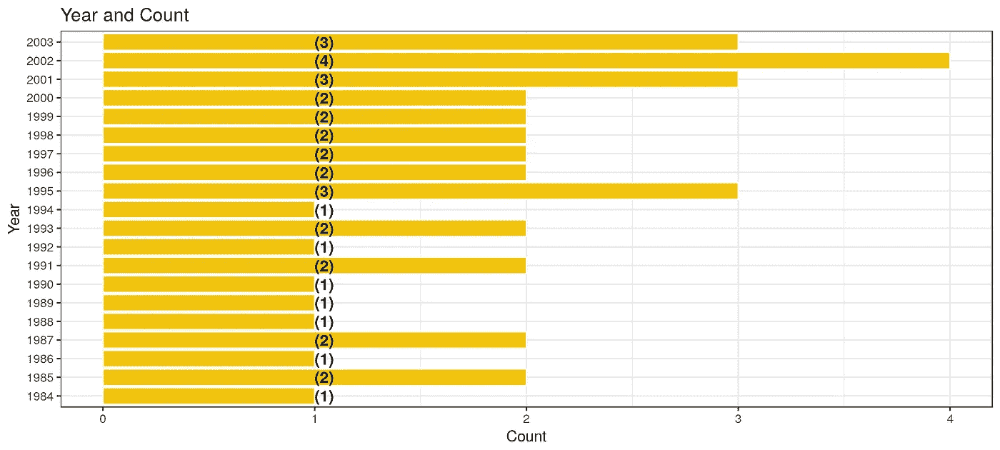****

```
****players_rankings_rank_one_year %>%
 group_by(year) %>%
 summarise(Count = n()) %>%
 arrange(desc(year)) %>%
 ungroup() %>%
 tail(20) %>%

 ggplot(aes(x = year,y = Count)) +
 geom_bar(stat=’identity’,colour=”white”, fill = fillColor2) +
 geom_text(aes(x = year, y = 1, label = paste0(“(“,Count,”)”,sep=””)),
 hjust=0, vjust=.5, size = 4, colour = ‘black’,
 fontface = ‘bold’) +
 labs(x = ‘Year’, 
 y = ‘Count’, 
 title = ‘Year and Count’) +
 coord_flip() + 
 theme_bw()****
```

****排名数据如下所示****

```
****datatable(tail(players_rankings_rank_one_year %>% arrange(desc(year)) ,34), style=”bootstrap”, class=”table-condensed”, options = list(dom = ‘tp’,scrollX = TRUE))****
```

****小威廉姆斯排名趋势****

****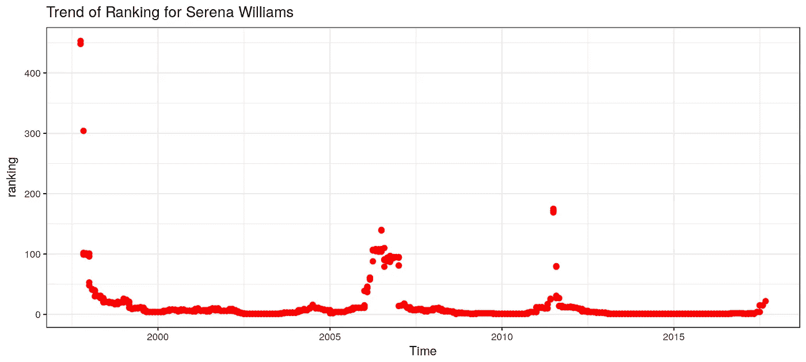****

```
****plotTrendsRankings = function(players_rankings,firstname,lastname,plottitle)
{
 players_rankings %>% 
 filter(first_name == firstname) %>%
 filter(last_name == lastname) %>%
 mutate(YearMonth = make_date(year=year,month=month) ) %>%

 ggplot(aes(x=YearMonth,y=ranking,group = 1)) +
 geom_point(size=2, color=”red”) +

 labs(x = ‘Time’, y = ‘ranking’,title = plottitle) +
 theme_bw() 

}plotTrendsRankings(players_rankings,”Serena”,”Williams”,”Trend of Ranking for Serena Williams”)****
```

******排名在 100 名以上******

```
****rankingsAboveThreshold = function(players_rankings,firstname,lastname,threshold)
{
 players_rankings %>% 
 filter(first_name == firstname) %>%
 filter(last_name == lastname) %>%
 filter(ranking >=threshold)
}serena100 = rankingsAboveThreshold(players_rankings,”Serena”,”Williams”,100) %>%
 select(year,month,ranking) %>% 
 arrange(desc(ranking))datatable(serena100 %>% arrange(desc(year)), style=”bootstrap”, class=”table-condensed”, options = list(dom = ‘tp’,scrollX = TRUE))****
```

****很明显，小威在 2006 年和 2011 年的排名分别下降了 50 位和 100 位。****

******施特菲·格拉芙排名趋势******

```
****plotTrendsRankings(players_rankings,”Steffi”,”Graf”,”Trend of Ranking for Steffi Graf”)****
```

****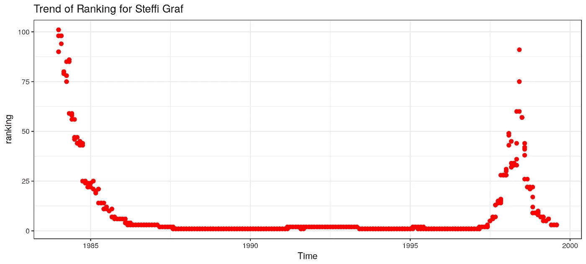****

## ****西蒙娜·哈勒普排名趋势****

```
****plotTrendsRankings(players_rankings,”Simona”,”Halep”,”Trend of Ranking for Simona Halep”)****
```

****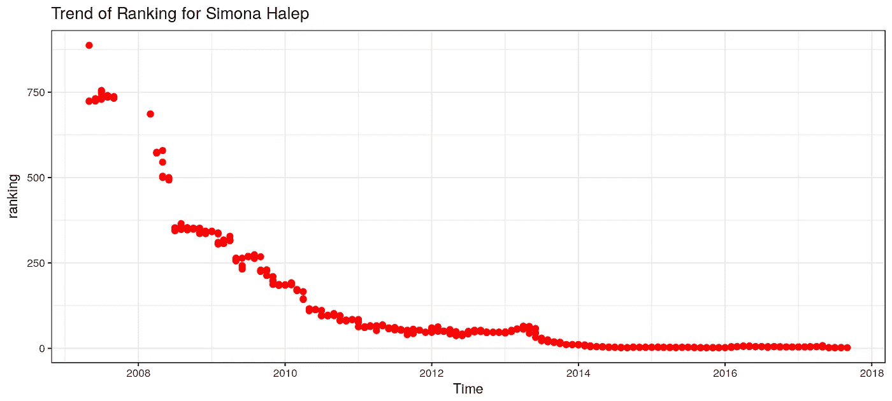****

******Sania Mirza 排名趋势******

```
****plotTrendsRankings(players_rankings,”Sania”,”Mirza”,”Trend of Ranking for Sania Mirza”)****
```

****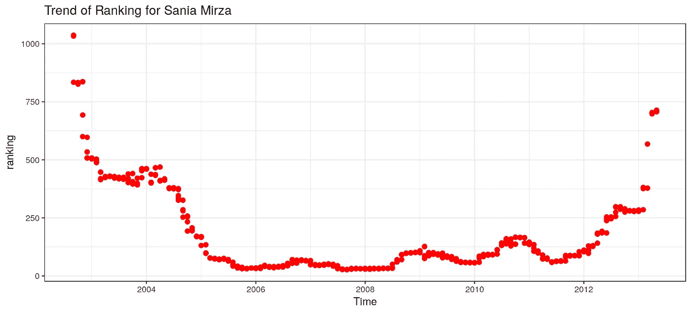****

******澳网冠军******

****下面的柱状图展示了**澳网冠军******

```
****getTournamentWinners = function(tournamentname,roundname)
{
 return(
 matches %>%
 filter(tourney_name == tournamentname) %>%
 filter(round == roundname) %>%
 mutate(agediff = winner_age — loser_age) %>%
 mutate(rankingdiff = loser_rank — winner_rank) %>%
 mutate(htdiff = winner_ht — loser_ht)
 )
}getGrandSlamWinners = function(roundname)
{
 return(
 matches %>%
 filter(tourney_level == “G”) %>%
 filter(round == roundname) %>%
 mutate(agediff = winner_age — loser_age) %>%
 mutate(rankingdiff = loser_rank — winner_rank)
 )
}plotTournamentWinners = function(tournament,titleName)
{
 tournament %>%
 group_by(winner_name) %>%
 summarise(Count = n()) %>%
 arrange(desc(Count)) %>%
 ungroup() %>%
 mutate(winner_name = reorder(winner_name,Count)) %>%

 ggplot(aes(x = winner_name,y = Count)) +
 geom_bar(stat=’identity’,colour=”white”, fill = fillColor2) +
 geom_text(aes(x = winner_name, y = 1, label = paste0(“(“,Count,”)”,sep=””)),
 hjust=0, vjust=.5, size = 4, colour = ‘black’,
 fontface = ‘bold’) +
 labs(x = ‘Winner’, 
 y = ‘Count’, 
 title = titleName) +
 coord_flip() + 
 theme_bw()

}ausopen = getTournamentWinners(“Australian Open”,”F”)
plotTournamentWinners(ausopen,’Aus Open Winners Count’)****
```

****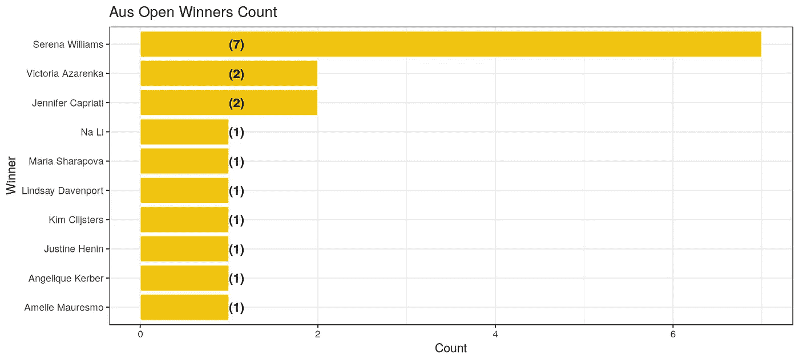****

******澳网冠军年龄分布******

```
****summary(ausopen$winner_age)ausopen %>%
 ggplot(aes(x = winner_age)) +
 geom_histogram(binwidth = 1,fill = fillColor) +
 labs(x= ‘Winner Age’,y = ‘Count’, title = paste(“Distribution of”, ‘ Winner Age ‘)) +
 theme_bw()****
```

****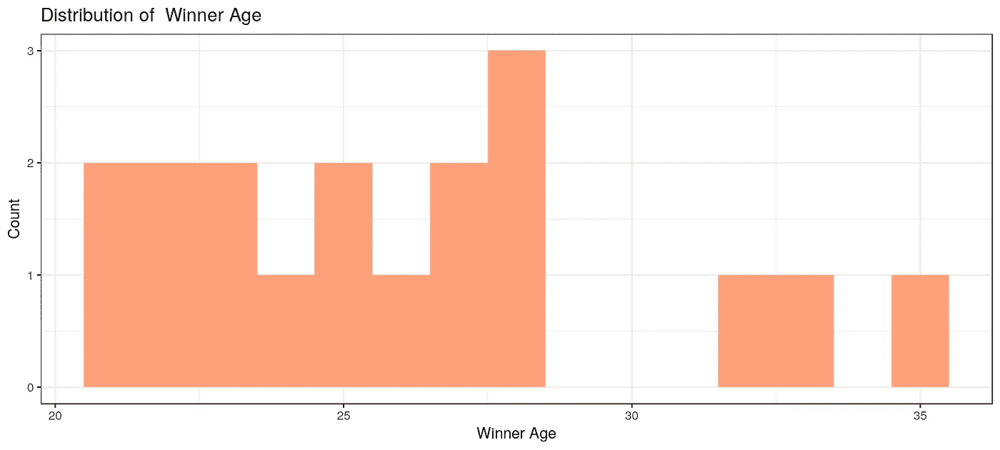****

****该图显示澳网冠军大多在 23 至 28 岁之间。****

******法网冠军******

****下面的柱状图展示了法国网球公开赛的获胜者****

```
****french = getTournamentWinners(“French Open”,”F”) 
plotTournamentWinners(french,’French Open Winners Count’)****
```

****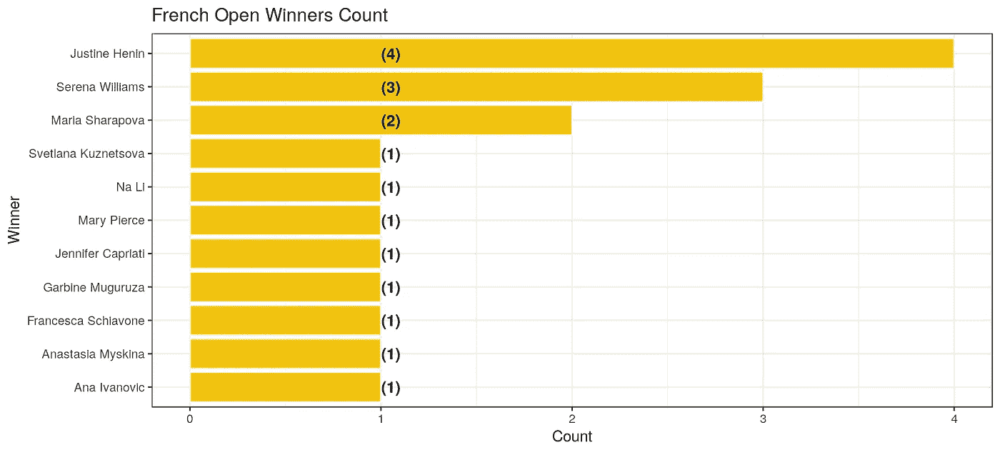****

******法网冠军年龄分布******

```
****summary(french$winner_age)french %>%
 ggplot(aes(x = winner_age)) +
 geom_histogram(binwidth = 1,fill = fillColor) +
 labs(x= ‘Winner Age’,y = ‘Count’, title = paste(“Distribution of”, ‘ Winner Age ‘)) +
 theme_bw()****
```

****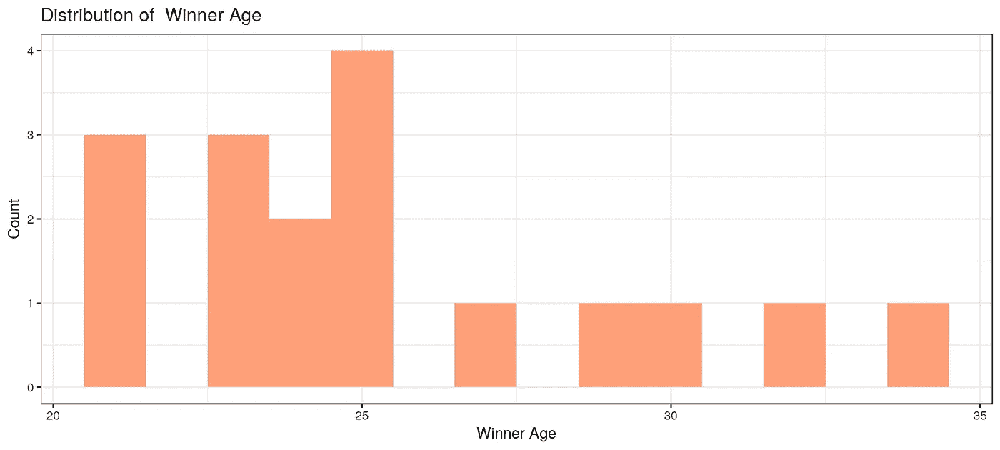****

****该图显示法网冠军大多在 22 至 27 岁之间。****

# ****温布尔登冠军****

****下面的柱状图展示了温布尔登的获胜者****

```
****wimbledon = getTournamentWinners(“Wimbledon”,”F”) 
plotTournamentWinners(wimbledon,’Wimbledon Winners Count’)****
```

****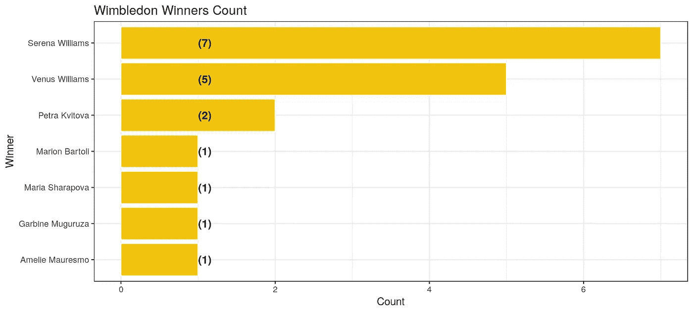****

## ****温布尔登冠军的年龄分布****

```
****summary(wimbledon$winner_age)wimbledon %>%
 ggplot(aes(x = winner_age)) +
 geom_histogram(binwidth = 1,fill = fillColor) +
 labs(x= ‘Winner Age’,y = ‘Count’, title = paste(“Distribution of”, ‘ Winner Age ‘)) +
 theme_bw()****
```

****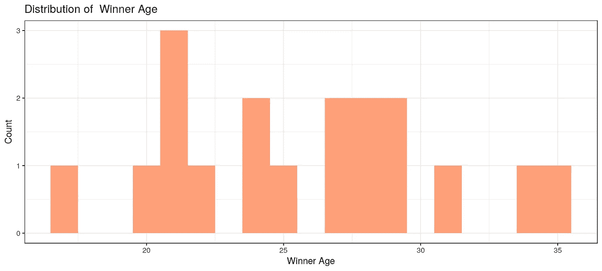****

****该图显示温布尔登网球公开赛的获胜者大多在 21 岁至 29 岁之间。****

# ****美国公开赛冠军****

****下面的柱状图展示了美国公开赛的获胜者****

```
****usopen = getTournamentWinners(“US Open”,”F”) 
plotTournamentWinners(usopen,’US Open Winners Count’)****
```

****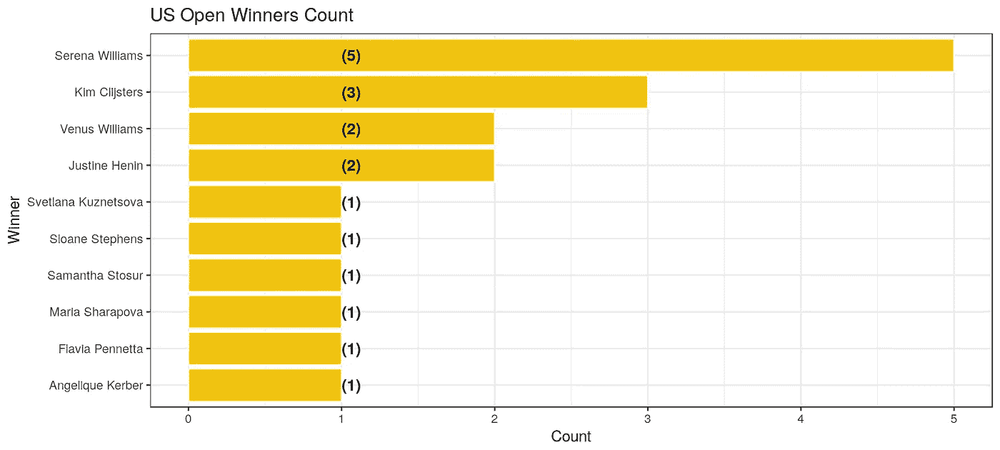****

## ****美国公开赛冠军的年龄分布****

```
****summary(usopen$winner_age)usopen %>%
 ggplot(aes(x = winner_age)) +
 geom_histogram(binwidth = 1,fill = fillColor) +
 labs(x= ‘Winner Age’,y = ‘Count’, title = paste(“Distribution of”, ‘ Winner Age ‘)) +
 theme_bw()****
```

****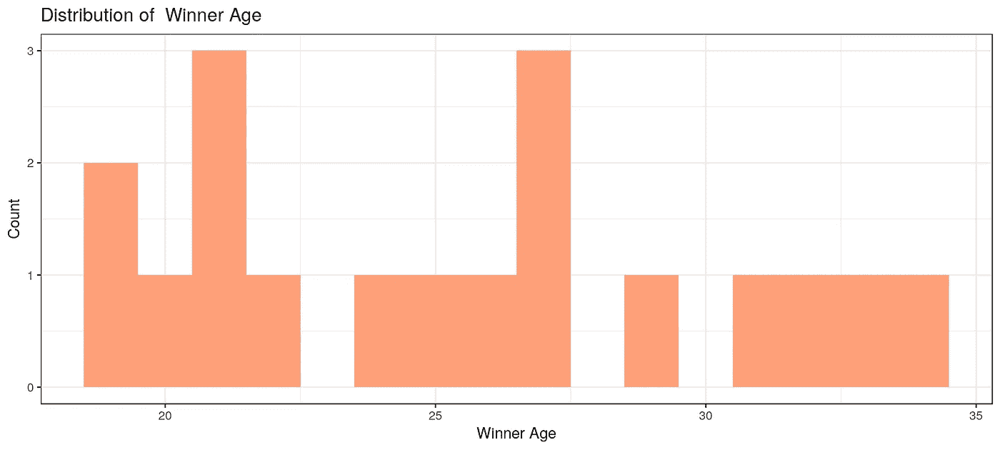****

****该图显示，美国公开赛的获胜者大多在 21 岁至 28 岁之间。****

# ****成功者和失败者的身高差距****

****我们绘制了大满贯冠军和失败者之间的身高差。数据显示，大满贯冠军比失败者的身高更低，尽管数据没有 19 个条目。****

```
****grandslam= rbind(ausopen,french,wimbledon,usopen)summary(grandslam$htdiff)****
```

******直方图******

```
****grandslam %>%
 ggplot(aes(x = htdiff)) +
 geom_histogram(binwidth = 1,fill = fillColor) +
 labs(x= ‘Height Difference’,y = ‘Count’, title = paste(“Distribution of”, ‘ Height Difference ‘)) +
 theme_bw()****
```

****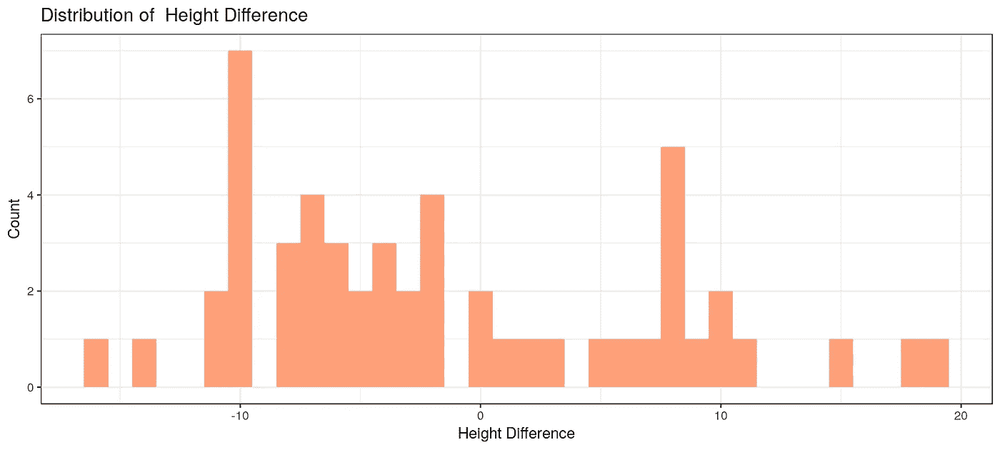****

## ****密度图****

```
****grandslam %>%
 ggplot(aes(x = htdiff)) +
 geom_density(fill = fillColor2) +
 labs(x= ‘Height Difference’,y = ‘Count’, title = paste(“Distribution of”, ‘ Height Difference ‘)) +
 theme_bw()****
```

****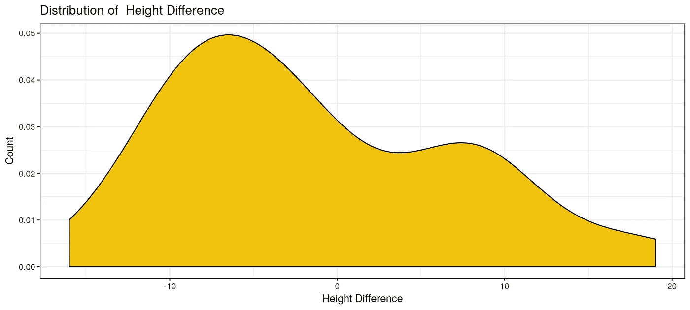****

## ****表列数据****

```
****grandslamhtdiff = grandslam %>% select(winner_name,loser_name,htdiff)datatable(grandslamhtdiff, style=”bootstrap”, class=”table-condensed”, options = list(dom = ‘tp’,scrollX = TRUE))****
```

# ****成功者和失败者之间的年龄差距****

****我们绘制了大满贯冠军和失败者之间的年龄差距。****

```
****summary(grandslam$agediff)grandslam %>%
 ggplot(aes(x = agediff)) +
 geom_histogram(binwidth = 1,fill = fillColor) +
 labs(x= ‘Age Difference’,y = ‘Count’, title = paste(“Distribution of”, ‘ Age Difference ‘)) +
 theme_bw()grandslam %>%
 ggplot(aes(x = agediff)) +
 geom_density(fill = fillColor2) +
 labs(x= ‘Age Difference’,y = ‘Count’, title = paste(“Distribution of”, ‘ Age Difference ‘)) +
 theme_bw()****
```

****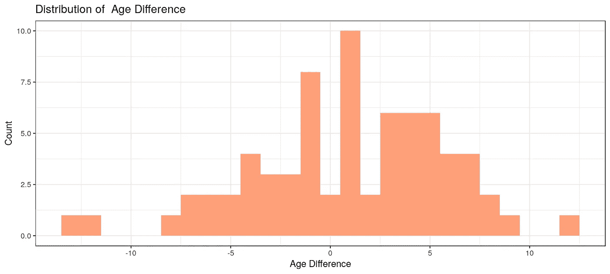****

****从图中可以明显看出，年纪大的选手比年轻选手更容易赢得决赛。****

# ****特征工程:第一、第二、第三组赢家和输家****

****我们提取第一组、第二组和第三组获胜者的特征****

```
****whowon = function(scores,setnumber)
{
 scores2 = str_split(scores,” “)set = scores2[[1]][setnumber]set_score = str_split(set,”-”)winner_score = as.numeric(set_score[[1]][1])
 loser_score =as.numeric(str_split(set_score[[1]][2],””)[[1]][1])

 if( (is.na(winner_score)) ||
 (is.na(loser_score))
 )
 {
 setwinner = “”
 }else
 {
 if(winner_score > loser_score)
 {
 setwinner = “winner”
 }else
 {
 setwinner = “loser”
 }
 }

 return(setwinner)

}matches$first_set = sapply(matches$score,whowon, setnumber = 1)
matches$second_set = sapply(matches$score,whowon, setnumber = 2)
matches$third_set = sapply(matches$score,whowon, setnumber = 3)****
```

## ****输掉第一盘后赢家的百分比****

```
****first_set_loser = matches %>% 
 filter(first_set == “loser”)nrow(first_set_loser)/nrow(matches) *100****
```

# ****大多数人在输掉第一盘后获胜****

****条形图显示了第一盘失败后的获胜者****

********

```
****first_set_loser %>%
 group_by(winner_name) %>%
 summarise(Count = n()) %>%
 arrange(desc(Count)) %>%
 ungroup() %>%
 mutate(winner_name = reorder(winner_name,Count)) %>%
 head(10) %>%

 ggplot(aes(x = winner_name,y = Count)) +
 geom_bar(stat=’identity’,colour=”white”, fill = fillColor2) +
 geom_text(aes(x = winner_name, y = 1, label = paste0(“(“,Count,”)”,sep=””)),
 hjust=0, vjust=.5, size = 4, colour = ‘black’,
 fontface = ‘bold’) +
 labs(x = ‘Winner’, 
 y = ‘Count’, 
 title = ‘Winner’) +
 coord_flip() + 
 theme_bw()****
```

# ****输掉第二盘后赢家的百分比****

```
****second_set_loser = matches %>% 
 filter(second_set == “loser”)nrow(second_set_loser)/nrow(matches) *100****
```

## ****大多数人在输掉第二盘后获胜****

****条形图显示了输掉第二盘后的赢家****

****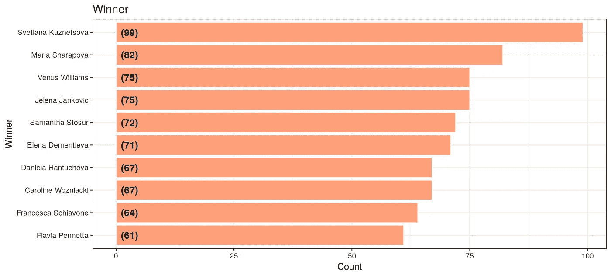****

```
****second_set_loser = matches %>% 
 filter(second_set == “loser”)second_set_loser %>%
 group_by(winner_name) %>%
 summarise(Count = n()) %>%
 arrange(desc(Count)) %>%
 ungroup() %>%
 mutate(winner_name = reorder(winner_name,Count)) %>%
 head(10) %>%

 ggplot(aes(x = winner_name,y = Count)) +
 geom_bar(stat=’identity’,colour=”white”, fill = fillColor) +
 geom_text(aes(x = winner_name, y = 1, label = paste0(“(“,Count,”)”,sep=””)),
 hjust=0, vjust=.5, size = 4, colour = ‘black’,
 fontface = ‘bold’) +
 labs(x = ‘Winner’, 
 y = ‘Count’, 
 title = ‘Winner’) +
 coord_flip() + 
 theme_bw()****
```

## ****在大满贯赛事中输掉第一盘后的赢家比例****

****我们在输掉第一盘后计算赢家的百分比****

```
****gs_final_firstset_loser = matches %>%
 filter(tourney_level == “G”) %>%
 filter(round == “F”) %>%
 filter(first_set == “loser”)gs_final_secondset_loser = matches %>%
 filter(tourney_level == “G”) %>%
 filter(round == “F”) %>%
 filter(second_set == “loser”)gs_final_thirdset_loser = matches %>%
 filter(tourney_level == “G”) %>%
 filter(round == “F”) %>%
 filter(third_set == “loser”)gs_final = matches %>%
 filter(tourney_level == “G”) %>%
 filter(round == “F”)nrow(gs_final_firstset_loser)/nrow(gs_final) *100****
```

## ****在大满贯赛事中输掉第二盘后的赢家比例****

****我们在输掉第二盘后计算赢家的百分比****

```
****nrow(gs_final_secondset_loser)/nrow(gs_final) *100****
```

## ****澳大利亚网球公开赛输掉第一盘后的赢家比例****

****我们在输掉第一盘后计算赢家的百分比****

```
****percentWinnersTourney = function(matches,tournamentName)
{
 gs_final_firstset_loser = matches %>%
 filter(tourney_name == tournamentName) %>%
 filter(round == “F”) %>%
 filter(first_set == “loser”)
gs_final_secondset_loser = matches %>%
 filter(tourney_name == tournamentName) %>%
 filter(round == “F”) %>%
 filter(second_set == “loser”)gs_final = matches %>%
 filter(tourney_name == tournamentName) %>%
 filter(round == “F”)nrow(gs_final_firstset_loser)/nrow(gs_final) *100}displayGrandSlamWinnersAfterLosingFirstSet = function(matches,tournamentName)
{
 gs_final_firstset_loser = matches %>%
 filter(tourney_name == tournamentName) %>%
 filter(round == “F”) %>%
 filter(first_set == “loser”) %>% 
 select(winner_name,loser_name,year,score)

 datatable(gs_final_firstset_loser, style=”bootstrap”, class=”table-condensed”, options = list(dom = ‘tp’,scrollX = TRUE))
}percentWinnersTourney(matches,”Australian Open”)
displayGrandSlamWinnersAfterLosingFirstSet(matches,”Australian Open”)****
```

## ****在温布尔登输掉第一盘后的赢家比例****

****我们在输掉第一盘后计算赢家的百分比****

```
****percentWinnersTourney(matches,”Wimbledon”)
displayGrandSlamWinnersAfterLosingFirstSet(matches,”Wimbledon”)****
```

## ****法国网球公开赛输掉第一盘后的赢家比例****

****我们在输掉第一盘后计算赢家的百分比****

```
****percentWinnersTourney(matches,”French Open”)
displayGrandSlamWinnersAfterLosingFirstSet(matches,”French Open”)****
```

## ****美国网球公开赛输掉第一盘后的赢家比例****

****我们在输掉第一盘后计算赢家的百分比****

```
****percentWinnersTourney(matches,”US Open”)
displayGrandSlamWinnersAfterLosingFirstSet(matches,”US Open”)****
```

****很明显，**输掉法美第一盘**就意味着几乎输掉了**决赛**。零次，只有一次，一名选手在输掉第一盘后分别赢得了美国和法国。****

# ****表面****

****不同表面上的匹配数量显示在条形图中。****

****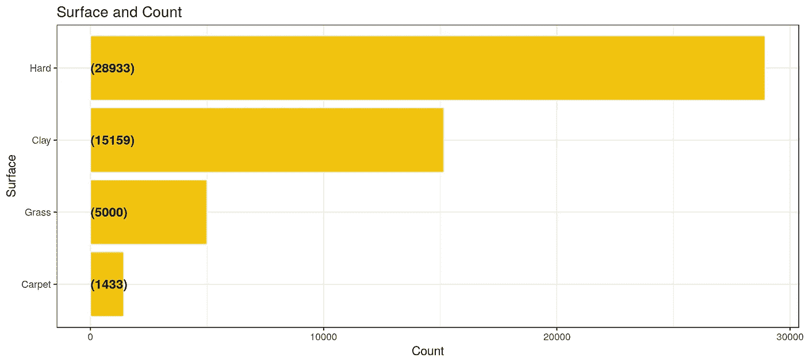****

```
****matches %>%
 filter(!is.na(surface)) %>%
 filter(!str_detect(surface,”-”)) %>%
 group_by(surface) %>%
 summarise(Count = n()) %>%
 arrange(desc(Count)) %>%
 ungroup() %>%
 mutate(surface = reorder(surface,Count)) %>%

 ggplot(aes(x = surface,y = Count)) +
 geom_bar(stat=’identity’,colour=”white”,fill=fillColor2) +
 geom_text(aes(x = surface, y = 1, label = paste0(“(“,Count,”)”,sep=””)),
 hjust=0, vjust=.5, size = 4, colour = ‘black’,
 fontface = ‘bold’) +
 labs(x = ‘Surface’, 
 y = ‘Count’, 
 title = ‘Surface and Count’) +
 coord_flip() + 
 theme_bw()****
```

****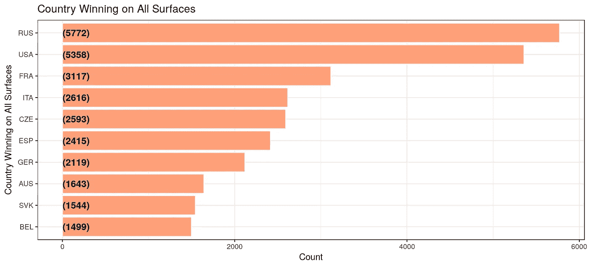****

****在 **2000 年至 2017 年期间(有 2017 年的部分数据)**，观察如下****

*   ****威廉姆斯姐妹占据了中奖名单的第一和第二名****
*   ****从各方面来看，俄罗斯人、美国人和法国人赢得了最多的比赛****
*   ****在坚硬的地面上，俄罗斯人、美国人和法国人占据了前三名的位置****
*   ****在红土表面上，俄罗斯人、西班牙人和美国人占据了前三名的位置****
*   ****在**草**面上，美国人、俄罗斯人和澳大利亚人又占据了前三的位置****
*   ****在地毯上，俄罗斯人、法国人和美国人占据了前三名的位置****

******所有表面******

****所有表面的前 10 名获奖者如下所示****

****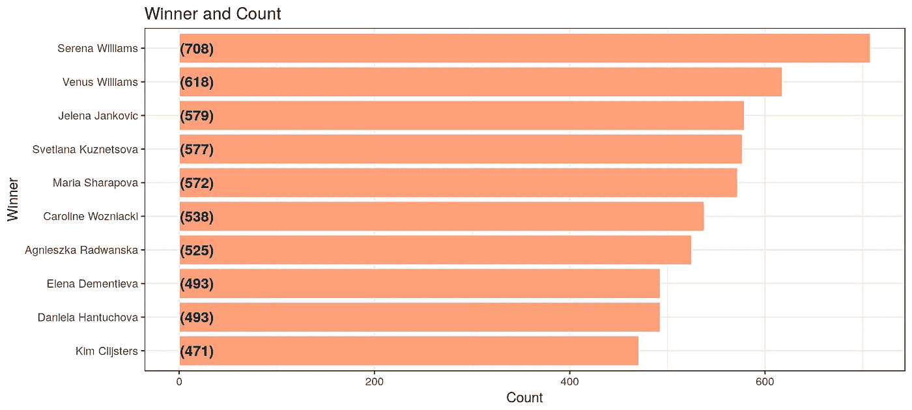****

```
****matches %>%
 group_by(winner_name) %>%
 summarise(Count = n()) %>%
 arrange(desc(Count)) %>%
 ungroup() %>%
 mutate(winner_name = reorder(winner_name,Count)) %>%
 head(10) %>%

 ggplot(aes(x = winner_name,y = Count)) +
 geom_bar(stat=’identity’,colour=”white”,fill=fillColor) +
 geom_text(aes(x = winner_name, y = 1, label = paste0(“(“,Count,”)”,sep=””)),
 hjust=0, vjust=.5, size = 4, colour = ‘black’,
 fontface = ‘bold’) +
 labs(x = ‘Winner’, 
 y = ‘Count’, 
 title = ‘Winner and Count’) +
 coord_flip() + 
 theme_bw()surfaceTitle = ‘Country Winning on All Surfaces’matches %>%
 group_by(winner_ioc) %>%
 summarise(Count = n()) %>%
 arrange(desc(Count)) %>%
 ungroup() %>%
 mutate(winner_ioc = reorder(winner_ioc,Count)) %>%
 head(10) %>%

 ggplot(aes(x = winner_ioc,y = Count)) +
 geom_bar(stat=’identity’,colour=”white”,fill=fillColor) +
 geom_text(aes(x = winner_ioc, y = 1, label = paste0(“(“,Count,”)”,sep=””)),
 hjust=0, vjust=.5, size = 4, colour = ‘black’,
 fontface = ‘bold’) +
 labs(x = surfaceTitle, 
 y = ‘Count’, 
 title = surfaceTitle) +
 coord_flip() + 
 theme_bw()****
```

## ****壳体****

****在**硬质**表面上的前 10 名获胜者如下所示****

****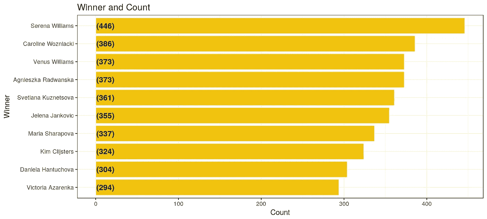********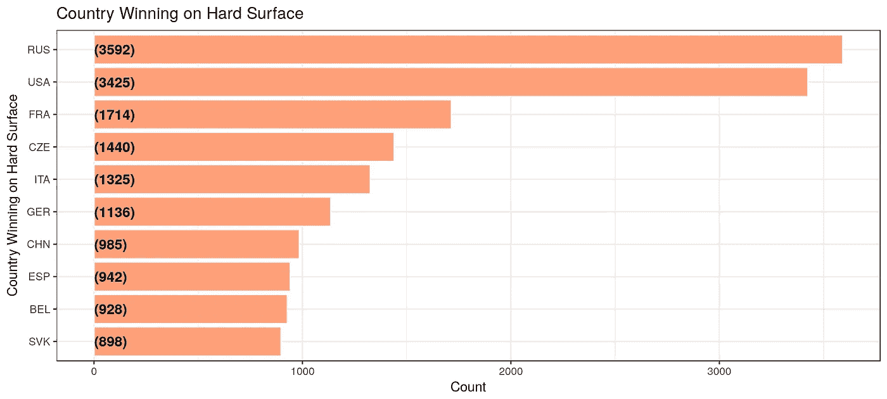****

```
****surfaceWinners = function(surfaceName)
{
 matches %>%
 filter(surface == surfaceName) %>%
 group_by(winner_name) %>%
 summarise(Count = n()) %>%
 arrange(desc(Count)) %>%
 ungroup() %>%
 mutate(winner_name = reorder(winner_name,Count)) %>%
 head(10) %>%

 ggplot(aes(x = winner_name,y = Count)) +
 geom_bar(stat=’identity’,colour=”white”,fill=fillColor2) +
 geom_text(aes(x = winner_name, y = 1, label = paste0(“(“,Count,”)”,sep=””)),
 hjust=0, vjust=.5, size = 4, colour = ‘black’,
 fontface = ‘bold’) +
 labs(x = ‘Winner’, 
 y = ‘Count’, 
 title = ‘Winner and Count’) +
 coord_flip() + 
 theme_bw()

}countriesSurface = function(surfaceName,surfaceTitle)
{
 matches %>%
 filter(surface == surfaceName) %>%
 group_by(winner_ioc) %>%
 summarise(Count = n()) %>%
 arrange(desc(Count)) %>%
 ungroup() %>%
 mutate(winner_ioc = reorder(winner_ioc,Count)) %>%
 head(10) %>%

 ggplot(aes(x = winner_ioc,y = Count)) +
 geom_bar(stat=’identity’,colour=”white”,fill=fillColor) +
 geom_text(aes(x = winner_ioc, y = 1, label = paste0(“(“,Count,”)”,sep=””)),
 hjust=0, vjust=.5, size = 4, colour = ‘black’,
 fontface = ‘bold’) +
 labs(x = surfaceTitle, 
 y = ‘Count’, 
 title = surfaceTitle) +
 coord_flip() + 
 theme_bw()
}surfaceWinners(‘Hard’)
countriesSurface(‘Hard’,’Country Winning on Hard Surface’)****
```

## ****粘土表面****

****在**粘土**表面上的前 10 名获胜者如下所示****

****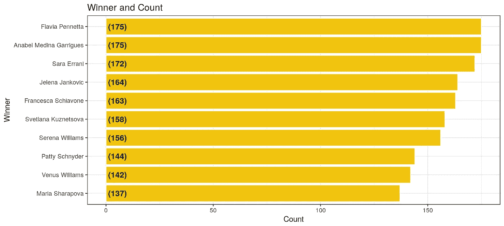********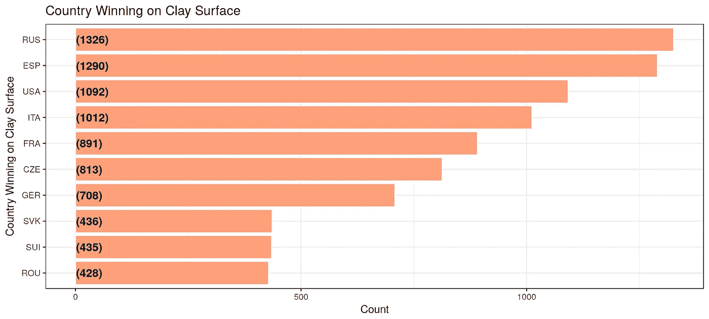****

```
****surfaceWinners(‘Clay’)
countriesSurface(‘Clay’,’Country Winning on Clay Surface’)****
```

## ****草地表面****

****草地表面的前 10 名获胜者如下所示****

****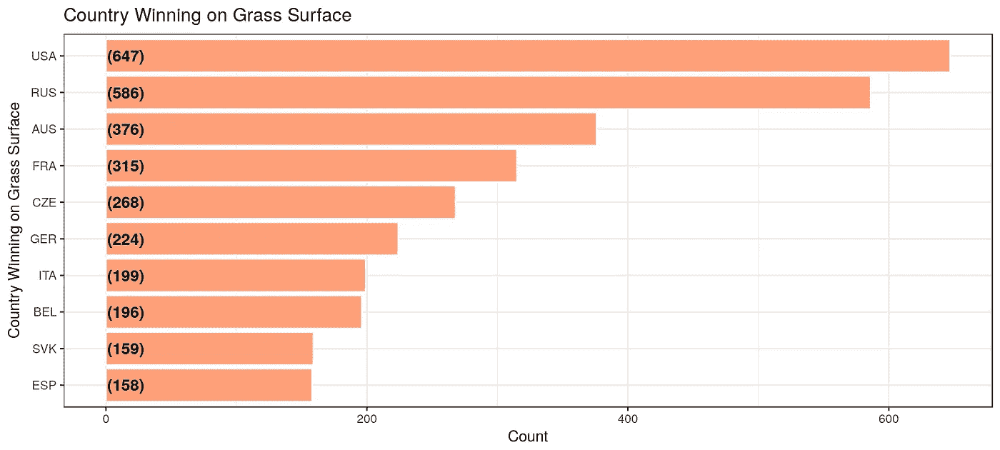****

```
****surfaceWinners(‘Grass’)
countriesSurface(‘Grass’,’Country Winning on Grass Surface’)****
```

## ****地毯表面****

****地毯表面的前 10 名获奖者如下所示****

****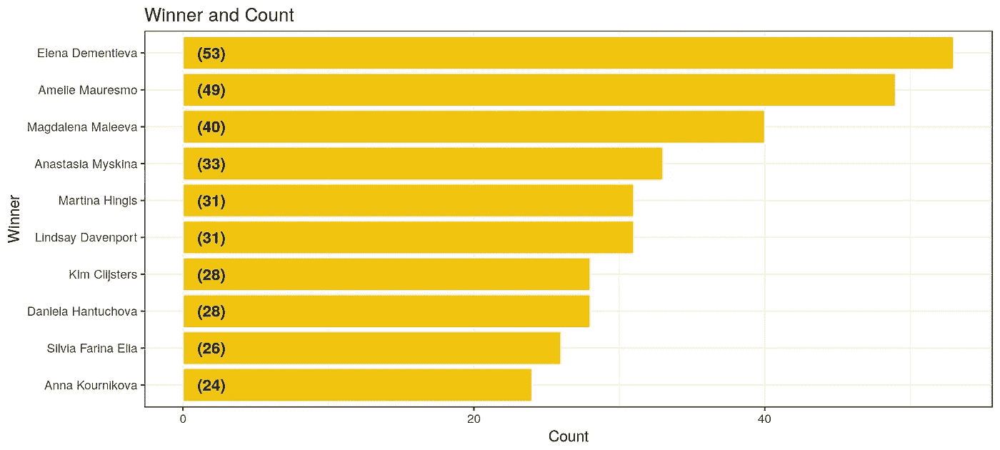********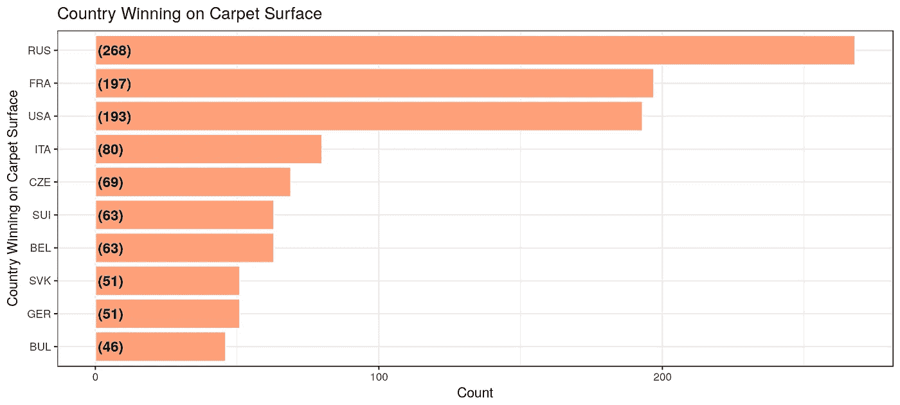****

```
****surfaceWinners(‘Carpet’)
countriesSurface(‘Carpet’,’Country Winning on Carpet Surface’)****
```

# ****锦标赛级别****

****下面的条形图显示了与每个级别相关的锦标赛数量。****

****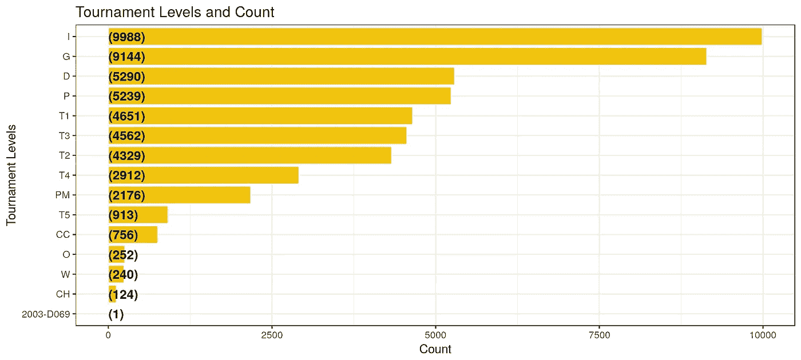****

```
****matches %>%
 filter(!is.na(tourney_level)) %>%
 group_by(tourney_level) %>%
 summarise(Count = n()) %>%
 arrange(desc(Count)) %>%
 ungroup() %>%
 mutate(tourney_level = reorder(tourney_level,Count)) %>%

 ggplot(aes(x = tourney_level,y = Count)) +
 geom_bar(stat=’identity’,colour=”white”,fill=fillColor2) +
 geom_text(aes(x = tourney_level, y = 1, label = paste0(“(“,Count,”)”,sep=””)),
 hjust=0, vjust=.5, size = 4, colour = ‘black’,
 fontface = ‘bold’) +
 labs(x = ‘Tournament Levels’, 
 y = ‘Count’, 
 title = ‘Tournament Levels and Count’) +
 coord_flip() + 
 theme_bw()tournamnentLevelTournaments = function(tournamnentLevel)
{
 matches %>%
 filter(tourney_level == tournamnentLevel) %>%
 group_by(tourney_name) %>%
 summarise(Count = n()) %>%
 arrange(desc(Count)) %>%
 ungroup() %>%
 mutate(tourney_name = reorder(tourney_name,Count)) %>%
 head(10) %>%

 ggplot(aes(x = tourney_name,y = Count)) +
 geom_bar(stat=’identity’,colour=”white”,fill=fillColor) +
 geom_text(aes(x = tourney_name, y = 1, label = paste0(“(“,Count,”)”,sep=””)),
 hjust=0, vjust=.5, size = 4, colour = ‘black’,
 fontface = ‘bold’) +
 labs(x = ‘Tournament Name’, 
 y = ‘Count’, 
 title = ‘Tournament Name and Count’) +
 coord_flip() + 
 theme_bw()

}tournamnentLevelWinners = function(tournamnentLevel)
{
 matches %>%
 filter(tourney_level == tournamnentLevel) %>%
 group_by(winner_name) %>%
 summarise(Count = n()) %>%
 arrange(desc(Count)) %>%
 ungroup() %>%
 mutate(winner_name = reorder(winner_name,Count)) %>%
 head(10) %>%

 ggplot(aes(x = winner_name,y = Count)) +
 geom_bar(stat=’identity’,colour=”white”,fill=fillColor2) +
 geom_text(aes(x = winner_name, y = 1, label = paste0(“(“,Count,”)”,sep=””)),
 hjust=0, vjust=.5, size = 4, colour = ‘black’,
 fontface = ‘bold’) +
 labs(x = ‘Winner’, 
 y = ‘Count’, 
 title = ‘Winner and Count’) +
 coord_flip() + 
 theme_bw()

}****
```

****我们调查了不同锦标赛级别的顶级赢家****

*   ****威廉姆斯姐妹和玛丽亚·莎拉波娃占据了大满贯的前三名****
*   ****伊琳娜·德门蒂耶娃、贾斯汀·海宁和玛蒂娜·辛吉斯占据了 T1 锦标赛的前三名。比赛最多的 T1 锦标赛是迈阿密、印第安维尔斯和罗马****
*   ****陈月娇·毛瑞斯莫、林德赛·达文波特和吉姆·克里斯特尔斯占据了 T2 锦标赛的前三名。比赛最多的 T2 锦标赛是阿米莉娅岛、洛杉机和悉尼****

## ****大满贯中获胜次数最多的****

****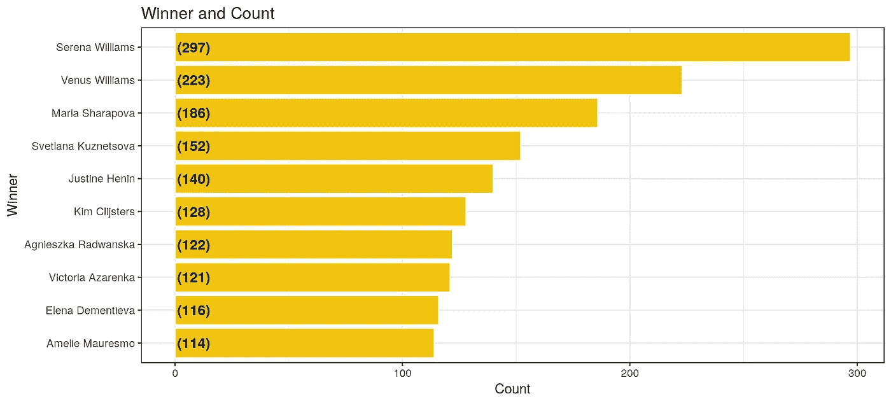****

```
****tournamnentLevelWinners(‘G’)****
```

## ****T1 锦标赛级别的大多数比赛****

****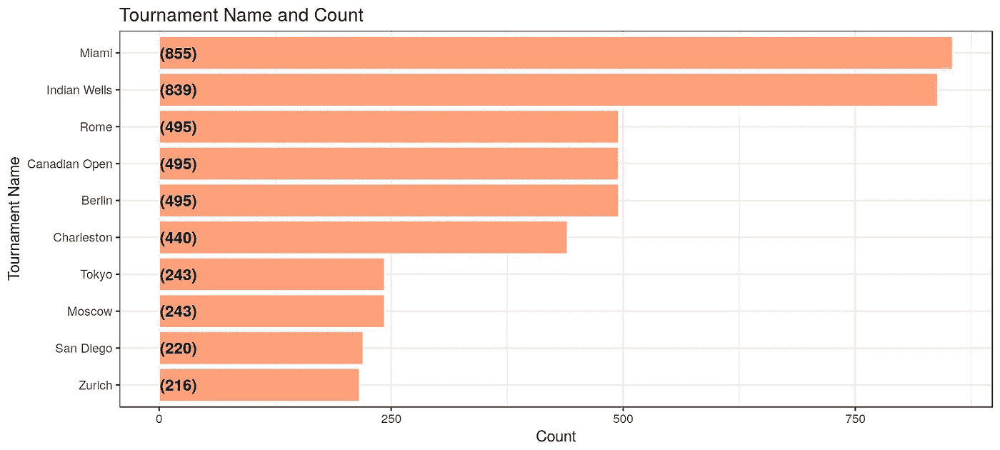****

```
****tournamnentLevelTournaments(‘T1’)****
```

## ****在 T1 锦标赛级别赢得最多****

****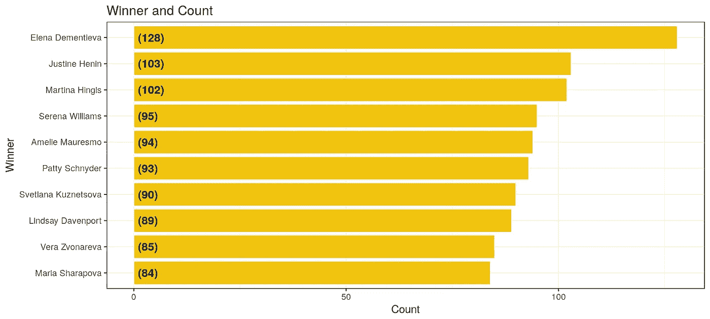****

```
****tournamnentLevelWinners(‘T1’)****
```

## ****T2 锦标赛级别的大多数比赛****

****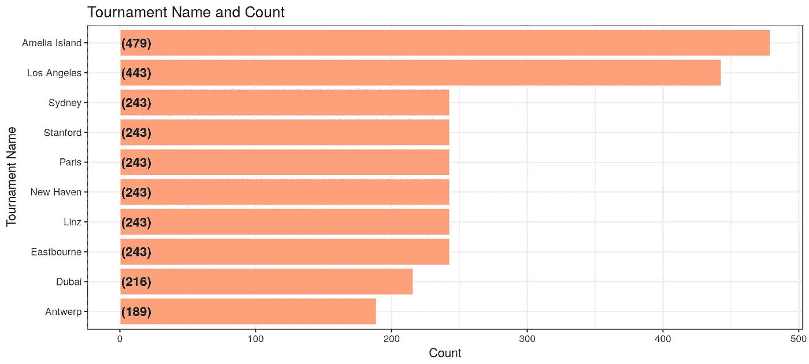****

```
****tournamnentLevelTournaments(‘T2’)****
```

## ****在 T2 锦标赛中获胜次数最多****

****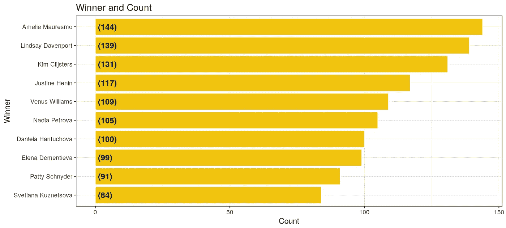****

```
****tournamnentLevelWinners(‘T2’)****
```

## ****T3 锦标赛级别的大多数比赛****

****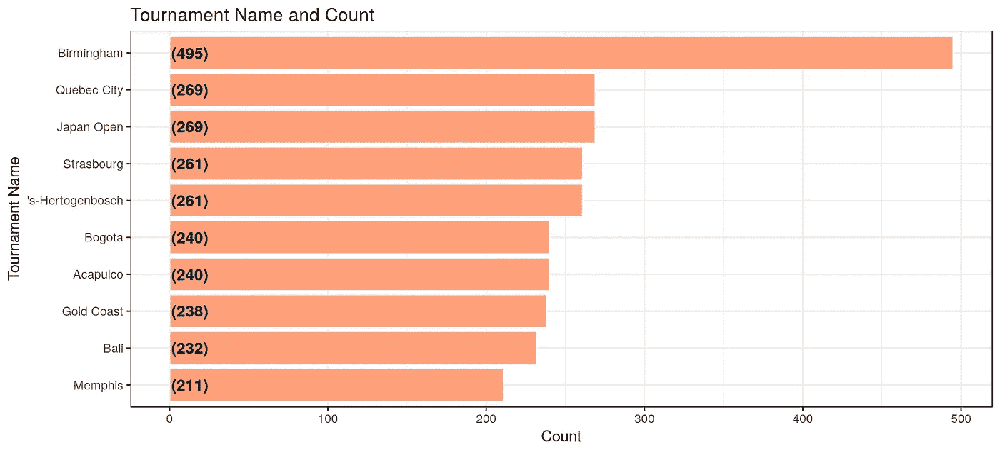****

```
****tournamnentLevelTournaments(‘T3’)****
```

## ****在 T3 锦标赛级别赢得最多****

****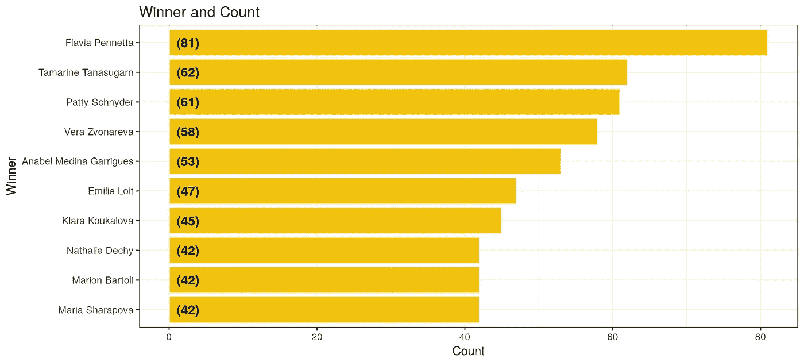****

```
****tournamnentLevelWinners(‘T3’)****
```

# ****压折****

****如果赢家排名比输家排名至少高 10 位，我们可以认为是一个冷门。我们绘制了大满贯冠军和失败者之间的排名差异。****

## ****在大满贯决赛中造成冷门的球员****

****我们注意到大满贯决赛中冷门很少。但是他们中的一些在那里，让我们找出他们是什么。****

> ****维纳斯·大威廉姆斯在大满贯决赛中创造了两次冷门。2017 年，当斯隆·斯蒂芬斯在半决赛中击败维纳斯·大威廉姆斯，在决赛中击败麦迪逊·凯斯时，美国公开赛出现了逆转。****

```
****grandslamupsets = grandslam %>%
 filter(rankingdiff < -10) %>%
 select(winner_name,loser_name,winner_rank,loser_rank,tourney_name,year)plotUpsets = function(upsetsData,titleName)
{
 upsetsData %>%
 group_by(winner_name) %>%
 summarise(Count = n()) %>%
 arrange(desc(Count)) %>%
 ungroup() %>%
 mutate(winner_name = reorder(winner_name,Count)) %>%
 head(10) %>%

 ggplot(aes(x = winner_name,y = Count)) +
 geom_bar(stat=’identity’,colour=”white”,fill=fillColor2) +
 geom_text(aes(x = winner_name, y = 1, label = paste0(“(“,Count,”)”,sep=””)),
 hjust=0, vjust=.5, size = 4, colour = ‘black’,
 fontface = ‘bold’) +
 labs(x = titleName, 
 y = ‘Count’, 
 title = titleName) +
 coord_flip() + 
 theme_bw()
}

plotUpsets(grandslamupsets,’Upset Winner in Grand Slam Finals’)datatable(grandslamupsets, style=”bootstrap”, class=”table-condensed”, options = list(dom = ‘tp’,scrollX = TRUE))****
```

****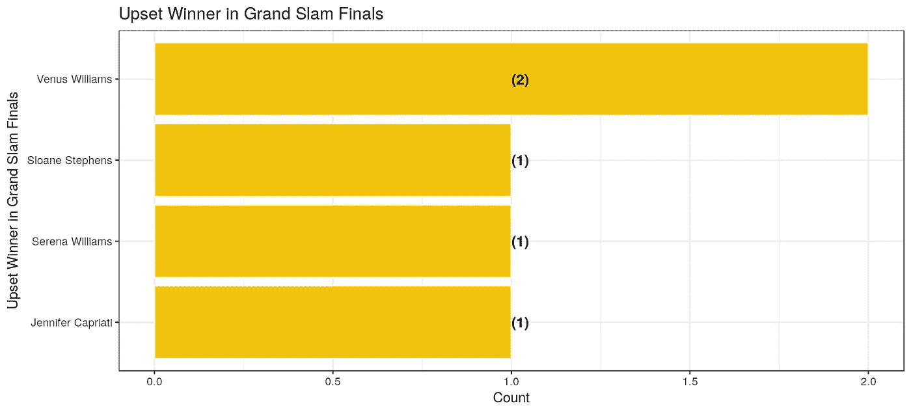****

## ****大满贯半决赛的冷门****

****威廉姆斯姐妹再次在大满贯半决赛中制造冷门。****

****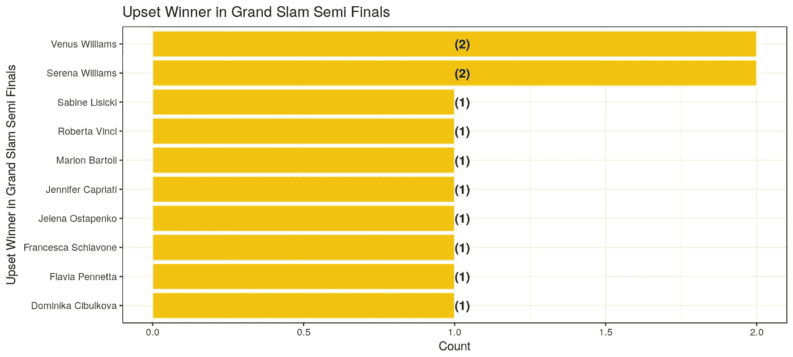****

```
****grandslamSF =getGrandSlamWinners(‘SF’)grandslamupsets = grandslamSF %>%
 filter(rankingdiff < -10) %>%
 select(winner_name,loser_name,winner_rank,loser_rank,tourney_name,year)plotUpsets(grandslamupsets,’Upset Winner in Grand Slam Semi Finals’)datatable(grandslamupsets, style=”bootstrap”, class=”table-condensed”, options = list(dom = ‘tp’,scrollX = TRUE))****
```

## ****T1 锦标赛中的冷门****

****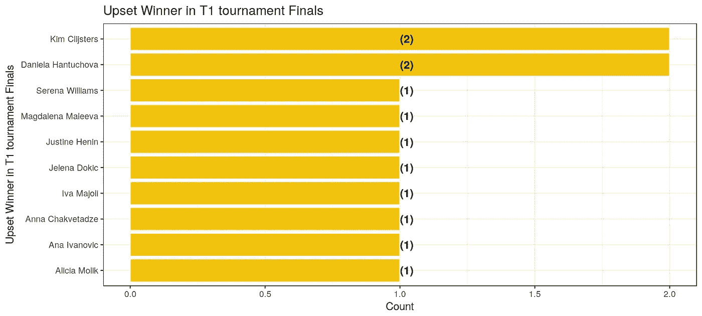****

```
****getTournamentWinners = function(tourney_level_name,roundname)
{
 return(
 matches %>%
 filter(tourney_level == tourney_level_name) %>%
 filter(round == roundname) %>%
 mutate(agediff = winner_age — loser_age) %>%
 mutate(rankingdiff = loser_rank — winner_rank)
 )
}T1Winners = getTournamentWinners(‘T1’,’F’)T1upsets = T1Winners %>%
 filter(rankingdiff < -10) %>%
 select(winner_name,loser_name,winner_rank,loser_rank,tourney_name,year)plotUpsets(T1upsets,’Upset Winner in T1 tournament Finals’)datatable(T1upsets, style=”bootstrap”, class=”table-condensed”, options = list(dom = ‘tp’,scrollX = TRUE))****
```

## ****T2 锦标赛的冷门****

****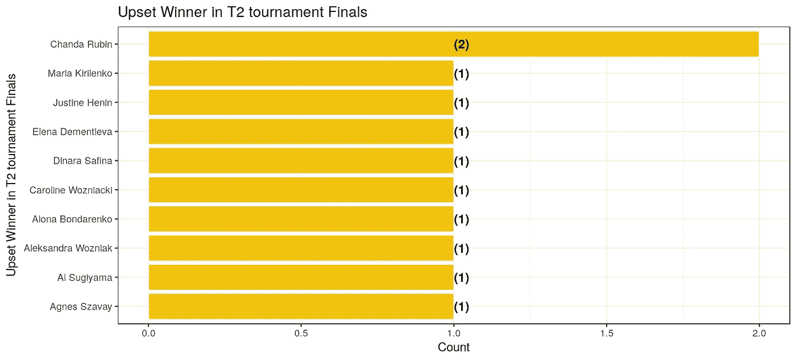****

```
****T2Winners = getTournamentWinners(‘T2’,’F’)T2upsets = T2Winners %>%
 filter(rankingdiff < -10) %>%
 select(winner_name,loser_name,winner_rank,loser_rank,tourney_name,year)plotUpsets(T2upsets,’Upset Winner in T2 tournament Finals’)datatable(T2upsets, style=”bootstrap”, class=”table-condensed”, options = list(dom = ‘tp’,scrollX = TRUE))****
```

****你可能也喜欢访问我的网站 http://ambarishg.github.io，了解其他有趣的帖子。****