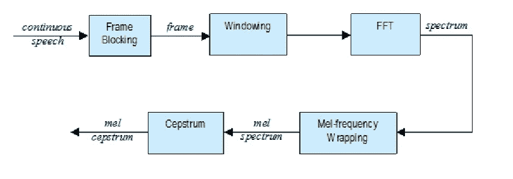
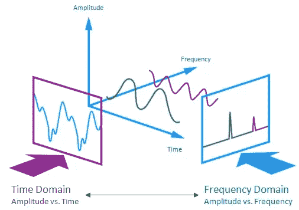
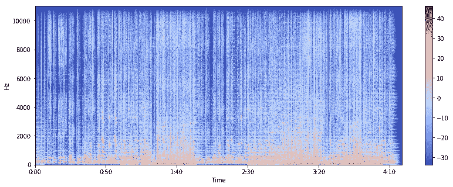
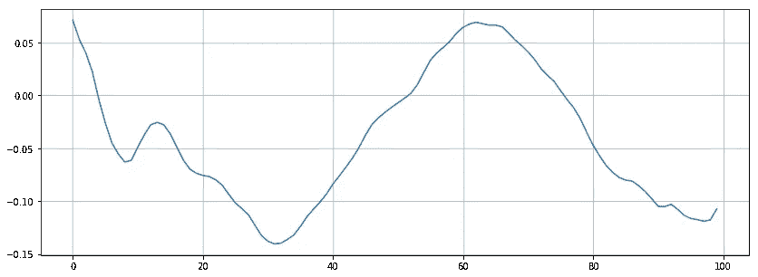
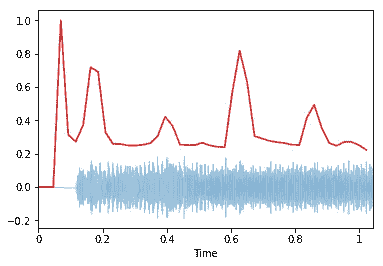
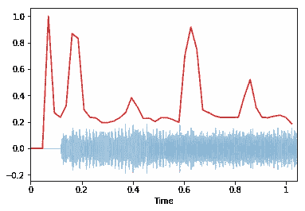
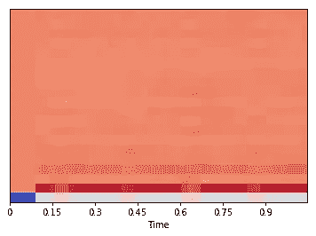

# Python 中的音乐特征提取

> 原文：<https://towardsdatascience.com/extract-features-of-music-75a3f9bc265d?source=collection_archive---------2----------------------->

## 不同类型的音频特征以及如何提取它们。



MFCC feature extraction

特征提取是分析和发现不同事物之间关系的一个非常重要的部分。所提供的音频数据不能被模型直接理解以将它们转换成可理解的格式，使用特征提取。这是一个以可理解的方式解释大部分数据的过程。分类、预测和推荐算法都需要特征提取。

在这个博客中，我们将提取音乐文件的特征，这将有助于我们将音乐文件分类为不同的流派，或者根据您的喜好推荐音乐。我们将学习用于提取音乐特征的不同技术。

音频信号是三维信号，其中三个轴代表时间、振幅和频率。



Audio signal

**要使用的包**

我们将使用 [librosa](https://librosa.github.io/librosa/) 来分析和提取音频信号的特征。为了播放音频，我们将使用 [pyAudio](https://people.csail.mit.edu/hubert/pyaudio/docs/) ，这样我们就可以直接在 jupyter 上播放音乐。

**加载音频**

```
import librosa
audio_path = 'audio-path'
x , sr = librosa.load(audio_path)
print(type(x), type(sr))
```

`.load`加载一个音频文件，解码成一维数组，一维数组是时间序列`x`，`sr`是采样率`x`。默认`sr`是 22kHz。我们可以通过以下方式覆盖`sr`

```
librosa.load(audio_path, sr=44100)
```

我们可以通过以下方式禁用采样:

```
librosa.load(audio_path, sr=none)
```

**播放音频**

```
import IPython.display as ipd
ipd.Audio(audio_path)
```

`IPython.display`允许我们直接在 jupyter 笔记本上播放音频。它有一个非常简单的界面，有一些基本的按钮。

```
#display waveform
%matplotlib inline
import matplotlib.pyplot as plt
import librosa.display
plt.figure(figsize=(14, 5))
librosa.display.waveplot(x, sr=sr)
```

`librosa.display`用于显示不同格式的音频文件，如波形图、声谱图或色彩图。波形图让我们知道在给定时间音频的响度。频谱图显示了在特定时间播放的不同频率及其振幅。振幅和频率是声音的重要参数，对于每个音频都是唯一的。`librosa.display.waveplot`用于绘制振幅对时间的波形，其中第一轴为振幅，第二轴为时间。

**频谱图**

声谱图是[声音](https://en.wikipedia.org/wiki/Sound)的[频率](https://en.wikipedia.org/wiki/Frequencies)的[频谱](https://en.wikipedia.org/wiki/Spectral_density)或其他信号随时间变化的直观表示。它代表了给定音乐信号的频率随时间的变化。

```
#display Spectrogram
X = librosa.stft(x)
Xdb = librosa.amplitude_to_db(abs(X))
plt.figure(figsize=(14, 5))
librosa.display.specshow(Xdb, sr=sr, x_axis='time', y_axis='hz') 
#If to pring log of frequencies  
#librosa.display.specshow(Xdb, sr=sr, x_axis='time', y_axis='log')
plt.colorbar()
```

`.stft`将数据转换成短期傅立叶变换。 [STFT](https://www.youtube.com/watch?v=g1_wcbGUcDY) 转换信号，这样我们就可以知道给定时间给定频率的幅度。使用 STFT，我们可以确定音频信号在给定时间播放的各种频率的幅度。`.specshow`用于显示频谱图。

输出如下所示:



spectrum

# **特征提取**

**过零率**

过零率是信号符号变化的速率，即信号从正变到负或反变的速率。这个特性已经在语音识别和音乐信息检索中大量使用。它通常具有较高的值，适用于像金属和摇滚这样的高敲击声。

```
x, sr = librosa.load(audio_path)
#Plot the signal:
plt.figure(figsize=(14, 5))
librosa.display.waveplot(x, sr=sr)
```

**放大:**

这里我们将只缩放或打印 100 个阵列列的光谱。

```
# Zooming in
n0 = 9000
n1 = 9100
plt.figure(figsize=(14, 5))
plt.plot(x[n0:n1])
plt.grid()
```

情节看起来像:



正如我们所见，在给定的图表中有三个过零点。

我们也可以使用给定代码计算过零事件:

```
zero_crossings = librosa.zero_crossings(x[n0:n1], pad=False)
print(sum(zero_crossings))
```

**光谱质心**

它表示声音的“质量中心”所在的位置，计算方法是声音中频率的加权平均值。如果音乐中的频率始终相同，那么频谱质心将围绕一个中心，如果在声音的末端有高频，那么质心将朝向其末端。

```
#spectral centroid -- centre of mass -- weighted mean of the frequencies present in the sound
import sklearn
spectral_centroids = librosa.feature.spectral_centroid(x, sr=sr)[0]
spectral_centroids.shape# Computing the time variable for visualization
frames = range(len(spectral_centroids))
t = librosa.frames_to_time(frames)
# Normalising the spectral centroid for visualisation
def normalize(x, axis=0):
    return sklearn.preprocessing.minmax_scale(x, axis=axis)
#Plotting the Spectral Centroid along the waveform
librosa.display.waveplot(x, sr=sr, alpha=0.4)
plt.plot(t, normalize(spectral_centroids), color='r')
```

`.spectral_centroid`用于计算每一帧的光谱质心。所以它将返回一个数组，其列数等于样本中的帧数。

`.frames_to_time`将帧转换为时间。时间[i] ==帧[i]。

我们正在标准化，以便我们可以轻松地可视化数据。



spectral centroid

与过零率类似，在信号开始时，频谱质心会出现杂散上升。这是因为开始时的静音幅度很小，高频成分有机会占主导地位。

**光谱衰减**

频谱衰减是总频谱能量的指定百分比(例如 85%)低于的频率。

它也给出了每一帧的结果。

```
spectral_rolloff = librosa.feature.spectral_rolloff(x, sr=sr)[0]
librosa.display.waveplot(x, sr=sr, alpha=0.4)
plt.plot(t, normalize(spectral_rolloff), color='r')
```

`.spectral_rolloff`用于计算给定帧的滚降。



Spectral Rolloff

**MFCC —梅尔频率倒谱系数**

该特征是提取音频信号特征的最重要的方法之一，并且主要在处理音频信号时使用。信号的 mel 频率倒谱系数(MFCCs)是一小组特征(通常约 10–20)，它们简明地描述了频谱包络的整体形状。

```
mfccs = librosa.feature.mfcc(x, sr=sr)
print(mfccs.shape)#Displaying  the MFCCs:
librosa.display.specshow(mfccs, sr=sr, x_axis='time')
```

`.mfcc`用于计算信号的 mfccs。

通过打印 MFCC 的形状，你可以得到多少 MFCC 是根据多少帧计算的。第一个值表示计算的 mfccs 的数量，另一个值表示可用的帧数。



MFCC

现在，我们已经提取了音乐信号的特征。我们可以使用在各种用例中提取的这个特征，例如分类成不同的流派。我们将在我们的[下一篇博客](https://medium.com/@sdoshi579/classification-of-music-into-different-genres-using-keras-82ab5339efe0)中实现这一点。