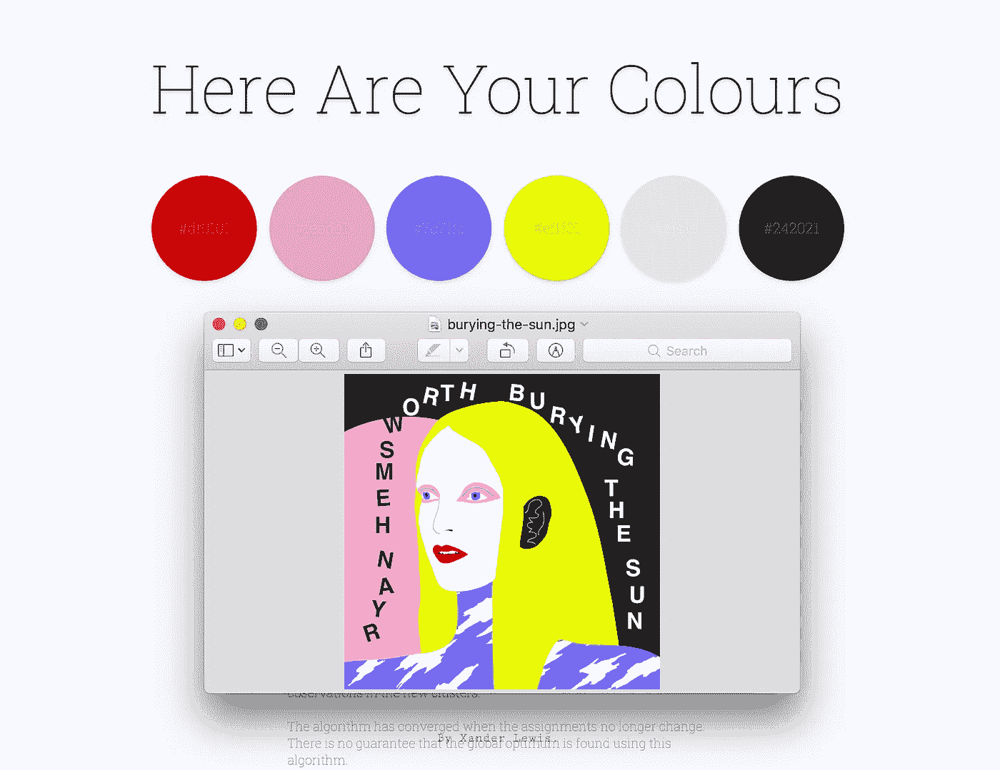

# 利用 k-均值聚类从图像中提取颜色

> 原文：<https://towardsdatascience.com/extracting-colours-from-an-image-using-k-means-clustering-9616348712be?source=collection_archive---------1----------------------->


Photo by [@shawnanggg](https://unsplash.com/@shawnanggg?utm_source=medium&utm_medium=referral) on [Unsplash](https://unsplash.com?utm_source=medium&utm_medium=referral)

## 问题是

我想写一些软件，允许我从图像中提取一组颜色，并以一种似乎自然的方式完成，并考虑人类的感知。一个配色方案通常可以概括整个图像的“氛围”,所以我认为这将是一件有用的事情。

所以……我花了一些时间来思考我能做到这一点的一些方法。我设计了一些相当简单的算法，例如，将图像有规律地分割成块，并输出这些部分的平均颜色。也许可以添加额外的层，将这些块相互比较并组合成组，也许每种颜色可以递归地与另一种颜色组合，直到达到所需的颜色数量。不过，我很快意识到，这个问题在一般情况下已经得到了解决，而且以一种非常好的方式。

## 解决方案

[K 均值聚类](https://en.wikipedia.org/wiki/K-means_clustering)是一种方法，通过这种方法可以将一组数据点划分为几个不相交的子集，每个子集中的点被认为彼此“接近”(根据某种度量)。一个常见的度量标准是 bog 标准欧几里德距离函数，至少当这些点可以用几何方法表示时是这样。“k”只是指最终输出中所需的子集数量。事实证明，这种方法正是我们将图像分成一组颜色所需要的。

## 我们的案子

在我们的例子中,“数据点”是颜色，距离函数是两种颜色“不同程度”的度量。我们的任务是将这些颜色分成给定数量的集合，然后计算每个集合的平均颜色。使用平均值似乎是一个相当明智的选择，因为你可以想象当你看着不同的颜色集群时模糊你的眼睛，并看到每一个的平均颜色。然而，我们可以使用任何其他的统计方法(众数，中位数，或其他任何东西！)并可能得到更好的结果。

让我们用 **JavaScript 写这个吧！** ✨

## 数据点

每个数据点都是一种颜色，可以用一个 [RGB 颜色空间](https://en.wikipedia.org/wiki/RGB_color_space)中的一个点来表示。

在 JavaScript 中，单个数据点可能看起来像这样:

```
*// An array if we want to be general* let colour = [100,168,92];*// Or an object if we want to be more explicit* let colour = {red: 100, green: 168, blue: 92};
```

## 距离函数

因为我们希望能够计算两种颜色有多相似，所以我们需要一个函数。这是我们有许多选择的另一点，但一个简单的方法是使用每种颜色的分量值来计算欧几里德距离。

我们的距离函数可以是这样的:

```
*// Distance function* function euclideanDistance(a, b) {
    let sum = 0;
    for (let i = 0; i < a.length; i++) {
        sum += Math.pow(b[i] — a[i], 2);
    }
    return Math.sqrt(sum);
}
```

由于我们没有在函数中指定固定数量的组件，因此它将适用于 *n 维*数据点(有 n 个组件)。如果我们以后想用不同的方式来表现颜色，这是很有用的。

## 该算法

k-means 聚类最常用的算法叫做*劳氏算法*(尽管它通常被简称为*k-means 算法)。我们将在这里使用该算法。*

*我们将创建一组称为“质心”的对象，每个对象定义一个单独的、唯一的簇。*

*质心有两个相关的东西:*

*   *数据集范围内的点(质心位置)*
*   *数据集中的一组数据点(质心簇中的点)*

*该算法有三个主要步骤:*

*1.**初始化**。选择质心的初始值。在这种情况下，我们将为每一个随机选择一个点。*

*2.**分配**。将每个数据点分配给均值(质心)距离最小的聚类。*

*3.**更新**。将每个质心的新平均值设置为与其关联的所有数据点的平均值(在质心的聚类中)。*

*该算法将执行**初始化**一次，然后依次重复执行**赋值**和**更新**，直到算法收敛。*

*当赋值之间没有变化时，该算法被称为“收敛”。基本上，当这些点决定它们属于哪个集群时，我们可以停止循环。*

## *助手功能*

*让我们定义一些辅助函数:一个用于计算给定数据集的范围，一个用于生成给定范围内的随机整数。n 维数据集的“范围”只是一组范围——每个维度一个范围。*

```
**// Calculate range of a one-dimensional data set*function rangeOf(data) {
    return {min: Math.min(data), max: Math.max(data)};
}*// Calculate range of an n-dimensional data set* function rangesOf(data) {
    let ranges = []; for (let i = 0; i < data[0].length; i++) {
        ranges.push(rangeOf(data.map(x => x[i])));
    } return ranges;
}*// Generate random integer in a given closed interval* function randomIntBetween(a, b) {
    return Math.floor(Math.random() * (b - a + 1)) + a;
}*
```

*假设我们已经得到了这两个，我们现在可以为算法的三个步骤编写代码。*

## *第一步—初始化*

*对于所需的质心数量(k)，我们在所提供的数据集范围内生成一个随机整数值点，并将其附加到一个数组中。数组中的每个点代表一个质心的位置。当然，质心的维数与数据的维数相同。*

```
*function initialiseCentroidsRandomly(data, k) {
    let ranges = rangesOf(data);
    let centroids = [];
    for (let i = 0; i < k; i++) {
        let centroid = [];
        for (let r in ranges) {
            centroid.push(
            randomIntBetween(ranges[r].min, ranges[r].max));
        } centroids.push(centroid);
    } return centroids;
}*
```

## *第二步——分配*

*这是我们将数据点分配给集群的地方。对于每个点，我们选择距离最小的质心，并将该点附加到关联的聚类中。*

*我在这里使用了数组的 [map](https://developer.mozilla.org/en-US/docs/Web/JavaScript/Reference/Global_Objects/Array/map) 函数和一个 [arrow 函数](https://developer.mozilla.org/en-US/docs/Web/JavaScript/Reference/Functions/Arrow_functions)，所以如果你不确定发生了什么，可以快速浏览一下。*

```
*function clusterDataPoints(data, centroids) {
    let clusters = []; centroids.forEach(function() {
        clusters.push([]);
    }); data.forEach(function(point) { let nearestCentroid = Math.min(
    centroids.map(x => euclideanDistance(point, x))); clusters[centroids.indexOf(nearestCentroid)].push(point);
    }); return clusters;
}*
```

## *第三步—更新*

*对于每个聚类，我们计算其包围数据点的平均值，并将其设置为相关质心的位置。然后我们返回新的质心集。*

*这里实际上使用了另一个函数，叫做*均值点*。我就不赘述了，因为实现自己是相当明显的。它返回一个点，该点的分量是每个传递点中相应分量值的平均值。*

```
*function getNewCentroids(clusters) {
    let centroids = []; clusters.forEach(function(cluster) {
        centroids.push(meanPoint(cluster));
    });return centroids;
}*
```

## *哦，还有一件事！*

*这种算法有一个问题，就是有时聚类会变空。对于发生这种情况时应该做什么还没有达成共识，但是一些可能的方法是:*

*   *移除集群(有点傻)*
*   *将随机数据点分配给群集*
*   *将最近的数据点分配给聚类*
*   *重启算法，希望不会再发生*

*虽然最后一个选项看起来有点混乱，但是算法(带有随机初始化)是不确定的，所以简单地重启就能很好地工作。毕竟，这种方法很大程度上是一种试探法，而试探法从定义上来说是“一种杂烩”……至少与可靠的*算法*相比是这样。*

## *齐心协力*

*现在我们已经定义了基本的功能，剩下的就是编写一些代码，在算法要求时调用每个函数。*

*我将把它留给你作为一个练习，但是，如果你真的想，你可以在这里看到我作为一个 web 应用程序的实现。🌈*

**

*Here’s what it looks like after being fed the cover of a [Ryan Hemsworth](http://ryanhemsworth.com/) song.*