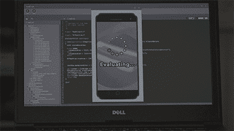
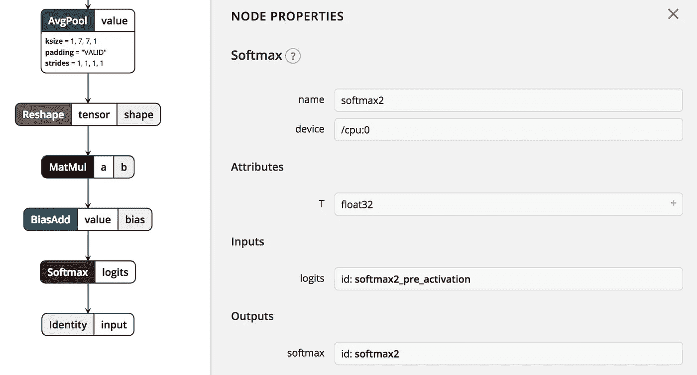
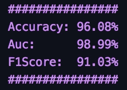

# F#降临节日历——圣诞节分类器

> 原文：<https://towardsdatascience.com/f-advent-calendar-a-christmas-classifier-72fb9e9d8f23?source=collection_archive---------18----------------------->

## 如何使用 F#和 ML 创建图像分类器？网

作为对硅谷和 Jìan-Yáng 的应用程序的赞美，该应用程序可以检测图片中是否包含热狗，我决定实现自己的版本，加入圣诞元素。

Silicon Valley — Hot Dog / Not Hot Dog

我想看看我是否能使用 F#创建一个二进制图像分类器，它能识别一个图像是否包含圣诞老人。

GitHub 上有这方面的代码。

# 数据采集

为了获得用于训练和评估模型的图像，我使用了 [Bing 图像搜索 API](https://azure.microsoft.com/en-gb/services/cognitive-services/bing-image-search-api/) 。

该 API 有助于查询图像，并返回一个 JSON 响应，该响应包括图像元数据和下载它们的 URL。

我使用了 [F#数据 Http 实用程序](http://fsharp.github.io/FSharp.Data/library/Http.html)来查询 API 和下载图像。我还使用了 [JSON 类型提供者](http://fsharp.github.io/FSharp.Data/library/JsonProvider.html)来处理 API 响应。

我总共下载了 1540 张图片——770 张有圣诞老人，770 张没有。

在收集没有圣诞老人的图片时，我搜索了包含可能引起混淆的特征的图片，如“留胡子的老人”和“圣诞精灵”。

下载后，我手动清理了数据集，确保没有图像被错误地标注。

我创建了两个 tsv 文件(`train-images.tsv` 和`test-images.tsv`)，使用 80-20 分割对数据集进行分区。

每个文件都包含图像的相对路径及其标签(`santaclaus` 或`notsantaclaus`)。

F#脚本`1DownloadImageSearchResults.fsx`、`2DownloadImages.fsx`和`3CreateImageTsv.fsx`记录了查询 Bing 图像搜索 API、下载图像以及标记和划分数据的过程。

# ML。网

为了创建分类器，我使用了微软新的机器学习库，[ML.NET](https://dotnet.microsoft.com/apps/machinelearning-ai/ml-dotnet)。

它仍处于早期开发阶段(0.7.0 ),所以功能有限，但很高兴看到机器学习在 F#中变得更容易使用。网！

# 张量流

我希望使用神经网络作为图像分类器，当通读 ML.NET 文档时，我很兴奋地看到它支持 TensorFlow。然而，目前该库仅支持评估预训练模型。

因此，我不能使用 ML.NET 来训练我自己的 TensorFlow 模型，但我可以使用预训练模型的输出作为更传统的机器学习算法的输入。

# 盗梦空间-第三版

Inception-v3 是在 [ImageNet 数据集](http://www.image-net.org/)上训练的卷积神经网络。该网络有 48 层，并试图将图像分类到 ImageNet 中定义的 1000 个类别中的一个。

使用 [Netron](https://github.com/lutzroeder/netron) ，可以查看训练好的模型的结构。这里不能贴全网图片(它有 48 层！)但是对于这个任务，相关部分在网络的输出层。

Inception-v3 Softmax2 Function

上图中的`Softmax2`节点是一个激活函数，它根据 1000 个类获取图像的最终表示，并将其转换为概率分布。

它为每个类别分配一个小数概率，这样我们就可以确定哪个类别最有可能是图像的类别。

在我的图像分类器中，我可以使用 Inception-v3 模型，将输入输入到`Softmax2`节点(`softmax2_pre_activation`)，并将其用作 model 算法的图像特征。

# Model 模式

该模型在`[Program.fs](https://github.com/williamtetlow/ChristmasClassifier/blob/master/ChristmasClassifierConsoleApp/Program.fs)`中定义

`dataLoader`指定了输入数据的模式。

Input Data Schema

然后使用`dataLoader`加载训练和测试数据视图。

Load Training and Test Data

`dataPipeline`指定应该应用于输入 tsv 的变换。

因为这是一个二进制分类，所以我使用了一个自定义映射来将这两个类转换成布尔值— `santaclaus = true`和`notsantaclaus = false`。

Transform Input Data

然后，我使用`modelBuilder`来描述图像如何加载、预处理和用于训练模型的管道。

管道使用输入 tsv 中定义的相对路径加载图像，调整它们的大小，使它们都具有相同的大小，然后提取像素信息，以便可以将它们传递到 Inception-v3 模型中。

Image Loading and Preprocessing

使用`[TensorFlowEstimator](https://docs.microsoft.com/en-us/dotnet/api/microsoft.ml.transforms.tensorflowestimator?view=ml-dotnet)`，流水线加载预训练的 Inception-v3 模型，并输入从之前阶段提取的像素。

我想使用`Softmax2`节点的输入来获取我将在 ML.NET 使用的算法的特征。因此，TensorFlowEstimator 的输出是`softmax2_pre_activation`。

TensorFlow Estimator using Inception-v3

最后一级将 TensorFlowEstimator 的输出传递到来自 ML.NET 的`[StochasticDualCoordinateAscentBinaryClassifier](https://docs.microsoft.com/en-us/dotnet/api/microsoft.ml.legacy.trainers.stochasticdualcoordinateascentbinaryclassifier?view=ml-dotnet)`中，这是一种用于线性二进制分类的算法。

Stochastic Dual Coordinate Ascent Binary Classifier

用`modelBuilder`定义模型后，使用训练数据对其进行训练。

Training the Model

模型只花了几分钟训练。

我用了测试数据和 ML。`[BinaryClassifierEvaluator](https://docs.microsoft.com/en-us/dotnet/api/microsoft.ml.runtime.data.binaryclassifierevaluator?view=ml-dotnet)`内置网络，用于评估模型性能。

在测试集上，该模型给出了 96.08%的准确率

Model Metrics

这是一个非常好的结果，尤其是对于相对较小的数据集！

为了提高准确性，我可以增加数据集的大小，例如操纵图像的方向和缩放。

我还可以研究调整当前算法参数或使用另一种算法是否会返回更好的结果。

该项目的下一步是添加功能，将训练好的模型加载到应用程序中进行预测，这将在另一篇文章中演示(圣诞节前)。

但希望我已经展示了 F#中的机器学习变得越来越容易！

# 参考

[https://github . com/dot net/machine learning/blob/master/docs/code/mlnet cookbook . MD](https://github.com/dotnet/machinelearning/blob/master/docs/code/MlNetCookBook.md)

[https://github.com/dotnet/machinelearning/issues/581](https://github.com/dotnet/machinelearning/issues/581)

[https://github . com/dot net/machine learning-samples/tree/master/samples/cs harp/getting-started/deep learning _ image classification _ tensor flow](https://github.com/dotnet/machinelearning-samples/tree/master/samples/csharp/getting-started/DeepLearning_ImageClassification_TensorFlow)

[https://github . com/dot net/machine learning-samples/tree/master/samples/cs harp/getting-started/deep learning _ image classification _ tensor flow](https://github.com/dotnet/machinelearning-samples/tree/master/samples/csharp/getting-started/DeepLearning_ImageClassification_TensorFlow)

[https://github . com/dot net/machine learning-samples/tree/master/samples/cs harp/getting-started/deep learning _ tensorflow estimator](https://github.com/dotnet/machinelearning-samples/tree/master/samples/csharp/getting-started/DeepLearning_TensorFlowEstimator)

[https://github . com/dot net/machine learning-samples/tree/master/samples/fs harp](https://github.com/dotnet/machinelearning-samples/tree/master/samples/fsharp)