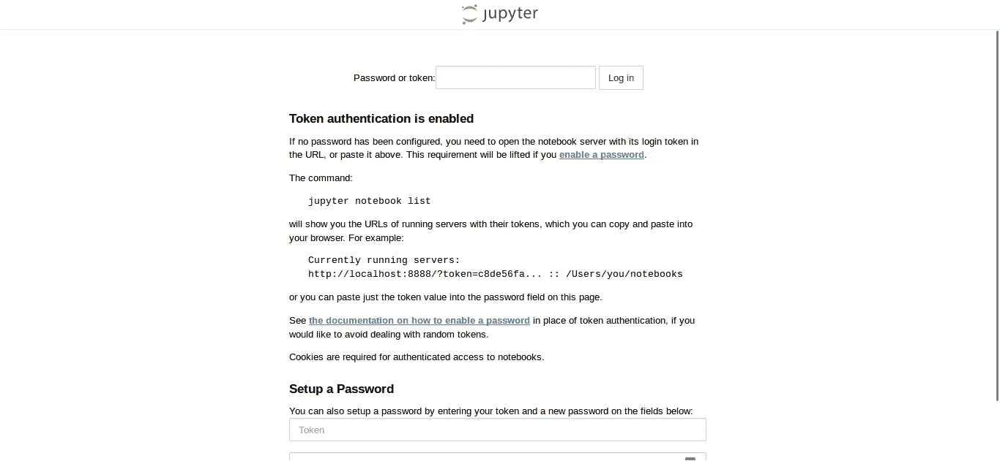
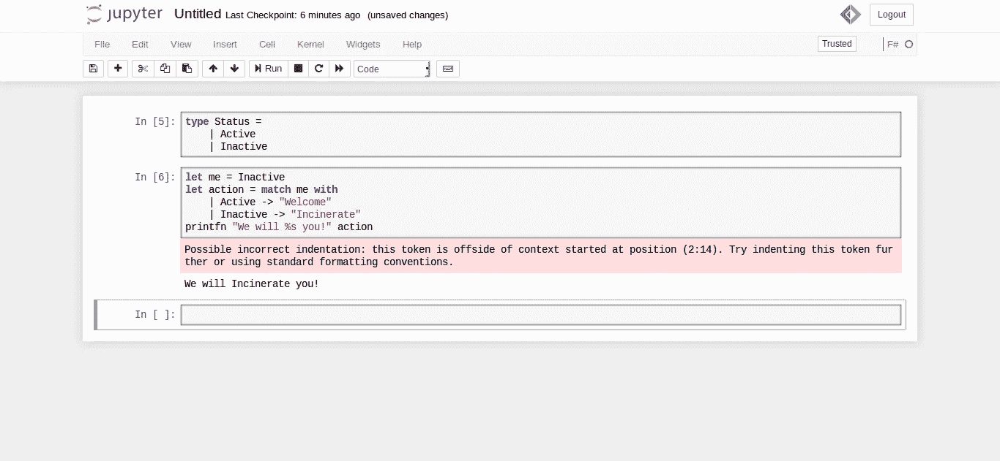

# F#为勉强连接的人设计的笔记本电脑

> 原文：<https://towardsdatascience.com/f-notebooks-for-the-barely-connected-44de0f5b06eb?source=collection_archive---------7----------------------->

## 对于很少上网的人来说。

*最初发布于:*[*https://devstufwithjpada . com/f-notebooks-for-the-barely-connected/*](https://devstuffwithjpada.com/f-notebooks-for-the-barely-connected/)

虽然 Azure notebooks 可能是在 Jupyter 笔记本上进行 F#数据科学实验的最快和最简单的方法，但这只在你总是在线的情况下才有效。如果你在一个第三世界国家(像我一样)，只有断断续续的互联网连接怎么办？你如何在 Jupyter 笔记本上使用 F#?

我们有一个解决方案。但是当然，你需要先上网。之后，您可以随时离线，但仍然可以在您最喜欢的 Jupyter 笔记本上使用您喜欢的 F#进行工作。

# 码头工人来救援了

F#背后的人已经想到了这一点，并为在 Docker 中运行 F#笔记本的[构建了一个](https://github.com/fsprojects/IfSharp#running-inside-a-docker-container) [Dockerfile](https://github.com/fsprojects/IfSharp/blob/master/Dockerfile) 。

## 过程的成本

 [## 在 Docker 上设置 F#笔记本

### 这里发生了什么事？首先，IfSharp 回购被克隆。然后我们进入 IfSharp 目录。然后我们建造…

asciinema.org](https://asciinema.org/a/AGdxx2ROXS20smWMbH809rgFu) 

## 那么我们如何做到这一点呢？

1.  首先， [IfSharp repo](https://github.com/fsprojects/IfSharp) 克隆。
2.  然后我们进入`IfSharp`目录。
3.  然后我们用`docker build -t ifsharp:3.0.0-alpha .`从`Dockerfile`构建 Docker 映像
4.  然后，我们使用`docker run -d -v your_local_notebooks_dir:/notebooks -p your_port:8888 ifsharp:3.0.0-alpha`运行映像。更改端口和笔记本位置。
5.  之后，我们使用`docker ps`来查看运行的容器。我们复制正在运行的容器的 id。
6.  我们用`docker exec -it the-container-id /bin/bash`打开运行容器内的 bash shell。用我们复制的容器 id 替换“the-container-id”。
7.  运行`jupyter notebook list`查看运行中的笔记本。将令牌复制到 URL 的`?token=`部分之后。
8.  在`localhost`中打开笔记本，粘贴令牌以访问笔记本。

打开笔记本后，我们看到了这个:

Jupyter Authentication Page

这是我们粘贴之前复制的令牌的位置。将其粘贴在顶部并按下`Log in`。

恭喜你！您现在可以像这样创建 F#笔记本:

Some F# code I wrote on the local F# Jupyter notebook.

> 现在，即使离线，你也可以在 Jupyter 笔记本上做 F#实验！耶！