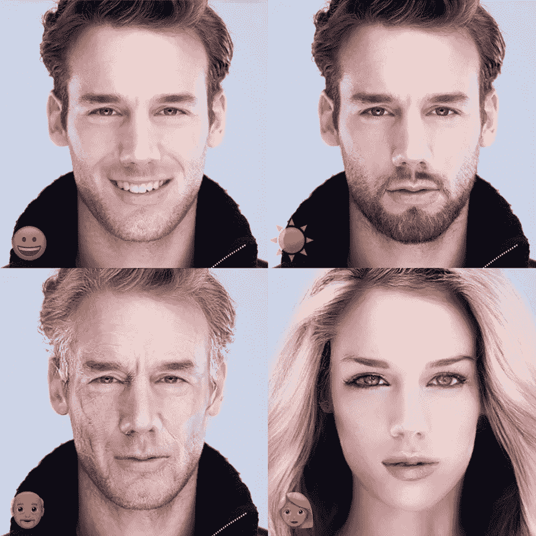
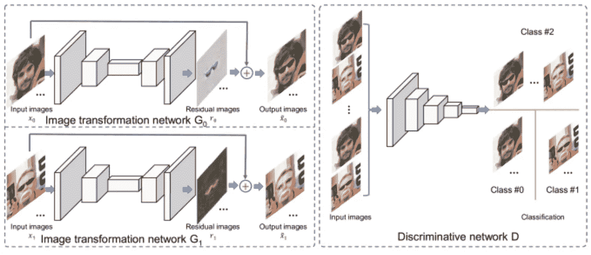
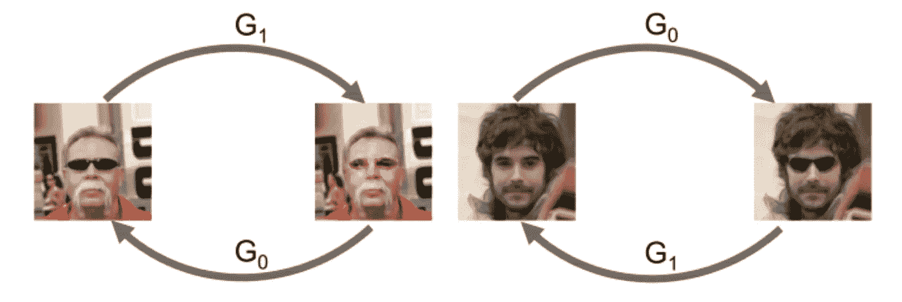

# 使用 GANs 的人脸属性操作

> 原文：<https://towardsdatascience.com/face-attribute-manipulation-using-gans-9fae92e9f1c3?source=collection_archive---------8----------------------->

添加面部属性，如胡须，小胡子，性别变化等。由于所涉及的复杂性，在图像编辑中是一项具有挑战性的任务。像**生成式广告串行网络**这样的现代深度学习算法有助于解决这个问题，而不需要人工编辑。

# **进场**

我们的目标是根据给定的属性值修改人脸图像。我们建议**学习相应的残差图像**，而不是处理整个图像，残差图像被定义为处理前后图像之间的差异。

在这里，您可以看到由变换网络 G0 和 G1 生成的残差图像，它与原始图像相加以获得输出。

> 这种方法的动机是面部属性操作通常只需要适度修改特定于属性的面部区域，而其他部分保持不变。

# 图像变换网络

给定 **x0 =具有负属性值**的人脸图像和 **x1 =具有正属性值**的人脸图像，学习网络 G0 和 G1 应用操作变换以产生**残差图像 r0 和 r1** 。

**然后将残差图像添加到输入图像中作为最终输出。**

**输出=输入+残差。**

# 区别网络

判别网络是一个三类分类器，它将图像从不同类别中分类出来:

1.  从 G0 和 G1 生成的图像(变换图像)，
2.  具有正属性标签的图像(真实图像)，
3.  以及带有负属性标签的图像(实像)。

给定已知属性**标签** **0 和标签 1** 的**实像 x0 和 x1** ，我们将**变换后的图像**视为标签为 **2** 的额外类别。

# **双重学习**

双重学习的机制可以看作是一个两人的交流游戏。

对于给定的具有负属性值的图像 **x0，我们通过 **G0** 传递它。获得的图像然后被馈送到 **G1** 。由于 G0 和 G1 分别是原始任务和双重任务，**来自 G1** 的输出预期具有与 **x0** 相同的属性值。**类似的过程也适用于 x1。****

> 产生的图像 G1(G0(x0)) = x0
> 
> 产生的图像 G1(G0(x1)) = x1

## 双重学习的有效性在于

1)从两个生成器生成的图像增加了训练样本的数量。

2)在双重学习阶段，G1(G0(x0))和 G0(G1(x1))的地面真实图像是已知的，这简化了两个生成器的训练。

# 参考

学习残差图像进行人脸属性操作—[https://arxiv.org/abs/1612.05363](https://arxiv.org/abs/1612.05363)