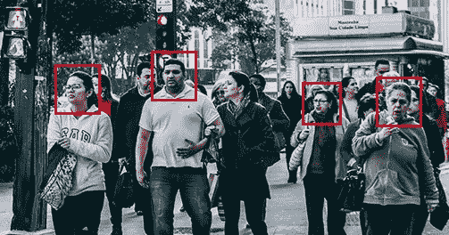
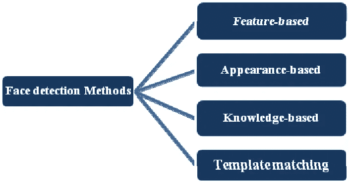
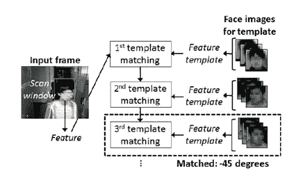
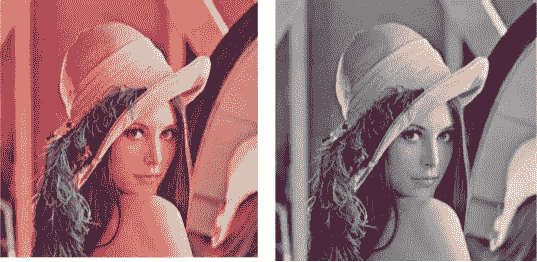
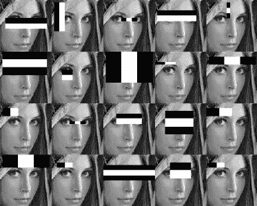
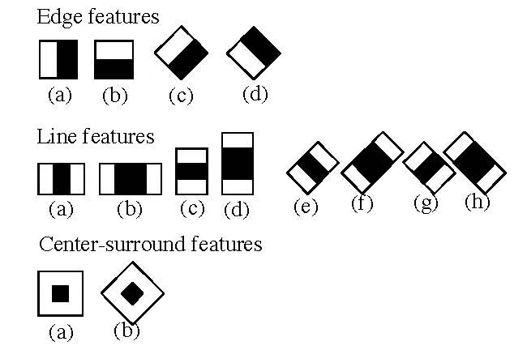
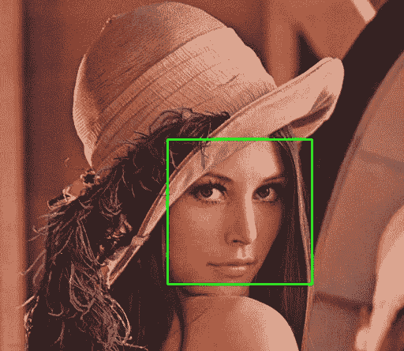

# 面向初学者的人脸检测

> 原文：<https://towardsdatascience.com/face-detection-for-beginners-e58e8f21aad9?source=collection_archive---------0----------------------->



Multiple face detection in an image

在过去的几年里，人脸识别被认为是图像分析领域最有前途的应用之一。人脸检测可以考虑人脸识别操作的实质部分。根据其强度将计算资源集中在图像中包含人脸的部分。图片中的人脸检测方法是复杂的，因为人脸之间存在可变性，例如姿势、表情、位置和方向、肤色、眼镜或胡须的存在、相机增益的差异、光照条件和图像分辨率。

目标检测是计算机技术的一种，它与图像处理和计算机视觉相结合，它与检测目标的实例如人脸、建筑物、树木、汽车等相互作用。人脸检测算法的主要目的是确定图像中是否有人脸。

近年来，在人脸识别和人脸检测领域提出了许多研究工作，以使其更加先进和准确，但 Viola-Jones 推出的实时人脸检测器使这一领域发生了一场革命，它能够以高精度实时检测人脸。

人脸检测是人脸识别的首要步骤，用于检测图像中的人脸。它是目标检测的一部分，可用于许多领域，如安全、生物计量、执法、娱乐、个人安全等。

它用于实时检测人脸，以监视和跟踪人或物体。它被广泛应用于相机中，以识别移动相机和 DSLR 相机中的多个画面。脸书还使用人脸检测算法来检测图像中的人脸并进行识别。

# ***人脸检测方法:-***

Yan，Kriegman 和 Ahuja 提出了人脸检测方法的分类。这些方法分为四类，人脸检测算法可以属于两类或更多类。这些类别如下-



Different types of Face Detection Methods

# ***1。知识型:-***

基于知识的方法依赖于规则集，并且它基于人类的知识来检测人脸。一张脸必须有一个鼻子、眼睛和嘴巴，它们之间的距离和位置一定。这些方法的最大问题是难以建立一套合适的规则。如果规则太笼统或太详细，可能会有许多误报。这种方法本身是不够的，并且不能在多幅图像中找到许多人脸。

# ***2。基于特征:-***

基于特征的方法是通过提取人脸的结构特征来定位人脸。它首先被训练为分类器，然后用于区分面部和非面部区域。这个想法是为了克服我们对面孔的本能认识的局限性。这种方法分为几个步骤，甚至许多人的照片，他们报告的成功率为 94%。

# ***3。模板匹配:-***

模板匹配方法使用预定义或参数化的人脸模板，通过模板和输入图像之间的相关性来定位或检测人脸。人脸可以分为眼睛、面部轮廓、鼻子和嘴巴。此外，通过使用边缘检测方法，可以由边缘建立人脸模型。这种方法实现起来很简单，但是对于人脸检测来说是不够的。然而，已经提出了可变形模板来处理这些问题。



Template Matching

# ***4。基于外观:-***

基于外观的方法依赖于一组代表性的训练人脸图像来找出人脸模型。基于外观的方法优于其他表现方式。一般来说，基于外观的方法依赖于来自统计分析和机器学习的技术来寻找人脸图像的相关特征。这种方法也用于人脸识别的特征提取。

基于外观的模型进一步划分为用于面部检测的子方法，如下所述

## ***4.1 .基于特征脸:-***

用于人脸识别的基于特征脸的算法，是一种使用主成分分析有效表示人脸的方法。

## ***4.2 .基于分配:-***

像 PCA 和 Fisher 判别式这样的算法可以用来定义表示面部模式的子空间。有一个经过训练的分类器，它从背景图像模式中正确地识别目标模式类的实例。

## ***4.3 .神经网络:-***

许多检测问题，如物体检测、人脸检测、情感检测和人脸识别等。已经被神经网络成功地解决了。

## ***4.4 .支持向量机:-***

支持向量机是线性分类器，可以最大化决策超平面和训练集中的样本之间的差距。Osuna 等人首先将该分类器应用于人脸检测。

## ***4.5 .稀疏网络的风选:-***

他们定义了两个线性单元或目标节点的稀疏网络；一个代表人脸图案，另一个代表非人脸图案。它耗时少，效率高。

## ***4.6 .朴素贝叶斯分类器:-***

他们通过计算一系列模式在训练图像中出现的频率，计算出一张脸出现在照片中的概率。分类器捕获人脸的局部外观和位置的联合统计。

## ***4.7 .隐马尔可夫模型:-***

模型的状态是面部特征，通常被描述为像素带。HMM 通常与其他方法一起用于构建检测算法。

## ***4.8 .信息论方法:-***

马尔可夫随机场(MRF)可以用于人脸模式和相关特征。马尔可夫过程使用 Kullback-Leibler 散度来最大化类别之间的区分。因此，该方法可用于人脸检测。

## ***4.9 .归纳学习:-***

这种方法已经被用于检测人脸。像 Quinlan 的 C4.5 或 Mitchell 的 FIND-S 这样的算法用于此目的。

# 人脸检测的工作原理

检测人脸的技术有很多，借助这些技术，我们可以以更高的准确率识别人脸。这些技术对于人脸检测有着几乎相同的步骤，如 OpenCV、神经网络、Matlab 等。面部检测工作就像检测图像中多个面部一样。我们在 OpenCV 上进行人脸检测，人脸检测的操作步骤如下-

首先，通过提供图像的位置来导入图像。然后将图片从 RGB 转换为灰度，因为在灰度中很容易检测到人脸。



Converting RGB image to Grayscale

之后，使用图像处理，如果需要的话，对图像进行尺寸调整、裁剪、模糊和锐化。下一步是图像分割，用于轮廓检测或分割单幅图像中的多个对象，以便分类器可以快速检测图片中的对象和人脸。

下一步是使用由 Voila 和 Jones 提出的 Haar-Like 特征算法进行人脸检测。这种算法用于在帧或图像中寻找人脸的位置。所有人脸都具有人脸的一些普遍属性，如眼睛区域比其相邻像素暗，鼻子区域比眼睛区域亮。



Haar-like features for face detection

借助于边缘检测、线检测、用于检测眼睛、鼻子、嘴等的中心检测，haar-like 算法也用于图像中对象的特征选择或特征提取。图中。它用于选择图像中的基本特征，并提取这些特征用于人脸检测。

下一步是给出 x，y，w，h 的坐标，这在图片中形成一个矩形框来显示人脸的位置，或者我们可以说是显示图像中感兴趣的区域。在此之后，它可以在感兴趣的检测人脸的区域制作一个矩形框。还有许多其他检测技术一起用于检测，例如微笑检测、眼睛检测、眨眼检测等。



Successfully detect the face in an image

# 如何实时运行人脸检测器(网络摄像头):-

运行代码的要求- Python，OpenCV，网络摄像头，Numpy。

```
***#import libraries*** import cv2
import numpy as np**#import classifier for face and eye detection**
face_classifier = cv2.CascadeClassifier(‘Haarcascades/haarcascade_frontalface_default.xml’)***# Import Classifier for Face and Eye Detection*** face_classifier = cv2.CascadeClassifier(‘Haarcascades/haarcascade_frontalface_default.xml’)
eye_classifier = cv2.CascadeClassifier (‘Haarcascades/haarcascade_eye.xml’)
def face_detector (img, size=0.5):***# Convert Image to Grayscale*** gray = cv2.cvtColor (img, cv2.COLOR_BGR2GRAY)
faces = face_classifier.detectMultiScale (gray, 1.3, 5)
If faces is ():
return img***# Given coordinates to detect face and eyes location from ROI*** for (x, y, w, h) in faces
x = x — 100
w = w + 100
y = y — 100
h = h + 100
cv2.rectangle (img, (x, y), (x+w, y+h), (255, 0, 0), 2)
roi_gray = gray[y: y+h, x: x+w]
roi_color = img[y: y+h, x: x+w]
eyes = eye_classifier.detectMultiScale (roi_gray)
for (ex, ey, ew, eh) in eyes:
cv2.rectangle(roi_color,(ex,ey),(ex+ew,ey+eh),(0,0,255),2)
roi_color = cv2.flip (roi_color, 1)
return roi_color***# Webcam setup for Face Detection*** cap = cv2.VideoCapture (0)
while True:
ret, frame = cap.read ()
cv2.imshow (‘Our Face Extractor’, face_detector (frame))
if cv2.waitKey (1) == 13: #13 is the Enter Key
break***# When everything done, release the capture*** cap.release ()
cv2.destroyAllWindows ()
```

> 这个博客是为那些想通过学习什么是人脸检测，它的类型，以及它是如何工作的来开始他们在计算机视觉或人工智能领域的事业的初学者准备的。